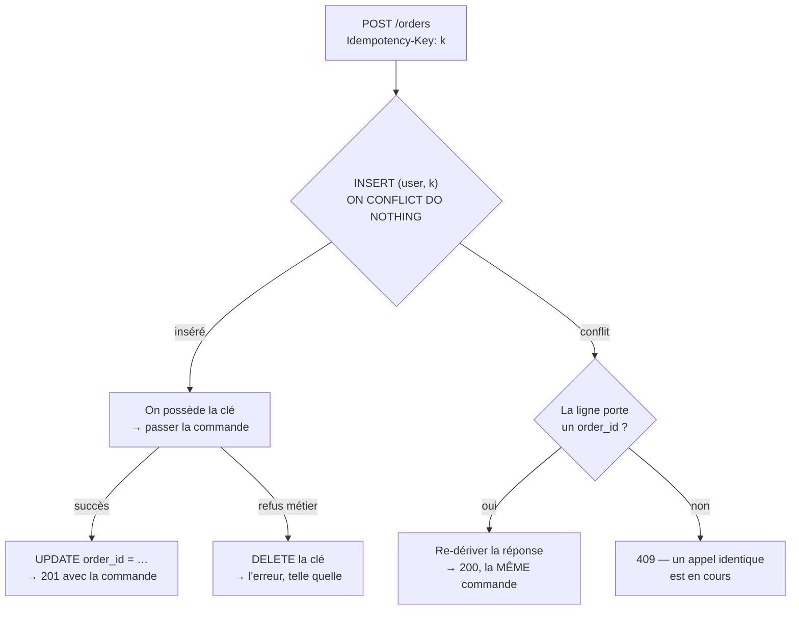

# Passer une commande deux fois ne doit en créer qu'une

> **État : plan.** Écrit le 2026-09-07. Lot 2 (seconde moitié) de
> [`audit-flux-de-commande.md`](audit-flux-de-commande.md) — défaut **T12**.
> Rien n'est codé tant que ce document n'a pas été contredit.

---

## 1. Le défaut, en une phrase

`POST /orders` n'a **ni clé d'idempotence, ni clé naturelle, ni déduplication** :
un double clic, un rejeu réseau ou un retour arrière du navigateur crée **deux
commandes et deux intentions Stripe**.

La fenêtre est exactement la durée de l'appel — et cet appel est long : il
ré-résout les prix de chaque ligne, lit l'heure limite, résout l'acheminement,
puis attend Stripe. Le panier n'est vidé qu'après la réponse.

**Ce que ça coûte.** Deux commandes au fournil pour un client qui en voulait
une, et deux intentions de paiement dont une restera ouverte pour toujours. Le
client, lui, verra deux lignes dans « Mes commandes » et appellera.

---

## 2. Ce qu'on ne fait pas, et pourquoi

**Une clé naturelle** — `(userId, lignes, date, acheminement)` hachées. Séduisant
parce que sans table. Rejeté : un client a le droit de commander deux fois la
même chose le même jour, et un système qui le lui refuse est plus faux que celui
qui accepte un doublon.

**Un verrou côté navigateur** (bouton désarmé pendant l'appel). Nécessaire mais
pas suffisant, et surtout pas une garantie : il ne couvre ni le rejeu réseau, ni
le retour arrière, ni un second onglet, ni un client qui n'est pas le nôtre.
C'est un confort d'écran, pas une propriété du système. On le fait **aussi**,
sans compter dessus.

**Une déduplication par fenêtre de temps** (« pas deux commandes identiques en
30 s »). Rejeté pour la même raison que la clé naturelle, plus une : une règle
dont le résultat dépend de l'horloge et de la charge n'est pas explicable au
client à qui elle refuse une commande.

---

## 3. Ce qu'on fait : une clé fournie par l'appelant, arbitrée par la base

### 3.1 La table

```prisma
model OrderIdempotency {
  id String @id @default(cuid())

  /// AU NOM DE QUI la clé a été posée. Le mur de l'idempotence : une clé n'est
  /// jamais partagée entre deux personnes, sinon deviner la clé d'un autre
  /// suffirait à lire sa commande.
  userId String @map("user_id")

  /// La clé, telle que l'appelant l'a envoyée.
  key String

  /// La commande qui en est sortie, ou NULL — l'appel est encore en vol.
  orderId String? @map("order_id")

  createdAt DateTime @default(now()) @map("created_at")

  @@unique([userId, key])
  @@map("order_idempotency")
  @@schema("public")
}
```

Pas de clé étrangère vers `orders` : la ligne se pose **avant** que la commande
existe, et une contrainte qu'on ne peut pas honorer au moment où on écrit n'est
pas une contrainte.

**Ce qu'on ne stocke pas : la réponse.** Ni `clientSecret`, ni total, ni rien du
corps. Un secret de paiement n'a rien à faire dans notre base — c'est déjà la
règle de `GetOrderPaymentHandler`, qui redemande le secret au prestataire plutôt
que de le laisser vieillir dans une colonne. Sur un rejeu, la réponse est donc
**re-dérivée** : on relit la commande, et si elle attend une carte on redemande
son intention à Stripe (`retrieveIntent`, qui existe).

### 3.2 Le protocole, en trois issues



**Pourquoi `INSERT` d'abord et pas « lire puis écrire ».** Deux requêtes
simultanées qui lisent avant d'écrire trouvent toutes deux la table vide et
passent toutes deux la commande. C'est la base qui doit arbitrer, et c'est
l'index unique qui le fait — le même raisonnement que `markHandedOver`, où le
`handedOverAt: null` du WHERE fait que deux scans du même QR produisent
exactement une remise.

**Pourquoi la clé se LIBÈRE sur un refus métier.** Une commande refusée parce que
l'heure limite est passée, ou parce qu'un SKU a disparu, doit pouvoir être
corrigée et renvoyée. Si la clé restait prise, la seconde tentative recevrait
`409 en cours` pour l'éternité, et le client serait bloqué par le mécanisme censé
le protéger. La clé est **claimée au début, résolue au succès, rendue à l'échec**.

**Pourquoi `409` et pas une attente.** Quand la ligne existe sans résultat, un
appel identique est en vol. Attendre demanderait de scruter la base en boucle
dans le fil d'une requête HTTP. Un `409` dit la vérité — « celle-ci est déjà en
train de passer » — et l'écran sait quoi en faire : ne rien renvoyer, et regarder
« Mes commandes ».

### 3.3 Où le garde se pose

**Tout au début de `execute`, avant le mur de membre et avant `OrderDrafting`.**
Pas au milieu : `PlaceOrderHandler` crée l'intention Stripe **avant** de
persister la commande, donc un garde posé après la composition laisserait déjà
passer une seconde intention.

Il vit comme un **service applicatif** (`OrderIdempotency`) devant un **port**
(`OrderIdempotencyStore`), pour la même raison que tout le reste : le handler
n'a pas à connaître Prisma.

### 3.4 La clé côté appelant

Un en-tête `Idempotency-Key`, comme Stripe et comme tout le monde. Le navigateur
la fabrique avec `crypto.randomUUID()` **une fois par tentative de passation**,
et la garde tant que la commande n'a pas abouti : c'est ce qui fait qu'un rejeu
est un rejeu, et qu'une commande corrigée est une nouvelle commande.

**Sans en-tête, la route se comporte comme avant.** C'est un choix, et il se
défend : rendre la clé obligatoire casserait tout appelant existant (les tests
e2e, un script, une intégration future) pour un défaut qui ne concerne que le
navigateur. Le front, lui, l'envoie toujours.

> ⚠️ **La contrepartie est réelle** : une route dont la protection est
> facultative n'est pas protégée, elle est protégée _quand on y pense_. La porte
> qui rattrape l'oubli n'existe pas ici — c'est le point que la contradiction
> doit regarder en premier.

### 3.5 Les deux portes, pas une

`POST /admin/orders` a exactement le même défaut, et un commercial au téléphone
qui clique deux fois est au moins aussi probable qu'un client. Le service est
partagé ; brancher la seconde porte coûte trois lignes. Le mur y porte sur
`staffUserId`, qui est l'acteur — jamais sur l'acheteur.

---

## 4. Ce que la migration fait, et ce qu'un retour arrière demanderait

**Purement additive.** Une table neuve, aucune colonne touchée, aucune donnée
réécrite, aucune contrainte posée sur une table existante.

**Le retour arrière est un `DROP TABLE`.** Le code d'avant n'a jamais lu cette
table, et le code d'après n'écrit dans `orders` rien qui en dépende : une
commande passée avec idempotence est une commande ordinaire.

**Elle naît vide**, et le restera pour toute commande passée sans en-tête.

**Ce qu'elle ne fait pas** : elle ne déduplique **pas** l'existant. Les doublons
déjà en base y restent — les retirer serait une correction de données, pas une
migration, et personne ne peut dire depuis un `SELECT` lequel de deux jumeaux le
client voulait.

---

## 5. Ce qui reste ouvert après ce lot

- **La purge.** Les lignes s'accumulent, une par commande. Elles sont minuscules
  (deux `TEXT` et une date), mais elles n'ont pas de fin. Aucun travail
  périodique n'existe dans cette API — il n'y a ni `@Cron` ni planificateur —,
  donc ce lot n'en invente pas un. À nommer comme chore d'exploitation.
- **Le second onglet.** Deux onglets ouverts sur le même panier fabriquent deux
  clés différentes, donc deux commandes. C'est correct au sens strict — ce sont
  deux tentatives distinctes — et c'est probablement faux au sens du client. Hors
  périmètre, et à documenter comme tel.
- **La reprise du `clientSecret`.** Sur un rejeu d'une commande à régler, on
  redemande l'intention à Stripe : un aller-retour réseau de plus sur un chemin
  rare. Assumé.

---

## 6. Ce que la contradiction a changé

> `vitruve` a rendu **cinq bloquants et sept réserves** sur les §1 à §5. Elles ne
> sont pas réécrites — c'est le plan tel qu'il a été soumis, et c'est lui qui
> explique pourquoi le dessin final est celui-là. Ce §6 est le plan **retenu**.
> En cas de désaccord entre les deux, **c'est le §6 qui fait foi**.

### 6.1 La clé entre par le CONTRAT, plus par un en-tête

Le §3.4 posait un en-tête **facultatif** et justifiait ce choix par le coût de
reprise des appelants. La contradiction a recompté : **52 appels** à
`POST /orders` dans 7 fichiers e2e, et rien d'autre — pas de script, pas
d'intégration tierce. Le « coût prohibitif » était un `sed` dans notre propre
dépôt, opposé à une faiblesse permanente.

La clé est donc un **champ de `placeOrderPayloadSchema`**, et non un en-tête :

```ts
idempotencyKey: z.string().uuid(),
```

Trois choses tombent d'un coup. Un appel sans clé devient **inexprimable** — le
compilateur refuse le front, Zod refuse la frontière. L'en-tête vide, qui aurait
posé une ligne `(userId, "")` bloquant à jamais la deuxième commande d'un client,
n'existe plus comme état. Et une clé non bornée — 16 Ko d'en-tête envoyés dans un
index btree qui refuse au-delà de 2704 octets, donc un 500 — devient impossible :
un UUID a 36 caractères, et la borne est dans le type.

C'est le barreau que la hiérarchie du dépôt demande : **inexprimable** plutôt que
vérifié.

### 6.2 La clé se résout DANS la transaction qui écrit la commande

Le §3.2 résolvait la clé après coup (`INSERT` → travail → `UPDATE`). Deux
défauts, et le second est le pire :

- un crash entre les deux — déploiement, `SIGTERM`, timeout — laissait une clé
  sans résultat, donc un **`409` permanent** sur une clé que le front rejoue
  indéfiniment ;
- pire, dans ce cas la commande **existe** : reprendre la clé plus tard en
  aurait passé une seconde. La dérogation d'heure limite étant déjà consommée
  (`waivers.consume` s'exécute après `place`), le client aurait alors reçu « il
  est trop tard » — le message écrit exprès pour ne PAS renvoyer au téléphone —
  pour une commande passée.

`OrderRepository.place` écrit donc la commande **et** la résolution de la clé
dans **une seule transaction**. Il n'existe plus d'état « la commande existe,
la clé n'est pas résolue » : ni l'un ni l'autre, ou les deux.

Conséquence directe : le seul intervalle de crash restant est celui où **rien**
n'a été écrit. Une reprise y est donc toujours sûre.

### 6.3 La clé se rend, et sinon elle se périme

Le §3.2 libérait « sur refus métier ». La contradiction montre que ce n'est pas
un discriminant : `DuplicateResourceError` et `RelatedResourceMissingError` sont
des `BusinessError` **levées par la persistance**, donc de part et d'autre du
point de non-retour.

Le discriminant n'est pas la nature de l'erreur, c'est sa **position** :

- une erreur levée **avant** `orders.place` — heure limite, SKU inconnu, zone non
  desservie, mur de membre — **rend la clé**. Rien n'a été écrit, et le client
  doit pouvoir corriger et renvoyer ;
- une erreur levée **à partir de** `place` ne rend rien. La transaction du §6.2 a
  tranché ce qui existe.

Reste le crash, qui ne lève rien du tout. Un **bail de deux minutes** le couvre :
une clé réclamée mais non résolue depuis plus longtemps est réputée abandonnée,
et la tentative suivante la **reprend**. C'est sûr précisément parce que §6.2
garantit qu'aucune commande n'a pu être écrite sous une clé non résolue.

Pas de tâche périodique, donc : la reprise se fait à la lecture, par celui que ça
intéresse. L'API n'a aucun planificateur, et ce lot n'en invente pas un.

### 6.4 Une clé réutilisée avec un autre panier est REFUSÉE, pas honorée

Le §3.1 ne gardait aucune empreinte du corps. La contradiction déroule le chemin :
le client reçoit `409`, corrige son panier, rejoue **la même clé** — et reçoit
`200` avec l'**ancienne** commande, après quoi le front vide le panier corrigé et
affiche les lignes du nouveau panier sur la commande de l'ancien. La correction
est perdue en silence, et l'écran ment sans qu'aucune erreur ne se lève.

La table garde donc une **empreinte** du panier demandé. Une clé rejouée avec un
corps différent rend **422**, ce qui est exactement ce que fait le protocole dont
le §3.4 se réclamait.

### 6.5 `POST /admin/orders` sort du périmètre

Le §3.5 annonçait « trois lignes ». Faux, et pour une raison qui n'est pas de
volume : `AdminPlacedOrderResponse` porte `settlement` (`"account" | "link"`), et
**rien en base ne le stocke**. Un rejeu ne peut donc pas le re-dériver — pire, il
le dériverait **faux** dans un cas réel : un règlement par lien sur un total nul
tombe en `not_required`, et toute re-dérivation dirait « account » là où la
réponse d'origine disait « link ».

Le champ qui décide de l'écran serait le champ que le rejeu invente.

Ce lot ne touche donc **que `POST /orders`**. La porte staff garde son défaut, et
il est nommé : elle demande soit de persister `settlement`, soit de le dériver
d'un fait que la commande porte déjà. C'est une décision de modèle, pas un
branchement.

**Bénéfice de bord** : la colonne `user_id` ne porte plus qu'une seule
population — des `users.id` — au lieu de mélanger sans discriminant des
identifiants clients et des identifiants staff, qui viennent de deux annuaires
dont un n'a délibérément pas de clé étrangère. Elle peut donc **porter la sienne**.

### 6.6 Les trois décisions mineures, tranchées

- **Le statut reste `201`.** Faire varier 200/201 imposerait un
  `@Res({ passthrough: true })` — motif employé deux fois dans l'API, pour du
  téléchargement de fichier — pour une distinction qu'aucun appelant ne lit.
- **La clé survit au rechargement.** Elle est écrite à côté du panier
  (`local-store`), pas tenue dans un signal : le §1 promet de couvrir le retour
  arrière du navigateur, et une clé perdue au rechargement ne le couvre pas.
- **Le `409` ne s'affiche pas comme une panne.** Il porte un code propre, et le
  front le reconnaît : le client dont la commande est en train de passer ne doit
  pas lire « La commande n'a pas pu être passée ».

### 6.7 Ce que la contradiction a trouvé et qui dépasse ce lot

> 🔴 **Le `CLAUDE.md` de la racine fait ZÉRO octet.** Vérifié. Les règles que ce
> plan est censé respecter — la hiérarchie des garde-fous, la matrice des
> frontières, le port du temps — ne sont opposables **nulle part** : seuls les
> deux fronts ont le leur. Ce n'est pas un défaut de ce lot, c'est le sol sous
> tous les autres. À traiter avant le prochain plan.
