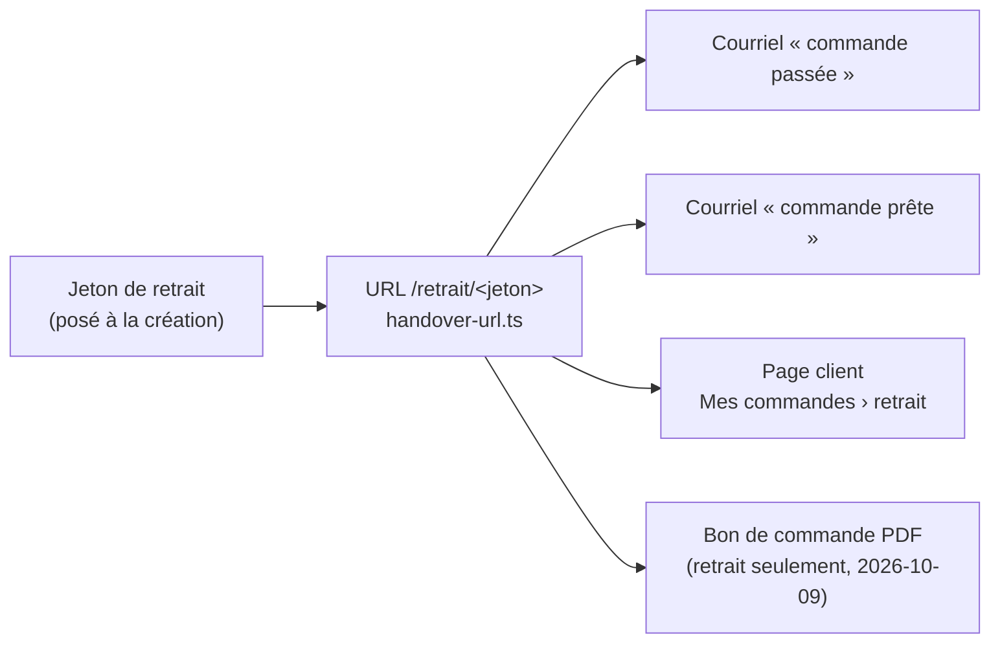
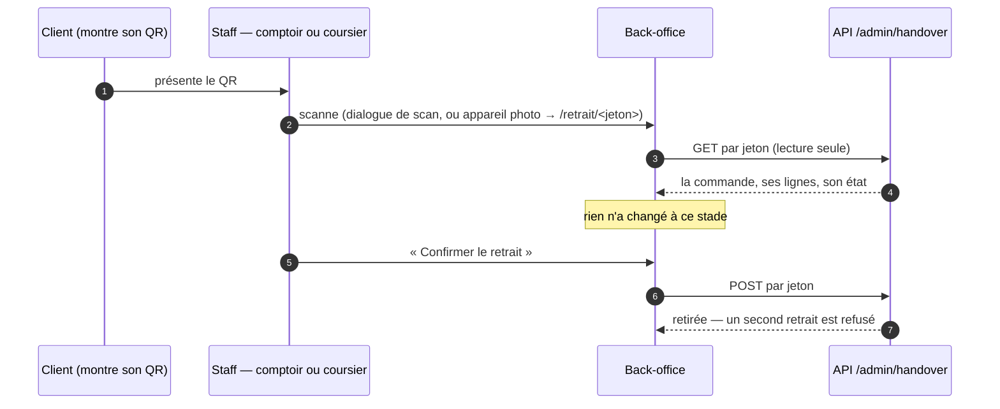

# La vie du QR d'une commande

> État relu dans le code le 2026-10-09. Décrit l'existant ; ne conçoit rien.
> Le QR dans le bon de commande PDF est en cours de construction ce jour-là
> (`plan-bon-public.md`) : il encode le même jeton, par la même fabrique.

## La règle, et jusqu'où elle tient

**Une commande a UN QR**, et **le scan ne change rien tout seul** : c'est le
geste fait sur l'écran (« Confirmer le retrait ») qui change l'état.

| Promesse                           | Tient ?                                                                                                                  |
| ---------------------------------- | ------------------------------------------------------------------------------------------------------------------------ |
| Un seul QR par commande            | ✅ un jeton par commande, une URL                                                                                        |
| Le scan seul ne change pas l'état  | ✅ pour la commande (bouton obligatoire) — ⚠️ pas pour le **bac** de livraison, voir §4                                  |
| L'écran décide de ce qu'on en tire | ⚠️ en partie : l'URL contient le mot `retrait`, donc ouverte à l'appareil photo, elle mène toujours à l'écran du retrait |

Les autres codes qu'on croise en cuisine ou au chargement **ne sont pas des QR
de commande** : un bac porte plusieurs commandes, une fiche de production porte
une référence de production.

## 1. Naissance : un jeton à la création

Le jeton est tiré à la création de la commande, une fois, et ne change jamais
(`apps/lfd-api/src/b2b/orders/infrastructure/prisma-order.repository.ts`,
`issuesHandoverToken()` vrai pour toute commande —
`b2b/orders/domain/services/handover.ts`). Aucune autre écriture de
`handover_token` n'existe.

Le QR encode une URL **du back-office** : `{ADMIN_BASE_URL}/retrait/{jeton}`,
fabriquée en un seul endroit (`b2b/orders/domain/services/handover-url.ts`).
C'est l'équipe qui le scanne, pas le client. Sans origine admin configurée, aucun
QR n'est imprimé.

## 2. Où il voyage

Le client le montre ; il ne s'en sert jamais lui-même.

## 3. Qui le scanne, et ce qui se passe

- **Il faut être deux.** Les routes sont derrière la porte staff
  `handover_counter` (`apps/lfd-api/src/handover/http/handover.controller.ts`) :
  sans session staff, le QR n'ouvre rien. C'est ce qui fait du scan une preuve —
  le client ne peut pas attester son propre retrait.
- **Comptoir et livraison passent par la même porte** : à la porte du client, le
  coursier scanne le QR du courriel avec sa session staff.
- **Le dialogue de scan** (`apps/lfd-backoffice-frontend/src/app/handover-shop/scan-dialog/`)
  lit `/retrait/<jeton>` ou un jeton tapé à la main, affiche la commande, refuse
  un écart avec la commande attendue, puis attend le clic.
- **L'appareil photo** ouvre `/retrait/<jeton>` (garde
  `handover_counter:write`) : la page lit, et n'écrit qu'au bouton.

## 4. Les codes qui ne sont PAS le QR d'une commande

| Code                          | Encode                   | Porté par                         | Ce que fait le scan                                                                                                                                                   |
| ----------------------------- | ------------------------ | --------------------------------- | --------------------------------------------------------------------------------------------------------------------------------------------------------------------- |
| QR de **bac**                 | `/livraison/bac/<binId>` | un contenant, plusieurs commandes | ⚠️ **au chargement d'une tournée, le scan charge le bac sans confirmation** (`livraison/loading-round/`) ; ouvert à l'appareil photo, la page lit et charge au bouton |
| Code court de bac             | 6 caractères, tapés      | le même bac                       | même chose que le QR de bac                                                                                                                                           |
| QR de **fiche de production** | `/colisage/<référence>`  | la fiche imprimée du fournil      | ouvre le poste de colisage sur cette référence                                                                                                                        |

Le dialogue de scan du retrait refuse un QR de bac (« lecture impossible » — le
message ne dit pas que c'est un bac), et le chargement refuse un QR de commande.

## 5. Ce qui reste ouvert

- Le chargement d'une tournée charge un bac **au scan**, sans clic : c'est
  assumé dans le code (« c'est le geste »), mais c'est la seule exception à la
  règle « l'écran demande une confirmation ».
- Le QR nomme le geste (`/retrait/…`) : un identifiant neutre laisserait chaque
  écran décider seul. Le changer casserait les QR déjà envoyés par courriel.
- Le message du dialogue de retrait devant un QR de bac pourrait le nommer.
