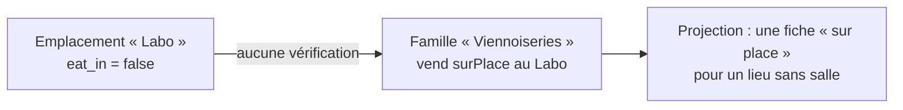

# C0-d — la matrice de canaux pilotée par la donnée

> **État : 🟢 les quatre tranches sont livrées** (d-0 à d-3, 2026-08-26). Ce
> document garde le raisonnement ; ce qui reste ouvert est repris dans
> [`point-de-vente.md`](./point-de-vente.md).
>
> _Note d'origine, doc-first._ Elle tranche quatre choses :
> où va le drapeau `b2b`, sous quelle **forme** la matrice se stocke, quel
> **prérequis** l'examen a fait apparaître, et pourquoi le contexte B2B doit
> être **ineffaçable**.

## 1. Pourquoi maintenant : la promesse de C0 est fausse

C0 a été livré avec une promesse écrite : **« ajouter un contexte de vente =
une ligne, zéro code »**. Elle ne tient pas. Insérer une quatrième ligne dans
`pim.sales_context` produit ceci :

```ts
// prisma-sales-context.registry.ts
const CHANNEL_KEYS: readonly SalesChannelKey[] = ["emporter", "surPlace", "b2b"];

function toContext(row: SalesContextRow): SalesContext | null {
  if (!isChannelKey(row.channelKey)) {
    return null; // ← la ligne est écartée, en silence
  }
```

Le contexte n'apparaît **nulle part** : pas à l'écran, pas dans la TVA, pas
dans les projections. Aucune erreur, aucun log — `active()` le filtre. Le
comportement est prudent, et même justifié dans le code (« lui prêter un canal
par défaut ferait facturer un contexte que personne ne peut vendre »), mais il
referme la porte que C0 disait avoir ouverte.

C'est la **dernière dimension scalable écrite en dur du référentiel**. Les
autres constantes du PIM (`MEDIA_ROLES`, `PACKAGING_TYPES`, les types MIME
acceptés) sont des ensembles réellement fermés, pas des dimensions qui
grandissent.

| Dimension                            | État                                                  |
| ------------------------------------ | ----------------------------------------------------- |
| Emplacements                         | ✅ donnée — `pim.emplacement`, matrice indexée par id |
| Taux de TVA                          | ✅ donnée — `pim.tva_rate` + jointure par contexte    |
| Contextes de vente — **existence**   | ✅ donnée — `pim.sales_context`                       |
| Contextes de vente — **vendabilité** | ❌ `CHANNEL_KEYS`, trois valeurs en dur               |

Conséquence sur l'ordre des travaux : **on ne peut pas attendre d'avoir besoin
d'un quatrième contexte pour faire C0-d.** C'est C0-d qui rend ce besoin
exprimable.

## 2. L'état exact, sans interprétation

```
 key      | channel_key | active | shopify_projected | handle_suffix
----------+-------------+--------+-------------------+---------------
 emporter | emporter    | t      | t                 |
 surPlace | surPlace    | t      | f                 | -surplace
 b2b      | b2b         | t      | f                 | -b2b
```

`channel_key` est **l'identité**. La colonne de transition que C0-d doit
supprimer ne porte, à cette heure, aucune information — elle n'en porterait que
le jour où deux contextes partageraient un canal, ce que le modèle actuel
interdit justement d'exprimer.

Et la forme qui la rend nécessaire :

```ts
interface SalesChannels {
  readonly boutiques: Readonly<Record<string, ShopChannels>>; // clé = id d'emplacement
  readonly b2b: boolean;
}
interface ShopChannels {
  readonly emporter: boolean;
  readonly surPlace: boolean;
}
```

La matrice est **déjà** pilotée par la donnée sur un axe (les emplacements) et
en dur sur l'autre (les modes). C'est cette asymétrie que C0-d supprime.

## 3. Décision 1 — où va `b2b` : le registre dit s'il faut un lieu

Le drapeau n'appartient à aucun emplacement : un professionnel qui commande en
gros ne consomme ni sur place ni à emporter. Trois sorties ont été écartées
avant celle-ci.

**A — la plateforme devient un pseudo-emplacement.** Cette ligne de
`pim.emplacement` porterait `name`, `click_collect`, `eat_in`, `base_url` et une
grille de tables, tous absurdes pour une plateforme ; l'écran des emplacements
devrait la **cacher**, donc porter une exception ; et la supprimer par mégarde
couperait le B2B en silence. On ferait mentir une table pour économiser une clé.

> ⚠️ **Ce raisonnement était juste sur ce qu'il examinait, et faux dans sa
> conclusion.** Fourrer la plateforme dans la table des emplacements TELLE
> QU'ELLE EST était bien à écarter ; il n'en découlait pas qu'il fallait les
> séparer. La bonne sortie était de créer l'entité dont `emplacement` est un CAS
> — cf. [`point-de-vente.md`](./point-de-vente.md), qui retire `per_location` et
> le `location_id` nullable posés ici.

**B — `b2b` survit tel quel, à côté de la matrice.** Si le drapeau reste un
booléen nommé, le registre doit continuer à dire quels contextes le chevauchent
— donc `channel_key` survit, donc `CHANNEL_KEYS` survit. Ce n'est pas un
compromis, c'est le renoncement.

**C — une carte `byLocation` plus une carte `platform`.** Elle marchait, mais
`platform` **nomme une chose**, donc en suppose une seule : un second portail
ramenait du code à écrire. C'est le péché de `CHANNEL_KEYS`, déplacé d'un cran.

### ✅ D — le contexte déclare s'il a besoin d'un lieu

L'information n'appartient pas à la matrice, elle appartient au **registre**.
« Sur place » exige un lieu — on ne consomme pas en salle sans salle. Le B2B
non : on commande à l'entreprise, pas à une boutique.

```prisma
model SalesContext {
  key         String  @unique
  /// Ce contexte se vend-il DEPUIS un point de vente, ou globalement ?
  /// C'est la SEULE chose que le code ait besoin de savoir, et elle ne présume
  /// rien du nombre de plateformes : deux portails = deux lignes.
  perLocation Boolean @default(true) @map("per_location")
}
```

**`b2b` n'apparaît alors nulle part dans le code** : c'est simplement la
première ligne du registre à répondre non. `channel_key`, `SalesChannelKey` et
`CHANNEL_KEYS` disparaissent tous les trois.

`per_location` nomme une **forme**, pas une chose — c'est toute la différence
avec l'option C.

## 4. Décision 2 — la forme : un ensemble de paires, dans une table

Le premier jet stockait deux cartes imbriquées (`byLocation` + `global`). Deux
défauts, de même cause :

- `contextIsSold` **branchait sur `perLocation`** — un `if` sur un discriminant
  de type, ce que les règles SOLID de la maison proscrivent ;
- deux chemins de lecture, donc une règle future qui n'en parcourrait qu'un
  serait fausse en silence — une parade par discipline, exactement ce qu'on
  reproche par ailleurs à `category_location_ref`.

**La forme retenue est l'ensemble de paires** :

```ts
/** Un canal vendu. `locationId === null` = contexte sans lieu. */
interface SoldChannel {
  readonly locationId: string | null;
  readonly context: string;
}
```

```ts
function contextIsSold(context: SalesContext, sold: readonly SoldChannel[]): boolean {
  return sold.some((pair) => pair.context === context.key); // aucune branche
}
```

`per_location` reste au registre, mais **quitte le chemin de lecture** : il ne
sert plus qu'à _valider_ (un emplacement ne vend pas le B2B) et à _dessiner_
l'écran. Le discriminant existe encore ; plus personne ne branche dessus pour
lire.

### Et on vise la table directement, pas un `jsonb` reformé

L'ensemble de paires **est** la forme de la table cible :

```prisma
model CategoryChannel {
  categoryId String    @map("category_id")
  /// NULL = contexte sans lieu (B2B, marketplace…).
  locationId String?   @map("location_id")
  location   Location? @relation(fields: [locationId], references: [id]) // Restrict
  contextKey String    @map("context_key")

  @@id([categoryId, locationId, contextKey])
}
```

Reformer le `jsonb` puis le sortir plus tard, ce serait **deux** migrations de
données pour un seul déplacement. En visant la table dès d-1, on arrive au bout
pour le même nombre de déploiements — et la clé étrangère vers l'emplacement
devient **directe**.

**Conséquence majeure** : `category_location_ref` — le registre posé le
2026-08-26 pour tenir le `Restrict` faute de pouvoir le poser dans du `jsonb`
(cf. [`concurrence-et-allers-retours.md` § 6](./concurrence-et-allers-retours.md))
— **disparaît**. Cette table-ci le contient, avec le contexte en plus. L'invariant
cesse de reposer sur la discipline d'un seul dépôt.

### Le caillou : « hérite » ≠ « ne vend rien » — tranché

`product.channel_override` est `NULL` = **hérite de sa famille**, et une valeur
présente = dérogation **tout-ou-rien**. Une table de paires ne sait pas
distinguer « déroge et ne vend nulle part » de « hérite » : dans les deux cas,
zéro ligne.

Deux marqueurs possibles, et le second est retenu :

| Marqueur                                              | Défaut                                                                                                        |
| ----------------------------------------------------- | ------------------------------------------------------------------------------------------------------------- |
| une colonne `channel_overridden Boolean`              | état impossible atteignable — drapeau faux **et** lignes présentes. Rien en base ne l'interdit                |
| ✅ **une ligne parente**, dont les cellules dépendent | la présence de la dérogation EST une ligne ; les cellules y cascadent, donc elles ne peuvent pas lui survivre |

```prisma
/// La dérogation EXISTE — sa présence est la donnée, comme l'absence de ligne
/// vaut « non réglé » ailleurs dans le référentiel. Une dérogation sans aucune
/// cellule est un état LÉGITIME : « ce produit ne se vend nulle part ».
model ProductChannelOverride {
  productId String            @id @map("product_id")
  product   Product           @relation(fields: [productId], references: [id], onDelete: Cascade)
  cells     ProductChannel[]
}
```

Le `Cascade` rend l'état impossible **inatteignable** : une cellule sans
dérogation ne peut pas exister, et retirer la dérogation emporte ses cellules.
C'est la même raison qui a fait préférer une contrainte à une lecture pour la
suppression d'un emplacement — un invariant tenu par la base bat un invariant
tenu par la discipline.

La famille, elle, n'a pas ce problème : elle porte toujours une matrice, jamais
un héritage. Pas de table parente côté `Category`.

## 5. Décision 3 — le prérequis découvert : un lieu déclare ce qu'il offre

En cherchant où ranger `b2b`, une deuxième constante est apparue, sur le même
axe. **Un emplacement porte ses propres modes en dur** :

```prisma
model Location {
  clickCollect Boolean @default(false) @map("click_collect")
  eatIn        Boolean @default(false) @map("sur_place")
}
```

Ce sont, en substance, **les contextes que ce point de vente offre**. Les
laisser en colonnes pendant que la matrice devient une donnée, c'est déplacer le
verrou sans l'ouvrir : « borne libre-service » demanderait encore une colonne de
plus sur `emplacement`.

Pire, rien ne relie aujourd'hui les deux niveaux :



Aucun code ne pose la question. Ce n'est pas un bug ouvert — personne n'a coché
cette case — mais c'est un invariant absent, et C0-d le rendrait plus facile à
violer puisque la matrice deviendrait libre.

| Niveau          | Question                              | Aujourd'hui                | Cible                         |
| --------------- | ------------------------------------- | -------------------------- | ----------------------------- |
| Point de vente  | quels contextes ce lieu **sert-il** ? | `click_collect` / `eat_in` | `location_context` (jointure) |
| Famille / fiche | quels contextes y **vend-on** ?       | `channel_preset` (`jsonb`) | `category_channel` (§ 4)      |

La matrice ne doit accepter que ce que le point de vente offre — invariant
d'agrégat, tenu par `Category.setChannels`, comme les taux le sont déjà. Et
`per_location` **borne ce prérequis** : seuls les contextes ancrés dans un lieu
passent par `location_context`. Un emplacement n'a pas à se prononcer sur le B2B.

## 6. Décision 4 — le contexte B2B est racine, donc ineffaçable

Un contexte de vente devient une donnée modifiable ; il faut alors se demander
ce que coûte sa **disparition**. Pour `b2b`, la réponse est la même que pour
l'admin racine : la plateforme cesse de fonctionner, en silence. Sans ce
contexte, aucune TVA B2B ne se règle, la projection ne retient plus rien, et la
boutique professionnelle se vide sans qu'une seule erreur soit levée.

Le motif existe déjà et il est éprouvé — `bootstrapAdmin` / `ensureBootstrapAdmin`
(`src/staff/directory/`) : semé au boot s'il manque, **il réapparaît même
supprimé directement en base**, et la politique de domaine refuse de l'effacer.
`b2b` suit exactement ce contrat :

- **semé au boot** par un `ensureBootstrapContexts()` appelé depuis le module,
  comme `StaffModule` appelle `ensureBootstrapAdmin()` ;
- **ineffaçable** et **non renommable** : c'est la `key` qui l'identifie, donc
  la renommer serait le chemin en deux temps vers sa suppression — la leçon
  exacte tirée de l'admin racine ;
- **désactivable**, en revanche. `active = false` est un geste réversible et
  visible, qui suspend la facturation sans détruire l'historique. C'est la
  différence entre fermer un canal et effacer sa définition.

Ce qui reste modifiable sur la ligne racine : son libellé d'écran, son
`handle_suffix`, son `shopify_projected`, sa `position`. Ce qui ne l'est pas :
`key`, `per_location`, et son existence.

### L'écran « Contextes de vente »

Il n'existe pas. Aujourd'hui `GET /reference/sales-contexts` sert uniquement à
dessiner les colonnes de la matrice ; aucune surface d'administration ne montre
le registre, alors qu'il est devenu la pièce qui décide **ce qu'on peut
vendre**. Une donnée qu'on ne peut pas voir n'est pas pilotable — c'est
exactement ce qui a laissé `channel_key` devenir une identité sans que personne
ne le remarque.

L'écran doit donc, au minimum :

- **lister** les contextes, actifs et inactifs, dans l'ordre du registre ;
- **marquer visiblement le contexte racine** — badge « racine », geste de
  suppression absent et non pas grisé, comme le fait l'écran des utilisateurs
  pour l'admin racine ;
- **dire ce que chacun implique** : a-t-il besoin d'un lieu, est-il projeté vers
  Shopify, quel suffixe de handle ;
- **compter ses usages** avant d'autoriser une désactivation — combien de
  familles et de fiches le vendent, sur le motif du compte d'usages d'un taux
  de TVA.

Il vit dans le PIM, à côté des taux et des emplacements : c'est un référentiel,
pas un réglage.

## 7. Le plan

Discipline `étendre / basculer / resserrer` non négociable
(`documentation/ops/pipelines.md`), comme `AddressKind` l'a suivie en août.

| Tranche                             | Migration                                                                                                                                                                              | Code                                                                                                                                      |
| ----------------------------------- | -------------------------------------------------------------------------------------------------------------------------------------------------------------------------------------- | ----------------------------------------------------------------------------------------------------------------------------------------- |
| **d-0**                             | `sales_context.per_location` (`true` sauf `b2b`) + `location_context`, reprise de `click_collect` / `eat_in`                                                                           | `ensureBootstrapContexts()` ; écran Contextes de vente ; l'écran des emplacements coche des contextes ; les deux colonnes restent ÉCRITES |
| **d-1 étendre**                     | tables `category_channel`, `product_channel_override`, `product_channel`, remplies depuis les `jsonb`                                                                                  | les nouvelles tables sont ÉCRITES à côté ; personne ne les lit encore                                                                     |
| **d-2 basculer**                    | —                                                                                                                                                                                      | tout lit les tables ; `channel_key`, `SalesChannelKey`, `CHANNEL_KEYS` et `category_location_ref` tombent                                 |
| ~~**d-3 resserrer**~~ ✅ 2026-08-26 | `DROP` de `channel_preset`, `channel_override`, `channel_key`, `category_location_ref` **+ traduction des clés** `emporter`→`takeaway`, `surPlace`→`eatIn` (cascadée, journal compris) | la sonde de parité meurt avec les colonnes qu'elle comparait                                                                              |

**d-3 ne part qu'après un `ops_channel_parity` vert.** Voir ci-dessous.

### Le feu vert de d-3 : la sonde de parité

Tant que les colonnes et les tables coexistent, **l'écart entre elles est la
seule chose qui rende d-3 dangereuse** — supprimer les colonnes sur un écart
fige la mauvaise vérité, et plus personne ne sait laquelle était la bonne.

Une fenêtre les rend possibles, et elle est concrète : la migration remplit les
tables depuis le `jsonb`, puis le container redémarre. Entre les deux, l'ancien
binaire tourne encore et n'écrit que la colonne. Une famille modifiée là aurait
ses canaux vides pour le nouveau code, sans qu'aucune erreur ne le dise.

D'où `GET /pim/admin/channel-parity`, derrière le jeton d'exploitation, et le
workflow `ops_channel_parity` qui la lit. Contrairement à `ops_catalog_parity`,
**il rougit sur un écart** : là-bas les écarts étaient le résultat attendu qu'on
venait lire, ici c'est une anomalie, et ce feu garde la tranche suivante.

Elle ne compare que des clés `lieu contexte` — aucun nom, aucun prix, aucune
donnée client n'en sort. Elle meurt avec les colonnes.

`per_location` arrive en **d-0** bien qu'il remplace `channel_key` : les deux
colonnes cohabitent le temps de la bascule, et d-0 a besoin de la distinction
pour savoir quels contextes `location_context` doit porter. Poser la nouvelle
avant de retirer l'ancienne est la discipline même.

**Surface** : 12 fichiers backend (le cœur est `sales-channels.ts` — 80 lignes —
plus `json-readers.ts` et `sales-context.ts`), les deux agrégats `Category` et
`Product`, les deux projections Shopify et B2B, et un composant front de
81 lignes (`ChannelMatrix`, qui itère déjà le registre pour ses colonnes) — plus
l'écran Contextes de vente, qui est du neuf.

**Garantie de non-régression** : avec les trois lignes d'aujourd'hui, la
migration doit produire **exactement** le comportement actuel — deux colonnes ×
N emplacements plus une case B2B. Elle est donc testable par parité, contexte
par contexte, avant de toucher à l'écran.

## 8. Ce que cette note ne tranche pas

- **La forme finale de la clé de contexte.** `emporter` / `surPlace` restent des
  valeurs françaises en base ; C0-d les fait disparaître **en tant que clés de
  structure**, pas en tant que valeurs de `sales_context.key`. Leur traduction
  reste un geste de données à part (`langue-du-code.md` § 4 quater).
- **Quand.** Rien n'oblige à enchaîner d-0 → d-3 d'un trait ; d-0 a une valeur
  propre — il ferme l'incohérence du § 5 et rend le registre visible — et peut
  vivre seul.
- **Le sort de `shopifyProjected`**, autre axe du registre, qui ne bouge pas ici.
- **Que `per_location` reste un booléen.** C'est l'hypothèse la plus fragile de
  cette note : un contexte vendu à la fois depuis un lieu et hors lieu la
  casserait. Aucun n'existe aujourd'hui ; la forme en paires encaisserait le
  coup (les deux sortes de paires cohabitent), c'est la validation qui devrait
  changer.
- **Ce qui vend les contextes sans lieu.** Aujourd'hui « l'entreprise », qui
  n'est modélisée nulle part — et c'est très bien tant qu'il n'y en a qu'une. Le
  jour où deux portails devraient vendre des catalogues DIFFÉRENTS, `null` ne
  suffirait plus : il faudrait un second axe de scope. Ce n'est pas un travail à
  faire d'avance, c'est un signal à reconnaître.
