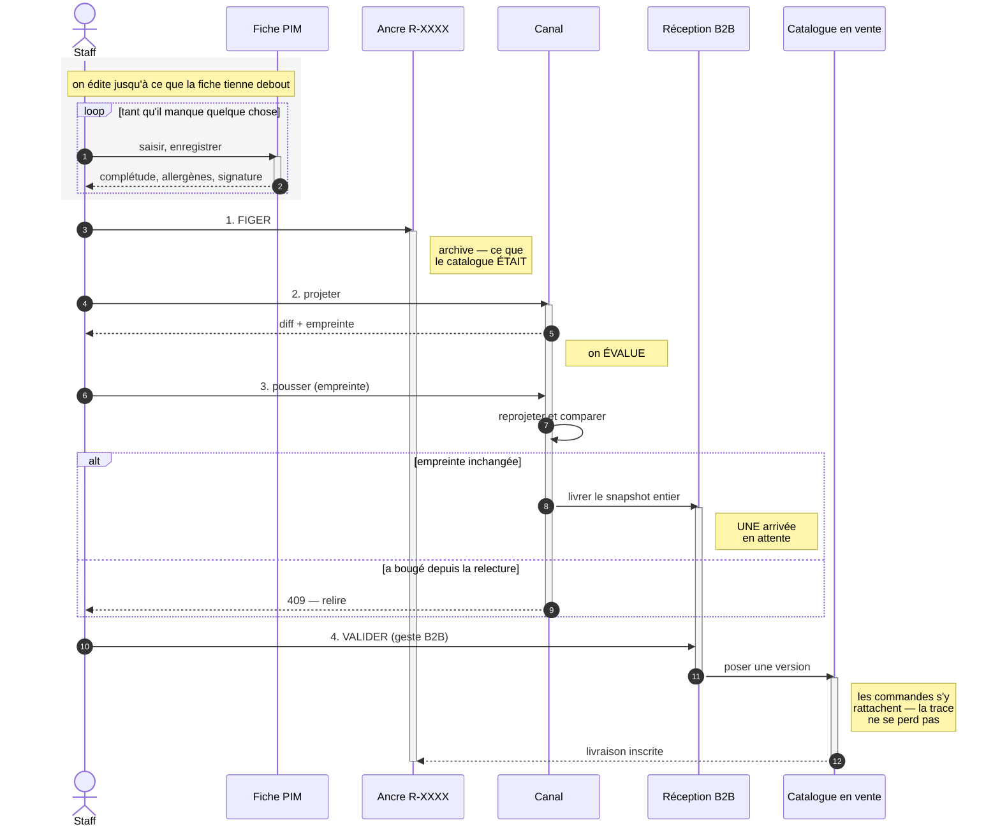

# Stage → évaluer → pousser — conception

**Date** : 2026-09-01 · **État** : 📐 doc-first, rien n'est implémenté ·
**Portée** : `apps/lfd-api/src/pim/catalogue/revision/`,
`apps/lfd-api/src/pim/channels/`, `apps/lfd-api/src/b2b/catalog/`

> **V2.** La V1 a été contredite le jour même ; six objections bloquantes, dont
> une sur un fait du dépôt que j'avais lu de travers. Ce qui a changé est listé
> au §14, avec ce qui l'a causé — un plan qui se corrige sans dire de quoi n'a
> pas de valeur pour le suivant.
>
> Chaque affirmation sur l'existant est référencée. Ce qui relève d'une
> proposition est marqué **[proposé]** ; ce qui reste ouvert est au §11.

> **V3 — les 7 bloquants de la V2 sont corrigés.** Deux d'entre eux ont
> disparu en même temps : l'aperçu B2B que je voulais écrire **existe déjà**
> (`CheckCatalogParityService`), et il rend les sorties. Ce qui a changé est au
> §14 ; ce qui reste ouvert au §11.

---

## 0. Le problème, en une phrase

**Rien ne relie ce qu'on relit à ce qu'on pousse.**

La simulation qu'on regarde et l'envoi qui suit sont deux appels séparés, chacun
relisant le catalogue en cours d'édition. Aucun identifiant, aucune empreinte, aucun refus
ne les rattache. Sur quatre-vingt-quinze articles ça ne se voit pas ; c'est
précisément pour ça qu'il faut le corriger avant que ça se voie.

---

## 1. Le cycle visé



### 1.0 🔴 Trois gestes, trois portées — et deux s'appellent « publier »

_(Question posée le 2026-09-01 : « ce que tu appelles figer, c'est le geste
Publier ? » — non, et la confusion est légitime.)_

| Le geste                 | Sa portée               | Ce qu'il fait                                                                             |
| ------------------------ | ----------------------- | ----------------------------------------------------------------------------------------- |
| **Publier au catalogue** | **UN produit**          | bascule `status` de `draft` à `published`. Une décision d'éligibilité, prise sur la fiche |
| **Figer**                | **LE catalogue entier** | pose une ancre `R-XXXX` — la photographie de ce que le catalogue était                    |
| **Pousser / livrer**     | **un canal**            | envoie ce que ce canal reçoit                                                             |

Et **trois états**, qu'il faut autant distinguer que les gestes :

| L'état                        | Où            | Ce que c'est                                                                                          |
| ----------------------------- | ------------- | ----------------------------------------------------------------------------------------------------- |
| **R+1** — la version en cours | PIM           | ce qu'on édite. Elle avance à la première modification **publiable** (§4.2). Jamais servie à personne |
| **R**                         | PIM           | la dernière ancre publiée **sur tous les canaux** — un consensus, pas un compteur                     |
| **en ligne**                  | chez le canal | ce que ce canal sert **réellement**, qui peut être plus ancien que R                                  |

⚠️ **« Catalogue vivant » a été banni de ce document.** Il désignait R+1 — la
version en cours d'édition — et se lisait « ce qui est en ligne », c'est-à-dire
exactement le contraire. Les trois lignes ci-dessus n'ont aucun mot en commun,
et c'est délibéré.

⚠️ **Les deux premiers gestes portent le même mot, et c'est ma faute.** Le bouton de la
fiche a été renommé « Publier au catalogue » le 2026-09-01, pendant que
[`flux-catalogue-et-versionnement.md`](flux-catalogue-et-versionnement.md) §14
appelle « Préparer une publication » le bouton qui pose une ancre. Deux gestes
de portées différentes, deux fois le mot « publication ».

**[proposé, et le §4.1 le résout mieux]** Réserver « publier » au **produit**.
Quant à « figer », le §4.1 le fait **disparaître comme geste** : on est à **R+1**
dès la première modification enregistrée, et pousser transforme R+1 en R.
Personne n'a plus à figer quoi que ce soit.

Et rappel du §4 : **figer n'est pas un geste.** L'ancre se pose automatiquement
au moment de la publication vers un canal — le §4.1 bis propose de retirer le
bouton de pose manuelle, qui déplace la référence de tous les diffs vers une
version que personne n'a reçue.

### 1.1 🔴 Deux objets, deux métiers — ne pas les confondre

La V1 faisait de l'ancre **la source du push**. C'était une erreur de casting, et
elle rendait le plan infaisable (§14.1). Séparation nette :

|          | **L'ancre** (`R-XXXX`)                                | **L'empreinte de projection**                  |
| -------- | ----------------------------------------------------- | ---------------------------------------------- |
| Répond à | « qu'est-ce que le catalogue **était** ce jour-là ? » | « ce que je pousse est-il ce que j'ai relu ? » |
| Portée   | le catalogue entier, vocabulaire du référentiel       | **un canal**, dans le vocabulaire de ce canal  |
| Durée    | permanente, c'est l'archive                           | le temps d'un aller-retour                     |
| Existe ? | oui, et elle marche                                   | non — à écrire, mais `fingerprint()` existe    |

L'ancre reste ce qu'elle est : l'archive, inscrite au moment du push par
`recordPublication`. **La garantie « ce que je relis est ce que je pousse » ne
passe pas par elle** — elle passe par une empreinte du **snapshot projeté**,
calculée par le canal, rendue avec l'aperçu, et redonnée au push qui refuse si
elle ne colle plus.

`fingerprint(value: unknown)` (`revision/domain/fingerprint.ts:15`) hache
n'importe quelle valeur via une forme canonique.

⚠️ **Mais pas le snapshot tel quel, et c'est tout le travail de la tranche 1.**
Une projection n'est pas déterministe aujourd'hui :

- `generatedAt` est **dans** le snapshot (`packages/catalog-sync/src/snapshot.ts:206`),
  posé par `new Date().toISOString()` (`push.service.ts:56`). Deux projections
  d'un catalogue identique à une milliseconde d'écart donnent deux empreintes —
  le push refuserait **toujours**.
- L'ordre des familles et des déclinaisons n'est pas total : `position` est un
  `Int @default(0)` sans unicité, donc Postgres départage par l'ordre physique,
  qui change après un `UPDATE`. Et `fingerprint` **conserve délibérément l'ordre
  des tableaux** (`fingerprint.ts:11-13`).

Le dépôt a déjà appris cette leçon et l'a écrite : `revision.ts:130-136` trie
les articles par SKU, avec le commentaire « sans ce tri, deux captures d'un
catalogue identique donneraient deux empreintes ».

**[proposé]** Ce qu'on hache n'est donc pas le snapshot mais une **forme
canonique de projection** : `generatedAt` retiré, familles et déclinaisons
triées par clé stable (SKU, id de famille). C'est un artefact à définir, pas un
appel à `fingerprint()` — et c'est le cœur de la tranche 1, pas son détail.

### 1.2 🔴 Où passe la frontière

Le PIM **livre** ; il ne décide pas de ce qui est en vente. La réception est une
table **du B2B**, et c'est le B2B qui valide, sur son canal, avec ses règles.

Le sens de dépendance est déjà le bon : `B2bCatalogDriver` est un **port publié
par `pim`**, et `b2b` s'y conforme
(`b2b/catalog/infrastructure/in-process-catalog.driver.ts:11-12` : « `b2b`
conforme au port publié par `pim`, jamais l'inverse. Le référentiel ignore
toujours qui le consomme »).

Ce qui manque n'est donc pas la frontière, c'est **ce qui se passe une fois
franchie** : `IngestCatalogService.apply()` écrit directement les tables de
VENTE. Livrer et mettre en vente sont le même geste, et il appartient au PIM.

⚠️ **Shopify ne suit pas ce découpage.** La « validation » y est celle d'une
boutique qui n'est pas à nous, et la réconciliation 3 voies existe pour vivre
avec. La symétrie s'arrête à l'empreinte de projection.

---

## 2. Ce qui existe déjà — à ne pas rebâtir

| Pièce                  | Où                                                     | Ce qu'elle fait                                                                                    |
| ---------------------- | ------------------------------------------------------ | -------------------------------------------------------------------------------------------------- |
| L'ancre                | `revision/domain/revision.ts`                          | `buildRevision()`, héritages **résolus**, empreinte par article                                    |
| L'empreinte            | `revision/domain/fingerprint.ts:15`                    | `fingerprint(unknown)` sur forme canonique — **générique**                                         |
| Le diff paresseux      | `revision/domain/diff.ts`                              | `planDiff()` sur les empreintes ; `diffItem()` au niveau payload                                   |
| Relecture d'une ancre  | `revision/domain/ports/catalog-revision.repository.ts` | `byReference()`, `indexOf()`, `payloadsOf()`                                                       |
| Trace d'un envoi       | idem                                                   | `recordPublication({ revisionId, channel, mode, outcome, report, … })`                             |
| Pré-push Shopify       | `channels/shopify/products/push.service.ts:62`         | `push(ids?, preview)` — **`preview` vaut `false` par défaut**                                      |
| Réconciliation 3 voies | `channels/shopify/products/reconciliation.ts:101`      | `to_remove`, `never_published`, `unknown`, `local_ahead`, `remote_drift`, `conflict`, `up_to_date` |
| Simulation B2B         | `channels/b2b-platform/products/push.controller.ts:15` | `dryRun` **par défaut `true`**                                                                     |
| Décision locale B2B    | `b2b/catalog/domain/entities/catalog-item.ts`          | `refreshFromPim()` ne **peut pas** toucher au prix négocié                                         |
| Garde de déploiement   | `pim/publication/publication-switch.ts`                | `@PublicationGesture()` — **fermé par défaut**                                                     |

---

## 3. Les défauts, vérifiés

### 3.1 🔴 La relecture et l'envoi ne sont reliés par rien

`channels/b2b-platform/products/push.service.ts:54-80` fait deux lectures de
la version en cours dans un même appel : `feed.preview(…)` construit le snapshot, puis
`TakeCatalogRevisionCommand` pose l'ancre depuis une seconde lecture
(`prisma-catalog-revision.source.ts:33`).

⚠️ **La V2 en tirait un grief, à tort.** L'ancre et le snapshot ne décrivent pas
la même chose et n'ont pas à coïncider : l'ancre archive **le catalogue**, le
snapshot est **ce qu'un canal reçoit**, et les deux populations diffèrent de
toute façon (§3.5). Ce qui relie l'ancre à ce qui est parti, c'est
`recordPublication`, pas l'égalité des lectures. L'ordre actuel — figer avant
d'envoyer — est le bon, et il est justifié dans
[`flux-catalogue-et-versionnement.md`](flux-catalogue-et-versionnement.md) §14.

**Le vrai défaut est ailleurs et il est pire** : le `dryRun` qu'on regarde est un
**troisième appel HTTP**, complètement séparé. Rien — ni identifiant, ni
empreinte, ni refus — ne relie « ce que j'ai relu » à « ce que j'envoie ».

Côté Shopify, même chose sans ancre :
`channels/shopify/products/push.service.ts:65-68` relit `publishable()` ou
`byIds()` à chaque appel. ⚠️ Et `push()` a `preview = false` **par défaut** : un
appel qui oublie le drapeau pousse pour de vrai.

### 3.2 ⚖️ Le retrait emporte la décision locale — c'est un CHOIX, pas une fuite

**La V1 se trompait ici, et c'est la correction la plus importante de cette
version.** Elle présentait la destruction du prix négocié comme un contournement
de l'agrégat. C'est une décision délibérée, écrite et testée.

- Le port : « Leur décision part avec eux — un prix négocié ne veut plus rien
  dire sans l'article qu'il tarifait. »
  (`b2b/catalog/domain/ports/catalog-item.repository.ts:32-34`)
- Le test, nommé _« un article retiré emporte sa décision »_, avec ce JSDoc :
  « L'autre face de la cascade, celle où elle est **juste** »
  (`test/catalog-ingest.e2e-spec.ts:161-175`).
- Le mécanisme : `removeMany` → `deleteMany`
  (`infrastructure/prisma-catalog-item.repository.ts:178`), cascade
  `onDelete: Cascade` de `catalog_item_overrides` (`schema.prisma`).

Le fait est exact ; **l'interprétation était fausse**. Ce document ne propose
donc plus de l'inverser : il pose la question au §11.1, et elle est pour Hugo.

Ce qui reste vrai et mérite d'être noté : un dépublication accidentelle suivie
d'un push détruit un tarif négocié sans trace, et la règle du dépôt interdit le
DELETE physique sur un agrégat métier. Deux arguments contre le choix actuel —
pas une preuve qu'il est faux.

### 3.3 🟠 Un article reçu est en vente immédiatement

`CatalogItem.receive(facts)` pose `NO_DECISION`
(`b2b/catalog/domain/entities/catalog-item.ts:121`, `:91-96`), donc
`isHidden: false`. Le transport est **en-processus** : un push réel écrit les
tables B2B et l'article est visible du client dans la même requête. Pas d'étape
de validation.

### 3.4 🟠 Le B2B ne sait pas dire s'il est en écart

`b2b_channel_binding` porte `published_at`, `published_by`, `last_pushed_at`.
**Pas d'empreinte.** ⚠️ Et `last_pushed_at: NULL` a déjà un sens documenté —
« publié mais jamais parti, l'écart que l'écran doit montrer » (`schema.prisma`).

### 3.5 🔴 L'ancre et le canal ne parlent pas de la même population

`feed.preview` part de `membership.publishedProductIds()`, qui lit
`b2b_channel_binding` (`membership.service.ts:37-42`). L'ancre part de
`catalogue.publishable()`, qui rend **tout ce qui n'est pas archivé**
(`prisma-catalogue-reader.ts:54-57`) — brouillons compris.

Ce ne sont pas deux lectures du même ensemble séparées par une fenêtre : **ce
sont deux ensembles différents, tout le temps.** L'appartenance au canal
(`b2b_channel_binding`) est une décision explicite qui n'entre pas dans l'ancre,
et que `soldContexts` — la matrice de vente résolue — ne remplace pas.

C'est la raison de fond pour laquelle l'ancre ne peut pas être la source d'un
push : elle ne sait pas à qui le canal s'adresse.

---

## 4. Le modèle cible — l'empreinte garantit, l'ancre archive

**[proposé]** Une règle, et elle ne parle plus de l'ancre :

> **Un push refuse de partir si ce qu'il enverrait diffère de ce qui a été
> relu.**

Le mécanisme, en trois lignes :

1. L'aperçu d'un canal projette ce qui partirait **et rend l'empreinte** de ce
   snapshot projeté : `fingerprint(snapshot)`.
2. Le push prend cette empreinte en paramètre.
3. Il reprojette, recalcule, et **refuse** (`409`) si l'empreinte a changé.

Ce que ça donne, et qui manquait :

- « J'ai relu R-7WT4NA chez Shopify » et « je pousse ce que j'ai relu » sont la
  même phrase, **par refus** et non par confiance.
- Chaque canal garde **son** vocabulaire. Aucune réhydratation, aucun mapper,
  aucune extension de l'ancre — donc aucun changement de ce que signifient les
  ancres déjà posées.
- L'appartenance au canal est dans la projection, là où elle a toujours été
  (§3.5). Rien à déplacer.
- Le refus est **cheap** : reprojeter coûte ce que coûte déjà un `dryRun`.

🔴 **L'ancre ne bouge pas.** La V2 voulait sortir `TakeCatalogRevisionCommand`
du push pour en faire un bouton. C'est exactement ce que
[`flux-catalogue-et-versionnement.md`](flux-catalogue-et-versionnement.md) §14 a
défait le 2026-08-31, et son argument tient : « une ancre qu'il faut penser à
poser est une ancre qu'on oublie, et une ancre oubliée ne vaut rien ». Le geste
qui doit la poser est celui qui a déjà lieu — la publication. Le bouton existe
d'ailleurs déjà, renommé « Préparer une publication », pour figer **avant une
modification risquée** sans rien envoyer.

L'ancre garde donc son rôle et son déclencheur. Ce document n'ajoute qu'une
chose au push : le refus.

⚠️ **Ce que ce modèle ne donne PAS**, et la V1 le promettait à tort : rejouer
une ancre ancienne n'est **pas** sûr. L'ingestion calcule les retraits contre le
miroir courant, pas contre l'ancre précédente ; rejouer R-ancienne retirerait
tout ce qui est entré depuis. Le rejeu n'est pas au programme.

---

### 4.1 🔴 « À partir de la première modification, on est à R+1 »

_(Proposé par Hugo, 2026-09-01 — et c'est la bonne façon de voir, à une
précision près qui décide de tout.)_

**R+1 existe déjà. Il n'a pas de nom, c'est tout.**
`GetCatalogOverviewHandler` construit la révision du catalogue **tel qu'il est**
et la compare à la dernière ancre — « il se calcule comme une capture qu'on ne
poserait pas ». Il en rend `added` / `removed` / `changed`. Autrement dit : le
compte des modifications depuis R est **déjà servi**, avec exactement la même
mécanique que la pose, « donc sans qu'un écran puisse annoncer un changement que
la capture ignorerait ».

Ce que la proposition apporte n'est donc pas un mécanisme, c'est un **nom** — et
il vaut cher :

- « figer » **disparaît comme geste**. On n'a plus à penser à poser une ancre :
  on est à R+1 dès la première modification enregistrée, et pousser transforme
  R+1 en R. La collision de vocabulaire du §1.0 se dissout d'elle-même.
- L'écran d'évaluation cesse d'être « le diff d'une chose qu'on vient de
  fabriquer » et devient « **R+1, 12 changements depuis R-7WT4NA** ». C'est ce
  qu'on relit, et ça a une identité avant qu'on la pousse.
- La garde d'idempotence existante prend tout son sens : deux pushs d'un
  catalogue inchangé sont deux publications d'**un** R, ce qu'ils sont.

⚠️ **La précision qui décide de tout : R+1 ne se PERSISTE pas.**

Deux lectures, et une seule tient :

|                                | R+1 = le catalogue en cours d'édition, nommé | R+1 = une ancre brouillon persistée                                           |
| ------------------------------ | -------------------------------------------- | ----------------------------------------------------------------------------- |
| Immuabilité                    | conservée — R+1 n'est pas une ancre          | **détruite** : « R+1 » désignerait un contenu différent d'une heure à l'autre |
| Coût                           | nul, c'est déjà calculé                      | ré-empreinte à chaque enregistrement de section                               |
| Le magasin adressé par contenu | intact                                       | une ancre qui change de contenu cesse d'être adressable par lui               |

C'est la première. Une ancre vaut par le fait qu'elle **ne bouge plus** ; un
brouillon d'ancre qu'on amende à chaque saisie est un objet qui a le nom d'une
archive et le comportement d'un tampon.

### 4.1 bis 🔴 Le bouton « figer » est un piège — le retirer

_(Hugo, 2026-09-01 : « figer manuellement c'est se tirer une balle dans le
pied ». Vérifié, et c'est pire que « manuel ».)_

**Une ancre posée à la main s'intercale entre R et R+1, et déplace la référence
de tous les diffs — silencieusement.**

`GetCatalogOverviewHandler` compare le catalogue courant à `this.revisions.latest()`,
et `latest()` rend **la dernière ancre POSÉE**, sans regarder si elle a été
publiée — les publications sont inscrites à part
(`catalog_revision_publication`). Donc :

1. quelqu'un fige à la main, au milieu d'une session d'édition ;
2. cette ancre devient `latest()` ;
3. « N changements depuis la dernière révision » se calcule désormais contre
   **une version qu'aucun canal n'a**, et que personne n'a validée ;
4. rien à l'écran ne distingue cette ancre-là d'une ancre publiée.

Le §14 de [`flux-catalogue-et-versionnement.md`](flux-catalogue-et-versionnement.md)
avait déjà retiré au bouton son rôle de déclencheur, en gardant l'objet pour
« figer avant une manœuvre risquée ». **Ce reste-là ne survit pas au §4.1** :
depuis que R+1 a un nom et que son diff contre R est affiché, on n'a plus besoin
de figer pour avoir un point de comparaison — **R est le point de comparaison**,
et il a la propriété que l'ancre manuelle n'a pas : quelqu'un l'a reçu.

**[proposé]** Retirer le geste de pose manuelle. Une ancre naît d'une
publication, et d'elle seule.

⚠️ Le besoin qu'il servait — « un point de reprise avant une grosse manœuvre » —
est légitime et reste sans réponse. Mais sa réponse n'est pas une ancre : ce
serait un objet **hors de la suite publiée**, sans quoi il repollue `latest()`.
Noté au §11.

### 4.2 « R quand c'est publié chez tout le monde » — deux précisions

_(Hugo, 2026-09-01 : « une fois que le catalogue est publié chez tout le monde
il est R ; dès la première modif publishable on est R+1 ».)_

**Le principe est le bon.** Les deux mots qui le portent — « tout le monde » et
« publishable » — cachent chacun une décision.

#### « Chez tout le monde » : R est un CONSENSUS, pas un compteur

`catalog_revision_publication` inscrit une publication **par canal**
(`{ revisionId, channel, mode, outcome, … }`). Rien n'oblige les canaux à
avancer ensemble, et ils ne le feront pas : un push Shopify peut passer pendant
qu'une arrivée B2B attend sa validation (§6), ou qu'une boutique est
injoignable.

Donc, honnêtement :

> **R = la plus récente ancre publiée sur TOUS les canaux.**
> Chaque canal porte en plus **son** dernier R, et ils peuvent diverger.

Le scalaire « on est à R » n'existe que **quand les canaux sont d'accord**. Le
reste du temps, la vérité est une ligne par canal — et c'est précisément ce que
l'écran doit montrer, parce qu'un canal en retard est une information
commerciale, pas un détail technique.

⚠️ Conséquence : « R+1 » se lit toujours **par rapport à quoi**. « 12 changements
depuis R-7WT4NA » n'a de sens que si l'on dit sur quel canal R-7WT4NA est
effectivement posée.

#### « Publishable » : et donc l'ancre ne doit PAS contenir les brouillons

Le mot tranche le §11.2, et dans le bon sens.

Si R+1 doit avancer à la première modification **publiable**, alors éditer un
brouillon ne doit rien faire avancer : rien de ce qu'on y touche n'atteindra un
canal. Or aujourd'hui **c'est l'inverse** : l'ancre est bâtie sur
`catalogue.publishable()`, qui rend tout ce qui n'est pas archivé
(`prisma-catalogue-reader.ts:54-57`), et `status` fait partie du payload d'un
article. Renommer un brouillon change donc son empreinte, donc celle de la
révision — et ferait avancer R+1 sans que rien de vendable n'ait bougé.

**[proposé]** Une ancre ne contient que ce qui est **publié**. `publishable()`
change de filtre — et de nom, puisqu'il dit déjà autre chose que ce qu'il fait.

⚠️ Le prix, et il est réel : les ancres déjà posées contiennent les brouillons.
Après la bascule, un diff qui enjambe ce changement montrerait des « retraits »
massifs qui ne sont que la sortie des brouillons. À traiter comme une bascule de
sens, pas comme un correctif — donc en le disant sur l'écran des révisions.

**Et R+1 ne remplace pas l'empreinte du §4** — il la rend nécessaire, plutôt.
Puisque R+1 est la version en cours d'édition, il **bouge pendant qu'on le relit**. C'est
précisément ce que l'empreinte pin : « j'ai relu R+1 dans cet état-là, refuse si
ce n'est plus lui ». Le nom donne l'identité, l'empreinte donne la garantie.

---

## 5. Côté canal — l'aperçu, et son empreinte

### 5.1 🔴 L'aperçu B2B existe déjà — et il rend les sorties

La V2 posait `GET /pim/channels/b2b/preview` et en déduisait qu'il faudrait un
port de retour pour connaître les sorties, puisque
`DryRunB2bCatalogDriver.send` laisse délibérément `removedSkus: []`
(`driver.ts:30-31` : « lui seul suppose de connaître l'état de l'autre côté »).

**C'était se créer le problème pour le résoudre.** `CheckCatalogParityService`
(`b2b/catalog/application/check-catalog-parity.service.ts:26-50`) compose déjà
la **vraie** projection PIM (`B2bCatalogFeedPreview`) et le **vrai** miroir B2B
(`CatalogReader.listSellable()`), et `compareToReference`
(`b2b/catalog/domain/catalog-parity.ts:69-121`) rend `missing`, **`stale` — les
sorties** —, `priceGaps`, `vatGaps`, `nameGaps`. C'est servi par
`GET /admin/catalog/parity`.

Il vit **côté `b2b`**, c'est-à-dire du seul côté qui voit les deux. C'est
l'aperçu, il tourne, et il ne demande aucun port.

**[proposé]** L'aperçu B2B **est** la parité, à qui l'on ajoute une chose :
l'empreinte canonique de la projection (§1.1). Le push la reprend et refuse si
elle a changé.

Cela règle aussi la contradiction §5 ↔ §9 de la V2 : le diff n'avait pas
d'« avant », puisqu'un hash n'est pas un payload. **L'« avant » est le miroir
B2B**, et la parité le lit déjà.

### 5.2 Shopify — l'empreinte au grain du PRODUIT, pas du canal

⚠️ Une empreinte du snapshot entier serait fausse ici :
`POST /pim/channels/shopify/products/push` prend des `productIds`
(`products.controller.ts:65-67`). On y pousse un sous-ensemble, et une empreinte
globale ferait refuser un push de trois fiches parce qu'une quatrième, qu'on ne
pousse pas, a bougé.

Et Shopify a **déjà** l'empreinte au bon grain : `fingerprint(payload)` par
produit, plus `lastPushedHash` (`push.service.ts:120`, `:203`). Ce qui manque
tient en une ligne — `previewOne` calcule le hash et ne le rend pas.

L'aperçu Shopify reste donc ce qu'il est — la réconciliation 3 voies, plus les
collections `tva-*` que l'envoi ferait naître — et gagne les hachés par produit.
Le push les reprend, produit par produit.

⚠️ Deux `fingerprint` coexistent dans le dépôt : `revision/domain/fingerprint.ts:15`
(tri `a < b`) et `shopify/products/projection.ts:175` (tri `localeCompare`, donc
dépendant de l'ICU). Le second est celui que Shopify utilise déjà. À réconcilier
ou à assumer, pas à ignorer.

⚠️ Le comparateur d'un diff au niveau payload est `diffItem()` (`diff.ts:87`),
**pas** `diffComparable()` (`reconciliation.ts:125`), qui compare trois champs
Shopify écrits en dur.

---

## 6. Côté B2B — la réception, puis la validation

### 6.1 🔴 Pourquoi une réception, et pas un état sur l'article

Un état `pending` sur `CatalogItem` ne gate que les **arrivées**. Un article déjà
en vente dont le PIM change le **prix** serait rafraîchi sur place
(`refreshFromPim()` remplace les faits), et le nouveau prix partirait au client
sans relecture — c'est-à-dire que le cas le plus sensible passerait, en croyant
tout retenir.

**[proposé]** La livraison écrit une **arrivée** : le snapshot reçu, entier, à
côté des faits de vente. La validation le promeut.

### 6.2 🔴 Une seule arrivée en attente, jamais une file

C'est la décision qui répond aux trois trous de la V1 :

- **L'arrivée porte le snapshot COMPLET**, pas des faits par SKU. Un retrait est
  l'_absence_ d'un SKU : il ne s'exprime pas dans une table de lignes entrantes.
  Sans le snapshot entier, « ce qui sort » n'est pas validable.
- **Une livraison REMPLACE l'arrivée en attente.** Il y en a zéro ou une, jamais
  deux. L'ordre cesse d'être une question : on ne peut pas valider une arrivée
  périmée, elle n'existe plus. Le prix est qu'une livraison efface une relecture
  en cours — assumé, et l'écran doit le dire.
- **Les sorties se calculent contre les faits de VENTE**, pas contre l'arrivée
  précédente : la validation change les faits de vente, c'est donc eux la
  référence.

### 6.2 bis 🔴 Tout-ou-rien bloque, partiel laisse des restes — donc ni l'un ni l'autre

La V2 ne tranchait pas, et ne le listait même pas comme ouvert. Les deux réponses
évidentes sont mauvaises :

- **Tout-ou-rien** : un catalogue de 95 articles dont **un** porte un prix faux
  ne peut pas être validé. Retour au PIM, correction, re-push — qui **remplace**
  l'arrivée et oblige à tout relire. Plus le catalogue grossit, plus la
  probabilité qu'un article annule la relecture des 94 autres monte. C'est
  exactement le cas qui motive le chantier.
- **Validation partielle étalée** : des lignes validées, d'autres non, et une
  livraison qui remplace l'arrivée détruit un travail à moitié fait.

**[proposé] Une troisième voie : un seul geste, mais des lignes REFUSABLES.**

La validation clôt l'arrivée en une fois. Avant de la clore, l'opérateur peut
**écarter des lignes** : une ligne écartée n'entre pas dans la version, et le SKU
**garde ses faits de vente courants** — il n'a simplement pas changé.

Trois propriétés, et ce sont elles qu'on achète :

- **rien ne bloque** : un prix faux s'écarte, les 94 autres passent ;
- **rien ne reste en suspens** : après le geste, l'arrivée est close. Il n'existe
  jamais d'arrivée à moitié validée, donc « une livraison remplace l'arrivée » ne
  peut détruire aucun travail ;
- **une version = une décision**, prise par quelqu'un, à un instant.

⚠️ Le prix : un SKU écarté reste sur ses anciens faits **sans que rien ne le
rappelle** au prochain push, où il réapparaîtra dans le diff. C'est le bon
comportement — on ne veut pas d'une liste d'exclusions permanente — mais l'écran
doit dire « déjà écarté la fois précédente », sans quoi on l'écartera dix fois.

⚠️ **Oui, c'est une duplication.** L'arrivée est une copie, côté `public`, d'un
snapshot que le PIM a déjà produit. Une ligne, un JSON, pas un magasin adressé
par contenu — mais une copie quand même. C'est le prix de « le B2B possède sa
boîte de réception », et il vaut mieux le dire que le découvrir.

### 6.3 🔴 Le retour d'information passe par un port

L'aller est en place. Le **retour** est le piège : dès que la fiche produit
voudra dire « en vente depuis le 28 août », le PIM aura besoin d'un fait du B2B,
et la matrice l'interdit (`pim → b2b` : ✗).

Le piège n'est pas l'import, c'est **Prisma** : `catalog_items` vit dans le même
schéma, la base est unique, et un `findMany` depuis `pim/` **marcherait**.
`lint:cross-schema-join` ne lit que les jointures brutes.

**[proposé]** `pim` publie le port de lecture, `b2b` s'y conforme — exactement
comme `B2bCatalogDriver`, et **l'adaptateur peut vivre dans `b2b/`**.
`context-boundaries.mjs` l'autorise (`b2b` peut voir `pim`).

⚠️ Correction de la V1 : elle invoquait `PimJournalReader` comme précédent. Ce
n'en est pas un — son adaptateur est dans `appBootstrap` parce que `pim` ne peut
pas voir `growth`. Ici, `b2b` voit `pim`, donc rien n'oblige à passer par la
racine.

⚠️ Ce que le port rend est un **fait de livraison** (« R-7WT4NA livrée le 28/08,
12 articles en attente »), jamais un fait de commerce. Le jour où il rendrait
« prix négocié », la frontière serait franchie par le contenu.

---

## 7. Le catalogue accepté est VERSIONNÉ — c'est ce qui rend le B2B autonome

**[proposé — direction donnée par Hugo, 2026-09-01]** Valider une arrivée ne
remplace pas des faits : ça **pose une version du catalogue B2B**. Le B2B tient
sa propre suite de versions, celles dont il a accepté les articles, et une
commande **référence la version sous laquelle elle a été passée**.

C'est le renversement qui manquait au document : la réception n'est pas une
boîte aux lettres, c'est le mécanisme par lequel le B2B se dote d'une histoire à
lui. Il cesse de subir le référentiel ; il l'accepte, version par version.

### 7.1 Ce que la version ajoute — et ce qu'elle N'ajoute PAS

⚠️ **La V2 promettait trois bénéfices ; deux existaient déjà et un est
inatteignable.** Corrigé ici, parce qu'un mécanisme justifié par de faux gains
se fait couper au premier arbitrage.

**Ce qui existe déjà, et que la version ne remplace pas :**

- `OrderLine` fige nom, prix unitaire et taux — le **document comptable**
  (`schema.prisma`).
- Elle fige aussi **la trace de résolution** : `basePriceMillicents`,
  `pricingSteps`, `pricingFloor`, `pricingFloored`, `pricingCommitment`. « D'où
  venait ce prix » est donc **écrit sur la ligne**, pas à déduire. Cf.
  [`b2b/architecture-resolution-de-prix.md`](../b2b/architecture-resolution-de-prix.md).
- `catalog_price_history` est append-only, porte le prix **effectif** et sa
  source (`pim` | `b2b`), et se relit par `pricingAt(at)`.

**Ce qui est inatteignable, et que je retire :** « un panier en cours reste sur
sa version ». Le panier est **côté client**, et `ProductCatalogReader` interdit
de faire confiance au prix qu'il envoie. Faire qu'un panier « reste sur sa
version » supposerait que le client transmette une version au serveur —
c'est-à-dire faire d'une entrée client un paramètre de l'autorité de prix. Le
`quote` existe précisément pour l'empêcher.

**Ce que la version ajoute réellement**, et que rien d'autre ne donne :

| Question                                                        | Aujourd'hui       | Avec les versions |
| --------------------------------------------------------------- | ----------------- | ----------------- |
| « Que voyait ce client, à côté de ce qu'il a acheté ? »         | perdu             | la version        |
| « Cet article était-il proposé le 12 août ? »                   | indécidable       | lisible           |
| « Sous quel catalogue cette réclamation a-t-elle été passée ? » | reconstitution    | la référence      |
| « Que valait le catalogue accepté, entier, ce jour-là ? »       | rien ne l'archive | la version        |

Autrement dit : la ligne de commande dit **ce qui a été facturé**, la version dit
**dans quel catalogue ça s'inscrivait**. Le second n'est pas un contrôle
comptable, c'est du contexte — et c'est ce qui manque quand un client conteste
autre chose qu'un montant.

### 7.2 Le port de retour porte une CONTRAINTE, pas seulement un fait

**[proposé — direction donnée par Hugo]** Le B2B ne se contente pas de dire au
PIM « j'ai reçu » : il dit **« ce SKU est engagé jusqu'au X sur tel canal, il
reste au catalogue »**.

C'est ce qui donne des dents au port du §6.3, et ça répond à un risque réel que
je n'avais pas vu :

`SubscriptionLine.sku` est une **chaîne nue**, et son commentaire dit « le prix
est ré-résolu **à l'échéance** » (`schema.prisma`). Un panier récurrent actif
avec des échéances futures est donc une **créance sur l'existence continue de ce
SKU** — et rien, aujourd'hui, n'exprime cette créance au référentiel. Le PIM peut
dépublier et pousser ; le SKU disparaît du catalogue B2B pendant qu'un abonnement
pointe encore dessus.

🔴 **Vérifié depuis, et la réponse change la tranche : il n'existe AUCUNE
génération d'occurrence.** Aucun planificateur dans `b2b/subscriptions/`, rien
n'écrit `Order.fromSubscriptionId` — la colonne n'est que **lue**.
`SubscriptionOccurrence` n'est qu'une table de **dérogations** (« modifier cette
commande uniquement »). Les JSDoc parlent d'un planificateur qui n'est pas écrit.

Ce n'est donc **ni un risque actif, ni un incident survenu** : c'est une créance
sur un mécanisme à venir. Concevoir sa contrainte avant lui reviendrait à
concevoir contre une inconnue, et la tranche correspondante est retirée du §10.

⚠️ En revanche le trou est **plus large** que je ne l'écrivais :
`CreateSubscriptionHandler` ne vérifie même pas que le SKU existe à la création.
Un panier récurrent peut naître sur une référence qui n'a jamais été au
catalogue.

⚠️ Et la contrainte, le jour où elle s'écrira, n'aura pas un seul point
d'accroche : un SKU quitte le snapshot par **huit** chemins — les six motifs
d'exclusion de la projection (`variant_arretee`, `variant_sans_prix`,
`variant_sans_taux`, `famille_inconnue`, `canal_ferme`,
`produit_sans_variante_vendable`), plus `unpublish`, plus l'archivage. Une garde
posée sur le seul `unpublish` en laisserait passer sept — dont le plus banal,
« quelqu'un a effacé le prix ».

La forme de la contrainte reste ouverte (§11.9), mais son sens ne l'est pas : le
retrait d'un article devient **négociable entre les deux contextes**, au lieu
d'être imposé par l'amont. Le PIM propose de retirer ; le B2B répond qu'il ne
peut pas encore.

### 7.3 Ce que ça change au retrait

La V1 proposait de remplacer la suppression par un marquage. **Retiré du plan** :
c'est une décision motivée qu'on ne renverse pas dans un document qui n'a pas
réfuté sa raison (§3.2, §11.1).

Mais les versions déplacent la question, et dans le bon sens. Un article retiré
reste lisible **dans les versions qui le contenaient** — donc une commande
ancienne reste interprétable même si l'article n'existe plus au catalogue
courant. L'argument qui fondait la destruction (« un prix négocié ne veut plus
rien dire sans l'article qu'il tarifait ») garde sa force pour le **catalogue
courant**, et en perd pour l'**histoire**. C'est peut-être la sortie : détruire
la décision courante, garder les versions.

⚠️ Une porte reste ouverte quelle que soit la décision :
`CatalogCategory → CatalogItem` est aussi en `onDelete: Cascade`
(`schema.prisma`). `PrismaCatalogCategoryProjection.replaceAll` est aujourd'hui
un **upsert pur** malgré son nom, et son JSDoc dit pourquoi (« vider la table les
emporterait par cascade — avec leurs décisions »). Un nom qui ment attend son
lecteur.

### 7.4 Ce que ça coûte, dit franchement

- **Une version, c'est une copie.** Le PIM a déjà un magasin adressé par contenu
  pour ses ancres ; le B2B en aurait un pour les siennes. Deux mécanismes
  parallèles, avec la même technique (`fingerprint`, payload canonique) et deux
  raisons différentes — l'un archive le référentiel, l'autre archive ce qui a été
  **vendu sous**. Ce n'est pas de la duplication gratuite, mais c'en est.
- **Une commande de plus à joindre.** `orders` gagne une référence de version.
  Additif, mais sur une table servie.
- **Le volume.** Une version par validation. Si l'on valide chaque jour, c'est
  365 versions par an d'un catalogue de cent articles. Négligeable en octets,
  pas en écrans : il faudra pouvoir les lister, les comparer, les nommer.
- ⚠️ **La question qu'on ne pourra pas éviter** : les commandes anciennes
  n'ont pas de version. La migration devra soit poser une version « avant
  l'histoire », soit accepter `null` — et `null` voudra dire « on ne sait pas »,
  ce qui est la vérité.

---

## 8. Ce que ça change aux écrans

⚠️ Section **non vérifiée contre le front** — à confirmer avant chiffrage.

| Écran         | Après                                                         |
| ------------- | ------------------------------------------------------------- |
| Publication   | l'aperçu par canal, et un push qui refuse si ça a bougé       |
| Révisions     | le geste « figer » sort du push et devient explicite          |
| B2B (nouveau) | l'arrivée en attente, son diff, sa validation                 |
| Fiche produit | la frise — mais elle demande §6.3, donc elle vient en dernier |

---

## 9. Les migrations, en trois déploiements

| #   | Étendre                                                                   | Basculer                                               | Resserrer                                             |
| --- | ------------------------------------------------------------------------- | ------------------------------------------------------ | ----------------------------------------------------- |
| 1   | `b2b_channel_binding.fingerprint` **nullable**                            | le push l'écrit ; l'écart se calcule quand elle est là | **rien** — cf. ci-dessous                             |
| 2   | table `catalog_delivery` (une ligne : ancre, snapshot, reçu le), **vide** | la livraison y écrit ; la validation promeut           | l'ingestion n'écrit plus les faits de vente en direct |
| 3   | `catalog_revision_publication` existe déjà                                | le push prend une empreinte de projection              | —                                                     |

**Le point 1 ne se resserre pas.** La V1 voulait rendre `fingerprint` non
nullable : impossible. `last_pushed_at: NULL` signifie « publié, jamais parti »,
et un binding sans push ne peut pas avoir d'empreinte. Forcer une valeur
détruirait l'état que l'empreinte sert à distinguer.

**Le point 2 est une table neuve et vide.** Rien de ce qui est en vente ne change
d'état au déploiement. Le premier push d'après remplira la réception.

🔴 **La fenêtre à deux chemins, et le coût RÉEL de la sortie.** Le point 2 laisse
l'ancien chemin (écriture directe) et le nouveau (par validation). La V2
proposait un drapeau « basculable sans déploiement » : **c'est faux**.
`AppConfig` lit l'environnement **dans son constructeur**
(`platform/config/app-config.ts`), les champs sont `private readonly`, et il
n'existe aucune table de drapeaux dans le schéma. Changer une Variable
Cloudflare **redémarre le container**.

Donc, sans enjoliver : un drapeau `B2B_DELIVERY_INBOX` reste le bon mécanisme —
un seul chemin actif à la fois, choisi au démarrage — mais **le retour arrière
coûte un déploiement**, pas un clic. Pendant ce temps le catalogue B2B est gelé
sur ce qui a été validé.

Ce qui rend le retour arrière **propre** malgré ce délai : la table d'arrivées
n'a **aucun lecteur** en mode direct. Revenir au chemin ancien ne demande rien
d'autre que de redéployer avec le drapeau à `false` ; les lignes en attente
deviennent inertes et se purgent à froid.

⚠️ Corollaire pour le §10 : la bascule ne se fait pas un vendredi, et elle
demande qu'un déploiement soit **prêt à repartir**, pas seulement possible.

---

## 10. Découpage

| #   | Tranche                                                                                                  | Dépend de |
| --- | -------------------------------------------------------------------------------------------------------- | --------- |
| 1   | **La forme canonique de projection** — `generatedAt` retiré, tri stable, empreinte. Pure, testable seule | rien      |
| 2   | L'aperçu B2B = la parité **+ l'empreinte** ; le push l'exige, `409` sinon                                | 1         |
| 3   | Shopify : `previewOne` **rend** son haché par produit ; le push l'exige au grain du produit              | 1         |
| 4   | Réception + validation, **ensemble**, avec les lignes écartables (§6.2 bis)                              | rien      |
| 5   | Les versions du catalogue accepté, et la référence sur `orders`                                          | 4         |
| 6   | Empreinte sur `b2b_channel_binding` (l'écart hors parité)                                                | 1, §11.6  |
| 7   | Le port de retour, pour la frise de la fiche produit                                                     | 5         |

**Trois tranches de la V2 ont disparu**, et c'est le meilleur résultat de cette
révision :

- « `TakeCatalogRevisionCommand` sort du push » — **retirée**, elle renversait
  une décision de la veille (§4).
- « Les sorties dans l'aperçu B2B » — **sans objet**, la parité les rend déjà
  (§5.1).
- « La contrainte de rétention » — **retirée**, elle porte sur un planificateur
  d'abonnements qui n'existe pas (§7.2).

**La tranche 1 est le vrai début, et elle est plus grosse que la V2 ne le
croyait.** Ce n'est pas « appeler `fingerprint()` » : c'est définir ce qu'on
hache. Elle ne touche aucune donnée, ne dépend d'aucune décision ouverte, et se
teste entièrement à plat — deux projections d'un catalogue inchangé doivent
rendre la même empreinte, y compris après un `UPDATE` qui change l'ordre
physique.

⚠️ **Ce que le §10 de la V2 oubliait**, et qui pèse sur chaque tranche :

- `preview` doit être une **Query**, `push` une **Command** — un contrôleur
  n'injecte que des bus. `push.controller.ts:30` injecte aujourd'hui
  `B2bCatalogPushService` en direct ; la porte ne l'attrape pas (elle ne filtre
  pas les `*Service`), mais la règle existe.
- Tout `@CommandHandler` de `src/pim/` doit journaliser : convertir le push en
  handler ajoute un fait, un `blast` à définir et un test.
- `@PublicationGesture()` : la règle est déjà écrite
  ([`flux-catalogue-et-versionnement.md`](flux-catalogue-et-versionnement.md)
  §16) — ce qui **sort** est fermé, la lecture reste ouverte. Un `GET` d'aperçu
  est une lecture ; il ne le porte pas.
- `push.service.ts:56` et `:132` font `new Date()` alors que `Clock` est injecté.
  La tranche 2 rouvre ce fichier : on le nettoie en passant.

---

## 11. Ce que ce document ne tranche pas

1. ✅ ~~**Un article retiré doit-il emporter sa décision ?**~~ **TRANCHÉ le
   2026-09-01 : non — le retrait marque, il ne détruit plus.**

   La décision d'origine (`removeMany` → `deleteMany` → cascade sur l'override)
   était motivée, écrite et testée, et elle est juste **quand le retrait est
   définitif**. Le retour arrière (§12) la périme : ré-ingérer une version
   ancienne retire les SKU entrés depuis, et détruirait donc les prix négociés
   des articles les plus récents — précisément ceux sur lesquels un commercial
   vient de travailler.

   L'unique objection restante était le **recyclage de SKU** : un SKU réattribué
   à un autre produit ressusciterait un prix qui ne le concerne pas. Elle tombe,
   et pas sur parole — **elle est désormais tenue par une porte**.

   > **Un SKU n'est jamais réattribué**, et `pnpm lint:sku-never-recycled` le
   > garantit sur les deux jambes : `Product.sku` et `ProductVariant.sku` sont
   > `@unique` (Postgres refuse), et aucune suppression physique de produit ni de
   > déclinaison n'existe dans le code — un produit s'archive, sa ligne reste,
   > son SKU reste pris.

   La porte vérifie **aussi** que l'unicité n'a pas disparu du schéma : les deux
   jambes tombent aussi facilement l'une que l'autre, et une porte qui n'en
   surveille qu'une donne une fausse assurance.

   ⚠️ Ce qui reste à faire, et qui est du ressort du §15 : remplacer `removeMany`
   par un marquage, et faire qu'un SKU qui revient retrouve sa décision. La
   décision est prise ; le code ne l'a pas encore.

2. ~~**Une ancre doit-elle contenir les brouillons ?**~~ **Tranché au §4.2** :
   non. Le critère « R+1 avance à la première modification _publiable_ » l'exige.
   Reste à traiter la bascule de sens pour les ancres déjà posées.
3. **Qui valide ?** Plus grave que la V1 ne le disait : `catalog: "write"`
   n'existe que pour `admin`, `commercial` n'a que `read`
   (`packages/contracts/src/staff-access.ts`). La séparation demandée — que le
   relecteur ne soit pas l'auteur — est **impossible avec la grille actuelle**.
4. **Le délai de validation est-il borné ?** Une arrivée jamais validée laisse la
   plateforme sur une version ancienne indéfiniment.
5. **Que devient `CheckCatalogParityService` ?** Il compare ce que le PIM
   enverrait _maintenant_ au miroir. Le §6 fait exprès que le miroir retarde :
   l'écran de parité deviendrait une alarme permanente. Les versions du §7 lui
   donnent un référent net — **la dernière version validée** — mais il faut le
   décider, et dire ce que l'écart signifie alors (« une arrivée attend » n'est
   pas « les deux ont divergé »).
6. **Empreinte de quoi, pour `b2b_channel_binding` ?** Du payload d'ancre (TTC,
   centimes) ou du snapshot projeté (HT, millicentimes) ? Deux questions
   différentes. Et `stamp()` fait aujourd'hui **un** `updateMany`
   (`push.service.ts:130`) ; une empreinte par produit en fait N.
7. **Concurrence et idempotence** : deux pushs simultanés (la garde d'égalité de
   hash de `TakeCatalogRevisionHandler` n'est pas transactionnelle vis-à-vis de
   `latest()`), et une validation rejouée. ⚠️ Le panier en cours, lui, **cesse
   d'être une question** avec les versions du §7 : il reste sur la sienne.
8. **Sous quelle forme une version du catalogue B2B ?** Copie entière du
   snapshot validé, ou chaînage de deltas depuis la précédente ? La première est
   bête et lisible, la seconde économe et fragile. Et que devient la **décision
   locale** — dans la version, ou à côté ? Un prix négocié qui change sans
   nouvelle livraison ne crée pas une version, mais il change ce que le client
   voit.
9. **Quelle forme pour la contrainte de rétention (§7.2) ?** « Ce SKU est engagé
   jusqu'au X » se calcule à partir des occurrences futures d'abonnement — mais
   qui la calcule, quand, et que fait le PIM d'un refus : il bloque le retrait,
   ou il l'affiche et laisse décider ?
10. 🔴 **Un article engagé dans une commande ouverte accepte-t-il TOUTES les
    modifications d'une nouvelle version ?** _(question posée par Hugo,
    2026-09-01 — et elle est plus tranchante qu'elle n'en a l'air.)_

    Une version validée peut changer le prix, le nom, le taux, les allergènes
    d'un article qui se trouve dans une commande **non encore livrée**. Ce que la
    commande protège, et ce qu'elle ne protège pas, est asymétrique :

    | Ce qui change       | La commande en cours                 | Verdict                                     |
    | ------------------- | ------------------------------------ | ------------------------------------------- |
    | prix, taux          | figés sur `OrderLine`                | protégée                                    |
    | nom                 | figé (`productNameSnapshot`)         | protégée                                    |
    | **allergènes**      | **rien ne les fige sur la commande** | **exposée**                                 |
    | l'article disparaît | la ligne survit par ses snapshots    | protégée à la facture, pas à la préparation |

    ⚠️ **La ligne qui compte est la troisième**, et elle est vérifiée : ni
    `Order` ni `OrderLine` ne portent d'allergène (`schema.prisma`). Un client
    commande une brioche déclarée sans fruits à coque, une version corrige la
    déclaration, et **rien dans la commande ne dit sous quelle déclaration elle a
    été passée**. C'est le seul cas de cette liste où l'enjeu n'est pas
    commercial.

    D'où la question, en trois réponses possibles :

    - **(a) N'accepter que l'additif et le mineur** sur un article engagé —
      nouveaux articles, textes, visuels — et **retenir** le reste jusqu'à ce que
      les commandes soient livrées. Sûr, mais une commande récurrente peut
      retarder une correction indéfiniment.
    - **(b) Tout accepter, et ALERTER** sur les commandes touchées. Ne bloque
      rien, met la décision chez un humain, au bon moment.
    - **(c) Tout accepter, et figer les allergènes sur la ligne de commande**
      comme le prix l'est déjà. Ça ne protège pas le client — sa brioche est ce
      qu'elle est — mais ça rend la commande **interprétable après coup**, ce que
      rien ne permet aujourd'hui.

    ⚠️ Ces trois-là ne s'excluent pas, et **(c) devrait probablement se faire
    quelle que soit la réponse aux deux autres** : c'est une lacune du modèle de
    commande, indépendante de ce chantier.

    Reste à définir « mineur » et « additif », et ce n'est pas cosmétique : la
    frontière décide de ce qui passe sans relecture.

11. **Le point de reprise avant une grosse manœuvre.** Le §4.1 bis retire le
    bouton de pose manuelle ; le besoin qu'il servait reste entier. Il lui faut un
    objet **hors de la suite publiée** — sans quoi il repollue `latest()` et on
    revient au piège. Un « point de reprise » nommé, non diffable, purgeable ?
    Non tranché, et probablement pas urgent.

12. ~~**Le prix PIM par défaut est-il vendable ?**~~ **Tranché au §13** :
    oui — c'est le tarif pro, une politique de direction, pas une absence de
    décision. Reste à régler les **seuils** du garde-fou ciblé (plancher,
    variation anormale, premier prix) : trop serrés, tout s'arrête et on apprend
    à valider sans lire.

13. **Les libellés d'allergènes ne se rejouent pas** : l'ancre garde les codes, la
    projection traduit avec le référentiel du jour
    (`feed-projection.service.ts:79-89`). Sans conséquence tant qu'on ne rejoue
    pas une ancre — et le §4 dit qu'on ne rejoue pas.

---

## 12. 🔴 Le retour arrière — ce qu'on peut rejouer, et ce qu'on ne peut pas

_(Question posée le 2026-09-01 : « mes snapshots sont-ils suffisamment complets
pour un retour arrière ? » — vérifié, la réponse est non, sauf sur un canal.)_

| Ce qu'on garde                                                    | Rejouable ? | Portée                             |
| ----------------------------------------------------------------- | ----------- | ---------------------------------- |
| `shopify_push_snapshot` — `payload`, `hash`, `version` par handle | ✅ **oui**  | **un produit**                     |
| `catalog_revision` + `catalog_revision_item` — l'ancre            | ❌ non      | le catalogue, en lecture seule     |
| `catalog_items` (miroir B2B)                                      | ❌ non      | écrasé à chaque ingestion          |
| `catalog_price_history` — append-only                             | ⚠️ partiel  | prix + taux d'un SKU dans le temps |

### Shopify sait revenir en arrière, et bien

`push.service.ts:149` : `rollback(handle, version)` charge le payload figé et le
**re-pousse tel quel**, en créant une **nouvelle version** — « l'historique ne se
réécrit jamais ». C'est le seul vrai retour arrière du dépôt, et il est propre.

⚠️ Mais il est **par produit**. Il n'existe pas de « rendre au catalogue son état
du 12 août » : il faudrait rejouer N handles, un par un, en sachant lesquels.

### Le B2B ne sait pas revenir en arrière du tout

Rien ne conserve ce qui a été ingéré. `IngestCatalogService.apply()` écrit le
miroir et n'archive pas le snapshot reçu. `CatalogPriceHistory` garde le prix et
le taux d'un SKU au fil du temps — de quoi répondre « combien coûtait-il le 12
août », **pas** de quoi reconstituer un catalogue : ni nom, ni famille, ni
allergènes, ni appartenance au canal.

### L'ancre archive, elle ne rejoue pas

`RevisionItemInput` porte vingt champs, héritages résolus — assez pour **lire**
ce que le catalogue était, pas pour le **renvoyer**. Il manque `variant.id`,
`position`, `options`, `nutrition`, le `slug`, les dérogations non résolues, les
familles (`slug`, `parentId`, `position`, `vatByContext`) — et surtout
l'appartenance au canal, qui vit dans `b2b_channel_binding` (§3.5).

Une ancre est une **photographie**, pas une **sauvegarde**. C'était un choix
implicite ; il devient explicite ici.

### ✅ Et donc : oui, en stockant chaque snapshot accepté

_(Hugo, 2026-09-01 : « la commande porte la réf du catalogue, au max 200
articles, on enregistre tous les snapshots — et là ça devient possible, non ? »)_

**Oui, et la mécanique existe déjà.** `IngestCatalogService.apply(snapshot)`
prend un `CatalogSnapshot` et le fait entrer dans le miroir par les agrégats.
Revenir à la version V, c'est **lui redonner le snapshot de V**. Aucun code de
rejeu à écrire : le rejeu, c'est l'ingestion, avec une entrée archivée au lieu
d'une entrée fraîche.

Trois propriétés qui tombent juste, et une qui ne tombe pas :

- **Les prix négociés ne reviennent pas en arrière, et c'est voulu.**
  `refreshFromPim()` conserve la décision locale : ré-ingérer V restaure les
  faits PIM et **laisse la tarification B2B où elle est**. C'est exactement ce
  que dit le §13 — le prix PIM est un défaut, ce qui est facturé vit côté B2B.
  Un rollback rend la **composition**, pas les montants.
- **Les commandes restent lisibles.** Une commande passée sous V+2 pointe sur
  V+2, qui est immuable et reste stockée. Revenir à V ne la rend pas
  inexplicable — c'est tout l'objet du §7.
- **Le volume n'est pas un problème à cette échelle.** 200 articles par version,
  et le magasin adressé par contenu du PIM (`catalog_revision_item`) montre déjà
  la technique : deux versions qui partagent 198 articles identiques ne stockent
  ces articles **qu'une fois**. La copie n'est bête que si on la fait bête.

### 🔴 Mais une condition, et elle rouvre le §11.1

**Ré-ingérer V supprime les SKU apparus après V.** Et aujourd'hui « supprimer »
veut dire `deleteMany`, donc cascade sur `catalog_item_overrides`, donc
**destruction des prix négociés de tout ce qui est entré depuis**.

Autrement dit : un rollback, tel que le code est écrit, **détruirait la
tarification commerciale des articles récents**. Pas les anciens — ceux-là
survivent — mais précisément ceux sur lesquels quelqu'un vient de travailler.

Ça change la nature de la question ouverte §11.1. Elle n'est plus « faut-il
préférer un marquage à une suppression, par principe ? » — la réponse actuelle
étant motivée et testée. Elle devient :

> **Le retrait non destructif est une précondition du retour arrière.**

Le choix documenté (« un prix négocié ne veut plus rien dire sans l'article qu'il
tarifait ») reste juste **quand le retrait est définitif**. Il cesse de l'être
quand le retrait peut être temporaire — ce qu'un rollback rend possible. C'est
un argument que la décision d'origine n'avait pas à considérer, parce que le
rollback n'existait pas.

⚠️ Ce n'est toujours pas à moi de trancher. Mais la question a changé, et elle
mérite d'être reposée dans ces termes-là.

### ⚖️ Ce qu'une commande garde d'elle-même — et ce que le non destructif n'apporte PAS

_(Hugo, 2026-09-01 : « une commande a-t-elle le snapshot des prix et SKU au
moment de sa validation ? est-ce qu'on remonte l'info grâce au non
destructif ? »)_

**Oui pour la première — et plus complètement qu'attendu.** `OrderLine` fige le
`sku`, `productNameSnapshot`, `unitPriceMillicents`, `vatRate`, la quantité, le
total — **et la trace de résolution** : `basePriceMillicents`, `pricingSteps`,
`pricingFloor`, `pricingFloored`, `pricingCommitment`. Elle répond donc non
seulement « combien », mais « **pourquoi ce montant** » : quel barème, quel
plancher, quel engagement. ⚠️ Une seule absence, et elle est au §11.10 : **les
allergènes ne sont figés nulle part**.

**Non pour la seconde, et c'est important : le non destructif n'apporte rien à
la traçabilité d'une commande.** Une commande n'a pas besoin que l'article
survive — elle en porte sa propre copie. C'est exactement l'argument de la
décision d'origine (« un prix négocié ne veut plus rien dire sans l'article
qu'il tarifait »), et il est juste sur ce point.

Le dépôt le gère d'ailleurs **déjà**, et bien.
`ListCustomerSkusHandler` résout les habitudes d'achat contre le catalogue
d'aujourd'hui, et son JSDoc dit ce qu'il fait d'un article disparu :

> « Le SKU disparu du catalogue n'est pas filtré : il descend avec son dernier
> nom facturé et `stillAvailable: false`. Le retirer laisserait croire que le
> client ne l'a jamais pris, et le commercial le proposerait à nouveau. »

**Donc, pour ne pas justifier le non destructif avec le mauvais argument** — la
faute exacte de la V1 :

| Besoin                                                      | Le non destructif sert-il ?                   |
| ----------------------------------------------------------- | --------------------------------------------- |
| Relire une commande, ses prix, sa résolution                | **non** — la ligne se suffit                  |
| Voir qu'un client prenait un article disparu                | **non** — déjà géré (`stillAvailable: false`) |
| Rejouer une version sans détruire les prix négociés récents | **oui** — c'est sa seule raison d'être        |
| Qu'un SKU qui revient retrouve sa décision                  | **oui**                                       |

### 🔴 Ce que ça dit du §7 — l'argument que je n'avais pas fait

**Les versions du catalogue accepté (§7) sont ce qui rendrait un retour arrière
B2B possible.** Une version garde le snapshot validé, entier, côté B2B : revenir
en arrière devient « revalider la version d'avant », un geste qui existe déjà
dans le modèle. C'est un bénéfice que le §7 ne revendiquait pas et qui pèse plus
lourd que ceux qu'il revendiquait à tort (§7.1).

⚠️ **Et un retour arrière de catalogue n'est pas un retour arrière de produit.**
Deux questions qu'aucun rejeu de payload ne tranche :

- **les décisions locales** — un prix négocié posé après la version cible :
  revient-il en arrière lui aussi ? Non, probablement : il n'a pas été livré par
  le PIM.
- **les commandes passées entre-temps** — elles référencent une version qu'on
  vient de dépasser par le bas. Elles restent lisibles (c'est tout l'objet du
  §7), mais le catalogue courant ne les explique plus.

---

## 13. 🔴 Le prix PIM est un DÉFAUT, pas une autorité

_(Hugo, 2026-09-01 : « le prix PIM est un prix suggéré, rien ne dépasse le
premier replace qui est la tarification B2B ; les commerciaux n'ont pas à
toucher au PIM, qui est canonique ».)_

**C'est déjà l'architecture, et ça mérite d'être dit parce que ça change la
gravité de tout le reste.**

Ce qui existe :

- `CatalogItem.effectivePriceMillicents` = `decision.priceMillicents ?? facts.priceMillicents`
  (`catalog-item.ts:139-141`) — la décision B2B **par-dessus** le fait PIM, « la
  règle vit ici, une seule fois ».
- `refreshFromPim()` **ne peut pas** toucher à la décision : un push ne perd
  jamais un prix négocié.
- Au-dessus encore, toute la couche `b2b/pricing` — `PriceRule`, `PriceFloor`,
  `VolumeLadder`, `VolumeCommitment` —, résolue par `OrderLinePricing` et **figée
  sur la ligne de commande** (`basePriceMillicents`, `pricingSteps`,
  `pricingFloor`, `pricingCommitment`).
- `catalog_price_history.source` distingue déjà `pim` de `b2b`.

Le commercial n'a donc **jamais** à ouvrir le référentiel pour ajuster un prix,
et c'est structurel, pas conventionnel.

### Ce que ça change au retour arrière (§12)

**Ça le dégonfle largement, et c'est la meilleure réponse à la question.** Si le
prix PIM n'est qu'un défaut, alors un retour arrière de catalogue n'a pas à
restaurer des prix : ce qui est facturé vit côté B2B, et n'a pas bougé. Ce qu'un
rollback doit rendre, c'est **la composition du catalogue** — quels articles,
quelles familles, quelles mentions — pas les montants.

### ⚠️ La réserve — et pourquoi elle ne fait PAS basculer la décision

« Rien ne dépasse le premier replace » n'est vrai **que là où un replace
existe**. `decision.priceMillicents` est nullable : pour tout article que
personne n'a tarifé côté B2B, le prix du PIM est le prix facturé.

**Sauf que ce prix-là n'est pas « pas de décision ».** Ce que le canal reçoit est
le prix public **déjà multiplié par le ratio pro**
(`feed-projection.service.ts:86` passe `rules.rules.proPriceRatio.basisPoints` à
la projection) — c'est-à-dire **le tarif pro**, une politique décidée une fois,
dans Règles comptables, par la direction.

### ✅ Tranché : (a) — le défaut est vendable

_(Décidé le 2026-09-01.)_ Le prix PIM projeté reste vendable sans reprise
commerciale. Trois raisons, dans l'ordre où elles pèsent :

1. **Exiger une reprise ferait ré-affirmer article par article une décision déjà
   prise en bloc.** Le défaut est le tarif pro, pas un prix faute de mieux.
   Demander un geste commercial pour confirmer la politique commerciale est de la
   cérémonie.
2. **Le coût croît avec le catalogue** — quatre-vingt-quinze articles
   aujourd'hui, un geste chacun ; à six cents, la validation devient la chose
   qu'on expédie. C'est précisément le risque qui motive ce chantier.
3. **Ça déplacerait le risque au lieu de le réduire.** Un prix qu'il faut saisir
   pour débloquer une mise en vente se saisit vite, et souvent en recopiant le
   défaut. On aurait la charge sans la vérification.

⚠️ Ce que (a) coûte, et qu'il faut assumer : **un article mal tarifé au PIM part
mal tarifé**, jusqu'à ce que quelqu'un le voie. C'est ce que le garde-fou
ci-dessous borne.

### 🔴 Le garde-fou ciblé — une règle, pas une corvée

Le besoin de vérification est réel ; il se trompe seulement de cible. Ce qui
mérite un œil n'est pas le prix d'un article dont personne n'a rien dit, c'est
**ce qui est nouveau et ce qui a bougé sans qu'on l'attende**.

**[proposé]** Une arrivée signale — et **retient** — les lignes suspectes, au
lieu de réclamer une décision sur toutes :

| Le signal              | Ce qui le déclenche                                                        | Ce qui existe déjà                                  |
| ---------------------- | -------------------------------------------------------------------------- | --------------------------------------------------- |
| **Sous le plancher**   | le prix pro projeté tombe sous le plancher applicable                      | `PriceFloor`, `resolve-floor.ts`                    |
| **Variation anormale** | l'écart au prix précédent dépasse un seuil                                 | `catalog_price_history` porte le prix effectif daté |
| **Premier prix**       | un article entre sans qu'aucun prix pro n'ait jamais été servi pour ce SKU | idem                                                |

Ces lignes-là arrivent **écartées par défaut** dans l'arrivée à valider (§6.2
bis) : elles ne partent pas tant que quelqu'un ne les a pas reprises. Les autres
passent.

Ce que ça donne, et c'est la synthèse des deux positions : **le geste de
vérification commercial existe, mais il ne se déclenche que là où il y a quelque
chose à regarder.** Une arrivée ordinaire se valide d'un clic ; une arrivée qui
porte un prix sous plancher s'arrête sur cette ligne-là.

⚠️ Les seuils sont un réglage, pas une constante. Trop serrés, tout s'arrête et
on apprend à cliquer sans lire — le défaut même qu'on évite. À poser dans Règles
comptables, avec les autres décisions de direction, et à revoir après usage.

---

## 14. Ce que la V2 a changé, et pourquoi

| #   | La V1 disait                                                 | Ce qui n'allait pas                                                                                                                                                   |
| --- | ------------------------------------------------------------ | --------------------------------------------------------------------------------------------------------------------------------------------------------------------- |
| 1   | l'ancre est la source du push, réhydratée en `ProductRecord` | le payload d'ancre n'a ni `variant.id`, ni `position`, ni `options`, ni les familles (`slug`, `parentId`, `vatByContext`). Le « mapper mécanique » fabriquait un faux |
| 2   | deux lectures séparées par une fenêtre de course             | **deux populations différentes**, tout le temps (§3.5)                                                                                                                |
| 3   | le retrait « contourne » l'agrégat                           | **c'est un choix écrit et testé** — ma faute la plus coûteuse, corrigée au §3.2                                                                                       |
| 4   | réception = faits entrants par SKU                           | une sortie n'a pas de ligne ; ordre non tranché ; référence du calcul non tranchée                                                                                    |
| 5   | `fingerprint` non nullable au resserrement                   | efface l'état « publié, jamais parti »                                                                                                                                |
| 6   | tranches « état » et « validation » séparées                 | livrer la première seule arrête l'arrivée du catalogue                                                                                                                |
| 7   | `diffComparable()` pour le diff B2B                          | compare trois champs **Shopify** en dur ; c'est `diffItem()`                                                                                                          |
| 8   | le test d'exhaustivité d'`attribution.ts` transposable       | il compare deux constantes runtime ; une interface TS est effacée à l'exécution                                                                                       |
| 9   | rejouer un push est « sûr par construction »                 | aucun mécanisme derrière ; les retraits se calculent contre le miroir courant                                                                                         |
| 10  | `PimJournalReader` comme précédent du port de retour         | mauvais précédent — `b2b` voit `pim`, l'adaptateur peut rester chez lui                                                                                               |

Non corrigés faute de pouvoir les vérifier d'ici : l'état réel de
`PIM_PUBLICATION_ENABLED` en production, l'existence de prix négociés déjà
détruits, et la symétrie supposée du besoin Shopify.

---

## 15. Le plan — les éléments, et ce que chacun tient

Ce que ce chantier ajoute, pièce par pièce. **[proposé]** partout sauf mention
contraire ; ce qui existe est marqué **existe** et ne doit pas être réécrit.

### A · R+1 et son empreinte — côté PIM

| Élément                           | Où                                            | Ce qu'il fait                                                                                                            | Ce qu'il REFUSE      |
| --------------------------------- | --------------------------------------------- | ------------------------------------------------------------------------------------------------------------------------ | -------------------- |
| `canonicalProjection(snapshot)`   | `pim/channels/shared/domain/`                 | rend la **forme canonique** d'un snapshot projeté : `generatedAt` retiré, familles et déclinaisons triées par clé stable | rien — fonction pure |
| `projectionFingerprint(snapshot)` | idem                                          | `fingerprint(canonicalProjection(s))`                                                                                    | —                    |
| `fingerprint()`                   | `revision/domain/fingerprint.ts` — **existe** | hache une forme canonique                                                                                                | —                    |
| `ProjectionDriftError`            | `pim/channels/shared/domain/errors/`          | `BusinessError` → **409**                                                                                                | —                    |

🔴 **La pièce qui porte tout le chantier est `canonicalProjection`.** Sans elle,
deux projections d'un catalogue identique donnent deux empreintes et le push
refuse toujours (§1.1). Elle est pure, sans base, sans horloge : elle se teste
seule, et son test est « deux appels sur les mêmes données rendent la même
chaîne, y compris après un `UPDATE` qui change l'ordre physique ».

### B · L'aperçu et le push — un par canal

| Élément                                 | Où                                                               | Ce qu'il fait                                                                                                              | Ce qu'il REFUSE                                         |
| --------------------------------------- | ---------------------------------------------------------------- | -------------------------------------------------------------------------------------------------------------------------- | ------------------------------------------------------- |
| `GetB2bChannelPreviewQuery`             | `b2b/catalog/application/`                                       | enveloppe `CheckCatalogParityService` (**existe**) et **ajoute l'empreinte**                                               | —                                                       |
| `CheckCatalogParityService`             | `b2b/catalog/application/` — **existe**                          | compose la projection PIM et le miroir B2B ; rend `missing`, **`stale`** (les sorties), `priceGaps`, `vatGaps`, `nameGaps` | —                                                       |
| `DeliverCatalogCommand { fingerprint }` | `pim/channels/b2b-platform/application/`                         | reprojette, compare, **livre**                                                                                             | `ProjectionDriftError` si l'empreinte a changé          |
| `previewOne()`                          | `shopify/products/push.service.ts:120` — **existe, à compléter** | calcule déjà `fingerprint(payload)` par produit — **il ne le rend pas**                                                    | —                                                       |
| `PushShopifyCommand { hashes }`         | `shopify/products/application/`                                  | pousse **produit par produit**, chacun avec son haché                                                                      | refuse le produit dont le haché a bougé, **pas le lot** |

⚠️ Le grain diffère volontairement : **le canal** pour le B2B (on livre tout),
**le produit** pour Shopify (on pousse un sous-ensemble, §5.2).

### C · La réception et la validation — côté B2B

| Élément                                  | Où                                                   | Ce qu'il fait                                                        | Ce qu'il REFUSE                                                             |
| ---------------------------------------- | ---------------------------------------------------- | -------------------------------------------------------------------- | --------------------------------------------------------------------------- |
| `B2bCatalogDriver`                       | port publié par `pim` — **existe, inchangé**         | la frontière ; `b2b` s'y conforme                                    | —                                                                           |
| `CatalogDelivery` (agrégat)              | `b2b/catalog/domain/entities/`                       | porte **le snapshot entier** reçu, sa date, l'ancre d'origine        | une seconde arrivée **remplace** la précédente (§6.2)                       |
| `catalog_delivery` (table)               | schéma `public`                                      | une ligne : ancre, snapshot JSON, reçu le                            | —                                                                           |
| `IngestCatalogService`                   | `b2b/catalog/application/` — **existe, à détourner** | écrit aujourd'hui les faits de VENTE ; écrira la **réception**       | —                                                                           |
| `AcceptDeliveryCommand { excludedSkus }` | `b2b/catalog/application/`                           | promeut les faits, **écarte** les lignes désignées, pose une version | refuse une arrivée déjà close ; refuse d'écarter un SKU absent de l'arrivée |
| `CatalogVersion`                         | `b2b/catalog/domain/`                                | la version acceptée, archivée entière (§7)                           | immuable après pose                                                         |
| `orders.catalogVersionId`                | schéma `public`                                      | rattache une commande à sa version                                   | `null` pour l'historique — « on ne sait pas »                               |

🔴 **`AcceptDeliveryCommand` est le geste qui n'existe nulle part aujourd'hui**, et
c'est lui qui fait que « livrer » cesse d'être « mettre en vente ». Il clôt
l'arrivée en une fois : il n'existe jamais d'arrivée à moitié validée.

### D · Le garde-fou ciblé

| Élément                                      | Où                                 | Ce qu'il fait                                                                                           | Ce qu'il REFUSE           |
| -------------------------------------------- | ---------------------------------- | ------------------------------------------------------------------------------------------------------- | ------------------------- |
| `suspiciousLines(delivery, floors, history)` | `b2b/catalog/domain/`              | marque **écartées d'office** les lignes sous plancher, à variation anormale, ou sans prix pro antérieur | rien — pure, elle signale |
| `PriceFloor` / `resolve-floor.ts`            | `b2b/pricing/domain/` — **existe** | le plancher applicable                                                                                  | —                         |
| `catalog_price_history`                      | schéma `public` — **existe**       | le prix effectif daté, par SKU                                                                          | —                         |

Une arrivée ordinaire se valide d'un clic ; une arrivée qui porte un prix sous
plancher s'arrête **sur cette ligne-là** (§13).

### E · Ce qui ne bouge pas — et pourquoi le dire

| Élément                                       | Pourquoi il ne bouge pas                                                     |
| --------------------------------------------- | ---------------------------------------------------------------------------- |
| `TakeCatalogRevisionCommand` **dans** le push | une ancre naît d'une publication (§4.1 bis)                                  |
| `recordPublication`                           | c'est déjà ce qui relie l'ancre à ce qui est parti                           |
| `refreshFromPim()`                            | il tient l'invariant « un push ne perd jamais un prix négocié »              |
| `removeMany` → `deleteMany`                   | décision motivée et testée ; **question ouverte au §11.1, pas tranchée ici** |
| Toute la couche `b2b/pricing`                 | le prix PIM est un défaut, la tarification B2B reste au-dessus (§13)         |
| `effectivePriceMillicents`                    | la règle vit là, une seule fois                                              |

### F · Les règles du dépôt à respecter en chemin

- **Un contrôleur n'injecte que des bus.** `preview` est une **Query**, `push`
  et `accept` des **Commands**. `push.controller.ts:30` injecte aujourd'hui un
  service en direct : le fichier est rouvert, il est nettoyé.
- **Tout `@CommandHandler` de `src/pim/` journalise.** Livrer et pousser sont des
  faits : type, `blast` (combien d'articles partent), test.
- **`@PublicationGesture()`** sur ce qui **sort**, pas sur les lectures. Un `GET`
  d'aperçu ne le porte pas.
- **`Clock`, pas `new Date()`.** `push.service.ts:56` et `:132` en font deux ; le
  port est déjà injecté à côté.
- **Argent en centimes** — et **millicentimes** côté B2B. Les deux existent, ne
  pas les mélanger dans la forme canonique.

### G · L'ordre, et le seul chemin critique

```
A (forme canonique + empreinte)
├── B2B :  B.aperçu → B.livraison ─┐
├── Shopify : B.hachés par produit │
└── C.réception + validation ──────┴──> C.versions ──> D.garde-fou
```

**A conditionne tout et ne dépend de rien.** C est indépendant de A — la
réception peut se bâtir en parallèle. D vient après C parce qu'il écarte des
lignes d'une arrivée qui doit d'abord exister.

⚠️ Ce qui n'est PAS dans ce plan, et qui attend une décision : le retrait
non destructif (§11.1), la contrainte de rétention (§7.2 — le planificateur
d'abonnements n'existe pas), le port de retour et la frise (§6.3), l'empreinte
sur `b2b_channel_binding` (§11.6).

---

## Références

Code : `apps/lfd-api/src/pim/catalogue/revision/`,
`apps/lfd-api/src/pim/channels/b2b-platform/`,
`apps/lfd-api/src/pim/channels/shopify/`, `apps/lfd-api/src/b2b/catalog/`.

Docs liés : [`pim/audit-fiche-produit-2026-09-01.md`](audit-fiche-produit-2026-09-01.md),
[`pim/publication-reconciliation-3way.md`](publication-reconciliation-3way.md),
[`pim/projection-shopify.md`](projection-shopify.md).

---
