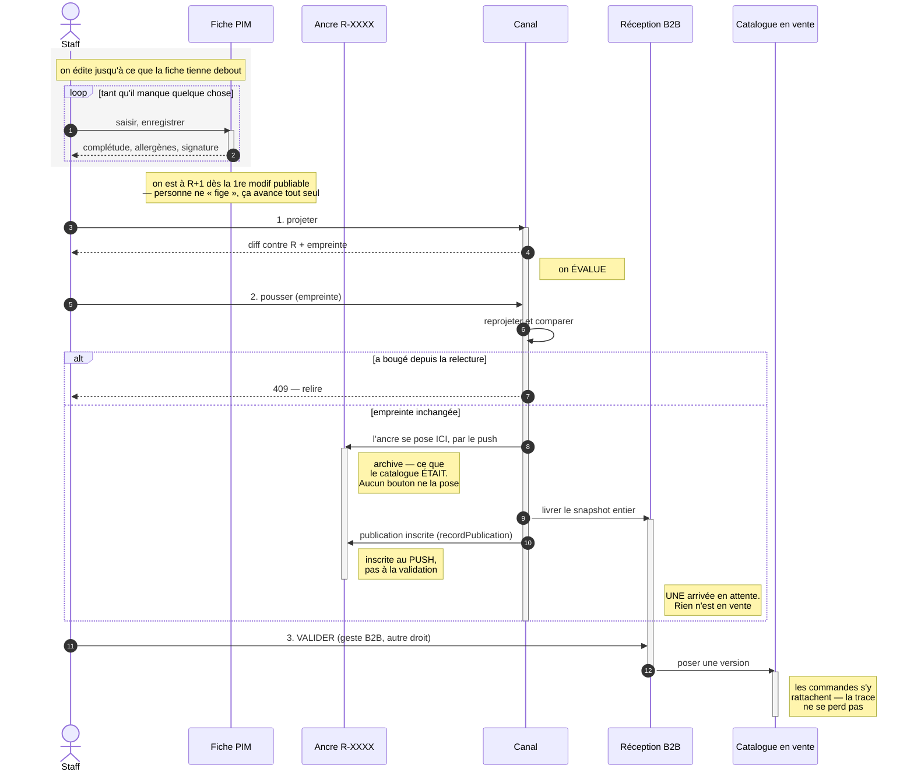

# Stage → évaluer → pousser — conception

**Écrit le** 2026-09-01 · **Revu le** 2026-09-02 ·
**État** : 📐 doc-first — **les décisions sont prises, rien n'est bâti** ·
**Portée** : `apps/lfd-api/src/pim/catalogue/revision/`,
`apps/lfd-api/src/pim/channels/`, `apps/lfd-api/src/b2b/catalog/`

> **Comment lire ce document.**
>
> - **Les treize questions du §11 sont toutes tranchées** (revue une par une avec
>   Hugo, les 2026-09-01 et 09-02). Une décision ne se rediscute pas sans un
>   fait neuf.
> - **Le plan du §15 est une proposition** : sa forme peut encore changer. Ne pas
>   confondre les deux.
> - **Chaque affirmation sur l'existant porte sa référence** — fichier et ligne.
>   Les vérifier avant de s'y fier : elles ont été justes au moment où on les a
>   écrites.
> - Ce que les versions successives ont changé, et **pourquoi**, est au §14. Un
>   plan qui se corrige sans dire de quoi n'a pas de valeur pour le suivant.
>
> ⚠️ **Ce document se contredisait à DIX endroits**, jusqu'à la relecture du
> 2026-09-02. Les trois pires, pour donner le ton : son diagramme de tête
> montrait un geste « figer » que le §4.1 bis supprime ; son tableau d'écrans
> annonçait « le geste _figer_ sort du push et devient explicite », l'inverse
> exact de sa propre décision ; et son plan rangeait `deleteMany` dans « ce qui
> ne bouge pas » alors que le §11.1 le fait bouger. S'y ajoutaient une
> chronologie fausse dans le même diagramme (la publication inscrite après la
> validation, alors que le code l'écrit au push), une copie de version décrite
> comme entière au §7.3 et partagée par contenu au §12, et quatre renvois à des
> questions « ouvertes » qui ne l'étaient plus.
>
> **Aucune décision n'était fausse.** Les dix venaient de décisions prises
> **après** les sections qui les portaient. C'est le mode de panne d'un document
> long, et il ne se corrige pas en relisant la conclusion : il se corrige en
> rouvrant chaque endroit qui parlait du sujet. Une onzième contradiction visait
> un **autre** document — [`flux-catalogue-et-versionnement.md`](flux-catalogue-et-versionnement.md)
> §14 décrivait encore le bouton retiré ici ; la note y est.

---

## 0. Le problème, en une phrase

**Rien ne relie ce qu'on relit à ce qu'on pousse.**

La simulation qu'on regarde et l'envoi qui suit sont deux appels séparés, chacun
relisant le catalogue en cours d'édition. Aucun identifiant, aucune empreinte, aucun refus
ne les rattache. Sur quatre-vingt-quinze articles ça ne se voit pas ; c'est
précisément pour ça qu'il faut le corriger avant que ça se voie.

---

## 1. Le cycle visé



⚠️ **L'inscription de la publication est au PUSH, pas à la validation.** Le
diagramme de la V2 faisait remonter une flèche du catalogue en vente vers
l'ancre, comme si valider inscrivait la livraison. Le code fait l'inverse :
`recordPublication` est appelé juste après `driver.send`, donc **avant** que
quiconque ait validé quoi que ce soit (`push.service.ts:91`). Une publication
atteste d'un **envoi**, jamais d'une acceptation.

⚠️ **Trois gestes, pas quatre — et « figer » n'en est pas un.** Le diagramme de
la V2 en montrait un quatrième, `S->>A: FIGER`, en tête de cycle. Il
contredisait le §4.1 bis, qui **retire** ce bouton, et il le contredisait à
l'endroit le plus lu du document. L'ancre se pose **par le push**, et par lui
seul.

### 1.0 🔴 Trois gestes, trois portées — et deux s'appellent « publier »

_(Question posée le 2026-09-01 : « ce que tu appelles figer, c'est le geste
Publier ? » — non, et la confusion est légitime.)_

| Le geste                 | Sa portée               | Ce qu'il fait                                                                                              |
| ------------------------ | ----------------------- | ---------------------------------------------------------------------------------------------------------- |
| **Publier au catalogue** | **UN produit**          | bascule `status` de `draft` à `published`. Une décision d'éligibilité, prise sur la fiche                  |
| ~~**Figer**~~            | **LE catalogue entier** | posait une ancre `R-XXXX`. ⚠️ **N'est plus un geste** — le §4.1 bis retire le bouton, l'ancre naît du push |
| **Pousser / livrer**     | **un canal**            | envoie ce que ce canal reçoit                                                                              |

Et **trois états**, qu'il faut autant distinguer que les gestes :

| L'état                        | Où            | Ce que c'est                                                                                          |
| ----------------------------- | ------------- | ----------------------------------------------------------------------------------------------------- |
| **R+1** — la version en cours | PIM           | ce qu'on édite. Elle avance à la première modification **publiable** (§4.2). Jamais servie à personne |
| **R**                         | PIM           | la dernière ancre publiée **sur tous les canaux** — un consensus, pas un compteur                     |
| **en ligne**                  | chez le canal | ce que ce canal sert **réellement**, qui peut être plus ancien que R                                  |

⚠️ **« Catalogue vivant » a été banni de ce document.** Il désignait R+1 — la
version en cours d'édition — et se lisait « ce qui est en ligne », c'est-à-dire
exactement le contraire. Les trois lignes ci-dessus n'ont aucun mot en commun,
et c'est délibéré.

⚠️ **Les deux premiers gestes portent le même mot, et c'est ma faute.** Le bouton de la
fiche a été renommé « Publier au catalogue » le 2026-09-01, pendant que
[`flux-catalogue-et-versionnement.md`](flux-catalogue-et-versionnement.md) §14
appelle « Préparer une publication » le bouton qui pose une ancre. Deux gestes
de portées différentes, deux fois le mot « publication ».

**[tranché — le §4.1 le résout mieux]** Réserver « publier » au **produit**.
Quant à « figer », le §4.1 le fait **disparaître comme geste** : on est à **R+1**
dès la première modification enregistrée, et pousser transforme R+1 en R.
Personne n'a plus à figer quoi que ce soit.

Et rappel du §4 : **figer n'est pas un geste.** L'ancre se pose automatiquement
au moment de la publication vers un canal — le §4.1 bis **retire** le bouton de
pose manuelle, qui déplaçait la référence de tous les diffs vers une version que
personne n'a reçue.

### 1.1 🔴 Deux objets, deux métiers — ne pas les confondre

La V1 faisait de l'ancre **la source du push**. C'était une erreur de casting, et
elle rendait le plan infaisable (§14.1). Séparation nette :

|          | **L'ancre** (`R-XXXX`)                                | **L'empreinte de projection**                  |
| -------- | ----------------------------------------------------- | ---------------------------------------------- |
| Répond à | « qu'est-ce que le catalogue **était** ce jour-là ? » | « ce que je pousse est-il ce que j'ai relu ? » |
| Portée   | le catalogue entier, vocabulaire du référentiel       | **un canal**, dans le vocabulaire de ce canal  |
| Durée    | permanente, c'est l'archive                           | le temps d'un aller-retour                     |
| Existe ? | oui, et elle marche                                   | non — à écrire, mais `fingerprint()` existe    |

L'ancre reste ce qu'elle est : l'archive, inscrite au moment du push par
`recordPublication`. **La garantie « ce que je relis est ce que je pousse » ne
passe pas par elle** — elle passe par une empreinte du **snapshot projeté**,
calculée par le canal, rendue avec l'aperçu, et redonnée au push qui refuse si
elle ne colle plus.

`fingerprint(value: unknown)` (`revision/domain/fingerprint.ts:15`) hache
n'importe quelle valeur via une forme canonique.

⚠️ **Mais pas le snapshot tel quel, et c'est tout le travail de la tranche 1.**
Une projection n'est pas déterministe aujourd'hui :

- `generatedAt` est **dans** le snapshot (`packages/catalog-sync/src/snapshot.ts:206`),
  posé par `new Date().toISOString()` (`push.service.ts:56`). Deux projections
  d'un catalogue identique à une milliseconde d'écart donnent deux empreintes —
  le push refuserait **toujours**.
- L'ordre des familles et des déclinaisons n'est pas total : `position` est un
  `Int @default(0)` sans unicité, donc Postgres départage par l'ordre physique,
  qui change après un `UPDATE`. Et `fingerprint` **conserve délibérément l'ordre
  des tableaux** (`fingerprint.ts:11-13`).

Le dépôt a déjà appris cette leçon et l'a écrite : `revision.ts:130-136` trie
les articles par SKU, avec le commentaire « sans ce tri, deux captures d'un
catalogue identique donneraient deux empreintes ».

**[proposé]** Ce qu'on hache n'est donc pas le snapshot mais une **forme
canonique de projection** : `generatedAt` retiré, familles et déclinaisons
triées par clé stable (SKU, id de famille). C'est un artefact à définir, pas un
appel à `fingerprint()` — et c'est le cœur de la tranche 1, pas son détail.

### 1.2 🔴 Où passe la frontière

Le PIM **livre** ; il ne décide pas de ce qui est en vente. La réception est une
table **du B2B**, et c'est le B2B qui valide, sur son canal, avec ses règles.

Le sens de dépendance est déjà le bon : `B2bCatalogDriver` est un **port publié
par `pim`**, et `b2b` s'y conforme
(`b2b/catalog/infrastructure/in-process-catalog.driver.ts:11-12` : « `b2b`
conforme au port publié par `pim`, jamais l'inverse. Le référentiel ignore
toujours qui le consomme »).

Ce qui manque n'est donc pas la frontière, c'est **ce qui se passe une fois
franchie** : `IngestCatalogService.apply()` écrit directement les tables de
VENTE. Livrer et mettre en vente sont le même geste, et il appartient au PIM.

⚠️ **Shopify ne suit pas ce découpage.** La « validation » y est celle d'une
boutique qui n'est pas à nous, et la réconciliation 3 voies existe pour vivre
avec. La symétrie s'arrête à l'empreinte de projection.

---

## 2. Ce qui existe déjà — à ne pas rebâtir

| Pièce                  | Où                                                     | Ce qu'elle fait                                                                                    |
| ---------------------- | ------------------------------------------------------ | -------------------------------------------------------------------------------------------------- |
| L'ancre                | `revision/domain/revision.ts`                          | `buildRevision()`, héritages **résolus**, empreinte par article                                    |
| L'empreinte            | `revision/domain/fingerprint.ts:15`                    | `fingerprint(unknown)` sur forme canonique — **générique**                                         |
| Le diff paresseux      | `revision/domain/diff.ts`                              | `planDiff()` sur les empreintes ; `diffItem()` au niveau payload                                   |
| Relecture d'une ancre  | `revision/domain/ports/catalog-revision.repository.ts` | `byReference()`, `indexOf()`, `payloadsOf()`                                                       |
| Trace d'un envoi       | idem                                                   | `recordPublication({ revisionId, channel, mode, outcome, report, … })`                             |
| Pré-push Shopify       | `channels/shopify/products/push.service.ts:62`         | `push(ids?, preview)` — **`preview` vaut `false` par défaut**                                      |
| Réconciliation 3 voies | `channels/shopify/products/reconciliation.ts:101`      | `to_remove`, `never_published`, `unknown`, `local_ahead`, `remote_drift`, `conflict`, `up_to_date` |
| Simulation B2B         | `channels/b2b-platform/products/push.controller.ts:15` | `dryRun` **par défaut `true`**                                                                     |
| Décision locale B2B    | `b2b/catalog/domain/entities/catalog-item.ts`          | `refreshFromPim()` ne **peut pas** toucher au prix négocié                                         |
| Garde de déploiement   | `pim/publication/publication-switch.ts`                | `@PublicationGesture()` — **fermé par défaut**                                                     |

---

## 3. Les défauts, vérifiés

### 3.1 🔴 La relecture et l'envoi ne sont reliés par rien

`channels/b2b-platform/products/push.service.ts:54-80` fait deux lectures de
la version en cours dans un même appel : `feed.preview(…)` construit le snapshot, puis
`TakeCatalogRevisionCommand` pose l'ancre depuis une seconde lecture
(`prisma-catalog-revision.source.ts:33`).

⚠️ **La V2 en tirait un grief, à tort.** L'ancre et le snapshot ne décrivent pas
la même chose et n'ont pas à coïncider : l'ancre archive **le catalogue**, le
snapshot est **ce qu'un canal reçoit**, et les deux populations diffèrent de
toute façon (§3.5). Ce qui relie l'ancre à ce qui est parti, c'est
`recordPublication`, pas l'égalité des lectures. L'ordre actuel — figer avant
d'envoyer — est le bon, et il est justifié dans
[`flux-catalogue-et-versionnement.md`](flux-catalogue-et-versionnement.md) §14.

**Le vrai défaut est ailleurs et il est pire** : le `dryRun` qu'on regarde est un
**troisième appel HTTP**, complètement séparé. Rien — ni identifiant, ni
empreinte, ni refus — ne relie « ce que j'ai relu » à « ce que j'envoie ».

Côté Shopify, même chose sans ancre :
`channels/shopify/products/push.service.ts:65-68` relit `publishable()` ou
`byIds()` à chaque appel. ⚠️ Et `push()` a `preview = false` **par défaut** : un
appel qui oublie le drapeau pousse pour de vrai.

### 3.2 ⚖️ Le retrait emporte la décision locale — c'est un CHOIX, pas une fuite

**La V1 se trompait ici, et c'est la correction la plus importante de cette
version.** Elle présentait la destruction du prix négocié comme un contournement
de l'agrégat. C'est une décision délibérée, écrite et testée.

- Le port : « Leur décision part avec eux — un prix négocié ne veut plus rien
  dire sans l'article qu'il tarifait. »
  (`b2b/catalog/domain/ports/catalog-item.repository.ts:32-34`)
- Le test, nommé _« un article retiré emporte sa décision »_, avec ce JSDoc :
  « L'autre face de la cascade, celle où elle est **juste** »
  (`test/catalog-ingest.e2e-spec.ts:161-175`).
- Le mécanisme : `removeMany` → `deleteMany`
  (`infrastructure/prisma-catalog-item.repository.ts:178`), cascade
  `onDelete: Cascade` de `catalog_item_overrides` (`schema.prisma`).

Le fait est exact ; **l'interprétation était fausse**. Ce document ne proposait
donc plus de l'inverser : il posait la question au §11.1 — **tranchée depuis, le
2026-09-01** : le retrait marque, il ne détruit plus, et une porte le tient.

Ce qui restait vrai et méritait d'être noté : une dépublication accidentelle
suivie d'un push détruit un tarif négocié sans trace, et la règle du dépôt
interdit le DELETE physique sur un agrégat métier. Deux arguments contre le choix
actuel — pas, à eux seuls, une preuve qu'il est faux.

✅ **Ce qui a emporté la décision est venu d'ailleurs** : le retour arrière
(§12). Ré-ingérer une version ancienne retire les SKU entrés depuis, donc
détruirait les prix négociés des articles les plus récents. Le choix d'origine
est juste **quand le retrait est définitif** ; il cesse de l'être dès qu'un
rollback existe. Tranché au §11.1 le 2026-09-01 — et l'objection du recyclage de
SKU est tenue par une porte, pas par une convention.

### 3.3 🟠 Un article reçu est en vente immédiatement

`CatalogItem.receive(facts)` pose `NO_DECISION`
(`b2b/catalog/domain/entities/catalog-item.ts:121`, `:91-96`), donc
`isHidden: false`. Le transport est **en-processus** : un push réel écrit les
tables B2B et l'article est visible du client dans la même requête. Pas d'étape
de validation.

### 3.4 🟠 Le B2B ne sait pas dire s'il est en écart

`b2b_channel_binding` porte `published_at`, `published_by`, `last_pushed_at`.
**Pas d'empreinte.** ⚠️ Et `last_pushed_at: NULL` a déjà un sens documenté —
« publié mais jamais parti, l'écart que l'écran doit montrer » (`schema.prisma`).

### 3.5 🔴 L'ancre et le canal ne parlent pas de la même population

`feed.preview` part de `membership.publishedProductIds()`, qui lit
`b2b_channel_binding` (`membership.service.ts:37-42`). L'ancre part de
`catalogue.publishable()`, qui rend **tout ce qui n'est pas archivé**
(`prisma-catalogue-reader.ts:54-57`) — brouillons compris.

Ce ne sont pas deux lectures du même ensemble séparées par une fenêtre : **ce
sont deux ensembles différents, tout le temps.** L'appartenance au canal
(`b2b_channel_binding`) est une décision explicite qui n'entre pas dans l'ancre,
et que `soldContexts` — la matrice de vente résolue — ne remplace pas.

C'est la raison de fond pour laquelle l'ancre ne peut pas être la source d'un
push : elle ne sait pas à qui le canal s'adresse.

---

## 4. Le modèle cible — l'empreinte garantit, l'ancre archive

**[proposé]** Une règle, et elle ne parle plus de l'ancre :

> **Un push refuse de partir si ce qu'il enverrait diffère de ce qui a été
> relu.**

Le mécanisme, en trois lignes :

1. L'aperçu d'un canal projette ce qui partirait **et rend l'empreinte** de ce
   snapshot projeté : `fingerprint(snapshot)`.
2. Le push prend cette empreinte en paramètre.
3. Il reprojette, recalcule, et **refuse** (`409`) si l'empreinte a changé.

Ce que ça donne, et qui manquait :

- « J'ai relu R-7WT4NA chez Shopify » et « je pousse ce que j'ai relu » sont la
  même phrase, **par refus** et non par confiance.
- Chaque canal garde **son** vocabulaire. Aucune réhydratation, aucun mapper,
  aucune extension de l'ancre — donc aucun changement de ce que signifient les
  ancres déjà posées.
- L'appartenance au canal est dans la projection, là où elle a toujours été
  (§3.5). Rien à déplacer.
- Le refus est **cheap** : reprojeter coûte ce que coûte déjà un `dryRun`.

🔴 **L'ancre ne bouge pas.** La V2 voulait sortir `TakeCatalogRevisionCommand`
du push pour en faire un bouton. C'est exactement ce que
[`flux-catalogue-et-versionnement.md`](flux-catalogue-et-versionnement.md) §14 a
défait le 2026-08-31, et son argument tient : « une ancre qu'il faut penser à
poser est une ancre qu'on oublie, et une ancre oubliée ne vaut rien ». Le geste
qui doit la poser est celui qui a déjà lieu — la publication.

⚠️ **La V2 ajoutait ici que le bouton « Préparer une publication » restait
disponible « pour figer avant une modification risquée ». Faux depuis le §4.1
bis**, qui le retire : une ancre posée à la main déplace `latest()`, donc la
référence de tous les diffs, silencieusement. Le besoin qu'il servait est
tranché au §11.11 — c'est une sauvegarde, pas un bouton.

L'ancre garde donc son rôle et son déclencheur. Ce document n'ajoute qu'une
chose au push : le refus.

⚠️ **Ce que ce modèle ne donne PAS**, et la V1 le promettait à tort : rejouer
une **ancre** ancienne n'est **pas** sûr. L'ingestion calcule les retraits contre
le miroir courant, pas contre l'ancre précédente ; rejouer R-ancienne retirerait
tout ce qui est entré depuis.

⚠️ **À ne pas lire comme « on ne rejoue rien ».** Le §12 rejoue — mais un
**snapshot de version**, pas une ancre. Les deux objets n'ont ni le même
contenu ni la même complétude (§1.1, §12), et c'est précisément pourquoi l'un
se rejoue et l'autre non.

---

### 4.1 🔴 « À partir de la première modification, on est à R+1 »

_(Proposé par Hugo, 2026-09-01 — et c'est la bonne façon de voir, à une
précision près qui décide de tout.)_

**R+1 existe déjà. Il n'a pas de nom, c'est tout.**
`GetCatalogOverviewHandler` construit la révision du catalogue **tel qu'il est**
et la compare à la dernière ancre — « il se calcule comme une capture qu'on ne
poserait pas ». Il en rend `added` / `removed` / `changed`. Autrement dit : le
compte des modifications depuis R est **déjà servi**, avec exactement la même
mécanique que la pose, « donc sans qu'un écran puisse annoncer un changement que
la capture ignorerait ».

Ce que la proposition apporte n'est donc pas un mécanisme, c'est un **nom** — et
il vaut cher :

- « figer » **disparaît comme geste**. On n'a plus à penser à poser une ancre :
  on est à R+1 dès la première modification enregistrée, et pousser transforme
  R+1 en R. La collision de vocabulaire du §1.0 se dissout d'elle-même.
- L'écran d'évaluation cesse d'être « le diff d'une chose qu'on vient de
  fabriquer » et devient « **R+1, 12 changements depuis R-7WT4NA** ». C'est ce
  qu'on relit, et ça a une identité avant qu'on la pousse.
- La garde d'idempotence existante prend tout son sens : deux pushs d'un
  catalogue inchangé sont deux publications d'**un** R, ce qu'ils sont.

⚠️ **La précision qui décide de tout : R+1 ne se PERSISTE pas.**

Deux lectures, et une seule tient :

|                                | R+1 = le catalogue en cours d'édition, nommé | R+1 = une ancre brouillon persistée                                           |
| ------------------------------ | -------------------------------------------- | ----------------------------------------------------------------------------- |
| Immuabilité                    | conservée — R+1 n'est pas une ancre          | **détruite** : « R+1 » désignerait un contenu différent d'une heure à l'autre |
| Coût                           | nul, c'est déjà calculé                      | ré-empreinte à chaque enregistrement de section                               |
| Le magasin adressé par contenu | intact                                       | une ancre qui change de contenu cesse d'être adressable par lui               |

C'est la première. Une ancre vaut par le fait qu'elle **ne bouge plus** ; un
brouillon d'ancre qu'on amende à chaque saisie est un objet qui a le nom d'une
archive et le comportement d'un tampon.

### 4.1 bis 🔴 Le bouton « figer » est un piège — le retirer

_(Hugo, 2026-09-01 : « figer manuellement c'est se tirer une balle dans le
pied ». Vérifié, et c'est pire que « manuel ».)_

**Une ancre posée à la main s'intercale entre R et R+1, et déplace la référence
de tous les diffs — silencieusement.**

`GetCatalogOverviewHandler` compare le catalogue courant à `this.revisions.latest()`,
et `latest()` rend **la dernière ancre POSÉE**, sans regarder si elle a été
publiée — les publications sont inscrites à part
(`catalog_revision_publication`). Donc :

1. quelqu'un fige à la main, au milieu d'une session d'édition ;
2. cette ancre devient `latest()` ;
3. « N changements depuis la dernière révision » se calcule désormais contre
   **une version qu'aucun canal n'a**, et que personne n'a validée ;
4. rien à l'écran ne distingue cette ancre-là d'une ancre publiée.

Le §14 de [`flux-catalogue-et-versionnement.md`](flux-catalogue-et-versionnement.md)
avait déjà retiré au bouton son rôle de déclencheur, en gardant l'objet pour
« figer avant une manœuvre risquée ». **Ce reste-là ne survit pas au §4.1** :
depuis que R+1 a un nom et que son diff contre R est affiché, on n'a plus besoin
de figer pour avoir un point de comparaison — **R est le point de comparaison**,
et il a la propriété que l'ancre manuelle n'a pas : quelqu'un l'a reçu.

**[proposé]** Retirer le geste de pose manuelle. Une ancre naît d'une
publication, et d'elle seule.

⚠️ **Mais retirer le bouton ne corrige que le symptôme.** La cause est que
`latest()` rend la dernière ancre **posée**, sans regarder si elle a été
publiée — et elle reste vraie sans le bouton. Le §4.3 la corrige à la racine.

✅ Le besoin qu'il servait — « un point de reprise avant une grosse manœuvre » —
est légitime, et sa réponse **existe déjà, hors du code** : une sauvegarde
restaurée vers une base neuve avant l'opération
([`ops/runbook.md`](../ops/runbook.md)). Tranché au §11.11 : on ne construit
aucun objet applicatif pour ça.

### 4.2 « R quand c'est publié chez tout le monde » — deux précisions

_(Hugo, 2026-09-01 : « une fois que le catalogue est publié chez tout le monde
il est R ; dès la première modif publishable on est R+1 ».)_

**Le principe est le bon.** Les deux mots qui le portent — « tout le monde » et
« publishable » — cachent chacun une décision.

#### « Chez tout le monde » : R est un CONSENSUS, pas un compteur

`catalog_revision_publication` inscrit une publication **par canal**
(`{ revisionId, channel, mode, outcome, … }`). Rien n'oblige les canaux à
avancer ensemble, et ils ne le feront pas : un push Shopify peut passer pendant
qu'une arrivée B2B attend sa validation (§6), ou qu'une boutique est
injoignable.

Donc, honnêtement :

> **R = la plus récente ancre publiée sur TOUS les canaux.**
> Chaque canal porte en plus **son** dernier R, et ils peuvent diverger.

Le scalaire « on est à R » n'existe que **quand les canaux sont d'accord**. Le
reste du temps, la vérité est une ligne par canal — et c'est précisément ce que
l'écran doit montrer, parce qu'un canal en retard est une information
commerciale, pas un détail technique.

⚠️ Conséquence : « R+1 » se lit toujours **par rapport à quoi**. « 12 changements
depuis R-7WT4NA » n'a de sens que si l'on dit sur quel canal R-7WT4NA est
effectivement posée.

#### « Publishable » : et donc l'ancre ne doit PAS contenir les brouillons

Le mot tranche le §11.2, et dans le bon sens.

Si R+1 doit avancer à la première modification **publiable**, alors éditer un
brouillon ne doit rien faire avancer : rien de ce qu'on y touche n'atteindra un
canal. Or aujourd'hui **c'est l'inverse** : l'ancre est bâtie sur
`catalogue.publishable()`, qui rend tout ce qui n'est pas archivé
(`prisma-catalogue-reader.ts:54-57`), et `status` fait partie du payload d'un
article. Renommer un brouillon change donc son empreinte, donc celle de la
révision — et ferait avancer R+1 sans que rien de vendable n'ait bougé.

**[proposé]** Une ancre ne contient que ce qui est **publié**.

🔴 **Mais PAS en changeant le filtre de `publishable()` — correction du
2026-09-02.** La V3 écrivait « `publishable()` change de filtre, et de nom ». Le
constat sur le nom est juste : la méthode rend « tout ce qui n'est pas archivé »,
ce qui n'est pas « publiable ». La conclusion, elle, était **trop large** — la
méthode a **trois** appelants, et le §4.2 n'en regardait qu'un :

| Appelant                                                       | Ce qu'il en fait                                                |
| -------------------------------------------------------------- | --------------------------------------------------------------- |
| `revision/infrastructure/prisma-catalog-revision.source.ts:33` | l'ancre — **le seul que le §4.2 vise**                          |
| `channels/shopify/products/push.service.ts:67`                 | **ce que Shopify pousse** quand aucun `productIds` n'est fourni |
| `channels/shopify/products/reconciliation.service.ts:162`      | le tableau 3 voies                                              |

Et un brouillon **part réellement chez Shopify**, délibérément, en `DRAFT` :
`status: product.status === "published" && soldOnStorefront ? "ACTIVE" : "DRAFT"`
(`shopify/products/projection.ts:101`). Restreindre le filtre aurait donc, sur
une boutique en ligne : supprimé la préparation d'une fiche côté Shopify avant sa
publication, fait basculer en « À retirer » toutes les fiches brouillon déjà
là-bas, et laissé ces fiches orphelines — car `to_remove` **ne supprime rien**,
c'est un libellé d'écran (`publication-shopify.ts:35`). Du bruit dans un écran
d'alerte, c'est-à-dire un écran mort : le mode de panne du §5.1 bis, une deuxième
fois.

**Ce qu'on fait à la place**, et qui atteint exactement le but sans toucher à la
production :

- `publishable()` est **renommé** `notArchived()` — filtre **inchangé**. Il dit
  enfin ce qu'il fait, et Shopify comme la réconciliation le gardent tel quel.
- Le port gagne `published()` — filtre `status === "published"` — et **la source
  d'ancre est son seul appelant**.

Une méthode de plus, un renommage, zéro changement de comportement pour un canal
en ligne.

⚠️ Le prix subsiste, inchangé et réel : les ancres déjà posées contiennent les
brouillons. Après la bascule, un diff qui enjambe ce changement montrerait des
« retraits » massifs qui ne sont que la sortie des brouillons. À traiter comme
une bascule de sens, pas comme un correctif — donc en le disant sur l'écran des
révisions.

**Et R+1 ne remplace pas l'empreinte du §4** — il la rend nécessaire, plutôt.
Puisque R+1 est la version en cours d'édition, il **bouge pendant qu'on le relit**. C'est
précisément ce que l'empreinte pin : « j'ai relu R+1 dans cet état-là, refuse si
ce n'est plus lui ». Le nom donne l'identité, l'empreinte donne la garantie.

### 4.3 🔴 `latest()` rend la dernière ancre POSÉE — le §4.2 dit PUBLIÉE

_(Contradiction relevée le 2026-09-02, tranchée le jour même.)_

**Le code et le §4.2 divergeaient déjà, et le §4.1 bis a contourné au lieu de
corriger.** `latest()` est un `orderBy: { takenAt: "desc" }` sans le moindre
filtre sur la publication
(`revision/infrastructure/prisma-catalog-revision.repository.ts:28`), alors que
le §4.2 définit R comme « la plus récente ancre **publiée** ». Retirer le bouton
de pose manuelle supprimait la façon la plus commode de fabriquer l'écart ; ça ne
supprimait pas l'écart.

🔴 **Et `hash @unique` (§11.7) le rend visible.** Scénario A→B→A, celui que la
décision assume :

|                      | aujourd'hui                             | avec l'unicité seule                                |
| -------------------- | --------------------------------------- | --------------------------------------------------- |
| on republie l'état A | une ancre A′ est posée, `latest()` = A′ | A′ refusée, on rend A — mais `latest()` reste **B** |
| l'écran affiche      | rien à signaler ✅                      | « N changements depuis R-B » ❌                     |

Sur un catalogue qu'on vient de publier entier. C'est mot pour mot le grief du
§4.1 bis, réintroduit par la porte de derrière.

#### Les deux décisions sont indissociables — chacune casse sans l'autre

- **`@unique` sans `lastPublished()`** : le tableau ci-dessus.
- **`lastPublished()` sans `@unique`** : un push qui échoue laisse une ancre
  **orpheline**. Elle est posée **avant** l'envoi (`push.service.ts:82` — l'ordre
  est délibéré, cf. §3.1), et l'échec n'inscrit qu'une publication `failed`. Au
  retry, la référence est l'ancienne ancre publiée, le hash recalculé ne lui
  correspond pas, et rien n'empêche de créer un **doublon**. Aujourd'hui ça
  n'arrive pas — précisément parce que `latest()` rend la dernière posée,
  orpheline comprise.

Ensemble, elles se rattrapent : au retry, l'unicité refuse, on récupère l'ancre
orpheline et on inscrit la publication réussie **dessus**. Un échec cesse de
laisser un déchet.

#### Les trois pièces

1. **La garde change de question.** `TakeCatalogRevisionHandler` cesse de
   demander « est-ce la dernière ? » pour demander « **cette ancre existe-t-elle
   ?** ». Comparer à `latest()` était une approximation de cette question-là —
   juste tant qu'on ne revient jamais en arrière. L'unicité ne sert plus alors
   qu'à la course réelle entre deux pushs simultanés.
2. **`latest()` devient `lastPublished()`** : l'ancre de la dernière publication
   `live` / `sent`.

   🔴 **Correction du 2026-09-02, trouvée en l'écrivant** : « la dernière ancre
   PORTANT une publication réussie » — la formulation d'origine — rejoue le bug
   qu'on ferme. Après A → B → A, l'ancre A reçoit une seconde publication mais
   garde sa date de **pose** ; trier les ancres publiées par `takenAt` rend donc
   **B**, et l'écran annonce des changements sur un catalogue qu'on vient de
   republier entier. C'est le tableau ci-dessus, à un tri près. Il faut partir de
   la **publication** (`publishedAt` décroissant) et remonter à son ancre.

3. **Le port gagne `byHash()`**, qu'il n'a pas
   (`domain/ports/catalog-revision.repository.ts` : `latest`, `save`, `list`,
   `byReference`, `indexOf`, `recordPublication`, `payloadsOf`).

Deux appelants seulement sont concernés — l'écran
(`application/get-catalog-overview.ts:38`) et la garde
(`application/take-catalog-revision.ts:55`).

#### ⚖️ « Publiée » veut dire au moins une, pas toutes

**[tranché par Hugo, 2026-09-02]** Le §4.2 définit R comme un **consensus** :
« la plus récente ancre publiée sur TOUS les canaux ». Appliqué tel quel à
`lastPublished()`, le diff perdrait sa référence dès qu'un canal est en retard —
c'est-à-dire souvent — et l'écran principal du catalogue n'afficherait rien dans
le cas le plus banal.

Donc : `lastPublished()` = **au moins une** publication réussie. Le consensus
n'est pas abandonné, il retrouve sa place — une information d'**écran**, la ligne
par canal que le §4.2 réclame déjà (« Shopify est deux ancres en arrière »).
Ce qui informe ne doit pas devenir le dénominateur de tout.

---

## 5. Côté canal — l'aperçu, et son empreinte

### 5.1 🔴 L'aperçu B2B existe déjà — et il rend les sorties

La V2 posait `GET /pim/channels/b2b/preview` et en déduisait qu'il faudrait un
port de retour pour connaître les sorties, puisque
`DryRunB2bCatalogDriver.send` laisse délibérément `removedSkus: []`
(`driver.ts:30-31` : « lui seul suppose de connaître l'état de l'autre côté »).

**C'était se créer le problème pour le résoudre.** `CheckCatalogParityService`
(`b2b/catalog/application/check-catalog-parity.service.ts:26-50`) compose déjà
la **vraie** projection PIM (`B2bCatalogFeedPreview`) et le **vrai** miroir B2B
(`CatalogReader.listSellable()`), et `compareToReference`
(`b2b/catalog/domain/catalog-parity.ts:69-121`) rend `missing`, **`stale` — les
sorties** —, `priceGaps`, `vatGaps`, `nameGaps`. C'est servi par
`GET /admin/catalog/parity`.

Il vit **côté `b2b`**, c'est-à-dire du seul côté qui voit les deux. C'est
l'aperçu, il tourne, et il ne demande aucun port.

**[proposé]** L'aperçu B2B **est** la parité, à qui l'on ajoute une chose :
l'empreinte canonique de la projection (§1.1). Le push la reprend et refuse si
elle a changé.

Cela règle aussi la contradiction §5 ↔ §9 de la V2 : le diff n'avait pas
d'« avant », puisqu'un hash n'est pas un payload. **L'« avant » est le miroir
B2B**, et la parité le lit déjà.

### 5.1 bis Deux questions, un seul comparateur — le référent change

**[tranché par Hugo, 2026-09-02]** Le §5.1 réutilise la parité comme aperçu
avant push. Ça marche, et ça **cesse** de marcher si le même appel sert aussi de
contrôle de santé : le §6 fait exprès que le miroir retarde, donc l'écran
afficherait un écart parfaitement légitime en permanence — c'est-à-dire un écran
qu'on n'ouvre plus.

La racine n'est pas le comparateur, elle est le **référent**. `compareToReference`
est pure et reste seule ; ce sont ses appelants qui diffèrent :

| Question posée                                             | Référent                         | Rendu par                  |
| ---------------------------------------------------------- | -------------------------------- | -------------------------- |
| « Qu'est-ce que je m'apprête à envoyer ? »                 | la projection PIM **maintenant** | l'aperçu avant push (§5.1) |
| « Quelque chose a-t-il bougé qu'aucun geste n'explique ? » | la **dernière version validée**  | l'écran de santé           |

🔴 **Et l'écran de santé cesse de rendre UN écart.** Il en confondait trois, qui
n'ont ni la même cause, ni le même responsable, ni la même urgence :

| Ce qu'on constate                       | Ce que ça veut dire                            | Où ça se lit             | Alarme ? |
| --------------------------------------- | ---------------------------------------------- | ------------------------ | -------- |
| R+1 ≠ R côté PIM                        | on travaille sur des fiches, rien n'est poussé | les empreintes, côté PIM | non      |
| une arrivée attend validation           | le PIM a poussé, personne n'a validé           | `catalog_delivery`       | non      |
| le miroir ≠ la dernière version validée | **rien n'explique cet écart**                  | `compareToReference`     | **oui**  |

#### Deux référents, donc DEUX routes — et un consommateur qu'on ne voit pas

**[tranché le 2026-09-02]** `GET /admin/catalog/parity` **ne change pas** : elle
reste l'aperçu, référent « la projection du moment ». L'écran de santé prend une
route à lui, avec son référent à lui. Changer la première aurait cassé ses
consommateurs pour servir un besoin qui n'est pas le sien.

🔴 **Et l'un de ces consommateurs ne casse pas bruyamment.** La route en a
quatre : deux e2e (`test/catalog-parity.e2e-spec.ts:147,154`), l'écran
`pim/integration/b2b-integration/b2b-integration.ts:96`, et
**`.github/workflows/ops_catalog_parity.yml:37`**, qui l'appelle **en
production**. Les trois premiers rougissent au moindre changement de forme ; le
quatrième est en `workflow_dispatch`, donc il échoue **le jour où quelqu'un le
lance**, des semaines plus tard. Ce n'est pas une hypothèse : il lisait huit
champs disparus et personne ne le savait (réparé le 2026-09-02, l'en-tête du
fichier le raconte).

Le workflow **migre vers la route de santé**, dans le même lot que la tranche 11 :
ce qu'il surveille est « le miroir a-t-il décroché », pas « qu'est-ce que je
m'apprête à envoyer ».

Une seule des trois lignes est encore une parité — les deux autres se **lisent**,
elles ne se comparent pas. C'est le vrai résultat du découpage : l'écran arrête d'être
« un contrôle de parité » pour devenir « où en est le catalogue », et la seule
ligne qui doit réveiller quelqu'un cesse d'être noyée par les deux qui ne le
doivent pas.

Le troisième cas n'est pas théorique : une ingestion interrompue en cours de
route, une écriture directe en base, une restauration de sauvegarde. C'est
exactement ce qu'un contrôle de parité existe pour attraper, et c'est ce qu'il ne
sait pas montrer aujourd'hui.

#### 🔴 Le miroir de la parité n'est pas ce qui est VENDABLE — c'est ce qui est REÇU

_(Contradiction relevée le 2026-09-02. Sans elle, le découpage en trois ci-dessus
ne servait à rien : la ligne alarmante se serait allumée sur le geste le plus
banal du commercial.)_

`CheckCatalogParityService` lit le miroir par `CatalogReader.listSellable()`. Ce
port ne rend pas le miroir : il rend ce que la boutique peut **vendre**, et il
retire donc deux populations (`infrastructure/prisma-catalog.reader.ts:88-105`) :

- les articles **masqués localement** (`OR: [{ override: null }, { override: { isHidden: false } }]`) ;
- les articles **sans taux applicable**, ni sur l'article ni sur sa famille.

Or masquer un article est un geste normal, porté par l'agrégat (`hide()` /
`show()`, `catalog-item.ts:200-206`), exposé par `admin-catalog.controller.ts` —
et c'est précisément le droit `b2b_catalog:write` que le §11.3 vient de donner au
commercial. Chaque article qu'il masque tomberait en `missing`, c'est-à-dire sous
la ligne « **rien n'explique cet écart** ». La décision qui donne le droit
fabriquait le bruit que la décision d'à côté prétendait supprimer.

🔴 **Et le raisonnement juste était DÉJÀ écrit dans le fichier — pour le prix.**
`catalog-parity.ts` le dit en toutes lettres : « on compare le prix du
référentiel, pas le prix appliqué. Le prix B2B négocié est une **décision
légitime de la plateforme, pas une dérive**. Les confondre ferait sonner l'alarme
sur chaque client à qui l'on a consenti un tarif — c'est-à-dire tout le temps,
donc jamais. »

`LocalDecision` porte **trois** décisions : `priceMillicents`, `isHidden`,
`isFeatured` (`catalog-item.ts:82-88`). La doctrine n'avait été appliquée qu'à la
première. C'est le même argument, mot pour mot, pour les deux autres.

**La correction ne demande aucun port neuf.** `CatalogAdminReader.list()` rend
**tout** `catalog_items` — aucun `where`
(`infrastructure/prisma-catalog-admin.reader.ts:38-44`) — avec les quatre champs
que `MirrorEntry` réclame : `sku`, `name`, `pimPriceMillicents`, et un
`vatRatePercent` déjà résolu article → famille (`:69-70`). La parité **est** un
écran d'administration ; elle lit le port d'administration.

| Cas                                         | Avec `listSellable()` | Avec `CatalogAdminReader.list()`                            |
| ------------------------------------------- | --------------------- | ----------------------------------------------------------- |
| article reçu, masqué par un commercial      | `missing` — **faux**  | rien à signaler ✅                                          |
| article reçu, famille sans taux dans le PIM | `missing` — **faux**  | `stale` ✅ — le PIM ne l'enverrait plus, on le tient encore |
| article jamais arrivé                       | `missing` ✅          | `missing` ✅                                                |

Le second cas se range **tout seul**, et du bon côté : un article dont le taux a
disparu côté PIM sort de la projection (motif `variant_sans_taux`), donc de la
référence — il est bien « dans le miroir, plus publié ».

⚠️ **Dette relevée en chemin, hors sujet mais à ne pas taire** :
`check-catalog-parity.service.ts` appelle `new Date()` en couche application, ce
que le `Clock` interdit (CLAUDE.md §3.2). Son JSDoc justifie même l'appel unique
— ce qui rend la dette d'autant plus facile à ne jamais voir. À rebrancher quand
on touchera ce fichier.

✅ **Et une objection écartée, vérifiée le 2026-09-02.** La contradiction
d'architecture reprochait à ce service d'importer `B2bCatalogFeedPreview`
« directement, pas par un port », en violation du « port uniquement » de la
matrice. C'est **faux** : `B2bCatalogFeedPreview` **est** une classe abstraite,
donc un port, et son propre JSDoc l'écrit — « `b2b` lit un port publié par `pim`,
jamais une table ». Le service est conforme.

⚠️ La violation existe, mais dans le fichier d'à côté — celui vers lequel cette
section redirige la parité. `prisma-catalog-admin.reader.ts:4-5` importe
`findMapping` et `toInco`, deux **fonctions concrètes**, et s'en sert pour
recalculer des libellés d'allergènes que `catalog_items.allergen_labels` porte
déjà. Ça n'affecte pas la parité — elle ne compare que SKU, nom, prix et taux —
donc cette section **ne l'aggrave pas**. Inventaire et arbitrage dans
[`todos/todo-mur-entre-contextes.md`](../todos/todo-mur-entre-contextes.md).

### 5.2 Shopify — l'empreinte au grain du PRODUIT, pas du canal

⚠️ Une empreinte du snapshot entier serait fausse ici :
`POST /pim/channels/shopify/products/push` prend des `productIds`
(`products.controller.ts:65-67`). On y pousse un sous-ensemble, et une empreinte
globale ferait refuser un push de trois fiches parce qu'une quatrième, qu'on ne
pousse pas, a bougé.

Et Shopify a **déjà** l'empreinte au bon grain : `fingerprint(payload)` par
produit, plus `lastPushedHash` (`push.service.ts:120` à l'aperçu, `:203` au
push). Ce qui manque
tient en une ligne — `previewOne` calcule le hash et ne le rend pas.

L'aperçu Shopify reste donc ce qu'il est — la réconciliation 3 voies, plus les
collections `tva-*` que l'envoi ferait naître — et gagne les hachés par produit.
Le push les reprend, produit par produit.

⚠️ Deux `fingerprint` coexistent dans le dépôt : `revision/domain/fingerprint.ts:15`
(tri `a < b`) et `shopify/products/projection.ts:175` (tri `localeCompare`, donc
dépendant de l'ICU). Le second est celui que Shopify utilise déjà. À réconcilier
ou à assumer, pas à ignorer.

⚠️ Le comparateur d'un diff au niveau payload est `diffItem()` (`diff.ts:87`),
**pas** `diffComparable()` (`reconciliation.ts:125`), qui compare trois champs
Shopify écrits en dur.

---

## 6. Côté B2B — la réception, puis la validation

### 6.1 🔴 Pourquoi une réception, et pas un état sur l'article

Un état `pending` sur `CatalogItem` ne gate que les **arrivées**. Un article déjà
en vente dont le PIM change le **prix** serait rafraîchi sur place
(`refreshFromPim()` remplace les faits), et le nouveau prix partirait au client
sans relecture — c'est-à-dire que le cas le plus sensible passerait, en croyant
tout retenir.

**[proposé]** La livraison écrit une **arrivée** : le snapshot reçu, entier, à
côté des faits de vente. La validation le promeut.

### 6.2 🔴 Une seule arrivée en attente, jamais une file

C'est la décision qui répond aux trois trous de la V1 :

- **L'arrivée porte le snapshot COMPLET**, pas des faits par SKU. Un retrait est
  l'_absence_ d'un SKU : il ne s'exprime pas dans une table de lignes entrantes.
  Sans le snapshot entier, « ce qui sort » n'est pas validable.
- **Une livraison REMPLACE l'arrivée en attente.** Il y en a zéro ou une, jamais
  deux. L'ordre cesse d'être une question : on ne peut pas valider une arrivée
  périmée, elle n'existe plus. Le prix est qu'une livraison efface une relecture
  en cours — assumé, et l'écran doit le dire.
- **Les sorties se calculent contre les faits de VENTE**, pas contre l'arrivée
  précédente : la validation change les faits de vente, c'est donc eux la
  référence.

### 6.2 bis 🔴 Tout-ou-rien bloque, partiel laisse des restes — donc ni l'un ni l'autre

La V2 ne tranchait pas, et ne le listait même pas comme ouvert. Les deux réponses
évidentes sont mauvaises :

- **Tout-ou-rien** : un catalogue de 95 articles dont **un** porte un prix faux
  ne peut pas être validé. Retour au PIM, correction, re-push — qui **remplace**
  l'arrivée et oblige à tout relire. Plus le catalogue grossit, plus la
  probabilité qu'un article annule la relecture des 94 autres monte. C'est
  exactement le cas qui motive le chantier.
- **Validation partielle étalée** : des lignes validées, d'autres non, et une
  livraison qui remplace l'arrivée détruit un travail à moitié fait.

**[proposé] Une troisième voie : un seul geste, mais des lignes REFUSABLES.**

La validation clôt l'arrivée en une fois. Avant de la clore, l'opérateur peut
**écarter des lignes** : une ligne écartée n'entre pas dans la version, et le SKU
**garde ses faits de vente courants** — il n'a simplement pas changé.

Trois propriétés, et ce sont elles qu'on achète :

- **rien ne bloque** : un prix faux s'écarte, les 94 autres passent ;
- **rien ne reste en suspens** : après le geste, l'arrivée est close. Il n'existe
  jamais d'arrivée à moitié validée, donc « une livraison remplace l'arrivée » ne
  peut détruire aucun travail ;
- **une version = une décision**, prise par quelqu'un, à un instant.

⚠️ Le prix : un SKU écarté reste sur ses anciens faits **sans que rien ne le
rappelle** au prochain push, où il réapparaîtra dans le diff. C'est le bon
comportement — on ne veut pas d'une liste d'exclusions permanente — mais l'écran
doit dire « déjà écarté la fois précédente », sans quoi on l'écartera dix fois.

⚠️ **Oui, c'est une duplication.** L'arrivée est une copie, côté `public`, d'un
snapshot que le PIM a déjà produit. Une ligne, un JSON, pas un magasin adressé
par contenu — mais une copie quand même. C'est le prix de « le B2B possède sa
boîte de réception », et il vaut mieux le dire que le découvrir.

### 6.2 ter Le délai de validation n'est PAS borné — et l'attente se voit

**[tranché par Hugo, 2026-09-02]** Aucune péremption, aucune validation
automatique. Une arrivée peut attendre indéfiniment.

**Parce que l'attente est bénigne par construction.** Une arrivée non validée
laisse la plateforme sur sa **dernière version validée** — c'est-à-dire
exactement ce que le §7 existe pour permettre. Rien ne casse, rien ne se
dégrade, personne ne facture faux.

Les deux formes de borne sont pires que le mal qu'elles prétendent traiter :

- **Une péremption** détruit du travail et ne change rien à la situation : la
  plateforme reste sur l'ancienne version, en ayant perdu l'arrivée en plus.
- **Une validation automatique** supprime la relecture qu'on vient d'instituer,
  et le fait sur le chemin du prix.

🔴 **Sauf pour une chose, et c'est le pendant exact du §11.10** : une correction
d'allergène qui dort dans une arrivée oubliée. On a refusé de _retenir_ une
version pour ne pas bloquer une telle correction — il serait absurde de la
laisser bloquer par oubli à l'étage suivant.

D'où : **pas de borne, mais une escalade selon ce que l'arrivée PORTE.**

🔴 **Correction du 2026-09-02 — ce n'est PAS `engagedLines` qui classe
l'arrivée.** La première rédaction disait « le même calcul » ; c'était confondre
deux questions qui n'ont ni le même moment, ni la même population :

| La question                              | Population                        | Quand               | L'élément                     |
| ---------------------------------------- | --------------------------------- | ------------------- | ----------------------------- |
| « Qu'est-ce que cette arrivée change ? » | les SKU de l'arrivée et du miroir | à la **réception**  | `diffDelivery` — **manquait** |
| « Qui est touché ? »                     | les commandes ouvertes            | à la **validation** | `engagedLines` (§15 · D)      |

`engagedLines` ne voit que les commandes ouvertes. Une correction d'allergène sur
un article que **personne n'a commandé** ne lui produit aucune ligne — donc
aucune cloche, dans le seul cas où ce paragraphe admet que l'attente fait mal.
La garde ne gardait rien, et c'est le cas majoritaire : un article corrigé n'est
pas nécessairement engagé.

**`diffDelivery(delivery, mirror)`** est le calcul qui manquait — pur, il rend
par SKU les champs qui changent (et le retrait comme un champ). L'escalade le
lit ; `engagedLines` en devient un **consommateur** plutôt qu'un doublon, en le
croisant avec les commandes ouvertes. Un seul diff, deux lectures.

✅ **Et il était nécessaire de toute façon** : le §8 promet à l'écran B2B
« l'arrivée en attente, **son diff**, sa validation ». Ce diff n'avait aucun
élément dans le plan.

Une arrivée « prix et textes » dort sans drame ; une arrivée qui touche une
déclaration d'allergène sonne à la cloche dès la réception —
`StaffNotifier` existe, avec son anti-doublon par `idempotencyKey` et sa poussée
vers les téléphones. Et l'écran de santé (§5.1 bis) affiche l'ancienneté de
l'arrivée en attente : un fait, pas une alarme.

⚠️ **Ce qu'on ne promet PAS, parce que le dépôt ne peut pas le tenir : une
relance périodique.** Il n'existe aucune tâche planifiée dans tout le dépôt —
ni `@nestjs/schedule`, ni le moindre `@Cron`, et les trois workflows `ops_*`
sont en `workflow_dispatch` sans `schedule:`. La cloche sonne donc **à la
réception**, qui est un événement, donc gratuit. Vouloir qu'elle re-sonne est un
chantier à part : un workflow `schedule:` appelant une route gardée par
`RECOMPUTE_TOKEN`. Le motif existe déjà ; il n'est utilisé nulle part.

### 6.3 🔴 Le retour d'information passe par un port

L'aller est en place. Le **retour** est le piège : dès que la fiche produit
voudra dire « en vente depuis le 28 août », le PIM aura besoin d'un fait du B2B,
et la matrice l'interdit (`pim → b2b` : ✗).

Le piège n'est pas l'import, c'est **Prisma** : `catalog_items` vit dans le même
schéma, la base est unique, et un `findMany` depuis `pim/` **marcherait**.
`lint:cross-schema-join` ne lit que les jointures brutes.

**[proposé]** `pim` publie le port de lecture, `b2b` s'y conforme — exactement
comme `B2bCatalogDriver`, et **l'adaptateur peut vivre dans `b2b/`**.
`context-boundaries.mjs` l'autorise (`b2b` peut voir `pim`).

⚠️ Correction de la V1 : elle invoquait `PimJournalReader` comme précédent. Ce
n'en est pas un — son adaptateur est dans `appBootstrap` parce que `pim` ne peut
pas voir `growth`. Ici, `b2b` voit `pim`, donc rien n'oblige à passer par la
racine.

⚠️ Ce que le port rend est un **fait de livraison** (« R-7WT4NA livrée le 28/08,
12 articles en attente »), jamais un fait de commerce. Le jour où il rendrait
« prix négocié », la frontière serait franchie par le contenu.

---

## 7. Le catalogue accepté est VERSIONNÉ — c'est ce qui rend le B2B autonome

**[proposé — direction donnée par Hugo, 2026-09-01]** Valider une arrivée ne
remplace pas des faits : ça **pose une version du catalogue B2B**. Le B2B tient
sa propre suite de versions, celles dont il a accepté les articles, et une
commande **référence la version sous laquelle elle a été passée**.

C'est le renversement qui manquait au document : la réception n'est pas une
boîte aux lettres, c'est le mécanisme par lequel le B2B se dote d'une histoire à
lui. Il cesse de subir le référentiel ; il l'accepte, version par version.

### 7.1 Ce que la version ajoute — et ce qu'elle N'ajoute PAS

⚠️ **La V2 promettait trois bénéfices ; deux existaient déjà et un est
inatteignable.** Corrigé ici, parce qu'un mécanisme justifié par de faux gains
se fait couper au premier arbitrage.

**Ce qui existe déjà, et que la version ne remplace pas :**

- `OrderLine` fige nom, prix unitaire et taux — le **document comptable**
  (`schema.prisma`).
- Elle fige aussi **la trace de résolution** : `basePriceMillicents`,
  `pricingSteps`, `pricingFloor`, `pricingFloored`, `pricingCommitment`. « D'où
  venait ce prix » est donc **écrit sur la ligne**, pas à déduire. Cf.
  [`b2b/architecture-resolution-de-prix.md`](../b2b/architecture-resolution-de-prix.md).
- `catalog_price_history` est append-only, porte le prix **effectif** et sa
  source (`pim` | `b2b`), et se relit par `pricingAt(at)`.

**Ce qui est inatteignable, et que je retire :** « un panier en cours reste sur
sa version ». Le panier est **côté client**, et `ProductCatalogReader` interdit
de faire confiance au prix qu'il envoie. Faire qu'un panier « reste sur sa
version » supposerait que le client transmette une version au serveur —
c'est-à-dire faire d'une entrée client un paramètre de l'autorité de prix. Le
`quote` existe précisément pour l'empêcher.

**Ce que la version ajoute réellement**, et que rien d'autre ne donne :

| Question                                                        | Aujourd'hui       | Avec les versions |
| --------------------------------------------------------------- | ----------------- | ----------------- |
| « Que voyait ce client, à côté de ce qu'il a acheté ? »         | perdu             | la version        |
| « Cet article était-il proposé le 12 août ? »                   | indécidable       | lisible           |
| « Sous quel catalogue cette réclamation a-t-elle été passée ? » | reconstitution    | la référence      |
| « Que valait le catalogue accepté, entier, ce jour-là ? »       | rien ne l'archive | la version        |

Autrement dit : la ligne de commande dit **ce qui a été facturé**, la version dit
**dans quel catalogue ça s'inscrivait**. Le second n'est pas un contrôle
comptable, c'est du contexte — et c'est ce qui manque quand un client conteste
autre chose qu'un montant.

### 7.2 Le port de retour porte un FAIT — jamais une contrainte

**[tranché par Hugo, 2026-09-02]** Le B2B ne se contente pas de dire au PIM
« j'ai reçu » : il dit **« ce SKU est référencé par N abonnements actifs »**. Le
PIM l'**affiche**, et ne refuse jamais rien.

C'est ce qui donne des dents au port du §6.3, et ça répond à un risque réel que
je n'avais pas vu :

`SubscriptionLine.sku` est une **chaîne nue**, et son commentaire dit « le prix
est ré-résolu **à l'échéance** » (`schema.prisma`). Un panier récurrent actif
avec des échéances futures est donc une **créance sur l'existence continue de ce
SKU** — et rien, aujourd'hui, n'exprime cette créance au référentiel. Le PIM peut
dépublier et pousser ; le SKU disparaît du catalogue B2B pendant qu'un abonnement
pointe encore dessus.

🔴 **Vérifié depuis, et la réponse change la tranche : il n'existe AUCUNE
génération d'occurrence.** Aucun planificateur dans `b2b/subscriptions/`, rien
n'écrit `Order.fromSubscriptionId` — la colonne n'est que **lue**.
`SubscriptionOccurrence` n'est qu'une table de **dérogations** (« modifier cette
commande uniquement »). Les JSDoc parlent d'un planificateur qui n'est pas écrit.

Ce n'est donc **ni un risque actif, ni un incident survenu** : c'est une créance
sur un mécanisme à venir. Concevoir sa contrainte avant lui reviendrait à
concevoir contre une inconnue, et la tranche correspondante est retirée du §10.

⚠️ En revanche le trou est **plus large** que je ne l'écrivais :
`CreateSubscriptionHandler` ne vérifie même pas que le SKU existe à la création.
Un panier récurrent peut naître sur une référence qui n'a jamais été au
catalogue.

⚠️ Et la contrainte, le jour où elle s'écrira, n'aura pas un seul point
d'accroche : un SKU quitte le snapshot par **huit** chemins — les six motifs
d'exclusion de la projection (`variant_arretee`, `variant_sans_prix`,
`variant_sans_taux`, `famille_inconnue`, `canal_ferme`,
`produit_sans_variante_vendable`), plus `unpublish`, plus l'archivage. Une garde
posée sur le seul `unpublish` en laisserait passer sept — dont le plus banal,
« quelqu'un a effacé le prix ».

🔴 **Et c'est un FAIT, pas un verrou — la V2 se trompait de geste.** Elle
concluait que « le retrait devient négociable entre les deux contextes : le PIM
propose de retirer, le B2B répond qu'il ne peut pas encore ». C'est une
inversion d'autorité. Le PIM est **canonique** ; le B2B a pris un engagement
commercial. Une promesse de l'aval ne peut pas verrouiller l'amont — c'est à
celui qui a promis de gérer sa promesse quand l'article s'en va.

Et le blocage échouerait par le même bout qu'ailleurs dans ce document (§6.2 ter,
§11.10) : il immobiliserait aussi les retraits qu'on a le **devoir** de faire —
un produit qu'on ne fabrique plus, un rappel.

**Donc : le B2B compte, le PIM affiche, personne ne refuse.** Le comptage est
une lecture triviale, et il vaut **déjà** — sans planificateur, un abonnement
actif reste une créance dormante que rien, aujourd'hui, ne signale à qui retire.

**Où l'afficher, et c'est là que les huit chemins se règlent** : dans **l'aperçu
avant push**. C'est leur point de convergence — une sortie y apparaît qu'elle
vienne d'un `unpublish`, d'un archivage ou d'un prix effacé, puisque l'aperçu
compare ce qui partirait à ce que l'autre côté tient, et rend déjà `stale`
(§5.1). Une information accrochée là est complète sans instrumenter huit
endroits ; accrochée au seul `unpublish`, elle en manquerait sept.

### 7.3 La forme d'une version — copie entière, prix REÇU

**[tranché par Hugo, 2026-09-02]** Une version est une **copie entière** — et
elle porte le prix **livré par le PIM**, pas le prix effectif.

🔴 **Copie entière de QUOI : du miroir des faits, pas du snapshot reçu.**
Correction du 2026-09-02 : la première rédaction disait « copie entière du
snapshot accepté », ce qui contredisait frontalement le §6.2 bis — « une ligne
écartée n'entre pas dans la version, et le SKU garde ses faits de vente
courants ». Les deux ne pouvaient pas être vraies, et le trou se serait découvert
en écrivant le mapper.

**Ce n'était pas une contradiction de fond, mais d'imprécision.** Une ligne
écartée garde un fait **PIM** — celui d'une livraison antérieure. Il reste un
fait PIM, jamais une décision locale : la distinction que le §7.3 protège
(le **reçu** contre l'**effectif**) est intacte. Ce qui variait, c'était la
**date** du fait, pas sa nature.

> Une version est la photographie **complète** du miroir des faits, prise après
> acceptation : une ligne par SKU en catalogue, portant le fait PIM en vigueur
> pour ce SKU — issu de cette livraison s'il a été accepté, de la précédente s'il
> a été écarté.

✅ **Et cette formulation gagne un cas que le plan ne savait pas exprimer.** Un
retrait est une **absence** dans le snapshot (§6.2) : on ne peut pas « écarter »
une absence dans une liste de lignes. Avec la règle ci-dessus, on n'écarte pas
une ligne, on **écarte un SKU** — et un SKU écarté garde son fait courant, **y
compris son existence**. Écarter un retrait revient donc à garder l'article, sans
mécanisme supplémentaire. Les trois cas — changement, ajout, retrait — se traitent
d'une seule règle.

Cas limite, et il tombe juste : un **ajout** écarté n'a aucun fait antérieur,
donc il n'entre pas au catalogue et n'est dans aucune version. C'est exactement
ce qu'on veut — il n'est pas en vente.

⚠️ Conséquence pour le §15 · C : la garde « refuse d'écarter un SKU absent de
l'arrivée » est **trop stricte**, puisqu'un retrait est précisément un SKU absent
de l'arrivée. Elle devient : refuse d'écarter un SKU qui n'est **ni dans
l'arrivée, ni dans le miroir**.

✅ Bénéfice non cherché : la version devient exactement ce que l'écran de santé
doit comparer au miroir (§5.1 bis, troisième ligne). Les deux objets parlent
enfin de la même population.

**Copie entière, pas chaînage de deltas.** Le volume ne plaide pas : deux cents
articles — le **plafond** annoncé, pour quatre-vingt-quinze aujourd'hui — à ~500
octets font cent kilo-octets la version ; même à une validation par jour,
trente-six mégaoctets l'an. Et le delta réintroduirait ce que le §4 a
interdit ailleurs — reconstruire par rejeu suppose la chaîne intacte et
rejouable, précisément la propriété qu'on a refusée aux ancres du PIM. Deux
doctrines contradictoires dans un même document ne survivent pas à leur premier
lecteur pressé.

**Le prix reçu, pas l'effectif.** Une version est le résultat d'un geste de
validation, à une date, et elle est immuable après pose. Le prix effectif bouge
par construction — un commercial renégocie sans qu'aucune livraison n'arrive. Y
inscrire l'effectif donnerait un objet immuable **faux dès la première
renégociation**.

🔴 **Et la décision locale reste DEHORS — elle y est déjà, et c'est juste.**
`catalog_item_overrides` est une table séparée, clé SKU, avec son `decidedBy` /
`decidedAt` (`schema.prisma`). Elle a un rythme propre : un prix négocié qui
change ne crée pas de livraison, et n'a donc rien à faire dans un objet dont
l'unité est la livraison.

La crainte qu'on avait — « alors on perd ce que le client voyait » — **tombe sur
vérification** : `catalog_price_history` porte déjà le prix **effectif** daté,
avec sa `source` (`pim` | `b2b`) et son taux, écrit dans la transaction de
`saveMany` par où passent les deux chemins.

Trois objets, trois questions, aucun qui empiète :

| Objet                    | Répond à                                          | Rythme                               |
| ------------------------ | ------------------------------------------------- | ------------------------------------ |
| `CatalogVersion`         | « qu'a livré le PIM, et qu'avons-nous accepté ? » | à chaque validation, immuable        |
| `catalog_item_overrides` | « quelle est notre décision, aujourd'hui ? »      | quand un commercial décide           |
| `catalog_price_history`  | « quel prix s'appliquait le 3 mars ? »            | à chaque changement de prix effectif |

Et `orders.catalogVersionId` répond à « de quelle livraison venait cet article »,
**jamais** à « quel prix » : celui-là est figé sur `OrderLine` (§7.1).

### 7.4 Ce que ça change au retrait

La V1 proposait de remplacer la suppression par un marquage. **Retiré du plan** :
c'est une décision motivée qu'on ne renverse pas dans un document qui n'a pas
réfuté sa raison (§3.2, §11.1).

Mais les versions déplacent la question, et dans le bon sens. Un article retiré
reste lisible **dans les versions qui le contenaient** — donc une commande
ancienne reste interprétable même si l'article n'existe plus au catalogue
courant. L'argument qui fondait la destruction (« un prix négocié ne veut plus
rien dire sans l'article qu'il tarifait ») garde sa force pour le **catalogue
courant**, et en perd pour l'**histoire**. C'est peut-être la sortie : détruire
la décision courante, garder les versions.

⚠️ Une porte reste ouverte quelle que soit la décision :
`CatalogCategory → CatalogItem` est aussi en `onDelete: Cascade`
(`schema.prisma`). `PrismaCatalogCategoryProjection.replaceAll` est aujourd'hui
un **upsert pur** malgré son nom, et son JSDoc dit pourquoi (« vider la table les
emporterait par cascade — avec leurs décisions »). Un nom qui ment attend son
lecteur.

### 7.5 Ce que ça coûte, dit franchement

- **Une version, c'est une copie.** Le PIM a déjà un magasin adressé par contenu
  pour ses ancres ; le B2B en aurait un pour les siennes. Deux mécanismes
  parallèles, avec la même technique (`fingerprint`, payload canonique) et deux
  raisons différentes — l'un archive le référentiel, l'autre archive ce qui a été
  **vendu sous**. Ce n'est pas de la duplication gratuite, mais c'en est.
- **Une commande de plus à joindre.** `orders` gagne une référence de version.
  Additif, mais sur une table servie.
- **Le volume.** Une version par validation. Si l'on valide chaque jour, c'est
  365 versions par an d'un catalogue de quatre-vingt-quinze articles. Négligeable en octets,
  pas en écrans : il faudra pouvoir les lister, les comparer, les nommer.
- ⚠️ **La question qu'on ne pourra pas éviter** : les commandes anciennes
  n'ont pas de version. La migration devra soit poser une version « avant
  l'histoire », soit accepter `null` — et `null` voudra dire « on ne sait pas »,
  ce qui est la vérité.

---

## 8. Ce que ça change aux écrans

⚠️ Section **partiellement vérifiée contre le front**. La ligne « Fiche
produit » l'est depuis la tranche 7 : la frise vit dans `publish-rail`, sous les
gestes de publication, et se recharge quand la fiche change. Les autres lignes
restent à confirmer avant chiffrage.

| Écran           | Après                                                                      |
| --------------- | -------------------------------------------------------------------------- |
| Publication     | l'aperçu par canal, et un push qui refuse si ça a bougé                    |
| Révisions       | le bouton de pose manuelle **disparaît** (§4.1 bis) ; R+1 se lit tout seul |
| Intégration B2B | trois lignes au lieu d'un écart, une seule alarmante (§5.1 bis)            |
| B2B (nouveau)   | l'arrivée en attente, son diff, ses lignes écartables, sa validation       |
| Fiche produit   | la frise, dans le rail de publication — trois dates, trois provenances     |

🔴 **La V2 écrivait ici l'inverse de sa propre décision** : « le geste _figer_
sort du push et devient explicite ». C'est exactement ce que le §4.1 bis refuse.
Un tableau d'écrans est ce qu'un implémenteur lit en dernier, juste avant de
coder — s'y tromper coûte le double.

---

## 9. Les migrations, en trois déploiements

| #   | Étendre                                                                   | Basculer                                               | Resserrer                                              |
| --- | ------------------------------------------------------------------------- | ------------------------------------------------------ | ------------------------------------------------------ |
| 1   | `catalog_revision_publication.projection_fingerprint` **nullable**        | le push l'écrit ; l'écart se calcule quand elle est là | **rien** — cf. ci-dessous                              |
| 2   | table `catalog_delivery` (une ligne : ancre, snapshot, reçu le), **vide** | la livraison y écrit ; la validation promeut           | l'ingestion n'écrit plus les faits de vente en direct  |
| 3   | **compter** les doublons de `catalog_revision.hash`                       | les résoudre s'il y en a                               | `hash` devient `@unique` (§11.7)                       |
| 4   | table `catalog_version`, **vide** (§7.3)                                  | la validation y écrit                                  | —                                                      |
| 5   | `orders.catalog_version_id` **nullable**                                  | la passation le renseigne                              | **rien** — `NULL` = « on ne sait pas » (§7.5)          |
| 6   | colonnes d'allergènes sur `order_lines` (§11.10)                          | la passation les fige, codes **et** libellés (§11.13)  | **rien** — trois états à préserver, cf. ci-dessous     |
| 7   | `catalog_items.withdrawn_at` **nullable** (§11.1)                         | `removeMany` **marque** ; les six lectures filtrent    | **rien** — la cascade reste, elle ne se déclenche plus |

🔴 **Les points 4 à 7 manquaient**, et c'est le §9 qui est censé être l'endroit
où une migration dangereuse se voit. Relevé par la contradiction du 2026-09-02.
Deux d'entre eux touchent des tables **servies** — `orders` et `order_lines` —,
mais tous deux sont strictement **additifs** : une colonne nullable de plus, et
aucun contrat existant ne change.

🔴 **La V2 en comptait trois, et deux étaient la même.** Elle posait une
empreinte sur `b2b_channel_binding` (point 1) **et** une empreinte de projection
sur `catalog_revision_publication` (point 3) — deux colonnes pour une seule
garantie. Tranché au §11.6 : une seule, sur la publication.

**Le point 1 ne se resserre pas, mais son `NULL` a enfin UN sens.** Sur le
binding, il en avait deux — `last_pushed_at: NULL` signifie « publié, jamais
parti », et un binding sans push ne peut pas porter d'empreinte : forcer une
valeur aurait détruit l'état que l'empreinte sert à distinguer. Sur
`catalog_revision_publication`, une ligne n'existe **que** parce qu'un envoi a
été tenté. `NULL` n'y dit plus qu'une chose : « écrit avant que la colonne
existe ». Le même sens net que `pricingSteps` sur `OrderLine`.

🔴 **Mais « tenté » n'est pas « reçu », et la V3 confondait les deux.**
`recordPublication` est appelé **trois** fois dans `push.service.ts` : à l'échec
(`:84`, `outcome: "failed"`), au succès (`:91`), et en **dry-run** — le mode vient
du driver, et l'appel est **hors** du `if (driver.mode === "live")`. Une
simulation laisse donc une ligne `mode: "dry-run"`, `outcome: "sent"`, ce qui est
délibéré (« sinon on ne distingue pas _jamais tenté_ de _tenté à blanc_ »,
`schema.prisma`).

Conséquence, à écrire une fois pour toutes : **toute lecture « quelle empreinte
ce canal a-t-il reçue » filtre `mode = 'live' AND outcome = 'sent'`.** Sans ce
filtre, un dry-run devient la référence — et `@@index([channel, publishedAt])`
ne le rattrape pas, il ne porte ni le mode ni l'issue. C'est la même lecture que
`lastPublished()` (§4.3), et elle se factorise avec elle.

🔴 **Le point 3 est le seul qui puisse ÉCHOUER au déploiement**, et c'est
pour ça qu'il est en trois temps plutôt qu'en un. Poser `@unique` sur une
colonne qui porte déjà des doublons fait tomber la migration en production. Le
comptage n'est pas une précaution de style : c'est la seule façon de savoir si
la deuxième étape a du travail.

⚠️ **Et les doublons ne sont pas hypothétiques.** Avant la tranche 8, la garde
comparait à la dernière ancre POSÉE : un catalogue qui va de A à B puis revient
à A posait une seconde ancre A. Un prix corrigé puis remis, une faute de frappe
annulée — le cas est banal, donc la production en porte probablement.

**Le comptage, à lancer avant de poser quoi que ce soit :**

```sql
SELECT hash, count(*) AS ancres, min(taken_at) AS premiere, max(taken_at) AS derniere
FROM pim.catalog_revision
GROUP BY hash HAVING count(*) > 1
ORDER BY count(*) DESC;
```

Zéro ligne : le resserrement se pose tel quel. Sinon, il faut **choisir**, et ce
n'est pas une décision d'implémentation : fusionner détruit la référence
`R-XXXX` du doublon, sa date de pose et son auteur — une référence qu'on a pu
citer dans une conversation cesserait de résoudre. Ses publications, elles, se
reportent sans perte sur l'ancre gardée.

🔴 **La tranche 8 a livré les deux autres pièces sans celle-ci** (2026-09-02), et
c'est sûr : `byHash()` empêche déjà tout doublon par le chemin normal. Ce qui
reste ouvert est la **course** entre deux pushs simultanés — exactement l'état
d'avant, ni pire ni meilleur. La garde applicative est donc pour l'instant la
seule ligne de défense, là où elle devrait n'être qu'une optimisation.

🔴 **Le point 7 est le seul dont la BASCULE peut casser du comportement.**
Marquer au lieu de supprimer n'est additif que dans le schéma : dès que
`removeMany` marque, **toute lecture qui oublie le filtre remet un article retiré
en vente**. Il y en a six, toutes dans `b2b/catalog/infrastructure/` :

| Fichier                             | Lignes                                                       |
| ----------------------------------- | ------------------------------------------------------------ |
| `prisma-catalog-item.repository.ts` | `:56` (`load`), `:64` (`loadAll`)                            |
| `prisma-catalog-admin.reader.ts`    | `:39` (`list` — celle que la parité lit désormais, §5.1 bis) |
| `prisma-catalog.reader.ts`          | `:42`, `:72`, `:88`                                          |

C'est la plus insidieuse des dettes de ce chantier, et pour une raison de nature :
les autres réserves sont des **absences** — on sait qu'on n'a rien. Celle-ci est
une **régression introduite par une amélioration**, sur une surface en service,
et le geste qui la crée est motivé par la sécurité des données.

#### Ne pas vérifier le filtre — le rendre inoubliable

Une porte syntaxique l'attraperait mal, et un e2e qui énumère les six ne protège
que des six d'aujourd'hui. **Le filtre doit devenir structurel : on ne l'oublie
plus parce qu'on ne l'écrit plus.**

Le motif existe déjà dans le dépôt — `$extends` avec un intercepteur `query`,
utilisé par `countedPrisma` (`platform/database/counted-prisma.ts`) et composé
dans `database.module.ts:104`. Une seconde extension y injecte
`withdrawnAt: null` dans le `where` de `catalogItem`, et le filtre cesse d'être
une discipline.

⚠️ **Trois pièges, tous connus d'avance :**

1. **`findUnique` refuse un champ non unique dans son `where`.** Deux des six
   lectures en sont (`prisma-catalog.reader.ts:42`,
   `prisma-catalog-item.repository.ts:56`) : elles basculent en `findFirst`.
   C'est le motif documenté de Prisma pour le retrait logique, pas un
   contournement.
2. **`$extends` rend un NOUVEAU client**, il ne modifie pas celui qu'on lui
   passe — `counted-prisma.ts:18-22` le dit déjà, et en tire la conséquence :
   le module fournit le résultat sous le jeton `PrismaService`, faute de quoi
   tout le monde continuerait d'injecter le client nu **sans que rien ne le
   signale**. La seconde extension se compose au même endroit.
3. **Il faut une échappatoire nommée** pour les rares lectures qui doivent voir
   les retirés — le rollback, un audit. Une échappatoire explicite vaut
   infiniment mieux que six oublis possibles.

L'e2e reste utile, mais il change de rôle : il ne remplace plus le filtre, il
prouve que l'extension est branchée.

⚠️ Et le point 6 porte un piège de forme, déjà nommé au §11.10 : les allergènes
ont **trois** états significatifs (`null` = pas de fiche, `[]` = déclarée sans
allergène, une liste = les codes) plus `incomplete`. Une colonne qui ne saurait
en représenter que deux transformerait une ignorance en affirmation, et
l'affirmation fabriquée serait « sans allergène ».

**Le point 2 est une table neuve et vide.** Rien de ce qui est en vente ne change
d'état au déploiement. Le premier push d'après remplira la réception.

🔴 **La fenêtre à deux chemins, et le coût RÉEL de la sortie.** Le point 2 laisse
l'ancien chemin (écriture directe) et le nouveau (par validation). La V2
proposait un drapeau « basculable sans déploiement » : **c'est faux**.
`AppConfig` lit l'environnement **dans son constructeur**
(`platform/config/app-config.ts`), les champs sont `private readonly`, et il
n'existe aucune table de drapeaux dans le schéma. Changer une Variable
Cloudflare **redémarre le container**.

Donc, sans enjoliver : un drapeau `B2B_DELIVERY_INBOX` reste le bon mécanisme —
un seul chemin actif à la fois, choisi au démarrage — mais **le retour arrière
coûte un déploiement**, pas un clic. Pendant ce temps le catalogue B2B est gelé
sur ce qui a été validé.

Ce qui rend le retour arrière **propre** malgré ce délai : la table d'arrivées
n'a **aucun lecteur** en mode direct. Revenir au chemin ancien ne demande rien
d'autre que de redéployer avec le drapeau à `false` ; les lignes en attente
deviennent inertes et se purgent à froid.

⚠️ Corollaire pour le §10 : la bascule ne se fait pas un vendredi, et elle
demande qu'un déploiement soit **prêt à repartir**, pas seulement possible.

---

## 10. Découpage

| #   | Tranche                                                                                                  | Dépend de |
| --- | -------------------------------------------------------------------------------------------------------- | --------- |
| 1   | **La forme canonique de projection** — `generatedAt` retiré, tri stable, empreinte. Pure, testable seule | rien      |
| 2   | L'aperçu B2B = la parité **+ l'empreinte** ; le push l'exige, `409` sinon                                | 1         |
| 3   | Shopify : `previewOne` **rend** son haché par produit ; le push l'exige au grain du produit              | 1         |
| 4   | Réception + validation, **ensemble** : `diffDelivery`, les SKU écartables (§6.2 bis, §7.3)               | rien      |
| 5   | Les versions du catalogue accepté, et la référence sur `orders`                                          | 4         |
| 6   | L'empreinte de projection **persistée** sur `catalog_revision_publication`                               | 1         |
| 7   | Le port de retour, pour la frise de la fiche produit                                                     | rien      |
| 8   | `hash` en `@unique` **+ `byHash()` + `lastPublished()`** — indissociables (§4.3)                         | rien      |
| 9   | Les **allergènes figés** sur `OrderLine`, codes **et** libellés (§11.10, §11.13)                         | rien      |
| 10  | **Le retrait non destructif** (§11.1) — l'agrégat, le filtre par `$extends`, l'échappatoire (§9)         | rien      |
| 11  | **L'écran de santé à trois lignes** (§5.1 bis) + la migration du workflow d'ops                          | 4, 5, 6   |

🔴 **La tranche 10 conditionne le GESTE de rollback, pas la tranche 5.** La
dépendance manquait. Poser les versions ne détruit rien ; mais dès qu'elles
existent, revenir à l'une d'elles est trivialement à portée — « le rejeu, c'est
l'ingestion » (§12). Or ré-ingérer une version ancienne retire les SKU entrés
depuis, et `removeMany` **détruit** aujourd'hui leur décision par cascade. Ouvrir
le geste avant la tranche 10, c'est offrir un bouton qui efface les prix négociés
les plus récents.

⚠️ **Et la tranche 10 est plus grosse qu'un `UPDATE` à la place d'un `DELETE`.**
Elle change la **nature** du geste : marquer, c'est muter un état, donc
`removeMany(skus)` — des primitives qui écrivent une colonne — devient exactement
le « transaction script » que le CLAUDE.md §3.1 interdit. Le retrait doit passer
par l'agrégat : `CatalogItem.withdraw()`, puis `saveMany`.

Elle invalide aussi **deux textes qui affirment le contraire**, à réécrire dans le
même lot plutôt qu'à découvrir en rouge :

| Texte                                     | Ce qu'il dit aujourd'hui                                                                                           |
| ----------------------------------------- | ------------------------------------------------------------------------------------------------------------------ |
| `test/catalog-ingest.e2e-spec.ts:166-175` | test **vert et nommé** — « un article retiré emporte sa décision », qui attend `catalogItemOverride.count() === 0` |
| `catalog-item.repository.ts:28-34`        | « Leur décision part avec eux — un prix négocié ne veut plus rien dire sans l'article qu'il tarifait »             |

Le test ne se supprime pas : il **s'inverse**, en gardant son JSDoc d'origine en
citation. « L'autre face de la cascade, celle où elle est juste » était vrai tant
que le retrait était définitif ; c'est le rollback qui l'a périmé, pas une erreur
de jugement.

⚠️ **La tranche 7 ne dépend PAS des versions**, contrairement à ce que ce
tableau a dit jusqu'au 2026-09-02. Le fait que la frise demande — « depuis quelle
livraison les faits de ce SKU datent » — est porté par `catalog_items.received_at`,
c'est-à-dire par le **miroir**, pas par l'archive. La version aurait pu le donner
aussi, mais elle donnerait la date de la VALIDATION, qui diffère de celle des
faits dès qu'un SKU a été écarté. La bonne source était la moins chère, et
c'était aussi la plus exacte.

⚠️ **La tranche 11 ne dépend PAS du port de retour**, contrairement à ce qu'une
lecture rapide suggère. Sa première ligne — « R+1 ≠ R côté PIM » — se lit bien
côté PIM, mais l'écran est un **front** : il compose deux appels, un au PIM et un
au B2B, comme `b2b-integration.ts:96` en fait déjà un aujourd'hui. Le port du
§6.3 sert quand un **backend** a besoin d'un fait de l'autre — la frise de la
fiche produit. Un écran qui agrège n'en a pas besoin.

⚠️ **La tranche 8 ne se découpe pas — sauf par un bout, et il est nommé.** Ses
trois pièces se tiennent mutuellement (§4.3) : l'unicité seule rend l'écran faux
après un retour en arrière, `lastPublished()` seul laisse un doublon au retry
d'un push échoué. Livrer l'une **de ces deux-là** sans l'autre est pire que ne
rien livrer.

✅ **Livré le 2026-09-02 : `byHash()` + `lastPublished()`.** Les deux ensemble,
donc les deux garanties tenues — l'aller-retour rend l'ancre d'origine, et
l'ancre orpheline d'un push échoué est adoptée au retry.

⏸️ **`hash @unique` attend un comptage en production** (§9, point 3). Ce n'est
pas un découpage de confort : `byHash()` referme déjà tous les chemins normaux,
et la contrainte ne couvre plus que la course entre deux pushs simultanés. La
poser sans compter ferait **tomber un déploiement** sur une table servie, et les
doublons y sont probables — c'est la garde d'avant qui les fabriquait.

⚠️ **Les tranches 8 et 9 ne dépendent de rien et ne servent pas ce chantier.**
Elles sont là parce que la revue du §11 les a mises au jour : l'une ferme une
course qui pose deux ancres jumelles, l'autre comble un trou du modèle de
commande **antérieur** à ce document. Les ranger ailleurs les ferait oublier ;
les faire dépendre d'une tranche d'ici les retarderait sans raison.

**Trois tranches de la V2 ont disparu**, et c'est le meilleur résultat de cette
révision :

- « `TakeCatalogRevisionCommand` sort du push » — **retirée**, elle renversait
  une décision de la veille (§4).
- « Les sorties dans l'aperçu B2B » — **sans objet**, la parité les rend déjà
  (§5.1).
- « La contrainte de rétention » — **retirée en tant que contrainte** : elle
  portait sur un planificateur d'abonnements qui n'existe pas (§7.2). Ce qui
  reste, tranché au §11.9, est bien plus petit — un **compte affiché**, jamais un
  refus — et vit dans l'aperçu avant push (tranche 2).

**La tranche 1 est le vrai début, et elle est plus grosse que la V2 ne le
croyait.** Ce n'est pas « appeler `fingerprint()` » : c'est définir ce qu'on
hache. Elle ne touche aucune donnée, ne dépend d'aucune décision ouverte, et se
teste entièrement à plat — deux projections d'un catalogue inchangé doivent
rendre la même empreinte, y compris après un `UPDATE` qui change l'ordre
physique.

⚠️ **Ce que le §10 de la V2 oubliait**, et qui pèse sur chaque tranche :

- `preview` doit être une **Query**, `push` une **Command** — un contrôleur
  n'injecte que des bus. `push.controller.ts:30` injecte aujourd'hui
  `B2bCatalogPushService` en direct ; la porte ne l'attrape pas (elle ne filtre
  pas les `*Service`), mais la règle existe.
- Tout `@CommandHandler` de `src/pim/` doit journaliser : convertir le push en
  handler ajoute un fait, un `blast` à définir et un test.
- `@PublicationGesture()` : la règle est déjà écrite
  ([`flux-catalogue-et-versionnement.md`](flux-catalogue-et-versionnement.md)
  §16) — ce qui **sort** est fermé, la lecture reste ouverte. Un `GET` d'aperçu
  est une lecture ; il ne le porte pas.
- ✅ **Fait à la tranche 2** : `push.service.ts` faisait `new Date()` pour
  l'instant de projection et pour le `stamp`, alors que `Clock` était injecté
  **et utilisé dix lignes plus haut** dans le même fichier. Les deux lisent
  désormais le `Clock`. La même dette subsiste dans
  `check-catalog-parity.service.ts:28` (§5.1 bis), et part avec la tranche 11.

---

## 11. Les treize questions — toutes tranchées

⚠️ Cette section s'appelait « Ce que ce document ne tranche pas ». Elle a été
vidée une par une, en revue avec Hugo les 2026-09-01 et 2026-09-02, et l'ordre
compte : **quatre d'entre elles se sont dissoutes en ouvrant un fichier** plutôt
qu'en délibérant. La §11.3 était inexprimable et pas indécise ; la §11.5 avait
un référent dans le code ; la §11.6 cachait une contradiction interne du §9 ; la
§11.11 avait déjà sa réponse dans le runbook. Les questions gardées sans les
rouvrir sont celles qui coûtent le plus cher, parce qu'elles finissent par
ressembler à des choix.

Le récit est conservé plutôt qu'effacé : ce qui a fait changer d'avis vaut la
décision elle-même.

1. ✅ ~~**Un article retiré doit-il emporter sa décision ?**~~ **TRANCHÉ le
   2026-09-01 : non — le retrait marque, il ne détruit plus.**

   La décision d'origine (`removeMany` → `deleteMany` → cascade sur l'override)
   était motivée, écrite et testée, et elle est juste **quand le retrait est
   définitif**. Le retour arrière (§12) la périme : ré-ingérer une version
   ancienne retire les SKU entrés depuis, et détruirait donc les prix négociés
   des articles les plus récents — précisément ceux sur lesquels un commercial
   vient de travailler.

   L'unique objection restante était le **recyclage de SKU** : un SKU réattribué
   à un autre produit ressusciterait un prix qui ne le concerne pas. Elle tombe,
   et pas sur parole — **elle est désormais tenue par une porte**.

   > **Un SKU n'est jamais réattribué**, et `pnpm lint:sku-never-recycled` le
   > garantit sur les deux jambes : `Product.sku` et `ProductVariant.sku` sont
   > `@unique` (Postgres refuse), et aucune suppression physique de produit ni de
   > déclinaison n'existe dans le code — un produit s'archive, sa ligne reste,
   > son SKU reste pris.

   La porte vérifie **aussi** que l'unicité n'a pas disparu du schéma : les deux
   jambes tombent aussi facilement l'une que l'autre, et une porte qui n'en
   surveille qu'une donne une fausse assurance.

   ⚠️ Ce qui reste à faire, et qui est du ressort du §15 : remplacer `removeMany`
   par un marquage, et faire qu'un SKU qui revient retrouve sa décision. La
   décision est prise ; le code ne l'a pas encore.

2. ~~**Une ancre doit-elle contenir les brouillons ?**~~ **Tranché au §4.2** :
   non. Le critère « R+1 avance à la première modification _publiable_ » l'exige.
   Reste à traiter la bascule de sens pour les ancres déjà posées.
3. ✅ ~~**Qui valide ?**~~ **TRANCHÉ le 2026-09-01 : le commercial — et il a
   désormais le droit de le faire.**

   La question n'était pas ouverte par indécision, elle était **inexprimable**.
   Une seule ressource `catalog` désignait à la fois le référentiel et le
   catalogue vendu : accorder la validation d'une arrivée, c'était accorder
   l'édition des fiches PIM. Il ne restait qu'`admin`, donc l'auteur et le
   relecteur étaient le même homme.

   Le découpage par outil (19 ressources) l'a rendue exprimable, puis vraie :

   | Rôle         | `pim_catalog` | `b2b_catalog` | `b2b_pricing` |
   | ------------ | ------------- | ------------- | ------------- |
   | `admin`      | write         | write         | write         |
   | `commercial` | **read**      | **write**     | **write**     |

   Le commercial **voit** le référentiel et n'y touche pas ; il **valide** ce qui
   entre en vente et **négocie** le prix. La séparation relecteur ≠ auteur n'est
   plus une convention à espérer : c'est ce que le mur autorise, et rien d'autre.

   ⚠️ Ce qui reste : la validation d'une arrivée n'a pas encore de route, donc
   pas encore de `@RequiresStaffAccess`. Quand elle en aura une, elle portera
   `b2b_catalog:write` — **jamais** `pim_catalog:*`, sous peine de ressouder les
   deux rôles qu'on vient de séparer.

4. ✅ ~~**Le délai de validation est-il borné ?**~~ **Tranché au §6.2 ter** :
   non — l'attente est bénigne par construction, et les deux formes de borne
   (péremption, validation automatique) sont pires que le mal. L'escalade se
   fait sur **ce que l'arrivée porte**, pas sur son âge.
5. ✅ ~~**Que devient `CheckCatalogParityService` ?**~~ **Tranché au §5.1 bis** :
   il ne change pas, ce sont ses **référents** qui se séparent — la projection
   du moment pour l'aperçu avant push, la dernière version validée pour l'écran
   de santé. Et cet écran rend désormais **trois lignes** au lieu d'un écart,
   dont une seule alarme.
6. ✅ ~~**Empreinte de quoi, pour `b2b_channel_binding` ?**~~ **TRANCHÉ le
   2026-09-02 : du snapshot PROJETÉ, au grain du CANAL, et sur
   `catalog_revision_publication` — pas sur le binding.**

   La question se dissolvait en trois, et deux étaient déjà tranchées ailleurs
   dans ce document :

   - **De quoi ?** Du snapshot **projeté**, jamais du payload d'ancre. C'est le
     §1.1, mot pour mot : la garantie ne passe pas par l'ancre. Résidu de la V1.
   - **À quel grain ?** Le **canal**. Le §15 · B le disait déjà, et le §5.2 en
     donne la raison : Shopify pousse un **sous-ensemble** (`productIds` au
     contrôleur), donc une empreinte globale y ferait refuser un push de trois
     fiches parce qu'une quatrième a bougé. Le push B2B, lui, part **entier** —
     `push(dryRunRequested)`, aucun `productIds` (`push.service.ts:54`). Le
     raisonnement de Shopify ne s'y applique pas.
   - **Où ?** Là était le seul vrai trou, et il cachait une **contradiction
     interne** : le §9 posait une colonne sur le binding (point 1) _et_ une
     empreinte de projection sur la publication (point 3). Deux colonnes, une
     garantie.

   `b2b_channel_binding` est une ligne **par produit** : y ranger une empreinte
   de canal écrit N fois la même valeur, et `stamp()` cesse d'être l'`updateMany`
   unique qu'il est (`push.service.ts:130`). `catalog_revision_publication` porte
   déjà `@@index([channel, publishedAt])`.

   ⚠️ **Correction du 2026-09-02** : « la dernière publication de ce canal » est
   une lecture indexée, mais **pas** une lecture nue. Une ligne existe aussi pour
   un dry-run et pour un échec ; il faut filtrer `mode = 'live'` et
   `outcome = 'sent'`, sans quoi une simulation devient la référence (§9).

   **Bénéfice non cherché** : le `NULL` y a enfin un seul sens (§9).

   ✅ Dette relevée en chemin, **réglée à la tranche 2** : `stamp()` et l'instant
   de projection appelaient `new Date()` alors que `this.clock` était injecté et
   utilisé dix lignes plus haut, dans le même fichier. Les deux lisent désormais
   le `Clock`. Il en reste une, intacte, dans `check-catalog-parity.service.ts`
   (§5.1 bis) — elle part avec la tranche 11.

7. ✅ ~~**Concurrence et idempotence**~~ **TRANCHÉ le 2026-09-02 : la base
   refuse, l'application n'est plus seule à garder.**

   ⚠️ Le panier en cours, lui, **cessait déjà** d'être une question avec les
   versions du §7 : il reste sur la sienne. Restaient deux courses réelles.

   **Deux pushs simultanés — le trou est vérifié.** Dans
   `take-catalog-revision.ts`, la garde lit `latest()` dans un `Promise.all`
   **hors** transaction, puis écrit dans `uow.run`. Et `catalog_revision.hash`
   n'est **pas** `@unique`. Le scénario qui casse : le catalogue vient de
   changer, deux pushs partent ensemble, les deux lisent l'ancienne `latest`,
   calculent le même nouveau hash, passent la garde tous les deux, écrivent tous
   les deux. Deux ancres indiscernables — exactement ce que le JSDoc du handler
   dit vouloir empêcher.

   **`hash` devient donc `@unique`.** Postgres refuse, la course n'a plus
   d'issue, et la garde applicative redevient ce qu'elle aurait toujours dû
   être : une **optimisation** qui évite un aller-retour, pas la seule ligne de
   défense.

   🔴 **Correction du 2026-09-02 — j'avais écrit « l'appelant ne voit aucune
   différence ». C'était faux**, et une contradiction d'architecture l'a montré :
   `latest()` rend la dernière ancre **posée**, donc refuser A′ laisse l'écran
   comparer à B. Le §4.3 tranche l'ensemble : la garde passe par `byHash()`,
   `latest()` devient `lastPublished()`, et les deux décisions se tiennent
   mutuellement — chacune casse sans l'autre.

   🔴 **Et ça change une sémantique, assumée plutôt que découverte après.**
   Aujourd'hui la garde ne compare qu'à `latest`. Un catalogue qui va de A à B
   puis revient à A crée donc une **seconde ancre A**, parce que `latest` vaut
   B. Avec l'unicité, elle est refusée et on rend l'ancre A d'origine — dont le
   `takenAt` date du premier passage.

   C'est cohérent avec ce que le modèle affirme déjà : une ancre répond à « le
   catalogue **était** ceci », c'est un **contenu**, pas un moment ; le « quand »
   est porté par les publications, qui ont chacune leur `publishedAt`. Le
   handler l'écrit dans ses propres mots — « deux envois du même catalogue sont
   deux publications d'UNE révision ».

   ⚠️ La migration est un **resserrement sur une table servie** : trois
   déploiements, et le **comptage des doublons d'abord** (§9, point 3). Poser la
   contrainte sur une colonne qui en porte déjà fait tomber le déploiement.

   **Une validation rejouée.** `AcceptDeliveryCommand` n'existe pas encore, donc
   c'est de la conception pure, et le §15 · C en portait déjà la moitié :
   « refuse une arrivée déjà close ». Ce qui manquait : ce refus ne peut pas être
   un `if` en mémoire. C'est une **transition conditionnelle en base** —
   l'écriture porte le statut attendu dans son `where`, et zéro ligne touchée
   signifie « déjà validée ». Deux clics simultanés promeuvent sinon deux fois.

8. ✅ ~~**Sous quelle forme une version du catalogue B2B ?**~~ **Tranché au
   §7.3** : copie entière, prix **reçu**, décision locale dehors. La seconde
   moitié de la question — « mais alors on perd ce que le client voyait » —
   tombait sur vérification : `catalog_price_history` porte déjà le prix
   effectif daté, avec sa source et son taux.
9. ✅ ~~**Quelle forme pour la contrainte de rétention (§7.2) ?**~~ **TRANCHÉ
   le 2026-09-02 : ce n'est pas une contrainte. Le B2B compte, le PIM affiche,
   personne ne refuse.** Réécrit au §7.2 — le titre de la section disait
   « CONTRAINTE » et sa conclusion rendait le retrait « négociable entre les deux
   contextes » : une inversion d'autorité que la décision supprime. Le point
   d'accroche est **l'aperçu avant push**, seul endroit où les huit chemins de
   sortie convergent.

10. ✅ ~~**Un article engagé dans une commande ouverte accepte-t-il TOUTES les
    modifications d'une nouvelle version ?**~~ **TRANCHÉ le 2026-09-02 : oui —
    une version validée passe entière, et ce sont les commandes touchées qu'on
    NOMME.** _(question posée par Hugo, 2026-09-01.)_

    **Ce qu'une commande fige, et ce qu'elle laisse passer.** Vérifié sur
    `model OrderLine` : le prix (`unitPriceMillicents`), le taux (`vatRate`), le
    nom (`productNameSnapshot`) et toute la trace de résolution
    (`basePriceMillicents`, `pricingSteps`, `pricingFloor`, `pricingCommitment`)
    sont figés à la passation. Si l'article disparaît d'une version suivante, la
    ligne survit par ses snapshots — protégée à la facture, pas à la préparation.

    | Une nouvelle version change… | La commande `placed` / `confirmed` / `in_production` |
    | ---------------------------- | ---------------------------------------------------- |
    | prix, taux, nom              | figés — **protégée**                                 |
    | **les allergènes**           | **aucune colonne — exposée**                         |

    🔴 **La ligne qui compte est la seconde.** Un client commande une brioche
    déclarée sans fruits à coque, une version corrige la déclaration, et rien
    dans la commande ne dit **sous quelle déclaration elle a été passée**. Sur
    réclamation, six mois plus tard, on ne peut pas répondre. C'est le seul point
    de cette liste où l'enjeu n'est pas commercial.

    **Pourquoi PAS retenir l'article engagé.** L'option « n'accepter que
    l'additif et le mineur tant qu'une commande est ouverte » a l'air prudente,
    et elle se retourne exactement là où il ne faut pas : **un abonnement
    récurrent n'a jamais de fenêtre sans commande ouverte**. Le mécanisme censé
    protéger bloquerait indéfiniment une correction d'allergène — le seul
    changement qu'on ait un devoir de faire passer vite. Et il obligerait à
    écrire en dur une frontière « mineur / additif » qui décide de ce qui passe
    **sans relecture** : une frontière de sécurité gravée par avance, qui se
    trompera dans le sens le plus coûteux.

    **Ce qui est décidé, donc :**

    - **La version passe entière.** Aucune ligne n'est retenue au motif qu'elle
      est engagée. Rien ne s'immobilise, jamais.
    - **La validation NOMME les commandes touchées.** L'information n'est pas
      supprimée, elle est déplacée chez l'humain, au moment où il valide — et il
      a désormais le droit de valider (§11.3). ⚠️ Nommer, pas compter :
      « 3 commandes touchées » ne se traite pas ; « la commande #1287 de
      Boulangerie Martin porte la brioche dont la déclaration d'allergènes
      change » se traite. L'élément est une fonction pure du domaine, sœur de
      `suspiciousLines` (§15 · D) — et **consommatrice de `diffDelivery`**, qui
      seul répond à « qu'est-ce que cette arrivée change » indépendamment de ce
      qui a été commandé (§6.2 ter).
    - **Les allergènes se figent sur la ligne de commande**, comme le prix.
      _(Décidé par Hugo dès le 2026-09-01, indépendamment des deux autres.)_

    **Sur ce dernier point — ce que « figer » veut dire ici.** Ça ne protège
    personne : la brioche est ce qu'elle est, et la commande est déjà partie en
    production. Ça rend la commande **interprétable après coup**, ce que rien ne
    permet aujourd'hui. C'est une lacune du modèle de commande, **antérieure et
    extérieure à ce chantier** : elle se répare que le reste se fasse ou non.

    La chaîne est coupée en trois endroits, tous vérifiés :

    | Où                                                  | Ce qui manque                                                     |
    | --------------------------------------------------- | ----------------------------------------------------------------- |
    | `b2b/catalog/domain/entities/catalog-item.ts:66`    | **rien** — `allergens` + `allergenLabels` y sont, c'est la source |
    | `b2b/catalog/domain/ports/catalog.reader.ts`        | `ResolvedCatalogItem` ne les porte pas                            |
    | `b2b/orders/domain/ports/product-catalog.reader.ts` | `CatalogItem` ne les porte pas non plus                           |
    | `OrderLine` + `OrderLineSnapshot` + migration       | aucune colonne                                                    |

    🔴 **Codes ET libellés, pas l'un ou l'autre** (§11.13). La traduction se
    fait à l'émission avec le référentiel du jour : les **codes** disent ce qui
    est vrai, les **libellés** ce qui a été dit au client. `CatalogItem` porte
    déjà les deux ; la ligne de commande doit les figer tous les deux.

    🔴 **Et le piège est déjà nommé ailleurs dans le même modèle.**
    `CatalogItem` distingue **trois** états, tous significatifs : `null` =
    aucune fiche réglementaire, `[]` = fiche déclarée sans allergène, une liste =
    les codes. Plus `incomplete`, qui avoue qu'un code sans obligation UE a pu
    disparaître de la projection. La ligne de commande doit les transporter
    **tels quels**. Un défaut à `[]` ferait exactement ce que `pricingSteps`
    refuse déjà, avec ses propres mots : transformer une **ignorance** en
    **affirmation**, sur les seules commandes qu'on ne peut plus vérifier — et
    ici l'affirmation fabriquée serait « sans allergène ».

11. ✅ ~~**Le point de reprise avant une grosse manœuvre.**~~ **TRANCHÉ le
    2026-09-02 : on ne construit rien — l'objet existe déjà, et il n'est pas
    applicatif.**

    **Une ancre ne peut pas jouer ce rôle**, et le §12 le dit déjà :
    `RevisionItemInput` porte vingt champs, mais il manque `variant.id`,
    `position`, `options`, `nutrition`, le `slug`, les familles entières et
    l'appartenance au canal. « Une photographie, pas une sauvegarde. » Un objet
    applicatif taillé pour la reprise serait une **demi-sauvegarde** — pire que
    rien, parce qu'on lui ferait confiance le jour où on en a besoin.

    **Le vrai point de reprise est documenté** :
    [`ops/runbook.md`](../ops/runbook.md) — sauvegardes automatiques Prisma
    Postgres, et le geste exact, _restaurer vers une base neuve avant
    l'opération donne une archive figée que la rétention n'effacera pas_.
    Complet (toute la base), et il ne pollue pas `latest()`.

    **Le retour arrière existe déjà là où il est possible** : par produit sur
    Shopify (`rollback(handle, version)`), par ré-ingestion d'un snapshot de
    version côté B2B (§12). Ce qui manquait n'était que le PIM — et le PIM, ça
    se sauvegarde.

    ⚠️ **La réserve qui compte : la rétention est de TROIS JOURS** sur le plan
    actuel. Le geste de pré-manœuvre n'est donc pas une précaution optionnelle,
    c'est la seule façon d'avoir encore quelque chose le quatrième jour. Il est
    manuel, il se fait **avant**, et sa place est dans la procédure de la
    manœuvre — pas dans un bouton du back-office.

12. ~~**Le prix PIM par défaut est-il vendable ?**~~ **Tranché au §13** :
    oui — c'est le tarif pro, une politique de direction, pas une absence de
    décision. Reste à régler les **seuils** du garde-fou ciblé (plancher,
    variation anormale, premier prix) : trop serrés, tout s'arrête et on apprend
    à valider sans lire.

13. ✅ ~~**Les libellés d'allergènes ne se rejouent pas.**~~ **TRANCHÉ le
    2026-09-02 : vérifié à nouveau parce que la donne avait changé — et ce qu'on
    rejoue n'est pas ce qui traduit.**

    La V3 concluait « sans conséquence tant qu'on ne rejoue pas une ancre, et le
    §4 dit qu'on ne rejoue pas ». **Depuis, on rejoue** : le §12 a introduit un
    rejeu réel — ré-ingérer le snapshot d'une version. La conclusion tenait sur
    une prémisse qui a bougé, donc elle se revérifie.

    `feed-projection.service.ts:76-90` : l'`IncoProjector` aplatit les codes en
    mentions **à l'émission**, et le snapshot part avec les libellés déjà
    projetés.

    | Objet                  | Porte                     | Rejoué ?                       |
    | ---------------------- | ------------------------- | ------------------------------ |
    | l'ancre PIM            | les **codes** seuls       | non (§4, §12, §11.11)          |
    | le snapshot de version | les **libellés** d'époque | oui — et il est auto-suffisant |

    Le rejeu du §12 restaure donc les mentions telles qu'elles étaient.

    ⚠️ **Mais la conséquence pour le §11.10 est réelle, et c'est le seul endroit
    où elle mord encore.** La traduction n'est pas stable dans le temps : un
    libellé corrigé change la graphie, et `incomplete` avoue qu'un code sans
    obligation UE disparaît de la projection — si l'annexe II bouge, une
    re-projection produit d'autres mentions. Une ligne de commande qui ne
    figerait que les **codes** réintroduirait exactement ce problème à l'endroit
    qui compte le plus : relire en 2029 une commande de 2026.

---

## 12. 🔴 Le retour arrière — ce qu'on peut rejouer, et ce qu'on ne peut pas

_(Question posée le 2026-09-01 : « mes snapshots sont-ils suffisamment complets
pour un retour arrière ? » — vérifié, la réponse est non, sauf sur un canal.)_

| Ce qu'on garde                                                    | Rejouable ? | Portée                             |
| ----------------------------------------------------------------- | ----------- | ---------------------------------- |
| `shopify_push_snapshot` — `payload`, `hash`, `version` par handle | ✅ **oui**  | **un produit**                     |
| `catalog_revision` + `catalog_revision_item` — l'ancre            | ❌ non      | le catalogue, en lecture seule     |
| `catalog_items` (miroir B2B)                                      | ❌ non      | écrasé à chaque ingestion          |
| `catalog_price_history` — append-only                             | ⚠️ partiel  | prix + taux d'un SKU dans le temps |

### Shopify sait revenir en arrière, et bien

`push.service.ts:149` : `rollback(handle, version)` charge le payload figé et le
**re-pousse tel quel**, en créant une **nouvelle version** — « l'historique ne se
réécrit jamais ». C'est le seul vrai retour arrière du dépôt, et il est propre.

⚠️ Mais il est **par produit**. Il n'existe pas de « rendre au catalogue son état
du 12 août » : il faudrait rejouer N handles, un par un, en sachant lesquels.

### Le B2B ne sait pas revenir en arrière du tout

Rien ne conserve ce qui a été ingéré. `IngestCatalogService.apply()` écrit le
miroir et n'archive pas le snapshot reçu. `CatalogPriceHistory` garde le prix et
le taux d'un SKU au fil du temps — de quoi répondre « combien coûtait-il le 12
août », **pas** de quoi reconstituer un catalogue : ni nom, ni famille, ni
allergènes, ni appartenance au canal.

### L'ancre archive, elle ne rejoue pas

`RevisionItemInput` porte vingt champs, héritages résolus — assez pour **lire**
ce que le catalogue était, pas pour le **renvoyer**. Il manque `variant.id`,
`position`, `options`, `nutrition`, le `slug`, les dérogations non résolues, les
familles (`slug`, `parentId`, `position`, `vatByContext`) — et surtout
l'appartenance au canal, qui vit dans `b2b_channel_binding` (§3.5).

Une ancre est une **photographie**, pas une **sauvegarde**. C'était un choix
implicite ; il devient explicite ici.

### ✅ Et donc : oui, en stockant chaque snapshot accepté

_(Hugo, 2026-09-01 : « la commande porte la réf du catalogue, au max 200
articles, on enregistre tous les snapshots — et là ça devient possible, non ? »)_

**Oui, et la mécanique existe déjà.** `IngestCatalogService.apply(snapshot)`
prend un `CatalogSnapshot` et le fait entrer dans le miroir par les agrégats.
Revenir à la version V, c'est **lui redonner le snapshot de V**. Aucun code de
rejeu à écrire : le rejeu, c'est l'ingestion, avec une entrée archivée au lieu
d'une entrée fraîche.

Trois propriétés qui tombent juste, et une qui ne tombe pas :

- **Les prix négociés ne reviennent pas en arrière, et c'est voulu.**
  `refreshFromPim()` conserve la décision locale : ré-ingérer V restaure les
  faits PIM et **laisse la tarification B2B où elle est**. C'est exactement ce
  que dit le §13 — le prix PIM est un défaut, ce qui est facturé vit côté B2B.
  Un rollback rend la **composition**, pas les montants.
- **Les commandes restent lisibles.** Une commande passée sous V+2 pointe sur
  V+2, qui est immuable et reste stockée. Revenir à V ne la rend pas
  inexplicable — c'est tout l'objet du §7.
- **Le volume n'est pas un problème à cette échelle.** Deux cents articles par
  version — le **plafond** donné par Hugo, pour un catalogue qui en compte
  aujourd'hui quatre-vingt-quinze.

⚠️ **Et on la fait bête, délibérément.** La V2 notait ici que le magasin adressé
par contenu du PIM (`catalog_revision_item`) « montre déjà la technique : deux
versions qui partagent 198 articles identiques ne stockent ces articles qu'une
fois ». C'est vrai, et **ce n'est pas ce qu'on fait** : le §7.3 tranche la copie
entière. À cette échelle le partage économise cent kilo-octets par version et
coûte une table, une indirection, et une recomposition à la relecture — c'est-à
-dire la fragilité même que le §7.3 refuse aux deltas. Les deux phrases se
contredisaient ; celle du §7.3 gagne.

### 🔴 Mais une condition, et elle rouvre le §11.1

**Ré-ingérer V supprime les SKU apparus après V.** Et aujourd'hui « supprimer »
veut dire `deleteMany`, donc cascade sur `catalog_item_overrides`, donc
**destruction des prix négociés de tout ce qui est entré depuis**.

Autrement dit : un rollback, tel que le code est écrit, **détruirait la
tarification commerciale des articles récents**. Pas les anciens — ceux-là
survivent — mais précisément ceux sur lesquels quelqu'un vient de travailler.

Ça a changé la nature de la question §11.1. Elle n'était plus « faut-il préférer
un marquage à une suppression, par principe ? » — la réponse d'origine étant
motivée et testée. Elle est devenue :

> **Le retrait non destructif est une précondition du retour arrière.**

Le choix documenté (« un prix négocié ne veut plus rien dire sans l'article qu'il
tarifait ») reste juste **quand le retrait est définitif**. Il cesse de l'être
quand le retrait peut être temporaire — ce qu'un rollback rend possible. C'est
un argument que la décision d'origine n'avait pas à considérer, parce que le
rollback n'existait pas.

✅ **Reposée dans ces termes-là, elle a été tranchée le 2026-09-01** (§11.1) :
le retrait marque, il ne détruit plus. L'unique objection restante — un SKU
recyclé qui ressusciterait un prix étranger — est tenue par
`pnpm lint:sku-never-recycled`, sur ses deux jambes. ⚠️ La décision est prise ;
**le code ne l'a pas encore** (tranche à ouvrir).

### ⚖️ Ce qu'une commande garde d'elle-même — et ce que le non destructif n'apporte PAS

_(Hugo, 2026-09-01 : « une commande a-t-elle le snapshot des prix et SKU au
moment de sa validation ? est-ce qu'on remonte l'info grâce au non
destructif ? »)_

**Oui pour la première — et plus complètement qu'attendu.** `OrderLine` fige le
`sku`, `productNameSnapshot`, `unitPriceMillicents`, `vatRate`, la quantité, le
total — **et la trace de résolution** : `basePriceMillicents`, `pricingSteps`,
`pricingFloor`, `pricingFloored`, `pricingCommitment`. Elle répond donc non
seulement « combien », mais « **pourquoi ce montant** » : quel barème, quel
plancher, quel engagement. ⚠️ Une seule absence — **les allergènes ne sont figés
nulle part**, vérifié sur `model OrderLine`. Tranché au §11.10 : ils le seront,
codes **et** libellés (§11.13), et c'est la tranche 9 du §10.

**Non pour la seconde, et c'est important : le non destructif n'apporte rien à
la traçabilité d'une commande.** Une commande n'a pas besoin que l'article
survive — elle en porte sa propre copie. C'est exactement l'argument de la
décision d'origine (« un prix négocié ne veut plus rien dire sans l'article
qu'il tarifait »), et il est juste sur ce point.

Le dépôt le gère d'ailleurs **déjà**, et bien.
`ListCustomerSkusHandler` résout les habitudes d'achat contre le catalogue
d'aujourd'hui, et son JSDoc dit ce qu'il fait d'un article disparu :

> « Le SKU disparu du catalogue n'est pas filtré : il descend avec son dernier
> nom facturé et `stillAvailable: false`. Le retirer laisserait croire que le
> client ne l'a jamais pris, et le commercial le proposerait à nouveau. »

**Donc, pour ne pas justifier le non destructif avec le mauvais argument** — la
faute exacte de la V1 :

| Besoin                                                      | Le non destructif sert-il ?                   |
| ----------------------------------------------------------- | --------------------------------------------- |
| Relire une commande, ses prix, sa résolution                | **non** — la ligne se suffit                  |
| Voir qu'un client prenait un article disparu                | **non** — déjà géré (`stillAvailable: false`) |
| Rejouer une version sans détruire les prix négociés récents | **oui** — c'est sa seule raison d'être        |
| Qu'un SKU qui revient retrouve sa décision                  | **oui**                                       |

### 🔴 Ce que ça dit du §7 — l'argument que je n'avais pas fait

**Les versions du catalogue accepté (§7) sont ce qui rendrait un retour arrière
B2B possible.** Une version garde le snapshot validé, entier, côté B2B : revenir
en arrière devient « revalider la version d'avant », un geste qui existe déjà
dans le modèle. C'est un bénéfice que le §7 ne revendiquait pas et qui pèse plus
lourd que ceux qu'il revendiquait à tort (§7.1).

⚠️ **Et un retour arrière de catalogue n'est pas un retour arrière de produit.**
Deux questions qu'aucun rejeu de payload ne tranche :

- **les décisions locales** — un prix négocié posé après la version cible :
  revient-il en arrière lui aussi ? Non, probablement : il n'a pas été livré par
  le PIM.
- **les commandes passées entre-temps** — elles référencent une version qu'on
  vient de dépasser par le bas. Elles restent lisibles (c'est tout l'objet du
  §7), mais le catalogue courant ne les explique plus.

---

## 13. 🔴 Le prix PIM est un DÉFAUT, pas une autorité

_(Hugo, 2026-09-01 : « le prix PIM est un prix suggéré, rien ne dépasse le
premier replace qui est la tarification B2B ; les commerciaux n'ont pas à
toucher au PIM, qui est canonique ».)_

**C'est déjà l'architecture, et ça mérite d'être dit parce que ça change la
gravité de tout le reste.**

Ce qui existe :

- `CatalogItem.effectivePriceMillicents` = `decision.priceMillicents ?? facts.priceMillicents`
  (`catalog-item.ts:139-141`) — la décision B2B **par-dessus** le fait PIM, « la
  règle vit ici, une seule fois ».
- `refreshFromPim()` **ne peut pas** toucher à la décision : un push ne perd
  jamais un prix négocié.
- Au-dessus encore, toute la couche `b2b/pricing` — `PriceRule`, `PriceFloor`,
  `VolumeLadder`, `VolumeCommitment` —, résolue par `OrderLinePricing` et **figée
  sur la ligne de commande** (`basePriceMillicents`, `pricingSteps`,
  `pricingFloor`, `pricingCommitment`).
- `catalog_price_history.source` distingue déjà `pim` de `b2b`.

Le commercial n'a donc **jamais** à ouvrir le référentiel pour ajuster un prix,
et c'est structurel, pas conventionnel.

### Ce que ça change au retour arrière (§12)

**Ça le dégonfle largement, et c'est la meilleure réponse à la question.** Si le
prix PIM n'est qu'un défaut, alors un retour arrière de catalogue n'a pas à
restaurer des prix : ce qui est facturé vit côté B2B, et n'a pas bougé. Ce qu'un
rollback doit rendre, c'est **la composition du catalogue** — quels articles,
quelles familles, quelles mentions — pas les montants.

### ⚠️ La réserve — et pourquoi elle ne fait PAS basculer la décision

« Rien ne dépasse le premier replace » n'est vrai **que là où un replace
existe**. `decision.priceMillicents` est nullable : pour tout article que
personne n'a tarifé côté B2B, le prix du PIM est le prix facturé.

**Sauf que ce prix-là n'est pas « pas de décision ».** Ce que le canal reçoit est
le prix public **déjà multiplié par le ratio pro**
(`feed-projection.service.ts:86` passe `rules.rules.proPriceRatio.basisPoints` à
la projection) — c'est-à-dire **le tarif pro**, une politique décidée une fois,
dans Règles comptables, par la direction.

### ✅ Tranché : (a) — le défaut est vendable

_(Décidé le 2026-09-01.)_ Le prix PIM projeté reste vendable sans reprise
commerciale. Trois raisons, dans l'ordre où elles pèsent :

1. **Exiger une reprise ferait ré-affirmer article par article une décision déjà
   prise en bloc.** Le défaut est le tarif pro, pas un prix faute de mieux.
   Demander un geste commercial pour confirmer la politique commerciale est de la
   cérémonie.
2. **Le coût croît avec le catalogue** — quatre-vingt-quinze articles
   aujourd'hui, un geste chacun ; à six cents, la validation devient la chose
   qu'on expédie. C'est précisément le risque qui motive ce chantier.
3. **Ça déplacerait le risque au lieu de le réduire.** Un prix qu'il faut saisir
   pour débloquer une mise en vente se saisit vite, et souvent en recopiant le
   défaut. On aurait la charge sans la vérification.

⚠️ Ce que (a) coûte, et qu'il faut assumer : **un article mal tarifé au PIM part
mal tarifé**, jusqu'à ce que quelqu'un le voie. C'est ce que le garde-fou
ci-dessous borne.

### 🔴 Le garde-fou ciblé — une règle, pas une corvée

Le besoin de vérification est réel ; il se trompe seulement de cible. Ce qui
mérite un œil n'est pas le prix d'un article dont personne n'a rien dit, c'est
**ce qui est nouveau et ce qui a bougé sans qu'on l'attende**.

**[proposé]** Une arrivée signale — et **retient** — les lignes suspectes, au
lieu de réclamer une décision sur toutes :

| Le signal              | Ce qui le déclenche                                                        | Ce qui existe déjà                                  |
| ---------------------- | -------------------------------------------------------------------------- | --------------------------------------------------- |
| **Sous le plancher**   | le prix pro projeté tombe sous le plancher applicable                      | `PriceFloor`, `resolve-floor.ts`                    |
| **Variation anormale** | l'écart au prix précédent dépasse un seuil                                 | `catalog_price_history` porte le prix effectif daté |
| **Premier prix**       | un article entre sans qu'aucun prix pro n'ait jamais été servi pour ce SKU | idem                                                |

Ces lignes-là arrivent **écartées par défaut** dans l'arrivée à valider (§6.2
bis) : elles ne partent pas tant que quelqu'un ne les a pas reprises. Les autres
passent.

Ce que ça donne, et c'est la synthèse des deux positions : **le geste de
vérification commercial existe, mais il ne se déclenche que là où il y a quelque
chose à regarder.** Une arrivée ordinaire se valide d'un clic ; une arrivée qui
porte un prix sous plancher s'arrête sur cette ligne-là.

⚠️ Les seuils sont un réglage, pas une constante. Trop serrés, tout s'arrête et
on apprend à cliquer sans lire — le défaut même qu'on évite. À poser dans Règles
comptables, avec les autres décisions de direction, et à revoir après usage.

---

## 14. Ce que la V2 a changé, et pourquoi

| #   | La V1 disait                                                 | Ce qui n'allait pas                                                                                                                                                   |
| --- | ------------------------------------------------------------ | --------------------------------------------------------------------------------------------------------------------------------------------------------------------- |
| 1   | l'ancre est la source du push, réhydratée en `ProductRecord` | le payload d'ancre n'a ni `variant.id`, ni `position`, ni `options`, ni les familles (`slug`, `parentId`, `vatByContext`). Le « mapper mécanique » fabriquait un faux |
| 2   | deux lectures séparées par une fenêtre de course             | **deux populations différentes**, tout le temps (§3.5)                                                                                                                |
| 3   | le retrait « contourne » l'agrégat                           | **c'est un choix écrit et testé** — ma faute la plus coûteuse, corrigée au §3.2                                                                                       |
| 4   | réception = faits entrants par SKU                           | une sortie n'a pas de ligne ; ordre non tranché ; référence du calcul non tranchée                                                                                    |
| 5   | `fingerprint` non nullable au resserrement                   | efface l'état « publié, jamais parti »                                                                                                                                |
| 6   | tranches « état » et « validation » séparées                 | livrer la première seule arrête l'arrivée du catalogue                                                                                                                |
| 7   | `diffComparable()` pour le diff B2B                          | compare trois champs **Shopify** en dur ; c'est `diffItem()`                                                                                                          |
| 8   | le test d'exhaustivité d'`attribution.ts` transposable       | il compare deux constantes runtime ; une interface TS est effacée à l'exécution                                                                                       |
| 9   | rejouer un push est « sûr par construction »                 | aucun mécanisme derrière ; les retraits se calculent contre le miroir courant                                                                                         |
| 10  | `PimJournalReader` comme précédent du port de retour         | mauvais précédent — `b2b` voit `pim`, l'adaptateur peut rester chez lui                                                                                               |

Non corrigés faute de pouvoir les vérifier d'ici : l'état réel de
`PIM_PUBLICATION_ENABLED` en production, l'existence de prix négociés déjà
détruits, et la symétrie supposée du besoin Shopify.

---

## 15. Le plan — les éléments, et ce que chacun tient

Ce que ce chantier ajoute, pièce par pièce. Ce qui existe est marqué **existe**
et ne doit pas être réécrit.

⚠️ Les éléments sont **proposés** — c'est une conception, rien n'est bâti. Ne pas
confondre avec les **décisions** du §11, qui sont tranchées : le plan peut encore
changer de forme, les décisions non.

### A · R+1 et son empreinte — côté PIM

| Élément                               | Où                                            | Ce qu'il fait                                                                                                            | Ce qu'il REFUSE          |
| ------------------------------------- | --------------------------------------------- | ------------------------------------------------------------------------------------------------------------------------ | ------------------------ |
| `canonicalProjection(snapshot)`       | `pim/channels/shared/domain/`                 | rend la **forme canonique** d'un snapshot projeté : `generatedAt` retiré, familles et déclinaisons triées par clé stable | rien — fonction pure     |
| `projectionFingerprint(snapshot)`     | idem                                          | `fingerprint(canonicalProjection(s))`                                                                                    | —                        |
| `fingerprint()`                       | `revision/domain/fingerprint.ts` — **existe** | hache une forme canonique                                                                                                | —                        |
| `ProjectionDriftError`                | `pim/channels/shared/domain/errors/`          | `BusinessError` → **409**                                                                                                | —                        |
| `catalog_revision.hash` **`@unique`** | schéma `pim`                                  | rend la course perdante : deux pushs simultanés ne posent plus deux ancres jumelles                                      | un second hash identique |
| `byHash(hash)` sur le port            | `revision/domain/ports/` — **manque**         | « cette ancre existe-t-elle ? » — la question que la garde voulait poser (§4.3)                                          | —                        |
| `lastPublished()`                     | idem, **remplace `latest()`**                 | la dernière ancre portant une publication `live` / `sent` — au moins UNE, pas toutes (§4.3)                              | —                        |
| `published()` sur `CatalogueReader`   | `catalogue/shared/domain/ports/`              | ce que l'ancre doit contenir. `publishable()` devient `notArchived()`, filtre inchangé — Shopify le garde (§4.2)         | —                        |

🔴 **La pièce qui porte tout le chantier est `canonicalProjection`.** Sans elle,
deux projections d'un catalogue identique donnent deux empreintes et le push
refuse toujours (§1.1). Elle est pure, sans base, sans horloge : elle se teste
seule, et son test est « deux appels sur les mêmes données rendent la même
chaîne, y compris après un `UPDATE` qui change l'ordre physique ».

### B · L'aperçu et le push — un par canal

| Élément                                               | Où                                                               | Ce qu'il fait                                                                                                                                                                                  | Ce qu'il REFUSE                                         |
| ----------------------------------------------------- | ---------------------------------------------------------------- | ---------------------------------------------------------------------------------------------------------------------------------------------------------------------------------------------- | ------------------------------------------------------- |
| `GetB2bChannelPreviewQuery`                           | `b2b/catalog/application/`                                       | enveloppe `CheckCatalogParityService` (**existe**) et **ajoute l'empreinte**                                                                                                                   | —                                                       |
| `CheckCatalogParityService`                           | `b2b/catalog/application/` — **existe, à recâbler**              | compose la projection PIM et le miroir B2B ; rend `missing`, **`stale`** (les sorties), `priceGaps`, `vatGaps`, `nameGaps`. ⚠️ Doit lire `CatalogAdminReader`, pas `listSellable()` (§5.1 bis) | —                                                       |
| `DeliverCatalogCommand { fingerprint }`               | `pim/channels/b2b-platform/application/`                         | reprojette, compare, **livre**                                                                                                                                                                 | `ProjectionDriftError` si l'empreinte a changé          |
| `previewOne()`                                        | `shopify/products/push.service.ts:115` — **existe, à compléter** | calcule déjà `fingerprint(payload)` (`:120`) — **il ne le rend pas**                                                                                                                           | —                                                       |
| `PushShopifyCommand { hashes }`                       | `shopify/products/application/`                                  | pousse **produit par produit**, chacun avec son haché                                                                                                                                          | refuse le produit dont le haché a bougé, **pas le lot** |
| `catalog_revision_publication.projection_fingerprint` | schéma `pim`                                                     | **persiste** l'empreinte du canal, publication par publication                                                                                                                                 | —                                                       |

⚠️ Le grain diffère volontairement : **le canal** pour le B2B (on livre tout),
**le produit** pour Shopify (on pousse un sous-ensemble, §5.2).

🔴 **Et l'empreinte du canal vit sur la PUBLICATION, pas sur le binding**
(§11.6). `b2b_channel_binding` est une ligne **par produit** : y ranger une
empreinte de canal, c'est écrire N fois la même valeur — et `stamp()` cesserait
d'être l'`updateMany` unique qu'il est (`push.service.ts:130`).
`catalog_revision_publication` porte déjà `@@index([channel, publishedAt])` :
« la dernière publication de ce canal » y est une lecture indexée.

### C · La réception et la validation — côté B2B

| Élément                                  | Où                                                   | Ce qu'il fait                                                                                          | Ce qu'il REFUSE                                                                                                                    |
| ---------------------------------------- | ---------------------------------------------------- | ------------------------------------------------------------------------------------------------------ | ---------------------------------------------------------------------------------------------------------------------------------- |
| `B2bCatalogDriver`                       | port publié par `pim` — **existe, inchangé**         | la frontière ; `b2b` s'y conforme                                                                      | —                                                                                                                                  |
| `CatalogDelivery` (agrégat)              | `b2b/catalog/domain/entities/`                       | porte **le snapshot entier** reçu, sa date, l'ancre d'origine                                          | une seconde arrivée **remplace** la précédente (§6.2)                                                                              |
| `catalog_delivery` (table)               | schéma `public`                                      | une ligne : ancre, snapshot JSON, reçu le                                                              | —                                                                                                                                  |
| `IngestCatalogService`                   | `b2b/catalog/application/` — **existe, à détourner** | écrit aujourd'hui les faits de VENTE ; écrira la **réception**                                         | —                                                                                                                                  |
| `AcceptDeliveryCommand { excludedSkus }` | `b2b/catalog/application/`                           | promeut les faits, **écarte** les SKU désignés (qui gardent leur fait courant, §7.3), pose une version | refuse une arrivée déjà close (**en base**, cf. §11.7) ; refuse d'écarter un SKU qui n'est **ni dans l'arrivée ni dans le miroir** |
| `CatalogVersion`                         | `b2b/catalog/domain/`                                | la version acceptée, archivée entière (§7)                                                             | immuable après pose                                                                                                                |
| `orders.catalogVersionId`                | schéma `public`                                      | rattache une commande à sa version                                                                     | `null` pour l'historique — « on ne sait pas »                                                                                      |

🔴 **`AcceptDeliveryCommand` est le geste qui n'existe nulle part aujourd'hui**, et
c'est lui qui fait que « livrer » cesse d'être « mettre en vente ». Il clôt
l'arrivée en une fois : il n'existe jamais d'arrivée à moitié validée.

### D · Le garde-fou ciblé

| Élément                                      | Où                                 | Ce qu'il fait                                                                                                               | Ce qu'il REFUSE           |
| -------------------------------------------- | ---------------------------------- | --------------------------------------------------------------------------------------------------------------------------- | ------------------------- |
| `suspiciousLines(delivery, floors, history)` | `b2b/catalog/domain/`              | marque **écartées d'office** les lignes sous plancher, à variation anormale, ou sans prix pro antérieur                     | rien — pure, elle signale |
| `PriceFloor` / `resolve-floor.ts`            | `b2b/pricing/domain/` — **existe** | le plancher applicable                                                                                                      | —                         |
| `catalog_price_history`                      | schéma `public` — **existe**       | le prix effectif daté, par SKU                                                                                              | —                         |
| `diffDelivery(delivery, mirror)`             | `b2b/catalog/domain/`              | par SKU, **les champs qui changent** — le retrait compris. Le diff de l'arrivée que le §8 promet à l'écran                  | rien — pure               |
| `engagedLines(changes, engagements)`         | `b2b/catalog/domain/`              | **nomme** les commandes ouvertes dont un article change — la commande, le client, le SKU, le champ. Consomme `diffDelivery` | rien — pure, elle signale |
| `OpenEngagementsReader` (port)               | `b2b/catalog/domain/ports/`        | les lignes des commandes `placed` / `confirmed` / `in_production`, par SKU                                                  | —                         |

Une arrivée ordinaire se valide d'un clic ; une arrivée qui porte un prix sous
plancher s'arrête **sur cette ligne-là** (§13).

⚠️ **`diffDelivery` porte deux lectures, pas une** (§6.2 ter) : l'escalade à la
réception le lit seul — « cette arrivée touche-t-elle une déclaration
d'allergène ? », quelle que soit la population commandée — et `engagedLines` le
croise avec les commandes ouvertes au moment de la validation. Les confondre
avait rendu la cloche muette sur le cas majoritaire.

⚠️ `engagedLines` **ne retient rien** : elle nomme. Une version passe entière,
même sur un article engagé (§11.10) — retenir bloquerait indéfiniment les
corrections d'allergènes sur les abonnements récurrents, qui n'ont jamais de
fenêtre sans commande ouverte. Et elle nomme _la commande et le client_, pas un
compte : « 3 commandes touchées » ne se traite pas.

**Hors de ce plan, et à faire quand même** — le snapshot d'allergènes sur
`OrderLine` (§11.10). Il ne dépend d'aucun bloc ci-dessus, répare une lacune
antérieure à ce chantier, et se heurte à deux ports qui ne transportent pas
encore les allergènes (`ResolvedCatalogItem`, `ProductCatalogReader.CatalogItem`)
alors que `CatalogItem` les porte déjà.

### E · Ce qui ne bouge pas — et pourquoi le dire

| Élément                                       | Pourquoi il ne bouge pas                                             |
| --------------------------------------------- | -------------------------------------------------------------------- |
| `TakeCatalogRevisionCommand` **dans** le push | une ancre naît d'une publication (§4.1 bis)                          |
| `recordPublication`                           | c'est déjà ce qui relie l'ancre à ce qui est parti                   |
| `refreshFromPim()`                            | il tient l'invariant « un push ne perd jamais un prix négocié »      |
| Toute la couche `b2b/pricing`                 | le prix PIM est un défaut, la tarification B2B reste au-dessus (§13) |
| `effectivePriceMillicents`                    | la règle vit là, une seule fois                                      |

🔴 **`removeMany` → `deleteMany` a QUITTÉ ce tableau.** Il y figurait comme
« décision motivée et testée, question ouverte au §11.1 ». Elle ne l'est plus :
tranchée le 2026-09-01, le retrait marque et ne détruit plus. Le laisser ici
aurait dit à qui bâtit exactement le contraire de la décision.

### F · Les règles du dépôt à respecter en chemin

- **Un contrôleur n'injecte que des bus.** `preview` est une **Query**, `push`
  et `accept` des **Commands**. `push.controller.ts:30` injecte aujourd'hui un
  service en direct : le fichier est rouvert, il est nettoyé.
- **Tout `@CommandHandler` de `src/pim/` journalise.** Livrer et pousser sont des
  faits : type, `blast` (combien d'articles partent), test.
- **`@PublicationGesture()`** sur ce qui **sort**, pas sur les lectures. Un `GET`
  d'aperçu ne le porte pas.
- **`Clock`, pas `new Date()`.** `push.service.ts:56` et `:132` en font deux ; le
  port est déjà injecté à côté.
- **Argent en centimes** — et **millicentimes** côté B2B. Les deux existent, ne
  pas les mélanger dans la forme canonique.

### G · L'ordre, et le seul chemin critique

```
A (forme canonique + empreinte)
├── B2B :  B.aperçu → B.livraison ─┐
├── Shopify : B.hachés par produit │
└── C.réception + validation ──────┴──> C.versions ──> D.garde-fou
```

**A conditionne tout et ne dépend de rien.** C est indépendant de A — la
réception peut se bâtir en parallèle. D vient après C parce qu'il écarte des
lignes d'une arrivée qui doit d'abord exister.

⚠️ **Ce qui a une tranche sans être sur le chemin critique.** Plus rien n'attend
de décision — les treize questions du §11 sont tranchées. Ce qui suit attend une
**implémentation**, ce qui n'est pas la même chose ; et chaque ligne porte
désormais son numéro de tranche, parce qu'une décision sans accroche dans le §10
est une décision qu'on redécouvre en production :

| Ce qui reste                                       | Décidé au   | Où ça vit, et pourquoi c'est à part                |
| -------------------------------------------------- | ----------- | -------------------------------------------------- |
| Le retrait non destructif                          | §11.1       | **tranche 10** — précondition du GESTE de rollback |
| Le compte d'abonnements affiché                    | §11.9       | une lecture, à greffer sur l'aperçu (tranche 2)    |
| Le port de retour et la frise                      | §6.3        | **tranche 7** — indépendante, le miroir suffit     |
| `hash` en `@unique` — les deux autres sont livrées | §4.3, §11.7 | tranche 8 ; attend un comptage en production (§9)  |
| Les allergènes figés sur `OrderLine`               | §11.10      | tranche 9, antérieure à ce chantier                |
| L'écran de santé, et le workflow d'ops qui migre   | §5.1 bis    | tranche 11 — un front qui agrège, pas un port      |

---

## Références

Code : `apps/lfd-api/src/pim/catalogue/revision/`,
`apps/lfd-api/src/pim/channels/b2b-platform/`,
`apps/lfd-api/src/pim/channels/shopify/`, `apps/lfd-api/src/b2b/catalog/`.

Docs liés : [`pim/audit-fiche-produit-2026-09-01.md`](audit-fiche-produit-2026-09-01.md),
[`pim/publication-reconciliation-3way.md`](publication-reconciliation-3way.md),
[`pim/projection-shopify.md`](projection-shopify.md).

---
