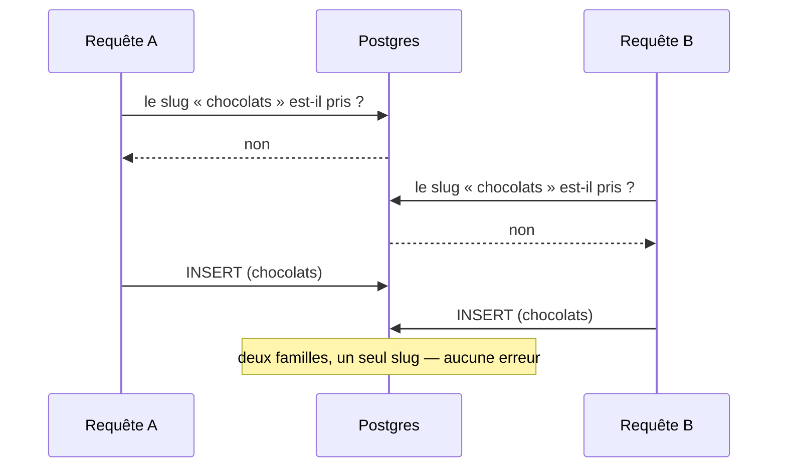

# Concurrence et allers-retours — les écritures du référentiel

> Constat d'un **tour des handlers** mené le 2026-08-25. Aucun code n'a été
> changé par ce doc : il dit ce qui est vrai aujourd'hui, ce qui est faux, et ce
> que coûterait la correction.

## 1. La règle de la maison

Un invariant d'unicité **se tient en base** ; le code se contente de **traduire
la violation** en erreur métier.

Le référentiel l'applique déjà, et bien :

```ts
// prisma-product.repository.ts
catch (error) {
  if (isUniqueViolation(error)) {
    throw new SkuAlreadyUsedError(sku);
  }
  throw error;
}
```

La référence produit va plus loin : comme une contrainte ne peut pas s'étendre à
deux tables (produits **et** déclinaisons), un **registre** porte la garantie —
`sku_registry`, clé primaire sur la valeur. La violation `23505` devient
`SkuAlreadyUsedError`.

C'est la bonne forme, et elle a une propriété que rien d'autre n'a : **elle est
vraie même quand deux requêtes arrivent en même temps.**

## 2. Où l'on tient cette règle, et où on ne la tient pas

| Invariant                              | Tenu par                            | Verdict |
| -------------------------------------- | ----------------------------------- | ------- |
| Référence produit / déclinaison unique | `sku_registry` (clé primaire)       | ✅      |
| Un seul taux de TVA par valeur         | `tva_rate.percent @unique`          | ✅      |
| Slug de famille unique                 | une **lecture** (`requireFreeSlug`) | ❌      |
| Rang unique dans une fratrie           | **rien**                            | ❌      |
| Nom d'emplacement unique               | une **lecture** (`requireFreeName`) | ❌      |

Les trois lignes rouges ont le même profil : une erreur métier existe
(`CategorySlugTakenError`, `LocationNameTakenError`), un écran l'affiche, un test
la couvre — et **rien en base ne l'empêche**.

## 3. Pourquoi une lecture ne suffit pas

Le contrôle et l'écriture sont deux instants. Entre les deux, une autre requête
passe.



Le résultat n'est pas une erreur visible : c'est un **doublon silencieux**, qu'on
découvre des semaines plus tard sur un écran qui affiche deux fois la même
entrée, ou sur une URL qui mène à l'une des deux au hasard.

Et le contrôle est fait **hors transaction** — même l'ouvrir dedans ne suffirait
pas : en `READ COMMITTED`, A ne voit pas la ligne non encore validée de B. Seule
une contrainte décide.

## 4. Le cas du rang — et pourquoi la contrainte doit être **différée**

`CreateCategory` calcule `max(position) + 1` puis insère. Deux créations
simultanées sous le même parent lisent le même `max` et écrivent le **même
rang**. L'affichage retombe alors sur l'ordre d'insertion — précisément ce que
`ReorderCategories` dit vouloir éviter.

Une contrainte `UNIQUE (parent_id, position)` ferme la course. Mais elle a une
subtilité, et c'est elle qui décide de la forme :

**le réordonnancement PERMUTE les rangs.** Faire passer une famille de 1 à 0
oblige à écrire deux lignes ; entre les deux, deux familles portent le rang 0.
Une contrainte vérifiée à chaque `UPDATE` sauterait au premier. Il la faut donc
`DEFERRABLE INITIALLY DEFERRED` — vérifiée au `COMMIT`, ce que la transaction de
`saveAll` rend possible.

C'est le genre de détail qui, découvert après la migration, fait croire que la
contrainte « ne marche pas » et pousse à la retirer.

## 5. Les allers-retours de `CreateCategory`

Pour une création sous un parent, quatre allers-retours avant l'insertion :

| #   | Appel                    | Ce qu'il garde                            | Verdict     |
| --- | ------------------------ | ----------------------------------------- | ----------- |
| 1   | `findById(parentId)`     | le parent existe **et n'est pas archivé** | à garder    |
| 2   | `nextPosition(parentId)` | `max(position) + 1`                       | à garder    |
| 3   | `findBySlugFr(slug)`     | le slug est libre                         | à remplacer |
| 4   | `add(category, ticket)`  | l'écriture + la ligne de journal          | —           |

**Le 1** est une règle métier qu'aucune clé étrangère ne porte : une FK dit que
le parent existe, pas qu'il est vivant.

**Le 2** ne peut pas venir de l'agrégat, contrairement à ce que l'intuition
suggère. Charger le parent ne rend **pas** ses enfants : `Category` connaît sa
propre position, jamais celles de ses frères. Pour que le domaine calcule le
rang, il faudrait charger la fratrie entière — **N lignes au lieu d'un
scalaire**, pour le même nombre d'allers-retours. Le repli inverse (une
sous-requête `MAX(position)+1` dans l'`INSERT`) économise l'aller-retour mais
retire au domaine la propriété du rang. Sur un geste d'administration rare et une
requête indexée sur `parent_id`, l'échange n'en vaut pas la peine.

**Le 3** est le seul vraiment inutile — et son problème n'est pas le coût, c'est
qu'il ne garantit rien (cf. §3). Le remplacer par une contrainte fait les deux
d'un coup : un aller-retour de moins **et** la course fermée. Le renommage
d'une famille, qui appelle le même helper, en profite pareillement.

## 6. Ce qu'il faudrait faire, et ce que ça coûte

| Chantier          | Migration                                                                                                                   | Code                                                                                  | Gain                                                             |
| ----------------- | --------------------------------------------------------------------------------------------------------------------------- | ------------------------------------------------------------------------------------- | ---------------------------------------------------------------- |
| Slug de famille   | index unique d'**expression** `((slug->>'fr'))` — la colonne est un `Json` localisé, un `@unique` ordinaire ne s'y pose pas | traduire `23505` → `CategorySlugTakenError` dans le dépôt ; retirer `requireFreeSlug` | course fermée, −1 aller-retour à la création **et** au renommage |
| Rang de fratrie   | `UNIQUE (parent_id, position) DEFERRABLE INITIALLY DEFERRED`                                                                | rien (ou une reprise sur violation, si l'on veut créer sans échouer)                  | plus de rangs en double                                          |
| Nom d'emplacement | `UNIQUE` sur `emplacement.name` — **insensible à la casse** (`lower(name)`), comme le dépôt le fait déjà en lecture         | traduire `23505` → `LocationNameTakenError` ; retirer `requireFreeName`               | course fermée, −1 aller-retour                                   |

**Avant de poser une contrainte, vérifier que la base de production n'a pas déjà
un doublon** : la migration échouerait, et sur une table de prod ça se prépare
(requête de détection, puis correction manuelle).

## 7. Déjà corrigé pendant ce tour

La clé d'idempotence du journal se dérivait à **deux endroits**, avec deux replis
différents hors requête. Deux faits distincts d'un script pouvaient donc porter
la même clé, et le second disparaissait en silence. Une seule dérivation
désormais, dans le recorder, à partir de la trace réellement écrite — cf.
[`journalisation-et-tracabilite.md` § 6](journalisation-et-tracabilite.md).

## 8. Ce que ce doc ne dit pas

- **Aucune mesure.** Rien ici ne vient d'un profil ni d'un plan d'exécution : ce
  sont des allers-retours **comptés à la lecture**, sur des tables qui tiennent
  aujourd'hui en quelques centaines de lignes. Le jour où l'on optimise pour de
  vrai, on mesure d'abord.
- **Les lectures** (écrans, projections) ne sont pas passées en revue.
- **Les autres blocs** non plus : ce tour n'a couvert que les écritures du
  référentiel.
