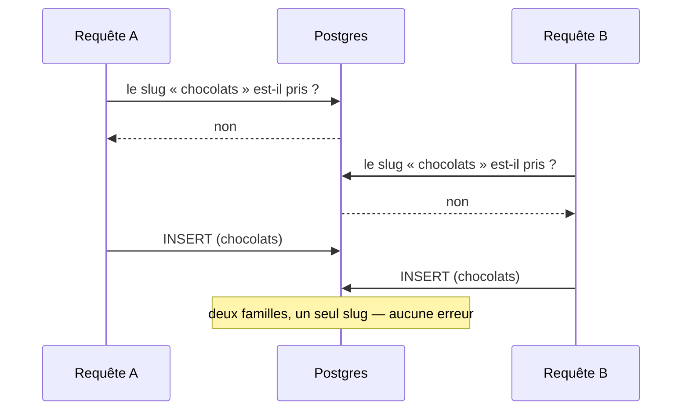

# Concurrence et allers-retours — les écritures du référentiel

> Constat d'un **tour des handlers** mené le 2026-08-25. Aucun code n'a été
> changé par ce doc : il dit ce qui est vrai aujourd'hui, ce qui est faux, et ce
> que coûterait la correction.

## 1. La règle de la maison

Un invariant d'unicité **se tient en base** ; le code se contente de **traduire
la violation** en erreur métier.

Le référentiel l'applique déjà, et bien :

```ts
// prisma-product.repository.ts
catch (error) {
  if (isUniqueViolation(error)) {
    throw new SkuAlreadyUsedError(sku);
  }
  throw error;
}
```

La référence produit va plus loin : comme une contrainte ne peut pas s'étendre à
deux tables (produits **et** déclinaisons), un **registre** porte la garantie —
`sku_registry`, clé primaire sur la valeur. La violation `23505` devient
`SkuAlreadyUsedError`.

C'est la bonne forme, et elle a une propriété que rien d'autre n'a : **elle est
vraie même quand deux requêtes arrivent en même temps.**

## 2. Où l'on tient cette règle, et où on ne la tient pas

| Invariant                                             | Tenu par                                | Verdict au constat |
| ----------------------------------------------------- | --------------------------------------- | ------------------ |
| Référence produit / déclinaison unique                | `sku_registry` (clé primaire)           | ✅                 |
| Un seul taux de TVA par valeur                        | `tva_rate.percent @unique`              | ✅                 |
| Slug de famille unique                                | une **lecture** (`requireFreeSlug`)     | ❌ → ✅ (§6)       |
| Rang unique dans une fratrie                          | **rien**                                | ❌ → ✅ (§6)       |
| Nom d'emplacement unique                              | une **lecture** (`requireFreeName`)     | ❌ → ✅ (§6)       |
| Emplacement non supprimé sous une famille qui le cite | une **lecture** (`LocationUsageReader`) | ❌ → ✅ (§6)       |

Les trois lignes rouges avaient le même profil : une erreur métier existait
(`CategorySlugTakenError`, `LocationNameTakenError`), un écran l'affichait, un
test la couvrait — et **rien en base ne l'empêchait**. Elles ont été fermées le
2026-08-26 par des contraintes (§6). La quatrième l'a été le même jour, mais
autrement : sa référence vit dans un `jsonb`, où aucune contrainte ne se pose —
c'est un **registre** qui la porte.

## 3. Pourquoi une lecture ne suffit pas

Le contrôle et l'écriture sont deux instants. Entre les deux, une autre requête
passe.



Le résultat n'est pas une erreur visible : c'est un **doublon silencieux**, qu'on
découvre des semaines plus tard sur un écran qui affiche deux fois la même
entrée, ou sur une URL qui mène à l'une des deux au hasard.

Et le contrôle est fait **hors transaction** — même l'ouvrir dedans ne suffirait
pas : en `READ COMMITTED`, A ne voit pas la ligne non encore validée de B. Seule
une contrainte décide.

## 4. Le cas du rang — et pourquoi la contrainte n'est PAS différée

`CreateCategory` calcule `max(position) + 1` puis insère. Deux créations
simultanées sous le même parent lisent le même `max` et écrivent le **même
rang**. L'affichage retombe alors sur l'ordre d'insertion — précisément ce que
`ReorderCategories` dit vouloir éviter.

Une contrainte sur `(parent_id, position)` ferme la course. Deux propriétés de
la table décident ensuite de sa forme, et elles tirent dans des sens opposés.

**Une famille archivée garde son rang** et sort du réordonnancement. Sans le
filtre `WHERE is_archived = false`, un rang libéré par un archivage resterait
occupé par un fantôme : renuméroter la fratrie vivante échouerait sur une ligne
que plus personne ne voit. La contrainte doit donc être **partielle**.

**Le réordonnancement permute les rangs.** Faire passer une famille de 1 à 0
oblige à écrire deux lignes ; entre les deux, deux familles portent le rang 0.
On voudrait donc **différer** la vérification au `COMMIT`.

Les deux ne sont pas compatibles : Postgres ne peut différer qu'une
**contrainte**, et une contrainte ne s'adosse qu'à un index total sur des
colonnes — pas à un index partiel. Il a fallu choisir, et le filtre l'emporte
(sans lui, la contrainte serait fausse). La permutation est donc résolue côté
écriture : `saveAll` gare les rangs hors de la plage utilisée, puis pose les
rangs définitifs (§6).

Et `NULLS NOT DISTINCT`, sans quoi les familles **racine** (`parent_id` NULL)
échapperaient à tout : deux NULL sont distincts par défaut, donc le premier
niveau — celui qu'on voit en ouvrant l'écran — aurait été le seul non protégé.

## 5. Les allers-retours de `CreateCategory`

Pour une création sous un parent, quatre allers-retours avant l'insertion :

| #   | Appel                    | Ce qu'il garde                            | Verdict      |
| --- | ------------------------ | ----------------------------------------- | ------------ |
| 1   | `findById(parentId)`     | le parent existe **et n'est pas archivé** | à garder     |
| 2   | `nextPosition(parentId)` | `max(position) + 1`                       | à garder     |
| 3   | ~~`findBySlugFr(slug)`~~ | le slug est libre                         | **supprimé** |
| 4   | `add(category, ticket)`  | l'écriture + la ligne de journal          | —            |

**Le 1** est une règle métier qu'aucune clé étrangère ne porte : une FK dit que
le parent existe, pas qu'il est vivant.

**Le 2** ne peut pas venir de l'agrégat, contrairement à ce que l'intuition
suggère. Charger le parent ne rend **pas** ses enfants : `Category` connaît sa
propre position, jamais celles de ses frères. Pour que le domaine calcule le
rang, il faudrait charger la fratrie entière — **N lignes au lieu d'un
scalaire**, pour le même nombre d'allers-retours. Le repli inverse (une
sous-requête `MAX(position)+1` dans l'`INSERT`) économise l'aller-retour mais
retire au domaine la propriété du rang. Sur un geste d'administration rare et une
requête indexée sur `parent_id`, l'échange n'en vaut pas la peine.

**Le 3** était le seul vraiment inutile — et son problème n'était pas le coût,
c'est qu'il ne garantissait rien (cf. §3). Remplacé par la contrainte le
2026-08-26 : un aller-retour de moins **et** la course fermée. Le renommage
d'une famille, qui appelait le même helper, en profite pareillement — comme la
création et le renommage d'un emplacement.

## 6. Ce qui a été fait (2026-08-26)

| Chantier          | Migration                                                                                                                    | Code                                                                                  | Gain                                                             |
| ----------------- | ---------------------------------------------------------------------------------------------------------------------------- | ------------------------------------------------------------------------------------- | ---------------------------------------------------------------- |
| Slug de famille   | index unique d'**expression** `((slug->>'fr'))` — la colonne est un `Json` localisé, un `@unique` ordinaire ne s'y pose pas  | traduire `23505` → `CategorySlugTakenError` dans le dépôt ; retirer `requireFreeSlug` | course fermée, −1 aller-retour à la création **et** au renommage |
| Rang de fratrie   | index unique **partiel** `(parent_id, position) NULLS NOT DISTINCT WHERE is_archived = false` — donc **pas** différable (§4) | `saveAll` écrit en deux passes pour permuter sans collision transitoire               | plus de rangs en double                                          |
| Nom d'emplacement | `UNIQUE` sur `emplacement.name` — **insensible à la casse** (`lower(name)`), comme le dépôt le fait déjà en lecture          | traduire `23505` → `LocationNameTakenError` ; retirer `requireFreeName`               | course fermée, −1 aller-retour                                   |

**Avant d'appliquer en production, vérifier qu'aucun doublon n'existe déjà** :
la migration échouerait — ce qui est le bon comportement. Les trois requêtes de
détection sont en tête du fichier de migration.

### Ce que la pose a appris

**Le réordonnancement écrit maintenant en deux passes.** Une permutation passe
forcément par un état où deux familles visent la même place (0 ↔ 1), et un index
unique est vérifié à chaque `UPDATE`. Le premier passage gare donc les rangs
hors de la plage utilisée (négatifs), le second pose les rangs définitifs. Deux
fois plus d'écritures sur un geste rare — le prix d'une contrainte qui tient
aussi quand deux personnes rangent la même fratrie en même temps.

**Distinguer QUELLE contrainte a sauté demande de lire le message du pilote.**
`meta.target` ne nomme que les contraintes du **schéma Prisma** ; pour les
nôtres, posées en SQL, Prisma rend une forme tronquée
(`["(slug ->> 'fr'::text"]`) inutilisable pour décider. Le message d'origine de
Postgres, lui, dit `unique constraint "category_slug_fr_unique"`. C'est du texte,
donc fragile — mais une famille a **deux** contraintes, et les confondre ferait
dire à l'écran « ce nom est pris » à quelqu'un dont le nom est libre.

**Les doubles de test ont dû apprendre la règle.** Le contrôle vivait dans le
handler ; en descendant en base, il est sorti du champ des tests unitaires. Les
faux dépôts refusent donc maintenant un doublon, comme le vrai — sans quoi ils
accepteraient ce que la production refuse, et les tests d'unicité passeraient au
vert sur un dépôt plus permissif que le vrai.

### Ce qui reste ouvert

Deux créations simultanées sous le même parent visent le même rang : la
contrainte refuse la seconde avec `catalogue.category.rank_taken` — « une autre
famille vient de prendre cette place, recommencez ». C'est **volontairement** un
refus et non une reprise automatique : il faut deux personnes créant une famille
sous le même parent à quelques millisecondes d'intervalle. Le jour où ça arrive
vraiment, une reprise bornée (recalculer le rang, réessayer une fois) est le
correctif — pas avant.

### La suppression d'un emplacement : un registre, faute de contrainte

`RemoveLocation` comptait les familles citant l'emplacement, puis supprimait.
C'était le motif du §3 — vérifier-puis-écrire — et cette fois **aucune
contrainte ne pouvait le rattraper** : la grille de canaux d'une famille vit
dans une colonne `jsonb`, et Postgres ne pose pas de clé étrangère sur une
valeur enfouie dans du JSON.

La fenêtre s'ouvrait dans les deux sens :

| Course                                                          | Résultat                                     |
| --------------------------------------------------------------- | -------------------------------------------- |
| A supprime l'emplacement pendant que B le coche sur une famille | une grille pointe un point de vente disparu  |
| B coche l'emplacement pendant que A vérifie qu'il est libre     | idem — le compte de A était vrai une seconde |

**Fermée le 2026-08-26 par `category_location_ref`.** C'est le motif de
`sku_registry`, appliqué une seconde fois : quand une contrainte ne peut pas
atteindre l'invariant, un **registre** le porte. La table liste les couples
(famille, emplacement) que la grille cite, avec un `Restrict` vers
l'emplacement et un `Cascade` depuis la famille.

Ce n'est **pas** une seconde source de vérité : le dépôt des familles l'écrit
dans la MÊME transaction que la colonne dont elle dérive — même `$transaction`,
même effacer-puis-réécrire que les taux. Hors transaction, l'un des deux
pourrait manquer, et le miroir deviendrait une vérité concurrente.

Trois effets de bord, tous bons à prendre :

- le pré-contrôle du handler disparaît, avec son aller-retour ;
- le compte d'usages de l'écran devient un `groupBy` au lieu d'une relecture de
  **toutes** les grilles `jsonb` en mémoire ;
- `LocationInUseError` n'exige plus de compte. Le relire depuis le dépôt
  échouait : la violation avorte la transaction, et toute requête suivante y
  échoue à son tour — le refus métier devenait un 500. L'écran, lui, affiche
  déjà le compte à côté de chaque ligne.

C0-d, qui remplacera la matrice `jsonb` par une vraie table, rendra ce registre
inutile : la clé étrangère sera alors directe. En attendant, l'invariant tient.

## 7. Déjà corrigé pendant ce tour

La clé d'idempotence du journal se dérivait à **deux endroits**, avec deux replis
différents hors requête. Deux faits distincts d'un script pouvaient donc porter
la même clé, et le second disparaissait en silence. Une seule dérivation
désormais, dans le recorder, à partir de la trace réellement écrite — cf.
[`journalisation-et-tracabilite.md` § 6](journalisation-et-tracabilite.md).

## 8. Ce que ce doc ne dit pas

- **Aucune mesure.** Rien ici ne vient d'un profil ni d'un plan d'exécution : ce
  sont des allers-retours **comptés à la lecture**, sur des tables qui tiennent
  aujourd'hui en quelques centaines de lignes. Le jour où l'on optimise pour de
  vrai, on mesure d'abord.
- **Les lectures** (écrans, projections) ne sont pas passées en revue.
- **Les autres blocs** non plus : ce tour n'a couvert que les écritures du
  référentiel.
