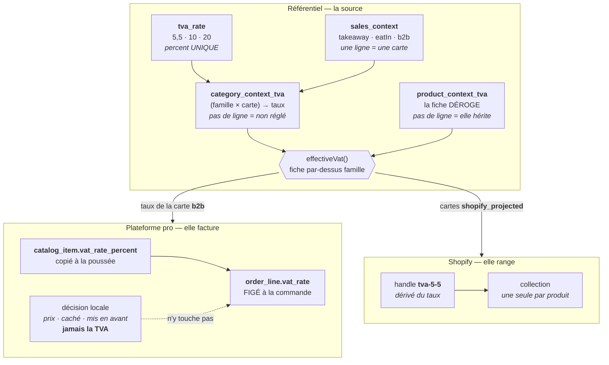
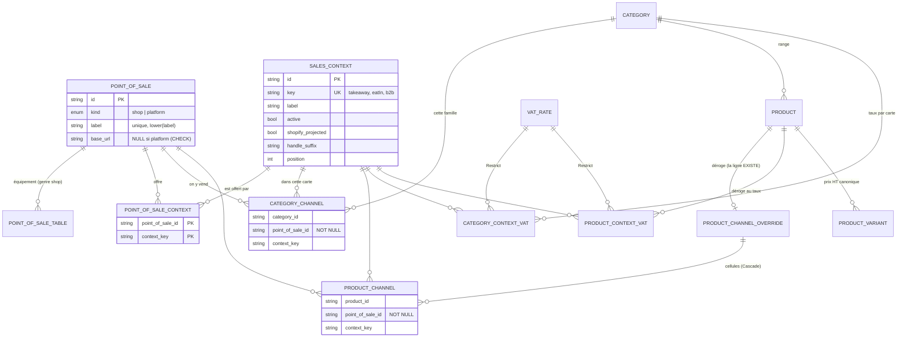
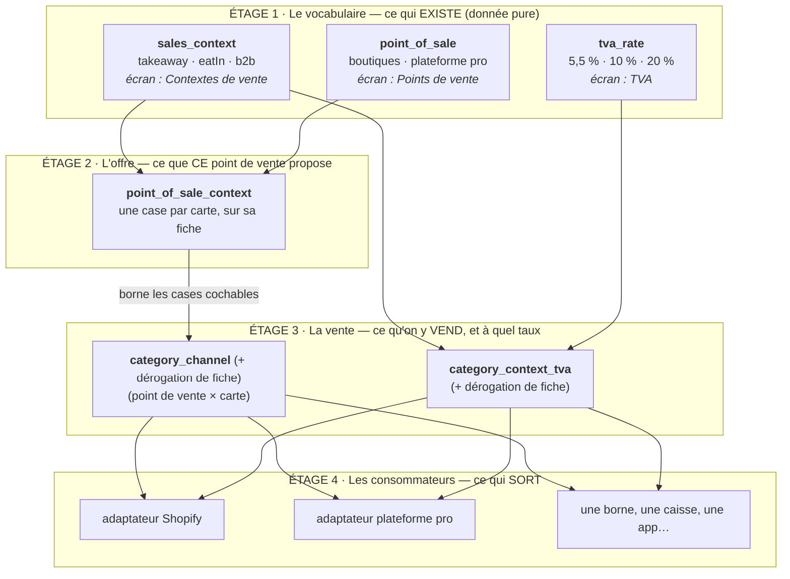

# Contextes de vente, points de vente et TVA

> **Le doc unique du sujet.** Ce qu'est un contexte de vente, ce qui en crée un,
> où vit le taux de TVA, qui décide de ce qu'on vend et où, comment ça sort vers
> Shopify et vers la plateforme professionnelle, ce que coûte chaque évolution,
> et quels murs refusent quoi.
>
> État : ✅ décrit le code qui tourne au 2026-08-26. Le seul point décidé mais
> **non implémenté** est isolé en [§ 10](#10-décidé-mais-pas-encore-implémenté--le-choix-des-intégrations).
>
> Il remplace cinq notes de chantier (`c0d-matrice-de-canaux.md`,
> `point-de-vente.md`, `ecrans-du-referentiel.md`, `projection-sales-context.md`,
> `override-produit.md`) et le doc de TVA (`vat-resolution.md`).

---

## 1. À quoi ça sert

Le même croissant n'est pas taxé pareil selon ce que le client en fait. À
emporter, 5,5 %. Consommé en salle, 10 %. Vendu en gros à un professionnel qui le
revend, 5,5 % encore, mais sur une facture, avec un autre prix et un autre
catalogue.

Ce n'est pas une décision produit : c'est la loi. Le référentiel doit donc savoir
répondre à deux questions distinctes, pour chaque article :

1. **où est-ce qu'on le vend ?** — quelle boutique, quelle plateforme, dans quel
   mode de consommation ;
2. **à quel taux ?** — pour chacun de ces modes.

Un **contexte de vente** est la réponse à la seconde. C'est **une carte de
capacité sur laquelle on mappe de la TVA** : une manière de consommer qui a son
propre traitement fiscal, et qui, pour cette raison, entraîne sa propre tranche
de catalogue et sa propre projection.

L'ordre compte, c'est lui qui rend le modèle non arbitraire :

1. **la TVA d'abord** — elle est imposée de l'extérieur ;
2. **la tranche de catalogue ensuite**, par conséquence : on ne peut pas taxer ce
   qu'on ne vend pas là ;
3. **la projection en dernier** : Shopify en fait un produit ou non, la
   plateforme professionnelle a son propre projecteur.

Le découpage du catalogue est une **conséquence**, pas le but. Deux manières de
vendre qui partagent le taux et le prix n'ont aucune raison d'être deux cartes.

### Ce qui cassait avant

Le référentiel portait trois colonnes de taux sur la famille
(`emporter_tva_id`, `sur_place_tva_id`, `b2b_tva_id`) et une matrice de canaux en
`jsonb` dont les modes étaient deux champs nommés plus un drapeau `b2b`.
Conséquences, toutes payées :

- ajouter une quatrième manière de vendre demandait une migration **et** du code
  dans cinq fichiers ;
- lire « ce contexte est-il vendu ? » obligeait à savoir lequel des trois on
  regardait, donc à écrire une branche ;
- aucune clé étrangère ne pouvait tenir la référence à une boutique, enfouie dans
  du `jsonb` — il a fallu une table de registre à part pour porter le mur ;
- la plateforme professionnelle n'était **pas une ligne** : elle était le `NULL`
  d'une colonne de lieu, avec une colonne `per_location` sur le contexte pour
  distinguer ce cas.

Tout ça est mort. Ce qui suit décrit ce qui l'a remplacé.

## 2. Ce qui définit une carte

**Une carte se définit par OÙ L'ON CONSOMME, jamais par où l'on achète.**

|                                                              |                                                |
| ------------------------------------------------------------ | ---------------------------------------------- |
| Sur place · à emporter · revendu par un professionnel        | trois lieux de consommation → **trois cartes** |
| QR de table · comptoir · site en ligne · borne libre-service | quatre chemins d'achat → **zéro carte**        |

C'est le lieu de consommation qui commande le traitement fiscal ; le chemin
d'achat ne l'a jamais fait. « Sur place par QR » n'est donc pas une carte : on y
consomme sur place, exactement comme au comptoir — **même carte, donc le même
taux par définition**.

Dédoubler la carte pour le QR ferait régler deux fois un 10 % qui ne peut pas
différer, avec le risque qu'il diverge. Ça ne se voit pas à l'écran ; ça se voit
sur une facture.

### Et si le catalogue devait différer selon le chemin d'achat ?

Un article commandable au comptoir mais pas en scannant la table, à consommation
égale. Ce n'est **toujours pas** une carte de plus : c'est une **restriction
posée sur l'adaptateur**, là où la différence naît. Créer une carte pour ça
dupliquerait un taux identique par construction.

**Une carte naît d'une règle fiscale, pas d'une envie produit.** C'est le test à
appliquer avant d'en créer une.

### Les cartes d'aujourd'hui

Trois lignes dans `pim.sales_context`, avec leur clé — l'identité que le code et
les clés étrangères citent — et leur libellé, qui se change à l'écran :

| Clé        | Libellé de semis | Projeté vers Shopify         |
| ---------- | ---------------- | ---------------------------- |
| `takeaway` | À emporter       | ✅ (handle nu, sans suffixe) |
| `eatIn`    | Sur place        | ❌ (suffixe `-surplace`)     |
| `b2b`      | B2B              | ❌ — projecteur propre       |

`b2b` est la carte **racine** : semée au boot si elle manque, ineffaçable, non
renommable quant à sa clé. Sans elle, la plateforme professionnelle cesse de
facturer **sans qu'une erreur soit levée** — une panne silencieuse mérite une
garde au boot, exactement comme l'admin racine du staff. Elle reste
**désactivable** : fermer un canal n'est pas effacer sa définition.

> ⚠️ Sur une base déjà semée, le libellé de semis ne s'applique pas :
> `ensureRootContext` ne repousse rien. Renommer l'existant est un geste d'écran.

### Clé et libellé — pourquoi les deux existent

|                | Clé (identité) | Libellé (ce qu'on lit) |
| -------------- | -------------- | ---------------------- |
| Contexte       | `b2b`          | « Vente en ligne pro » |
| Point de vente | `pos_b2b`      | « Plateforme pro »     |

Une clé est citée par trois clés étrangères et par le projecteur de la
plateforme : la renommer est une migration de données. Un libellé se change à
l'écran, sans rien livrer. C'est précisément la séparation que le registre
existe pour offrir.

Le libellé sert aussi à corriger un flou : `b2b` nomme une **audience**, là où
`takeaway` et `eatIn` nomment une manière de consommer. Ce qui distingue
réellement cette carte, ce n'est pas à qui on vend, c'est qu'on commande en
ligne, sur facture, sans consommation sur place. Et le contexte comme le point de
vente s'appelaient « B2B » sur deux écrans voisins, alors que l'un dit _comment_
on vend et l'autre _d'où_.

## 3. Où vit le taux

**À l'intersection `(article × carte)`, jamais sur la carte seule.** Une carte ne
« vaut » pas 10 %.

|                  | À emporter | Sur place | B2B         |
| ---------------- | ---------- | --------- | ----------- |
| Croissant        | 5,5 %      | 10 %      | 5,5 %       |
| Café             | 10 %       | 10 %      | _non réglé_ |
| Bouteille de vin | 20 %       | 20 %      | 20 %        |

Deux tables portent ces cases, avec la même forme et la même règle :

| Table                  | Clé                         | Absence de ligne       |
| ---------------------- | --------------------------- | ---------------------- |
| `category_context_tva` | `(category_id, context_id)` | la famille ne dit rien |
| `product_context_tva`  | `(product_id, context_id)`  | la fiche **hérite**    |

La famille pose ses taux ; la fiche peut y déroger **contexte par contexte** —
20 % en B2B et le taux familial au comptoir est le cas courant, pas l'exception.

**Une case vide n'est pas un zéro.** « Non réglé » ne s'écrit pas : un 0 % serait
un taux, donc un mensonge fiscal. Et revenir à l'héritage est un geste, pas un
oubli — il s'écrit en **retirant** la ligne, jamais en posant un état « pas de
dérogation » qui se compterait comme un usage du taux et bloquerait sa
suppression.

### La résolution, de bout en bout



`effectiveVat(famille, fiche)` est **une seule fonction**, dans le domaine
catalogue, appelée par les deux projections. C'est la condition pour que la
parité ne dérive pas : deux canaux qui réécriraient la règle chacun de leur côté
factureraient un jour deux taux différents pour le même article.

### Ce que chaque étage décide

| Étage                  | Décide                                     | Ne décide pas                            |
| ---------------------- | ------------------------------------------ | ---------------------------------------- |
| `tva_rate`             | qu'un taux **existe**                      | qui l'utilise                            |
| `sales_context`        | quelles **cartes** existent                | quel taux elles portent                  |
| `category_context_tva` | le taux d'une **famille** pour une carte   | ce qu'un article particulier facture     |
| `product_context_tva`  | le taux d'**une fiche**, carte par carte   | ce que sa famille décide pour les autres |
| projection B2B         | recopier le taux résolu de la carte `b2b`  | inventer un taux                         |
| décision locale B2B    | prix, visibilité, mise en avant            | **la TVA**                               |
| `order_line.vat_rate`  | ce qui est **facturé**, figé à la commande | rien d'autre : c'est une photo           |
| projection Shopify     | la **collection** `tva-*` du produit       | le taux lui-même                         |

**Le taux d'un produit n'est jamais recalculé après coup.** `order_line.vat_rate`
est une photo prise à la commande : changer un taux demain ne réécrit aucune
facture d'hier. C'est l'invariant qui rend tout le reste sûr à modifier.

### Les règles que le code tient

- **Un taux ne se règle que pour une carte qu'on vend.** L'agrégat `Category` le
  refuse (`CategoryVatWithoutChannelError`), et **fermer un canal efface** les
  taux des cartes qu'il portait. Sans cet effacement, une famille qui ne vend
  plus en B2B continuerait de pointer son taux B2B, le compte d'usages le
  compterait, et la suppression du taux resterait bloquée pour rien.
- **Une fiche ne déroge que là où ELLE vend** — ses canaux **effectifs** : sa
  propre matrice si elle en a une, celle de sa famille sinon. Déroger sur une
  carte fermée, c'est décider d'un prix pour une vente qui n'a pas lieu.
- **Un taux visé ne se supprime pas.** `Restrict` sur les deux jointures, et
  l'écran le dit **avant** : il additionne les familles et les fiches qui visent
  le taux, tous contextes confondus, et masque le geste.
- **Une carte inconnue est refusée** (`CategoryUnknownContextError`) : une clé
  sans ligne de registre en face serait persistée sans que personne puisse dire,
  six mois plus tard, ce qu'elle facturait.
- **On ne remplit jamais un trou de TVA.** Une famille non réglée rend une carte
  sans la clé — jamais un zéro, jamais un défaut à 5,5 %. Le refus est déplacé là
  où il compte : le catalogue laisse passer l'article sans taux (son prix
  canonique a de la valeur), et **la plateforme pro l'écarte de sa vente**.

## 4. Qui offre quoi — les points de vente

Un **point de vente**, c'est **d'où l'on vend**. Deux genres, et l'union est
fermée : c'est une propriété de structure, pas une donnée.

| Genre      | A une adresse de click & collect | Peut être équipé de tables à QR |
| ---------- | -------------------------------- | ------------------------------- |
| `shop`     | ✅ (`base_url`, obligatoire)     | ✅                              |
| `platform` | ❌ interdit                      | ❌ interdit                     |

Ce qui est piloté par la donnée, c'est **combien il y en a de chaque**, jamais
quels genres existent. La plateforme professionnelle `pos_b2b` est une ligne de
genre `platform` — semée au boot, ineffaçable, même contrat que la carte racine.

Avant, elle n'était nulle part : `category_channel.location_id` valait `NULL`
pour dire « le B2B », et une colonne `sales_context.per_location` existait
uniquement pour distinguer ce cas. Un `NULL` porteur de sens est toujours le
signe d'une ligne absente. Depuis qu'elle a la sienne, **tout canal se vend
depuis un point de vente**, sans exception à retenir.

### L'offre borne la matrice

`point_of_sale_context` dit ce que CE point de vente **offre** — une ligne par
carte. C'est distinct de ce qu'on y **vend** (`category_channel`), qui est une
décision de catalogue.

L'offre borne les cases cochables : une famille ne peut cocher que là où la carte
est offerte. Sans ce mur, une famille pouvait vendre « sur place » depuis une
boutique sans salle, et la projection fabriquait une fiche pour un lieu qui ne
sert pas.

### Les tables à QR sont de l'équipement, pas un mode de vente

L'ancien modèle portait un drapeau `eat_in` qui faisait **deux métiers** : « ce
lieu sert en salle » et « ce lieu a une grille de QR ». D'où une destruction en
cascade — décocher une case détruisait du papier collé sur des meubles.

Deux boulangeries peuvent toutes deux servir en salle et une seule être équipée
de QR. Une grille de tables appartient donc au point de vente, pas à la carte :
retirer l'offre « sur place » **n'efface plus les QR**. La matrice a déjà cessé
d'y vendre, donc un code imprimé mène à une commande vide plutôt qu'à un
mensonge.

Le numéro de table est l'identité de l'URL imprimée : il est verrouillé, et
renommer un point de vente ne réécrit pas sa grille — sinon les jetons déjà
imprimés seraient invalidés en silence.

## 5. La matrice — ce qu'on vend, et où

**`(point de vente × carte)`, par famille, avec dérogation par fiche.**

La forme est un **ensemble de paires**, et c'est directement la forme de la
table :

```ts
interface SoldChannel {
  readonly pointOfSaleId: string; // NON nullable — c'est le gain du chantier
  readonly context: string;
}
```

On n'écrit que ce qui est vendu ; l'absence de paire EST la donnée. Et lire « ce
contexte est-il vendu ? » ne demande plus aucune branche : le nom suffit, et
personne n'a besoin de savoir quelle carte aurait besoin d'un lieu.

### La dérogation d'une fiche est tout-ou-rien

À la différence des taux. Une matrice à moitié redéfinie ne se lit pas : devant
une case vide, on ne saurait pas dire si la fiche n'est pas vendue là ou si sa
famille ne l'y vendait pas.

D'où une **ligne parente** `product_channel_override` dont la seule présence est
la donnée, et des cellules `product_channel` qui y **cascadent** :

- pas de ligne parente → la fiche suit intégralement sa famille ;
- ligne parente, zéro cellule → « cette fiche ne se vend nulle part », qui est
  une décision légitime, pas un oubli.

Un booléen sur le produit aurait laissé atteignable l'état impossible « pas de
dérogation, mais des cellules ». La cascade le rend **inatteignable** : un
invariant tenu par la base bat un invariant tenu par la discipline.

La famille, elle, n'a pas ce problème : elle porte toujours une matrice, jamais
un héritage.

### Le modèle complet



### Les étages, dans l'ordre où une question se résout



**La règle de lecture** : chaque flèche est une clé étrangère ou un refus
explicite, jamais un `if` sur un nom. Le code ne connaît aucune des valeurs de
l'étage 1. Ajouter une carte ou un point de vente ajoute des **lignes** dans les
étages 1 et 2 ; les étages 3 et 4 s'élargissent sans qu'une ligne de code change.
Ce qui reste au code, c'est la **forme** des flèches — « une fiche hérite de sa
famille », « un taux se règle par carte » — jamais leur nombre.

Deux héritages, exactement la même mécanique : **l'absence de ligne est la
donnée**. Pas de `product_channel_override` ⇒ la fiche suit sa famille ; pas de
`product_context_tva` ⇒ elle suit le taux de sa famille.

## 6. Comment ça sort — l'adaptateur traduit, l'intégration transporte

Le référentiel décrit un **catalogue canonique**. Il ne connaît le vocabulaire
d'aucune plateforme. Pour chaque outil branché dessus, deux pièces distinctes :

| Pièce             | Rôle                                                | Testable                    |
| ----------------- | --------------------------------------------------- | --------------------------- |
| **l'adaptateur**  | **traduit** le canonique dans la langue de la cible | pur, sans réseau ni horloge |
| **l'intégration** | **transporte** — quelle mutation, quelle version    | dépend du réseau            |

C'est vérifiable dans le code, la séparation est physique :

| Cible          | Adaptateur (pur)                               | Intégration (transport)                    |
| -------------- | ---------------------------------------------- | ------------------------------------------ |
| Shopify        | `channels/shopify/products/projection.ts`      | `channels/shopify/products/driver.ts`      |
| Plateforme pro | `channels/b2b-platform/products/projection.ts` | `channels/b2b-platform/products/driver.ts` |

L'adaptateur est la pièce qui a de la valeur : le transport changera, ce que
_signifie_ « ce produit chez Shopify » ne changera pas.

### Shopify — elle range par collection

Shopify n'accepte **qu'un traitement de TVA par produit** : l'override se pose
par appartenance à **une** collection `tva-*`. Le référentiel ne rend donc pas un
taux à Shopify — il en dérive un **handle** (`5.5` → `tva-5-5`, dans
`channels/shopify/collections/vat-handle.ts`, chez le canal et nulle part
ailleurs) et range le produit après le `productSet`, par
`collectionAddProductsV2`.

Un produit qui déroge **change de collection**, et il **quitte l'ancienne**.
Rejoindre ne suffisait pas : un article dont le taux changeait restait membre de
sa collection précédente, la boutique le taxait encore selon elle, et rien ne le
signalait. Les collections hors `tva-*` (« Noël », « Nouveautés ») appartiennent
au marchand et ne sont jamais touchées.

Seules les cartes marquées `shopify_projected` sont projetées — aujourd'hui
`takeaway` seule. Une fiche qui ne se vend dans **aucune** carte projetée part en
**brouillon** : hors vitrine, toujours dans l'administration, avec ce que le
marchand y a ajouté. En cas d'échec de lecture de la matrice, la fiche reste
publiée : dépublier par accident coûte un chiffre d'affaires, garder en ligne une
fiche à retirer coûte un push.

### Plateforme pro — elle facture

La projection lit le taux de la carte **`b2b`** et le pose **sur chaque article**
poussé (`catalog_item.vat_rate_percent`) : le récepteur n'a pas à rejoindre une
famille pour savoir facturer. Une fiche que la matrice ne vend pas en B2B est
**écartée du snapshot** avec son motif nommé (`canal_ferme`), et l'ingestion la
supprime au push suivant.

Les prix sont **HT** ; la TVA s'ajoute au devis ligne par ligne, la livraison a
son propre taux, Stripe encaisse le TTC.

Un push qui tait ses exclusions laisse croire que 92 produits sont partis quand
89 le sont : chaque écart porte son motif (`variant_sans_prix`,
`variant_arretee`, `produit_sans_variante_vendable`, `famille_inconnue`,
`canal_ferme`).

> ⚠️ **Repli de transition encore en place.** Côté boutique pro, `billableRate`
> retombe sur le taux de la famille miroir quand l'article n'a pas encore le
> sien — sans lui, la boutique se serait éteinte entre le déploiement et le
> premier push. Un push complet suffit à le rendre inutile, et le garder fait
> resurgir le défaut qu'il corrige : une ligne facturée qui dépend d'une
> jointure de famille.

## 7. Comment on évolue — trois coûts, à connaître d'avance

| Nature du changement | Exemple                                                      | Coût                                  |
| -------------------- | ------------------------------------------------------------ | ------------------------------------- |
| **Donnée**           | une carte, un point de vente, des cases, un taux, un libellé | une ligne, **zéro déploiement**       |
| **Consommateur**     | une borne, une caisse, un nouveau projecteur                 | du code, mais **hors du référentiel** |
| **Relation**         | un prix par carte, un stock par point de vente               | code **+ migration** du référentiel   |

La plupart des nouveautés sont des **adaptateurs**, pas des cartes.

### Le cas concret : ajouter une borne libre-service

Sans rien déployer côté référentiel :

```
0 carte  → la borne sert « sur place » ou « à emporter » : ces cartes existent
N cases  → le point de vente déclare qu'il offre ces cartes
0 taux   → les taux existent déjà, ce sont ceux de la consommation
```

Ce qui reste du code, et il faut le dire : **la borne elle-même**. Un écran, un
flux de commande, un paiement, une imprimante. Le référentiel dit _quoi afficher_
et _à quel taux_ ; il ne fabrique pas de consommateur. Une borne est un logiciel,
pas une ligne.

### Le cas rare : ajouter une carte

Seulement si une **règle fiscale** nouvelle l'impose — un mode de consommation
qu'on n'avait pas.

```
1 ligne  → la carte (clé, libellé, position, en service)
N cases  → chaque point de vente déclare s'il l'offre
N cases  → chaque famille coche (point de vente × carte)
N taux   → le taux, par famille puis par fiche
```

La matrice, l'écran des contextes, le calcul du TTC, le compte d'usages et les
murs de suppression suivent seuls. Un test du front le vérifie : le panneau
famille « accueille un contexte de PLUS sans une ligne de front ».

Deux réserves :

1. **`active` est explicite, jamais implicite.** La TVA est de l'argent, et une
   carte activée par accident facture faux. Une carte hors service ne se règle
   plus à l'écran et ne facture plus.
2. **`shopify_projected = true` change des URL.** Le suffixe de handle doit être
   figé **avant** le premier push : une URL indexée est définitive, la changer
   coûte des 404 et du référencement. Le handle **nu** est réservé à la carte par
   défaut (`takeaway`), et deux cartes projetées ne peuvent pas partager un
   suffixe — le référentiel le refuse (`SalesContextHandleTakenError`).

### Ce qui n'est PAS de la donnée aujourd'hui

Le **prix est canonique par variante** : HT, identique dans toutes les cartes ;
seul le TTC varie, par le taux. Le jour où la borne doit vendre plus cher qu'au
comptoir, ce n'est pas une ligne — c'est une relation nouvelle, donc une
migration. (La plateforme pro a déjà sa tarification à part, par un autre
chemin : dégressifs et remises vivent dans sa couche pricing.)

Idem pour un stock par point de vente : le référentiel n'en porte aucun.

## 8. Les murs, et lequel garde quoi

Un modèle piloté par la donnée n'est sûr que si chaque étage refuse ce que
l'étage du dessus ne peut pas honorer.

| Le geste                                           | Ce qui refuse                                       | Où                        |
| -------------------------------------------------- | --------------------------------------------------- | ------------------------- |
| Vendre une carte que ce point de vente n'offre pas | `ContextNotOfferedError`                            | lecture, avant l'écriture |
| Vendre depuis un point de vente inexistant         | `UnknownPointOfSaleError`                           | lecture, avant l'écriture |
| Cesser d'offrir une carte encore vendue ici        | `ContextStillSoldHereError`                         | lecture, avant l'écriture |
| Régler un taux sur une carte qu'on ne vend pas     | `CategoryVatWithoutChannelError`                    | domaine                   |
| Régler un taux pour une carte inconnue du registre | `CategoryUnknownContextError`                       | domaine                   |
| Deux cartes projetées avec le même suffixe         | `SalesContextHandleTakenError`                      | lecture, avant l'écriture |
| Supprimer un point de vente encore vendu           | clé étrangère `Restrict` → `PointOfSaleInUseError`  | **la base**               |
| Supprimer une carte encore offerte ou vendue       | clé étrangère `Restrict` → `SalesContextInUseError` | **la base**               |
| Supprimer un taux encore visé                      | clé étrangère `Restrict`                            | **la base**               |
| Supprimer la carte racine `b2b`                    | `RootSalesContextProtectedError`                    | domaine                   |
| Supprimer la plateforme racine `pos_b2b`           | `RootPointOfSaleProtectedError`                     | domaine                   |
| Équiper une plateforme d'une adresse ou de tables  | `PlatformHasNoEquipmentError` + `CHECK` en base     | domaine **et** base       |
| Deux points de vente au même nom                   | `point_of_sale_label_unique` sur `lower(label)`     | **la base**               |

**Pourquoi certains sont des lectures et pas des clés étrangères** : l'offre et
la matrice sont deux tables sans lien direct. Le refus est donc prononcé avant
l'écriture.

**Pourquoi les suppressions, elles, sont des clés étrangères** : une lecture
préalable ne tiendrait rien. Entre le compte et la suppression, une famille peut
se mettre à vendre.

`ContextStillSoldHereError` a été ajouté après coup, et c'est le trou le plus
vicieux qu'ait eu le modèle : sans lui, retirer une offre rendait 200 pendant que
la ligne de matrice survivait. La famille vendait une carte que le point de vente
n'offrait plus, l'écran ne rendait plus la case — donc plus personne ne pouvait
la décocher — et le point de vente devenait insupprimable avec un message parlant
de familles qu'on ne voyait nulle part.

Un mur reste imparfait : offrir une carte que le registre ne connaît pas rend un
**409 au message générique** (« requête refusée par la base ») au lieu d'un refus
nommé. L'écran ne propose que des cartes du registre, donc un humain ne peut pas
l'atteindre — un appel direct, si.

## 9. Ce que chaque écran possède

| Écran                   | Route               | Étage | Ce qu'on y fait                                                           |
| ----------------------- | ------------------- | ----- | ------------------------------------------------------------------------- |
| **Contextes de vente**  | `/pim/contextes`    | 1     | ouvrir, régler, mettre hors service une carte ; la racine ne s'efface pas |
| **Points de vente**     | `/pim/emplacements` | 1 + 2 | ouvrir une boutique ou une plateforme, cocher son offre, équiper les QR   |
| **TVA**                 | `/pim/tva`          | 1     | le référentiel des taux                                                   |
| **Familles** (panneau)  | `/pim/categories`   | 3     | la matrice (point de vente × carte) et les taux par carte                 |
| **Fiche produit**       | `/pim/produits/:id` | 3     | la dérogation — même grille, même sémantique                              |
| **Publication Shopify** | `/pim/publication`  | 4     | ce que la projection produit                                              |

L'écran des points de vente garde l'URL `/pim/emplacements` alors qu'il s'appelle
« Points de vente » : renommer un chemin casse les liens déjà partagés, et un mot
d'interface n'a pas à traîner l'espace d'URL avec lui.

L'écran des contextes rend **tout**, hors service compris : le registre décide de
ce qu'on peut vendre, et une donnée qu'on ne peut pas voir n'est pas pilotable.
Il compte aussi ce qui retient chaque carte — combien de points de vente
l'offrent, combien de familles ou fiches la vendent, combien y règlent un taux —
pour dire **avant** le geste ce que la base refuserait après le clic. Dire vert et
faire rouge est exactement ce qu'on cherche à ne jamais faire.

Le panneau famille ne coche plus « Click & collect » et « Sur place » : il rend
**une case par carte du registre**, une ligne par point de vente. Une case non
offerte n'est pas décochée — elle **n'existe pas**. Et l'ordre des cartes suit
`position`, réglable à l'écran : il suivait avant un critère déduit que personne
ne voyait.

## 10. Décidé mais pas encore implémenté : le choix des intégrations

**C'est le seul point de ce doc qui ne décrit pas le code d'aujourd'hui.**

Le choix des intégrations doit se poser **par point de vente**, sur la ligne
d'offre qui existe déjà (`point_of_sale_context`) : « ici, à emporter passe par
Shopify et par la caisse ».

Ce qui le remplace aujourd'hui : `sales_context.shopify_projected` et
`sales_context.handle_suffix` — le vocabulaire d'**une** intégration, rangé dans
la table centrale du catalogue. C'est la dernière entorse au principe « le
référentiel ne connaît pas le vocabulaire des plateformes ». Trois lecteurs
seulement : `channels/shopify/products/push.service.ts` (deux fois),
`channels/shopify/products/reconciliation.service.ts`, et l'écran des contextes.
`handle_suffix`, lui, n'est lu par **aucun canal** — seulement par l'invariant
d'unicité entre cartes projetées ; il attend des handles suffixés qui n'existent
pas encore.

⚠️ Attention en le déplaçant : une colonne qui nomme un logiciel ressemble à
`channel_key`, qu'on vient de supprimer. La différence tient en une phrase — un
**adaptateur est un vrai logiciel**, en ajouter un est un déploiement de toute
façon ; `channel_key`, lui, bloquait l'ajout d'une simple ligne de donnée.

## 11. Où c'est écrit

| Sujet                                            | Fichier                                                          |
| ------------------------------------------------ | ---------------------------------------------------------------- |
| Le schéma (toutes les tables citées ici)         | `apps/lfd-api/prisma/schema.prisma`, schéma `pim`                |
| La carte — agrégat, racine, invariants           | `pim/sales-contexts/`                                            |
| Le point de vente — genres, offre, tables        | `pim/points-of-sale/`                                            |
| Le référentiel des taux                          | `pim/vat-rates/`                                                 |
| La matrice — forme, normalisation, lectures      | `pim/catalogue/shared/domain/value-objects/sales-channels.ts`    |
| Le mur « offert ici ? »                          | `pim/catalogue/shared/application/sellable-channels.ts`          |
| La résolution du taux (fiche par-dessus famille) | `pim/catalogue/shared/domain/value-objects/context-vat.ts`       |
| Les invariants de la famille                     | `pim/catalogue/category/domain/entities/category.ts`             |
| Adaptateur Shopify (pur) / transport             | `pim/channels/shopify/products/projection.ts` · `driver.ts`      |
| Adaptateur plateforme pro (pur) / transport      | `pim/channels/b2b-platform/products/projection.ts` · `driver.ts` |
| Le handle de collection `tva-*`                  | `pim/channels/shopify/collections/vat-handle.ts`                 |
| Taux facturé côté boutique pro                   | `b2b/catalog/infrastructure/prisma-catalog.reader.ts`            |
| TVA d'une commande, livraison comprise           | `b2b/orders/domain/services/vat.ts`                              |

Les chemins backend sont relatifs à `apps/lfd-api/src/`.
