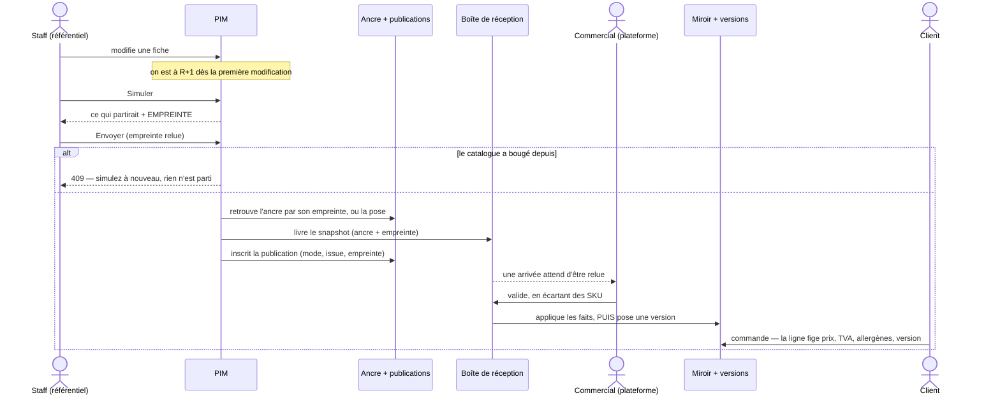
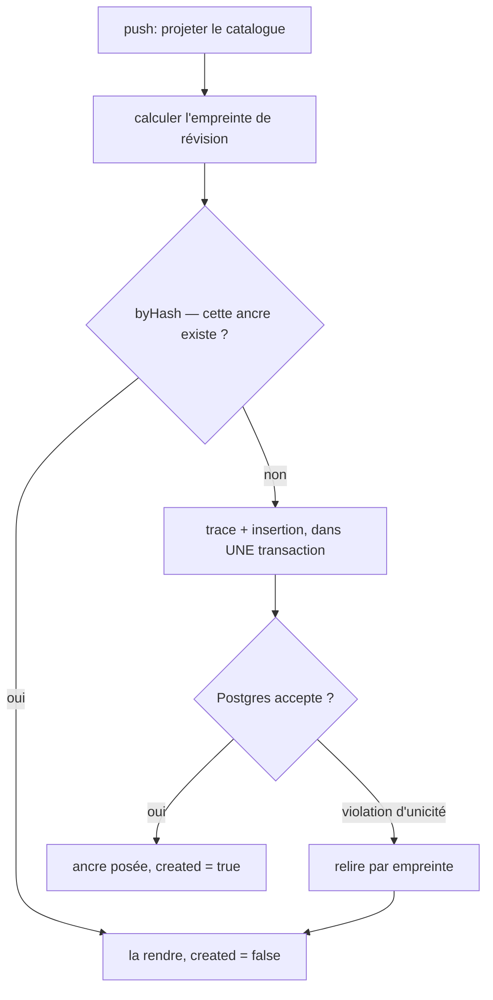
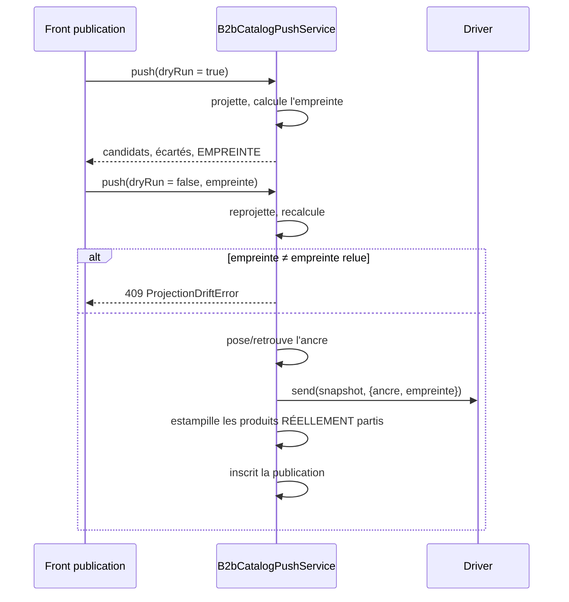
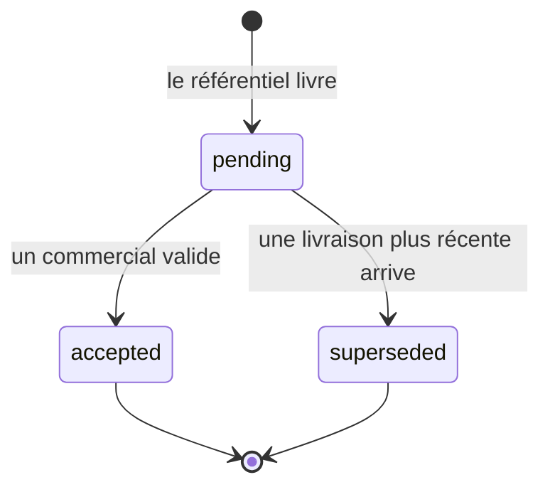
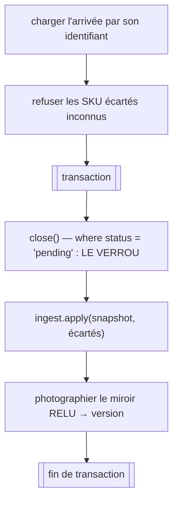
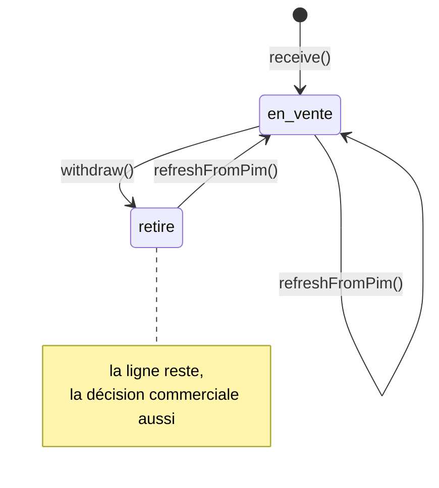
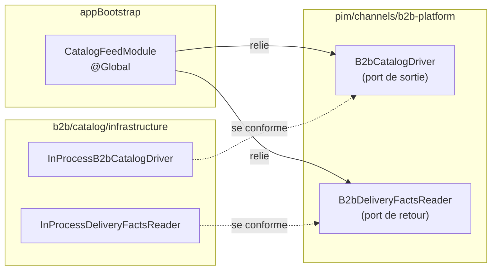
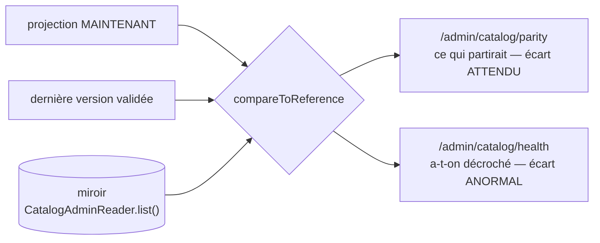
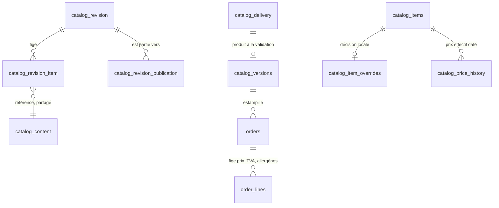

# Le cycle du catalogue — du référentiel à la vente

Code : `apps/lfd-api/src/pim/catalogue/revision/`,
`apps/lfd-api/src/pim/channels/`, `apps/lfd-api/src/b2b/catalog/`,
`apps/lfd-api/src/b2b/orders/`, `apps/lfc-B2B-admin-frontend/src/app/pim/`.

> **Ce que ce document est.** Une description de **ce que le code fait
> aujourd'hui**, avec les raisons qui ont façonné chaque mécanisme — celles qui
> se relisent, pas le récit des délibérations.
>
> Il a été un document de conception (`conception-stage-evaluer-pousser.md`),
> tenu du 2026-09-01 au 2026-09-02 : un problème, treize questions, onze
> tranches. Les tranches sont livrées ; le récit des décisions vit dans
> l'historique git et dans les JSDoc, à l'endroit exact qu'elles gouvernent.
>
> **Ce qui n'est PAS fait est dit**, et rassemblé au §10. Un document qui décrit
> un mécanisme sans nommer ses trous se lit comme une garantie.

---

## 1. Le problème que ce cycle résout

Le référentiel produit (PIM) et la plateforme marchande (B2B) vivent dans le même
processus et la même base, mais ce sont **deux contextes** : le premier décrit ce
qui existe, le second vend. Le catalogue descend de l'un vers l'autre.

Trois choses manquaient à cette descente, et elles se tenaient :

1. **Relire et envoyer n'étaient reliés par rien.** On regardait une simulation,
   on cliquait « envoyer », et rien ne garantissait que c'était le même
   catalogue.
2. **Un article reçu était en vente dans la même requête.** Aucun humain de la
   plateforme ne le relisait — le prix qu'un client paie arrivait par une
   décision prise ailleurs.
3. **Le B2B ne savait pas dire s'il avait décroché.** Un miroir qui dérive
   facture un prix que personne n'a décidé, sans que rien ne le signale : tout
   continue de fonctionner.

---

## 2. Le cycle, en un diagramme

⚠️ Le trait qui compte est le **`alt`** : c'est le seul endroit du cycle où
quelque chose est refusé, et c'est ce qui relie la relecture à l'envoi.

⚠️ Le second est l'ordre `applique` **puis** `pose une version` : la version
photographie le miroir tel qu'il est APRÈS application, pas le snapshot reçu
(§6.4).

---

## 3. Le vocabulaire — trois gestes, et deux s'appellent « publier »

C'est la confusion la plus coûteuse du domaine, parce que les trois gestes
paraissent synonymes et n'ont ni la même portée, ni le même effet.

| Le geste                 | Ce qu'il fait                               | Ce qu'il ne fait PAS   |
| ------------------------ | ------------------------------------------- | ---------------------- |
| **Publier au catalogue** | bascule `Product.status` en `published`     | n'envoie rien          |
| **Publier sur un canal** | inscrit la fiche dans `b2b_channel_binding` | n'envoie rien non plus |
| **Pousser**              | projette et envoie au canal                 | ne change aucun statut |

Une fiche « en ligne » jamais poussée n'est en vente **nulle part**. L'écran le
disait mal, et la frise du §7 existe pour ça.

### Deux objets, deux métiers

| Objet                         | Répond à                    | Forme                     | Portée   |
| ----------------------------- | --------------------------- | ------------------------- | -------- |
| **L'ancre**                   | « le catalogue ÉTAIT ceci » | payload complet par SKU   | archive  |
| **L'empreinte de projection** | « est-ce toujours ceci ? »  | un haché de la projection | garantie |

Les confondre est le piège : une ancre **archive**, elle ne garantit rien ; une
empreinte **garantit**, elle n'archive rien. Le refus de dérive passe par
l'empreinte, jamais par l'ancre.

### Où passe la frontière

`pim` peut voir `staff` et `platform`. `b2b` peut voir `pim` — **par un port,
jamais une table**. `pim` ne voit **jamais** `b2b`.

⚠️ « Jamais une table » est exact ; « par un port » est une simplification.
`prisma-catalog-admin.reader.ts` importe aussi `findMapping` et `toInco`, deux
**fonctions pures** de `pim/allergens/`, pour recalculer des libellés que
`catalog_items.allergen_labels` porte déjà. Ce n'est ni une table ni un port :
c'est un franchissement par la fonction, inventorié dans
[`todos/todo-mur-entre-contextes.md`](../todos/todo-mur-entre-contextes.md). Il
n'affecte aucun mécanisme décrit ici, et le dire vaut mieux que de laisser la
formule catégorique le couvrir.

🔴 Et la frontière n'est plus tenue par la physique : les deux contextes
partagent **une seule base** (`DATABASE_LFD_URL`, schémas `pim`, `public`,
`growth`, `ops`). Un `findMany` depuis `pim/` vers `catalog_items`
**fonctionnerait**, et ni `lint:context-boundaries` (qui lit les imports) ni
`lint:cross-schema-join` (qui lit les jointures) ne le verrait. Les deux
franchissements légitimes passent donc par des ports, reliés par la racine de
composition (§7).

---

## 4. Côté référentiel — l'ancre, l'empreinte, le refus

### 4.1 R et R+1

Une ancre (`catalog_revision`) est posée **par le push**, jamais à la main. Le
bouton « figer » a existé et a été retiré : une ancre posée à la main déplace la
référence de tous les diffs, silencieusement.

Dès la première modification publiable, le catalogue est à « R+1 » — un état de
travail, pas un objet. Ce que l'écran affiche est le **diff** entre la projection
courante et l'ancre de référence, calculé sans rien écrire, par la même mécanique
que la pose (`GetCatalogOverviewHandler`).

**La référence est l'ancre de la dernière publication réussie**
(`lastPublished()`), pas la dernière ancre posée.

⚠️ La nuance décide d'un cas banal. Après un aller-retour A → B → A, l'ancre A
reçoit une **seconde publication** mais garde sa date de pose. Trier les ancres
publiées par `takenAt` rendrait donc **B**, et l'écran annoncerait des changements
sur un catalogue qu'on vient de republier entier. L'implémentation part donc de
la **publication** (`publishedAt` décroissant) et remonte à son ancre.

🔴 « Publiée » filtre `mode = 'live'` **et** `outcome = 'sent'`. Une ligne de
publication existe aussi pour une simulation et pour un échec ; sans le filtre,
un dry-run lancé après le dernier envoi deviendrait la référence.

⚖️ « Publiée » veut dire **au moins une** publication réussie, pas un consensus
entre canaux. Le consensus reste une information d'écran ; en faire le
dénominateur ferait perdre sa référence au diff dès qu'un canal est en retard —
c'est-à-dire souvent.

### 4.2 L'empreinte est l'identité de l'ancre

`catalog_revision.hash` est **`@unique`**. Une ancre répond à « le catalogue était
ceci » : c'est un **contenu**, pas un moment, et le « quand » est porté par les
publications, qui ont chacune leur date.

La garde de la pose demande donc « **cette ancre existe-t-elle ?** »
(`byHash()`), et non « est-ce la dernière ? » — une approximation juste tant
qu'on ne revient jamais en arrière.

Deux propriétés en découlent, et aucune ne tient sans l'autre :

- **Un push échoué ne laisse plus de déchet.** L'ancre est posée **avant**
  l'envoi — délibérément : elle dit ce qu'on s'apprête à publier, pas ce qui est
  parti. Un échec en laisse donc une sans publication ; au retry, l'empreinte la
  retrouve et la publication réussie s'inscrit dessus.
- **La course est fermée par la base.** Deux pushs simultanés lisent tous deux
  « n'existe pas » et écrivent tous deux : la lecture est hors transaction,
  aucune rédaction applicative n'y changerait rien. Celui qui perd **rattrape
  l'ancre du gagnant** au lieu de tomber — il voulait cette ancre-là, elle
  existe, il l'a.

### 4.3 Ce qu'une ancre contient

Un payload par SKU, adressé par contenu : `catalog_revision_item` porte la clé,
`catalog_content` porte le contenu, **dédupliqué**. Deux ancres d'un catalogue
stable partagent leurs lignes de contenu ; une capture identique n'écrit rien de
plus.

Le payload (`RevisionItemInput`) porte le nom du produit et de la déclinaison,
le statut, la famille et son nom, le prix, le poids, les allergènes, les taux
**effectifs** par contexte, les contextes de vente, l'éditorial, les visuels (par
leur adresse) et la signature de publiabilité.

⚠️ Il **ne** porte pas `variant.id`, `options`, `position`, `nutrition`, le
`slug`, l'arbre des familles, le conditionnement, ni l'appartenance au canal.
Une ancre est une photographie de ce qu'on publie, **pas une sauvegarde** — la
conséquence est au §10.

### 4.4 L'empreinte de projection, et le refus

L'empreinte du refus n'est **pas** celle de l'ancre. Elle porte sur la
**projection** — ce qu'un canal recevrait — sous sa forme canonique :

- `generatedAt` **retiré** : sinon deux projections d'un catalogue identique
  séparées d'une milliseconde auraient deux empreintes, et la garde refuserait
  toujours ;
- produits triés par SKU, familles par identifiant, avec `<` et non
  `localeCompare` — celui-ci dépend d'ICU, donc de la machine.

Le tri ne perd rien : `position` est **dans** le payload, donc un réordonnancement
change l'empreinte de toute façon.

🔴 **La vérification passe AVANT le court-circuit sur « aucun candidat ».** Un
catalogue devenu vide depuis la relecture est précisément la dérive la plus
coûteuse ; sortir en « rien à faire » la ferait passer pour un succès.

Une **simulation ne consomme jamais l'empreinte** : c'est elle qui la produit.
Refuser un dry-run parce que l'état a changé reviendrait à refuser de montrer
l'état actuel.

### 4.5 Ce que la publication inscrit

`catalog_revision_publication` porte le canal, le mode (`live` / `dry-run`),
l'issue (`sent` / `failed`), le rapport de la destination, et **l'empreinte de la
projection** partie.

Elle s'inscrit dans les **trois** cas — succès, échec, simulation. Ne la poser
qu'au succès rendrait la trace muette le jour de l'échec, c'est-à-dire le seul
où l'on vient demander ce qu'on avait tenté d'envoyer. Le tri est la charge du
**lecteur** (`mode = 'live' AND outcome = 'sent'`), pas de l'écrivain, qui
perdrait l'information au lieu de la qualifier.

### 4.6 Shopify — le même mécanisme, au grain du produit

Shopify pousse un **sous-ensemble** (`productIds` au contrôleur). Une empreinte
globale y ferait refuser un push de trois fiches parce qu'une quatrième a bougé.
Le grain y est donc le **produit** : `push()` prend une carte
`productId → empreinte`, et une fiche qui a bougé ressort en `outcome:
"drifted"` — **elle seule**. Faire tomber tout le lot punirait les autres.

Shopify porte aussi le seul **retour arrière** réel du dépôt :
`rollback(handle, version)` re-pousse exactement le payload figé d'une version
antérieure, ce qui crée une nouvelle version — l'historique ne se réécrit jamais.

---

## 5. Côté plateforme — la réception

### 5.1 Pourquoi une boîte de réception

Livrer et mettre en vente étaient le même geste, et il appartenait au PIM. La
boîte de réception (`catalog_delivery`) les sépare : le référentiel dépose, la
plateforme accepte.

⚠️ Un état sur l'article n'aurait pas suffi, et c'est le piège qu'on évite : il
ne gate que les **arrivées**. Un article déjà en vente dont le PIM change le prix
serait rafraîchi sur place, et le nouveau prix partirait au client sans
relecture — le cas le plus sensible passerait, en croyant tout retenir.

L'arrivée porte le snapshot **entier**, pas des faits par SKU : un retrait est
l'**absence** d'un SKU, et il ne s'exprime pas dans une table de lignes
entrantes.

### 5.2 Une seule arrivée en attente

`superseded` n'est pas du confort : une arrivée **remplacée sans avoir été lue**
n'a pas été acceptée. Les confondre effacerait le seul fait qui compte alors —
quelqu'un s'apprêtait à relire quelque chose qui a disparu sous ses yeux.

🔴 L'unicité de l'arrivée en attente est tenue par **Postgres**, pas par
l'application : un index unique partiel
(`catalog_delivery_une_seule_en_attente`, sur `(TRUE) WHERE status = 'pending'`).
Deux livraisons simultanées contourneraient n'importe quelle garde applicative.

### 5.3 Le diff est calculé à la LECTURE

`diffDelivery` compare le snapshot livré au miroir et rend, par SKU, `added` /
`removed` / `changed` avec les **champs nommés** qui diffèrent — jamais un
booléen « a changé ».

Il est recalculé à chaque affichage, pas figé à la réception : le miroir bouge
entre-temps — un commercial masque un article, un prix se négocie — et un diff
figé montrerait un écart qui n'existe plus. Le coût est une comparaison de deux
cents articles par affichage ; le gain est qu'on ne valide jamais contre une
photographie périmée.

Le miroir y entre au prix **reçu**, jamais l'effectif : une négociation locale
n'est pas une dérive du référentiel.

### 5.4 La validation — écarter, pas bloquer

Le tout-ou-rien serait plus simple et impraticable : un catalogue dont **un**
article porte un prix faux ne se validerait pas, et plus le catalogue grossit,
plus la probabilité qu'un article annule la relecture des autres monte.

On écarte donc **un SKU**, pas une ligne. C'est ce qui rend le refus d'un
**retrait** exprimable — un retrait n'étant qu'une absence, on ne peut pas
« écarter » une absence dans une liste de lignes. Les trois cas se traitent d'une
seule règle :

| Ce que l'arrivée porte | Écarté ⇒                                   |
| ---------------------- | ------------------------------------------ |
| un changement          | le SKU garde ses faits courants            |
| un ajout               | le SKU n'entre pas — il n'est pas en vente |
| un retrait             | le SKU **reste en vente**                  |

⚠️ La garde évidente — « refuser d'écarter un SKU absent de l'arrivée » — est
**fausse** : un retrait EST un SKU absent de l'arrivée. Elle vérifie donc
l'arrivée **et** le miroir.

### 5.5 L'ordre de la validation, et pourquoi il n'est pas indifférent

- **Clore d'abord** : `close()` porte `status = 'pending'` dans son `where`.
  Deux clics simultanés lisent tous deux une arrivée ouverte, la referment tous
  deux en mémoire, et **seule la première écrit**. L'inverse appliquerait deux
  fois avant de s'en apercevoir.
- **Les trois dans une transaction** : le verrou seul ne suffit pas. Si
  l'application échouait après la clôture, l'arrivée serait close sans que les
  faits soient écrits, et personne ne pourrait la rejouer.
- **La version en dernier**, sur le miroir **relu** — jamais sur le snapshot
  reçu, qui dirait changé un SKU qu'on vient d'écarter.

Deux traces suffisent, et il n'y a pas de journal applicatif ici : **qui a
validé** vit sur l'arrivée (`accepted_at`, `accepted_by`, les SKU écartés), et
**ce que ça a changé aux prix** s'inscrit tout seul dans `catalog_price_history`,
que `saveMany` alimente dans la même transaction.

### 5.6 Le drapeau, et ce qu'il coûte

`B2B_DELIVERY_INBOX` choisit le chemin **au démarrage** : fermé (le défaut),
l'ingestion écrit les faits de vente directement ; ouvert, la livraison dépose
une arrivée.

⚠️ `AppConfig` lit l'environnement dans son constructeur : le retour arrière
coûte un **déploiement**, pas un clic. Ce qui le rend propre malgré ce délai :
en mode fermé, la table d'arrivées n'a **aucun lecteur**. Revenir en arrière ne
demande rien d'autre que de redéployer ; les lignes en attente deviennent
inertes.

Le rapport d'ingestion porte un `status` qui change de sens selon le chemin :
`applied`, le client voit le nouveau catalogue ; `queued`, il ne voit encore
rien. Sans ce champ, l'émetteur lirait « 92 acceptés » et conclurait que tout est
en ligne.

---

## 6. Côté plateforme — le miroir, les versions, le retrait

### 6.1 Faits reçus et décision locale, dans un seul agrégat

`CatalogItem` tient ensemble deux choses de natures opposées :

- les **faits reçus du PIM** — nom, prix canonique, famille, TVA, allergènes —
  subis, remplacés au push suivant ;
- la **décision de la plateforme** — prix B2B, visibilité, mise en avant — prise
  ici, et qui doit survivre au push.

C'est ce qui rend l'invariant **structurel** plutôt que conventionnel :
`refreshFromPim()` ne **peut pas** toucher à la décision, parce qu'il n'écrit que
les champs du premier groupe. Une ingestion en « table rase » n'est plus une
erreur qu'un test rattrape — elle n'est plus exprimable.

La décision vit dans une table séparée (`catalog_item_overrides`), et une ligne
n'existe **que** si quelqu'un a décidé quelque chose : « revenir au prix du PIM »
est une **suppression** de ligne, pas une ressaisie.

### 6.2 Le prix du PIM est un DÉFAUT vendable

Un article reçu sans décision locale se vend au prix du référentiel, converti en
tarif professionnel par le rapport de `AccountingRules` (`proPriceRatio`). Il n'y
a pas d'état « reçu mais pas encore tarifé » à débloquer article par article.

### 6.3 Le retrait marque, il ne détruit plus

Le retrait était une **suppression**, et la décision partait en cascade. Le
raisonnement était juste — « un prix négocié ne veut plus rien dire sans
l'article qu'il tarifait » — **tant que le retrait est définitif**. Le retour
arrière le périme : rejouer une version ancienne retire les SKU entrés depuis,
donc détruirait les prix négociés des articles **les plus récents**.

L'objection restante — un SKU réattribué ressusciterait un prix étranger — est
tenue par une porte (`pnpm lint:sku-never-recycled`), pas par une convention.

🔴 **La cascade reste dans le schéma, elle ne se déclenche plus.** La retirer
ferait croire qu'une suppression physique est devenue sûre ; elle emporterait
toujours la décision.

**Le filtre du retrait est nommé et tenu par une porte.** Toute lecture de
`catalog_items` qui oublie `withdrawnAt: null` **remet un article retiré en
vente** — une régression introduite par une amélioration, sur une surface en
service. `STILL_SOLD` s'épand dans chaque `where`, et
`pnpm lint:withdrawn-filter` refuse qu'une lecture naisse sans lui, ou ailleurs
que dans les trois adaptateurs qui la portent.

⚠️ **Les lectures seulement.** Un `upsert` filtré serait un piège exact : le
`where` ne verrait pas la ligne retirée, Prisma tenterait une création, et la clé
primaire refuserait — un article qui revient ferait tomber le push.

🔴 **L'ingestion, elle, doit voir les retirés**, et c'est une nécessité, pas un
confort : un SKU réintroduit doit être reconnu comme _connu_ pour que sa décision
lui revienne. Vu par la lecture filtrée, il serait absent, donc reçu à neuf — et
`saveMany` supprimerait l'override d'un article qu'on vient de remettre en vente.
D'où `loadAllIncludingWithdrawn()`, la seule **échappatoire**, déclarée
(`// withdrawn-filter: exempt`) et **comptée et affichée** à chaque exécution de
la porte.

### 6.4 Une version : la photographie complète du miroir

Valider ne remplace pas des faits, ça **pose une version** du catalogue B2B.

> Une version est la photographie **complète du miroir des faits**, prise après
> acceptation : une ligne par SKU en catalogue, portant le fait PIM en vigueur —
> issu de cette livraison s'il a été accepté, de la **précédente** s'il a été
> écarté.

🔴 **Le prix REÇU, jamais l'effectif.** Une version est immuable après pose,
tandis que le prix effectif bouge par construction — un commercial renégocie sans
qu'aucune livraison n'arrive. Y inscrire l'effectif donnerait un objet immuable
**faux dès la première renégociation**.

**Copie entière, pas chaînage de deltas.** Deux cents articles à ~500 octets font
cent kilo-octets la version ; même à une validation par jour, trente-six
mégaoctets l'an. Le delta supposerait la chaîne intacte et rejouable —
exactement la propriété qu'on refuse aux ancres.

Elle est **immuable par construction** : le port n'a qu'un `append()`. Pas de
`save()`, pas de mutateur. Une archive qui se réécrit n'atteste plus rien.

Trois objets, trois questions, aucun qui empiète :

| Objet                    | Répond à                                          | Rythme                               |
| ------------------------ | ------------------------------------------------- | ------------------------------------ |
| `catalog_versions`       | « qu'a livré le PIM, et qu'avons-nous accepté ? » | à chaque validation, immuable        |
| `catalog_item_overrides` | « quelle est notre décision, aujourd'hui ? »      | quand un commercial décide           |
| `catalog_price_history`  | « quel prix s'appliquait le 3 mars ? »            | à chaque changement de prix effectif |

### 6.5 Ce qu'une commande fige

`orders.catalog_version_id` répond à « **d'où venaient ces articles** », jamais à
« quel prix » — celui-là est figé sur la ligne, avec le taux, le nom et toute la
trace de résolution.

Il est lu **avant** la résolution des lignes. Une validation qui tomberait entre
les deux ne peut alors que rendre l'estampille **ancienne** — une borne — plutôt
qu'une provenance que la ligne n'a pas vue. Sous-dire vaut mieux que mentir.

`NULL` est une **réponse** : toute commande antérieure à la première validation
en est là.

**Les allergènes sont figés eux aussi**, codes **et** libellés. La traduction
n'est pas stable dans le temps : les codes disent ce qui est **vrai**, les
libellés ce qui a été **dit au client**.

🔴 Deux niveaux d'absence, tenus à chaque frontière. La colonne `NULL` = commande
antérieure au champ. À l'intérieur, `codes: null` = pas de fiche réglementaire,
`codes: []` = déclarée **sans** allergène. Un défaut à `[]` transformerait une
ignorance en affirmation — et l'affirmation fabriquée serait « sans allergène »,
sur les seules commandes qu'on ne peut plus vérifier.

---

## 7. Le retour d'information — le port, et la frise

Le PIM ne peut pas lire les tables du B2B. Mais la fiche produit doit dire
« poussée le 28, acceptée le 30 ».

`pim` **déclare**, `b2b` **se conforme**, la racine de composition relie — le
seul endroit du backend autorisé à connaître les deux côtés.

🔴 **Le port ne rend que des faits de LIVRAISON.** « Ce SKU a été accepté, ses
faits datent du 28, une arrivée le touche depuis le 30 » se dit. « Son prix
négocié est de 2,10 € », « trois clients l'ont commandé » **ne se disent pas** :
le jour où ce port les rendrait, la frontière serait franchie **par le contenu**,
sans qu'aucun import ni aucune jointure ne l'ait signalé. C'est la seule forme de
franchissement qu'aucune porte ne voit.

⚠️ `awaitingSince` passe par le **diff** de l'arrivée, pas par la liste des SKU
livrés : un retrait est une absence, la liste ne le verrait jamais — et c'est le
cas où le référentiel a le plus besoin de savoir qu'une décision attend.

**La frise** vit dans le rail de publication de la fiche produit
(`publish-rail`), sous les gestes. Trois dates, trois provenances :

| Étape                      | Vient de                             | Nature            |
| -------------------------- | ------------------------------------ | ----------------- |
| Publiée au canal           | `b2b_channel_binding.published_at`   | une décision      |
| Poussée                    | `b2b_channel_binding.last_pushed_at` | un acte technique |
| Acceptée, faits reçus le … | le port de retour                    | un fait de l'aval |

Deux apartés, qui ne se déclenchent jamais ensemble : une **arrivée en attente**
(l'absence est normale et expliquée), et **poussée mais absente** — presque
toujours une exclusion à la projection, faute de prix ou de taux. Le push répond
`201`, la fiche paraît partie, elle n'est en vente nulle part.

---

## 8. La santé du catalogue — trois lignes, une seule alarme

L'écran confondait trois constats sous un seul « écart ». Ils n'ont ni la même
cause, ni le même responsable, ni la même urgence.

| Ce qu'on constate                       | Ce que ça veut dire                            | Où ça se lit            | Alarme ? |
| --------------------------------------- | ---------------------------------------------- | ----------------------- | -------- |
| R+1 ≠ R côté PIM                        | on travaille sur des fiches, rien n'est poussé | l'aperçu du référentiel | non      |
| une arrivée attend validation           | le PIM a poussé, personne n'a validé           | `catalog_delivery`      | non      |
| le miroir ≠ la dernière version validée | **rien n'explique cet écart**                  | `compareToReference`    | **oui**  |

La racine n'est pas le comparateur, c'est le **référent**. `compareToReference`
est pure et reste seule ; ce sont ses appelants qui diffèrent.

L'aperçu ne se charge **pas** à l'ouverture de l'écran : son écart est légitime
en permanence — le fil fait exprès que le miroir retarde —, et l'afficher
d'office ferait un écran qu'on n'ouvre plus.

### 🔴 Le miroir est ce qui est REÇU, pas ce qui est vendable

La comparaison lit `CatalogAdminReader.list()`, pas `CatalogReader.listSellable()`.

Le second retire deux populations : les articles **masqués localement** et ceux
**sans taux applicable**. Or masquer est un geste normal, porté par l'agrégat et
ouvert au commercial par le droit `b2b_catalog:write`. Chaque article masqué
tombait donc en `missing` — sous la ligne « rien n'explique cet écart ». **La
décision qui donne le droit fabriquait le bruit que celle d'à côté prétendait
supprimer.**

Le raisonnement juste était déjà écrit dans le comparateur, pour le prix :
« le prix B2B négocié est une décision légitime de la plateforme, pas une
dérive ». `LocalDecision` porte **trois** décisions ; la doctrine n'avait été
appliquée qu'à la première.

| Cas                                         | Avec `listSellable()` | Avec `CatalogAdminReader.list()`                         |
| ------------------------------------------- | --------------------- | -------------------------------------------------------- |
| article reçu, masqué par un commercial      | `missing` — **faux**  | rien à signaler                                          |
| article reçu, famille sans taux dans le PIM | `missing` — **faux**  | `stale` — le PIM ne l'enverrait plus, on le tient encore |
| article jamais arrivé                       | `missing`             | `missing`                                                |

### La porte machine

`ops_catalog_parity.yml` interroge `admin/ops/catalog-health` — `@Public()` +
`RecomputeGuard`, le chemin de la maison (`admin/ops/mail-check`,
`admin/ops/identity-check`). Deux serrures, **une seule lecture** : le fait
mesuré ne dépend pas de qui demande.

Le job **rougit** sur un décrochage. L'ancienne version s'en abstenait et disait
pourquoi — elle ne savait pas distinguer « pas encore poussé » de « le miroir a
décroché ». Elle le sait.

---

## 9. Le modèle de données

| Table                          | Schéma   | Ce qu'elle tient                                               |
| ------------------------------ | -------- | -------------------------------------------------------------- |
| `catalog_revision`             | `pim`    | l'ancre ; `hash` **unique** — c'est son identité               |
| `catalog_content`              | `pim`    | les payloads, adressés par contenu, dédupliqués                |
| `catalog_revision_publication` | `pim`    | où c'est parti, l'issue, et l'**empreinte de projection**      |
| `b2b_channel_binding`          | `pim`    | qui est vendu aux pros, et depuis quel push                    |
| `catalog_delivery`             | `public` | la boîte de réception ; **une seule** `pending`, par index     |
| `catalog_items`                | `public` | le miroir des faits ; `withdrawn_at` = retiré, jamais supprimé |
| `catalog_item_overrides`       | `public` | la décision locale — une ligne = quelqu'un a décidé            |
| `catalog_versions`             | `public` | les archives du catalogue accepté, immuables                   |
| `catalog_price_history`        | `public` | le prix **effectif** daté, avec sa source (`pim` \| `b2b`)     |
| `orders.catalog_version_id`    | `public` | d'où venaient les articles ; `NULL` = on ne sait pas           |

---

## 10. Ce que ce cycle ne fait PAS

Un mécanisme décrit sans ses trous se lit comme une garantie.

### Le refus de dérive ne dit pas ce qui a bougé

L'empreinte couvre **toute** la projection — `position`, `weightGrams`, libellés
d'allergènes, `slug` de famille compris. L'écran de publication n'affiche que le
nombre de candidats, les compteurs et les SKU écartés : **aucun contenu**.

Un prix corrigé par un collègue pendant qu'on pousse ne change donc aucun de ces
chiffres. Le message ne prétend plus diagnostiquer — il dit de simuler à nouveau,
en sachant qu'on enverra l'état actuel.

⚠️ Le raccourci qui vient à l'esprit est **faux** : comparer les deux **ancres**.
Une ancre hache `RevisionItemInput`, pas la projection. Un libellé d'allergène
reprojeté change la projection sans toucher l'ancre ; une `nutrition` corrigée
fait l'inverse. Un diff d'ancres répondrait parfois « rien n'a changé » à un refus
de dérive.

### Le contrôle de santé est inerte tant que la boîte est fermée

Aucune version n'est posée sans `B2B_DELIVERY_INBOX` — elles naissent à la
validation. La troisième ligne affiche donc « aucune version validée, rien à
comparer », et le workflow d'ops sort en vert **sans avoir rien contrôlé**. C'est
dit à l'écran comme dans le résumé du job, mais la surveillance ne devient réelle
qu'à l'ouverture de la boîte.

### Le garde-fou ciblé n'existe pas

L'idée était qu'une arrivée **retienne** d'elle-même les lignes suspectes — prix
sous plancher, variation anormale, premier prix jamais servi — au lieu de
réclamer une décision sur toutes. Rien n'en est écrit : les SKU écartés viennent
tous du client.

### Le compte d'abonnements n'est pas affiché

Le B2B devait compter les abonnements actifs qui référencent un SKU, et le PIM
l'afficher dans l'aperçu avant push — un **fait**, jamais un refus : le
référentiel est canonique, une promesse de l'aval ne peut pas verrouiller
l'amont. Rien n'en est écrit.

⚠️ Le trou qu'il couvrait est réel : `SubscriptionLine.sku` est une chaîne nue,
et `CreateSubscriptionHandler` ne vérifie même pas que le SKU existe. Mais il
n'existe **aucune génération d'occurrence** — aucun planificateur, rien n'écrit
`Order.fromSubscriptionId` — donc c'est une créance sur un mécanisme à venir, pas
un risque actif.

### Le référentiel n'a pas de point de reprise

Le PIM ne va que **vers l'avant**, et c'est structurel : aucun agrégat n'y est
supprimé physiquement (un produit s'archive), les ancres sont append-only, et il
n'existe aucun chemin de restauration. Se tromper s'y corrige par une écriture
normale, tracée.

🔴 **Mais avancer suppose de savoir ce que c'était**, et l'ancre ne suffit pas.
Le cas de la dérogation de TVA le montre en entier : elle stocke le taux
**effectif**, donc « déroge à 5,5 % » et « hérite d'une famille à 5,5 % » y sont
indistinguables — pendant que le dépôt supprime les dérogations à chaque
enregistrement, pour une raison juste et écrite sur place. Après une manœuvre, la
valeur précédente n'existe nulle part : ni en base, remplacée ; ni dans l'ancre,
résolue ; ni dans le journal, qui **abrège** les longues valeurs.

La direction proposée — rendre l'ancre complète sur l'agrégat produit plutôt que
photographier trente-cinq tables — **n'est pas décidée**. Son coût est nommé :
changer ce que l'ancre hache rend les anciennes incomparables avec les nouvelles.

⚠️ Et une réponse à ne pas donner : les sauvegardes automatiques de l'infra. Trois
jours de rétention, une console tierce — une dépendance qu'on ne contrôle pas,
dans le geste qu'on fait quand tout le reste a lâché. Elles donnent une **archive
à lire**, jamais un retour en arrière : il n'y a qu'une base, donc restaurer en
place emporterait les commandes B2B passées depuis.

---

## 11. Les portes qui tiennent ce cycle

| Porte                     | Ce qu'elle refuse                                                       |
| ------------------------- | ----------------------------------------------------------------------- |
| `lint:context-boundaries` | un import qui franchit la matrice des blocs                             |
| `lint:cross-schema-join`  | une jointure SQL entre schémas                                          |
| `lint:controller-buses`   | un contrôleur qui injecte autre chose qu'un bus                         |
| `lint:withdrawn-filter`   | une lecture de `catalog_items` sans le filtre du retrait                |
| `lint:sku-never-recycled` | la réattribution d'un SKU — ce qui fonde le retrait non destructif      |
| `lint:journal-tracked`    | un handler d'écriture du PIM sans trace                                 |
| `lint:e2e-durations`      | une suite e2e sans durée mesurée, donc un partitionnement CI qui dérive |

⚠️ **Aucune ne voit le franchissement par le contenu.** Un port qui rendrait un
prix négocié au référentiel, une lecture Prisma directe depuis `pim/` vers
`catalog_items` : ni les imports ni les jointures ne les signalent. Ce mur-là
repose sur la revue, et les JSDoc des deux ports le disent à l'endroit où on
serait tenté.

---

## Références

Docs liés : [`flux-catalogue-et-versionnement.md`](flux-catalogue-et-versionnement.md)
(la couche PIM et son versionnement),
[`audit-fiche-produit-2026-09-01.md`](audit-fiche-produit-2026-09-01.md),
[`publication-reconciliation-3way.md`](publication-reconciliation-3way.md),
[`projection-shopify.md`](projection-shopify.md),
[`../b2b/architecture-resolution-de-prix.md`](../b2b/architecture-resolution-de-prix.md),
[`../ops/runbook.md`](../ops/runbook.md).
