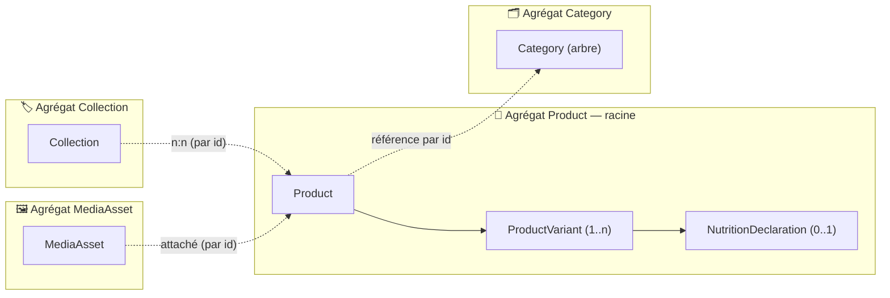
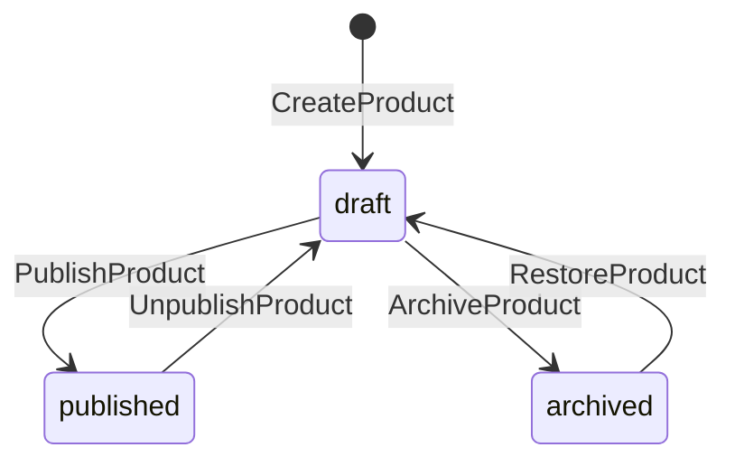

# 00 — Langage & comportement (le socle du socle)

> **À lire en premier.** Les autres docs décrivent des _tables_ ; celui-ci décrit le **langage** et
> les **verbes**. Une table est une conséquence, pas une décision.
>
> Ce document **clôt D6** (frontières d'agrégat) et **révise ADR-11** (event sourcing préparé, pas
> activé).

## 1. Langage ubiquitaire

Un mot = une chose. Ces termes sont les seuls autorisés, dans le code comme dans les docs.

| Terme                   | Anglais (code)         | Définition                                                                             | À ne PAS dire                |
| ----------------------- | ---------------------- | -------------------------------------------------------------------------------------- | ---------------------------- |
| **Produit**             | `Product`              | Ce que la boulangerie _conçoit_ — une recette commercialisée. **Pas vendable en soi.** | article, item, référence     |
| **Déclinaison**         | `ProductVariant`       | L'**unité réellement vendue**. Porte prix, dispo, code caisse.                         | variante produit, SKU        |
| **Référence**           | `sku`                  | Chaîne lisible par un humain qui désigne une déclinaison ou un produit                 | code, ref, EAN               |
| **Famille**             | `Category`             | Classement **structurel**, arbre à parent unique. Un produit a **une** famille.        | catégorie, rayon, collection |
| **Collection**          | `Collection`           | Regroupement **libre** et n:n (« Noël », « Signature »). Marketing.                    | catégorie, tag               |
| **Fiche réglementaire** | `NutritionDeclaration` | Allergènes + valeurs nutritionnelles d'une **déclinaison**                             | nutrition, INCO              |
| **Canal**               | `Channel`              | Un débouché : `pos_helios`, `shopify`, `b2b`                                           | plateforme, intégration      |
| **Publication**         | —                      | Le fait de rendre un produit visible **sur un canal**                                  | mise en ligne, push          |

> **Règle** : « produit » ne désigne **jamais** ce qu'un client achète. Un client achète une
> **déclinaison**. Ce glissement de vocabulaire est la première cause de modèle bancal en PIM.

## 2. Agrégats — la décision (ex-D6)

| Agrégat        | Racine       | Contient                                            | Justification                                                                                                                                                                                                                  |
| -------------- | ------------ | --------------------------------------------------- | ------------------------------------------------------------------------------------------------------------------------------------------------------------------------------------------------------------------------------ |
| **Product**    | `Product`    | ses déclinaisons **et** leurs fiches réglementaires | L'invariant « une seule déclinaison par défaut » et « pas de publication sans allergènes sur _chaque_ déclinaison » traversent produit **et** déclinaisons. Ils ne sont tenables que dans une même frontière transactionnelle. |
| **Category**   | `Category`   | l'arbre                                             | Cycle de vie totalement distinct (édité une fois par an), invariant propre (arbre sans cycle). Un produit la **référence par id**.                                                                                             |
| **Collection** | `Collection` | ses appartenances                                   | Marketing, volatil, n:n. Zéro invariant partagé avec le produit.                                                                                                                                                               |
| **MediaAsset** | `MediaAsset` | l'asset                                             | Cycle de vie propre (upload, CDN), réutilisable par plusieurs produits.                                                                                                                                                        |

**Corollaire** : on ne charge/modifie **jamais** une déclinaison seule. Toute mutation passe par le
produit. Une déclinaison n'a pas de dépôt propre.

## 3. Les commandes et les faits

Une commande est une **intention** (impérative, peut être refusée). Un event est un **fait**
(passé, immuable). Toute mutation du catalogue est dans cette liste — il n'existe pas d'`update`
générique.

### Agrégat `Product`

| Commande             | Fait émis               | Invariant vérifié                                                                                   |
| -------------------- | ----------------------- | --------------------------------------------------------------------------------------------------- |
| `CreateProduct`      | `ProductCreated`        | `name.fr` non vide · `sku` libre · famille existante · **crée d'office une déclinaison par défaut** |
| `RenameProduct`      | `ProductRenamed`        | `name.fr` non vide                                                                                  |
| `ChangeProductSku`   | `ProductSkuChanged`     | `sku` libre dans l'espace global                                                                    |
| `ReclassifyProduct`  | `ProductReclassified`   | famille cible existante et non archivée                                                             |
| `AddVariant`         | `VariantAdded`          | `sku` libre · la déclinaison a un **prix ou une dispo propre** (sinon = option de préparation)      |
| `RenameVariant`      | `VariantRenamed`        |                                                                                                     |
| `ChangeVariantSku`   | `VariantSkuChanged`     | `sku` libre dans l'espace global                                                                    |
| `SetDefaultVariant`  | `DefaultVariantChanged` | cible active                                                                                        |
| `ReorderVariants`    | `VariantsReordered`     | permutation complète                                                                                |
| `DiscontinueVariant` | `VariantDiscontinued`   | **jamais la dernière active** · **jamais celle par défaut** sans transfert                          |
| `DeclareNutrition`   | `NutritionDeclared`     | `allergens` présent (`[]` = déclaration positive) · `allergens ∩ may_contain = ∅` · valeurs ≥ 0     |
| `PublishProduct`     | `ProductPublished`      | ⛔ **refusée** si une déclinaison active n'a pas de fiche réglementaire                             |
| `UnpublishProduct`   | `ProductUnpublished`    |                                                                                                     |
| `ArchiveProduct`     | `ProductArchived`       | non publié                                                                                          |
| `RestoreProduct`     | `ProductRestored`       |                                                                                                     |

### Agrégat `Category`

| Commande              | Invariant vérifié                                                                    |
| --------------------- | ------------------------------------------------------------------------------------ |
| `CreateCategory`      | `name.fr` non vide · parent existant · **slug dérivé du nom**                        |
| `RenameCategory`      | `name.fr` non vide · **slug re-dérivé** · seul verbe permis sur une famille archivée |
| `MoveCategory`        | ⛔ **refusée si elle crée un cycle** · parent non archivé · jamais sa propre parente |
| `ReorderCategories`   | **permutation complète** de la fratrie vivante — un ordre partiel est refusé         |
| `SetCategoryChannels` | famille non archivée                                                                 |
| `SetCategoryTva`      | famille non archivée · chaque régime visé existe                                     |
| `ArchiveCategory`     | ⛔ **refusée si des produits actifs y sont rattachés** · idempotente                 |

**Une famille archivée est gelée** : canaux, TVA et place dans l'arbre sont refusés. Le
**renommage reste permis** — corriger une faute de frappe ne doit pas obliger à ressusciter une
famille qui ne vend plus rien. Elle sort aussi du jeu du réordonnancement : ni exigée dans
l'ordre proposé, ni renumérotée.

Ce que l'agrégat garantit seul s'arrête à ce qu'il voit. L'existence du parent, l'absence de
cycle (il faut l'arbre entier), le compte de produits actifs et l'existence du régime de TVA
appartiennent aux handlers ou au service `category-tree` — pas à l'entité.

### Agrégat `Collection`

`CreateCollection` · `RenameCollection` · `AddProductToCollection` · `RemoveProductFromCollection`.

## 4. Cycle de vie du produit

`draft` est l'état par défaut : **un produit naît invisible**. C'est ce qui rend tenable l'invariant
allergènes — on peut créer une fiche incomplète sans jamais risquer de la diffuser.

> `status` n'est **pas** un champ que l'on écrit : c'est la conséquence des verbes ci-dessus. Aucun
> code ne fait `product.status = 'archived'`.

## 5. Les trois règles irréversibles

L'event store n'est **pas** activé (cf. ADR-11 révisé). Mais ces trois règles-ci le sont dès
maintenant : elles ne coûtent rien aujourd'hui et sont **impossibles à rattraper** plus tard.

| #      | Règle                                                                                                                        | Pourquoi c'est irréversible                                                                                                                                                 |
| ------ | ---------------------------------------------------------------------------------------------------------------------------- | --------------------------------------------------------------------------------------------------------------------------------------------------------------------------- |
| **R1** | **Les identifiants sont assignés par la commande**, jamais par la base ni par un projecteur (UUID v7 généré applicativement) | Le jour où on rejoue un log d'events, un id auto-incrément regénérerait des ids différents — et la caisse, Shopify et les commandes passées pointent dessus. Irrattrapable. |
| **R2** | **Toute mutation porte un nom métier** (les verbes du §3). Aucun `updateProduct(partial)`                                    | Un `update` générique n'a pas d'event correspondant. Rétro-nommer les intentions après coup est impossible : l'information n'a jamais été capturée.                         |
| **R3** | **Aucun `DELETE` physique** — on archive                                                                                     | Une ligne supprimée est une histoire perdue.                                                                                                                                |

Ce que ça **n'impose pas** aujourd'hui : ni table `events`, ni projecteurs, ni upcasting. Les tables
sont écrites directement par les handlers de commande. Le passage à l'event store consistera à
**enregistrer** les faits déjà nommés — pas à re-modéliser.

## 6. Métadonnée : la position honnête

ADR-11 v1 annonçait « zéro `created_at`/`updated_at` ». C'était une victoire de façade : une table
de projection a de toute façon besoin de métadonnée technique.

**Position retenue** : les entités portent `created_at` / `updated_at` / `updated_by`, en colonnes
**système** explicitement hors-domaine.

- Elles ne sont **jamais** lues par la logique métier (une règle qui dépend de `updated_at` est un
  bug de modélisation).
- Elles ne sont **jamais** exposées dans les DTO du domaine.
- Le jour où l'event store arrive, elles deviennent redondantes et sont supprimées d'un bloc.

C'est moins élégant que « zéro colonne » — mais c'est vrai, et ça n'engage rien.
