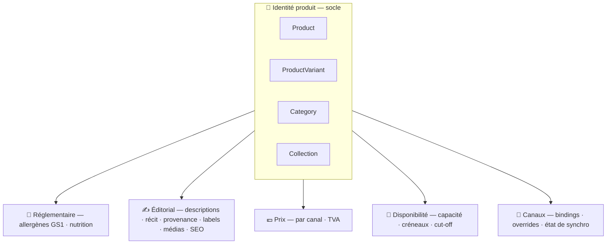
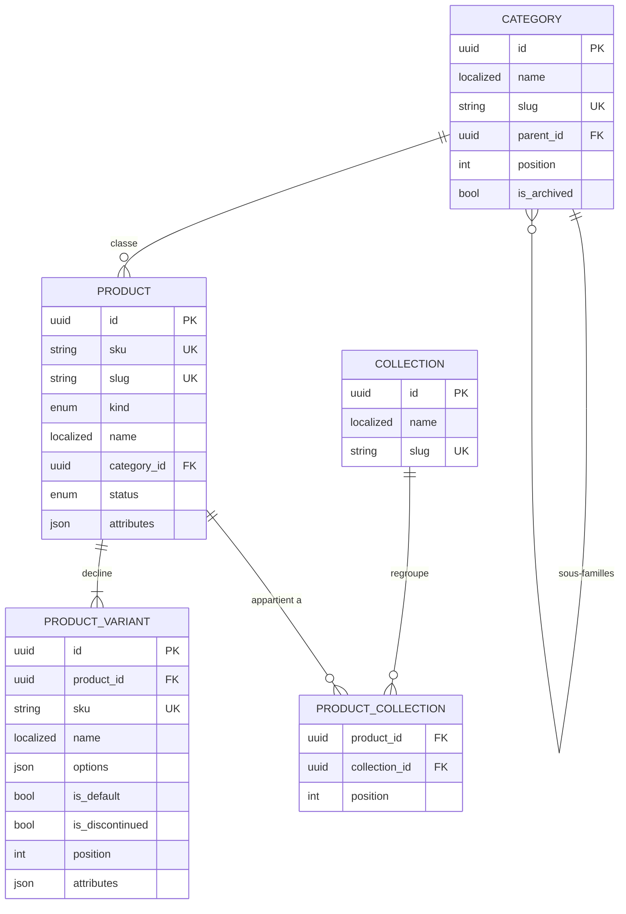

# 02 — Le produit, en couches (socle minimal)

> ⚠️ **Ce document fait seul autorité sur le socle.** Les champs et invariants ci-dessous sont ceux
> qui iront dans Prisma. [`01-produit.md`](./01-produit.md) ne couvre que l'**éditorial**.
>
> Le **langage** et les **verbes** qui font vivre ces tables sont dans
> [`00-langage-et-comportement.md`](./00-langage-et-comportement.md) — à lire avant celui-ci.

On définit d'abord le produit **simplement** : son **identité**. Tout le reste (réglementaire, prix,
dispo, éditorial…) est une **couche** posée autour, avec son propre rythme de vie et son propre doc.

## Le produit en couches

> **Descopé v1** : la couche ⚖️ _physique / logistique_ (poids, dimensions, unités logistiques,
> hiérarchie GTIN colis/palette pour le GDSN). Aucune table, aucun champ. Le code-barres caisse
> reviendra par la couche 📡 quand **D4** (accès PI Helios) sera tranché — c'est le canal qui en a
> besoin, pas le catalogue.

## Le socle, en relationnel

> Noter la cardinalité `||--|{` : un produit a **au moins une** déclinaison, toujours matérialisée.
> Il n'existe pas de « déclinaison implicite ».

---

## Entité : `Product` — l'identité, rien d'autre

| Champ         | Type            | Rôle                                                                                                     |
| ------------- | --------------- | -------------------------------------------------------------------------------------------------------- |
| `id`          | UUID v7         | Identité interne stable — **assignée par la commande** (R1), ne change **jamais**                        |
| `sku`         | string          | Référence métier lisible, **unique globalement** — `VIEN-CROI-BEURRE`. Modifiable via `ChangeProductSku` |
| `slug` 🌐     | LocalizedText   | Identifiant URL **par locale** — unique par locale                                                       |
| `kind`        | enum            | Nature : `daily` · `made_to_order` · `resale`                                                            |
| `name` 🌐     | LocalizedText   | Désignation commerciale                                                                                  |
| `category_id` | UUID → Category | Famille de rattachement (**une seule**)                                                                  |
| `status`      | enum            | `draft` · `published` · `archived` — **conséquence des verbes**, jamais écrit directement                |
| `attributes`  | jsonb           | Échappatoire gouvernée (voir conventions)                                                                |

`kind` (boulangerie) : `daily` = frais du jour · `made_to_order` = sur commande · `resale` = revendu
tel quel. Il reste ici car il définit _ce qu'est_ le produit.

> ⚠️ **`kind` n'est pas un aiguillage.** La logique de disponibilité ne doit **jamais** s'écrire en
> `switch (kind)` répliqué dans dispo / prix / production : c'est une violation d'OCP et l'échelle de
> `if` grandira à chaque canal. La couche 📅 résoudra une **stratégie par registre**, `kind` n'étant
> que sa clé de lookup.

## Entité : `ProductVariant` — la déclinaison vendable

**C'est la déclinaison, pas le produit, qui est achetée** — donc qui porte prix, disponibilité, code
caisse et **fiche réglementaire**. Elle n'a **pas de dépôt propre** : elle se modifie via l'agrégat
`Product`.

| Champ             | Type                       | Rôle                                                                                    |
| ----------------- | -------------------------- | --------------------------------------------------------------------------------------- |
| `id`              | UUID v7                    | Stable et **éternel** — la caisse, Shopify et l'historique de commandes pointent dessus |
| `product_id`      | UUID → Product             | Parent                                                                                  |
| `sku`             | string                     | **Unique globalement** — `PATI-TARTE-FRAISE-6P`                                         |
| `name` 🌐         | LocalizedText              | « 6 personnes »                                                                         |
| `options`         | jsonb `map<string,string>` | Axes — `{ "taille": "6 pers" }`                                                         |
| `is_default`      | bool                       | Déclinaison par défaut                                                                  |
| `is_discontinued` | bool                       | Retirée de la vente (jamais supprimée — R3)                                             |
| `position`        | int                        | Ordre d'affichage                                                                       |
| `attributes`      | jsonb                      | Échappatoire gouvernée                                                                  |

## Entité : `Category` — la taxonomie structurelle

Arbre à **parent unique**. C'est le classement _structurel_ (« Viennoiseries »), pas le marketing.

| Champ         | Type             | Rôle              |
| ------------- | ---------------- | ----------------- |
| `id`          | UUID v7          |                   |
| `name` 🌐     | LocalizedText    | « Viennoiseries » |
| `slug` 🌐     | LocalizedText    | Unique par locale |
| `parent_id`   | UUID? → Category | `null` = racine   |
| `position`    | int              | Ordre             |
| `is_archived` | bool             |                   |

> Le **code famille caisse** n'est **pas** ici. C'est du vocabulaire PI Helios : il vit dans le
> binding canal ([`04-composition-et-canaux.md`](./04-composition-et-canaux.md)). Le laisser sur
> `Category` faisait entrer un système tiers dans le cœur du domaine.

## Entité : `Collection` — le regroupement libre

Ce que l'arbre ne sait pas faire : « Noël », « Signature », « Vitrine du matin ». **n:n**, volatil,
piloté par le marketing, projetable en collections Shopify.

| Champ     | Type          | Rôle              |
| --------- | ------------- | ----------------- |
| `id`      | UUID v7       |                   |
| `name` 🌐 | LocalizedText |                   |
| `slug` 🌐 | LocalizedText | Unique par locale |

Table de liaison `product_collection` : `(product_id, collection_id, position)`, PK composite.

---

## Conventions du socle (figées)

| Convention               | Règle                                                                                                                                                                                                                                                                                                                    |
| ------------------------ | ------------------------------------------------------------------------------------------------------------------------------------------------------------------------------------------------------------------------------------------------------------------------------------------------------------------------ |
| **`LocalizedText`** 🌐   | `jsonb` `{ "fr": string, "en"?: string }` — `fr` obligatoire, fallback → `fr`                                                                                                                                                                                                                                            |
| **Identifiants**         | UUID **v7**, générés **applicativement** par la commande (R1). Jamais de séquence, jamais de `default gen_random_uuid()`                                                                                                                                                                                                 |
| **`sku`**                | **Value object** `Sku` (constructeur unique, normalisé majuscules) — espace de noms **global** produits + déclinaisons confondus. Modifiable par un verbe explicite ; les canaux bindent sur l'**`id`**, jamais sur le `sku` ; **rien ne le parse**. Détail : [`06-identifiants-et-sku.md`](./06-identifiants-et-sku.md) |
| **Cycle de vie**         | `status` / `is_discontinued` / `is_archived` sont des **conséquences de verbes** ; **jamais** de `DELETE` physique (R3)                                                                                                                                                                                                  |
| **Colonnes système**     | `created_at` / `updated_at` / `updated_by` existent, **hors-domaine** : jamais lues par une règle métier, jamais exposées en DTO (cf. [`00`](./00-langage-et-comportement.md#6--métadonnée--la-position-honnête))                                                                                                        |
| **`attributes` (jsonb)** | Clés **namespacées** (`labo.temperature_service`). **Jamais** de donnée réglementée. **Règle de promotion** : dès qu'un attribut est lu par un adaptateur canal **ou** utilisé par ≥2 familles, il devient une **colonne** — sinon le jsonb redevient le fourre-tout que ce découpage cherche à éviter                   |

## Invariants figés

1. `sku` **unique** dans un espace de noms **global** (produits et déclinaisons confondus).
2. Un produit a **au moins une** déclinaison, et **exactement une** avec `is_default = true`.
3. `DiscontinueVariant` est **refusée** sur la dernière déclinaison active ou sur celle par défaut.
4. On ne crée une déclinaison que si elle a un **prix OU une disponibilité propre** ; sinon c'est une
   **option de préparation** (note de commande), pas une déclinaison.
5. `Category` = **arbre sans cycle** ; `parent_id null` = racine. Archiver une famille portant des
   produits actifs est **refusé**.
6. Un produit appartient à **une** famille et à **0..n** collections.
7. `PublishProduct` est **refusée** si une déclinaison active n'a pas de fiche réglementaire
   ([`03`](./03-nutrition.md)).

---

## Les couches (chacune son doc, son rythme)

| Couche                   | Contenu                                                  | Où                                                                 |
| ------------------------ | -------------------------------------------------------- | ------------------------------------------------------------------ |
| **📖 Langage & verbes**  | glossaire, agrégats, commandes, events                   | [`00-langage-et-comportement.md`](./00-langage-et-comportement.md) |
| **🧩 Identité** (ce doc) | `Product` / `ProductVariant` / `Category` / `Collection` | ici                                                                |
| **🥗 Réglementaire**     | allergènes GS1 → INCO, nutrition                         | [`03-nutrition.md`](./03-nutrition.md)                             |
| **✍️ Éditorial**         | descriptions, récit, provenance, labels, médias, SEO     | [`01-produit.md`](./01-produit.md)                                 |
| **📡 Canaux**            | bindings, overrides, état de synchro                     | [`04-composition-et-canaux.md`](./04-composition-et-canaux.md)     |
| **🔖 Identifiants**      | `Sku` value object, SKU par défaut, références canal     | [`06-identifiants-et-sku.md`](./06-identifiants-et-sku.md)         |
| **💶 Prix**              | par canal + TVA                                          | _à porter_                                                         |
| **📅 Disponibilité**     | capacité, créneaux, cut-off                              | _à porter_                                                         |
| **⚖️ Logistique**        | poids, dimensions, GTIN, GDSN                            | **descopé v1**                                                     |
