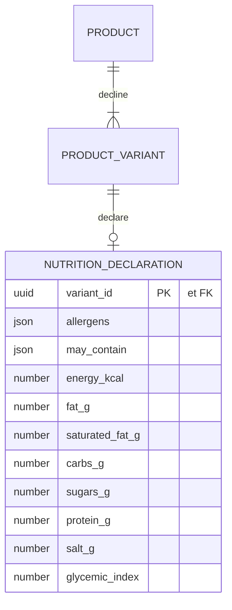

# 03 — Fiche réglementaire (couche 🥗)

> `NutritionDeclaration` porte le **réglementaire** : les **allergènes (obligatoires)** et, en
> optionnel, les valeurs nutritionnelles.
>
> Elle est rattachée à la **déclinaison** — c'est-à-dire à ce qui est **réellement vendu**. Elle fait
> partie de l'**agrégat `Product`** ([`00`](./00-langage-et-comportement.md#2--agrégats--la-décision-ex-d6)).

## Pourquoi la déclinaison, et pas le produit

La déclaration d'allergènes porte légalement sur la **denrée mise sur le marché**. « Tarte 6 pers »
et « Tarte 6 pers sans gluten » sont deux déclinaisons du même produit avec des allergènes
**différents**. Rattacher la fiche au produit rendrait ce cas impossible à représenter — sur le
sujet le plus sensible du projet.

> **Pas de résolution à la lecture.** On ne fait _jamais_ « fiche de la déclinaison, sinon celle du
> produit ». Une chaîne de fallback sur un chemin réglementé est un risque : elle finit par afficher
> silencieusement la mauvaise fiche. La duplication est **écrite à la commande** :
> `DeclareNutrition` accepte une portée (`toutes les déclinaisons` ou une liste) et écrit **N lignes
> explicites**. La lecture est un accès direct, sans logique.

## Rattachement

Deux choix structurels tiennent dans ce diagramme :

- **`o|` — la fiche est optionnelle.** Une déclinaison peut exister sans fiche : c'est l'état
  « pas encore renseigné ». Un 1:1 obligatoire aurait forcé à créer une ligne vide à la naissance du
  produit, donc à **affirmer « aucun allergène » alors que personne n'a rien vérifié**. Le modèle ne
  doit pas pouvoir mentir par défaut. La garde est ailleurs : **pas de publication sans fiche**.
- **`variant_id` est à la fois PK et FK** (_shared primary key_). Pas d'`id` de substitution : un id
  propre n'apporterait rien et **autoriserait techniquement deux fiches** pour une même déclinaison.

## Entité : `NutritionDeclaration`

| Champ             | Type                       |     Requis     | Rôle                                                                         |
| ----------------- | -------------------------- | :------------: | ---------------------------------------------------------------------------- |
| `variant_id`      | UUID → ProductVariant      | ✅ **PK + FK** | La déclinaison décrite                                                       |
| `allergens`       | `AllergenCode[]` (**GS1**) |       ✅       | Allergènes présents. `[]` = **déclaré « aucun »** — une affirmation positive |
| `may_contain`     | `AllergenCode[]` (**GS1**) |   optionnel    | Traces — « peut contenir »                                                   |
| `energy_kcal`     | number?                    |   optionnel    | **Énergie** (pour 100 g)                                                     |
| `fat_g`           | number?                    |   optionnel    | **Lipides** (g / 100 g)                                                      |
| `saturated_fat_g` | number?                    |   optionnel    | **dont acides gras saturés** (g / 100 g)                                     |
| `carbs_g`         | number?                    |   optionnel    | **Glucides** (g / 100 g)                                                     |
| `sugars_g`        | number?                    |   optionnel    | **dont sucres** (g / 100 g)                                                  |
| `protein_g`       | number?                    |   optionnel    | **Protéines** (g / 100 g)                                                    |
| `salt_g`          | number?                    |   optionnel    | **Sel** (g / 100 g)                                                          |
| `glycemic_index`  | number?                    |   optionnel    | **Indice glycémique** (0–100+) — **hors** annexe XV                          |

⚠️ **L'ordre de ce tableau est l'ordre légal de l'annexe XV**, et le schéma le
respecte déjà. Ce n'est pas une préférence de lecture : la mention doit être
présentée dans cet ordre.

> 🔴 **Ce tableau et le diagramme ci-dessus ont omis `saturated_fat_g`, `sugars_g`
> et `salt_g` jusqu'au 2026-09-22.** Les trois existent en base depuis la
> migration `20260825140000_declaration_nutritionnelle_inco` (2026-08-25), et ce
> sont des mentions **obligatoires**. Un mapper ou une fixture écrits d'après ce
> document en oubliait trois.

**Base de référence** : valeurs **pour 100 g** (standard INCO). Une base « par portion » pourra
s'ajouter plus tard sans casser celle-ci.

> Trois états à ne pas confondre : **ligne absente** = non renseigné (bloque la publication) ·
> **`allergens: []`** = vérifié, aucun allergène (publiable) · **`allergens: [...]`** = déclaré.

## Allergènes : GS1 canonique → INCO à l'affichage

`allergens` / `may_contain` stockent des **codes GS1** (canonique, interopérable B2B/GDSN). La
projection vers l'**INCO-14** (filtre + libellés + mise en forme) se fait à l'affichage — logique
déjà codée : [`src/allergens`](../../../apps/lfd-api/src/pim/allergens) (`toInco` /
`toGdsn`), détail dans [`05-allergenes-gs1-inco.md`](05-allergenes-gs1-inco.md). Les 30 codes GS1
ont été **recoupés un par un** avec `ref.gs1.org/voc/AllergenTypeCode` — trois codes provisoires
étaient faux et ont été corrigés ; la provenance est en tête d'`allergen-mapping.ts`. Le
référentiel devient administrable : voir le doc dédié.

## Invariants

1. **Pas de publication sans fiche** : `PublishProduct` est refusée si une déclinaison active n'a pas
   de `NutritionDeclaration`. C'est la contrepartie de l'optionalité de la ligne.
2. `allergens` et `may_contain` sont **disjoints** (un allergène présent n'est pas aussi une trace).
3. Valeurs nutritionnelles **≥ 0** ; cohérence macro **non imposée** — les valeurs déclarées font
   foi, on ne recalcule pas les calories depuis les macros.
4. Aucune donnée réglementaire dans `attributes` (jsonb) — jamais.

> **Tranchée** — le stockage des allergènes reste un tableau de codes en `Json` sur la
> déclinaison. La table de liaison sert l'**ingrédient**, pas la déclinaison : voir D4 et D5 de
> [`05-allergenes-gs1-inco.md`](05-allergenes-gs1-inco.md).

## Questions ouvertes

1. ~~**Fiche complète INCO**~~ — **tranchée et bâtie le 2026-08-25**
   (`20260825140000_declaration_nutritionnelle_inco`) : `saturated_fat_g`,
   `sugars_g` et `salt_g` sont en base. Restent **hors** modèle, et c'est
   toujours une question : l'énergie en **kJ** (l'annexe XV la veut à côté des
   kcal) et les **fibres** (facultatives).
2. **`ingredients_text`** (liste d'ingrédients réglementaire) : légalement du réglementaire → sa
   place est **ici**, pas dans l'éditorial. À ajouter au moment où on saura s'il est obligatoire
   pour de la vente non préemballée.
