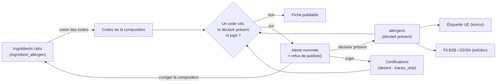

# 05 — Allergènes : d'un référentiel en dur à un référentiel administrable

> **État : partiel.** Livrés et commités — **D1, D2, D2 bis, D3, D4, D6**, le
> référentiel administrable, son écran, et les allergènes posés sur
> l'ingrédient. **D5 est déjà bâti à moitié, sous un autre nom** :
> `read-product-ingredient-allergens.ts` calcule l'ensemble dérivé et le sert
> par `GET /pim/products/:id/ingredient-allergens` — avec une sémantique qui
> n'est pas celle décidée ici (voir le TODO ci-dessous). **Pas une ligne de
> code — D4 bis, D5 bis**, ni la sonde de contradiction, ni la surface
> réglementaire du front (lots 6 à 10).
>
> ⚠️ Les objections non traitées de la relecture d'architecture sont dans
> [`todos/todo-allergenes-objections-vitruve.md`](../../todos/todo-allergenes-objections-vitruve.md) :
> trois bloquantes, huit sérieuses. **Ce plan n'est pas bon à bâtir en l'état.** Le § « L'existant, exactement » décrit l'état
> d'AVANT la bascule : il est conservé parce que c'est lui qui explique les
> décisions, mais `src/pim/allergens/` compte aujourd'hui quatre couches et une
> quarantaine de fichiers. Ce document est
> le plan de la bascule, et il devient la référence du sujet — il remplit le
> renvoi pendant de [`03-nutrition.md`](03-nutrition.md).

## L'intention

Trois choses, dans cet ordre de difficulté croissante :

1. **Rendre le référentiel administrable** — pouvoir ajouter un allergène et
   une catégorie d'allergène depuis le back-office, sans déploiement.
2. **Ne rien perdre de l'officiel** — les 30 codes GS1 et les 14 catégories
   INCO existantes sont du droit, pas de la configuration. Ils survivent à la
   bascule à l'identique, et deviennent **inaltérables**.
3. **Poser les allergènes sur l'ingrédient** pour qu'une fiche dont la
   composition les contredit ne puisse pas rester fausse.

## L'existant, exactement

Le référentiel vit dans trois fichiers de `src/pim/allergens/`, en dur :

| Fichier                  | Ce qu'il porte                                                                                                                                                                                                    |
| ------------------------ | ----------------------------------------------------------------------------------------------------------------------------------------------------------------------------------------------------------------- |
| `allergen-mapping.ts`    | **30 codes GS1** (T4078) → **14 catégories INCO** + 3 hors obligation UE, libellés `fr`/`en`. La provenance de chaque code est documentée en tête, avec les trois codes provisoires faux corrigés au recoupement. |
| `allergen-reference.ts`  | Le filtre de catalogue : `eu` = ce qui porte une obligation, `world` = tout.                                                                                                                                      |
| `allergen-projection.ts` | `toInco()` — **filtre**, **dédup n:1**, **localise** ; `toGdsn()` — passe-plat validant.                                                                                                                          |

Le mapping est **n:1** : blé, seigle, orge, avoine, épeautre, khorasan et
triticale retombent tous sur `gluten` ; les huit fruits à coque sur
`tree_nuts`. C'est la raison d'être du modèle — l'étiquette affiche la
catégorie, le B2B garde le détail.

Le stockage est un tableau de codes en `Json`, avec **trois états** qui ne se
confondent pas : `null` = aucune fiche, `[]` = fiche déclarée **sans**
allergène (une affirmation), une liste = les codes.

### Les quatre consommateurs — et les deux qui posent problème

Recomptés : **trois fichiers importent** `pim/allergens/`, et le quatrième
consommateur n'est pas un paquet mais le **front**, qui lit l'endpoint.

| #   | Consommateur                                                              | Ce qu'il appelle                                    | Statut après bascule          |
| --- | ------------------------------------------------------------------------- | --------------------------------------------------- | ----------------------------- |
| 1   | `pim/catalogue/shared/http/reference.controller.ts`                       | `allergenReference()`                               | ✅ se rebranche sur une query |
| 2   | le **front admin** — `reference-api.ts`, `product-form-store.ts`          | `GET /pim/reference/allergens`                      | ⚠️ problème 3                 |
| 3   | `pim/catalogue/product/domain/value-objects/nutrition-declaration.ts:107` | `findMapping()` **dans un value object de domaine** | 🔴 problème 1                 |
| 4   | `b2b/catalog/infrastructure/prisma-catalog-admin.reader.ts:101`           | `findMapping()` + `toInco()`                        | 🔴 problème 2                 |

**Problème 1 — la pureté du domaine.** `NutritionDeclaration` valide
aujourd'hui les codes par un `findMapping()` synchrone sur une constante
mémoire. Une fois le référentiel en base, le domaine ne peut plus faire ce
lookup : il ne connaît ni Prisma, ni l'`await`. C'est **la** décision centrale
de cette feature, traitée en D3.

**Problème 2 — le mur entre contextes.** Un fichier de `b2b/` importe
directement `pim/allergens/`. La matrice de `CLAUDE.md` §3 l'autorise « par
port uniquement ». ⚠️ La première rédaction ajoutait « le référentiel va vivre
dans la base PIM, qu'un backend B2B ne lit jamais » — c'est **faux**, il n'y a
qu'une base et `pim` en est un schéma (`CLAUDE.md` §1, redressé le
2026-08-31). Une telle jointure marcherait, et c'est justement pour ça qu'elle
s'interdit par discipline. Traité en D6.

## Ce qui est permanent, et ce qui ne l'est pas

C'est le cœur de la demande, et la règle tient en une phrase : **on n'invente
pas du droit, on l'enregistre.**

|                              | Officiel (semé, verrouillé)                      | Maison (créé par le staff)          |
| ---------------------------- | ------------------------------------------------ | ----------------------------------- |
| **Catégories**               | les 14 de l'annexe II — `gluten`, `tree_nuts`, … | libres                              |
| **Entrées**                  | les 30 codes GS1 recoupés                        | libres                              |
| `code`                       | **immuable**                                     | immuable après création             |
| rattachement à une catégorie | **immuable**                                     | modifiable                          |
| libellés                     | **immuables** — ce sont les mentions légales     | modifiables                         |
| suppression                  | **interdite**                                    | interdite si citée, sinon archivage |
| `incoCategory`               | c'est ce qui les rend légales                    | **toujours `null`**                 |

Ces verrous ne sont pas seulement applicatifs : un trigger les tient **en
base**, pour qu'ils survivent à un `psql` et à une migration future — voir
« Le verrou d'immuabilité ».

La dernière ligne est une **règle de sûreté, pas une limitation** : une
catégorie maison ne doit jamais pouvoir se faire passer pour une mention
réglementaire sur une étiquette UE. Le staff peut créer « Fruits à coque
exotiques » pour organiser son catalogue ; cette catégorie n'entrera jamais
dans une projection INCO. `toInco()` ne connaît que les 14.

### La catégorie « hors obligation UE »

`official` et « porte une catégorie INCO » ne sont **pas** la même chose, et
les trois codes sans obligation UE le prouvent : `BWD` (sarrasin), `NM`
(maïs), `SO` (noix de coco) sont des codes GS1 officiels, semés et verrouillés
comme les autres — mais aucune catégorie de l'annexe II ne les accueille.

Ils sont donc rattachés à une catégorie semée, `alg_cat_non_eu`, de clé
`non_eu` et de libellé « Hors obligation UE » / « Not EU-declarable », avec
`official = true` et `inco_category = null`.

Les deux colonnes disent donc deux choses distinctes :

- `official` = **semé et verrouillé** ; le trigger s'y applique ;
- `inco_category` = **c'est une catégorie de l'annexe II** ; la projection INCO
  ne connaît que celles-là.

Ce découpage est ce qui rend D2 exprimable : le prédicat de `scope=eu` est
« la catégorie porte une `inco_category` **OU** elle n'est pas officielle », si
bien que cette catégorie-ci — officielle et sans mention INCO — est la seule
que le catalogue légal écarte, avec ses trois entrées. Exactement ce que
`incoCategory !== null` faisait avant la bascule, et sans emporter les
catégories maison avec (cf. D2).

Le libellé dit « hors obligation **UE** », pas « non réglementé » : le sarrasin
est à déclaration obligatoire au Japon et en Corée. C'est le périmètre européen
qui est en cause, pas l'innocuité.

Corollaire assumé : **l'annexe II ne s'étend pas depuis le back-office.** Le
jour où le législateur ajoute une 15ᵉ catégorie, c'est une migration semée,
pas une saisie — et c'est voulu.

## Les neuf décisions

### D1 — Les catégories deviennent une table, pas un enum élargi

`IncoCategory` est aujourd'hui une union TypeScript de 14 valeurs. La rendre
dynamique la ferait retomber en `string` partout, et on perdrait la sûreté de
type sur un champ réglementé.

**Décision :** deux notions distinctes plutôt qu'une notion élargie.
`IncoCategory` **reste l'union fermée de 14** dans le code — c'est du droit, il
ne bouge pas au rythme d'une saisie. La table `allergen_category` porte, elle,
**toutes** les catégories ; les 14 officielles y sont semées avec une colonne
`inco_category` renseignée (la valeur de l'union), les catégories maison avec
`inco_category = null`.

Ainsi le typage fort survit exactement là où il protège — la projection — et
l'extensibilité vit là où on la demande — l'organisation du catalogue.

### D2 — Le catalogue `eu`/`world` se dérive, il ne se stocke pas

Pas de colonne `scope` : elle pourrait diverger de la vérité qu'elle est censée
résumer. La dérivation se fait sur `inco_category`.

🔴 **Mais il y a DEUX filtres, et les confondre casse la feature.**

| La question                                                | Le périmètre                  | Fermé aux 14 ?          |
| ---------------------------------------------------------- | ----------------------------- | ----------------------- |
| « Qu'est-ce qui s'imprime comme mention de l'annexe II ? » | la projection `toInco()`      | **oui, définitivement** |
| « Qu'est-ce que le staff a le droit de cocher ? »          | le catalogue servi à la fiche | **non**                 |

Aujourd'hui les deux coïncident, parce que le référentiel est fermé. Après la
bascule, non : une entrée maison vit sous une catégorie maison, donc
`inco_category = null`. Si `scope=eu` continuait de filtrer là-dessus, elle
serait **absente du catalogue par défaut** — et le formulaire produit démarre
sur `eu` (`product-form-store.ts`, `signal<AllergenScope>('eu')`).

Le staff pourrait donc créer un allergène **sans jamais pouvoir le cocher**,
sauf à basculer sur « Monde », à côté du sarrasin. C'est-à-dire : le référentiel
devient administrable et la déclaration ne le voit pas — l'intention n°1 du
chantier, annulée par son propre filtre.

**Décision :** `scope` cesse de vouloir dire « porte une catégorie INCO » et
veut dire ce qu'il a toujours voulu dire pour l'utilisateur — **quel périmètre
réglementaire je déclare**.

- `eu` = les entrées de l'annexe II **plus toutes les entrées maison**. Un
  allergène maison est un allergène réel, il se déclare.
- `world` = tout, y compris les trois hors obligation UE.

`toInco()`, lui, ne connaît toujours que les 14 : une entrée maison est
déclarable et n'apparaîtra jamais comme une mention réglementaire. C'est
exactement la séparation que D1 protège, et elle ne demande pas que le catalogue
s'aligne sur la projection.

### D2 bis — L'archivage retire de ce qu'on PROPOSE, pas de ce qu'on RECONNAÎT

Deux questions se ressemblent et n'ont pas la même réponse. Les confondre est le
défaut le plus probable du lot 3, parce que la même méthode de port sert les
deux.

| La question                                      | La réponse               | Le chemin                      |
| ------------------------------------------------ | ------------------------ | ------------------------------ |
| « Ce code est-il valide dans une déclaration ? » | oui, **archivé compris** | `knownCodes()`                 |
| « Ce code peut-il être coché sur une fiche ? »   | non s'il est archivé     | `GET /pim/reference/allergens` |

Une déclaration enregistrée hier cite un code que le staff archive demain. La
relire ne doit pas la déclarer invalide : on invaliderait l'étiquette d'un
produit déjà servi sans que personne ne l'ait décidé. Mais la **proposer** de
nouveau à la saisie serait tout aussi faux — c'est précisément ce que
l'archivage retire.

**Donc :** `GET /pim/reference/allergens` **omet** les entrées archivées et les
catégories archivées. Le contrat de fil (`AllergenEntry` de
`@lfd/pim-contracts`) n'a d'ailleurs aucun champ pour les exprimer, et il n'en
gagne pas : une entrée archivée n'est pas une entrée dans un état particulier,
c'est une entrée qui n'est plus offerte.

⚠️ **Ne pas proposer n'est pas refuser.** `knownCodes()` acceptant les
archivés, rien n'empêche d'en déclarer un pour la **première** fois — par appel
direct, par import, par reprise. Le filtre ne vit que dans ce qu'on affiche.

Le geste juste tient en une ligne dans le handler du lot 4, et il est plus fin
qu'un refus sec : **refuser un code archivé qui n'était pas déjà dans la
déclaration précédente.** Rééditer une fiche qui le cite reste possible — sinon
changer une valeur nutritionnelle échouerait sur un code que personne n'a touché,
puisque `declare-product-nutrition` revalide la déclaration **entière** à chaque
enregistrement. Mais l'ajouter à neuf est refusé.

L'écran d'administration du référentiel, lui, doit les voir — pour les
restaurer. Il ne passe donc pas par cet endpoint mais par la lecture complète du
catalogue, `archivedAt` compris.

⚠️ Corollaire pour le port de lecture : `AllergenCategoryView` porte
`archivedAt`, au même titre que `AllergenEntryView`. Sans lui, l'écran
d'administration ne peut pas distinguer une catégorie retirée d'une catégorie
vide, et la restauration n'a pas d'objet à viser.

### D3 — Le domaine reçoit les codes valides, il ne les cherche pas

`NutritionDeclaration.create()` prend aujourd'hui les codes et les valide
seule. Après la bascule, **le handler charge l'ensemble des codes connus par un
port et le passe à la factory** :

```ts
// application/ — le handler lit le référentiel
const known = await this.catalogue.knownCodes(); // ReadonlySet<string>
// domain/ — la fabrique reste pure, synchrone, testable sans Nest
nutritionDeclaration(allergens, mayContain, values, known);
```

Le value object garde son invariant (« un code inconnu est refusé ») et reste
**pur et déterministe** — la seule chose qui change est d'où vient la liste. La
solution rejetée est le cache mémoire rafraîchi : il rendrait le domaine
dépendant d'un état global et le test non déterministe.

### D4 — L'ingrédient porte des codes GS1, pas des catégories

Un ingrédient déclare ce qu'il **est** (« contient des noisettes » → `SH`), pas
ce qu'une étiquette en dira. La projection vers la catégorie appartient à
l'affichage, exactement comme pour la déclinaison. Table de liaison
`ingredient_allergen`, pas un `Json` : ici on voudra l'index inverse (« quels
produits contiennent du gluten »).

**Le périmètre offert à l'ingrédient est `world`, jamais `eu`.** Un ingrédient
énonce un **fait** : une farine qui contient du sarrasin en contient, que
l'Europe l'exige ou non. Servir le catalogue `eu` rendrait `BWD`, `NM` et `SO`
impossibles à poser sur une matière — c'est-à-dire interdirait de consigner
précisément ce qu'on aura besoin de savoir un jour, pour un marché hors UE ou
pour un client qui demande.

Le filtre européen appartient à la **déclaration**, pas à la matière. Un code
hors obligation UE posé sur un ingrédient peut donc **contredire** une fiche
(D5) sans jamais s'y écrire, et `toInco` l'écarterait de l'étiquette UE de
toute façon — chaque étage fait son travail, et aucun ne décide à la place d'un
autre.

### D4 bis — « aucun allergène » s'inscrit aussi sur un ingrédient

L'absence de lignes dans `ingredient_allergen` dit aujourd'hui **deux choses à
la fois** : « personne n'a regardé » et « on a regardé, il n'y en a pas ». C'est
la confusion à trois états que tout le dépôt combat, cette fois au niveau de la
**matière** — et elle contamine la détection de contradiction, qui compare une
déclaration à des listes dont elle ne sait pas si elles ont été remplies.

**Décision :** une colonne `allergens_declared_at` sur `ingredient`, nullable
et **datée**. `null` = jamais examiné ; renseignée = examiné, et les lignes de
liaison sont la réponse, **y compris zéro**.

Datée plutôt que booléenne : un booléen répond « oui », une date répond « depuis
quand », et c'est la question qu'on pose six mois plus tard sur un champ
réglementé. Migration additive, colonne nullable.

**Tracé comme un fait à part entière.** Affirmer « cette matière ne contient
aucun allergène » est une affirmation, exactement comme `[]` sur une fiche
produit — elle ne se déduit pas d'une liste vide, elle se prononce. Elle a donc
son propre événement, distinct de la pose d'une liste.

#### Ce que ça change pour l'alerte

L'alerte de D5 détecte ce que la composition **cite**. Sa **couverture** décide
donc de ce qu'elle vaut : une absence d'alerte sur sept ingrédients dont trois
n'ont jamais été examinés ne dit rien. Elle cesse d'être muette sur sa propre
fiabilité et peut dire :

> l'union des allergènes des sept ingrédients cités — **dont trois n'ont jamais
> été examinés**

et **nommer lesquels**, plutôt que d'en donner le compte : « trois non examinés »
oblige à ouvrir les sept fiches pour trouver lesquelles. Le coût est nul, la
requête parcourt déjà la composition.

#### Ce que ça ne répare PAS

Il reste **deux** sources de silence, et celle-ci n'en corrige qu'une :

1. **Un ingrédient jamais examiné** — réparé.
2. **La liste d'ingrédients n'est pas exhaustive** — intact. Le schéma
   l'avertit : elle est éditoriale, elle cite « le beurre de Savoie AOP » et tait
   la farine. Aucun champ posé sur un ingrédient ne rattrapera un ingrédient
   **absent**.

L'alerte n'est donc toujours **pas un contrôle réglementaire** (D5) : elle
empêche une affirmation contredite de survivre, elle ne prouve jamais qu'une
déclaration est complète. Mais il passe de « je ne sais pas ce que je ne dis
pas » à « je sais exactement quelle part de la composition j'ai pu lire » — et
cette part-là, l'écran l'affiche.

### D5 — La composition ne déclare rien, elle **contredit**

C'est la décision la plus lourde du plan, et la troisième rédaction. Les deux
précédentes sont notées ici parce qu'elles disent ce que le sujet a de piégeux.

**Première version — « la dérivation propose, la déclaration décide ».** Fausse
sur un cas : une fiche affirmant `[]` (« vérifié, aucun allergène ») dont la
composition cite une matière allergène est un incident allergique, pas une gêne.
Laisser cette affirmation debout jusqu'à un clic est indéfendable.

**Deuxième version — l'héritage automatique, `effectif = déclaré ∪ hérité`.**
Fausse pour une raison plus profonde : elle **tirait une mention obligatoire de
la liste éditoriale**, ce que `model Ingredient` interdit sans réserve — « le
jour où une mention obligatoire serait tirée d'ici, elle serait fausse ». Elle
citait cet avertissement pour refuser la case `null` et passait au travers pour
les deux autres. Et elle produisait, dès la mise en service, une déclinaison
« sans gluten » déclarant du gluten — le plan citait déjà cet exemple, dans la
section même de la décision qu'il réfute.

**Décision :** la composition ne produit **aucune déclaration**. Elle produit
une **contradiction**, que l'écran nomme et qu'un humain résout.

> Rien de ce que porte un ingrédient n'atteint jamais `allergens`, `toInco`,
> `toGdsn`, le fil B2B ou une révision. `déclaré` reste la source unique de
> l'étiquette. La composition n'écrit pas — elle **alerte**.

La troisième rédaction a elle-même été reprise sur trois points, tous notés à
l'endroit où ils portent : la porte choisie n'en était pas une, la matrice
contredisait sa propre définition, et `may_contain` absolvait un allergène que
la composition dit **contenu**.

#### La matrice

| déclaré ↓ · composition → | ne cite rien | cite des allergènes                                                |
| ------------------------- | ------------ | ------------------------------------------------------------------ |
| `null` — aucune fiche     | `null`       | `null` + alerte — **déjà refusé** par `publish()`, la fiche manque |
| `[]` — aucun, affirmé     | `[]` tient   | **contradiction** — `[]` est faux                                  |
| une liste                 | la liste     | **contradiction** sur chaque code cité et non déclaré              |

Trois cellules sur six portent une citation, et **les trois refusent la mise en
vente**. La version précédente n'en marquait qu'une, et rangeait dans « informe »
le cas courant — la fiche déclare le lait, la composition cite aussi la
noisette — c'est-à-dire une étiquette à laquelle manque une mention obligatoire.
C'était exactement le scénario qui a tué la première version, réintroduit par un
tableau qui ne suivait pas sa propre définition.

La première ligne n'a pas besoin de ce plan pour être refusée : `publish()` exige
déjà une fiche réglementaire sur chaque déclinaison non arrêtée
(`variant.hasRegulatorySheet`, faux quand `allergens` vaut `null`). La
composition n'y ajoute pas un refus, elle ajoute une **raison** — « et vos
ingrédients en portent trois » vaut mieux que « fiche manquante ».

#### Ce qui est une contradiction, et ce qui n'en est pas

Un code cité par la composition n'est pas une contradiction quand la déclinaison
le porte **en présence** (`allergens`) ou quand un jugement l'a explicitement
tranché (D5 bis).

**`may_contain` seul n'absout pas.** `ingredient_allergen` n'a aucune nuance :
une ligne dit que cette matière **contient** ce code, pas qu'elle en porte des
traces. Déclarer en « traces de lait » un ingrédient dont le référentiel dit
qu'il contient du lait est un **déclassement**, et un déclassement silencieux
est la falsification que la première version produisait — réintroduite par la
porte de la tolérance. Le déclassement reste possible ; il devient un jugement
signé (D5 bis, `traces_only`), pas un effet de bord.

La contradiction est donc : _un code cité par la composition, absent
d'`allergens`, et que ne couvre aucune certification de D5 bis._

#### Résoudre, en trois gestes

1. **Le déclarer présent** — le code entre dans `allergens`.
2. **Le juger** (D5 bis) — soit `absent` (le chocolat raffiné ne porte pas la
   noix de coco de sa matière première), soit `traces_only` (il s'y retrouve à
   l'état de traces, et le code doit alors figurer en `may_contain`).
3. **Corriger la composition** — l'ingrédient n'aurait pas dû être cité, ou son
   propre référentiel d'allergènes est faux.

Un code **archivé** cité par la composition contredit comme les autres, mais
D2 bis interdit de l'ajouter à neuf : les gestes disponibles sont donc le
jugement ou la désarchivation.

L'état « entrée vive sous catégorie archivée », qui échapperait au refus
(`declaration-support.ts` ne regarde que `entry.archivedAt`), est **inatteignable
par l'application** : `requireLivingCategory` garde la création, la restauration
et le déplacement, et `ensureCategoryUncited` refuse d'archiver une catégorie qui
garde une entrée proposée. Le lot 3 l'a fermé. Reste le SQL direct, qu'aucune
contrainte ne couvre — c'est le même angle mort que le §3 de `CLAUDE.md` signale,
et il n'appartient pas à ce plan.

#### La porte est `publish()`, et rien d'autre

La rédaction précédente bloquait `product.declared_ready`. C'était faux, et le
fichier le dit en toutes lettres : _« Elle ne touche PAS au statut. Une fiche
déclarée publiable reste un brouillon »_ (`declare-product-ready.ts`). Le geste
est facultatif, sans aval, et une fiche contredite pouvait donc être mise en
vente, figée dans une révision, poussée vers Shopify et vers la plateforme
professionnelle sans jamais rencontrer le blocage.

La porte réelle est **`product.publish()`** : c'est elle qui refuse déjà une
fiche réglementaire manquante, et une contradiction s'y ajoute comme un refus de
même nature.

⚠️ **Son périmètre réel est plus étroit que cette décision ne le laisse
entendre.** Une rédaction antérieure affirmait que « les quatre gestes marqués
`@PublicationGesture()` » traversent `publish()` : c'est faux, aucun des quatre
n'appelle `PublishProductCommand` — ce décorateur marque l'interrupteur de
déploiement, pas le statut. Seul le fil B2B filtre sur les produits publiés
(`feed-projection.service.ts`) ; une **révision de catalogue** fige encore une
fiche contredite, et la projection Shopify ne transporte aucun allergène. Ce
qu'il faut trancher — `take-catalog-revision` entre-t-il dans le périmètre, ou
une ancre photographie-t-elle sans juger — est noté au TODO et **n'est pas
tranché ici**.

Une contradiction n'empêche donc **pas** d'enregistrer un brouillon — on
travaille une fiche par étapes — ni de la déclarer prête, qui reste une signature
sans effet de bord. Elle empêche la **mise en vente**.

#### Où vit la règle

Le calcul croise quatre faits : les codes cités par la composition, `allergens`,
`may_contain` et les certifications. Aucun n'appartient à l'agrégat `Product`, et
`CLAUDE.md` §3.1 nomme précisément le smell qui guette — « un invariant vérifié
sur une `*.View` puis suivi d'une écriture nue ». Trois pièces, donc :

- **un service de domaine pur** — `detectAllergenContradictions(cited, declared,
mayContain, certified)` rend la liste des contradictions, par déclinaison. Pas
  de Nest, pas de Prisma, testable sans double ;
- **un port de lecture** — `CitedAllergensReader`, déclaré par `catalogue`,
  rendant les codes que cite la composition d'un produit. Son adaptateur vit dans
  `ingredients/infrastructure/` et le **liage se fait dans `appBootstrap/`** :
  aucun des deux modules n'importe l'autre, donc pas de cycle, et la frontière
  reste visible. C'est délibérément l'inverse de
  `prisma-variant-declaration.reader.ts`, qui lit aujourd'hui les tables d'un
  autre sous-contexte en SQL direct — sous la granularité des portes, et à
  rembourser de la même façon ;
- **le refus dans l'agrégat** — `publish()` prend les contradictions en
  argument et lève. Le handler charge, le service calcule, l'agrégat refuse ;
  aucun `if` de handler ne porte l'invariant.

#### La maille du refus est le produit, celle du jugement la déclinaison

`ProductIngredient` est clé sur le **produit**, `NutritionDeclaration` et les
certifications sur la **déclinaison**. `publish()` raisonne sur le produit
entier : une contradiction sur une seule déclinaison **refuse tout le produit**,
comme le fait déjà une fiche réglementaire manquante. C'est le comportement
existant, pas une invention — et il est juste : on ne met pas en vente une
gamme dont un article ment.

« Tarte 6 pers » et « Tarte 6 pers sans gluten » partagent donc la même
composition et reçoivent la même alerte, dont l'une est fausse. Sous héritage
automatique, cette fausseté devenait une étiquette ; ici la seconde déclinaison
la résout **une fois** par un jugement. Le texte de l'écran parle de la
composition **du produit**, jamais de « ce que cette déclinaison contient ».

#### Une fiche déjà en vente dont la composition dérive

`publish()` n'attrape qu'à l'instant de publier. Deux dérives lui échappent, et
la seconde est la plus coûteuse :

1. **la composition du produit change après la mise en vente.** Rien ne la
   signale aujourd'hui : `ProductIngredient` n'a pas d'`updatedAt`, et
   `contentUpdatedAt` ne lit que quatre tables — produit, déclinaisons,
   éditorial, médias. Le JSDoc de l'adaptateur prévient de ce défaut exact.
   Correctif : `setProductIngredients` **touche `product.updatedAt`** dans la
   même transaction, et la fiche périme comme n'importe quel autre contenu ;
2. **le référentiel partagé change.** `ingredient_allergen` est posé sur
   l'ingrédient, pas sur la fiche : corriger « chocolat » crée d'un coup une
   contradiction sur **toutes** les fiches qui le citent, publiées comprises.
   Aucune écriture côté produit, donc aucune péremption possible — c'est
   structurel.

Le second cas ne se rattrape que par un **balayage**. La sonde de contradiction
de la couche 4 cesse donc d'être un confort : elle est la condition de
l'intention n°3 de ce chantier — _« qu'une fiche dont la composition les
contredit ne puisse pas rester fausse »_. Elle recalcule les contradictions sur
les produits **publiés**, sur le modèle de `ops_catalog_parity.yml`.

Elle **rapporte, elle ne dépublie pas.** Retirer de la vente d'autorité, sur une
donnée que ce plan reconnaît lui-même comme non exhaustive, ferait plus de dégâts
qu'elle n'en éviterait. Le geste appartient à un humain (`CLAUDE.md` §0).

#### Ce que ça ne prouve toujours pas

L'alerte détecte ce que la composition **cite**. Elle ne dit rien de ce que la
composition **tait** — la liste est éditoriale et non exhaustive, et aucun
mécanisme posé ici ne rattrapera un ingrédient absent. L'absence d'alerte n'est
donc pas une vérification, et aucun écran ne doit se lire comme « composition
vérifiée ». D4 bis borne l'autre moitié du silence : elle distingue « ingrédient
jamais examiné » de « examiné, aucun allergène », et l'alerte doit dire combien
d'ingrédients cités sont dans le premier cas.

Elle ne dit rien non plus de ce qui change **derrière un ingrédient inchangé** :
un fournisseur qui modifie sa recette sans que la clé de l'ingrédient bouge est
invisible à toute donnée de ce dépôt. C'est la limite dure du modèle, et elle
justifie que le jugement de D5 bis ne soit jamais présenté comme définitif.



### D5 bis — Juger un allergène de la composition

C'est l'un des trois gestes qui résolvent une contradiction (D5), et le seul qui
n'écrit rien dans `allergens`.

Le cas est réel : un ingrédient « chocolat » porte `SO`, mais la recette utilise
une version raffinée qui n'en contient pas. Sans ce geste, l'alerte reviendrait à
chaque ouverture et refuserait la mise en vente pour toujours — et une alerte
permanente est une alerte morte.

**Ce n'est pas « ignorer ».** C'est prendre position contre une donnée, sur un
champ réglementé. Le libellé de l'écran doit porter ce poids ; un bouton
« ignorer » mentirait sur ce qui se passe.

#### Deux jugements, pas un

| `judgment`    | Ce qu'il affirme                                    | Ce qu'il exige                             |
| ------------- | --------------------------------------------------- | ------------------------------------------ |
| `absent`      | cet allergène ne se retrouve pas dans cette recette | rien                                       |
| `traces_only` | il s'y retrouve, à l'état de traces seulement       | le code figure en `may_contain`, invariant |

Sans le second, `may_contain` n'aurait plus de sortie légitime et l'opérateur
détournerait `absent` — un déclassement rendu silencieux par le mécanisme même
qui devait l'empêcher. Avec lui, le déclassement est possible, nommé, daté et
signé.

`traces_only` est un invariant, pas une case à cocher : retirer le code de
`may_contain` invalide le jugement, et la contradiction revient.

#### Journalisé, et **signé en table**

« Qui a jugé que ce produit ne contient pas la noix de coco de son chocolat, et
quand » est exactement la question d'un rappel. `ProductReadiness` a déjà tranché
ce point et écrit pourquoi — `readyBy` _« jamais `null` : une déclaration anonyme
n'engagerait personne, et c'est tout son objet »_. La certification suit : elle
porte `certifiedBy` **en table**, et non seulement au journal d'un autre
contexte, sans clé de jointure. Le journal enregistre le fait par-dessus ; le
`subjectType` du référentiel gagne un douzième sujet, « déclinaison ».

#### Ce qui l'endort, et ce qui ne l'endort pas

Un jugement porté une fois ne peut pas éteindre une alerte réglementaire pour
toujours. La certification retient donc **quels ingrédients citaient ce code au
moment du jugement** (`citedBy`, les clés d'ingrédients) :

- **les mêmes ingrédients citent toujours ce code** → le jugement couvre, pas
  d'alerte ;
- **un ingrédient de plus cite ce code** → le jugement ne le couvre pas. La
  certification devient **dormante**, l'alerte revient, et l'écran affiche le
  jugement passé plutôt que de le taire — on reprend une position, on n'en
  découvre pas l'absence ;
- **déclarer le code en présence** rend le jugement sans objet ; on ne le
  supprime pas. Si cette déclaration est ensuite retirée, il **reprend effet** —
  il n'a jamais été annulé.

⚠️ Ce que `citedBy` **ne** couvre pas : un fournisseur qui change sa recette
derrière un ingrédient dont la clé ne bouge pas. Aucune donnée de ce dépôt ne le
voit. L'écran doit donc dater le jugement visiblement — un jugement de dix-huit
mois se relit.

#### La forme

Une table de liaison additive :

```prisma
model VariantAllergenCertification {
  variantId String         @map("variant_id")
  variant   ProductVariant @relation(fields: [variantId], references: [id], onDelete: Cascade)
  /// L'entrée du référentiel, par sa CLÉ ÉTRANGÈRE et non par son code en
  /// clair : une certification qui pointerait une chaîne survivrait à l'entrée
  /// qu'elle vise, exactement le défaut que `ProductIngredient` documente.
  entryId   String        @map("entry_id")
  entry     AllergenEntry @relation(fields: [entryId], references: [id])
  /// `absent` | `traces_only` — enum Postgres, pas une chaîne libre.
  judgment    AllergenJudgment
  /// Les clés d'ingrédients qui citaient ce code au moment du jugement. Un
  /// citant de plus l'endort (voir plus haut).
  citedBy     String[]  @map("cited_by")
  certifiedAt DateTime  @map("certified_at")
  /// Jamais `null` : un jugement anonyme n'engagerait personne.
  certifiedBy String    @map("certified_by")
  @@id([variantId, entryId])
  @@index([entryId])
  @@map("variant_allergen_certification")
  @@schema("pim")
}

enum AllergenJudgment {
  absent
  traces_only
  @@map("allergen_judgment")
  @@schema("pim")
}
```

Et les **relations inverses**, sans lesquelles `prisma validate` échoue avant
toute migration — le défaut de la rédaction précédente :

```prisma
model ProductVariant {
  // …
  allergenCertifications VariantAllergenCertification[]
}

model AllergenEntry {
  // …
  certifications VariantAllergenCertification[]
}
```

Pas une colonne `jsonb` sur la déclaration : la déclaration peut ne pas exister,
et un jugement porté sur une recette doit lui survivre. Et une clé étrangère,
pas un code en clair — `Restrict` côté entrée, comme partout ailleurs dans ce
chantier.

### D6 — Le B2B lit un instantané, jamais le référentiel PIM

`prisma-catalog-admin.reader.ts` cesse d'importer `pim/allergens/`. Le B2B
affiche ce qu'on lui a poussé ; il ne reprojette pas une donnée réglementaire
dont il n'a plus le référentiel.

⚠️ **Ce n'est pas une lecture inter-bases.** Il n'y a qu'une base : `pim` en est
un schéma (cf. `CLAUDE.md` §1, redressé le 2026-08-31). Une telle jointure
**marcherait** — et c'est justement pour ça qu'il faut l'interdire par
discipline. La justification d'origine de cette décision (« lecture
inter-bases ») était fausse ; la décision, elle, tient.

Corollaire à ne pas se cacher : D6 est un nettoyage **sans cliquet**.
`lint:context-boundaries` autorise `b2b → pim` sans réserve, donc rien
n'empêchera le prochain import. Le resserrement de la porte est suivi dans
[`todos/todo-mur-entre-contextes.md`](../../todos/todo-mur-entre-contextes.md),
et il doit venir **après** D6, sous peine de faire rougir la CI sur du code
qu'on est en train de corriger.

Trois coûts que la première rédaction passait sous silence :

1. **La projection poussée contredit une décision écrite.**
   `packages/catalog-sync/src/snapshot.ts` justifie le champ `allergens` par
   « **des codes, jamais des libellés** : la projection […] appartient à qui
   affiche ». Le renversement est légitime — le B2B n'a plus de quoi projeter —
   mais cette phrase doit être réécrite dans le même commit, sinon deux textes
   contradictoires cohabitent sur un champ réglementé.
2. **`CATALOG_SNAPSHOT_VERSION` passe de 4 à 5.** Émetteur et récepteur vivent
   dans le même processus, donc le bump est atomique — mais il se nomme.
3. **Les `catalog_items` déjà en base ne portent que des codes.** Retirer
   `toInco` du B2B sans repush complet viderait la colonne allergènes de
   l'écran admin. La seconde source « existe déjà » était faux.

#### Comment la projection entre dans le push — la même forme que D3

`projectVariant()` est **pure et synchrone**, et doit le rester : c'est ce qui la
rend testable sans base. Elle ne va donc pas chercher le référentiel, **elle le
reçoit** — exactement comme `nutritionDeclaration` reçoit `knownCodes()` en D3.
Une seule lecture par projection, dans **`B2bCatalogFeedProjection`**, passée aux
fonctions pures.

⚠️ Pas dans `B2bCatalogPushService`, comme une première rédaction le disait :
le push ne projette pas, il délègue à `B2bCatalogFeedPreview.preview()`. Y faire
entrer le référentiel aurait demandé de changer la signature de ce port — dont
le second consommateur est `b2b/catalog/application/check-catalog-parity.service.ts`,
qui aurait alors dû se procurer le projecteur PIM. C'est-à-dire exactement ce
que D6 interdit. La lecture vit donc dans ce qui projette.

```ts
// feed-projection.service.ts — une fois par push
const inco = await this.allergens.projector(); // port de lecture PIM
// projection.ts — reste pure
projectVariant(variant, htPrice, vatRate, inco);
```

La solution rejetée est de rendre `projectVariant` asynchrone : elle perdrait la
propriété qui la rend éprouvable, pour un gain nul.

#### Le champ ajouté, et ce qu'il ne remplace pas

`SyncVariant` gagne `allergenLabels: { labels, incomplete } | null` **à côté** de
`allergens`, qui ne bouge pas — un **objet**, pas un tableau : le drapeau
d'amputation doit se poser quelque part, et une liste ne peut pas le porter.
`labels` y est le tableau des `{ category, label }`. Les codes restent le stockage canonique et les
trois états restent portés par eux ; le nouveau champ est une **commodité
d'affichage**, et il suit `null` quand `allergens` vaut `null`.

⚠️ Il ne peut pas porter l'information « la liste est amputée » : un code hors
INCO disparaît de la projection sans que le récepteur puisse le savoir. C'est le
défaut corrigé le 2026-08-31 dans `allergensOf`, et il se rejouerait ici.
`allergenLabels` porte donc **aussi** `incomplete: boolean`, calculé côté PIM
qui, lui, a le référentiel.

#### Le backfill : un push complet, pas une migration

Rien à écrire. `B2bCatalogPushService.push()` existe et republie tout le
catalogue ; le nouveau champ apparaît sur chaque `catalog_item` au premier
passage. La séquence de déploiement est donc : déployer, **puis** lancer un push
complet, **puis** seulement retirer le `toInco` du B2B — trois temps, comme
toute bascule de ce dépôt. Le geste va au runbook.

Tant que le push n'a pas tourné, l'écran admin lit `allergenLabels: null` sur les
articles anciens : il affiche « sans fiche », ce qui est faux mais **prudent** —
jamais « sans allergène ».

## Le modèle de données

```prisma
model AllergenCategory {
  id    String @id
  key   String @unique          /// « tree_nuts », « fruits-coque-exotiques »
  name  Json                    /// localisé — la mention d'étiquette si officielle
  /// La catégorie de l'annexe II, si c'en est une. `null` = catégorie maison,
  /// qui n'entre JAMAIS dans une projection INCO.
  incoCategory String? @map("inco_category")
  /// Semée par migration. Ni renommable, ni supprimable, ni détachable.
  official     Boolean @default(false)
  /// Jamais de DELETE physique : une catégorie maison retirée s'archive. Une
  /// catégorie officielle, elle, ne s'archive pas — ce serait la supprimer.
  archivedAt   DateTime? @map("archived_at")
  position     Int       @default(0)
  entries      AllergenEntry[]
  @@map("allergen_category")
  @@schema("pim")
}

model AllergenEntry {
  id         String  @id
  /// Code de stockage canonique — GS1 T4078 pour l'officiel, libre ensuite.
  code       String  @unique
  name       Json                     /// libellé granulaire, localisé
  categoryId String  @map("category_id")
  /// `Restrict` : une catégorie citée par une entrée ne s'efface pas.
  category   AllergenCategory @relation(fields: [categoryId], references: [id])
  official   Boolean @default(false)
  archivedAt DateTime? @map("archived_at")   /// jamais de DELETE physique
  ingredients IngredientAllergen[]
  @@map("allergen_entry")
  @@schema("pim")
}

/// D4 bis — la date qui distingue « jamais examiné » de « examiné, aucun ».
model Ingredient {
  // …
  allergensDeclaredAt DateTime?            @map("allergens_declared_at")
  allergens           IngredientAllergen[]
}

model IngredientAllergen {
  ingredientId String @map("ingredient_id")
  ingredient   Ingredient    @relation(fields: [ingredientId], references: [id], onDelete: Cascade)
  entryId      String        @map("entry_id")
  /// `Restrict` : un allergène cité par un ingrédient ne s'efface pas.
  entry        AllergenEntry @relation(fields: [entryId], references: [id])
  @@id([ingredientId, entryId])
  @@map("ingredient_allergen")
  @@schema("pim")
}
```

Les trois tables portent `created_at`, et les deux tables de référentiel
`updated_at` — omis ici, présents dans la migration livrée.

`VariantAllergenCertification` et l'enum `AllergenJudgment` (D5 bis) complètent
ce modèle. Ils sont écrits là-bas, avec la justification de chaque colonne, et
non recopiés ici : un modèle en deux exemplaires diverge.

`NutritionDeclaration.allergens` **ne change pas** : il reste un tableau de
codes en `Json`, avec ses trois états. Le référentiel devient administrable ;
la déclaration reste ce qu'elle est.

## La bascule, en trois déploiements

La base PIM porte de la donnée réelle : la migration est additive et
réversible (`CLAUDE.md` §0).

1. **Étendre** — créer les trois tables, semer les 30 entrées et les 15
   catégories avec `official = true`. Le code continue de lire la constante.
   Rien ne casse, rien ne change de comportement.
2. **Basculer** — les lectures passent sur la base (port + adaptateur), la
   constante devient le **jeu de semis** de la migration et rien d'autre. Un
   test compare la table et la constante, code par code : c'est lui qui prouve
   que le transfert est fidèle.
3. **Resserrer** — supprimer `ALLERGEN_MAPPINGS` du chemin d'exécution, ouvrir
   l'écriture au back-office.

## Ce qui garantit la présence en production

Un test d'intégrité prouve la CI, pas la prod. Quatre couches répondent, de la
plus forte à la plus faible — et la première est celle qui répond vraiment à
« les entrées et leur catégorie sont-elles là **ensemble** ».

**1. La clé étrangère rend l'orphelin impossible.** `allergen_entry.category_id`
est `NOT NULL` avec une FK `RESTRICT` : il ne peut pas exister de `SH`
(noisette) sans que `tree_nuts` existe. Ce n'est pas vérifié après coup, c'est
refusé à l'insertion. Les huit fruits à coque et leur catégorie ne peuvent pas
se séparer.

**2. Le semis vit dans le SQL de la migration.** Pas dans `prisma/seed.ts` : le
déploiement n'appelle que `prisma migrate deploy`
([`deploy_lfd_api.yml`](../../../.github/workflows/deploy_lfd_api.yml)), jamais
`db:seed`. Un semis dans le script n'atteindrait **jamais** la production.
C'est déjà le motif de la maison — huit migrations insèrent de la donnée
avant celle-ci, dont
`20260824150000_contextes_de_vente`, qui sème un référentiel de même nature.
Chaque migration jouant dans une transaction, les 15 catégories et les 30
entrées atterrissent toutes ou la migration n'est pas marquée appliquée : un
semis partiel n'est pas un état atteignable.

**3. L'API refuse de démarrer si la base est en retard** — `persistence.migrations_pending`,
déjà en place ([runbook](../../ops/runbook.md)). Une prod qui n'aurait pas reçu
le semis ne sert pas de trafic.

**4. Une sonde ops le vérifiera sur la vraie base** — ⚠️ **elle n'existe pas
encore**, et elle n'est dans aucun lot du découpage. C'est la seule des quatre
couches qui regarde la production, et la seule qui reste à écrire. Sur le modèle
de
`ops_catalog_parity.yml` : 30 entrées et 15 catégories officielles, et chaque
entrée officielle rattachée à une catégorie officielle. C'est la seule des
quatre qui regarde la production.

Le test d'intégrité reste, en plus de tout ça : il rejoue les 30 codes et les 15
catégories contre la table semée et échoue sur le moindre écart de code, de
rattachement ou de libellé.

### Le verrou d'immuabilité — un trigger, et pourquoi

Les quatre couches ci-dessus garantissent la **cohérence**, pas la
**permanence**. Le garde-fou `official = true` vit dans l'agrégat : il arrête
l'application, pas un `DELETE` en psql ni une migration future maladroite.

Pour une donnée qui est du droit, l'invariant ne doit pas dépendre du chemin
d'écriture. Un trigger `BEFORE UPDATE OR DELETE` refuse donc, en base, toute
atteinte à une ligne officielle :

```sql
CREATE OR REPLACE FUNCTION pim.refuse_official_allergen_write() RETURNS trigger AS $$
BEGIN
  IF TG_OP = 'DELETE' THEN
    RAISE EXCEPTION 'allergène officiel : suppression refusée (%)', OLD.code
      USING ERRCODE = 'restrict_violation';
  END IF;
  IF NEW.id IS DISTINCT FROM OLD.id
     OR NEW.code IS DISTINCT FROM OLD.code
     OR NEW.category_id IS DISTINCT FROM OLD.category_id
     OR NEW.name::text IS DISTINCT FROM OLD.name::text
     OR NEW.official IS DISTINCT FROM OLD.official
     OR NEW.archived_at IS DISTINCT FROM OLD.archived_at THEN
    RAISE EXCEPTION 'allergène officiel : % est réglementaire et ne se modifie pas', OLD.code
      USING ERRCODE = 'restrict_violation';
  END IF;
  RETURN NEW;
END;
$$ LANGUAGE plpgsql;

CREATE TRIGGER allergen_entry_official_lock
  BEFORE UPDATE OR DELETE ON pim.allergen_entry
  FOR EACH ROW WHEN (OLD.official)
  EXECUTE FUNCTION pim.refuse_official_allergen_write();
```

`IS DISTINCT FROM` et non `<>` : `inco_category` et `archived_at` sont
nullables, et `NULL <> valeur` vaut `NULL` — donc « pas de changement ». Avec
`<>`, le verrou aurait laissé détacher une catégorie de l'annexe II et archiver
une entrée officielle. `archived_at` est gelé parce que l'archivage **est** la
suppression dans ce dépôt : le laisser libre aurait vidé la ligne « suppression :
interdite » de son sens.

Le `WHEN (OLD.official)` est ce qui rend le verrou gratuit pour tout le reste :
une entrée maison ne déclenche rien.

Un trigger **jumeau** protège `allergen_category` : même forme, même code
d'erreur, `pim.refuse_official_allergen_category_write()` et
`allergen_category_official_lock`. Il compare `key`, `name`, `inco_category`,
`official` et `archived_at` — donc tout, **sauf `position`**, qui reste libre
même sur l'officiel : l'ordre d'affichage n'a aucune portée réglementaire, et
une catégorie qu'on ne peut pas déplacer transformerait le droit en contrainte
d'ergonomie.

⚠️ **C'est le premier trigger du dépôt.** Aucune migration n'en portait jusqu'ici.
Le coût est réel : un mécanisme de plus à connaître quand une écriture est
refusée sans que le code l'explique. Il est accepté ici parce que la donnée est
du droit et doit survivre à tous les chemins d'écriture, présents et futurs.

Corollaire à connaître **avant** d'en avoir besoin : une ligne officielle semée
à tort ne se corrige pas en place, et ne se neutralise pas non plus en la
passant `official = false` — cette colonne est gelée elle aussi. Le geste
(`DROP TRIGGER`, correction, `CREATE TRIGGER`, dans UNE migration) et l'ordre de
démontage complet sont écrits dans [le runbook](../../ops/runbook.md).

### Ce que le verrou règle en plus, et qu'on n'avait pas demandé

Une migration ne joue qu'une fois — `migrate deploy` saute celles que
`_prisma_migrations` connaît déjà. Le semis est donc un **instantané à usage
unique**, avec deux conséquences : une base neuve (clone de dev, base jetable
des e2e) obtient le semis tel qu'écrit, et une migration future qui
« corrigerait » ces lignes les écraserait.

Les deux disparaissent avec le verrou. Une ligne officielle ne pouvant jamais
être modifiée, le semis écrit et la production ne peuvent plus diverger **par
modification** — et une migration correctrice se heurte au trigger au lieu de
passer en silence.

### Les identifiants officiels sont lisibles et figés

`alg_cat_tree_nuts`, `alg_SH`. C'est la convention que
`contextes_de_vente` a posée pour un registre semé : _« Identifiants LISIBLES
et figés : c'est un registre, pas de la donnée saisie — une migration future
doit pouvoir les viser sans les chercher. »_

La règle R1 (identifiant assigné par la commande) reprend ses droits pour tout
ce que le back-office crée ensuite.

## Le front

Trois surfaces : deux bâties, une qui reste.

1. **`pim/product-settings/allergens-page/`** — ✅ bâtie (400 lignes, avec
   `allergen-category-panel`, `allergen-entry-panel` et son store) : liste des
   catégories et de leurs entrées, création d'une catégorie maison, création
   d'une entrée. L'officiel s'y affiche **en lecture seule et signalé comme
   tel** — pas grisé sans explication : un cadenas et la raison.
2. **`pim/provenance/ingredients-page/`** — ✅ bâtie. La fiche ingrédient porte
   une section « Allergènes », dans son panneau. Le contrôle est
   **`<fold-multiselect>`** en API `[options]` : sa valeur est un
   `readonly T[]`, le panneau **reste ouvert** entre deux clics (cocher cinq
   allergènes est une seule interaction), et il porte `role="listbox"` +
   `aria-multiselectable` sans qu'on s'en occupe.

   **Le groupement est natif** : une entrée d'`[options]` est soit une option
   simple, soit un `FoldSelectOptionGroup` étiqueté. La règle est celle que la
   fiche réglementaire applique déjà — **on groupe une catégorie qui a plus
   d'une entrée, on aplatit celle qui n'en a qu'une**. Ce n'est pas une
   préférence : les douze catégories INCO à entrée unique portent un libellé
   identique à leur entrée (« Céleri » sous « Céleri »), et un groupe d'un seul
   élément y serait une redondance visible. Sur le catalogue `world`, seules
   `gluten` (7), `tree_nuts` (8) et « hors obligation UE » (3) se groupent.

   Périmètre `world`, cf. D4.

3. **`product-form/form-sections/regulatory/`** — ⬜ reste à faire. La fiche
   réglementaire gagne les callouts de D5 : l'alerte nommant chaque code cité
   par la composition et non déclaré présent, le **refus de la mise en vente**
   tant qu'une contradiction tient, et les trois gestes qui la résolvent —
   déclarer présent, **juger** (`absent` ou `traces_only`, D5 bis), ou corriger
   la composition. Un jugement dormant s'affiche, jamais ne se tait. Jamais un
   bouton « ignorer », qui mentirait sur ce qui se passe. ⚠️ **Et le groupement
   change** : il repose aujourd'hui sur `entry.incoLabel ?? 'Hors obligation
UE'`, donc toutes les catégories maison tomberaient dans ce seul seau, sous
   une légende qui mentirait. Le contrat de fil `AllergenEntry` doit porter la
   **catégorie** (clé + libellé), pas seulement `incoCategory`/`incoLabel` —
   c'est une extension de contrat déjà servi, donc trois déploiements.

## Le découpage

| Lot | Décisions        | Contenu                                                                               | Dépend de | État |
| --- | ---------------- | ------------------------------------------------------------------------------------- | --------- | ---- |
| 1   | D1               | Migration + semis + verrou + test d'intégrité des 30/15                               | —         | ✅   |
| 2   | D1, D2           | Domaine : agrégats `AllergenCategory` / `AllergenEntry`, verrou `official`, ports     | 1         | ✅   |
| 3   | D2, D2 bis       | Application + HTTP : lecture (rebranchement de `/reference/allergens`), puis écriture | 2         | ✅   |
| 4   | D3, D6           | `NutritionDeclaration` reçoit les codes connus ; le B2B cesse d'importer le PIM       | 3         | ✅   |
| 5   | D4               | `ingredient_allergen` + l'écriture des codes sur l'ingrédient                         | 2         | ✅   |
| 6   | **D4 bis**       | `allergens_declared_at` (migration + sémantique d'écriture)                           | 5         | ⬜   |
| 7   | **D5**           | Service de domaine, port `CitedAllergensReader`, refus dans `publish()`, péremption   | 5, 6      | ⬜   |
| 8   | **D5 bis**       | `variant_allergen_certification` + enum `allergen_judgment`, les deux jugements       | 7         | ⬜   |
| 9   | **D5, couche 4** | La sonde de contradiction sur les produits **publiés** — rapporte, ne dépublie pas    | 7, 8      | ⬜   |
| 10  | D1→D5 bis        | Front : callouts de contradiction sur la fiche réglementaire (surface 3)              | 7, 8      | ⬜   |

Les lots 1 à 5 sont la **bascule à comportement presque constant** — presque,
parce que D6 prévoit que l'écran admin B2B affiche « sans fiche » sur les
articles non repoussés tant que le push complet n'a pas tourné. À leur terme,
rien n'a changé pour l'utilisateur, et tout est administrable. Les deux
premières surfaces du front sont bâties dans les mêmes lots.

Les lots 6 à 10 sont la fonctionnalité neuve, et **aucun n'est commencé**. Le
lot 9 n'est pas un confort : sans lui, une fiche déjà en vente dont le
référentiel dérive n'est visitée par rien (D5).

## Ce que ce plan ne fait pas

- **Filtrer le catalogue par allergène** (« tous les produits sans gluten »). La
  table de liaison le rend possible ; l'écran ne l'est pas.
- **Étendre l'annexe II.** Voir plus haut : c'est un semis, pas une saisie.
- **Traduire les libellés officiels au-delà de `fr`/`en`.** La structure
  l'accepte (`Json` localisé), le contenu n'existe pas.
- **Changer la forme de `may_contain`.** Il suit le même référentiel et le même
  chemin. Ce que D5 tranche est son **poids** face à la composition — il
  n'absout pas un code que le référentiel dit contenu — pas sa structure.
