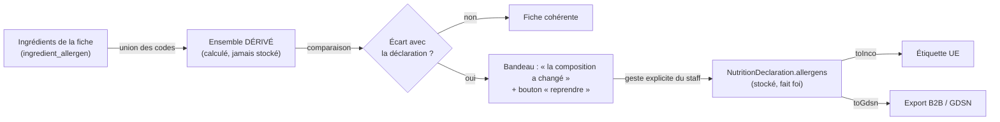

# 05 — Allergènes : d'un référentiel en dur à un référentiel administrable

> **État : doc-first.** Le § « L'existant » décrit le code d'aujourd'hui ; tout
> ce qui suit « La cible » est décidé mais **pas implémenté**. Ce document est
> le plan de la bascule, et il devient la référence du sujet — il remplit le
> renvoi pendant de [`03-nutrition.md`](03-nutrition.md).

## L'intention

Trois choses, dans cet ordre de difficulté croissante :

1. **Rendre le référentiel administrable** — pouvoir ajouter un allergène et
   une catégorie d'allergène depuis le back-office, sans déploiement.
2. **Ne rien perdre de l'officiel** — les 30 codes GS1 et les 14 catégories
   INCO existantes sont du droit, pas de la configuration. Ils survivent à la
   bascule à l'identique, et deviennent **inaltérables**.
3. **Poser les allergènes sur l'ingrédient** pour qu'un produit hérite
   automatiquement de ceux de sa composition.

## L'existant, exactement

Le référentiel vit dans trois fichiers de `src/pim/allergens/`, en dur :

| Fichier                  | Ce qu'il porte                                                                                                                                                                                                    |
| ------------------------ | ----------------------------------------------------------------------------------------------------------------------------------------------------------------------------------------------------------------- |
| `allergen-mapping.ts`    | **30 codes GS1** (T4078) → **14 catégories INCO** + 3 hors obligation UE, libellés `fr`/`en`. La provenance de chaque code est documentée en tête, avec les trois codes provisoires faux corrigés au recoupement. |
| `allergen-reference.ts`  | Le filtre de catalogue : `eu` = ce qui porte une obligation, `world` = tout.                                                                                                                                      |
| `allergen-projection.ts` | `toInco()` — **filtre**, **dédup n:1**, **localise** ; `toGdsn()` — passe-plat validant.                                                                                                                          |

Le mapping est **n:1** : blé, seigle, orge, avoine, épeautre, khorasan et
triticale retombent tous sur `gluten` ; les huit fruits à coque sur
`tree_nuts`. C'est la raison d'être du modèle — l'étiquette affiche la
catégorie, le B2B garde le détail.

Le stockage est un tableau de codes en `Json`, avec **trois états** qui ne se
confondent pas : `null` = aucune fiche, `[]` = fiche déclarée **sans**
allergène (une affirmation), une liste = les codes.

### Les quatre consommateurs — et les deux qui posent problème

Recomptés : **trois fichiers importent** `pim/allergens/`, et le quatrième
consommateur n'est pas un paquet mais le **front**, qui lit l'endpoint.

| #   | Consommateur                                                              | Ce qu'il appelle                                    | Statut après bascule          |
| --- | ------------------------------------------------------------------------- | --------------------------------------------------- | ----------------------------- |
| 1   | `pim/catalogue/shared/http/reference.controller.ts`                       | `allergenReference()`                               | ✅ se rebranche sur une query |
| 2   | le **front admin** — `reference-api.ts`, `product-form-store.ts`          | `GET /pim/reference/allergens`                      | ⚠️ problème 3                 |
| 3   | `pim/catalogue/product/domain/value-objects/nutrition-declaration.ts:107` | `findMapping()` **dans un value object de domaine** | 🔴 problème 1                 |
| 4   | `b2b/catalog/infrastructure/prisma-catalog-admin.reader.ts:101`           | `findMapping()` + `toInco()`                        | 🔴 problème 2                 |

**Problème 1 — la pureté du domaine.** `NutritionDeclaration` valide
aujourd'hui les codes par un `findMapping()` synchrone sur une constante
mémoire. Une fois le référentiel en base, le domaine ne peut plus faire ce
lookup : il ne connaît ni Prisma, ni l'`await`. C'est **la** décision centrale
de cette feature, traitée en D3.

**Problème 2 — le mur entre contextes.** Un fichier de `b2b/` importe
directement `pim/allergens/`. La matrice de `CLAUDE.md` §3 l'autorise « par
port uniquement », et surtout : le référentiel va vivre dans la **base PIM**,
qu'un backend B2B ne lit jamais. Cet import deviendrait une jointure
inter-bases déguisée. Traité en D6.

## Ce qui est permanent, et ce qui ne l'est pas

C'est le cœur de la demande, et la règle tient en une phrase : **on n'invente
pas du droit, on l'enregistre.**

|                              | Officiel (semé, verrouillé)                      | Maison (créé par le staff)          |
| ---------------------------- | ------------------------------------------------ | ----------------------------------- |
| **Catégories**               | les 14 de l'annexe II — `gluten`, `tree_nuts`, … | libres                              |
| **Entrées**                  | les 30 codes GS1 recoupés                        | libres                              |
| `code`                       | **immuable**                                     | immuable après création             |
| rattachement à une catégorie | **immuable**                                     | modifiable                          |
| libellés                     | **immuables** — ce sont les mentions légales     | modifiables                         |
| suppression                  | **interdite**                                    | interdite si citée, sinon archivage |
| `incoCategory`               | c'est ce qui les rend légales                    | **toujours `null`**                 |

Ces verrous ne sont pas seulement applicatifs : un trigger les tient **en
base**, pour qu'ils survivent à un `psql` et à une migration future — voir
« Le verrou d'immuabilité ».

La dernière ligne est une **règle de sûreté, pas une limitation** : une
catégorie maison ne doit jamais pouvoir se faire passer pour une mention
réglementaire sur une étiquette UE. Le staff peut créer « Fruits à coque
exotiques » pour organiser son catalogue ; cette catégorie n'entrera jamais
dans une projection INCO. `toInco()` ne connaît que les 14.

### La catégorie « hors obligation UE »

`official` et « porte une catégorie INCO » ne sont **pas** la même chose, et
les trois codes sans obligation UE le prouvent : `BWD` (sarrasin), `NM`
(maïs), `SO` (noix de coco) sont des codes GS1 officiels, semés et verrouillés
comme les autres — mais aucune catégorie de l'annexe II ne les accueille.

Ils sont donc rattachés à une catégorie semée, `alg_cat_non_eu`, de clé
`non_eu` et de libellé « Hors obligation UE » / « Not EU-declarable », avec
`official = true` et `inco_category = null`.

Les deux colonnes disent donc deux choses distinctes :

- `official` = **semé et verrouillé** ; le trigger s'y applique ;
- `inco_category` = **c'est une catégorie de l'annexe II** ; la projection INCO
  ne connaît que celles-là.

Ce découpage est ce qui rend D2 exprimable : le prédicat de `scope=eu` est
« la catégorie porte une `inco_category` **OU** elle n'est pas officielle », si
bien que cette catégorie-ci — officielle et sans mention INCO — est la seule
que le catalogue légal écarte, avec ses trois entrées. Exactement ce que
`incoCategory !== null` faisait avant la bascule, et sans emporter les
catégories maison avec (cf. D2).

Le libellé dit « hors obligation **UE** », pas « non réglementé » : le sarrasin
est à déclaration obligatoire au Japon et en Corée. C'est le périmètre européen
qui est en cause, pas l'innocuité.

Corollaire assumé : **l'annexe II ne s'étend pas depuis le back-office.** Le
jour où le législateur ajoute une 15ᵉ catégorie, c'est une migration semée,
pas une saisie — et c'est voulu.

## Les six décisions

### D1 — Les catégories deviennent une table, pas un enum élargi

`IncoCategory` est aujourd'hui une union TypeScript de 14 valeurs. La rendre
dynamique la ferait retomber en `string` partout, et on perdrait la sûreté de
type sur un champ réglementé.

**Décision :** deux notions distinctes plutôt qu'une notion élargie.
`IncoCategory` **reste l'union fermée de 14** dans le code — c'est du droit, il
ne bouge pas au rythme d'une saisie. La table `allergen_category` porte, elle,
**toutes** les catégories ; les 14 officielles y sont semées avec une colonne
`inco_category` renseignée (la valeur de l'union), les catégories maison avec
`inco_category = null`.

Ainsi le typage fort survit exactement là où il protège — la projection — et
l'extensibilité vit là où on la demande — l'organisation du catalogue.

### D2 — Le catalogue `eu`/`world` se dérive, il ne se stocke pas

Pas de colonne `scope` : elle pourrait diverger de la vérité qu'elle est censée
résumer. La dérivation se fait sur `inco_category`.

🔴 **Mais il y a DEUX filtres, et les confondre casse la feature.**

| La question                                                | Le périmètre                  | Fermé aux 14 ?          |
| ---------------------------------------------------------- | ----------------------------- | ----------------------- |
| « Qu'est-ce qui s'imprime comme mention de l'annexe II ? » | la projection `toInco()`      | **oui, définitivement** |
| « Qu'est-ce que le staff a le droit de cocher ? »          | le catalogue servi à la fiche | **non**                 |

Aujourd'hui les deux coïncident, parce que le référentiel est fermé. Après la
bascule, non : une entrée maison vit sous une catégorie maison, donc
`inco_category = null`. Si `scope=eu` continuait de filtrer là-dessus, elle
serait **absente du catalogue par défaut** — et le formulaire produit démarre
sur `eu` (`product-form-store.ts`, `signal<AllergenScope>('eu')`).

Le staff pourrait donc créer un allergène **sans jamais pouvoir le cocher**,
sauf à basculer sur « Monde », à côté du sarrasin. C'est-à-dire : le référentiel
devient administrable et la déclaration ne le voit pas — l'intention n°1 du
chantier, annulée par son propre filtre.

**Décision :** `scope` cesse de vouloir dire « porte une catégorie INCO » et
veut dire ce qu'il a toujours voulu dire pour l'utilisateur — **quel périmètre
réglementaire je déclare**.

- `eu` = les entrées de l'annexe II **plus toutes les entrées maison**. Un
  allergène maison est un allergène réel, il se déclare.
- `world` = tout, y compris les trois hors obligation UE.

`toInco()`, lui, ne connaît toujours que les 14 : une entrée maison est
déclarable et n'apparaîtra jamais comme une mention réglementaire. C'est
exactement la séparation que D1 protège, et elle ne demande pas que le catalogue
s'aligne sur la projection.

### D2 bis — L'archivage retire de ce qu'on PROPOSE, pas de ce qu'on RECONNAÎT

Deux questions se ressemblent et n'ont pas la même réponse. Les confondre est le
défaut le plus probable du lot 3, parce que la même méthode de port sert les
deux.

| La question                                      | La réponse               | Le chemin                      |
| ------------------------------------------------ | ------------------------ | ------------------------------ |
| « Ce code est-il valide dans une déclaration ? » | oui, **archivé compris** | `knownCodes()`                 |
| « Ce code peut-il être coché sur une fiche ? »   | non s'il est archivé     | `GET /pim/reference/allergens` |

Une déclaration enregistrée hier cite un code que le staff archive demain. La
relire ne doit pas la déclarer invalide : on invaliderait l'étiquette d'un
produit déjà servi sans que personne ne l'ait décidé. Mais la **proposer** de
nouveau à la saisie serait tout aussi faux — c'est précisément ce que
l'archivage retire.

**Donc :** `GET /pim/reference/allergens` **omet** les entrées archivées et les
catégories archivées. Le contrat de fil (`AllergenEntry` de
`@lfd/pim-contracts`) n'a d'ailleurs aucun champ pour les exprimer, et il n'en
gagne pas : une entrée archivée n'est pas une entrée dans un état particulier,
c'est une entrée qui n'est plus offerte.

⚠️ **Ne pas proposer n'est pas refuser.** `knownCodes()` acceptant les
archivés, rien n'empêche d'en déclarer un pour la **première** fois — par appel
direct, par import, par reprise. Le filtre ne vit que dans ce qu'on affiche.

Le geste juste tient en une ligne dans le handler du lot 4, et il est plus fin
qu'un refus sec : **refuser un code archivé qui n'était pas déjà dans la
déclaration précédente.** Rééditer une fiche qui le cite reste possible — sinon
changer une valeur nutritionnelle échouerait sur un code que personne n'a touché,
puisque `declare-product-nutrition` revalide la déclaration **entière** à chaque
enregistrement. Mais l'ajouter à neuf est refusé.

L'écran d'administration du référentiel, lui, doit les voir — pour les
restaurer. Il ne passe donc pas par cet endpoint mais par la lecture complète du
catalogue, `archivedAt` compris.

⚠️ Corollaire pour le port de lecture : `AllergenCategoryView` porte
`archivedAt`, au même titre que `AllergenEntryView`. Sans lui, l'écran
d'administration ne peut pas distinguer une catégorie retirée d'une catégorie
vide, et la restauration n'a pas d'objet à viser.

### D3 — Le domaine reçoit les codes valides, il ne les cherche pas

`NutritionDeclaration.create()` prend aujourd'hui les codes et les valide
seule. Après la bascule, **le handler charge l'ensemble des codes connus par un
port et le passe à la factory** :

```ts
// application/ — le handler lit le référentiel
const known = await this.catalogue.knownCodes(); // ReadonlySet<string>
// domain/ — la fabrique reste pure, synchrone, testable sans Nest
nutritionDeclaration(allergens, mayContain, values, known);
```

Le value object garde son invariant (« un code inconnu est refusé ») et reste
**pur et déterministe** — la seule chose qui change est d'où vient la liste. La
solution rejetée est le cache mémoire rafraîchi : il rendrait le domaine
dépendant d'un état global et le test non déterministe.

### D4 — L'ingrédient porte des codes GS1, pas des catégories

Un ingrédient déclare ce qu'il **est** (« contient des noisettes » → `SH`), pas
ce qu'une étiquette en dira. La projection vers la catégorie appartient à
l'affichage, exactement comme pour la déclinaison. Table de liaison
`ingredient_allergen`, pas un `Json` : ici on voudra l'index inverse (« quels
produits contiennent du gluten »).

**Le périmètre offert à l'ingrédient est `world`, jamais `eu`.** Un ingrédient
énonce un **fait** : une farine qui contient du sarrasin en contient, que
l'Europe l'exige ou non. Servir le catalogue `eu` rendrait `BWD`, `NM` et `SO`
impossibles à poser sur une matière — c'est-à-dire interdirait de consigner
précisément ce qu'on aura besoin de savoir un jour, pour un marché hors UE ou
pour un client qui demande.

Le filtre européen appartient à la **déclaration**, pas à la matière. Un code
hors obligation UE posé sur un ingrédient remonte donc dans le dérivé, entre
dans la déclaration si le staff le reprend, et `toInco` l'écarte de l'étiquette
— chaque étage fait son travail, et aucun ne décide à la place d'un autre.

### D5 — La dérivation **propose**, la déclaration **décide**

C'est la décision la plus lourde de conséquences, et elle découle d'un
invariant que tout le dépôt tient déjà : `[]` est une **affirmation**, pas un
défaut.

Si les allergènes d'un produit étaient calculés à la lecture, ajouter un
allergène à un ingrédient réécrirait silencieusement l'étiquette de tous les
produits qui le citent — y compris ceux déjà publiés, déjà imprimés, déjà
servis. Personne n'aurait pris la décision.

**Décision :** la composition produit un **ensemble dérivé**, affiché à côté de
la déclaration. La déclaration reste ce qui est stocké et ce qui fait foi. Quand
les deux divergent, la fiche le signale et propose la reprise en un geste — elle
ne l'applique pas.



Le dérivé ne peut que **proposer d'ajouter**. Il ne retire jamais : un
allergène déclaré à la main sur la fiche (contamination croisée d'atelier, par
exemple) n'est pas contredit par une composition qui l'ignore.

#### 🔴 Ce que le dérivé ne peut PAS dire — et pourquoi

`model Ingredient` porte cet avertissement, écrit avant ce chantier :

> ⚠️ Ce n'est PAS la liste réglementaire d'ingrédients (règlement UE
> 1169/2011). […] Ce référentiel-ci est une matière **éditoriale et
> commerciale** […] et **rien ici ne garantit ni l'exhaustivité ni l'ordre. Le
> jour où une mention obligatoire serait tirée d'ici, elle serait fausse.**

La dérivation tire exactement de là. Elle reste utile — proposer « noisettes »
parce que la fiche cite une praline fait gagner du temps et évite un oubli — mais
elle est une **aide de saisie, sans aucune valeur de contrôle**. Trois
conséquences, non négociables :

1. **Le silence du dérivé ne vaut rien.** La liste éditoriale cite « le beurre de
   Savoie AOP » et tait la farine : le dérivé ne proposera jamais `UW`. L'écran
   ne doit donc **jamais** afficher « rien à ajouter », « composition couverte »
   ni aucune formulation qui se lirait comme une vérification. Absence de
   proposition = absence d'information.
2. **La reprise ne fabrique pas une fiche.** Quand `allergens` vaut `null`
   (aucune fiche déclarée), le bouton de reprise est **absent** : fabriquer une
   fiche réglementaire depuis la liste éditoriale est précisément le geste que
   l'avertissement ci-dessus interdit. La fiche se crée à la main, le dérivé
   n'aide qu'ensuite.
3. **La maille diffère, et le dérivé doit le dire.** `ProductIngredient` est
   clé sur le **produit** ; `NutritionDeclaration` est portée par la
   **déclinaison**. Deux déclinaisons de recettes différentes sous un même
   produit reçoivent donc le **même** dérivé — « Tarte 6 pers » et « Tarte 6 pers
   sans gluten » comprises. Le libellé doit donc parler de la composition **du
   produit**, jamais de « ce que cette déclinaison contient ».

#### L'écart n'est pas un événement — il faut pouvoir l'écarter

Un dérivé qui propose `SO` parce qu'un ingrédient « chocolat » porte la noix de
coco, alors que la recette en utilise une version raffinée, reviendra **à chaque
ouverture, pour toujours**. Le staff apprendra à ignorer le bandeau, et le jour
où il signale un vrai écart, personne ne le lira. Un bandeau permanent est un
bandeau mort.

Il faut donc un troisième état — **écart connu et écarté** — persistant par
déclinaison et par code. Sa forme est à concevoir au lot 5 ; ce qui est décidé
ici, c'est qu'il est **obligatoire**, et que livrer le bandeau sans lui serait
livrer une alerte qu'on apprend à ne plus voir.

Corollaire de libellé : « la composition a changé » est faux au premier
affichage, où rien n'a changé et où la déclaration a simplement toujours été
plus étroite. L'écran est lu par du personnel sans le code sous les yeux
(`CLAUDE.md` §0) — le texte dit ce qui est vrai : « la composition mentionne des
allergènes que la fiche ne déclare pas ».

### D5 bis — L'écart écarté se retire côté API, et reste visible

D5 rend obligatoire un troisième état : **écart connu et écarté**. Sans lui, un
dérivé qui propose `SO` parce qu'un « chocolat » porte la noix de coco, alors
que la recette en utilise une version raffinée, revient à chaque ouverture pour
toujours — et le staff apprend à ignorer le bandeau.

**Le retrait se fait côté API.** Ce que le fil sert comme proposition est déjà
net :

    proposé = dérivé − déclaré − écarté

Si l'écran filtrait lui-même, chaque consommateur devrait reproduire la règle,
et le premier qui l'oublierait réafficherait un écart que quelqu'un avait
explicitement écarté. Une règle métier qui vit dans N écrans n'est pas une
règle.

**Mais l'écarté reste exposé**, dans son propre champ. Sinon il devient
irrattrapable : personne ne peut réintégrer ce qu'il ne voit plus. L'écran a
donc deux listes — ce qu'on lui propose, et ce qu'il a mis de côté — et la
seconde se replie par défaut.

#### Ce que ça implique, et qui n'est pas évident

- **C'est une décision, donc un fait.** « Quelqu'un a regardé cette proposition
  et a dit non » se journalise au même titre que le reste du référentiel. Une
  lacune de journal ne se rattrape pas, et « depuis quand ce produit n'annonce
  plus la noix de coco » est exactement la question qu'on posera.
- **La maille est la déclinaison**, pas le produit — comme la déclaration, et
  contrairement au dérivé. Deux recettes sous un même produit peuvent écarter
  des choses différentes.
- **Un code écarté puis déclaré à la main ne resurgit pas** : la soustraction
  le retire déjà par `− déclaré`. Rien de spécial à écrire.
- **L'écart écarté survit à la composition.** Retirer puis remettre le chocolat
  ne réveille pas la proposition : c'est la recette qui a été jugée, pas la
  liste d'ingrédients.
- **Il n'existe pas quand `allergens` vaut `null`.** Rien n'est proposé sur une
  fiche non déclarée (D5), donc rien n'est à écarter.

#### La forme

Une table de liaison additive, `variant_allergen_dismissal(variant_id,
entry_code, dismissed_at)`. Pas une colonne `jsonb` sur la déclaration : la
déclaration peut ne pas exister, et l'écart écarté doit lui survivre — c'est un
jugement sur une recette, pas un attribut d'une fiche.

### D6 — Le B2B lit un instantané, jamais le référentiel PIM

`prisma-catalog-admin.reader.ts` cesse d'importer `pim/allergens/`. Le B2B
affiche ce qu'on lui a poussé ; il ne reprojette pas une donnée réglementaire
dont il n'a plus le référentiel.

⚠️ **Ce n'est pas une lecture inter-bases.** Il n'y a qu'une base : `pim` en est
un schéma (cf. `CLAUDE.md` §1, redressé le 2026-08-31). Une telle jointure
**marcherait** — et c'est justement pour ça qu'il faut l'interdire par
discipline. La justification d'origine de cette décision (« lecture
inter-bases ») était fausse ; la décision, elle, tient.

Corollaire à ne pas se cacher : D6 est un nettoyage **sans cliquet**.
`lint:context-boundaries` autorise `b2b → pim` sans réserve, donc rien
n'empêchera le prochain import. Le resserrement de la porte est suivi dans
[`todos/todo-mur-entre-contextes.md`](../../todos/todo-mur-entre-contextes.md),
et il doit venir **après** D6, sous peine de faire rougir la CI sur du code
qu'on est en train de corriger.

Trois coûts que la première rédaction passait sous silence :

1. **La projection poussée contredit une décision écrite.**
   `packages/catalog-sync/src/snapshot.ts` justifie le champ `allergens` par
   « **des codes, jamais des libellés** : la projection […] appartient à qui
   affiche ». Le renversement est légitime — le B2B n'a plus de quoi projeter —
   mais cette phrase doit être réécrite dans le même commit, sinon deux textes
   contradictoires cohabitent sur un champ réglementé.
2. **`CATALOG_SNAPSHOT_VERSION` passe de 4 à 5.** Émetteur et récepteur vivent
   dans le même processus, donc le bump est atomique — mais il se nomme.
3. **Les `catalog_items` déjà en base ne portent que des codes.** Retirer
   `toInco` du B2B sans repush complet viderait la colonne allergènes de
   l'écran admin. La seconde source « existe déjà » était faux.

#### Comment la projection entre dans le push — la même forme que D3

`projectVariant()` est **pure et synchrone**, et doit le rester : c'est ce qui la
rend testable sans base. Elle ne va donc pas chercher le référentiel, **elle le
reçoit** — exactement comme `nutritionDeclaration` reçoit `knownCodes()` en D3.
Une seule lecture par projection, dans **`B2bCatalogFeedProjection`**, passée aux
fonctions pures.

⚠️ Pas dans `B2bCatalogPushService`, comme une première rédaction le disait :
le push ne projette pas, il délègue à `B2bCatalogFeedPreview.preview()`. Y faire
entrer le référentiel aurait demandé de changer la signature de ce port — dont
le second consommateur est `b2b/catalog/application/check-catalog-parity.service.ts`,
qui aurait alors dû se procurer le projecteur PIM. C'est-à-dire exactement ce
que D6 interdit. La lecture vit donc dans ce qui projette.

```ts
// push.service.ts — une fois par push
const inco = await this.allergens.projector(); // port de lecture PIM
// projection.ts — reste pure
projectVariant(variant, htPrice, vatRate, inco);
```

La solution rejetée est de rendre `projectVariant` asynchrone : elle perdrait la
propriété qui la rend éprouvable, pour un gain nul.

#### Le champ ajouté, et ce qu'il ne remplace pas

`SyncVariant` gagne `allergenLabels: { labels, incomplete } | null` **à côté** de
`allergens`, qui ne bouge pas — un **objet**, pas un tableau : le drapeau
d'amputation doit se poser quelque part, et une liste ne peut pas le porter.
`labels` y est le tableau des `{ category, label }`. Les codes restent le stockage canonique et les
trois états restent portés par eux ; le nouveau champ est une **commodité
d'affichage**, et il suit `null` quand `allergens` vaut `null`.

⚠️ Il ne peut pas porter l'information « la liste est amputée » : un code hors
INCO disparaît de la projection sans que le récepteur puisse le savoir. C'est le
défaut corrigé le 2026-08-31 dans `allergensOf`, et il se rejouerait ici.
`allergenLabels` porte donc **aussi** `incomplete: boolean`, calculé côté PIM
qui, lui, a le référentiel.

#### Le backfill : un push complet, pas une migration

Rien à écrire. `B2bCatalogPushService.push()` existe et republie tout le
catalogue ; le nouveau champ apparaît sur chaque `catalog_item` au premier
passage. La séquence de déploiement est donc : déployer, **puis** lancer un push
complet, **puis** seulement retirer le `toInco` du B2B — trois temps, comme
toute bascule de ce dépôt. Le geste va au runbook.

Tant que le push n'a pas tourné, l'écran admin lit `allergenLabels: null` sur les
articles anciens : il affiche « sans fiche », ce qui est faux mais **prudent** —
jamais « sans allergène ».

## Le modèle de données

```prisma
model AllergenCategory {
  id    String @id
  key   String @unique          /// « tree_nuts », « fruits-coque-exotiques »
  name  Json                    /// localisé — la mention d'étiquette si officielle
  /// La catégorie de l'annexe II, si c'en est une. `null` = catégorie maison,
  /// qui n'entre JAMAIS dans une projection INCO.
  incoCategory String? @map("inco_category")
  /// Semée par migration. Ni renommable, ni supprimable, ni détachable.
  official     Boolean @default(false)
  /// Jamais de DELETE physique : une catégorie maison retirée s'archive. Une
  /// catégorie officielle, elle, ne s'archive pas — ce serait la supprimer.
  archivedAt   DateTime? @map("archived_at")
  position     Int       @default(0)
  entries      AllergenEntry[]
  @@map("allergen_category")
  @@schema("pim")
}

model AllergenEntry {
  id         String  @id
  /// Code de stockage canonique — GS1 T4078 pour l'officiel, libre ensuite.
  code       String  @unique
  name       Json                     /// libellé granulaire, localisé
  categoryId String  @map("category_id")
  /// `Restrict` : une catégorie citée par une entrée ne s'efface pas.
  category   AllergenCategory @relation(fields: [categoryId], references: [id])
  official   Boolean @default(false)
  archivedAt DateTime? @map("archived_at")   /// jamais de DELETE physique
  ingredients IngredientAllergen[]
  @@map("allergen_entry")
  @@schema("pim")
}

model IngredientAllergen {
  ingredientId String @map("ingredient_id")
  ingredient   Ingredient    @relation(fields: [ingredientId], references: [id], onDelete: Cascade)
  entryId      String        @map("entry_id")
  /// `Restrict` : un allergène cité par un ingrédient ne s'efface pas.
  entry        AllergenEntry @relation(fields: [entryId], references: [id])
  @@id([ingredientId, entryId])
  @@map("ingredient_allergen")
  @@schema("pim")
}
```

`NutritionDeclaration.allergens` **ne change pas** : il reste un tableau de
codes en `Json`, avec ses trois états. Le référentiel devient administrable ;
la déclaration reste ce qu'elle est.

## La bascule, en trois déploiements

La base PIM porte de la donnée réelle : la migration est additive et
réversible (`CLAUDE.md` §0).

1. **Étendre** — créer les trois tables, semer les 30 entrées et les 15
   catégories avec `official = true`. Le code continue de lire la constante.
   Rien ne casse, rien ne change de comportement.
2. **Basculer** — les lectures passent sur la base (port + adaptateur), la
   constante devient le **jeu de semis** de la migration et rien d'autre. Un
   test compare la table et la constante, code par code : c'est lui qui prouve
   que le transfert est fidèle.
3. **Resserrer** — supprimer `ALLERGEN_MAPPINGS` du chemin d'exécution, ouvrir
   l'écriture au back-office.

## Ce qui garantit la présence en production

Un test d'intégrité prouve la CI, pas la prod. Quatre couches répondent, de la
plus forte à la plus faible — et la première est celle qui répond vraiment à
« les entrées et leur catégorie sont-elles là **ensemble** ».

**1. La clé étrangère rend l'orphelin impossible.** `allergen_entry.category_id`
est `NOT NULL` avec une FK `RESTRICT` : il ne peut pas exister de `SH`
(noisette) sans que `tree_nuts` existe. Ce n'est pas vérifié après coup, c'est
refusé à l'insertion. Les huit fruits à coque et leur catégorie ne peuvent pas
se séparer.

**2. Le semis vit dans le SQL de la migration.** Pas dans `prisma/seed.ts` : le
déploiement n'appelle que `prisma migrate deploy`
([`deploy_lfd_api.yml`](../../../.github/workflows/deploy_lfd_api.yml)), jamais
`db:seed`. Un semis dans le script n'atteindrait **jamais** la production.
C'est déjà le motif de la maison — huit migrations insèrent de la donnée, dont
`20260824150000_contextes_de_vente`, qui sème un référentiel de même nature.
Chaque migration jouant dans une transaction, les 15 catégories et les 30
entrées atterrissent toutes ou la migration n'est pas marquée appliquée : un
semis partiel n'est pas un état atteignable.

**3. L'API refuse de démarrer si la base est en retard** — `persistence.migrations_pending`,
déjà en place ([runbook](../../ops/runbook.md)). Une prod qui n'aurait pas reçu
le semis ne sert pas de trafic.

**4. Une sonde ops le vérifie sur la vraie base**, sur le modèle de
`ops_catalog_parity.yml` : 30 entrées et 15 catégories officielles, et chaque
entrée officielle rattachée à une catégorie officielle. C'est la seule des
quatre qui regarde la production.

Le test d'intégrité reste, en plus de tout ça : il rejoue les 30 codes et les 15
catégories contre la table semée et échoue sur le moindre écart de code, de
rattachement ou de libellé.

### Le verrou d'immuabilité — un trigger, et pourquoi

Les quatre couches ci-dessus garantissent la **cohérence**, pas la
**permanence**. Le garde-fou `official = true` vit dans l'agrégat : il arrête
l'application, pas un `DELETE` en psql ni une migration future maladroite.

Pour une donnée qui est du droit, l'invariant ne doit pas dépendre du chemin
d'écriture. Un trigger `BEFORE UPDATE OR DELETE` refuse donc, en base, toute
atteinte à une ligne officielle :

```sql
CREATE OR REPLACE FUNCTION pim.refuse_official_allergen_write() RETURNS trigger AS $$
BEGIN
  IF TG_OP = 'DELETE' THEN
    RAISE EXCEPTION 'allergène officiel : suppression refusée (%)', OLD.code
      USING ERRCODE = 'restrict_violation';
  END IF;
  IF NEW.code IS DISTINCT FROM OLD.code
     OR NEW.category_id IS DISTINCT FROM OLD.category_id
     OR NEW.name::text IS DISTINCT FROM OLD.name::text
     OR NEW.official IS DISTINCT FROM OLD.official
     OR NEW.archived_at IS DISTINCT FROM OLD.archived_at THEN
    RAISE EXCEPTION 'allergène officiel : % est réglementaire et ne se modifie pas', OLD.code
      USING ERRCODE = 'restrict_violation';
  END IF;
  RETURN NEW;
END;
$$ LANGUAGE plpgsql;

CREATE TRIGGER allergen_entry_official_lock
  BEFORE UPDATE OR DELETE ON pim.allergen_entry
  FOR EACH ROW WHEN (OLD.official)
  EXECUTE FUNCTION pim.refuse_official_allergen_write();
```

`IS DISTINCT FROM` et non `<>` : `inco_category` et `archived_at` sont
nullables, et `NULL <> valeur` vaut `NULL` — donc « pas de changement ». Avec
`<>`, le verrou aurait laissé détacher une catégorie de l'annexe II et archiver
une entrée officielle. `archived_at` est gelé parce que l'archivage **est** la
suppression dans ce dépôt : le laisser libre aurait vidé la ligne « suppression :
interdite » de son sens.

Le `WHEN (OLD.official)` est ce qui rend le verrou gratuit pour tout le reste :
une entrée maison ne déclenche rien.

Un trigger **jumeau** protège `allergen_category` : même forme, même code
d'erreur, `pim.refuse_official_allergen_category_write()` et
`allergen_category_official_lock`. Il compare `key`, `name`, `inco_category`,
`official` et `archived_at` — donc tout, **sauf `position`**, qui reste libre
même sur l'officiel : l'ordre d'affichage n'a aucune portée réglementaire, et
une catégorie qu'on ne peut pas déplacer transformerait le droit en contrainte
d'ergonomie.

⚠️ **C'est le premier trigger du dépôt.** Aucune migration n'en portait jusqu'ici.
Le coût est réel : un mécanisme de plus à connaître quand une écriture est
refusée sans que le code l'explique. Il est accepté ici parce que la donnée est
du droit et doit survivre à tous les chemins d'écriture, présents et futurs.

Corollaire à connaître **avant** d'en avoir besoin : une ligne officielle semée
à tort ne se corrige pas en place, et ne se neutralise pas non plus en la
passant `official = false` — cette colonne est gelée elle aussi. Le geste
(`DROP TRIGGER`, correction, `CREATE TRIGGER`, dans UNE migration) et l'ordre de
démontage complet sont écrits dans [le runbook](../../ops/runbook.md).

### Ce que le verrou règle en plus, et qu'on n'avait pas demandé

Une migration ne joue qu'une fois — `migrate deploy` saute celles que
`_prisma_migrations` connaît déjà. Le semis est donc un **instantané à usage
unique**, avec deux conséquences : une base neuve (clone de dev, base jetable
des e2e) obtient le semis tel qu'écrit, et une migration future qui
« corrigerait » ces lignes les écraserait.

Les deux disparaissent avec le verrou. Une ligne officielle ne pouvant jamais
être modifiée, le semis écrit et la production ne peuvent plus diverger **par
modification** — et une migration correctrice se heurte au trigger au lieu de
passer en silence.

### Les identifiants officiels sont lisibles et figés

`alg_cat_tree_nuts`, `alg_SH`. C'est la convention que
`contextes_de_vente` a posée pour un registre semé : _« Identifiants LISIBLES
et figés : c'est un registre, pas de la donnée saisie — une migration future
doit pouvoir les viser sans les chercher. »_

La règle R1 (identifiant assigné par la commande) reprend ses droits pour tout
ce que le back-office crée ensuite.

## Le front

Trois surfaces, deux existantes et une vide qui attend.

1. **`pim/product-settings/allergens-page/`** — aujourd'hui une page vide qui
   annonce précisément ce qui viendra ici. C'est la destination : liste des
   catégories et de leurs entrées, création d'une catégorie maison, création
   d'une entrée. L'officiel s'y affiche **en lecture seule et signalé comme
   tel** — pas grisé sans explication : un cadenas et la raison.
2. **`pim/provenance/ingredients-page/`** — la fiche ingrédient gagne une
   section « Allergènes », dans son panneau. Le contrôle est
   **`<fold-multiselect>`** en API `[options]` : sa valeur est un
   `readonly T[]`, le panneau **reste ouvert** entre deux clics (cocher cinq
   allergènes est une seule interaction), et il porte `role="listbox"` +
   `aria-multiselectable` sans qu'on s'en occupe.

   **Le groupement est natif** : une entrée d'`[options]` est soit une option
   simple, soit un `FoldSelectOptionGroup` étiqueté. La règle est celle que la
   fiche réglementaire applique déjà — **on groupe une catégorie qui a plus
   d'une entrée, on aplatit celle qui n'en a qu'une**. Ce n'est pas une
   préférence : les douze catégories INCO à entrée unique portent un libellé
   identique à leur entrée (« Céleri » sous « Céleri »), et un groupe d'un seul
   élément y serait une redondance visible. Sur le catalogue `world`, seules
   `gluten` (7), `tree_nuts` (8) et « hors obligation UE » (3) se groupent.

   Périmètre `world`, cf. D4.

3. **`product-form/form-sections/regulatory/`** — la fiche réglementaire gagne
   le bandeau d'écart de D5 et son bouton de reprise. ⚠️ **Et le groupement
   change** : il repose aujourd'hui sur `entry.incoLabel ?? 'Hors obligation
UE'`, donc toutes les catégories maison tomberaient dans ce seul seau, sous
   une légende qui mentirait. Le contrat de fil `AllergenEntry` doit porter la
   **catégorie** (clé + libellé), pas seulement `incoCategory`/`incoLabel` —
   c'est une extension de contrat déjà servi, donc trois déploiements.

## Le découpage

| Lot | Contenu                                                                                   | Dépend de |
| --- | ----------------------------------------------------------------------------------------- | --------- |
| 1   | Migration + semis + verrou + test d'intégrité des 30/15                                   | —         |
| 2   | Domaine : agrégats `AllergenCategory` / `AllergenEntry`, verrou `official`, ports         | 1         |
| 3   | Application + HTTP : lecture (rebranchement de `/reference/allergens`), puis écriture     | 2         |
| 4   | D3 — `NutritionDeclaration` reçoit les codes connus ; D6 — le B2B cesse d'importer le PIM | 3         |
| 5   | `ingredient_allergen` + dérivation D5 côté lecture                                        | 2         |
| 6   | Front : écran référentiel, section ingrédient, bandeau d'écart                            | 3, 5      |

Les lots 1 à 4 sont la **bascule à comportement constant** : à leur terme, rien
n'a changé pour l'utilisateur, et tout est administrable. Les lots 5 et 6 sont
la fonctionnalité neuve.

## Ce que ce plan ne fait pas

- **Filtrer le catalogue par allergène** (« tous les produits sans gluten »). La
  table de liaison le rend possible ; l'écran ne l'est pas.
- **Étendre l'annexe II.** Voir plus haut : c'est un semis, pas une saisie.
- **Traduire les libellés officiels au-delà de `fr`/`en`.** La structure
  l'accepte (`Json` localisé), le contenu n'existe pas.
- **Toucher `may_contain`.** Il suit le même référentiel et le même chemin ;
  rien de spécifique n'est à décider.
