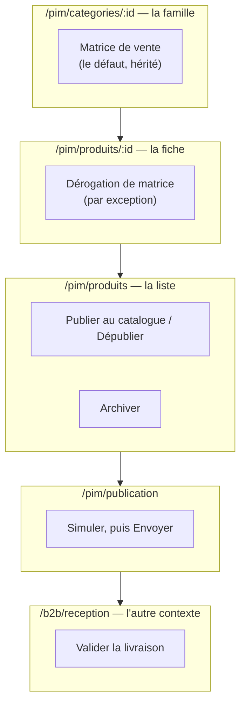
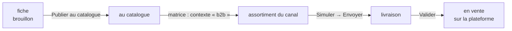

# Les écrans du cycle catalogue — ce que chaque page doit porter

**Prescriptif.** Ce document dit ce que chaque écran du cycle **doit** montrer et
offrir. Il ne décrit pas l'état du code : le descriptif est
[`cycle-catalogue-du-pim-a-la-vente.md`](cycle-catalogue-du-pim-a-la-vente.md).
Quand les deux divergent, c'est le code qu'on corrige — et le §11 tient la liste
des écarts ouverts.

Réécrit le 2026-09-02. La version précédente coupait par **atteignabilité** : la
liste des produits est le seul écran qui a toutes les fiches en ligne, donc tout
geste prenant une fiche en argument y atterrissait. Ce n'est pas une conception,
c'est une règle d'accrétion — et elle a produit un menu de ligne à sept entrées
mélangeant une décision éditoriale, une décision commerciale, un envoi vers un
système tiers et une suppression.

---

## 1. Le principe de coupe : un écran = un objet = une question

Le cycle manipule **trois objets**, et un seul écran répond à un seul d'entre eux.

| Objet                        | La question                            | Où il se règle                                                 |
| ---------------------------- | -------------------------------------- | -------------------------------------------------------------- |
| **La fiche**                 | qu'est-ce qui est vrai de ce produit ? | Produits · fiche produit                                       |
| **L'assortiment d'un canal** | à qui on le vend ?                     | la **matrice de vente** (famille, puis dérogation de la fiche) |
| **L'envoi**                  | ce qui part, ce qui est parti          | Publication · Révisions                                        |

Un écran qui répond à deux questions les mélange pour toujours : le lecteur
n'a aucun moyen de savoir laquelle il vient de trancher.

### 🔴 Et chaque geste n'a qu'UNE porte

Le 2026-09-02, la liste des produits portait trois boutons d'envoi
(`Pousser`, `Pousser la sélection`, `Tout pousser sur Shopify`) qui appelaient
`push(productIds)` — soit `dryRun = false` **et aucune empreinte**. L'écran
Publication, lui, fait `push(targets, true)` puis `push(targets, false, relu())`.

Deux portes vers le même envoi, dont une contournait **entièrement** la garde de
dérive sur laquelle tout le cycle repose. Un geste qui existe à deux endroits
n'est pas un confort : c'est une garantie qui ne tient que sur la porte que les
gens n'empruntent pas.

**Règle : un geste, un écran, un mot.** Et si un geste doit apparaître ailleurs,
il y apparaît comme un **lien vers son écran**, jamais comme un second bouton.

---

## 2. Les cinq gestes, et où chacun s'écrit



Et la chaîne que ces gestes font avancer :



Chaque flèche est un geste **de quelqu'un**. Aucune n'est automatique, et c'est
volontaire : le catalogue qui facture ne bouge pas tout seul.

---

## 3. 🔴 « Vendu aux pros » se décide dans la MATRICE, et nulle part ailleurs

C'est la correction la plus importante de cette réécriture, et elle supprime un
écran au lieu d'en ajouter un.

### La duplication

Le référentiel écrit la décision **deux fois** :

1. **La matrice de vente** — `category_channel`, dérogée par `product_channel` :
   des cellules (point de vente × contexte de vente), où `sales_context.key = 'b2b'`
   est un contexte comme les autres. Elle s'édite sur la famille et se déroge sur
   la fiche.
2. **`pim.b2b_channel_binding`** — une ligne par produit, dont la présence dit
   « vendu aux pros ».

Et la projection du canal les consulte **toutes les deux** : la liste des
candidats vient du binding
([`feed-projection.service.ts:48`](../../apps/lfd-api/src/pim/channels/b2b-platform/products/feed-projection.service.ts)),
puis chaque fiche est écartée pour `canal_ferme` si sa matrice effective ne vend
pas le contexte `b2b`
([`projection.ts:254`](../../apps/lfd-api/src/pim/channels/b2b-platform/products/projection.ts)).

**Deux portes pour une seule question.** Elles ont divergé — mesuré sur la base
de dev le 2026-09-02 :

|                                            |                                       |
| ------------------------------------------ | ------------------------------------- |
| fiches vendues en `b2b` **par la matrice** | **41**                                |
| lignes dans `b2b_channel_binding`          | **1** — et sur une fiche en brouillon |

Un facteur quarante et un, sur la seule base qu'on ait. Quelqu'un a réglé la
matrice — c'est l'écran qui existe, celui qui hérite de la famille — et le
binding est resté vide.

### Ce que la justification du modèle défend

Le JSDoc de `B2bChannelBinding` argumente ainsi : « un état de publication
(`published`) ne suffirait pas — il confondrait publié chez Shopify et vendu aux
pros ». C'est **vrai, et hors sujet** : ça défend la table contre `Product.status`,
pas contre la matrice. Or la matrice distingue déjà les deux exactement —
`sales_context.key = 'b2b'` d'un côté, `sales_context.shopify_projected` de
l'autre, et le schéma explique lui-même pourquoi les deux ne se confondent pas.

La justification est correcte contre la mauvaise alternative. C'est ainsi qu'une
table en double survit.

### La prescription

- **La décision `vendu aux pros` est une cellule de matrice**, héritée de la
  famille et dérogeable sur la fiche. Le mécanisme de dérogation existe déjà, il
  est par fiche, et il hérite — ce que le binding ne fait pas.
- **`b2b_channel_binding` cesse de porter une décision.** Il ne garde que ce que
  l'en-tête de son propre modèle annonce : un **état de synchro**
  (`last_pushed_at`), re-dérivable par un re-push. La ligne naît du push, comme
  côté Shopify.
- **Aucun écran « assortiment du canal ».** Il ferait une troisième porte pour la
  même décision.
- **Les routes de mutation `PUT /pim/channels/b2b/products/:id`** et leur
  variante en lot disparaissent avec la décision qu'elles écrivaient.

### Ce que le retrait entraîne, et que la première rédaction taisait

- 🔴 **L'ordre est imposé : le §4 d'abord.** Le §3 seul fait passer la poussée
  réelle de 1 fiche à 41 (matrice effective, `override ?? famille`) — dont 40
  sans déclaration nutritionnelle, et
  [`projection.ts:110`](../../apps/lfd-api/src/pim/channels/b2b-platform/products/projection.ts)
  n'écarte pas une déclinaison sans allergènes, elle l'envoie avec `allergens: null`.
  Le §3 avant le §4 ouvre donc exactement la fenêtre que l'invariant 7 ferme, sur
  le canal qui facture. Avec le §4 posé d'abord, le §3 fait passer 1 à 1.
- 🔴 **`candidates` doit se compter APRÈS le filtre de matrice.**
  [`push.service.ts:102`](../../apps/lfd-api/src/pim/channels/b2b-platform/products/push.service.ts)
  court-circuite sur `candidates === 0`, et ce compteur vient aujourd'hui du
  binding. Si les candidats deviennent `publishable()` avec le filtre de matrice
  laissé en aval, on obtient `candidates = 95` pour `snapshot.products = []` : le
  garde ne se déclenche pas, et le pilote `live` retire tout. Ce trou a déjà été
  ouvert une fois — l'e2e qui le ferme porte le commentaire « elle a rendu vert un
  test qui poussait un catalogue vide ».
- **`last_pushed_at` n'aurait plus personne pour l'écrire.** `stamp()` fait un
  `updateMany` (`push.service.ts:186`) : sans ligne préexistante il n'estampille
  rien. « La ligne naît du push » demande un `upsert`, et la suppression au retrait
  doit être portée par le push aussi — sinon une fiche sortie de la matrice garde
  son horodatage et la frise dira « poussée » d'un article qui vient d'être retiré.
- **`publishedAt` est un contrat déjà servi.** `B2bProductDeliveryView.publishedAt`
  est peint par la frise et tenu par un e2e nommé d'après son symptôme. Il se
  **déprécie**, il ne disparaît pas dans le même déploiement (CLAUDE.md §0).
- **La granularité passe de la fiche à la famille.** Deux lignes de
  `category_channel` gouvernent les 41 fiches : après le §3, décocher une famille
  retire un rayon entier à la poussée suivante. La contrepartie est réelle et
  c'est le meilleur argument du §3 — la matrice est **journalisée**
  (`productChannelsChanged`, `productCategoryChannelsChanged`) là où
  `membership.service.ts:71` écrit sans aucun fait.
- **Le retrait touche huit appelants**, pas un : `b2b-channel-api.ts`,
  `products-page.ts`, **`b2b-delivery.ts:201`** (le bouton de la fiche),
  deux montages e2e, `pim-wall.e2e-spec.ts` (couverture du mur pour `pim_channels`),
  plus deux registres tenus à la main — `schema-ops.counter.ts:166` et
  `pim-prisma.service.ts:65`.
- ⚠️ **Irréversible au troisième déploiement.** Supprimer la table détruit le seul
  enregistrement, par fiche, de la date d'entrée dans le canal professionnel — la
  question que le JSDoc du modèle dit qu'on pose six mois plus tard. La matrice ne
  porte qu'un `created_at` par cellule et rien ne rejoue l'historique.

⚠️ Ce retrait est une **migration de données** : la décision existante (une
ligne) doit être portée dans la matrice avant que la lecture bascule, en trois
déploiements — étendre, basculer, resserrer (`documentation/ops/pipelines.md`).

---

## 4. « Publier au catalogue » garde chez Shopify, et ne garde RIEN côté B2B

⚠️ **Ce paragraphe affirmait le contraire, et c'était faux.** Il disait « le statut
ne sert qu'à peindre une pastille » et « un brouillon part en boutique ». Un
`grep status` sur la projection Shopify le contredit
([`projection.ts:101`](../../apps/lfd-api/src/pim/channels/shopify/products/projection.ts)) :

```ts
// Un brouillon reste un brouillon : on ne met jamais en ligne par inadvertance.
status: product.status === "published" && soldOnStorefront ? "ACTIVE" : "DRAFT",
```

Une fiche en brouillon **part** vers Shopify, mais y arrive en brouillon Shopify :
elle n'est pas en vitrine. La garde existe, elle est juste **plus bas** que le
choix des candidats.

**Le défaut est donc B2B, et seulement B2B.** Sa projection ne consulte le statut
nulle part : `byIds()` ne filtre rien
([`prisma-catalogue-reader.ts:59`](../../apps/lfd-api/src/pim/catalogue/shared/infrastructure/prisma-catalogue-reader.ts)),
et rien en aval ne rattrape. Un brouillon présent dans le binding **est vendu aux
professionnels** — et c'est exactement l'unique ligne de binding de la base de
dev : `prd_gros-florentin-lait`, statut `draft`.

### La prescription, et ce qu'elle n'est PAS

> **La projection B2B écarte les fiches qui ne sont pas au catalogue**, comme la
> projection Shopify le fait déjà pour la vitrine.

**Ce n'est pas une migration de données**, et la première rédaction de ce document
en prescrivait une — « marquer l'existant, puis resserrer ». Elle n'était pas
exécutable :

`Product.publish()` refuse tant qu'une déclinaison active n'a pas de fiche
réglementaire (invariant 7,
[`product.ts:268`](../../apps/lfd-api/src/pim/catalogue/product/domain/entities/product.ts)).
Recompté sur la base de dev :

|                                              |       |
| -------------------------------------------- | ----- |
| déclinaisons actives                         | 95    |
| ...portant une déclaration nutritionnelle    | **1** |
| fiches que le domaine accepterait de publier | **1** |

« Marquer l'existant » n'avait donc que deux formes : passer par le domaine et
échouer 94 fois, ou écrire `UPDATE pim.product SET status='published'` — c'est-à-dire
court-circuiter un agrégat à invariant (CLAUDE.md §3.1) pour déclarer « au
catalogue » 94 fiches dont les allergènes ne sont pas déclarés, sur le canal qui
facture des professionnels. **On ne le fait pas.** Les 94 brouillons restent des
brouillons jusqu'à ce que quelqu'un déclare leurs allergènes — c'est ce pour quoi
l'invariant existe.

**Et `publishable()` ne se resserre pas non plus.** Il a quatre consommateurs, dont
la **source de révision**
([`prisma-catalog-revision.source.ts:33`](../../apps/lfd-api/src/pim/catalogue/revision/infrastructure/prisma-catalog-revision.source.ts)) :
le resserrer ferait passer l'ancre de 95 fiches à 1, changeant l'archive du
catalogue, la référence du diff et l'empreinte de dérive. La garde va dans la
projection du canal, pas dans le lecteur partagé.

## 5. Catalogue — l'aperçu (`/pim/catalogue`)

C'est l'accueil, et il répond à « où on en est ». **Il doit montrer la chaîne
entière**, pas une moitié.

Aujourd'hui elle est coupée en deux : cet écran compare le référentiel à la
dernière révision, et `/pim/integration` compare la dernière version au miroir
B2B. Même chaîne, deux moitiés, deux entrées de rail.

⚠️ **Fondre les deux ne veut pas dire jeter la seconde.** `/pim/integration` porte
le seul calcul qui NOMME les articles vendus que le référentiel ne publie plus
(`stale`) : il remonte ici **et** dans l'écran de publication (§8). Supprimer cet
écran en n'en gardant que « la moitié santé » emporterait la réponse à la question
que le §8 déclare sans réponse.

**Doit porter** — un nombre par flèche, et la flèche cassée en rouge :

```
fiches ─→ au catalogue ─→ dans l'assortiment ─→ dernière révision ─→ en vente
  95           0                  41                    —              92
```

- La ligne « le catalogue a bougé depuis » reste en ton **neutre** : du travail
  non poussé est l'état normal d'un catalogue vivant. La rendre alarmante la
  ferait sonner tous les jours, donc jamais.
- « Aucune révision **publiée** », pas « posée » : une simulation pose une ancre
  sans que rien ne parte.
- Deux liens, pas d'action : _Voir les révisions_, _Ouvrir les produits_.

**Ne doit pas porter** : aucun bouton qui écrit ou qui envoie.

---

## 6. Produits — la liste (`/pim/produits`)

Elle répond à **« lequel »**. Rien d'autre.

**Doit porter**

- **Le clic sur la ligne ouvre la fiche** (`clickable` + `(rowClick)` sur
  `fold-data-table`). « Ouvrir la fiche » n'est pas une action de menu : c'est ce
  qu'un tableau fait.
- **Deux actions, et deux seulement** : _Publier au catalogue_ / _Dépublier_
  selon l'état, et _Archiver_.
- Colonnes : référence, nom, famille, **Canaux** (les contextes vendus, lus dans
  la matrice effective, libellés et ordre venant du registre), statut.
- En tête de page : _Créer un produit_, et un lien _Publier vers les canaux_ vers
  `/pim/publication`.

**Ne doit pas porter**

- **Aucun envoi.** Ni unitaire, ni en lot, ni « tout pousser ».
- **Aucune colonne d'état de canal** — ni `Shopify`, ni `B2B`. Une colonne qui
  parle d'un canal dans la liste des fiches est une invitation à agir depuis là,
  et elle regagnera un bouton. La colonne `B2B` ajoutée le 2026-09-02 affichait
  de surcroît le binding **à côté** de la colonne `Canaux` qui lit la matrice :
  deux colonnes voisines qui répondaient différemment à la même question.
- **Aucune suppression.** Le back-office archive. « Supprimer » et « Archiver »
  ont coexisté en appelant la même route, l'un avec une poubelle et un ton
  danger : qui cliquait croyait avoir supprimé.

---

## 7. Fiche produit (`/pim/produits/:id`)

Elle répond à **« qu'est-ce qui est vrai de ce produit »**.

### Le rail, dans cet ordre

1. **Publication** — brouillon / au catalogue / archivée, et la validation
   (« quelqu'un affirme que ces informations sont justes »).
2. **Sur la plateforme professionnelle** — la **frise** : dans l'assortiment,
   poussée le, livraison en attente depuis, en vente. Elle **constate**.
3. **Sur la boutique en ligne** — état de synchro Shopify, même nature.

### Ce que la fiche doit refuser de laisser croire

- Le **handle** est dérivé du nom, à la création **et à chaque renommage**
  (`Product.rename()` re-dérive le slug). Il n'est pas « attribué à la première
  poussée ». ⚠️ Renommer une fiche déjà poussée **déplace son URL publique**, et
  l'historique Shopify — unique par `(handle, version)` — repart à v1. La fiche
  doit le dire au moment du renommage, pas dans une note.
- La plateforme B2B **n'a aucun champ de saisie propre** : elle lit le nom, le
  prix et les allergènes du référentiel. Sa seule propriété par fiche est sa
  place dans la matrice — qui se règle dans la section **Canaux**, pas ici.
- « Poussée, mais la plateforme ne l'a pas » est presque toujours une **exclusion
  à la projection**, pas une panne. Le message doit nommer les trois causes
  réelles : prix, taux de TVA professionnel, matrice de vente.

### La section Canaux (matrice)

C'est **l'unique endroit où se décide à qui on vend**. Elle montre l'héritage de
la famille et permet d'y déroger, cellule par cellule. Un contexte ajouté à
l'écran des contextes y apparaît sans toucher au code.

---

## 8. Publication (`/pim/publication`)

Elle répond à **« qu'est-ce qui part »**. C'est le seul écran qui envoie.

**Doit porter, pour chaque canal**

- Deux gestes nommés pareil partout : **Simuler**, puis **Envoyer**. Envoyer est
  refusé tant qu'on n'a pas simulé, et n'envoie que ce que la simulation a rendu
  (l'empreinte relue voyage avec l'envoi).
- **Ce qui part**, ligne à ligne — et surtout **ce qui ne part pas** : les
  écartés, avec leur cause.
- 🔴 **Ce que l'envoi va RETIRER, SKU par SKU.** La simulation laisse
  `removedSkus` vide — elle seule supposerait de connaître l'état d'en face.
  ⚠️ Ce document a d'abord écrit « aucun écran ne le montre » : **c'est faux**.
  `GET /b2b/admin/catalog/parity` rend `stale` — « dans le miroir, plus publiés »
  ([`catalog-parity.ts`](../../packages/contracts/src/catalog-parity.ts)) — calculé
  à partir du **même** `B2bCatalogFeedPreview` que le push, et `/pim/integration`
  l'affiche aujourd'hui. La prescription n'est donc pas d'inventer le calcul mais
  de l'amener **là où on appuie sur Envoyer**, avec les SKU nommés plutôt que deux
  compteurs.
  ⚠️ Deux surfaces d'autorisation : le push est `@AdminSurface("pim_channels")`, la
  parité `@AdminSurface("b2b_catalog")`. Un refus ne doit pas être avalé en
  `catch {}` comme aujourd'hui (`b2b-integration.ts:142`) — l'écran le plus
  dangereux du cycle afficherait « rien en vente » sans dire pourquoi.
- Les **collections de taxe** avant le tableau des produits : une fiche ne peut
  pas se rattacher à une collection qui n'existe pas encore.

**Ne doit pas porter** : aucune édition du catalogue. La source reste le
référentiel. Et aucune mention d'une planification — il n'y a **pas** de
programmation, tous les workflows d'ops sont en `workflow_dispatch`.

Le mot **approuver** est banni de cet écran : il faisait un quatrième nom pour un
geste qui s'appelle _Simuler_ puis _Envoyer_.

---

## 9. Réception (`/b2b/reception`) — l'autre contexte

Elle répond à **« est-ce que j'accepte ce qu'on m'envoie »**, et elle reste côté
B2B : autre lecteur, autre question, autre bounded context.

**Doit porter** : l'écart de la livraison en attente (entrants, sortants,
modifiés), la possibilité d'**écarter des SKU** avant d'accepter, et la date
depuis laquelle elle attend. Tant que personne ne l'a validée, **rien de ce qui a
été poussé n'est en vente** — et la frise de la fiche doit le dire aussi.

---

## 10. Le rail qui en découle

| Section                 | Entrées                                                                |
| ----------------------- | ---------------------------------------------------------------------- |
| **Catalogue**           | Vue d'ensemble · Produits · Catégories · Révisions                     |
| **Diffusion**           | Publication · Collections                                              |
| **Paramétrage produit** | Ingrédients · Appellations · Allergènes · Conditionnements             |
| **Général**             | Taux de TVA · Règles comptables · Points de vente · Contextes de vente |

**Intégrations** disparaît : sa moitié « santé » remonte dans la Vue d'ensemble,
qui portait déjà l'autre moitié. **Collections** reste, comme ressource du canal
Shopify.

---

## 11. Récapitulatif des écarts ouverts

| №   | Écart                                                                                                                                         | Écran                                 | Gravité |
| --- | --------------------------------------------------------------------------------------------------------------------------------------------- | ------------------------------------- | ------- |
| 1   | La décision « vendu aux pros » est écrite deux fois (matrice **et** binding), et les deux ont divergé — 41 contre 1                           | modèle + `/pim/produits`              | 🔴      |
| 2   | La projection B2B ne consulte le statut nulle part : un brouillon est vendu aux professionnels (Shopify, lui, garde déjà)                     | modèle                                | 🔴      |
| 3   | La simulation ne NOMME pas ce que l'envoi va retirer là où on appuie sur Envoyer — le calcul existe, il est sur un autre écran                | `/pim/publication`                    | 🔴      |
| 4   | La colonne `B2B`, les actions _Vendre sur / Retirer_ de la liste **et le bouton de la fiche** (`b2b-delivery.ts:201`) partent avec le binding | `/pim/produits` · `/pim/produits/:id` | 🟠      |
| 5   | Le clic sur la ligne n'ouvre pas la fiche ; « Ouvrir la fiche » est une entrée de menu                                                        | `/pim/produits`                       | 🟠      |
| 6   | La chaîne est coupée entre la Vue d'ensemble et Intégrations                                                                                  | `/pim/catalogue`                      | 🟠      |
| 7   | La colonne `sync` (Shopify) tombe sous la même règle que la colonne `B2B`                                                                     | `/pim/produits`                       | 🟠      |
| 8   | Renommer une fiche déjà poussée déplace son URL publique sans avertir                                                                         | `/pim/produits/:id`                   | 🟠      |
| 9   | 94 fiches sur 95 sont impubliables (invariant 7 : allergènes non déclarés) — ce n'est pas un défaut d'écran, c'est du travail de saisie       | référentiel                           | 🟡      |
| 10  | L'aperçu de push ne montre pas le contenu, donc un refus pour dérive ne se diagnostique pas                                                   | `/pim/publication`                    | 🟡      |

---

## 12. Ce que ce document a affirmé de faux

Écrit le 2026-09-02, contredit le jour même. Gardé ici parce qu'une erreur
retirée sans trace se refait.

| Affirmation                                                                            | Ce que le code dit                                                                                                                               |
| -------------------------------------------------------------------------------------- | ------------------------------------------------------------------------------------------------------------------------------------------------ |
| « Le statut ne sert qu'à peindre une pastille » · « un brouillon part en boutique »    | Faux pour Shopify : `projection.ts:101` pose `DRAFT` si la fiche n'est pas `published`. Le défaut est **B2B seulement**                          |
| « Marquer l'existant, puis resserrer »                                                 | Non exécutable : `Product.publish()` refuse 94 fiches sur 95 (invariant 7). La seule forme restante était un `UPDATE` court-circuitant l'agrégat |
| « Aucun écran ne montre ce que l'envoi va retirer »                                    | `GET /b2b/admin/catalog/parity` rend `stale`, affiché par `/pim/integration` — que le §5 proposait de supprimer                                  |
| « Les deux canaux partent de `publishable()` » (comme si ça n'avait que deux lecteurs) | Quatre lecteurs, dont la **source de révision** : resserrer `publishable()` ferait passer l'ancre de 95 fiches à 1                               |

## Ce qui n'est PAS vérifié

- **Les comptes de production.** Tous les chiffres de ce document viennent de
  `lfc_b2b_dev`. Le nombre de lignes de `b2b_channel_binding` en production — la
  seule qui dimensionne la migration du §3 — est inconnu.
- **La base de dev n'est pas cohérente avec elle-même** : 92 articles en vente
  pour **zéro** publication enregistrée. Le « 91 retirés » mesure donc une
  divergence de semis, pas une dérive du même mécanisme.
- **`B2B_DELIVERY_INBOX` en production.** Le défaut du code est `false` — un push
  applique et retire immédiatement. Si le drapeau est ouvert, la poussée dépose
  une livraison à valider et le §9 sert de garde, ce qui adoucirait le §8 sans
  l'annuler.

---

## Références

- [`cycle-catalogue-du-pim-a-la-vente.md`](cycle-catalogue-du-pim-a-la-vente.md) — comment le code marche aujourd'hui
- [`../ops/pipelines.md`](../ops/pipelines.md) — étendre → basculer → resserrer
- [`../langue-du-code.md`](../langue-du-code.md) — le lexique
