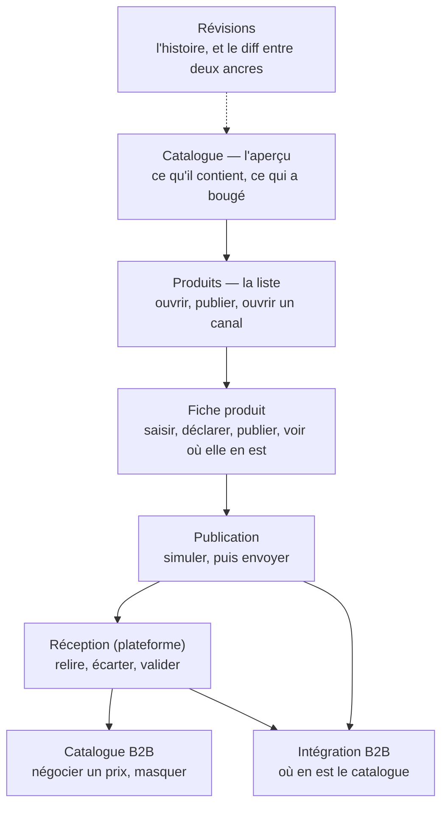

# Les écrans du cycle catalogue — ce que chaque page doit porter

> **Ce que ce document est.** Une **prescription**, pas une description : ce que
> chaque écran doit montrer et offrir pour que le cycle décrit dans
> [`cycle-catalogue-du-pim-a-la-vente.md`](cycle-catalogue-du-pim-a-la-vente.md)
> soit tenable par une personne, sans qu'elle ait à connaître le code.
>
> L'écart avec l'existant est **marqué à chaque ligne** :
> ✅ en place · ⚠️ présent mais faux ou incomplet · ❌ absent.
>
> Il est né d'un tour du front (2026-09-02) qui a trouvé huit écarts, dont un
> geste **manquant** sans lequel le cycle ne peut pas démarrer.

---

## 1. Le principe : un geste, un écran, un mot

Le cycle a **cinq gestes**, et rien de plus. Chacun doit avoir **un** endroit où
on le fait et **un** nom, partout le même.

| Le geste                 | Ce qu'il change                          | Le mot, et lui seul       |
| ------------------------ | ---------------------------------------- | ------------------------- |
| Mettre la fiche en ligne | `Product.status` → `published`           | **Publier au catalogue**  |
| Ouvrir un canal          | l'appartenance de la fiche à ce canal    | **Vendre sur …**          |
| Envoyer                  | projette et livre au canal               | **Simuler** / **Envoyer** |
| Accepter                 | promeut ce qui a été livré, côté vendeur | **Valider**               |
| Sortir du catalogue      | `Product.status` → `archived`            | **Archiver**              |

🔴 **Aucun synonyme.** « Mettre en vente », « approuver », « supprimer »,
« pousser » et « publier » ont tous désigné au moins deux de ces gestes selon
l'écran. Un vocabulaire à cinq mots pour cinq gestes est la seule chose qui rende
l'enchaînement lisible — et c'est ce qui a le plus manqué.

⚠️ **« Publier au catalogue » ne met rien en vente**, et l'écran doit le dire là
où on appuie. Une fiche en ligne, jamais poussée, n'est vendue nulle part.

### 🔴 Et chaque geste n'a qu'UNE porte

Les quatre premiers sont des **décisions sur une fiche** : ils vivent là où on
regarde les fiches — la liste et la fiche elle-même. **Envoyer n'en est pas
une** : c'est un acte qui part vers un système tiers, qui se **relit avant** de
partir, et qui n'a qu'un seul écran — Publication.

La liste produits a longtemps porté « Pousser », « Pousser la sélection » et
« Tout pousser sur Shopify ». Ce n'était pas seulement une confusion de place :
ces trois-là appelaient l'envoi **en réel, sans empreinte** — `dryRun` à faux,
aucun haché relu. Il existait donc deux portes vers le même envoi, et celle-ci
**contournait entièrement la garde de dérive** que le cycle repose sur elle.
Retirées le 2026-09-02 ; la liste renvoie vers Publication.

⚠️ **L'asymétrie entre les deux canaux est réelle, et il faut la dire.** La
boutique B2B a une **appartenance décidée** (`b2b_channel_binding`) : on choisit
d'y vendre une fiche. Shopify n'en a pas — son binding **naît du push**
(`push.service.ts`, les deux seuls `upsert`), donc tout ce qui est publiable y
part. Il n'y a donc pas d'action « Vendre sur Shopify », et son absence n'est pas
un oubli.

---

## 2. Le parcours, écran par écran

---

## 3. Catalogue — l'aperçu (`/pim/catalogue`)

**La question** : « où en est mon catalogue, avant que je fasse quoi que ce soit ? »

| Doit montrer                                                           | État |
| ---------------------------------------------------------------------- | ---- |
| Fiches, en ligne, brouillons, articles, validées                       | ✅   |
| La dernière ancre **publiée**, et ce qui a bougé depuis                | ✅   |
| Le fait que rien n'a jamais été publié, distinct de « rien n'a bougé » | ✅   |

| Doit offrir         | État |
| ------------------- | ---- |
| Aller aux produits  | ✅   |
| Aller aux révisions | ✅   |

⚠️ **Ce qui a bougé depuis se rend en NEUTRE**, jamais en avertissement. Du
travail non poussé est l'état normal d'un catalogue vivant ; le rendre alarmant
fait sonner l'écran tous les jours, donc jamais.

---

## 4. Produits — la liste (`/pim/produits`)

**La question** : « qu'est-ce que j'ai, et où chaque fiche en est-elle ? »

| Doit montrer                                            | État | Note                                        |
| ------------------------------------------------------- | ---- | ------------------------------------------- |
| Référence, nom, famille                                 | ✅   |                                             |
| **État** de la fiche, en français, une couleur par état | ✅   | un brouillon n'est pas vert                 |
| **Contextes de vente** (« Canaux »)                     | ✅   | la matrice — où la fiche se vend            |
| **Shopify** — l'état de synchronisation                 | ✅   |                                             |
| **Boutique B2B** — l'état de diffusion                  | ✅   | `hors canal` · `jamais poussée` · `poussée` |

✅ **Posée le 2026-09-02.** Deux canaux, deux colonnes : celui qui **facture**
n'en avait aucune.

⚠️ **Trois états, et pas quatre.** L'acceptation par la plateforme demande un
appel **par fiche** — le port de retour —, donc elle vit sur la frise (§5).
Annoncer « en vente » dans un tableau sans l'avoir vérifié serait dire ce qu'on
ne sait pas ; la colonne s'arrête à ce que l'appartenance et la date de push
établissent.

⚠️ Et elle ne se confond pas avec « Canaux » : la matrice dit **où la fiche se
vend**, l'appartenance dit **si le canal l'emporte**. La projection exige les
deux, et l'écran doit les distinguer parce que régler l'une sans l'autre ne
produit rien.

| Doit offrir                                         | État      | Note                                               |
| --------------------------------------------------- | --------- | -------------------------------------------------- |
| Ouvrir la fiche                                     | ✅        |                                                    |
| **Publier au catalogue** / **Dépublier**            | ✅        | selon l'état                                       |
| **Archiver** — et rien qui lui ressemble            | ✅        | « Supprimer » a été retiré : deux items, un effet  |
| **Vendre sur la boutique B2B** (unitaire et en lot) | ✅        | et **Retirer**, symétrique                         |
| Un renvoi vers **Publication**                      | ✅        | l'envoi n'a qu'une porte, et ce n'est pas celle-ci |
| ~~Pousser, unitaire ou en lot~~                     | ✅ retiré | envoyait en réel, sans relecture ni empreinte      |

---

## 5. Fiche produit (`/pim/produits/:id`)

**La question** : « cette fiche est-elle juste, et où est-elle rendue ? »

### Ce que le rail doit porter, dans cet ordre

| Bloc                         | Ce qu'il dit                                  | État |
| ---------------------------- | --------------------------------------------- | ---- |
| Sections modifiées           | ce qui reste à enregistrer                    | ✅   |
| Complétude                   | ce que la fiche PORTE — jamais si c'est juste | ✅   |
| Publiable                    | la signature humaine, et sa péremption        | ✅   |
| **Publication au catalogue** | le statut, et **que publier n'envoie rien**   | ✅   |
| **Sur la plateforme pro**    | la frise : décision → envoi → acceptation     | ✅   |

✅ **La frise offre le geste qu'elle décrit** (2026-09-02). Elle affichait
« Pas vendue aux professionnels » sans aucun moyen d'y remédier : une frise qui
constate sans permettre d'agir apprend à être ignorée.

### Ce que la fiche doit refuser de laisser croire

- **Le slug n'est pas figé** : il se dérive du nom, à la création **et à chaque
  renommage**. Trois textes affirmaient le contraire — corrigés le 2026-09-02. ✅
- **Renommer déplace le handle Shopify**, donc l'URL publique et l'historique des
  poussées. Si le produit veut que ce soit interdit, c'est une règle de domaine à
  poser ; tant qu'elle n'existe pas, l'écran doit **avertir** au renommage d'une
  fiche déjà poussée. ❌

### La section « Intégrations »

| Doit montrer                                            | État              |
| ------------------------------------------------------- | ----------------- |
| Shopify : le handle, l'état, ce qui partirait           | ⚠️ le handle seul |
| Boutique B2B : l'appartenance au canal, et où la régler | ✅                |

⚠️ Elle affirmait que la plateforme B2B « n'a pas de champ propre ». C'était
faux — son appartenance au canal **est** une propriété par fiche —, et cette
phrase est précisément ce qui rendait le réglage manquant invisible. Le geste vit
dans le rail, collé à la frise qui en montre l'effet ; la section y renvoie
plutôt que d'offrir une seconde bascule.

---

## 6. Publication (`/pim/publication`)

**La question** : « qu'est-ce qui partirait, et est-ce bien ce que j'ai relu ? »

| Doit montrer                                              | État |
| --------------------------------------------------------- | ---- |
| Le mode — simulation ou envoi réel, rappelé à chaque fois | ✅   |
| Le nombre de candidats, et le rapport de la destination   | ✅   |
| Les **écartés**, avec leur motif nommé                    | ✅   |
| Ce qui partirait, **article par article**                 | ❌   |

| Doit offrir                         | État | Note                                                          |
| ----------------------------------- | ---- | ------------------------------------------------------------- |
| **Simuler**                         | ✅   |                                                               |
| **Envoyer**, armé par la simulation | ✅   | et désarmé par un refus de dérive                             |
| Rien de « programmé »               | ✅   | il n'existe aucune planification — la page l'annonçait à tort |

🔴 **Le contenu manquant a un coût précis.** Le refus de dérive dit « simulez à
nouveau » et ne peut pas dire ce qui a bougé : l'empreinte couvre toute la
projection, l'écran n'affiche que des compteurs. Tant qu'il ne montre pas le
contenu, la boucle de sortie enseigne « re-simuler puis renvoyer » — le geste
même qui vide la garde de son sens.

C'est le seul manque de cet écran dont la réparation est **une tranche**, pas un
libellé (cf. le §10 du document du cycle).

---

## 7. Réception (`/b2b/reception`)

**La question** : « qu'est-ce que le référentiel m'a livré, et qu'est-ce que
j'accepte ? »

| Doit montrer                                                  | État |
| ------------------------------------------------------------- | ---- |
| Ce que l'arrivée change, **par SKU**, champs nommés           | ✅   |
| Que **rien n'est en vente** tant qu'on n'a pas validé         | ✅   |
| Une **seule** alarme : une déclaration d'allergènes qui bouge | ✅   |
| Un vide **serein** quand rien n'attend                        | ✅   |

| Doit offrir                                                       | État |
| ----------------------------------------------------------------- | ---- |
| Écarter un SKU, avec un libellé qui change de sens sur un retrait | ✅   |
| **Valider** en une fois, en disant combien passent                | ✅   |

⚠️ **Ce que cet écran n'offre pas, et qui n'est pas décidé** : les lignes
suspectes — prix sous plancher, variation anormale, premier prix jamais servi —
devraient arriver **écartées par défaut**, pour que le geste de vérification ne
porte que là où il y a quelque chose à regarder. Rien n'en est écrit.

---

## 8. Intégration B2B (`/pim/integration`) — la santé

**La question** : « quelque chose a-t-il bougé qu'aucun geste n'explique ? »

| Doit montrer                                                            | État |
| ----------------------------------------------------------------------- | ---- |
| **Trois lignes**, dont **une seule** alarmante                          | ✅   |
| Le travail non poussé — neutre                                          | ✅   |
| L'arrivée en attente — neutre                                           | ✅   |
| Le décrochage du miroir — **alarme**                                    | ✅   |
| Le fait qu'aucune version n'a été validée, distinct de « tout va bien » | ✅   |

| Doit offrir                                          | État |
| ---------------------------------------------------- | ---- |
| Relire les trois lignes                              | ✅   |
| **À la demande** : ce qui partirait au prochain push | ✅   |

🔴 **L'aperçu ne se charge pas à l'ouverture**, et c'est structurel : son écart
est légitime en permanence, donc l'afficher d'office referait l'écran qu'on
n'ouvre plus.

---

## 9. Le geste qui manque — ouvrir le canal B2B

C'est le seul manque qui **empêche un usage**, et non celui qui trompe.

**Le fait** : `B2bCatalogFeedProjection` démarre sur
`membership.publishedProductIds()` — la table `b2b_channel_binding`. Une fiche
qui n'y est pas n'est **jamais** candidate au push.

**Le trou** : aucun écran n'écrit cette table. Les routes existent
(`PUT /pim/channels/b2b/products/:id` et sa version en lot) ; le front ne les
appelle nulle part. Une fiche neuve ne peut donc atteindre la boutique
professionnelle **que par un appel API**.

**Ce que ça doit devenir**, et à trois endroits qui se répondent :

| Écran          | Ce qu'il ajoute                                                                                         |
| -------------- | ------------------------------------------------------------------------------------------------------- |
| Liste produits | une **colonne** « Boutique B2B », et l'action **Vendre sur la B2B** — unitaire et en lot, comme Shopify |
| Fiche produit  | dans « Intégrations », la bascule et son état                                                           |
| Frise du rail  | quand elle dit « pas vendue aux professionnels », le geste est **là**                                   |

⚠️ Et le libellé ne doit pas dire « publier » : il y a déjà deux gestes de ce
nom. **« Vendre sur la boutique B2B »** dit ce qui se passe — le canal
l'emportera au prochain envoi.

---

## 10. Récapitulatif des écarts

| #   | L'écart                                                         | Écran                | Nature        |
| --- | --------------------------------------------------------------- | -------------------- | ------------- |
| 1   | ~~Pas de colonne « Boutique B2B »~~                             | liste produits       | ✅ posée      |
| 2   | ~~Pas de geste pour ouvrir le canal B2B~~                       | liste + fiche        | ✅ posé       |
| 3   | ~~« La plateforme B2B n'a pas de champ propre »~~               | fiche · intégrations | ✅ corrigé    |
| 4   | ~~Le slug annoncé figé, et né de la publication~~               | fiche · store        | ✅ corrigé    |
| 5   | Renommer déplace le handle Shopify, sans avertissement          | fiche                | ❌ manque     |
| 6   | Le push ne montre pas le contenu, donc le refus n'explique rien | publication          | ⚠️ tranche    |
| 7   | Les lignes suspectes ne s'écartent pas d'elles-mêmes            | réception            | ❌ non décidé |
| 8   | Le bouton « Publier au catalogue » n'est pas désarmé            | fiche · rail         | ⚠️ décision   |

**Corrigés le 2026-09-02, pour mémoire** : « Supprimer » qui archivait, le taux
« à emporter » qui ne débloquait rien, « aucune révision posée » devenu faux avec
la référence publiée, « à l'heure programmée » qui n'existe pas, et le ton
d'alarme sur du travail en cours.

---

## Références

[`cycle-catalogue-du-pim-a-la-vente.md`](cycle-catalogue-du-pim-a-la-vente.md) —
ce que le code fait, et pourquoi.
[`audit-fiche-produit-2026-09-01.md`](audit-fiche-produit-2026-09-01.md) — les
quatre notions d'état de la fiche, et les six décisions qui restent.
