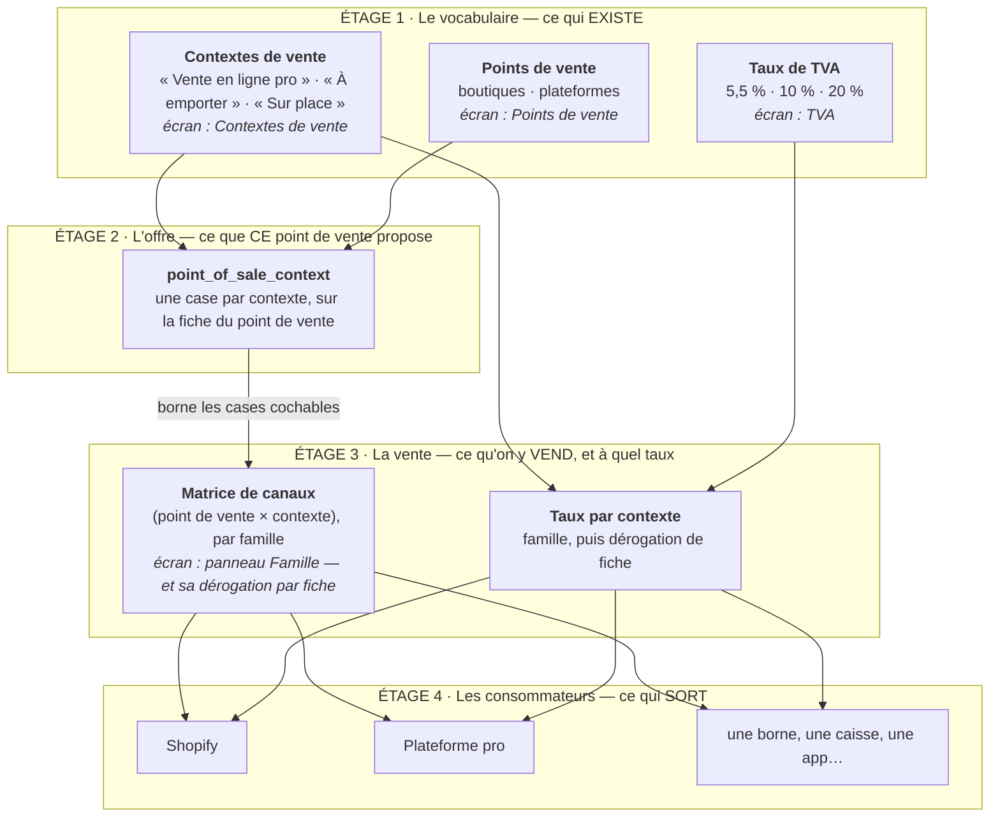

# Les écrans du référentiel, étage par étage

> **État réel** au 2026-08-26, après les quatre tranches du point de vente
> ([`point-de-vente.md`](./point-de-vente.md)). Il répond à une question posée
> en clair : _« à quoi sert ce qu'on a fait, et comment on évolue ? »_

## 1. Le schéma en étages

Chaque étage a **un écran propriétaire**. Un étage ne sait rien de celui du
dessus ; il ne fait que borner ce qu'il peut contenir.



**La règle de lecture** : chaque flèche est une clé étrangère ou un refus
explicite, jamais un `if` sur un nom. Le code ne connaît aucune des valeurs de
l'étage 1.

## 2. À quoi sert un contexte de vente

**Une manière de vendre qui a son propre traitement de TVA** — et qui, pour
cette raison, entraîne sa propre tranche de catalogue et sa propre projection.

L'ordre compte, c'est lui qui rend le modèle non arbitraire :

1. **La TVA d'abord.** Le même croissant est à 5,5 % à emporter et à 10 % sur
   place. C'est la loi, pas une décision produit.
2. **La tranche de catalogue ensuite**, par conséquence : on ne peut pas taxer ce
   qu'on ne vend pas là.
3. **La projection en dernier** : Shopify en fait un produit ou non
   (`shopify_projected`), la plateforme pro a son propre projecteur.

Le découpage du catalogue est donc une **conséquence**, pas le but. Deux manières
de vendre qui partagent le taux ET le prix n'ont pas besoin d'être deux
contextes.

## 3. Comment on évolue — trois coûts, à connaître d'avance

| Étage de changement | Exemple                                                         | Coût                                  |
| ------------------- | --------------------------------------------------------------- | ------------------------------------- |
| **Donnée**          | un contexte, un point de vente, des cases, des taux, un libellé | une ligne, **zéro déploiement**       |
| **Consommateur**    | l'app borne, un nouveau projecteur                              | du code, mais **hors du référentiel** |
| **Relation**        | prix par contexte, stock par point de vente                     | code **+ migration** du référentiel   |

### Le cas concret : ajouter une borne

**Sans rien déployer :**

```
1 ligne  → contexte « borne » (libellé, position, en service)
N cases  → chaque point de vente déclare s'il l'offre
N cases  → chaque famille coche (point de vente × borne)
N taux   → le taux de « borne », par famille puis par fiche
```

La matrice, l'écran des contextes, le calcul du TTC, le compte d'usages et les
murs de suppression suivent seuls.

**Ce qui reste du code, et il faut le dire :** la borne elle-même. Un écran, un
flux de commande, un paiement, une imprimante. Le référentiel dit **quoi
afficher** et **à quel taux** ; il ne fabrique pas de consommateur. La borne est
une app qui interroge le catalogue avec `context=borne`.

C'est la bonne frontière : **l'étendue** est de la donnée, les **consommateurs**
sont du code. Une borne est un logiciel, pas une ligne.

### Ce qui n'est PAS de la donnée aujourd'hui

Le **prix est canonique par variante** : le TTC se déduit du taux du contexte,
mais le HT est le même partout. Le jour où la borne doit vendre plus cher qu'au
comptoir, ce n'est pas une ligne — c'est une relation nouvelle, donc une
migration. (La plateforme pro a déjà sa tarification à part, par un autre
chemin.)

## 4. Clé et libellé — pourquoi les deux existent

|                | Clé (identité) | Libellé (ce qu'on lit) |
| -------------- | -------------- | ---------------------- |
| Contexte       | `b2b`          | **Vente en ligne pro** |
| Point de vente | `pos_b2b`      | **Plateforme pro**     |

`takeaway` et `eatIn` nomment une **manière** de vendre ; `b2b` nommait une
**audience** — le mouton noir. Et le contexte comme le point de vente
s'appelaient « B2B » sur deux écrans voisins, alors que l'un dit _comment_ on
vend et l'autre _d'où_.

Les **libellés** ont changé ; les **clés** ne bougent pas. Une clé est citée par
trois clés étrangères et par le projecteur de la plateforme : la renommer est une
migration de données. Un libellé se change **à l'écran**, sans rien livrer.

⚠️ Sur une base déjà semée, les libellés de semis ne s'appliquent pas :
`ensureRootContext` et `ensureRootPointOfSale` ne repoussent rien, parce que la
racine est ineffaçable **et non immuable**. Renommer l'existant est un geste
d'écran.

## 5. Les murs, et lequel garde quoi

Un modèle piloté par la donnée n'est sûr que si chaque étage refuse ce que
l'étage du dessus ne peut pas honorer.

| Le geste                                          | Ce qui refuse                                      | Où                        |
| ------------------------------------------------- | -------------------------------------------------- | ------------------------- |
| Vendre un contexte non offert ici                 | `ContextNotOfferedError`                           | lecture, avant l'écriture |
| Vendre depuis un point de vente inexistant        | `UnknownPointOfSaleError`                          | lecture, avant l'écriture |
| Cesser d'offrir un contexte encore vendu ici      | `ContextStillSoldHereError`                        | lecture, avant l'écriture |
| Supprimer un point de vente encore vendu          | clé étrangère `Restrict` → `PointOfSaleInUseError` | **la base**               |
| Supprimer un contexte encore offert ou vendu      | clé étrangère `Restrict`                           | **la base**               |
| Supprimer la plateforme racine                    | `RootPointOfSaleProtectedError`                    | domaine                   |
| Équiper une plateforme d'une adresse ou de tables | `PlatformHasNoEquipmentError` + `CHECK` en base    | domaine **et** base       |

Les trois premiers sont des **lectures** et non des clés étrangères, et c'est
assumé : l'offre et la matrice sont deux tables sans lien direct. Le troisième a
été ajouté après coup — sans lui, la ligne de matrice survivait à l'offre, et
l'écran ne rendait même plus la case qui aurait permis de la décocher.

## 6. Ce que chaque écran possède

| Écran                   | Étage | Ce qu'on y fait                                                                |
| ----------------------- | ----- | ------------------------------------------------------------------------------ |
| **Contextes de vente**  | 1     | ouvrir, régler, mettre hors service un contexte ; la racine ne s'efface pas    |
| **Points de vente**     | 1 + 2 | ouvrir une boutique ou une plateforme, cocher ce qu'elle offre, équiper les QR |
| **TVA**                 | 1     | le référentiel des taux                                                        |
| **Familles** (panneau)  | 3     | la matrice (point de vente × contexte) et les taux par contexte                |
| **Fiche produit**       | 3     | la dérogation — même grille, même sémantique                                   |
| **Publication Shopify** | 4     | ce que la projection produit                                                   |
