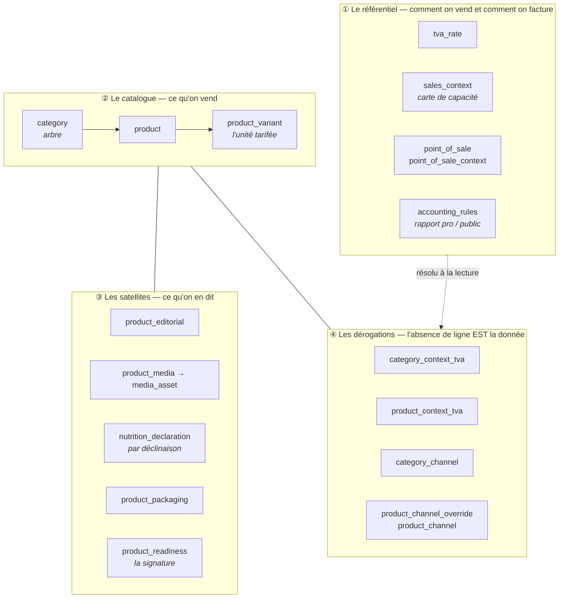
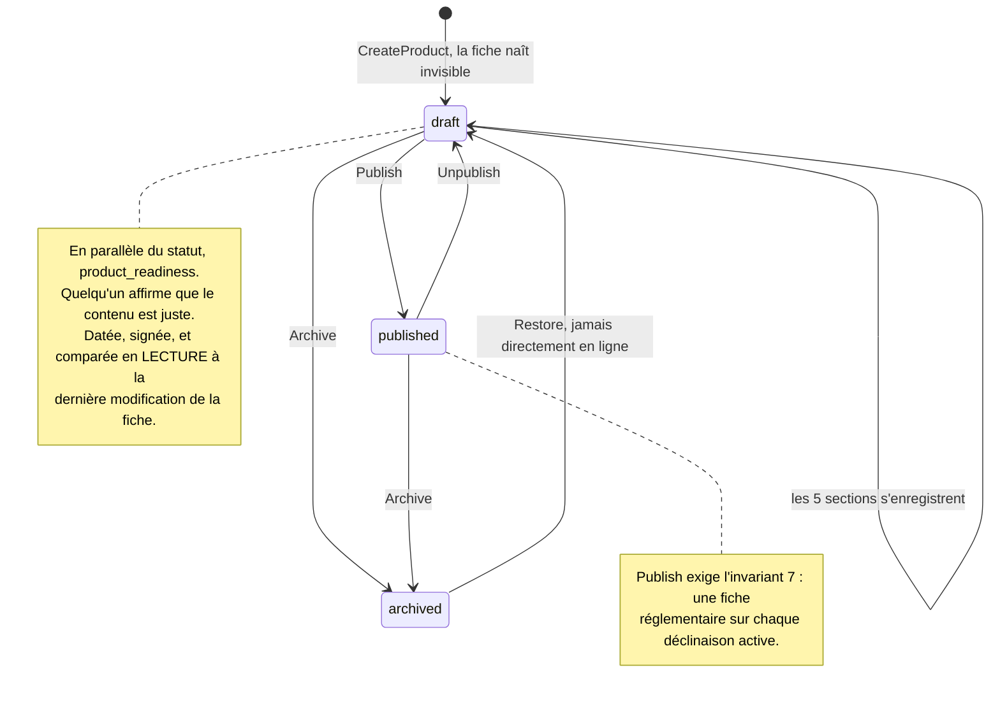
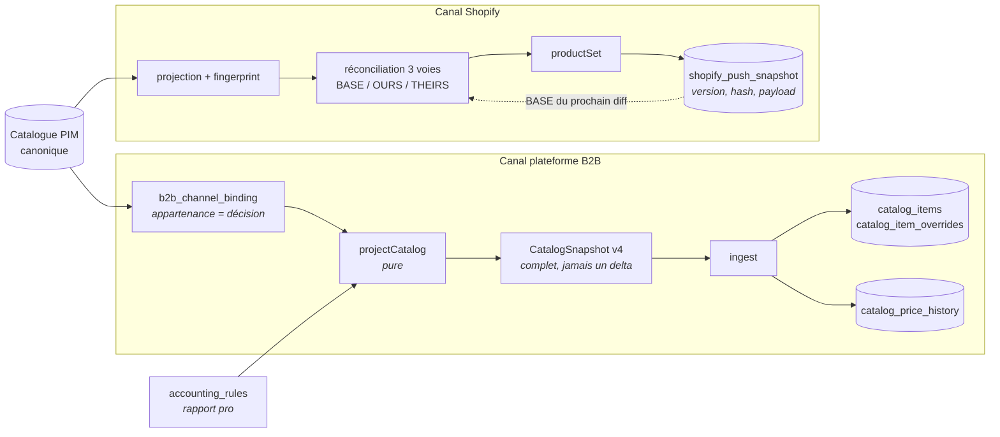
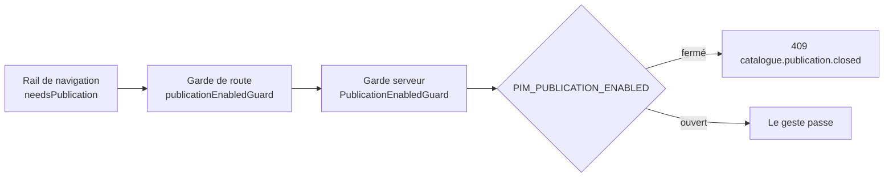

# Le flux du catalogue PIM — et ce qu'il versionne

> **État : constat** (2026-08-31). Cette page décrit ce qui EXISTE, pièce par
> pièce, puis ce qui manque pour deux besoins nommés : **montrer un diff** et
> **poser des points d'ancrage de publication**. Elle ne décide rien — les
> options sont posées au § 6 avec une recommandation et une question ouverte.
>
> Voisins : [`contextes-et-points-de-vente.md`](contextes-et-points-de-vente.md)
> (où vit le taux) · [`architecture-prix-ancre-ttc.md`](architecture-prix-ancre-ttc.md)
> (comment se fabrique un prix) · [`journalisation-et-tracabilite.md`](journalisation-et-tracabilite.md)
> (l'anatomie d'une trace) · [`publication-reconciliation-3way.md`](publication-reconciliation-3way.md)
> (la réconciliation Shopify, qui est déjà la moitié de la réponse).

---

## 1. Les quatre couches

Le catalogue n'est pas une table de produits. C'est **quatre couches** qui n'ont
ni le même rythme de vie ni le même propriétaire, et les confondre est ce qui
rend un versionnement impossible à définir.



**Ce que la couche ④ garantit, et qui structure tout le reste** : une clé absente
signifie « hérite ». Il n'y a donc pas d'état « à moitié dérogé » à versionner —
une matrice se redéfinit en tout-ou-rien, un taux ligne par ligne.

## 2. La saisie — cinq sections, cinq gestes

La fiche produit s'enregistre **par section**, pas par champ ni d'un bloc. Chaque
section a sa route et son fait de journal.

| Section (écran)        | Route                                      | Fait tracé                                      |
| ---------------------- | ------------------------------------------ | ----------------------------------------------- |
| Identité               | `PUT /pim/catalogue/products/:id/identity` | `product.identity_saved`                        |
| Tarif & TVA            | `PUT …/variants/:vid/pricing` · `…/vat`    | `product.pricing_saved` · `product.vat_changed` |
| Allergènes & nutrition | `PUT …/variants/:vid/nutrition`            | `product.declaration_saved`                     |
| Communication          | `PUT …/:id/editorial`                      | `product.editorial_saved`                       |
| Visuels                | `PUT …/:id/media`                          | `product.media_saved`                           |
| Diffusion par canal    | `PUT …/:id/channels`                       | `product.channels_changed`                      |

Le découpage n'est pas cosmétique : il permet à une section d'échouer seule, et
c'est lui qui donne au journal des faits **de la taille d'une décision** plutôt
que d'un caractère.

## 3. Le cycle de vie d'une fiche



**Deux axes, pas un.** Le statut dit ce que le catalogue FAIT de la fiche ; la
signature dit ce qu'une PERSONNE affirme de son contenu. Une fiche signée reste
un brouillon — mettre en vente est un second geste. La signature ne se périme
pas en écriture : `readyAt` se compare au `max(updated_at)` de `product`,
`product_variant`, `product_editorial`, `product_media`.

## 4. La descente vers les canaux



**Ce que la projection B2B fabrique** — et c'est la chaîne entière du prix :

```
prix public TTC (product_variant.price_cents)
  × rapport pro        → prix pro TTC, arrondi au centime
  ÷ (1 + taux du canal) → hors taxe en millicentimes
```

Le rapport est une **précondition** : sans lui, le push est refusé plutôt
qu'émis au plein tarif. Un snapshot vide serait ingéré et viderait la boutique.

## 5. Ce qui est versionné aujourd'hui — l'inventaire honnête

| Ce qui est gardé                | Où                             | Forme                                                                    | Permet de…                                            |
| ------------------------------- | ------------------------------ | ------------------------------------------------------------------------ | ----------------------------------------------------- |
| **Le payload poussé à Shopify** | `pim.shopify_push_snapshot`    | version monotone par `handle`, `hash`, payload **rejouable**             | rejouer, comparer, revenir en arrière — **par canal** |
| **Le tarif canonique B2B**      | `public.catalog_price_history` | append-only, à chaque changement du couple (prix, taux)                  | relire un prix ET son taux à une date                 |
| **Les faits**                   | `growth.activity_events`       | type, acteur, `occurred_at`, payload contenant un **diff champ à champ** | dire qui a changé quoi, quand                         |

Trois choses, trois portées, et une seule d'entre elles est un vrai point
d'ancrage — celle de Shopify.

### Ce que le journal ne peut PAS faire

Il ne reconstruit pas un état. Deux raisons, et la seconde est définitive :

1. il stocke un **diff**, pas un avant/après complet ;
2. `changesBetween` **abrège les textes à 120 caractères** — une histoire produit
   de trois paragraphes n'y est pas, par conception (« on veut savoir QUE le
   texte a changé, pas le relire ici »).

Rejouer le journal pour obtenir le catalogue du 12 mars est donc hors de portée
sans en changer la nature. C'est une trace, pas un event store.

### Ce qui manque, dit simplement

- **Aucune ancre du catalogue lui-même.** Shopify sait dire « voici la version 7
  de ce produit chez moi » ; le PIM ne sait pas dire « voici le catalogue au
  moment où je l'ai publié ».
- **Pas de diff entre deux publications**, donc — il n'y a rien à soustraire.
- **Les satellites ne sont pas datés uniformément.** `product_media` vient de
  gagner son `updated_at` (pour la signature) ; `product_packaging` n'en a pas.

## 6. Les trois façons d'ancrer — et laquelle je recommande

### A · Généraliser l'ancre par canal

Un `catalog_push_snapshot` sur le modèle exact de `shopify_push_snapshot`, pour
chaque canal.

- ✅ Motif déjà éprouvé, coût faible, et le diff est **honnête sur ce que le
  canal a reçu**.
- ❌ Il est en forme de canal, pas de catalogue. Une fiche modifiée mais non
  poussée n'apparaît nulle part, et deux canaux donnent deux vérités.

### B · Une révision du catalogue canonique

`catalog_revision` (version, hash, `taken_at`, `taken_by`, libellé) +
`catalog_revision_item` (le payload figé par produit). Un point d'ancrage
**indépendant des canaux** : « le catalogue de la rentrée », qu'on nomme.

- ✅ Une seule vérité, diffable contre n'importe quelle autre révision. C'est ce
  que « point d'ancrage de publication » veut dire.
- ✅ Elle **compose** avec A plutôt que de le remplacer : un push enregistre
  quelle révision il a envoyée. On répond alors à deux questions distinctes —
  _ce que la maison a décidé_ (révision → révision) et _ce qu'un canal porte_
  (révision → boutique, ce que la réconciliation 3 voies fait déjà).
- ❌ C'est une copie du catalogue à chaque ancre. Le coût dépend entièrement de
  la question ouverte ci-dessous.

### C · Reconstruire depuis le journal

- ❌ **Impossible en l'état** (§ 5). Le rendre possible, c'est passer le PIM en
  event sourcing complet — un chantier d'un autre ordre, pour un besoin que B
  couvre sans y toucher.

### Ma recommandation : **B**, en réutilisant deux pièces qui existent

- le **hash** se calcule comme `fingerprint` de la projection Shopify ; c'est lui
  qui rend le « rien n'a changé » gratuit ;
- le **diff** s'affiche avec `FieldDiffView`, déjà écrit pour la réconciliation.

## 7. La question qu'il faut trancher avant d'écrire une ligne

**Qu'est-ce qui entre dans une révision ?**

Elle décide du coût de stockage, mais surtout de **ce qu'un diff saura montrer** :

| Périmètre                                                                                  | Le diff montre                                 | Le diff ne montre pas                          |
| ------------------------------------------------------------------------------------------ | ---------------------------------------------- | ---------------------------------------------- |
| **Le vendable** — ce que les projections lisent (identité, prix, taux, canaux, allergènes) | ce qui change une facture ou une mise en rayon | une description réécrite, une photo remplacée  |
| **La fiche entière** — éditorial et visuels compris                                        | tout                                           | — (mais chaque ancre pèse le catalogue entier) |

~~**Tranché le 2026-08-31 : le vendable seulement.**~~ **Repris le même jour —
voir le § 9.** Le critère était mauvais.

## 8. Ce que « le vendable » contient — et le piège du rapport

La décision laisse une question qu'il vaut mieux poser maintenant : capture-t-on
l'état **canonique** (les lignes telles qu'elles sont écrites) ou l'état
**résolu** (ce qu'un canal recevrait) ?

Le canonique seul a un trou, et il est large. Le prix professionnel se dérive du
prix public par `accounting_rules.ratio_bp` — une ligne **globale**. Le jour où
la remise passe de 10 % à 12 %, aucune ligne de produit ne bouge, et un diff
canonique dirait donc **« rien n'a changé »** alors que toutes les factures
professionnelles viennent de changer. Le même raisonnement vaut pour un taux de
TVA révisé sur une famille : une ligne change, cent articles sont refacturés.

Une révision porte donc **deux étages** :

| Étage        | Contenu                                                                                                                                     | Pourquoi                                    |
| ------------ | ------------------------------------------------------------------------------------------------------------------------------------------- | ------------------------------------------- |
| **En-tête**  | le rapport pro, les taux par contexte en vigueur                                                                                            | ce qui change tout sans que rien ne bouge   |
| **Articles** | par déclinaison vendable : sku, sku produit, nom, famille, prix public TTC, poids, allergènes, canaux effectifs, taux effectif par contexte | ce qu'on vend, résolu — héritages appliqués |

Les **héritages sont résolus** à la capture. Garder « ce produit hérite de sa
famille » obligerait un diff à rejouer la résolution pour comprendre qu'un taux
de famille a bougé — et à la rejouer avec le code d'aujourd'hui, sur des données
d'hier. Une ancre doit être lisible sans son moteur.

Les deux étages restent vrais quel que soit le périmètre — c'est le § 9 qui dit
ce qu'un article contient.

## 9. Reprise : le bon critère n'est pas « ce qui change une facture »

**« Le vendable » répondait à la mauvaise question.** Il désignait ce qui change
une facture — le critère d'une ancre de TARIF. Une ancre de PUBLICATION répond à
autre chose : **ce qu'un canal doit recevoir pour être autosuffisant.**

Et le B2B doit l'être : sa boutique sert ses propres pages, elle ne rappelle pas
le PIM pour afficher un produit. Aujourd'hui elle affiche des bannières **codées
en dur** dans `legacy/` et son modèle de rangée n'a même pas de champ
description — le fil n'en transporte aucune. C'est un placeholder, pas une
décision. Le jour où on le comble, descriptions et visuels passent sur le fil ;
une ancre qui les ignorerait ne pourrait pas dire ce qui a été publié.

### Ce qui rend le périmètre complet abordable

Deux choses, et la première vient de l'observation qui a rouvert le sujet.

**Les médias sont dans un bucket.** Une révision porte l'**URL** et l'identifiant
de l'asset, jamais les octets. Et elle ne ment pas en le faisant : `MediaAsset`
est un agrégat à cycle propre (`id`, `url`, `storage_key`) — remplacer un visuel
crée un nouvel asset, il ne s'écrase pas en place. Le poids d'une révision est
donc du **texte**.

**Les articles sont adressés par leur contenu.** Un `catalog_revision_item`
référence un hash de payload plutôt que de recopier le payload. Deux révisions
qui partagent quatre-vingt-dix articles inchangés partagent quatre-vingt-dix
lignes — une ancre posée sur un catalogue stable ne coûte presque rien, et le
diff se calcule en comparant des hashs avant de lire quoi que ce soit. C'est le
mécanisme de git, pour la même raison.

### Ce qui reste dehors, et pourquoi

- **Les octets des visuels** — bucket, adressés par URL (ci-dessus).
- **`product_readiness`** — une signature _sur_ la fiche, pas un morceau de la
  fiche. Elle dit qui a validé, pas ce qui est publié.
- **Les liaisons de synchronisation** (`shopify_product_binding`, gids,
  `sku_registry`) — de l'état de transport, re-dérivable, sans valeur historique.

⚠️ **Ce que cette reprise coûte** : une révision devient une copie du catalogue
éditorial, pas un extrait tarifaire. Sans l'adressage par contenu, ce serait
trop cher pour être posé souvent — c'est lui qui rend la décision tenable, et
c'est donc lui qui doit être livré dans la première tranche, pas dans une
optimisation ultérieure.

## 10. Ce que la tranche 1 a posé

**Livrée le 2026-08-31.** `POST /pim/catalogue/revisions` pose une ancre.

- **Trois tables.** `catalog_content` (le magasin adressé par empreinte),
  `catalog_revision` (l'ancre : version monotone, libellé, empreinte, en-tête),
  `catalog_revision_item` (l'appartenance, qui porte la clé et non le contenu).
  La clé étrangère du contenu est `RESTRICT`, pas `CASCADE` : un contenu partagé
  ne disparaît pas parce qu'une révision le lâche.
- **Une empreinte canonique.** SHA-256 d'un JSON aux clés triées à tous les
  étages — l'ordre des clés d'un objet JavaScript suit l'insertion, et sans
  forme canonique il suffirait qu'un champ change de place dans un `map` pour
  que tout le catalogue paraisse modifié. Les tableaux, eux, gardent leur ordre :
  il porte du sens.
- **Les articles triés par SKU** avant de calculer l'empreinte de la révision.
  L'ordre de lecture de la base n'est pas garanti stable ; sans ce tri, deux
  captures d'un catalogue identique donneraient deux empreintes.
- **Une frontière JSON vérifiée** (`toJsonObject`). Le magasin étant adressé par
  contenu, ce qui est stocké doit être exactement ce qui a été haché : une
  `Date`, un `NaN` ou une fonction que `JSON.stringify` déforme en silence
  romprait ce lien. La vérification refuse plutôt que de laisser passer.
- **Une capture identique ne pose rien.** L'empreinte est comparée à celle de la
  dernière ancre ; égales, on rend l'existante avec `created: false`. Un libellé
  différent ne suffit pas — nommer autrement un catalogue identique ne le rend
  pas différent.
- **Un port de lecture à part** (`CatalogRevisionSource`). `CatalogueReader`
  répond aux questions des canaux et ne charge aucun éditorial ; les fondre
  aurait obligé tous ses appelants à porter ce que la révision seule lit.

Mesuré par un e2e : deux révisions séparées par un seul changement de prix
partagent tous leurs autres contenus, et un changement du **seul** rapport pro
pose bien une ancre sans écrire un contenu de plus.

## 11. Ce que la tranche 2 a posé — le diff

**Livrée le 2026-08-31.** `GET /pim/catalogue/revisions` liste les ancres,
`GET /pim/catalogue/revisions/:from/diff/:to` dit ce qui a changé entre deux.

### La lecture est paresseuse, et c'est tout l'intérêt du magasin

```
1. lire les deux INDEX      → une empreinte par SKU, aucun payload
2. planifier                → ajoutés / retirés / modifiés
3. lire les payloads        → des seuls SKU modifiés, des deux côtés
```

Sur mille articles dont trois ont bougé, six payloads sont lus. Sans le magasin
adressé par contenu, il aurait fallu relire deux catalogues entiers pour en
comparer trois lignes.

### Ce que le diff montre, et ce qu'il ne descend pas

Le détail d'un article s'arrête au **premier niveau** : un champ imbriqué qui
bouge — une description en italien, l'alternative d'un visuel — rend une ligne
pour le champ entier, sérialisé, avec ses deux états. Descendre plus bas
demanderait de décider ce qu'est « la même » entrée dans deux tableaux : un
visuel déplacé est-il modifié ou remplacé ? La question n'a pas de réponse
universelle, et montrer les deux états est honnête là où trancher serait
arbitraire.

Les chaînes sortent **telles quelles**, sans guillemets : un nom de produit dans
la colonne « avant » d'un tableau ne doit pas se lire avec du bruit autour.

### Deux points de conception

- **`FieldDiffView` est réutilisé** depuis la réconciliation Shopify plutôt que
  redéclaré. Un champ qui bouge se rend de la même façon, qu'il ait bougé entre
  deux révisions ou entre nous et une boutique — et deux déclarations du même
  ensemble finissent par diverger, ce qui est déjà arrivé sur les motifs
  d'exclusion B2B.
- **L'ordre demandé fait foi.** Demander `2/diff/1` échange « ajouté » et
  « retiré » au lieu de normaliser : on regarde parfois en arrière, et corriger
  silencieusement l'ordre priverait de ce regard.

## 12. Ce que la tranche 3 a posé — l'écran

**Livrée le 2026-08-31.** `/pim/revisions` : poser une ancre, la nommer, lire ce
qui a changé entre deux.

- **Trois cartes, trois gestes** : poser, comparer, relire l'historique. Les
  fondre en une seule mêlerait une écriture et deux lectures dans le même bloc.
- **Les deux bornes se posent d'elles-mêmes** sur les deux plus récentes, dans
  le bon sens (de l'avant-dernière à la dernière). C'est la comparaison qu'on
  vient chercher neuf fois sur dix ; l'imposer à la main serait un péage.
- **« Rien n'a été posé » est un message**, pas un silence. Le serveur rend
  `created: false` sur un catalogue inchangé, et l'écran le dit — annoncer
  « posée » ferait croire à une version de plus.
- **L'en-tête du diff vient en PREMIER.** Il porte le rapport professionnel, qui
  bouge sans qu'aucun article ne change : plus bas, il se manquerait sur un diff
  long, alors que c'est le seul changement qui touche toutes les factures d'un
  coup.
- **Trois natures, trois blocs** — entré, retiré, modifié. Une liste unique
  obligerait le lecteur à trier lui-même deux questions qui ne se posent pas
  ensemble : « qu'est-ce qu'on vend en plus » n'est pas « qu'est-ce qui a changé
  de prix ».

Le détail d'un article s'arrête au premier niveau (cf. § 11), et une ancre sans
nom se dit « sans nom » : un blanc se lirait comme un défaut d'affichage.

## 13. L'attribution par ligne, et les causes globales

**Livrée le 2026-08-31.** Chaque ligne d'un diff dit qui l'a écrite.

Une révision sait qui l'a **posée** ; elle ne sait pas qui a écrit chacune de
ses lignes. Cette réponse vit dans le journal, fait par fait : pour chaque
article modifié, on relit les faits de son produit sur l'intervalle des deux
ancres, du plus récent au plus ancien, et le premier qui touche un champ est
celui qui l'a fait.

### Le pont entre deux vocabulaires, et ce qui le tient

La table qui relie un fait aux champs qu'il touche est une **troisième
déclaration** du même ensemble, après le payload d'une révision et celui d'un
fait. C'est exactement la forme de dérive qui a déjà coûté deux fois ici
(`B2bExclusionReason`, `readLocalizedColumn`).

Elle est donc tenue par un test qui parcourt `PIM_EVENTS` : **un fait de produit
ajouté sans correspondance fait échouer la suite.** Sans ça, un événement neuf
n'attribuerait plus rien — et « rien » se lit exactement comme « personne n'y a
touché ».

Deux choses y sont écrites plutôt que devinées : les faits de section disent
EUX-MÊMES quels champs ils ont changés (on lit leur `changes` au lieu de le
recopier), et une déclaration de publiabilité n'attribue **aucun** champ — elle
affirme quelque chose sur la fiche, elle ne la modifie pas.

### Les méta-actions

Changer un taux de TVA dans le paramétrage est **un** fait, sur **un** sujet, qui
altère le taux de tous les articles qui s'en servent. Aucun de ces articles n'a
de fait à lui : l'attribution par sujet ne trouve rien, et l'écran répétait
« auteur non défini par une action locale » autant de fois qu'il y avait
d'articles, pour une décision prise une fois.

Les **causes globales** sont ces faits-là, relus une fois pour tout le diff et
posés au-dessus de lui, avec leur **portée telle que le fait l'a enregistrée**
(`blast`) — relue, jamais recalculée : recompter aujourd'hui donnerait la portée
d'aujourd'hui, pas celle du jour de la décision.

⚠️ **Une cause n'est PAS une attribution.** `attributed` reste faux : le fait a
PU produire la ligne, il ne la revendique pas. Le présenter comme un auteur
ferait porter à quelqu'un un changement qu'il n'a peut-être pas provoqué — deux
taux modifiés dans le même intervalle, et l'écran désignerait le mauvais.

D'où trois états, et le troisième dit **pourquoi** il ne sait pas :

| État                                               | Ce que l'écran dit                                                                |
| -------------------------------------------------- | --------------------------------------------------------------------------------- |
| Un fait du produit revendique la ligne             | `Hugo Heynard le 31/08 15:40`                                                     |
| Aucun, mais un réglage a pu la produire            | `auteur non défini par une action locale` + `suite à : Intermédiaire : 10 → 10.1` |
| Ni l'un ni l'autre (script, seed, verbe non tracé) | `auteur non défini par une action locale`                                         |

« Auteur inconnu » disait le contraire de ce qu'on veut : il laissait croire que
l'information manque, alors qu'elle est ailleurs et nommée.

### Un défaut trouvé par ce chantier

L'article d'une ancre portait le nom de la **déclinaison** et pas celui du
produit : renommer un produit ne changeait donc aucune empreinte, et l'ancre ne
voyait pas le renommage. L'article porte désormais `name` (le produit, comme le
journal et comme `SyncProduct`) et `variantName`.

## 14. Le renversement : une révision est le sous-produit d'une publication

**Repris le 2026-08-31.** Les tranches 1 à 3 posaient une ancre par un BOUTON.
C'était le mauvais déclencheur : une ancre qu'il faut penser à poser est une
ancre qu'on oublie, et une ancre oubliée ne vaut rien.

Le geste qui doit la poser est celui qui a déjà lieu — la **publication** :

```
preview  →  FIGER la révision  →  envoyer  →  inscrire (canal, mode, issue, rapport)
```

Trois conséquences, et aucune n'était visible depuis le monde du bouton :

- **L'ordre compte.** Figer APRÈS l'envoi enregistrerait un catalogue qui a pu
  bouger entre la requête et la réponse : l'ancre ne dirait plus ce qui est
  parti.
- **L'échec s'inscrit aussi.** Une trace qui n'existe qu'en cas de succès ne
  raconte que les bons jours — et c'est le mauvais jour qu'on vient relire.
- **La garde « capture identique ne pose rien » gagne son utilité.** Deux envois
  d'un catalogue inchangé sont deux PUBLICATIONS d'UNE révision, ce qu'ils sont.
  Sans elle, chaque push aurait créé une ancre jumelle.

Une révision **sans aucune publication** devient un état lisible : préparée,
jamais envoyée. C'est ce que le bouton produit désormais — renommé « Préparer une
publication », il sert à figer AVANT une modification risquée, sans rien
envoyer.

> 🔴 **Ce dernier paragraphe est périmé depuis le 2026-09-01 : le bouton est
> retiré.** Le §14 lui avait ôté son rôle de déclencheur en lui gardant celui de
> point de reprise ; ce reste-là ne survit pas.
> [`conception-stage-evaluer-pousser.md`](conception-stage-evaluer-pousser.md)
> §4.1 bis montre pourquoi : `latest()` rend la dernière ancre **posée**, sans
> regarder si elle a été publiée. Une ancre manuelle devient donc la référence de
> tous les diffs — « N changements depuis la dernière révision » se calcule
> contre une version qu'aucun canal n'a reçue, et rien à l'écran ne l'en
> distingue.
>
> Le besoin qu'il servait — un point de reprise avant une grosse manœuvre — est
> tranché au §11.11 du même document : c'est une **sauvegarde**
> ([`ops/runbook.md`](../ops/runbook.md)), pas un bouton. Le reste du §14 tient :
> l'ancre naît d'une publication, l'ordre compte, l'échec s'inscrit.
>
> ⚠️ La section « Préparer une publication » vit encore dans le front
> (`revisions-page.html:16`). Elle part avec la tranche correspondante.

`catalog_revision_publication` porte la destination, le mode (`live` /
`dry-run` — une simulation se trace aussi, sinon on ne distingue pas « jamais
tenté » de « tenté à blanc »), l'issue et le rapport de la destination, tel
qu'elle l'a rendu.

## 15. La page Catalogue

**Livrée le 2026-08-31**, en accueil du référentiel (`/pim/catalogue`).

La réponse à « où en est le catalogue » existait, éclatée sur trois écrans : la
liste des produits disait les statuts, la publication disait les canaux, les
révisions disaient l'histoire. Personne ne la tenait — et c'est pourtant la
première question qu'on se pose en ouvrant le PIM. La liste des produits était
l'accueil par défaut faute de mieux : elle répond à « lequel », pas à « où on en
est ».

Elle se calcule **comme une capture qu'on ne pose pas** : on construit la
révision du catalogue tel qu'il est et on la compare à la dernière ancre. C'est
la même mécanique que le push, donc aucun écart possible entre ce que l'écran
annonce et ce qui partirait.

Ce qu'elle ne dit PAS, délibérément : ce qui manque à une fiche pour être
publiable. Cette règle vit sur la fiche, et l'agréger ici en ferait une seconde
déclaration — la dérive qui a déjà coûté trois fois dans ce dépôt.

## 16. Le drapeau de publication — fermer ce qui sort, garder ce qui saisit

Un déploiement peut vouloir **saisir** le catalogue sans le **publier**. C'est
le cas du premier : on remplit les fiches en production avant qu'aucune boutique
n'attende quoi que ce soit.

`PIM_PUBLICATION_ENABLED` ouvre les gestes qui envoient le catalogue dehors, et
il est **fermé par défaut**. Le sens du défaut est le sujet : l'extérieur ne se
rattrape pas. Un déploiement qui a oublié de se prononcer ne doit pas publier —
il doit se taire.

### Ce qu'il ferme, et ce qu'il ne ferme pas

| Fermé                                             | Ouvert                            |
| ------------------------------------------------- | --------------------------------- |
| `POST /pim/channels/shopify/products/push`        | Créer, éditer, traduire une fiche |
| `POST /pim/channels/shopify/products/rollback`    | Déclarer une fiche publiable      |
| `POST /pim/channels/b2b/push`                     | La mettre en vente au référentiel |
| `POST /pim/catalogue/revisions` (poser une ancre) | **Lire** et comparer les ancres   |

L'ancre est fermée parce qu'elle n'existe que pour précéder un envoi : un
catalogue qu'on ne publie pas n'a rien à photographier. Leur **lecture** reste
ouverte — un historique n'est pas une publication.

### Trois couches, et une seule est un mur



Les deux premières évitent d'offrir un bouton qui répondrait `409` ; la
troisième est le mur. Sans elle, une requête recopiée depuis l'onglet réseau
publierait quand même.

### Ce n'est pas un droit

`needs` demande à la **personne**, `needsPublication` demande à
l'**installation**. D'où un refus métier (`409`) et non un `403` : un `403`
ferait chercher une permission manquante là où il n'en manque aucune, et
laisserait un administrateur croire qu'il peut rouvrir un écran qui n'a rien
derrière lui.

### L'ouvrir

Une Variable Cloudflare `PIM_PUBLICATION_ENABLED=true` sur le Worker de l'API —
elle est déjà dans la boucle de déploiement, donc aucun code à toucher. En
développement et dans les suites de test, elle est ouverte : ce qu'on mesure est
le produit entier, pas la moitié qui reste allumée.
