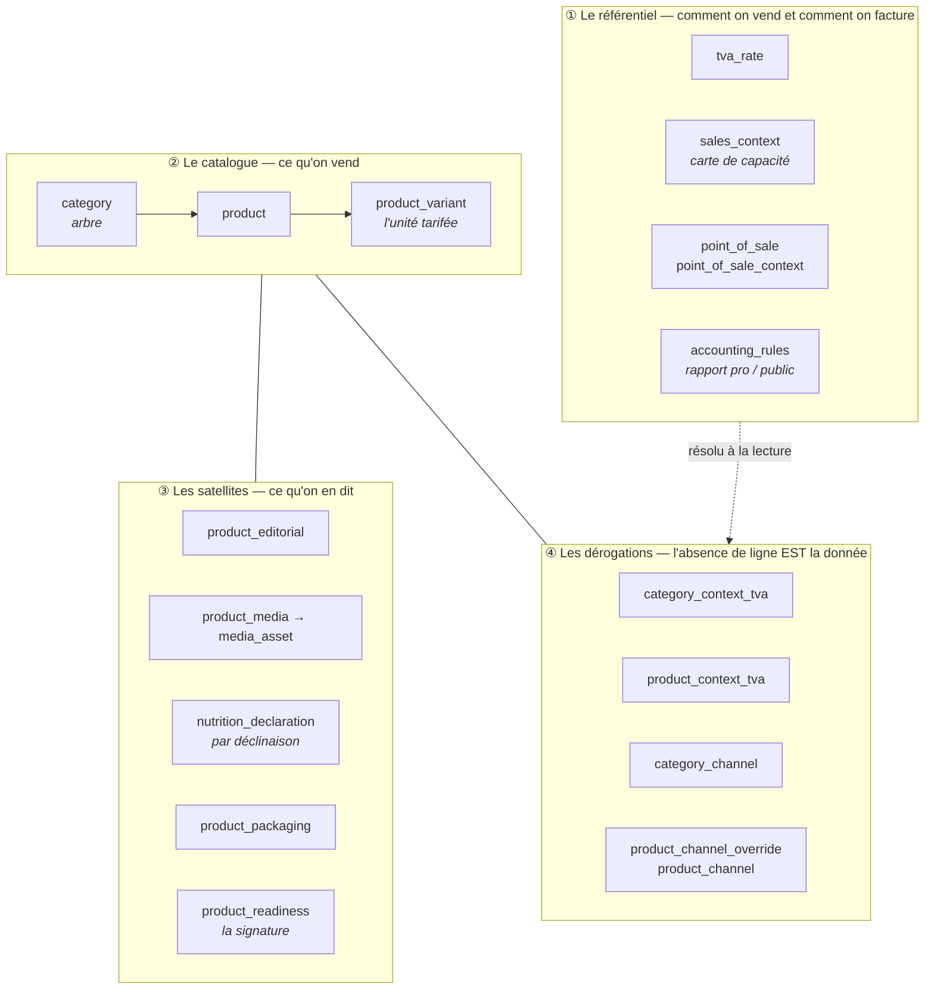
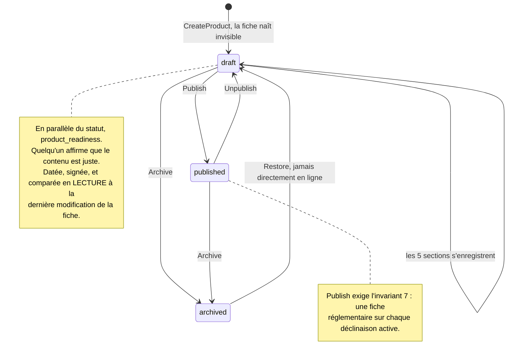
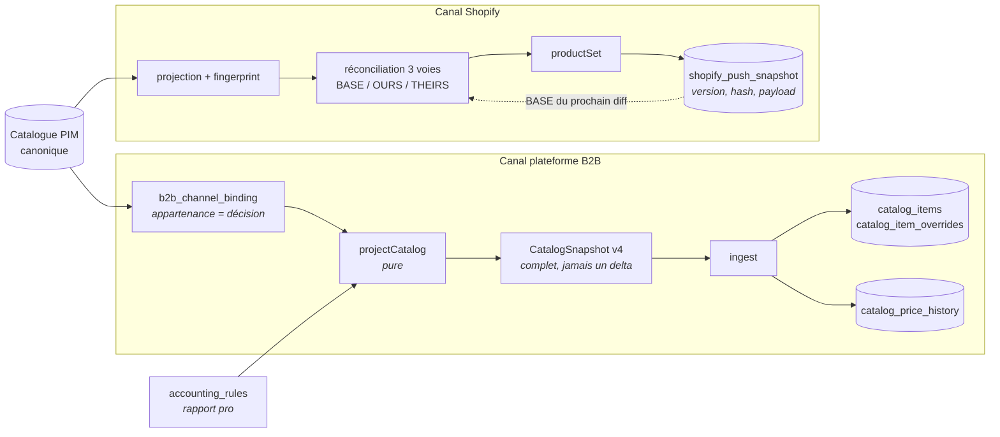

# Le flux du catalogue PIM — et ce qu'il versionne

> **État : constat** (2026-08-31). Cette page décrit ce qui EXISTE, pièce par
> pièce, puis ce qui manque pour deux besoins nommés : **montrer un diff** et
> **poser des points d'ancrage de publication**. Elle ne décide rien — les
> options sont posées au § 6 avec une recommandation et une question ouverte.
>
> Voisins : [`contextes-et-points-de-vente.md`](contextes-et-points-de-vente.md)
> (où vit le taux) · [`architecture-prix-ancre-ttc.md`](architecture-prix-ancre-ttc.md)
> (comment se fabrique un prix) · [`journalisation-et-tracabilite.md`](journalisation-et-tracabilite.md)
> (l'anatomie d'une trace) · [`publication-reconciliation-3way.md`](publication-reconciliation-3way.md)
> (la réconciliation Shopify, qui est déjà la moitié de la réponse).

---

## 1. Les quatre couches

Le catalogue n'est pas une table de produits. C'est **quatre couches** qui n'ont
ni le même rythme de vie ni le même propriétaire, et les confondre est ce qui
rend un versionnement impossible à définir.



**Ce que la couche ④ garantit, et qui structure tout le reste** : une clé absente
signifie « hérite ». Il n'y a donc pas d'état « à moitié dérogé » à versionner —
une matrice se redéfinit en tout-ou-rien, un taux ligne par ligne.

## 2. La saisie — cinq sections, cinq gestes

La fiche produit s'enregistre **par section**, pas par champ ni d'un bloc. Chaque
section a sa route et son fait de journal.

| Section (écran)        | Route                                      | Fait tracé                                      |
| ---------------------- | ------------------------------------------ | ----------------------------------------------- |
| Identité               | `PUT /pim/catalogue/products/:id/identity` | `product.identity_saved`                        |
| Tarif & TVA            | `PUT …/variants/:vid/pricing` · `…/vat`    | `product.pricing_saved` · `product.vat_changed` |
| Allergènes & nutrition | `PUT …/variants/:vid/nutrition`            | `product.declaration_saved`                     |
| Communication          | `PUT …/:id/editorial`                      | `product.editorial_saved`                       |
| Visuels                | `PUT …/:id/media`                          | `product.media_saved`                           |
| Diffusion par canal    | `PUT …/:id/channels`                       | `product.channels_changed`                      |

Le découpage n'est pas cosmétique : il permet à une section d'échouer seule, et
c'est lui qui donne au journal des faits **de la taille d'une décision** plutôt
que d'un caractère.

## 3. Le cycle de vie d'une fiche



**Deux axes, pas un.** Le statut dit ce que le catalogue FAIT de la fiche ; la
signature dit ce qu'une PERSONNE affirme de son contenu. Une fiche signée reste
un brouillon — mettre en vente est un second geste. La signature ne se périme
pas en écriture : `readyAt` se compare au `max(updated_at)` de `product`,
`product_variant`, `product_editorial`, `product_media`.

## 4. La descente vers les canaux



**Ce que la projection B2B fabrique** — et c'est la chaîne entière du prix :

```
prix public TTC (product_variant.price_cents)
  × rapport pro        → prix pro TTC, arrondi au centime
  ÷ (1 + taux du canal) → hors taxe en millicentimes
```

Le rapport est une **précondition** : sans lui, le push est refusé plutôt
qu'émis au plein tarif. Un snapshot vide serait ingéré et viderait la boutique.

## 5. Ce qui est versionné aujourd'hui — l'inventaire honnête

| Ce qui est gardé                | Où                             | Forme                                                                    | Permet de…                                            |
| ------------------------------- | ------------------------------ | ------------------------------------------------------------------------ | ----------------------------------------------------- |
| **Le payload poussé à Shopify** | `pim.shopify_push_snapshot`    | version monotone par `handle`, `hash`, payload **rejouable**             | rejouer, comparer, revenir en arrière — **par canal** |
| **Le tarif canonique B2B**      | `public.catalog_price_history` | append-only, à chaque changement du couple (prix, taux)                  | relire un prix ET son taux à une date                 |
| **Les faits**                   | `growth.activity_events`       | type, acteur, `occurred_at`, payload contenant un **diff champ à champ** | dire qui a changé quoi, quand                         |

Trois choses, trois portées, et une seule d'entre elles est un vrai point
d'ancrage — celle de Shopify.

### Ce que le journal ne peut PAS faire

Il ne reconstruit pas un état. Deux raisons, et la seconde est définitive :

1. il stocke un **diff**, pas un avant/après complet ;
2. `changesBetween` **abrège les textes à 120 caractères** — une histoire produit
   de trois paragraphes n'y est pas, par conception (« on veut savoir QUE le
   texte a changé, pas le relire ici »).

Rejouer le journal pour obtenir le catalogue du 12 mars est donc hors de portée
sans en changer la nature. C'est une trace, pas un event store.

### Ce qui manque, dit simplement

- **Aucune ancre du catalogue lui-même.** Shopify sait dire « voici la version 7
  de ce produit chez moi » ; le PIM ne sait pas dire « voici le catalogue au
  moment où je l'ai publié ».
- **Pas de diff entre deux publications**, donc — il n'y a rien à soustraire.
- **Les satellites ne sont pas datés uniformément.** `product_media` vient de
  gagner son `updated_at` (pour la signature) ; `product_packaging` n'en a pas.

## 6. Les trois façons d'ancrer — et laquelle je recommande

### A · Généraliser l'ancre par canal

Un `catalog_push_snapshot` sur le modèle exact de `shopify_push_snapshot`, pour
chaque canal.

- ✅ Motif déjà éprouvé, coût faible, et le diff est **honnête sur ce que le
  canal a reçu**.
- ❌ Il est en forme de canal, pas de catalogue. Une fiche modifiée mais non
  poussée n'apparaît nulle part, et deux canaux donnent deux vérités.

### B · Une révision du catalogue canonique

`catalog_revision` (version, hash, `taken_at`, `taken_by`, libellé) +
`catalog_revision_item` (le payload figé par produit). Un point d'ancrage
**indépendant des canaux** : « le catalogue de la rentrée », qu'on nomme.

- ✅ Une seule vérité, diffable contre n'importe quelle autre révision. C'est ce
  que « point d'ancrage de publication » veut dire.
- ✅ Elle **compose** avec A plutôt que de le remplacer : un push enregistre
  quelle révision il a envoyée. On répond alors à deux questions distinctes —
  _ce que la maison a décidé_ (révision → révision) et _ce qu'un canal porte_
  (révision → boutique, ce que la réconciliation 3 voies fait déjà).
- ❌ C'est une copie du catalogue à chaque ancre. Le coût dépend entièrement de
  la question ouverte ci-dessous.

### C · Reconstruire depuis le journal

- ❌ **Impossible en l'état** (§ 5). Le rendre possible, c'est passer le PIM en
  event sourcing complet — un chantier d'un autre ordre, pour un besoin que B
  couvre sans y toucher.

### Ma recommandation : **B**, en réutilisant deux pièces qui existent

- le **hash** se calcule comme `fingerprint` de la projection Shopify ; c'est lui
  qui rend le « rien n'a changé » gratuit ;
- le **diff** s'affiche avec `FieldDiffView`, déjà écrit pour la réconciliation.

## 7. La question qu'il faut trancher avant d'écrire une ligne

**Qu'est-ce qui entre dans une révision ?**

Elle décide du coût de stockage, mais surtout de **ce qu'un diff saura montrer** :

| Périmètre                                                                                  | Le diff montre                                 | Le diff ne montre pas                          |
| ------------------------------------------------------------------------------------------ | ---------------------------------------------- | ---------------------------------------------- |
| **Le vendable** — ce que les projections lisent (identité, prix, taux, canaux, allergènes) | ce qui change une facture ou une mise en rayon | une description réécrite, une photo remplacée  |
| **La fiche entière** — éditorial et visuels compris                                        | tout                                           | — (mais chaque ancre pèse le catalogue entier) |

~~**Tranché le 2026-08-31 : le vendable seulement.**~~ **Repris le même jour —
voir le § 9.** Le critère était mauvais.

## 8. Ce que « le vendable » contient — et le piège du rapport

La décision laisse une question qu'il vaut mieux poser maintenant : capture-t-on
l'état **canonique** (les lignes telles qu'elles sont écrites) ou l'état
**résolu** (ce qu'un canal recevrait) ?

Le canonique seul a un trou, et il est large. Le prix professionnel se dérive du
prix public par `accounting_rules.ratio_bp` — une ligne **globale**. Le jour où
la remise passe de 10 % à 12 %, aucune ligne de produit ne bouge, et un diff
canonique dirait donc **« rien n'a changé »** alors que toutes les factures
professionnelles viennent de changer. Le même raisonnement vaut pour un taux de
TVA révisé sur une famille : une ligne change, cent articles sont refacturés.

Une révision porte donc **deux étages** :

| Étage        | Contenu                                                                                                                                     | Pourquoi                                    |
| ------------ | ------------------------------------------------------------------------------------------------------------------------------------------- | ------------------------------------------- |
| **En-tête**  | le rapport pro, les taux par contexte en vigueur                                                                                            | ce qui change tout sans que rien ne bouge   |
| **Articles** | par déclinaison vendable : sku, sku produit, nom, famille, prix public TTC, poids, allergènes, canaux effectifs, taux effectif par contexte | ce qu'on vend, résolu — héritages appliqués |

Les **héritages sont résolus** à la capture. Garder « ce produit hérite de sa
famille » obligerait un diff à rejouer la résolution pour comprendre qu'un taux
de famille a bougé — et à la rejouer avec le code d'aujourd'hui, sur des données
d'hier. Une ancre doit être lisible sans son moteur.

Les deux étages restent vrais quel que soit le périmètre — c'est le § 9 qui dit
ce qu'un article contient.

## 9. Reprise : le bon critère n'est pas « ce qui change une facture »

**« Le vendable » répondait à la mauvaise question.** Il désignait ce qui change
une facture — le critère d'une ancre de TARIF. Une ancre de PUBLICATION répond à
autre chose : **ce qu'un canal doit recevoir pour être autosuffisant.**

Et le B2B doit l'être : sa boutique sert ses propres pages, elle ne rappelle pas
le PIM pour afficher un produit. Aujourd'hui elle affiche des bannières **codées
en dur** dans `legacy/` et son modèle de rangée n'a même pas de champ
description — le fil n'en transporte aucune. C'est un placeholder, pas une
décision. Le jour où on le comble, descriptions et visuels passent sur le fil ;
une ancre qui les ignorerait ne pourrait pas dire ce qui a été publié.

### Ce qui rend le périmètre complet abordable

Deux choses, et la première vient de l'observation qui a rouvert le sujet.

**Les médias sont dans un bucket.** Une révision porte l'**URL** et l'identifiant
de l'asset, jamais les octets. Et elle ne ment pas en le faisant : `MediaAsset`
est un agrégat à cycle propre (`id`, `url`, `storage_key`) — remplacer un visuel
crée un nouvel asset, il ne s'écrase pas en place. Le poids d'une révision est
donc du **texte**.

**Les articles sont adressés par leur contenu.** Un `catalog_revision_item`
référence un hash de payload plutôt que de recopier le payload. Deux révisions
qui partagent quatre-vingt-dix articles inchangés partagent quatre-vingt-dix
lignes — une ancre posée sur un catalogue stable ne coûte presque rien, et le
diff se calcule en comparant des hashs avant de lire quoi que ce soit. C'est le
mécanisme de git, pour la même raison.

### Ce qui reste dehors, et pourquoi

- **Les octets des visuels** — bucket, adressés par URL (ci-dessus).
- **`product_readiness`** — une signature _sur_ la fiche, pas un morceau de la
  fiche. Elle dit qui a validé, pas ce qui est publié.
- **Les liaisons de synchronisation** (`shopify_product_binding`, gids,
  `sku_registry`) — de l'état de transport, re-dérivable, sans valeur historique.

⚠️ **Ce que cette reprise coûte** : une révision devient une copie du catalogue
éditorial, pas un extrait tarifaire. Sans l'adressage par contenu, ce serait
trop cher pour être posé souvent — c'est lui qui rend la décision tenable, et
c'est donc lui qui doit être livré dans la première tranche, pas dans une
optimisation ultérieure.
