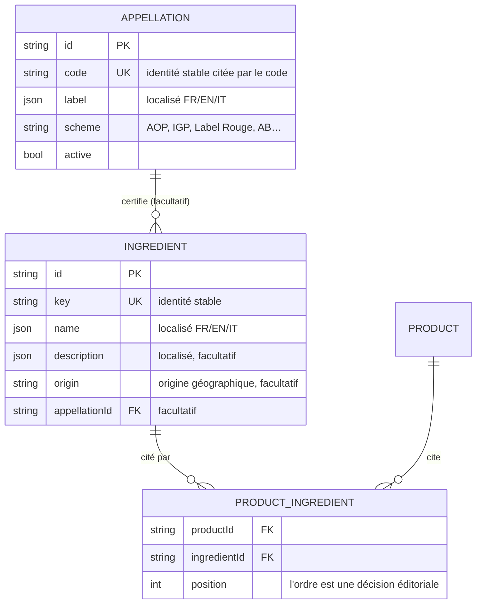

# Ingrédients et appellations

> **État** : 📋 note de conception — écrite avant le code, pour que la question
> posée en premier (« les appellations, est-ce que ce n'est pas
> sur-dimensionné ? ») soit tranchée avec un argument plutôt qu'avec une envie.

## 1. Ce qu'on ajoute, en une phrase

Deux **référentiels** réglés dans _Paramétrage_ — les **ingrédients** et les
**appellations** — et un rattachement **facultatif** de la fiche produit à des
ingrédients, sous la section _Allergènes_.

## 2. Ce que ce n'est PAS : la liste INCO

Il existe déjà, dans ce modèle, une déclaration réglementaire par
**déclinaison** — `NutritionDeclaration` : allergènes GS1, valeurs de l'annexe
XV. La liste d'ingrédients au sens du règlement 1169/2011 lui appartiendrait :
elle est **ordonnée par masse décroissante**, elle porte des quantités, elle
décrit une **recette**, et elle change quand la recette change — donc par
déclinaison, pas par produit.

Ce qu'on construit ici est autre chose : **d'où vient ce qu'il y a dedans**. Le
beurre de Savoie AOP, la farine du moulin d'à côté. C'est une matière
**éditoriale et commerciale** — elle nourrit un badge, un argument de vente, une
fiche B2B — et elle vit au niveau du **produit**, comme le reste de l'éditorial.

Cette distinction est la raison pour laquelle les deux peuvent coexister sans se
contredire, et la raison pour laquelle celle-ci n'a pas à être ordonnée par
masse. Elle est aussi la limite à tenir : **le jour où une mention obligatoire
serait tirée d'ici, elle serait fausse**, parce que rien ici ne garantit ni
l'exhaustivité ni l'ordre. Si ce besoin arrive, il descend chez
`NutritionDeclaration`, il ne remonte pas.

## 3. Pourquoi une table d'appellations, et pas un champ libre

La question était honnête : une appellation, c'est six caractères de badge.
Pourquoi une table ?

Parce qu'une appellation est une **affirmation réglementée**. AOP, IGP, Label
Rouge, AB : ce sont des signes officiels de qualité, protégés, et les employer
engage. En champ libre sur chaque ingrédient, le même signe s'écrirait
« AOP Beaufort », « A.O.P. Beaufort », « aop beaufort » — trois valeurs pour une
seule réalité. Le badge deviendrait alors soit faux, soit impossible à poser
sans une normalisation à la lecture, c'est-à-dire une table implicite, non
déclarée et jamais relue.

La table lui donne une **identité** : on cite l'appellation, on ne la ré-écrit
pas. C'est ce qui rend le badge fiable plutôt que joli, et c'est ce qui permet
d'en corriger le libellé — ou de le traduire — à un seul endroit.

Ce n'est **pas** sur-dimensionné pour une autre raison encore : c'est la
troisième fois que ce dépôt rencontre le même motif (contextes de vente, taux de
TVA, appellations). La dimension qui grandit est pilotée par la DONNÉE, pas par
une constante dans le code — en ajouter une est une ligne, jamais un
déploiement.

## 4. Le modèle

Trois choix qui ne sont pas des détails :

- **`key` / `code` sont des identités, pas des libellés.** Le libellé se
  traduit et se corrige ; l'identité, jamais. C'est la même règle que la clé
  d'un contexte de vente.
- **Le rattachement est une TABLE de liaison**, pas un tableau `Json` sur le
  produit. Un `Json` ne peut pas porter de clé étrangère : effacer un ingrédient
  laisserait des références mortes dans les fiches, sans que rien ne le dise.
  Avec la liaison, la base refuse d'effacer un ingrédient encore cité — et c'est
  exactement le comportement voulu.
- **L'appellation d'un ingrédient est facultative.** La farine du moulin d'à
  côté n'a pas de signe officiel, et l'obliger à en porter un fabriquerait des
  appellations creuses pour satisfaire une colonne.

## 5. L'origine géographique reste une chaîne

« Savoie, France » est un **renseignement**, pas une adresse : rien ne le
calcule, rien ne le filtre, aucun canal ne le géocode. Une table de lieux
répondrait à une question que personne ne pose encore. Le jour où l'on voudra
« tous les produits d'un rayon de 50 km », ce sera une autre donnée, et elle
descendra de celle-ci — pas l'inverse.

## 6. Ce que ça change dans la fiche produit

Une section **Ingrédients**, sous _Allergènes_, **entièrement facultative** :
une fiche sans ingrédient reste publiable. C'est délibéré — la complétude
mesure ce qui est **obligatoire** pour vendre, et un argument de provenance n'en
fait pas partie. L'y compter bloquerait la mise en vente de tout le catalogue
existant sur un champ qui n'a jamais été demandé.
