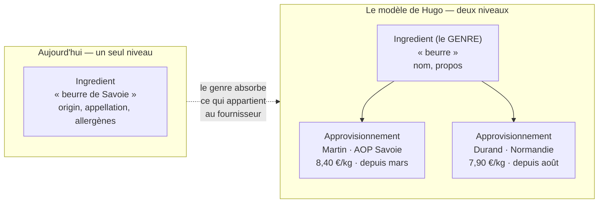
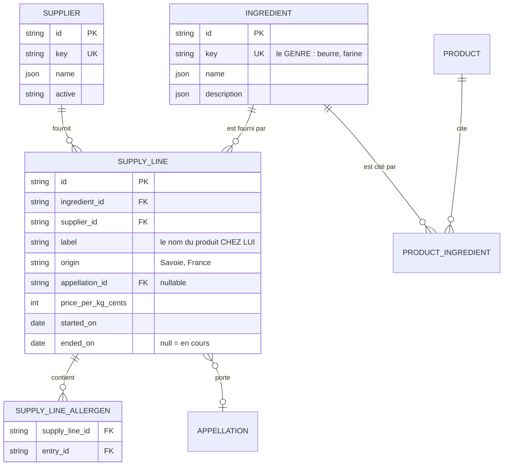
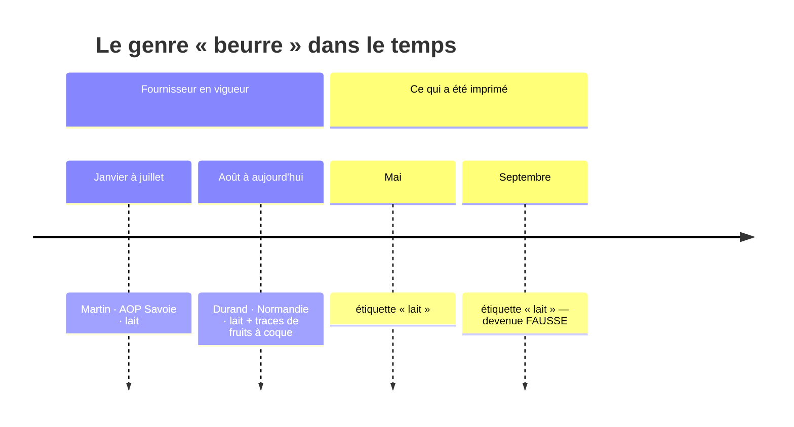
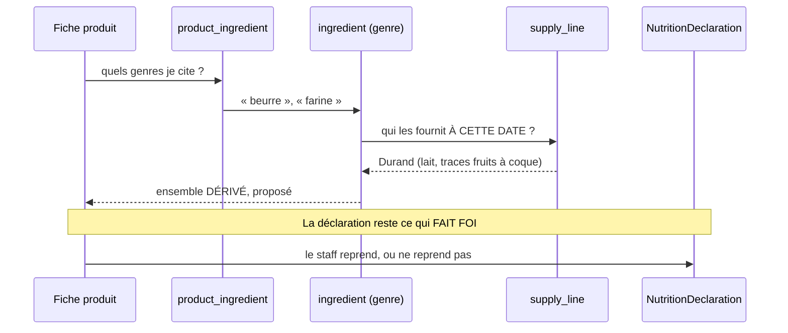

# L'ingrédient et ses fournisseurs — le genre, et ce qui le remplit

> **État : 📐 conception. Rien n'est bâti.**
>
> **Ouvert le 2026-09-22**, sur une phrase de Hugo qui défait le modèle actuel :
>
> > « si je prends beurre de Savoie, en réalité c'est **beurre** et une suite de
> > fournisseurs datés qui fournissent le produit beurre à un prix/kg, et c'est
> > le beurre de ces fournisseurs qui détient les allergènes, l'origine etc. »
>
> 🔴 **`vitruve` sera obligatoire** avant toute soumission : ce plan fait entrer
> un **prix** dans le référentiel (CLAUDE.md §9 bis, « le plan touche à
> l'argent ») et déplacera des données existantes.
>
> Ce document **décrit et tranche le modèle**. Ce qui relève de la liste
> d'ingrédients réglementaire reste dans
> [`ingredients-et-appellations.md`](ingredients-et-appellations.md), qui garde
> la question des appellations.

---

## 1. Le défaut, en une ligne

**« Beurre de Savoie » n'est pas un ingrédient. C'est le produit d'un
fournisseur.**

Le modèle actuel range les deux au même endroit, et c'est pour ça qu'il coince :
`origin` et `appellationId` sont des colonnes de `Ingredient`, donc du **genre**.
Or le genre « beurre » n'a **ni origine ni appellation** — ce sont les beurres
qu'on achète qui en ont, chacun les siennes, et pas les mêmes selon le mois.

Le symptôme se lit dans le nom : dès qu'un ingrédient s'appelle « X de Y », **Y
est un fournisseur ou son terroir**, et on a écrasé deux notions en une.

---

## 2. Ce qui existe, mesuré le 2026-09-22

| Table                 | Ce qu'elle porte                                                 |
| --------------------- | ---------------------------------------------------------------- |
| `ingredient`          | `key`, `name`, `description`, **`origin`**, **`appellation_id`** |
| `ingredient_allergen` | l'ingrédient × un `allergen_entry` (GS1)                         |
| `product_ingredient`  | la fiche **produit** cite un ingrédient, avec une `position`     |
| `appellation`         | `code`, `label`, `scheme`, `active`                              |

**Aucune notion de fournisseur n'existe** — ni dans le référentiel, ni ailleurs
dans le schéma Prisma (vérifié : les seules occurrences de « fournisseur »
parlent du fournisseur d'identité et de l'émetteur de courriels).

Et une règle déjà écrite encadre tout ce qui suit
(`read-product-ingredient-allergens.ts`) :

> Calculer les allergènes d'un produit à la lecture pour les lui appliquer
> réécrirait l'étiquette de tout ce qui cite un ingrédient qu'on vient
> d'enrichir — **y compris ce qui est déjà imprimé et déjà servi** — sans que
> personne ne l'ait décidé.

🔴 **Cette phrase est le garde-fou du chantier.** Ajouter un niveau de
fournisseurs multiplie les occasions qu'une donnée bouge sous une étiquette
déjà posée ; la règle « la déclaration fait foi, la reprise est un geste
explicite » ne s'assouplit pas, elle devient **plus** nécessaire.

---

## 3. Le modèle proposé

### Ce qui bouge, et pourquoi

| Donnée           | Aujourd'hui  | Demain        | Pourquoi                                                    |
| ---------------- | ------------ | ------------- | ----------------------------------------------------------- |
| `origin`         | `ingredient` | `supply_line` | « beurre » n'a pas d'origine ; le beurre de Martin en a une |
| `appellation_id` | `ingredient` | `supply_line` | une AOP qualifie un produit précis, pas un genre            |
| allergènes       | `ingredient` | `supply_line` | c'est ce qu'on achète qui contient, pas la catégorie        |
| `name`           | `ingredient` | **reste**     | le genre garde son nom — c'est lui que la recette cite      |

⚠️ **`product_ingredient` ne change pas de cible** : une fiche cite le **genre**.
C'est volontaire, et c'est le cœur du modèle — changer de fournisseur ne doit
pas obliger à rouvrir toutes les fiches qui citent le beurre.

---

## 4. 🔴 Le point dur : deux dimensions neuves entrent dans le référentiel

### a. Le TEMPS

Une ligne d'approvisionnement est **datée**. La question « quels allergènes a ce
produit ? » cesse d'avoir une réponse, et devient « quels allergènes **à quelle
date** ? ».

🔴 **C'est ici que le chantier peut faire du mal.** Un changement de fournisseur
qui ajoute un allergène rend fausse une étiquette déjà posée — et personne n'est
prévenu. Le dépôt a déjà un mécanisme pour ça (l'écart entre `citedByIngredients`
et `citedNotDeclared`) : il faudra le **dater**, pas le contourner.

⚠️ Le dépôt a aussi une porte pour cette famille d'erreurs :
`lint:dated-decisions` exige qu'une décision qui entre dans la résolution du
prix porte une fenêtre. Une ligne d'approvisionnement **est** exactement ça.

### b. L'ARGENT

`price_per_kg_cents` fait entrer un **coût d'achat** dans un référentiel qui n'a
jamais porté que des prix de **vente**. Deux conséquences immédiates :

- en **centimes entiers**, jamais un flottant (CLAUDE.md §3) ;
- le référentiel devient capable de calculer une **marge**, ce qui n'a jamais
  été son rôle. ➡️ **À trancher** : le prix d'achat vit-il ici, ou est-ce une
  donnée du fournil qui n'a rien à faire dans le catalogue ?

---

## 5. Comment une fiche produit lit tout ça

**Rien ne change au contrat existant** : l'ensemble dérivé reste une
**proposition**, la déclaration de la déclinaison reste l'autorité, et la
reprise reste un geste explicite. Ce chantier rend la proposition **plus juste**,
il ne lui donne pas le pouvoir de décider.

---

## 6. Ce qu'on ne bâtit PAS

| ❌                                          | Pourquoi                                                           |
| ------------------------------------------- | ------------------------------------------------------------------ |
| Des commandes, des livraisons, des stocks   | C'est un ERP. Ici on décrit **qui fournit quoi**, pas les flux     |
| Une descente automatique sur les étiquettes | Réécrirait ce qui est déjà imprimé — la règle existante l'interdit |
| Une table de lieux pour `origin`            | `origin` reste une chaîne ; rien ne la filtre ni ne la géocode     |
| La liste INCO ordonnée par masse            | Elle appartient à `NutritionDeclaration`, par **déclinaison**      |

---

## 7. À trancher avant de bâtir

1. **Le prix d'achat entre-t-il dans le référentiel ?** S'il entre, le PIM sait
   calculer une marge — nouveau rôle, et `vitruve` obligatoire.
2. **Deux fournisseurs à la fois**, ou un seul en vigueur ? Le premier cas rend
   la question « quels allergènes ? » **non déterministe** sans une règle de
   priorité.
3. **Que devient l'existant ?** Les ingrédients nommés « X de Y » portent déjà
   une origine et parfois une appellation. Les scinder est une **migration de
   données** : étendre, basculer, resserrer (CLAUDE.md §0).
4. **Qui est prévenu** quand un changement de fournisseur ajoute un allergène à
   un genre déjà cité par des fiches publiées ? Sans réponse, le modèle est plus
   juste **et** plus dangereux que l'actuel.
5. **Un fournisseur est-il un référentiel du PIM**, ou une notion du fournil qui
   déborde ici ? Le PIM n'a aujourd'hui aucune notion d'acteur externe.
