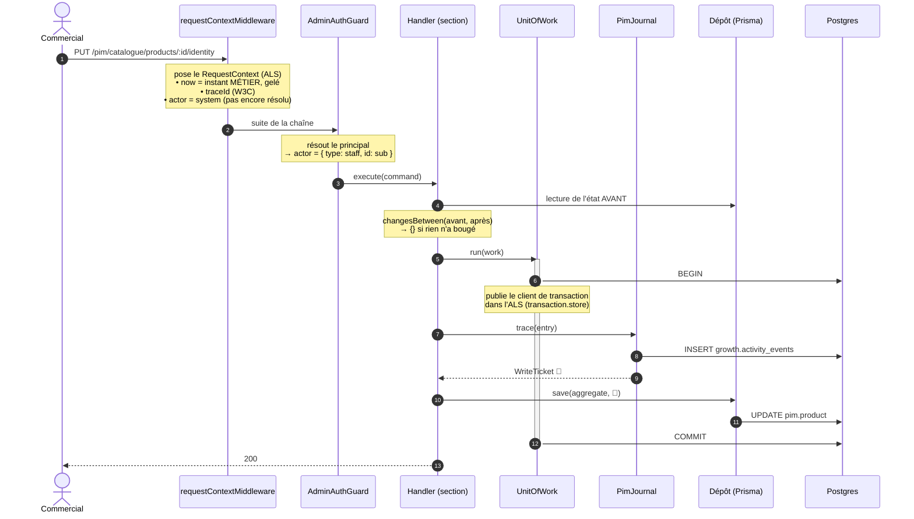
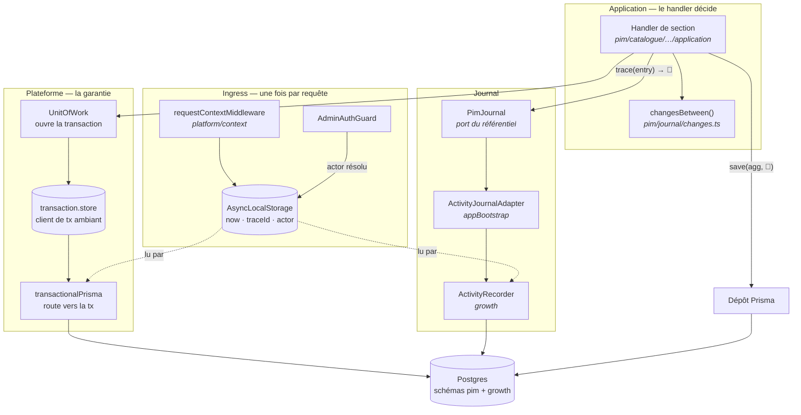
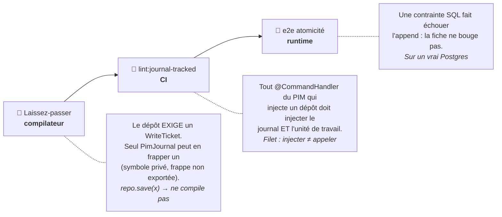
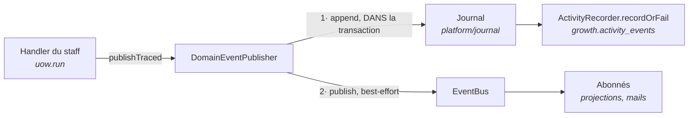
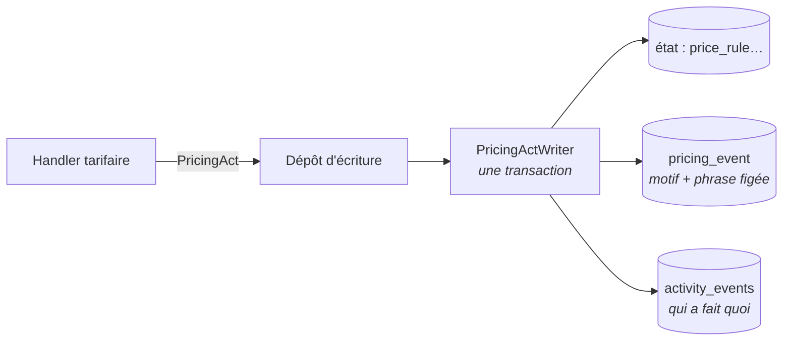

# Journalisation & traçabilité — qui écrit quoi, et ce qui l'y oblige

> **État : ✅ pour le référentiel (PIM).** Le mécanisme (contexte de requête,
> unité de travail, laissez-passer) vit dans `platform/` et pourra servir
> ailleurs ; aujourd'hui **seul le PIM s'en sert**. Le B2B garde son journal
> analytique, best-effort et non bloquant — c'est un arbitrage, pas un oubli
> (cf. [§ Ce qui n'est PAS journalisé](#ce-qui-nest-pas-journalisé)).

---

## 1. En une phrase

Quand quelqu'un modifie une fiche produit, une ligne part dans
`growth.activity_events` **dans la même transaction que la modification** : si
la trace échoue, la modification est annulée. Et le code est fait pour qu'on ne
puisse pas écrire sans tracer — **ça ne compile pas**.

---

## 2. Ce que c'est, et ce que ce n'est pas

|                     | Ce journal                                 | Un event store                         |
| ------------------- | ------------------------------------------ | -------------------------------------- |
| La vérité           | Les **tables**. Le journal est un témoin.  | Les **événements**. L'état est dérivé. |
| Reconstruire l'état | Par les diffs, à rebours de l'état courant | Par rejeu, par construction            |
| Coût                | Une ligne par geste                        | Projecteurs, versioning, upcasting     |
| Décision            | [ADR-11](adr.md) — event store **différé** | —                                      |

On fait de l'**event streaming** (audit, analytique), pas de l'event sourcing.
On ne reconstruit jamais l'état métier depuis le journal.

### La différence, concrètement

Prenons un taux de TVA passé de 5,5 % à 10 %. Les deux mondes écrivent la même
ligne — `vat_rate.rate_changed`, `{ from: 550, to: 1000 }`. Ce qui les sépare
n'est pas ce qu'on écrit, c'est **où est la vérité**.

**Chez nous (streaming).** La colonne `vat_rate.percent` vaut `1000`, et c'est
elle qu'on lit pour facturer. Le journal est un **témoin** : si demain il est
vide, effacé, ou en désaccord avec la colonne, la facturation continue et c'est
la colonne qui a raison. Perdre le journal coûte la mémoire de qui a décidé
quoi — jamais le service.

**En event sourcing.** Il n'y a **pas** de colonne `percent`. Le taux courant
est le **résultat du rejeu** de tous les faits depuis l'origine :
`created(550)` puis `rate_changed(1000)` ⇒ 10 %. Un fait perdu, et le taux
courant devient faux. Un fait mal formé écrit il y a deux ans, et il faut
continuer de savoir le relire aujourd'hui (versioning, upcasting). Un fait
erroné ne se corrige pas — on ne réécrit pas le passé : on écrit un fait
**compensatoire**, comme une écriture d'annulation en comptabilité.

Le test qui tranche, en une question : **si j'efface la table `activity_events`,
qu'est-ce qui casse ?** Ici, l'historique — et rien d'autre. En event sourcing,
l'application ne sait plus ce qu'elle vend.

Ce qu'on emprunte quand même à l'event sourcing : l'append-only (on n'édite
jamais une ligne écrite), l'acteur figé au moment de l'acte, l'idempotence.
Ce qu'on ne paie pas : les projecteurs, le rejeu, le versioning perpétuel des
charges utiles.

---

## 3. Anatomie d'une entrée

Un vrai enregistrement, après un renommage + reclassement :

```json
{
  "id": "01M0WHQP7S61EJGD11SKJ8M0M3",
  "type": "product.identity_saved",
  "schema_version": 1,

  "occurred_at": "2026-08-25T13:28:41.465Z",
  "recorded_at": "2026-08-25T13:28:41.483Z",

  "subject_type": "product",
  "subject_id": "01a0391b-d8cc-761f-95d6-046a1f46ba48",

  "actor_type": "staff",
  "actor_id": "staff-e2e",
  "actor_name": "Opérateur E2E",
  "actor_role": "Administrateur",

  "trace_id": "01f46bd72d51fb5103d66c5bb7f940cc",
  "idempotency_key": "product.identity_saved:01a0391b-…:01f46bd72d51fb5103d66c5bb7f940cc",

  "payload": {
    "changes": {
      "kind": { "from": "daily", "to": "made_to_order" },
      "name": {
        "from": { "fr": "Baguette" },
        "to": { "fr": "Baguette de tradition", "en": "Tradition baguette" }
      }
    }
  }
}
```

| Champ             | Qui le pose                   | Pourquoi c'est comme ça                                                                                                     |
| ----------------- | ----------------------------- | --------------------------------------------------------------------------------------------------------------------------- |
| `id`              | `IdGenerator` (ULID)          | Triable par le temps → pagination stable sur un flux append-only.                                                           |
| `type`            | l'émetteur (`PIM_EVENTS`)     | Un **fait métier**, pas une route HTTP : `product.identity_saved` se relit dans six mois, `PUT /products/:id/identity` non. |
| `occurred_at`     | `Clock` ← `RequestContext`    | Temps **métier**, gelé à l'entrée de la requête. Une requête = un instant.                                                  |
| `recorded_at`     | Postgres (`now()`)            | Temps d'**ingestion**. Diverge d'`occurred_at` sur un rejeu ou un traitement tardif.                                        |
| `actor_*`         | `ActorNamer` ← guard          | **Figés au moment de l'acte.** Le journal doit dire qui a agi ce jour-là et à quel titre, pas qui porte ce nom aujourd'hui. |
| `trace_id`        | middleware d'ingress          | Relie la ligne aux logs et aux erreurs de la même requête.                                                                  |
| `idempotency_key` | le recorder                   | Dérivée du `trace_id` de la ligne — voir [§ 6](#6-lidempotence--pourquoi-la-trace-et-pas-lhorloge).                         |
| `payload.changes` | le handler (`changesBetween`) | Le diff, calculé **au serveur**. Un front qui annoncerait ses modifications serait cru sur parole.                          |

---

## 4. Le trajet complet d'un geste



**Si l'INSERT du journal échoue**, l'exception remonte, `UnitOfWork` ne commite
pas, et l'`UPDATE` est annulé avec. C'est prouvé en e2e sur un vrai Postgres,
en posant une contrainte SQL qui refuse l'événement attendu
(`test/pim-journal-atomicity.e2e-spec.ts`).

---

## 5. Qui injecte quoi



Le point non évident : **`pim` et `growth` sont deux schémas d'UNE seule base**.
C'est ce qui rend l'atomicité atteignable sans outbox ni 2PC. Deux bases, et
tout ce document serait faux.

### La frontière `pim` → `growth`

La matrice des frontières interdit à `pim` de voir `b2b`. Le référentiel déclare
donc son propre port (`PimJournal`), et **la racine de composition** le branche
sur le journal réel (`appBootstrap/pim-journal.module.ts`). Le PIM ne sait pas
qui écrit sa trace.

> ⚠️ Le port note qu'au **troisième bloc émetteur**, le journal doit être promu
> en `platform/`. Il y en a déjà trois (`commerce`, `catalogue/category`,
> `catalogue/product`) : le déménagement est dû.

---

## 6. L'idempotence — pourquoi la trace, et pas l'horloge

```
idempotency_key = `${type}:${subjectId}:${traceId}`
```

Un horodatage donnerait une clé neuve à chaque rejeu — donc une idempotence qui
n'idempote rien. Le `traceId`, lui :

- **survit au rejeu d'une même requête** → un doublon est un `no-op` silencieux
  (violation d'unicité attrapée et ignorée) ;
- **change entre deux requêtes** → deux corrections successives du même champ
  restent bien **deux faits**, ce qu'elles sont.

### Une seule dérivation, au seul endroit qui écrit la trace

La clé se calcule dans `buildActivityEventRow`, à partir du `traceId` qui part
**sur la même ligne**. Elle se calculait aussi dans l'adaptateur de la
plateforme, et les deux replis hors requête divergeaient — une constante d'un
côté, une trace neuve de l'autre.

Conséquence, corrigée le 2026-08-25 : hors requête (un seed, un script — et le
seed passe par les vrais handlers), deux faits **réellement distincts** de même
type sur le même sujet portaient la même clé. Le second disparaissait en
silence, avalé par l'idempotence, pendant que sa ligne aurait affiché une trace
à elle. Une clé qui prétend « même geste » là où la ligne dit « autre trace »
est pire qu'une clé absente.

Un émetteur peut toujours fournir une clé **métier** — `order.placed:<id>`,
`company.step_reached:<étape>:<société>` — quand le fait se déduit d'un objet
durable et qu'un rejeu ne doit jamais recompter. C'est le cas des abonnés de
`growth`. Le défaut dérivé de la trace est pour les faits qui n'ont pas
d'identité propre.

---

## 7. Deux garanties, et l'émetteur choisit

| Méthode                         | Comportement                      | Pour qui                                                                                                 |
| ------------------------------- | --------------------------------- | -------------------------------------------------------------------------------------------------------- |
| `ActivityRecorder.record`       | best-effort — n'échoue **jamais** | Analytique (une reco affichée, une étape franchie). Perdre une ligne dégrade une statistique.            |
| `ActivityRecorder.recordOrFail` | la panne **remonte**              | Traçabilité. Une trace manquée en silence est pire que l'échec : elle laisse croire que rien n'a changé. |

Le référentiel prend le second. **Contrepartie assumée : son journal devient un
point de panne du métier.**

---

## 8. Ce qui empêche d'écrire sans tracer

Trois couches, de la plus forte à la plus large :



### L'échappatoire, et pourquoi elle est visible

Toutes les écritures n'ont pas un événement à inscrire, et certaines ne l'ont
pas **encore**. `PimJournal.untraced(raison)` rend un ticket sans rien
journaliser — mais il faut l'écrire et dire pourquoi :

```ts
await this.categories.save(
  category,
  this.journal.untraced(
    "renommage de famille — aucun événement métier défini (dette journal-tracked)",
  ),
);
```

Deux familles de motifs aujourd'hui :

- **« section enregistrée sans modification »** — un geste sans effet n'a rien à
  raconter, et l'inscrire remplirait l'historique de bruit ;
- **la dette** — le geste mérite un fait, personne ne l'a encore nommé.

Une dérogation qu'on peut grep vaut mieux qu'une règle contournée en silence :
le but n'a jamais été d'empêcher, il a toujours été de **rendre visible**.

---

## 9. Les faits du référentiel

Définis dans `pim/journal/pim-journal.ts` (`PIM_EVENTS`).

| Fait                                                             | Émis par                                                |
| ---------------------------------------------------------------- | ------------------------------------------------------- |
| `product.identity_saved`                                         | section Identité                                        |
| `product.pricing_saved`                                          | section Tarif & logistique                              |
| `product.declaration_saved`                                      | section Allergènes & nutrition                          |
| `product.editorial_saved`                                        | section Communication                                   |
| `product.media_saved`                                            | section Visuels                                         |
| `product.published` / `product.unpublished`                      | mise en vente / retrait                                 |
| `product.vat_changed` / `product.channels_changed`               | dérogations de la fiche                                 |
| `product.created` / `.archived` / `.restored`                    | ouverture et sortie d'une fiche                         |
| `product_category.vat_changed`                                   | TVA d'une famille                                       |
| `product_category.created` / `.renamed` / `.moved` / `.archived` | l'arbre du catalogue                                    |
| `product_category.reordered`                                     | un NIVEAU rangé (sujet = le parent, `root` à la racine) |
| `product_category.channels_changed`                              | où un rayon se vend                                     |
| `location.created` / `.updated` / `.deleted`                     | emplacements                                            |
| `location.table_qr_generated` / `.table_qr_removed`              | QR de table (le jeton n'est jamais dans la charge)      |
| `vat_rate.created` / `.rate_changed` / `.renamed` / `.deleted`   | référentiel des taux                                    |

**Toute écriture du référentiel nomme désormais son fait** : `27/27` handlers,
dette déclarée vide. La règle d'origine (« on ne trace que ce qui a un aval »)
est tombée — elle triait selon l'usage qu'on imaginait du journal, alors que la
question qu'on lui pose est « qui a touché à ça ». Le tri n'a pas disparu, il a
changé d'endroit : le flux enregistre tout, la **lecture** choisit.

---

## 10. Et si on migrait `growth` sur ce format ?

C'est la question naturelle une fois le PIM tracé de bout en bout. La réponse
courte : **le format est déjà commun** — une seule table, un seul schéma de
ligne, un seul `traceId`, une seule idempotence. Ce qui diffère n'est pas le
journal, c'est **la garantie** et **qui émet**.

### Deux différences, et une seule est un choix

**1. La garantie.** Le port offre les deux (`record` best-effort,
`recordOrFail` bloquant, cf. §7). Le PIM a choisi bloquant : son écran est
interne, son volume faible, et une trace manquée y est pire qu'un échec. Rendre
bloquant le chemin `order.placed` reviendrait à accepter qu'un hoquet d'`INSERT`
dans le journal **empêche un client de commander**. Le paiement est pire encore :
la trace vivrait dans la même transaction qu'un aller-retour Stripe, or on
n'enferme jamais un appel réseau tiers dans une transaction interactive
(Accelerate a une durée maximale). C'est donc un choix par chemin d'écriture,
pas un réglage global.

**2. Qui émet — et c'est là que la migration a un vrai coût.** Les faits du PIM
sont écrits **par le handler qui écrit**, dans sa transaction. Les faits de
`growth` sont écrits par des **abonnés** (`on-order-placed`, `on-company-activated`,
…) qui réagissent à un événement de domaine publié par `orders`, `account`,
`subscriptions` — après coup, hors requête (`BackgroundWork`), et par
construction hors de la transaction qui a écrit. C'est ce qui rend `growth`
observateur plutôt qu'auteur, et ce découplage est **voulu** : `growth` ne
connaît d'`orders` que sa classe d'événement, jamais ses tables.

Migrer « exactement sur ce format » ne veut donc pas dire déplacer du code de
`growth` : ça veut dire **exiger le laissez-passer dans les dépôts de `b2b`** et
tracer dans les handlers de `b2b`. Ce que `growth` en fait ensuite ne change
pas. Et un fait de `growth` qui n'a pas d'auteur (`reco.shown`, émis sur un
chemin de LECTURE) ne peut pas devenir bloquant : rien n'écrit, il n'y a pas de
transaction à annuler.

### Ce qui vaut la peine, et dans quel ordre

Le critère n'est pas « quel module », c'est **« qui agit sur les affaires de
quelqu'un d'autre »** — c'est là qu'on vient demander des comptes.

1. ✅ **Les mutations staff sur un compte client** — **fait le 2026-08-25**, cf.
   la section suivante.
2. ✅ **Les décisions contractuelles et tarifaires** — **fait le 2026-08-25**,
   cf. §12. (Les gabarits récurrents en sont sortis : ce sont les paniers du
   CLIENT, pas une décision du staff.)
3. 🔴 **Le chemin de commande et les webhooks de paiement.** Restent
   best-effort + clé d'idempotence. Le client passe avant la mémoire.

---

## 11. Le lot 1 : les actes du staff, sans alourdir les handlers

Le référentiel journalise **dans ses handlers** : une dizaine de lignes par
geste. C'est le prix de ses diffs — seul le handler sait ce qui a changé entre
deux enregistrements de section. Copier ce patron sur les comptes clients aurait
coûté la lisibilité de vingt handlers pour un bénéfice nul : leurs faits ne sont
pas des diffs, ce sont des **actes nommés**, et l'événement les porte déjà.

D'où la forme retenue : **l'événement de domaine EST le fait**.

```ts
await this.uow.run(async () => {
  await this.companies.save(company);
  await this.events.publishTraced(new PaymentTermsGrantedEvent(company.id, terms));
});
```

Une ligne, celle qui existait déjà — `publish` est devenu `publishTraced`. Ce
qui a changé est dessous : `DomainEventPublisher.publishTraced` inscrit le fait
au journal **dans la transaction ambiante**, puis publie sur le bus. Un événement
sait se décrire (`JournaledEvent.journalFact()`), donc la charge utile s'écrit
une seule fois, au même endroit que le fait.



**Le journal, lui, a déménagé.** `PimJournal` vivait dans `pim/` et se donnait
sa propre règle : « promouvoir en `platform/` au troisième bloc émetteur ». `b2b`
est le troisième. Le port générique (`platform/journal/`) porte donc le fait nu
et l'écriture bloquante ; `PimJournal` reste au-dessus avec ce qui lui est propre
— le laissez-passer et la portée.

### Ce qui est tracé, et ce qui ne l'est pas

**Tracé (bloquant, dans la transaction)** : les dix-neuf actes d'un agent sur le
compte d'un tiers — identité corrigée, délais de paiement accordés, statut
changé, KBIS déposé / certifié / décertifié, activation, adresses de facturation
et de livraison, préférence d'acheminement, carnet de contacts.

**Best-effort, inchangé** : `company.declared` et `company.step_reached`. Ce sont
des faits d'**entonnoir** — ce que le client fait chez lui. Les perdre dégrade
une statistique ; bloquer une inscription sur un hoquet d'`INSERT` dégraderait le
service. Ils continuent de passer par leurs abonnés.

Les trois abonnés qui ne faisaient que journaliser (`on-company-activated`,
`on-kbis-certification`) ont été **supprimés** : leur fait s'écrit maintenant à
la source. Les garder aurait produit deux lignes pour un acte.

### Ce que la porte vérifie côté comptes

`lint:journal-tracked` couvre désormais deux zones et deux disciplines : au
référentiel, injecter `PimJournal` + `UnitOfWork` ; côté comptes, **appeler**
`publishTraced` sous unité de travail. Un handler dont le nom dit qu'un agent
agit sur le dossier d'un tiers (`…ByStaff`, plus les cinq gestes sans jumeau
client) ne peut plus être livré muet.

Deux dispenses, déclarées et greppables :

| Handler                       | Marque              | Pourquoi                                                                                                 |
| ----------------------------- | ------------------- | -------------------------------------------------------------------------------------------------------- |
| `UploadKbisByStaffHandler`    | `@hors-transaction` | Le fichier part d'abord au stockage objet ; y enfermer un aller-retour réseau coûterait plus que le trou |
| `CreateCompanyByStaffHandler` | `@sans-journal`     | `company.declared` existe déjà avec `via: "staff"` ; le tracer ici lui donnerait deux écrivains          |

---

## 12. Le lot 2 : les décisions tarifaires

Le lot 1 a trouvé un terrain nu. Le lot 2 a trouvé **deux terrains différents**,
et c'est ce qui décide de sa forme.

### La tarification avait déjà son journal

Règles, limites et barèmes écrivent depuis toujours un `PricingAct` — sujet,
geste, auteur, **motif écrit par l'agent**, et la **phrase figée** de ce que la
décision disait — dans la même transaction que l'état. C'est plus riche que le
journal général, et c'est tenu par le **compilateur** : les dépôts d'écriture
exigent l'acte en paramètre.

On ne l'a donc pas remplacé. Le manque était ailleurs : ce journal-là vit dans
une table du domaine, invisible de l'écran qui répond à « qui a fait quoi ».
Une remise consentie sur un prix négocié est exactement ce qu'on y cherche.

D'où le **miroir**, posé à un seul endroit :



Un seul écrivain, une seule transaction, deux destinations qui ne répondent pas
à la même question. Deux lignes pour un acte, jamais deux vérités : elles ne
peuvent pas diverger, elles tombent ensemble.

Au passage, le service a absorbé une répétition qui traînait dans quatre dépôts
— chacun recréait sa ligne de `pricingEvent` à la main. Les deux manques avaient
la même cause : personne ne possédait « écrire un acte ».

### Les réglages qui décident du prix, eux, n'avaient rien

Zones de livraison, points de retrait, heures limites : trois modules, dix
handlers, aucune trace. Ils décident pourtant ce qu'un client paie pour être
livré, ce que lui remise un retrait, et à quelle heure sa commande bascule au
lendemain. Quand un client réclame — « j'ai commandé à 17 h 02 » — la question
est ce que la règle disait **ce jour-là** ; l'état courant a peut-être changé à
cause de cette réclamation même.

Ils passent par le patron du lot 1 : un événement qui est le fait,
`publishTraced` dans la transaction. Plus les **engagements de volume**, seul
objet tarifaire sans acte — donc le seul que le compilateur ne gardait pas.

### Ce que les charges portent, et ce qu'elles refusent

| Fait                      | Porte                                  | Ne porte pas                          |
| ------------------------- | -------------------------------------- | ------------------------------------- |
| `delivery_zone.*`         | tarif, libellé, **nombre** de préfixes | la liste des codes postaux            |
| `pickup_address.*`        | ville, code postal, **remise**         | l'adresse complète, les horaires      |
| `order_cutoff.*`          | la règle entière (4 champs)            | —                                     |
| `volume_commitment.*`     | société, volume promis, fenêtre, motif | —                                     |
| `price_rule/floor/ladder` | phrase figée + motif                   | le détail de la règle (il a sa table) |

### La porte, et un trou qu'elle avait

`lint:journal-tracked` couvre désormais quatre zones. Les trois modules de
réglages n'ont **aucune exception de nom** : un client ne pose pas une zone de
livraison, tout y est staff. La tarification, elle, n'est gardée que sur les
engagements — le reste est tenu par le compilateur, ce qui est plus fort.

En posant cette zone, la porte s'est révélée **fausse depuis le lot 1** : elle
cherchait l'appel à `publishTraced` dans une fenêtre large autour du handler, et
attrapait donc celui du handler PRÉCÉDENT quand deux vivent dans le même
fichier. Un handler muet passait au vert. Elle cherche maintenant dans le corps
du handler, et seulement là — falsifié : retirer un appel la fait échouer.

## 13. Lire l'historique d'une fiche

La table est indexée `[subject_type, subject_id, occurred_at]`, et le lecteur
filtre déjà sur ces colonnes.

```sql
SELECT occurred_at, type, actor_name, payload
FROM growth.activity_events
WHERE subject_type = 'product' AND subject_id = $1
ORDER BY occurred_at DESC;
```

> 🟡 **L'écran n'existe pas encore.** Les faits sont écrits et lisibles ; l'onglet
> « Historique » de la fiche reste à faire.

---

## 14. Ce qui n'est PAS journalisé

À jour au **2026-08-25**. Le chiffre exact sort de `pnpm lint:journal-tracked`.

- ~~14 handlers du PIM écrivent sans fait nommé~~ — **plus aucun depuis le
  2026-08-25** : `27/27`. Les quatorze gestes qui restaient (ouverture /
  archivage / restauration d'une fiche, les six sur les familles, les cinq sur
  les emplacements) ont chacun leur fait. La liste `BACKLOG` de la porte reste
  en place, **vide** : c'est le mécanisme qui rendra une dette future visible et
  bornée.
- **Le B2B, sauf les actes du staff et les décisions tarifaires** (§11 et §12) :
  restent muets ou best-effort le chemin de commande, les paiements, les paniers
  récurrents du client, l'annuaire staff, et tout ce que le CLIENT fait chez
  lui. Ce que `growth` écrit de ces chemins reste analytique. Y rendre le journal bloquant reviendrait à
  accepter qu'un hoquet d'append empêche un client de commander : c'est une
  décision produit, à prendre domaine par domaine.
- **Tout ce qui ne passe pas par un handler** : un `psql`, un seed, une
  migration, un import. C'est la limite assumée du niveau applicatif ; seule une
  capture au niveau de la base (CDC, triggers) l'attraperait.
- `updated_by` n'est rempli que sur les écritures de **`Product`**.

---

## 15. Fichiers

| Rôle                             | Chemin                                                                   |
| -------------------------------- | ------------------------------------------------------------------------ |
| Contexte de requête (ALS)        | `platform/context/request-context.{ts,store.ts,middleware.ts}`           |
| Unité de travail                 | `platform/database/unit-of-work.ts`                                      |
| Routage vers la transaction      | `platform/database/{transaction.store,transactional-prisma}.ts`          |
| Port générique du journal        | `platform/journal/{journal,journal-fact}.ts`                             |
| Événement qui EST un fait        | `JournaledEvent` + `DomainEventPublisher.publishTraced`                  |
| Faits des comptes clients        | `b2b/account/domain/events/account-facts.ts`                             |
| Faits des réglages commerciaux   | `b2b/{delivery-zones,pickup-addresses,order-cutoffs}/domain/*.events.ts` |
| Acte tarifaire → fait général    | `b2b/pricing/domain/pricing-act.ts` (`pricingFactOf`)                    |
| Écriture d'un acte tarifaire     | `b2b/pricing/infrastructure/pricing-act.writer.ts`                       |
| Port du référentiel + ticket     | `pim/journal/pim-journal.ts`                                             |
| Diff `avant → après`             | `pim/journal/changes.ts`                                                 |
| Branchement ports → journal réel | `appBootstrap/journal.module.ts`                                         |
| Journal réel (append)            | `b2b/growth/infrastructure/prisma-activity-recorder.ts`                  |
| Table                            | `prisma/schema.prisma` → `model ActivityEvent`                           |
| Porte CI                         | `dev-toolbox/gates/journal-tracked.mjs`                                  |
| Preuve d'atomicité               | `apps/lfd-api/test/pim-journal-atomicity.e2e-spec.ts`                    |
