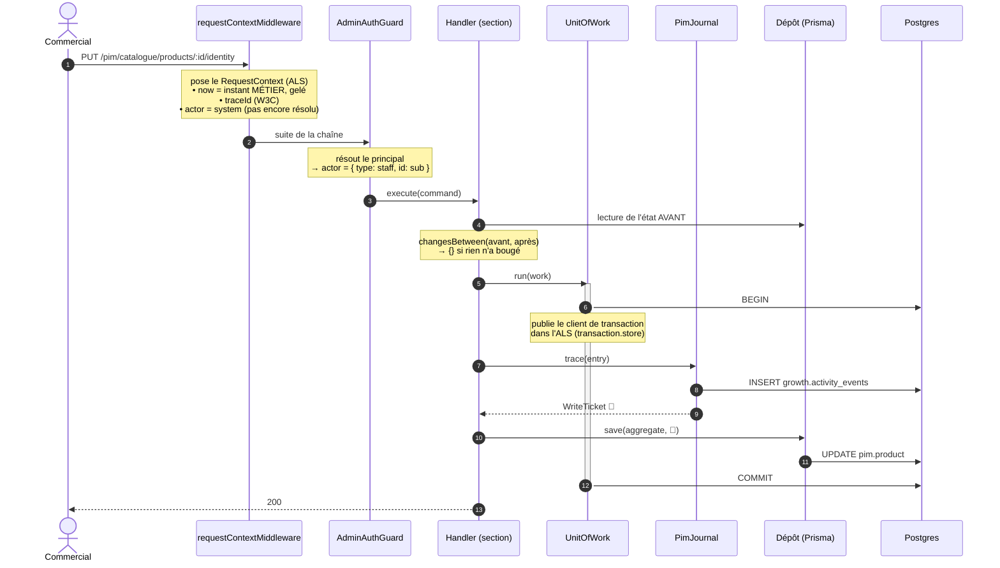
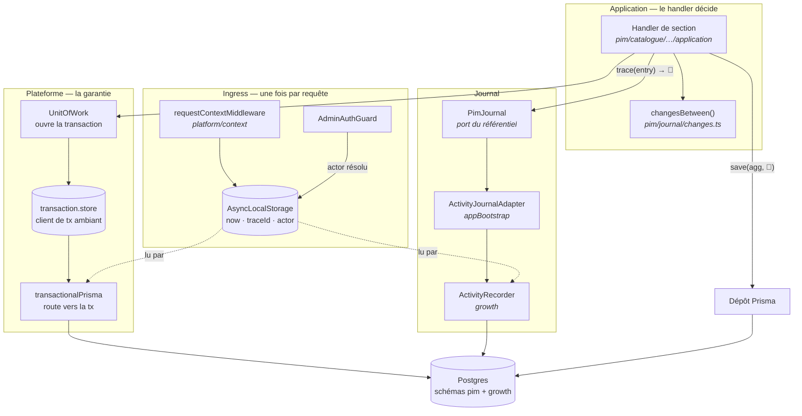
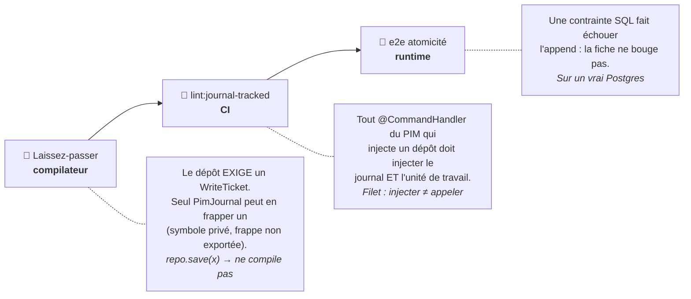

# Journalisation & traçabilité — qui écrit quoi, et ce qui l'y oblige

> **État : ✅ pour le référentiel (PIM).** Le mécanisme (contexte de requête,
> unité de travail, laissez-passer) vit dans `platform/` et pourra servir
> ailleurs ; aujourd'hui **seul le PIM s'en sert**. Le B2B garde son journal
> analytique, best-effort et non bloquant — c'est un arbitrage, pas un oubli
> (cf. [§ Ce qui n'est PAS journalisé](#ce-qui-nest-pas-journalisé)).

---

## 1. En une phrase

Quand quelqu'un modifie une fiche produit, une ligne part dans
`growth.activity_events` **dans la même transaction que la modification** : si
la trace échoue, la modification est annulée. Et le code est fait pour qu'on ne
puisse pas écrire sans tracer — **ça ne compile pas**.

---

## 2. Ce que c'est, et ce que ce n'est pas

|                     | Ce journal                                 | Un event store                         |
| ------------------- | ------------------------------------------ | -------------------------------------- |
| La vérité           | Les **tables**. Le journal est un témoin.  | Les **événements**. L'état est dérivé. |
| Reconstruire l'état | Par les diffs, à rebours de l'état courant | Par rejeu, par construction            |
| Coût                | Une ligne par geste                        | Projecteurs, versioning, upcasting     |
| Décision            | [ADR-11](adr.md) — event store **différé** | —                                      |

On fait de l'**event streaming** (audit, analytique), pas de l'event sourcing.
On ne reconstruit jamais l'état métier depuis le journal.

---

## 3. Anatomie d'une entrée

Un vrai enregistrement, après un renommage + reclassement :

```json
{
  "id": "01M0WHQP7S61EJGD11SKJ8M0M3",
  "type": "product.identity_saved",
  "schema_version": 1,

  "occurred_at": "2026-08-25T13:28:41.465Z",
  "recorded_at": "2026-08-25T13:28:41.483Z",

  "subject_type": "product",
  "subject_id": "01a0391b-d8cc-761f-95d6-046a1f46ba48",

  "actor_type": "staff",
  "actor_id": "staff-e2e",
  "actor_name": "Opérateur E2E",
  "actor_role": "Administrateur",

  "trace_id": "01f46bd72d51fb5103d66c5bb7f940cc",
  "idempotency_key": "product.identity_saved:01a0391b-…:01f46bd72d51fb5103d66c5bb7f940cc",

  "payload": {
    "changes": {
      "kind": { "from": "daily", "to": "made_to_order" },
      "name": {
        "from": { "fr": "Baguette" },
        "to": { "fr": "Baguette de tradition", "en": "Tradition baguette" }
      }
    }
  }
}
```

| Champ             | Qui le pose                   | Pourquoi c'est comme ça                                                                                                     |
| ----------------- | ----------------------------- | --------------------------------------------------------------------------------------------------------------------------- |
| `id`              | `IdGenerator` (ULID)          | Triable par le temps → pagination stable sur un flux append-only.                                                           |
| `type`            | l'émetteur (`PIM_EVENTS`)     | Un **fait métier**, pas une route HTTP : `product.identity_saved` se relit dans six mois, `PUT /products/:id/identity` non. |
| `occurred_at`     | `Clock` ← `RequestContext`    | Temps **métier**, gelé à l'entrée de la requête. Une requête = un instant.                                                  |
| `recorded_at`     | Postgres (`now()`)            | Temps d'**ingestion**. Diverge d'`occurred_at` sur un rejeu ou un traitement tardif.                                        |
| `actor_*`         | `ActorNamer` ← guard          | **Figés au moment de l'acte.** Le journal doit dire qui a agi ce jour-là et à quel titre, pas qui porte ce nom aujourd'hui. |
| `trace_id`        | middleware d'ingress          | Relie la ligne aux logs et aux erreurs de la même requête.                                                                  |
| `idempotency_key` | l'adaptateur PIM              | Dérivée du `trace_id` — voir [§ 6](#6-lidempotence--pourquoi-la-trace-et-pas-lhorloge).                                     |
| `payload.changes` | le handler (`changesBetween`) | Le diff, calculé **au serveur**. Un front qui annoncerait ses modifications serait cru sur parole.                          |

---

## 4. Le trajet complet d'un geste



**Si l'INSERT du journal échoue**, l'exception remonte, `UnitOfWork` ne commite
pas, et l'`UPDATE` est annulé avec. C'est prouvé en e2e sur un vrai Postgres,
en posant une contrainte SQL qui refuse l'événement attendu
(`test/pim-journal-atomicity.e2e-spec.ts`).

---

## 5. Qui injecte quoi



Le point non évident : **`pim` et `growth` sont deux schémas d'UNE seule base**.
C'est ce qui rend l'atomicité atteignable sans outbox ni 2PC. Deux bases, et
tout ce document serait faux.

### La frontière `pim` → `growth`

La matrice des frontières interdit à `pim` de voir `b2b`. Le référentiel déclare
donc son propre port (`PimJournal`), et **la racine de composition** le branche
sur le journal réel (`appBootstrap/pim-journal.module.ts`). Le PIM ne sait pas
qui écrit sa trace.

> ⚠️ Le port note qu'au **troisième bloc émetteur**, le journal doit être promu
> en `platform/`. Il y en a déjà trois (`commerce`, `catalogue/category`,
> `catalogue/product`) : le déménagement est dû.

---

## 6. L'idempotence — pourquoi la trace, et pas l'horloge

```
idempotency_key = `${type}:${subjectId}:${traceId}`
```

Un horodatage donnerait une clé neuve à chaque rejeu — donc une idempotence qui
n'idempote rien. Le `traceId`, lui :

- **survit au rejeu d'une même requête** → un doublon est un `no-op` silencieux
  (violation d'unicité attrapée et ignorée) ;
- **change entre deux requêtes** → deux corrections successives du même champ
  restent bien **deux faits**, ce qu'elles sont.

---

## 7. Deux garanties, et l'émetteur choisit

| Méthode                         | Comportement                      | Pour qui                                                                                                 |
| ------------------------------- | --------------------------------- | -------------------------------------------------------------------------------------------------------- |
| `ActivityRecorder.record`       | best-effort — n'échoue **jamais** | Analytique (une reco affichée, une étape franchie). Perdre une ligne dégrade une statistique.            |
| `ActivityRecorder.recordOrFail` | la panne **remonte**              | Traçabilité. Une trace manquée en silence est pire que l'échec : elle laisse croire que rien n'a changé. |

Le référentiel prend le second. **Contrepartie assumée : son journal devient un
point de panne du métier.**

---

## 8. Ce qui empêche d'écrire sans tracer

Trois couches, de la plus forte à la plus large :



### L'échappatoire, et pourquoi elle est visible

Toutes les écritures n'ont pas un événement à inscrire, et certaines ne l'ont
pas **encore**. `PimJournal.untraced(raison)` rend un ticket sans rien
journaliser — mais il faut l'écrire et dire pourquoi :

```ts
await this.categories.save(
  category,
  this.journal.untraced(
    "renommage de famille — aucun événement métier défini (dette journal-tracked)",
  ),
);
```

Deux familles de motifs aujourd'hui :

- **« section enregistrée sans modification »** — un geste sans effet n'a rien à
  raconter, et l'inscrire remplirait l'historique de bruit ;
- **la dette** — le geste mérite un fait, personne ne l'a encore nommé.

Une dérogation qu'on peut grep vaut mieux qu'une règle contournée en silence :
le but n'a jamais été d'empêcher, il a toujours été de **rendre visible**.

---

## 9. Les faits du référentiel

Définis dans `pim/journal/pim-journal.ts` (`PIM_EVENTS`).

| Fait                                                           | Émis par                       |
| -------------------------------------------------------------- | ------------------------------ |
| `product.identity_saved`                                       | section Identité               |
| `product.pricing_saved`                                        | section Tarif & logistique     |
| `product.declaration_saved`                                    | section Allergènes & nutrition |
| `product.editorial_saved`                                      | section Communication          |
| `product.media_saved`                                          | section Visuels                |
| `product.published` / `product.unpublished`                    | mise en vente / retrait        |
| `product.tva_changed` / `product.channels_changed`             | dérogations de la fiche        |
| `category.tva_changed`                                         | TVA d'une famille              |
| `tax_rate.created` / `.rate_changed` / `.renamed` / `.deleted` | référentiel des taux           |

---

## 10. Lire l'historique d'une fiche

La table est indexée `[subject_type, subject_id, occurred_at]`, et le lecteur
filtre déjà sur ces colonnes.

```sql
SELECT occurred_at, type, actor_name, payload
FROM growth.activity_events
WHERE subject_type = 'product' AND subject_id = $1
ORDER BY occurred_at DESC;
```

> 🟡 **L'écran n'existe pas encore.** Les faits sont écrits et lisibles ; l'onglet
> « Historique » de la fiche reste à faire.

---

## Ce qui n'est PAS journalisé

À jour au **2026-08-25**. Le chiffre exact sort de `pnpm lint:journal-tracked`.

- **14 handlers du PIM** écrivent sans fait nommé (dette déclarée et comptée) :
  ouverture / archivage / restauration d'une fiche, les six gestes sur les
  familles, les cinq sur les emplacements.
- **Tout le B2B** — commandes, sociétés, adresses, contacts, paiements,
  abonnements, règles de prix, annuaire staff. Ce que `growth` y écrit est
  analytique et **best-effort**. Y rendre le journal bloquant reviendrait à
  accepter qu'un hoquet d'append empêche un client de commander : c'est une
  décision produit, à prendre domaine par domaine.
- **Tout ce qui ne passe pas par un handler** : un `psql`, un seed, une
  migration, un import. C'est la limite assumée du niveau applicatif ; seule une
  capture au niveau de la base (CDC, triggers) l'attraperait.
- `updated_by` n'est rempli que sur les écritures de **`Product`**.

---

## Fichiers

| Rôle                             | Chemin                                                          |
| -------------------------------- | --------------------------------------------------------------- |
| Contexte de requête (ALS)        | `platform/context/request-context.{ts,store.ts,middleware.ts}`  |
| Unité de travail                 | `platform/database/unit-of-work.ts`                             |
| Routage vers la transaction      | `platform/database/{transaction.store,transactional-prisma}.ts` |
| Port du référentiel + ticket     | `pim/journal/pim-journal.ts`                                    |
| Diff `avant → après`             | `pim/journal/changes.ts`                                        |
| Branchement `pim` → journal réel | `appBootstrap/pim-journal.module.ts`                            |
| Journal réel (append)            | `b2b/growth/infrastructure/prisma-activity-recorder.ts`         |
| Table                            | `prisma/schema.prisma` → `model ActivityEvent`                  |
| Porte CI                         | `dev-toolbox/gates/journal-tracked.mjs`                         |
| Preuve d'atomicité               | `apps/lfd-api/test/pim-journal-atomicity.e2e-spec.ts`           |
