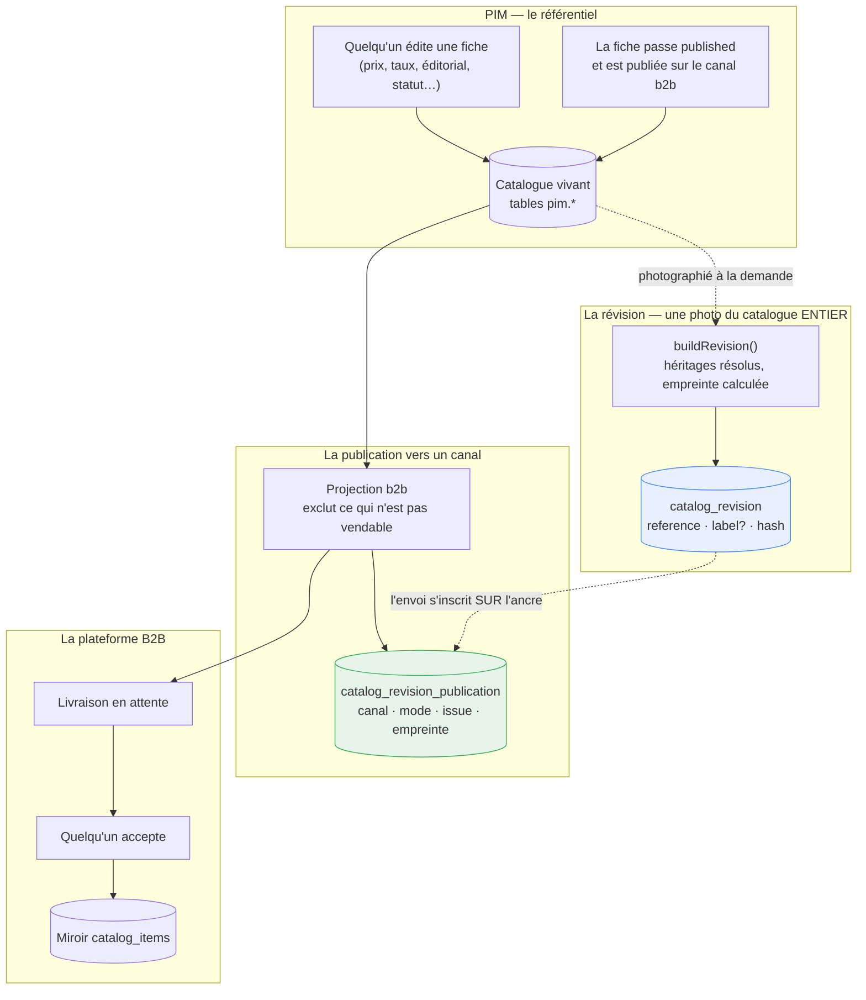
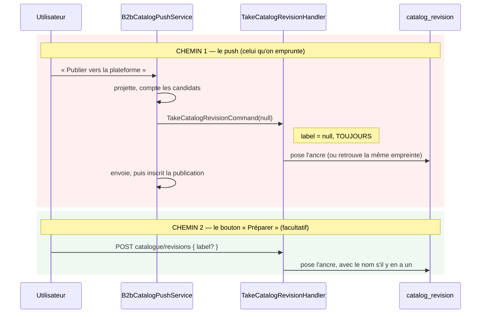
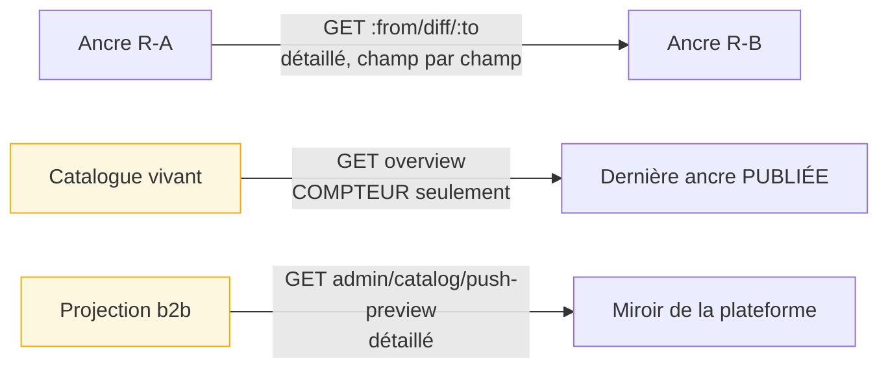

# La mécanique des révisions du catalogue — état réel

**État : 🟢 description de l'existant.** Date : 2026-09-10. Aucune décision ici,
aucun plan : ce document dit **ce que le code fait aujourd'hui**, pour qu'on
puisse décider ensuite.

> Vérifié en ouvrant chaque fichier cité, pas de mémoire. Les affirmations sur
> des comptes viennent de la base de développement au 2026-09-10.

---

## 1. Trois objets, et c'est là que le flou commence

Le vocabulaire courant en confond deux, et le code en distingue trois.

| Objet                                             | Portée                  | Naît quand                     | Porte un nom ?          |
| ------------------------------------------------- | ----------------------- | ------------------------------ | ----------------------- |
| **La fiche** (`Product`)                          | un produit              | quelqu'un la crée              | oui, c'est son libellé  |
| **La révision** (`CatalogRevision`)               | **le catalogue ENTIER** | on la pose, ou un push la pose | `label`, **facultatif** |
| **La publication** (`CatalogRevisionPublication`) | une révision × un canal | un envoi part                  | non — elle en hérite    |

🔴 **Une révision n'appartient à aucun produit.** C'est une photographie de tout
le catalogue. Modifier une fiche ne crée pas de révision, ne modifie aucune
révision, et n'est visible d'aucune révision existante : ça change seulement ce
que **la prochaine** photographie contiendra.

C'est la source du malentendu : on croit qu'éditer un produit « fait une
révision ». Non — ça déplace le catalogue par rapport à la dernière photo.

---

## 2. Le schéma d'ensemble

Deux choses à retenir du schéma :

- **le catalogue vivant est la seule source** ; l'ancre et la projection en
  sortent toutes deux, séparément et pour des questions différentes ;
- **l'ancre précède l'envoi.** Elle dit ce qu'on s'apprête à publier, pas ce qui
  est parti — un envoi qui échoue laisse donc une ancre sans publication.

---

## 3. Quand une révision naît — deux chemins, un seul est emprunté

🔴 **`push.service.ts:143` passe `null`.** C'est la seule raison des révisions
sans nom : personne n'est jamais interrogé. Le seul endroit où l'on peut nommer
est le bouton « Préparer une publication » de l'écran Révisions — facultatif, et
qu'un push rend inutile puisqu'il fige tout seul.

**Compté en développement le 2026-09-10 : 9 révisions, 5 sans nom, dont 3 déjà
publiées.**

---

## 4. Ce qui identifie une révision : son EMPREINTE, pas son moment

`catalog_revision.hash` est `@unique`. Une ancre répond à « le catalogue **était**
ceci » — c'est un contenu, pas un instant. Trois conséquences qu'on rencontre en
vrai :

- **reposer une ancre sur un catalogue inchangé ne crée rien.** La commande rend
  celle qui existait, et la publication s'inscrit dessus. Deux envois du même
  catalogue sont donc **deux publications d'UNE révision** ;
- **un nom ne justifie pas une nouvelle ancre.** Nommer différemment un
  catalogue identique ne le rend pas différent — le code le refuse
  explicitement ;
- **un aller-retour A → B → A retombe sur l'ancre A**, il n'en crée pas une
  troisième.

Ce qui entre dans l'empreinte : la fiche entière, héritages **résolus** (taux
effectif par contexte, matrice de canaux), l'éditorial, les URL des visuels, la
signature de fiche — plus un **en-tête global**, le rapport prix pro / prix
public. Ce dernier est là parce qu'il change toutes les factures sans qu'aucune
ligne de produit ne bouge.

Ce qui n'y entre pas : les fiches **archivées** (elles ne sont plus au
catalogue). Les **brouillons y sont**, avec leur statut — une ancre doit pouvoir
montrer qu'une fiche est passée en ligne entre deux versions.

---

## 5. Le diff : trois lectures, et une seule est vivante

| Lecture                              | Compare                                                 | Rend                                          |
| ------------------------------------ | ------------------------------------------------------- | --------------------------------------------- |
| `catalogue/revisions/:from/diff/:to` | deux ancres figées                                      | le détail, champ par champ, avec attribution  |
| `catalogue/revisions/overview`       | **le catalogue vivant** ↔ la dernière ancre **publiée** | **trois nombres** : ajoutés, retirés, changés |
| `admin/catalog/push-preview`         | la projection ↔ le miroir B2B                           | le détail de ce que l'envoi changerait        |

🔴 **Le diff vivant existe déjà**, et c'est important : `GetCatalogOverviewHandler`
construit en mémoire la révision du catalogue tel qu'il est (`buildRevision`,
exactement la même mécanique que la pose) et la compare à la dernière ancre
publiée. Il ne peut donc pas annoncer un changement que la capture ignorerait.

**Mais il est réduit à un compteur.** `countChanges` ne rend que trois nombres ;
le plan sait pourtant quels SKU sont concernés, et `DiffCatalogRevisionsHandler`
sait déjà charger paresseusement le détail des seuls articles dont l'empreinte
diffère. La matière est là ; ce qui manque est de la rendre.

⚠️ **La référence est la dernière ancre PUBLIÉE, pas la dernière posée.** Un
catalogue qu'on n'a jamais fait que simuler n'a donc aucune référence, et l'écran
n'affiche aucun écart — ce qui est exact : rien n'est parti.

---

## 6. Ce qui n'est relié à rien : la fiche produit

La fiche produit ne sait **rien** des révisions. Elle affiche :

- son statut (`draft` / `published` / `archived`) ;
- sa **signature** (`readyAt` / `readyBy`) et si elle est **périmée**
  (`readinessStale`, calculé sur les faits du journal, pas sur un horodatage) ;
- ce que la plateforme B2B en a fait (`app-b2b-delivery` : acceptée, écartée…).

Elle n'affiche pas, et ne sait pas calculer :

- **si son contenu a changé depuis la dernière révision** ;
- **quels champs** ont changé ;
- **quand ces changements partiront**.

Le `lastPushedAt` de `b2b_channel_binding` est ce qui s'en approche le plus, mais
il répond à « quand ce produit est-il parti la dernière fois », pas à « ce qu'il
porte aujourd'hui est-il parti ».

---

## 7. Ce que le canal reçoit, et ce que le canal refuse

L'ancre photographie **tout** ; la projection b2b, elle, **filtre**. Un article
peut donc être dans une révision et n'être jamais parti :

| Motif d'exclusion                | Ce qui manque                                     |
| -------------------------------- | ------------------------------------------------- |
| `canal_ferme`                    | la fiche n'est pas publiée sur le canal b2b       |
| `famille_inconnue`               | la famille n'existe pas côté projection           |
| `variant_sans_prix`              | pas de prix public                                |
| `variant_sans_taux`              | pas de taux de TVA pour le contexte professionnel |
| `variant_arretee`                | déclinaison arrêtée                               |
| `produit_sans_variante_vendable` | aucune déclinaison ne passe les filtres           |

Et **Shopify ne pose aucune ancre** : seul le canal `b2b` en crée. Une
publication Shopify n'a donc pas de révision à citer.

Côté plateforme, un envoi ne met rien en vente : il dépose une **livraison** que
quelqu'un doit relire et accepter, SKU par SKU s'il le faut.

---

## 8. Les quatre points flous, nommés

1. **Le push fabrique une ancre anonyme.** `TakeCatalogRevisionCommand(null)`,
   sans que personne soit interrogé. C'est la cause directe des révisions sans
   intention.
2. **Rien n'oblige à nommer.** `label` est `String?` en base, `nullish()` dans le
   schéma de la route, et aucune règle ne lit ce champ. Un envoi part aussi bien
   avec qu'il ne partirait sans.
3. **Le diff vivant est un compteur.** On sait qu'il y a « 3 changements depuis
   R-7WT4NA », jamais lesquels — donc jamais de quoi écrire une intention.
4. **La fiche produit est muette sur les révisions.** L'écran où l'on fabrique le
   changement est le seul qui ne dit rien de son sort.

⚠️ **Une contrainte de modèle à garder en tête pour la suite** : une révision est
**catalogue-large**. Nommer depuis une fiche produit ferait couvrir les
modifications de tout le monde par l'intention du premier qui a édité. Le moment
où une intention est à la fois _fraîche_ et _de bonne portée_ n'est pas évident,
et c'est exactement la décision à prendre.

---

## Où ça vit

| Quoi                       | Où                                                                              |
| -------------------------- | ------------------------------------------------------------------------------- |
| Le domaine de la révision  | `apps/lfd-api/src/pim/catalogue/revision/domain/revision.ts`                    |
| La pose                    | `apps/lfd-api/src/pim/catalogue/revision/application/take-catalog-revision.ts`  |
| L'état du catalogue        | `apps/lfd-api/src/pim/catalogue/revision/application/get-catalog-overview.ts`   |
| Le diff entre deux ancres  | `apps/lfd-api/src/pim/catalogue/revision/application/diff-catalog-revisions.ts` |
| Le push (et son ancre)     | `apps/lfd-api/src/pim/channels/b2b-platform/products/push.service.ts`           |
| La projection et ses refus | `apps/lfd-api/src/pim/channels/b2b-platform/products/projection.ts`             |
| L'écran Révisions          | `apps/lfc-B2B-admin-frontend/src/app/pim/revisions/`                            |
| La fiche produit           | `apps/lfc-B2B-admin-frontend/src/app/pim/catalogue/product-form/`               |
