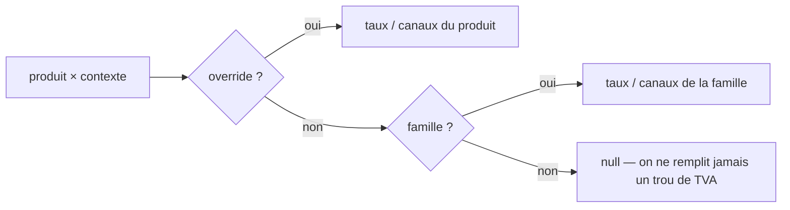

# Override **local au produit** — disponibilité et TVA

> Un produit hérite de sa famille : les canaux où il se vend, et le taux de TVA de chaque
> contexte. Ce doc décrit comment un produit **redéfinit** l'un ou l'autre pour lui seul, sans
> toucher sa famille ni les autres produits qu'elle porte.
>
> Statut : **🟡 moitié construite.** Rédigé le 2026-08-24, et la **TVA** l'a été le
> jour même : `product_context_tva`, le verbe, l'API, l'écran et le retrait de la
> collection Shopify obsolète (O0→O3). Reste la **disponibilité** — tout le §3 et
> la partie canaux du §2, encore 📐. Voir aussi
> [`tva-resolution.md`](./tva-resolution.md), qui décrit la chaîne complète.
>
> ⚠️ **Dépend de C0** ([`projection-sales-context.md`](./projection-sales-context.md), addendum) :
> la refonte data-driven des contextes. Écrire l'override AVANT C0 signifierait ajouter au produit
> les colonnes fixes (`emporterTvaId`, `surPlaceTvaId`, `b2bTvaId`) que C0 doit justement retirer de
> la famille — on paierait le modèle deux fois, et la seconde en migration.

---

## 1. Ce qui existe déjà — et ce qui n'est qu'une apparence

**La couture de résolution est en place.** `projectCatalog` résout le taux **par produit** avant de
projeter ses déclinaisons :

```ts
// pim/channels/b2b-platform/products/projection.ts
const { sellable } = sortVariants(product, category.b2bVatPercent);
// « Résolu ICI, une fois par produit : chaque article part avec SON taux, et
//   le récepteur n'a plus à rejoindre une famille pour savoir facturer. »
```

Tout l'aval est donc **déjà prêt** et ne changera pas : l'ingestion B2B, `CatalogItem`, et surtout
`OrderLine.vatRate`, qui **fige** le taux à la commande — une redéfinition ne réécrit jamais une
facture passée. Il ne manque que la **source** du nombre.

**En revanche, l'override côté écran est un fantôme.** `Product.channelsOverride` existe dans le
modèle front, `ChannelMatrix` porte déjà ses entrées `inherited` / `revert`, la liste des produits
distingue « hérité » de « personnalisé »… et `backendToProduct` écrit `channelsOverride: null` en
dur. Rien dans Prisma, rien dans les contrats, rien dans l'API. **L'écran affirme plus qu'il ne
sait** — même défaut que le « Ajouter par URL » retiré le 2026-08-24. Ce doc le comble ou, à
défaut, justifie de retirer le vestige.

## 2. Le modèle : une ligne qui existe, jamais une colonne vide

La règle des trois natures ([`data-model/04`](./data-model/04-composition-et-canaux.md)) dit déjà
comment : _« pas de valeurs inexistantes : ça s'atteint par **absence de ligne**, pas par colonnes
`NULL` »_. L'override suit donc **exactement la forme** que C0 donne à la famille, un cran plus
bas :

| Table                                                      | Clé                                         | Porte         | Absence de ligne       |
| ---------------------------------------------------------- | ------------------------------------------- | ------------- | ---------------------- |
| `category_context_tva` (C0)                                | `(category_id, context_id)`                 | `tva_rate_id` | la famille ne dit rien |
| **`product_context_tva`**                                  | `(product_id, context_id)`                  | `tva_rate_id` | le produit **hérite**  |
| `category_context_channel` (C0, cousin de `channelPreset`) | `(category_id, context_id, emplacement_id)` | vendu         | non vendu              |
| **`product_context_channel`**                              | `(product_id, context_id, emplacement_id)`  | vendu         | voir §3                |

Aucune colonne ajoutée au socle `product` : le sens de la FK ne s'inverse pas.

## 3. La disponibilité : tout-ou-rien, et c'est un choix

La TVA se redéfinit **par contexte** — les trois taux sont des faits indépendants, et « 20 % en B2B,
5,5 % au comptoir » est le cas courant, pas l'exception.

La **disponibilité**, non : elle se redéfinit **en bloc**. Une matrice à moitié redéfinie est
illisible — on ne saurait pas dire, devant une case vide, si le produit n'est pas vendu là ou si la
famille ne l'y vendait pas. D'où un marqueur explicite :

`product_channel_override` — PK/FK `product_id`, sans autre colonne que la traçabilité
(`decided_at`, `decided_by`).

- **Ligne absente** → le produit hérite intégralement de sa famille ; `product_context_channel` est
  vide et ne se lit pas.
- **Ligne présente** → le produit ne lit plus que ses propres lignes `product_context_channel`,
  fussent-elles zéro (« vendu nulle part » est alors une décision, pas un oubli).

C'est le motif que le B2B applique déjà à ses décisions locales : _« l'adaptateur **supprime** la
ligne d'override au lieu d'en écrire une neutre — revenir au prix du PIM redevient l'absence de
décision, pas une décision vide »_ (`catalog-item.ts`).

## 4. La résolution — une seule fonction, deux appelants



Elle vit dans le domaine catalogue, pure, et **les deux projections l'appellent** — B2B et Shopify.
C'est la condition pour que la parité ne dérive pas : `check-catalog-parity` compare déjà
`vatRate` par SKU entre le PIM et son miroir B2B, et il ne compare juste que si les deux côtés
descendent du même résolveur.

Le `null` reste transmis tel quel : la plateforme écarte de sa boutique un article sans taux plutôt
que de supposer 5,5 % — règle déjà en place, que l'override ne desserre pas.

## 5. L'écran : le panneau de la famille, tel quel

`CategoryPanel` compose déjà `ChannelMatrix` + les listbox de taux, et `ChannelMatrix` a été écrit
avec `inherited` et `revert`. Le panneau produit **réutilise les deux composants** :

- ouverture pré-remplie par les valeurs **héritées**, affichées comme telles ;
- « Redéfinir » écrit les lignes du produit — le lien que la maquette pose depuis le début et que
  l'encadré des taux ne montre pas encore, faute de quelque chose derrière ;
- « Revenir au défaut » **supprime** les lignes ; c'est très exactement ce que `ChannelMatrix.revert`
  émet aujourd'hui dans le vide.

L'encadré « Tarif & TVA » de la fiche gagne alors, par ligne, la marque « redéfini » — et le
`titre` de la famille cesse d'être une promesse à sens unique.

## 6. Deux pièges, nommés avant de coder

1. **Shopify range la TVA par collection.** Invariant S2 : un produit n'est membre que d'**une**
   collection `tva-*`. Un produit qui quitte le taux de sa famille doit être **ôté de l'ancienne**
   collection et rangé dans la nouvelle — sinon la pousse réussit et facture au taux familial, en
   silence. Le handle, lui, n'est pas concerné : l'override ne change pas l'URL (C0-bis intact).
2. **Le B2B a déjà ses décisions locales** (`LocalDecision : priceCents / isHidden / isFeatured`).
   Ce sont **deux questions distinctes** : le PIM dit ce qui est **publié au canal**, le B2B dit ce
   qu'il **montre dans sa boutique**. On ne les fusionne pas ; un produit dépublié côté PIM
   disparaît du miroir, un produit caché côté B2B reste connu et reviendra d'un clic.

## 7. Slices

| Slice  | Contenu                                                                                                      | Dépend de |
| ------ | ------------------------------------------------------------------------------------------------------------ | --------- |
| **O0** | Les tables (`product_context_tva`, `product_channel_override`, `product_context_channel`) + le résolveur pur | **C0**    |
| **O1** | Contrats + API : lecture d'une fiche **avec sa provenance** (`hérité` / `redéfini`), écriture, remise à zéro | O0        |
| **O2** | Panneau produit — `ChannelMatrix` + listbox de taux, « Redéfinir » / « Revenir au défaut »                   | O1        |
| **O3** | Shopify : ôter de l'ancienne collection `tva-*` quand le taux résolu change (piège 1)                        | O0        |

## 8. Revue adverse

1. **La TVA est de l'argent.** Un override mal résolu ne se voit pas à l'écran, il se voit sur une
   facture. D'où : un seul résolveur, appelé par les deux projections, et la parité qui compare.
2. **« Redéfini » doit se voir dans la LISTE**, pas seulement dans la fiche. Un catalogue où trois
   produits sur deux cents dérogent à leur famille est ingérable si la dérogation ne se lit qu'en
   ouvrant chaque fiche. La liste distingue déjà hérité/personnalisé pour les canaux — c'est le
   vestige du §1, à rebrancher plutôt qu'à réinventer.
3. **Le risque de l'override facile.** Une famille dont la moitié des produits dérogent n'est plus
   une famille : elle est mal découpée. Métrique à exposer un jour sur l'écran des familles — le
   nombre de dérogations —, pas un garde-fou technique.
4. **Ordre imposé.** Faire O0 avant C0 ajouterait au produit les colonnes fixes que C0 retire de la
   famille. Ce doc existe surtout pour que cette erreur-là ne soit pas commise vite fait un soir.
