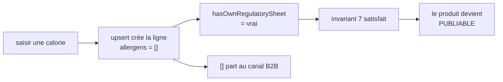

# Plan — séparer les allergènes de la nutrition (v2)

> **État : 📐 conception. Rien n'est bâti.**
>
> **Ouvert le 2026-09-22** sur une question de Hugo, **réécrit le même jour**
> après `vitruve` : 3 BLOQUANT, 9 SÉRIEUX. La v1 est tombée entière, et le §9
> dit ce qu'elle affirmait de faux.
>
> 🔴 **Ce plan porte une migration de données et touche une donnée
> RÉGLEMENTAIRE** — une erreur s'imprime sur une étiquette. `vitruve` a tourné
> sur la v1 ; il repasse sur celle-ci avant toute construction.
>
> **Les quatre questions de la v1 sont tranchées** (Hugo, 2026-09-22) et leurs
> réponses sont au §3.

---

## 1. Ce que la v1 avait mal vu, et qui renverse la conception

La v1 proposait **deux routes sur la même table**, en renvoyant la séparation de
la table à un lot optionnel « si un besoin le demande ». C'était l'inverse de ce
qu'il faut faire, pour une raison qu'elle n'avait pas mesurée.

🔴 **`allergens` est `NOT NULL` en base.** Le `null` du domaine — « personne ne
s'est prononcé » — n'est pas une colonne : c'est **l'absence de ligne**. Et
l'écriture est un `upsert`.

Donc une route « les valeurs nutritionnelles, et rien d'autre » sur une
déclinaison sans fiche **crée la ligne**, donc écrit `allergens: []` — qui est
une **affirmation positive** : « aucun allergène ».

**Un produit publiable sans que personne n'ait déclaré quoi que ce soit.** Et le
refus que l'outil WebMCP oppose déjà à ce cas — que la v1 rangeait en
« contournement à supprimer » — est **la seule garde qui existe contre lui**.

---

## 2. La vraie racine : l'écriture contourne l'agrégat

`declare-product-nutrition.ts` charge le produit, s'en sert pour **lire**
(`requireVariant`, le libellé, le diff)… puis écrit par
`NutritionRepository.declare(variantId, …)`, **sans repasser par l'agrégat**.

> `variant.ts` le dit déjà, en le présentant comme un choix : « La fiche
> réglementaire est ici en **lecture seule** : elle s'écrit par son propre verbe,
> à travers `NutritionRepository`. »

🔴 **C'est ce contournement qui rend B1 possible.** L'agrégat est le seul objet
qui voit la différence entre « une fiche existe » et « quelqu'un a déclaré » —
et on lui retire l'écriture, donc le droit de refuser.

### Non, la nutrition ne devient pas un agrégat

Hugo a posé la question, et la règle de tri du dépôt y répond
(CLAUDE.md §3.1) : _« existe-t-il une règle qui peut refuser cette écriture ? »_

| Règle                                                      | À qui appartient-elle ?                      |
| ---------------------------------------------------------- | -------------------------------------------- |
| valeurs ≥ 0, « dont saturés ≤ gras », pas de chevauchement | au **value object** — et elles marchent déjà |
| « publiable ⇒ chaque déclinaison active est couverte »     | au **produit** — invariant 7                 |
| « une fiche existe ⇒ quelqu'un a déclaré »                 | au **produit**, seul à voir les deux         |

**Aucune règle n'appartient à la nutrition elle-même.** Elle n'a ni état ni
transition — pas de brouillon, pas de validation, pas de cycle. En faire un
agrégat serait la « cérémonie » que le `CLAUDE.md` nomme.

➡️ **Ce qu'il faut, c'est rendre l'écriture à l'agrégat qui existe** :
`product.declareAllergens(variantId, …)` et `product.declareNutrition(…)`, puis
`products.save(product)`.

---

## 3. Les cinq décisions, tranchées

| #      | Question                                   | Réponse de Hugo (2026-09-22)                                   |
| ------ | ------------------------------------------ | -------------------------------------------------------------- |
| **D1** | Un drapeau d'alignement, ou deux ?         | **Deux** — un pour les allergènes, un pour la nutrition        |
| **D2** | La publication n'exige que les allergènes  | **On l'écrit** — la nutrition est facultative à la publication |
| **D3** | « Nutrition sans déclaration d'allergène » | **On le dit** — c'est un état nommé, et il n'est pas publiable |
| **D4** | Un fait de journal, ou deux ?              | **Deux**                                                       |
| **D5** | Séparer la table ?                         | **Oui** — « on va finir par séparer la table »                 |

🔴 **D5 n'est plus un lot optionnel : c'est ce qui rend B1 inexprimable.** Deux
tables font de « nutrition renseignée, allergènes non déclarés » une **ligne
honnête et sans danger**, au lieu d'un état qu'on empêche à force de vigilance.

C'est la hiérarchie des garde-fous du dépôt, appliquée dans le bon ordre :
**inexprimable** > refusé en base > refusé par l'agrégat > porte CI > relecture.
La v1 s'arrêtait à « refusé par l'agrégat », et encore, sans l'agrégat.

---

## 4. Où va `mayContain` — la ligne de coupe corrigée

🔴 **La v1 se trompait de pivot.** `mayContain` est aujourd'hui un champ de
l'instantané **nutrition**, alors que c'est une **déclaration d'allergène**,
soumise au même référentiel et à la même garde de chevauchement.

| Table               | Colonnes                                               |
| ------------------- | ------------------------------------------------------ |
| `variant_allergens` | `allergens`, `mayContain` — la déclaration de sécurité |
| `nutrition_values`  | les 8 valeurs de l'annexe XV                           |

Les deux en `PK = FK` sur la déclinaison, chacune **absente tant que personne
n'a rien dit**. Le tri-état (`null` / `[]` / une liste) devient alors ce qu'il
prétend être : l'absence de ligne, une ligne à tableau vide, une ligne remplie.

---

## 5. 🔴 Un bug vivant, à fermer AVANT le chantier

L'écran de la fiche produit n'a **aucune interface pour les traces**. Sa charge
utile n'envoie donc jamais `mayContain`, et le serveur applique
`input.mayContain ?? []`.

**Chaque enregistrement de la section réglementaire depuis le back-office efface
les traces possibles** — celles que le semis pose, celles que l'outil WebMCP
prend soin de réécrire. Le journal porte le libellé « Traces possibles » pour
l'annoncer ; personne ne l'a lu.

⚠️ **Ce bug ne dépend pas de ce plan et ne doit pas l'attendre.** Il se ferme
seul, en deux gestes : l'écran renvoie ce qu'il a lu (comme le fait déjà l'outil
WebMCP), ou le serveur cesse de traiter l'absence comme un effacement.

---

## 6. Ce que le plan NE promet pas

⚠️ **Le _lost update_ ne disparaît pas.** La v1 le promettait ; c'est faux. Deux
personnes qui éditent les **mêmes** valeurs s'écrasent toujours : le port est un
`upsert` nu, sans version ni `If-Match`. Séparer réduit la **surface** (une
écriture nutrition ne peut plus effacer une déclaration d'allergène), elle
n'introduit aucun mécanisme de concurrence.

⚠️ **`alreadyDeclared` reste nécessaire.** La v1 y voyait un contournement de la
soudure ; c'est faux. Il sert aux **codes archivés** (D2 bis) : « peut-on
l'ajouter ? » dépend de ce que la fiche déclarait déjà. La route `allergens` en
aura besoin à l'identique.

---

## 7. Le périmètre réel

La v1 comptait « une route, une commande, un handler, une méthode de port ».
`vitruve` a montré que le compte est faux. Ce que **deux faits de journal**
entraînent :

| Où                                                              | Pourquoi                                                 |
| --------------------------------------------------------------- | -------------------------------------------------------- |
| `product/domain/content-facts.ts`                               | table **exhaustive tenue par un test**                   |
| `catalogue/revision/domain/attribution.ts`                      | idem — « un fait ajouté sans entrée ici ne compile pas » |
| `packages/contracts/src/journal-facts/referential-catalogue.ts` | le baril `@lfd/contracts`, **pas** `pim-contracts`       |
| `shared/journal/phrases/referential-phrases.ts`                 | la phrase lue par le staff                               |

🔴 **Le piège de fond** : un fait oublié dans `content-facts` **ne périme plus
la signature « publiable »**, et le silence s'y lit « rien n'a changé ».

Deux autres écrivains que la v1 ne nommait pas : `create-product.ts` écrit une
déclaration complète par le même `DeclarationInput`, et le semis la rejoue par
le bus.

⚠️ **La racine dès que `packages` bouge** — et ça bouge deux fois.

---

## 8. Les lots

| Lot | Contenu                                                                               | Bloque par |
| --- | ------------------------------------------------------------------------------------- | ---------- |
| 0   | 🔴 **Le bug des traces** (§5) — indépendant, à prendre d'abord                        | —          |
| 1   | **Étendre** : les deux tables, écrites en parallèle de l'ancienne                     | —          |
| 2   | L'écriture revient dans l'agrégat : `product.declareAllergens` / `declareNutrition`   | 1          |
| 3   | Les deux routes, les deux commandes, les **deux faits** (§7)                          | 2          |
| 4   | Les deux drapeaux d'alignement (D1) — ⚠️ colonne **et** valeur de journal (`aspect`)  | 2          |
| 5   | **Basculer** : les lectures passent aux nouvelles tables ; l'invariant 7 s'écrit (D2) | 3, 4       |
| 6   | L'écran : deux sections, deux enregistrements, **et les traces**                      | 5          |
| 7   | **Resserrer** : l'ancienne table part, l'ancienne route aussi                         | 6          |

🔴 **Trois déploiements, pas un** (CLAUDE.md §0) : étendre, basculer, resserrer.

⚠️ **Le resserrage doit choisir, et le dire** : une ancienne route qui reçoit
encore `allergens` doit **refuser** (400), jamais l'ignorer en silence. Sur du
réglementaire, un 200 qui n'écrit rien est le pire des deux.

⚠️ **Les noms des deux faits sont gratuits jusqu'au premier merge dans `main`**,
et coûtent une migration de valeurs ensuite. Les arrêter au lot 3.

---

## 9. Ce que la v1 affirmait, et qui était faux

| Affirmation de la v1                                             | Ce que `vitruve` a montré                                             |
| ---------------------------------------------------------------- | --------------------------------------------------------------------- |
| « Deux routes, la même table » suffit                            | Crée un produit publiable sans déclaration (§1)                       |
| « Le domaine sépare déjà les deux »                              | Vrai pour `allergens`, faux pour le SUJET : `mayContain` est ailleurs |
| « Le handler perd son contournement »                            | `alreadyDeclared` sert aux codes archivés, pas à la soudure           |
| « Le _lost update_ disparaît »                                   | Non : l'`upsert` reste nu                                             |
| « Nutrition sans allergènes : rien à inventer, juste à le dire » | Il n'y a pas de place dans le modèle — il fallait la faire            |
| Périmètre : « une route, une commande, un handler »              | Deux tables exhaustives, deux barils, l'écran du journal              |
| Séparer la table : optionnel                                     | C'est ce qui rend le danger **inexprimable**                          |
