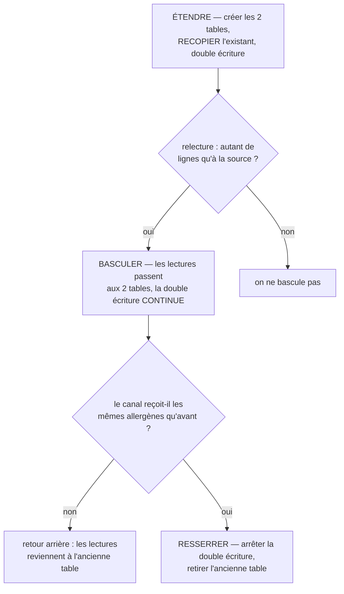

# Plan — séparer les allergènes de la nutrition (v3)

> **État : 📐 conception. Rien n'est bâti**, sauf les deux correctifs du §2.
>
> **Ouvert le 2026-09-22**, réécrit deux fois le même jour après `vitruve` :
> 3 BLOQUANT sur la v1, 4 sur la v2. Le §11 dit ce que chacune affirmait de faux.
>
> 🔴 **Migration de données sur une donnée RÉGLEMENTAIRE** — une erreur
> s'imprime sur une étiquette. `vitruve` repasse avant toute construction.

---

## 1. Pourquoi séparer

La fiche réglementaire d'une déclinaison est **une route, un handler, une
table**. Deux sujets y sont soudés : ce que le produit **contient** (sécurité) et
ce qu'il **vaut** (nutrition). Trois couches les traitent pourtant déjà comme
deux :

| Couche                       | Déjà séparés ?                                              |
| ---------------------------- | ----------------------------------------------------------- |
| Le domaine                   | ✅ deux champs nullables indépendants sur `VariantSnapshot` |
| La validation                | ✅ aucun invariant ne traverse les deux groupes             |
| La publication               | ✅ `hasOwnRegulatorySheet` ne lit **que** les allergènes    |
| Route · port · table · écran | 🔴 soudés                                                   |

**Les trois couches qui décident les traitent comme deux sujets ; les quatre qui
écrivent les traitent comme un seul.**

Le vocabulaire le dit : la route s'appelle `nutrition`, son commentaire dit
« Section **Allergènes** », l'écran dit « Allergènes **&** nutrition ».

---

## 2. Ce qui est déjà fait, et qui a servi de preuve

| Lot | Correctif                                                    | Commit      |
| --- | ------------------------------------------------------------ | ----------- |
| 0a  | L'enregistrement de la fiche n'efface plus les **traces**    | `c7d9034ad` |
| 0b  | S'aligner sur le défaut ne détruit plus son **tarif propre** | `85eb56359` |

Le second n'était pas prévu : `vitruve` l'a trouvé en contredisant la v2, qui
s'apprêtait à **étendre ce défaut à la donnée réglementaire**. `save()`
persistait l'instantané RÉSOLU ; une déclinaison alignée recevait le prix du
défaut dans sa colonne propre. L'agrégat expose désormais deux instantanés —
`snapshot()` pour ce qui lit, `persistenceSnapshot()` pour ce qui écrit.

🔴 **À retenir pour le lot 2** : le jour où `save` persistera les deux nouvelles
tables, il devra le faire depuis `persistenceSnapshot()`. Le faire depuis l'autre
recopierait la fiche du défaut chez chaque déclinaison alignée, et
`hasOwnRegulatorySheet` passerait à vrai **pour toujours**.

---

## 3. Les six décisions (Hugo, 2026-09-22)

| #      | Question                                   | Réponse                                                      |
| ------ | ------------------------------------------ | ------------------------------------------------------------ |
| **D1** | Un drapeau d'alignement, ou deux ?         | **Deux** — un allergènes, un nutrition                       |
| **D2** | La publication n'exige que les allergènes  | **On l'écrit** — la nutrition est facultative                |
| **D3** | « Nutrition sans déclaration d'allergène » | **On le dit** — état nommé, non publiable                    |
| **D4** | Un fait de journal, ou deux ?              | **Deux**                                                     |
| **D5** | Séparer la table ?                         | **Oui**                                                      |
| **D6** | Où vit « aucun allergène » ?               | **Avec les allergènes** — « pas de nutrition, si on sépare » |

### 🔴 D6 est ce qui rend le danger inexprimable

`allergens` est `NOT NULL` : le `null` du domaine est **l'absence de ligne**, et
l'écriture est un `upsert`. Dans la table unique, une route « nutrition seule »
créerait la ligne avec `allergens: []` — une affirmation **positive**, qui rend
le produit publiable sans que personne n'ait déclaré.

Deux tables, et le tri-état devient littéral :

| État                       | Dans `variant_allergens`    | Ce que ça dit            |
| -------------------------- | --------------------------- | ------------------------ |
| personne ne s'est prononcé | **pas de ligne**            | silence                  |
| « aucun allergène »        | une ligne, tableau **vide** | affirmation **positive** |
| des allergènes             | une ligne, tableau rempli   | déclaration              |

La route nutrition n'a alors **aucun moyen** d'écrire dans l'autre table.

⚠️ **Ce que ça ne rend pas inexprimable** : ce qui refuse la publication reste un
getter d'agrégat. La v2 revendiquait le premier rang de la hiérarchie pour les
deux ; seul D6 le mérite.

### D5 a survécu à trois alternatives (2026-09-22)

Hugo : « c'est quoi le plus pur ? » — puis « deux tables go ». Les alternatives
sont écrites ici pour qu'on ne les rejoue pas.

| Option                                 | Rang | Ce qui cloche                                                                   |
| -------------------------------------- | ---- | ------------------------------------------------------------------------------- |
| Règle d'agrégat seule                  | 3    | ne garde que ce qui passe par lui — or l'écriture le CONTOURNE                  |
| Booléen `allergens_declared` + `CHECK` | 1    | **redondance** : la contrainte est l'aveu que deux choses peuvent se contredire |
| Colonne `allergens` **nullable**       | 1    | deux façons de dire « personne n'a parlé » : pas de ligne, ou `NULL`            |
| **Deux tables**                        | 1    | coûteux — recopie, trois déploiements, double écriture                          |

🔴 **L'argument qui tranche** : un booléen encode « quelqu'un a-t-il parlé ? »
comme une **donnée**, posée à côté de la donnée dont elle parle. L'absence de
ligne l'encode comme une **structure**. Une donnée peut être fausse ; une
structure, non.

Et les cycles de vie sont réellement indépendants : les allergènes se déclarent
quand on connaît la recette, la nutrition quand une analyse revient. Deux tables
laissent chacune naître seule ; une table les force à partager une naissance.

C'est aussi la règle que `data-model/04-composition-et-canaux.md` énonce déjà :
une couche canonique est `PK = FK`, présente **seulement quand elle a quelque
chose à dire**. Deux sujets, deux couches.

⚠️ **Le booléen nu, sans contrainte, était le piège.** Le front porte déjà ce
motif — `declaresNone` à côté de `selected`, que rien ne tient d'accord : à
l'enregistrement, le booléen gagne et la liste est **jetée en silence**. On
n'aurait pas supprimé l'état faux, on l'aurait déplacé.

⚠️ **Ce que la colonne nullable avait pour elle**, et qu'on paie en la refusant :
80 % du résultat pour 10 % du prix. Le schéma actuel **contredit son domaine** —
`allergens` est `NOT NULL` là où le domaine dit `string[] | null`. Deux tables
corrigent ça aussi, mais plus cher. Si le chantier devait être abandonné en
cours de route, c'est le repli à prendre.

### D2 appelle une ligne que ce plan ne peut pas écrire

« La nutrition est facultative à la publication » **engage l'étiquette**. Le
règlement 1169/2011 prévoit des exemptions, et le dépôt vend majoritairement
**non préemballé** — c'est déjà l'argument d'ADR-14 pour descoper le GTIN.

➡️ 🔵 **À confirmer par Hugo, avec son comptable ou son conseil** : sur quelle
exemption repose D2 ? Tant que la phrase n'est pas là, D2 est une préférence
technique déguisée en décision réglementaire.

---

## 4. Le modèle cible

| Table               | Colonnes                                               | Absente quand        |
| ------------------- | ------------------------------------------------------ | -------------------- |
| `variant_allergens` | `allergens`, `mayContain` — la déclaration de sécurité | personne n'a déclaré |
| `nutrition_values`  | les 8 valeurs de l'annexe XV                           | rien n'est renseigné |

Les deux en `PK = FK` sur la déclinaison.

🔴 **`mayContain` change de côté**, et la v2 l'avait sous-estimé. Il vit
aujourd'hui dans `VariantNutritionView` (`packages/pim-contracts`), lu par le
front. Le laisser sous `nutrition` avec **deux drapeaux** le ferait résoudre par
le drapeau NUTRITION alors que c'est un fait d'allergène : une déclinaison
alignée sur les allergènes mais pas sur la nutrition imprimerait des traces
venues de la mauvaise source.

⚠️ La vue publique bouge donc aussi, et avec elle une combinaison **neuve** :
`allergens: null` + `nutrition: {…}`, impossible aujourd'hui (une seule table),
rendue possible par D3. Le lot 5 doit recenser les consommateurs qui supposaient
le couplage.

---

## 5. 🔴 La reprise — ce que la v2 ne disait pas du tout

La v2 écrivait « les deux tables, écrites **en parallèle** », donc les nouvelles
écritures seulement, puis basculait les lectures. **Toute fiche non re-déclarée
entre les deux aurait lu `allergens = null`** — l'invariant 7 tombe, et
`projection.ts` transmet ce `null` **tel quel** au canal B2B, avec le commentaire
« rien n'a été déclaré ». Des fiches en vente seraient parties sans allergènes.

### La bascule, en trois déploiements

**Ce que chaque étape garantit :**

- **La recopie est dans le déploiement 1**, pas plus tard. Une migration additive,
  `nutrition_declaration → variant_allergens + nutrition_values`, ligne à ligne.
  `allergens: []` y reste `[]` — c'est une affirmation, elle se recopie telle
  quelle.
- **Le retour arrière du déploiement 2 est gratuit** : la double écriture
  continue, donc l'ancienne table est encore juste. C'est ce qui rend la bascule
  réversible, et pourquoi elle ne s'arrête qu'au déploiement 3.
- **La relecture est une condition, pas une formalité.** Compter les lignes de
  part et d'autre, et comparer ce que le canal reçoit **avant** et **après**.

⚠️ 🔵 **À mesurer avant d'écrire la migration** : combien de déclinaisons portent
une `nutrition_declaration` en production, et combien sont alignées. Ça décide si
une reprise ratée est une gêne ou un retrait de catalogue.

---

## 6. 🔴 Le journal — et un piège que la v2 ne voyait pas

`product.declaration_saved` est **déjà posé en production**. Quatre lecteurs en
dépendent : `content-facts.ts` (table exhaustive tenue par un test),
`attribution.ts` (idem), le baril `packages/contracts`, et la phrase du
back-office.

**Le précédent existe et s'utilise** — `variant.regulatory_aligned` a été remplacé
le 2026-09-03 sans migration, et reste au catalogue en `retired(...)` : « le type
existe en base mais plus aucun code ne l'écrit. Il reste au catalogue pour que ses
lignes se lisent toujours ; l'écrire aujourd'hui est une faute. »

➡️ **Même geste ici** : l'ancien fait passe en `retired`, **et reste à `true` dans
`CONTENT_FACTS`**. Sans ça, les faits passés cessent d'être « de contenu », et une
signature « publiable » posée avant la bascule cesserait d'être périmée par les
déclarations qui l'ont précédée — le piège que ce plan nomme au §8.

### 🔴 Le fait nutrition n'a nulle part où s'attribuer

`attribution.ts` associe chaque fait aux champs de révision qu'il touche.
`productDeclarationSaved` y vaut `["allergens"]` — et `revision.ts` ne porte
**que** `allergens`. **Il n'y a pas de champ nutrition dans une révision.**

Trois sorties, aucune gratuite :

| Sortie                                     | Ce qu'elle coûte                                                             |
| ------------------------------------------ | ---------------------------------------------------------------------------- |
| Attribuer la nutrition à `["allergens"]`   | **ment** : l'historique dirait qu'un allergène a changé                      |
| Attribuer à `[]`                           | la nutrition devient **invisible** de l'historique d'une fiche réglementaire |
| Ajouter un champ `nutrition` à la révision | 🔴 **change TOUTES les empreintes**                                          |

🔴 **La troisième est un piège sérieux.** L'empreinte d'un article de révision est
un SHA-256 de sa **forme canonique entière** (`fingerprint.ts`). Ajouter un champ
change l'empreinte de **chaque** article : à la comparaison suivante, le catalogue
entier apparaîtrait **modifié**, sans qu'une seule fiche ait bougé.

➡️ 🔵 **À trancher par Hugo.** Ma recommandation : **`[]` d'abord**, et le champ de
révision dans un chantier séparé qui assume le rebasculement d'empreintes — il en
vaut peut-être la peine, mais pas en passager de celui-ci.

---

## 7. 🔴 Les deux drapeaux (D1) — une migration, pas une case

La v2 le décrivait en une demi-ligne. Ce que ça touche vraiment :

| Où                                              | Quoi                                                           |
| ----------------------------------------------- | -------------------------------------------------------------- |
| `product_variant`                               | une colonne de plus, et **la valeur des lignes existantes**    |
| La migration du 2026-09-03                      | un `CHECK` à dédoubler (le défaut ne se suit pas lui-même)     |
| `packages/contracts` · `journal-facts`          | l'enum `aspect: "regulatory" \| "pricing"` — **valeur servie** |
| `packages/pim-contracts`, le front, les phrases | six fichiers de plus                                           |

🔴 **La valeur initiale décide d'une perte silencieuse.** Si le drapeau nutrition
naît à `false` là où `regulatory_follows_default` valait `true`, chaque
déclinaison alignée **perd le tableau nutritionnel du défaut**. Il naît donc à la
**même valeur** que celui qu'il dédouble.

⚠️ **L'enum `aspect` est déjà posée dans des faits.** Dédoubler rend ambigus tous
les `variant.aligned` passés : « aligné sur regulatory » ne dira plus lequel des
deux. Le même champ a **déjà coûté un retrait de fait** le 2026-09-03.

➡️ La nouvelle valeur s'**ajoute** (`"allergens"`, `"nutrition"`), l'ancienne passe
en lecture seule. On ne renomme pas une valeur servie.

---

## 8. Le périmètre réel

- **Deux tables exhaustives refusent de compiler** sur un fait neuf :
  `content-facts.ts` et `attribution.ts`. Ce sont elles qui arrêtent, pas la
  relecture.
- **Deux barils** : `packages/contracts` (les faits) **et**
  `packages/pim-contracts` (les vues). ⚠️ « La racine dès que `packages` bouge »
  s'applique deux fois.
- **Deux écrivains que la v1 ignorait** : `create-product.ts` écrit une
  déclaration complète par le même `DeclarationInput`, et le semis la rejoue par
  le bus.
- 🔴 **L'outil WebMCP** (`pim-agent-tools.ts`) appelle la route que le lot 7
  supprime, et c'est **le seul écrivain qui préserve `mayContain`**. Sa garde — le
  refus d'écrire quand les allergènes valent `null` — devient caduque avec D6 et
  doit être **re-décidée**, pas laissée.
- **L'atomicité n'est pas acquise** : aujourd'hui le ticket de journal est créé
  dans `uow.run` puis passé à `nutrition.declare`. `PrismaProductRepository.save`
  **ignore** son ticket. Faire écrire l'agrégat demande de dire comment le fait et
  l'écriture restent dans la même transaction.

---

## 9. Les lots

| Lot   | Contenu                                                                            | Bloque par |
| ----- | ---------------------------------------------------------------------------------- | ---------- |
| ~~0~~ | ✅ Les traces, et l'alignement destructeur (§2)                                    | —          |
| 1     | **ÉTENDRE** : les deux tables + **la recopie** + la double écriture + la relecture | mesure §5  |
| 2     | L'écriture revient dans l'agrégat, depuis `persistenceSnapshot()`                  | 1          |
| 3     | Les deux routes, les deux commandes, les deux faits + l'ancien en `retired`        | 2, §6      |
| 4     | Les deux drapeaux — colonne, `CHECK`, valeur d'enum **ajoutée**                    | 2, §7      |
| 5     | **BASCULER** : les lectures, l'invariant 7 écrit (D2), la vue publique             | 3, 4       |
| 6     | L'écran : deux sections, deux enregistrements, **et les traces**                   | 5          |
| 7     | **RESSERRER** : arrêter la double écriture, retirer l'ancienne table et la route   | 6          |

⚠️ **Le resserrage doit choisir et le dire** : une ancienne route qui reçoit encore
`allergens` **refuse** (400). Sur du réglementaire, un `200` qui n'écrit rien est
pire que le refus.

### Ce qui devient irréversible au premier merge dans `main`

Gratuit à changer jusque-là, coûteux ensuite — à arrêter au lot 3 :

- le **nom des deux faits** et la forme de leur `changes` ;
- le **nom des deux tables** et de leurs colonnes ;
- les **valeurs ajoutées** à l'enum `aspect` ;
- la forme de `VariantNutritionView`.

---

## 10. Ce qu'on ne fait PAS

| ❌                                                | Pourquoi                                                     |
| ------------------------------------------------- | ------------------------------------------------------------ |
| Ajouter un champ `nutrition` à la révision        | Change **toutes** les empreintes (§6) — chantier séparé      |
| Renommer la valeur `regulatory` de l'enum         | Valeur servie, déjà dans des faits posés                     |
| Retirer la garde du WebMCP sans la re-décider     | C'est encore une garde tant que le lot 5 n'est pas déployé   |
| Exiger `mayContain` sur la route ACTUELLE         | Casse un contrat servi ; c'est le lot 3 qui referme le piège |
| Toucher l'invariant 7 autrement que pour l'écrire | C'est une garde de sécurité ; la déplacer se décide seule    |

---

## 11. Ce que les versions précédentes affirmaient de faux

| Version | Affirmation                                   | Ce que `vitruve` a montré                                          |
| ------- | --------------------------------------------- | ------------------------------------------------------------------ |
| v1      | « Deux routes, la même table » suffit         | Crée un produit publiable sans déclaration                         |
| v1      | « Le handler perd son contournement »         | `alreadyDeclared` sert aux codes archivés, pas à la soudure        |
| v1      | « Le _lost update_ disparaît »                | Non : l'`upsert` reste nu, sans version ni `If-Match`              |
| v1      | Séparer la table : optionnel                  | C'est ce qui rend le danger inexprimable                           |
| v2      | `products.save()` n'existe peut-être pas      | Il existe — et persistait l'instantané résolu (corrigé, §2)        |
| v2      | « les deux tables, écrites en parallèle »     | **Aucune reprise** : le catalogue partait au canal sans allergènes |
| v2      | Deux faits, sans un mot de l'ancien           | Déclenche le piège que le plan nomme lui-même                      |
| v2      | Le dédoublement du drapeau, en une demi-ligne | Colonne + `CHECK` + **valeur d'enum servie**                       |
| v2      | « inexprimable » pour tout                    | Vrai pour D6 seul ; la publication reste un getter                 |

⚠️ **Le motif se répète** : les deux fois, la faute venait d'avoir décrit
l'existant **de mémoire** plutôt qu'en l'ouvrant. Les deux correctifs du §2 sont
sortis d'une lecture, pas d'une intuition.
