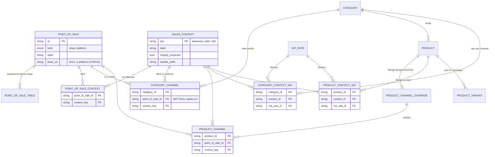
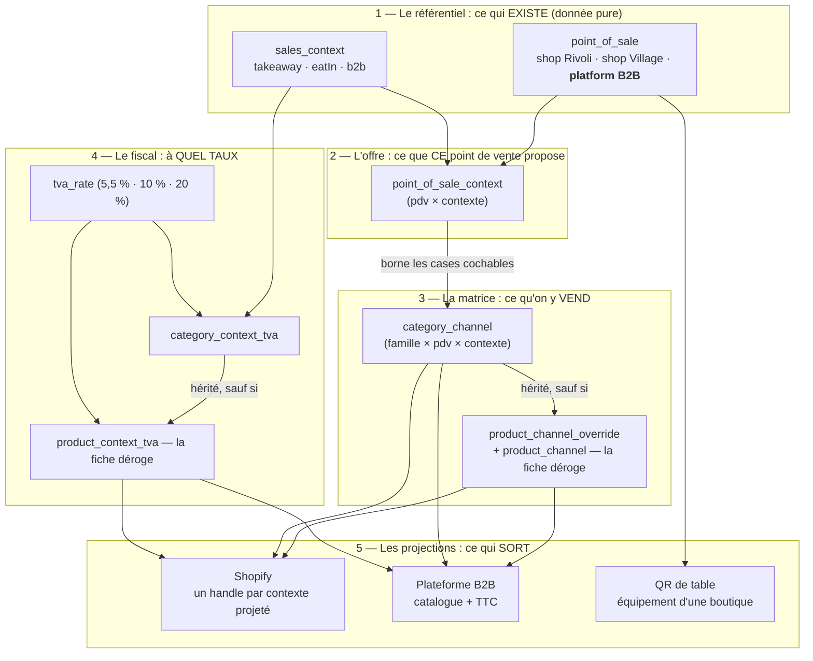

# Le point de vente — l'entité qui manque

> **Note doc-first, 2026-08-26. Aucun code écrit.** Elle pose le modèle définitif
> de « d'où l'on vend », corrige deux contournements livrés le jour même, et
> découpe l'exécution. Suite de
> [`c0d-matrice-de-canaux.md`](./c0d-matrice-de-canaux.md), qu'elle termine.

## 1. Deux symptômes, une cause

C0-d a rendu la matrice de canaux pilotée par la donnée : un ensemble de paires
`(lieu, contexte)` en table, plus aucune liste de canaux écrite en dur. Ce qui
reste accroche à deux endroits, et les deux viennent du même manque.

**`category_channel.location_id` peut être NULL, et ce NULL veut dire « le
B2B ».** Un `NULL` qui porte du sens est toujours le signe d'une ligne absente
quelque part. Ici, la ligne absente est la plateforme professionnelle.

**`sales_context.per_location` n'existe que pour distinguer ce cas.** Il a été
posé le matin même, et il faut le dire franchement : c'est un contournement, pas
un modèle. Il fait dire au CONTEXTE (« ai-je besoin d'un lieu ? ») ce qui est en
réalité une propriété du POINT DE VENTE (« quels contextes est-ce que j'offre ? »).

La cause est unique : **la plateforme B2B est un point de vente, et le modèle ne
le dit pas.** Le référentiel connaît `emplacement` pour les lieux physiques, et
rien pour elle.

### Pourquoi cette option avait été écartée — et pourquoi c'était une erreur

La note C0-d a examiné « la plateforme devient un pseudo-emplacement » et l'a
jugée rédhibitoire :

> Cette ligne de `pim.emplacement` porterait `name`, `click_collect`, `eat_in`,
> `base_url` et une grille de tables, tous absurdes pour une plateforme.

Le raisonnement était juste **sur ce qu'il examinait** : fourrer la plateforme
dans la table des emplacements, telle qu'elle est. Il concluait trop vite qu'il
fallait donc les séparer. La bonne sortie n'était ni l'un ni l'autre : créer
l'entité dont `emplacement` est un CAS.

## 2. Le modèle

```
point_de_vente(id, genre: 'boutique' | 'plateforme', libellé)
   └─ genre boutique : url de base, grille de tables

point_de_vente_contexte(point_de_vente_id, contexte)   ← ce qu'il OFFRE
category_channel(category_id, point_de_vente_id, contexte)  ← ce qu'on y VEND
product_channel(product_id,  point_de_vente_id, contexte)   ← la dérogation
```

Trois niveaux, trois questions distinctes, et c'est le point : elles étaient
mélangées.

| Question                                | Répond                    |
| --------------------------------------- | ------------------------- |
| Quels contextes de vente existent ?     | `sales_context`           |
| Qu'est-ce que CE point de vente offre ? | `point_de_vente_contexte` |
| Qu'est-ce que cette famille y vend ?    | `category_channel`        |

### Le schéma d'ensemble

Toutes les couches, du point de vente jusqu'à ce qui sort chez Shopify et sur la
plateforme B2B — d'abord la forme en base, puis l'ordre de résolution.



Et la même chose lue **de haut en bas**, c'est-à-dire dans l'ordre où une
question se résout à l'exécution :



**Ce que le schéma dit, et qui est tout l'enjeu :** chaque flèche est une clé
étrangère, jamais un `if`. Ajouter un contexte de vente ou un point de vente
ajoute des LIGNES dans les couches 1 et 2 ; les couches 3, 4 et 5 s'élargissent
sans qu'une ligne de code change. Ce qui reste au code, c'est la **forme** des
flèches — « une fiche hérite de sa famille », « un taux se règle par
contexte » — jamais leur nombre.

Deux héritages, et ils ont exactement la même mécanique : **l'absence de ligne
est la donnée**. Pas de `product_channel_override` ⇒ la fiche suit sa famille ;
pas de `product_context_tva` ⇒ elle suit le taux de sa famille.

Ce qui n'est **pas** encore piloté par la donnée, et il faut le dire : le
**prix**. Il vit sur la variante, en HT canonique, identique dans tous les
contextes ; seul le TTC varie, par le taux. « Pas le même prix au Village qu'en
B2B » serait une relation nouvelle, donc du code.

### Ce que ça supprime

| Disparaît                       | Pourquoi                                                                       |
| ------------------------------- | ------------------------------------------------------------------------------ |
| `location_id` **nullable**      | la plateforme EST un point de vente ; plus de `NULL` porteur de sens           |
| `sales_context.per_location`    | la question se dissout : un contexte est offert par ceux qui l'offrent         |
| `click_collect` / `sur_place`   | remplacés par `point_de_vente_contexte` — le prérequis, cette fois **branché** |
| `NULLS NOT DISTINCT`            | plus de colonne nullable dans la clé d'unicité de la matrice                   |
| la branche « a-t-il un lieu ? » | il en a toujours un                                                            |

`per_location` a vécu une journée. C'est le prix du définitif, et il vaut mieux
le payer maintenant qu'une fois qu'un quatrième contexte s'appuiera dessus.

### Ce que ça règle sans rien ajouter : les tables

`eat_in` faisait **deux métiers** : « ce lieu sert en salle » et « ce lieu a une
grille de tables à QR ». D'où l'invariant actuel — fermer la salle vide les
tables — et d'où la question restée ouverte : si `eat_in` devient un contexte
offert, l'agrégat doit-il connaître le nom d'un contexte pour savoir s'il a des
tables ?

Le modèle la dissout. **Une grille de tables appartient à un point de vente de
genre `boutique`** : c'est de l'équipement, pas un contexte. Deux boulangeries
peuvent toutes deux offrir « sur place » et une seule être équipée de QR — ce
que le modèle actuel ne sait pas dire.

Ce que devient l'invariant, et il est plus juste qu'avant : **une plateforme n'a
pas de tables** (le genre l'interdit), et retirer l'offre « sur place » d'une
boutique **n'efface plus ses QR** — la matrice a déjà cessé d'y vendre, donc un
QR mène à une commande vide plutôt qu'à un mensonge. Détruire du papier collé
sur un meuble pour une case décochée était disproportionné.

### La forme en base

Une table, pas deux, avec un genre et des colonnes propres à la boutique :

```prisma
model PointOfSale {
  id    String          @id
  kind  PointOfSaleKind            // shop | platform
  label String

  /// Boutique seulement — `NULL` pour une plateforme, et la contrainte le dit.
  baseUrl String?
  tables  PointOfSaleTable[]

  contexts PointOfSaleContext[]
  channels CategoryChannel[]
}
```

Deux tables (`point_of_sale` + `shop`) seraient plus pures, et ne paient pas :
la seule colonne réellement propre à la boutique est `base_url`, les tables
vivent déjà dans leur propre table. Une contrainte `CHECK` en SQL dit la règle —
`kind = 'platform'` implique `base_url IS NULL` et zéro table.

## 3. Ce qui NE change pas

- **Les contextes** — le registre, son écran, ses invariants (clé immuable,
  racine ineffaçable) restent tels quels, moins `per_location`.
- **La matrice** — même forme, ensemble de paires ; seule la colonne de lieu
  cesse d'être nullable.
- **Les taux de TVA** — ils joignent par contexte, jamais par lieu.
- **Shopify** — `shopify_projected` et `handle_suffix` sont des propriétés du
  contexte, pas du point de vente.

## 4. Le découpage

Discipline `étendre / basculer / resserrer`, comme toujours
(`documentation/ops/pipelines.md`).

| Tranche             | Migration                                                                                                                                                           | Code                                                                                                                |
| ------------------- | ------------------------------------------------------------------------------------------------------------------------------------------------------------------- | ------------------------------------------------------------------------------------------------------------------- |
| **p-0 étendre** ✅  | `point_of_sale` + reprise des emplacements (genre `shop`) **et** de la plateforme (une ligne) ; `point_of_sale_context` rempli depuis `click_collect` / `sur_place` | la matrice ne lit rien encore ; l'écran Emplacements devient Points de vente, la plateforme en lecture              |
| **p-1 étendre** ✅  | colonnes `point_of_sale_id` ajoutées à `category_channel` / `product_channel`, remplies                                                                             | écrites à côté de `location_id`                                                                                     |
| **p-2 basculer** ✅ | —                                                                                                                                                                   | tout lit `point_of_sale_id` ; `per_location` et la branche tombent ; la matrice devient (point de vente × contexte) |
| **p-3 resserrer**   | `DROP` de `location_id`, `per_location`, `click_collect`, `sur_place` ; `NOT NULL` sur le point de vente ; `emplacement` fusionne dans `point_of_sale`              | suppression du double-écriture ; l'écran des points de vente coche les contextes offerts                            |

**p-0 a une valeur propre** : il rend la plateforme B2B **visible** dans
l'administration, à côté des boutiques. Avant lui elle n'existait nulle part à
l'écran — c'était un `NULL` dans une colonne.

### p-0, tel qu'il a été livré (2026-08-26)

Une chose s'est ajoutée en chemin, et il faut la dire : `point_of_sale` est un
**miroir** d'`emplacement`, écrit par le dépôt des emplacements dans la MÊME
transaction que sa source — création, renommage, changement de modes,
suppression. La note ne le prévoyait pas ; sans lui, le miroir aurait dérivé dès
le premier renommage, et p-1 aurait branché la matrice sur des libellés
périmés. C'est le motif déjà employé pour `location_context`, et pour la même
raison.

Une boutique **garde l'identifiant** de son emplacement : la reprise de la
matrice en p-1 sera une copie de colonne, pas une jointure sur une table de
correspondance.

Deux gardes tiennent la plateforme racine : le `INSERT` de la migration, et
`ensureRootPointOfSale` au boot. La première ne suffisait pas — supprimée en
base, la ligne ne reviendrait jamais, et c'est exactement la panne silencieuse
que la garde du contexte `b2b` existe pour empêcher.

**Une lecture a basculé plus tôt que prévu**, et c'est un trou que p-0 a créé :
le compte « offert par N points de vente » se lisait sur `location_context`, qui
ne connaît que les emplacements. La plateforme offrant désormais le contexte
racine, l'écran des contextes aurait annoncé « 0 » pour le B2B **puis** refusé
sa suppression sur une clé étrangère. Dire vert et faire rouge est exactement ce
qu'on cherche à ne jamais faire, donc ce compte lit `point_of_sale_context` — un
sur-ensemble de l'ancienne table, tenu dans la même transaction. Le même effet a
fait rougir un test qui supprimait le contexte racine directement en base : la
suppression ne passe plus, et c'est le mur qu'on voulait.

L'unicité du libellé n'a **pas** été dupliquée sur le miroir : elle vit sur
`emplacement_name_unique`, la source. La poser des deux côtés ferait refuser le
miroir alors que la source a accepté — un refus qu'aucun message ne saurait
expliquer. Elle déménagera avec la source, en p-3.

### p-2, tel qu'il a été livré (2026-08-26)

La bascule a emporté plus que des lectures.

**Le couple perd son `null`.** `SoldChannel` est passé de
`{ locationId: string | null }` à `{ pointOfSaleId: string }`, jusque dans le
contrat de fil. C'est le gain de tout le chantier : il n'y a plus d'exception à
retenir, et le compilateur ne laisse plus écrire « le canal sans lieu ».

**La matrice de l'écran est devenue carrée.** Une ligne par point de vente, une
colonne par contexte. Le pied de grille — une case à part pour les contextes
« sans lieu » — a disparu : la plateforme professionnelle est une ligne comme
une autre, qui n'offre qu'une colonne. Une case non offerte n'est pas décochée,
elle **n'existe pas**.

**Un invariant en plus, et il manquait.** `refuseUnsellableChannels` refuse
maintenant deux choses : un point de vente qui n'existe pas — le mur inverse
existait déjà — et un contexte que ce point de vente **n'offre pas**. Vendre
« sur place » depuis une boutique sans salle était accepté, et la projection
fabriquait une fiche pour un lieu qui ne sert pas. La garde est écrite une fois
pour les familles et les fiches : elle l'était deux fois, à l'identique, et deux
copies finissent par ne plus refuser les mêmes choses.

**Un ordre d'écran est redevenu une donnée.** Les contextes d'une fiche étaient
rangés « ce qui n'a pas besoin d'un lieu d'abord » — une façon de mettre le B2B
en tête sans le nommer. Ce critère est mort avec `perLocation` ; l'ordre suit
désormais `position`, réglable à l'écran des contextes. Une déduction que
personne ne voyait est devenue un réglage qu'on peut corriger.

**Ce qui a été DÉPLACÉ vers p-3** : l'écran des points de vente ne coche pas
encore les contextes offerts. Le faire ici aurait ouvert une seconde source
d'écriture — `click_collect` / `sur_place` restent la source, et le miroir en
dérive. Les deux se rejoignent en p-3, quand `emplacement` fusionne dans
`point_of_sale` : une seule table, donc une seule vérité, et pas de fenêtre où
deux écrans écrivent la même chose par deux chemins.

### La racine, encore

Le point de vente `plateforme` hérite du contrat du contexte racine : **semé au
boot, ineffaçable, non renommable** (`ensureBootstrapPointOfSale`). Sans lui, la
matrice B2B n'a plus de cible et la boutique professionnelle se vide sans qu'une
erreur soit levée — exactement la panne silencieuse qui a justifié la garde du
contexte `b2b`.

## 5. L'ordre par rapport à C0-d

**d-3 reste utile telle quelle et part avant.** Elle supprime
`channel_preset`, `channel_override`, `channel_key` et `category_location_ref`,
morts quel que soit le modèle final, et traduit `emporter` → `takeaway`,
`surPlace` → `eatIn`. Elle ne touche **pas** `click_collect` / `sur_place`, que
p-3 absorbera.

Les deux chantiers ne se croisent donc qu'à un endroit : `per_location`, posé en
d-0 et retiré en p-3. Il vit entre les deux, et c'est assumé.

## 6. Ce que cette note ne tranche pas

- ~~**Le nom en base.**~~ **Tranché** (2026-08-26) : `point_of_sale` en base,
  `emplacement` disparaît comme table en p-3. L'écran dit **« Points de vente »**
  — c'est là qu'on gère les deux genres, et « Emplacements » ne nommait que
  l'un des deux. L'URL, elle, reste `/pim/emplacements` : renommer un chemin
  casse les liens déjà partagés, et un mot d'interface n'a pas à traîner
  l'espace d'URL avec lui.
- **Ce que devient l'écran des tables** quand une boutique retire l'offre « sur
  place » : on garde les QR (§ 2), mais faut-il le DIRE à l'écran ? Probablement
  oui, et c'est une phrase, pas une règle.
- **S'il y aura jamais un second point de vente de genre `plateforme`.** Le
  modèle l'accepte sans rien changer ; rien ne dit qu'il arrivera.
