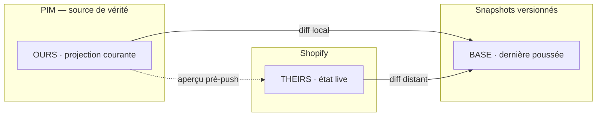

# Réconciliation de publication — le trois-voies « git du catalogue »

> Ce que le PIM **veut** pousser, ce qu'il a **déjà** poussé, ce que la boutique **montre
> aujourd'hui** : trois états, réconciliés comme un `git` à trois voies. On en tire tout ce
> qui compte pour publier sans casse — _à pousser_, _modifié en boutique_, _conflit_, le
> **diff par champ** avant d'envoyer, et le **retour arrière** par snapshot versionné.
>
> Statut : **design cible.** Le push actuel ([`push.service.ts`](../../apps/lfd-api/src/pim/channels/shopify/products/push.service.ts))
> ne garde qu'un _hash_ de la dernière poussée — assez pour « ne pas repousser l'identique »,
> pas assez pour diffuser, détecter une main étrangère, ou revenir en arrière. Ce doc décrit
> le socle qui manque.

---

## 1. Le problème, en une image

Aujourd'hui, publier vers Shopify est **aveugle dans un sens** : le PIM sait s'il a changé
depuis sa dernière poussée (empreinte locale), mais **pas** si quelqu'un a édité le produit
_dans l'admin Shopify_ entre-temps. Un push écrase alors silencieusement cette édition. Et
rien ne permet de **voir** ce qui partirait, ni de **défaire** ce qui est parti.

On veut trois réponses, à froid, avant tout appel réseau :

1. **« Qu'est-ce qui partirait si je poussais maintenant ? »** — diff champ par champ.
2. **« Quelqu'un a-t-il touché la boutique depuis ma dernière poussée ? »** — dérive distante.
3. **« Je viens de casser la fiche, rends-moi celle d'avant. »** — rollback versionné.

Ces trois réponses tombent **du même modèle** : trois états et leurs différences deux à deux.

---

## 2. Les trois états (BASE / OURS / THEIRS)

Vocabulaire emprunté au merge à trois voies, parce que c'est _exactement_ ça :

| État       | Qui le produit                                    | Où il vit                   | Rôle                                           |
| ---------- | ------------------------------------------------- | --------------------------- | ---------------------------------------------- |
| **BASE**   | le PIM, **au moment de la dernière poussée**      | snapshot persisté (§5)      | l'ancêtre commun — la référence de comparaison |
| **OURS**   | le PIM **maintenant** (`projectProduct`)          | calculé à la volée, pur     | ce qu'on _voudrait_ voir en ligne              |
| **THEIRS** | Shopify **maintenant** (`inspect`/`listProducts`) | lu au vol, jamais canonique | ce qui est _réellement_ en ligne               |



**L'unité de réconciliation est le `handle`, pas le `productId`.** Shopify identifie par
`handle` ; c'est lui qui a un correspondant des trois côtés. Ce choix est **à l'épreuve du
futur** : quand la projection passera de _1 produit PIM → 1 produit Shopify_ à _fiche×mode →
N produits Shopify_ ([`projection-shopify.md`](./projection-shopify.md)), le modèle ne bouge
pas — il y aura juste plus de handles. Le push, lui, reste déclenché par `productId` (on
mappe handle → produit via la projection).

---

## 3. Les statuts dérivés (la table de vérité)

Trois empreintes stables (`fingerprint`, déjà pur et trié) : `hLocal(OURS)`, `hBase(BASE)`,
`hRemote(THEIRS normalisé)`. Tout statut en découle :

| Statut            | Condition                                 | Sens                           | Action offerte          |
| ----------------- | ----------------------------------------- | ------------------------------ | ----------------------- |
| `never_published` | pas de BASE                               | jamais poussé                  | **Publier**             |
| `up_to_date`      | `hLocal = hBase = hRemote`                | tout le monde d'accord         | —                       |
| `local_ahead`     | `hLocal ≠ hBase`, `hRemote = hBase`       | le PIM a avancé                | **Pousser** (sûr)       |
| `remote_drift` ⚠️ | `hLocal = hBase`, `hRemote ≠ hBase`       | **main étrangère en boutique** | Revoir · Ré-aligner     |
| `conflict` ⚠️     | `hLocal ≠ hBase` **et** `hRemote ≠ hBase` | les deux ont bougé             | Revoir le diff · Forcer |
| `to_remove`       | BASE/THEIRS existe, pas de OURS           | retiré du catalogue            | **Dépublier**           |
| `unknown`         | THEIRS illisible (dry-run, offline)       | on ne sait pas                 | — (jamais « down »)     |

`unknown ≠ absent` : en dry-run ou boutique injoignable, `hRemote` est _inconnu_, pas _vide_.
On ne déduit **jamais** une dérive d'un silence (même invariant que le heartbeat OPS).

Le **diff par champ** se calcule sur n'importe quelle paire (OURS↔BASE pour « ce qui
partirait », THEIRS↔BASE pour « ce qui a bougé en boutique ») avec la même fonction pure —
titre, statut, et par variante : SKU, prix, options.

---

## 4. Versionnement & rollback

Chaque **poussée réussie** écrit un snapshot **immuable** de OURS (le payload projeté, pas un
hash). La chaîne de snapshots d'un handle **est** son historique :

```
v1 ──push──► v2 ──push──► v3   (head)
                    ▲
              rollback = re-pousser v2 (crée v4 = copie de v2)
```

- **Rollback n'efface rien** : il re-pousse un ancien payload, ce qui crée un _nouveau_
  snapshot (v4 ≡ v2). L'historique reste linéaire et auditable — pas de trou.
- Le **BASE** de la réconciliation = le snapshot **head**. `hBase = head.hash`.
- Un snapshot porte de quoi rejouer _exactement_ : `payload` (le `ShopifyProductPayload`),
  `hash`, `pushedAt`, `mode` (live/dry-run), et l'issue (`ok`/`failed`).

---

## 5. Schéma (Prisma)

Un seul modèle neuf ; le binding existant gagne un pointeur de tête.

```prisma
/// Instantané immuable d'une poussée — l'historique versionné d'un handle.
/// Jamais muté après écriture : le rollback ré-écrit une nouvelle ligne.
model ShopifyPushSnapshot {
  id        String   @id @default(uuid())
  handle    String   @map("handle")            // l'unité de réconciliation
  productId String   @map("product_id")         // d'où venait OURS (peut devenir N handles)
  version   Int      @map("version")            // 1..n par handle, monotone
  hash      String   @map("hash")               // fingerprint(payload)
  payload   Json     @map("payload")            // ShopifyProductPayload rejouable
  mode      ShopifyChannelMode @map("mode")      // live | dry_run
  outcome   ShopifyPushOutcome @map("outcome")   // pushed | failed
  pushedAt  DateTime @default(now()) @map("pushed_at")

  @@unique([handle, version])
  @@index([handle])
  @@map("shopify_push_snapshot")
}

model ShopifyProductBinding {
  // … champs existants …
  headSnapshotId String? @map("head_snapshot_id")  // BASE courant (le head)
  // lastPushedHash devient dérivé de head.hash — on le garde pour compat lecture
}
```

`payload` en `Json` : c'est un **document rejouable**, pas une entité relationnelle — le
normaliser en tables le rendrait fragile au moindre changement de projection. Un snapshot est
un fait figé, on le relit tel quel.

---

## 6. Le piège : normaliser THEIRS avant de comparer

`hRemote` ne peut pas se calculer sur le `ShopifyProductSnapshot` brut : il n'a pas la même
forme que `ShopifyProductPayload` (pas d'`options`, statut en `string`, variantes triées
autrement, champs Shopify parasites). **Comparer les formats bruts ferait mentir chaque
diff.** Il faut une **projection inverse** `snapshot Shopify → forme canonique de comparaison`
qui :

- ne compare **que les champs que le PIM possède** (titre, handle, statut, SKU, prix, options) —
  jamais ceux que Shopify ajoute (tags auto, timestamps, SEO généré) ;
- trie variantes et clés d'options comme la projection directe (sinon dérive fantôme) ;
- mappe `ACTIVE/DRAFT` ↔ `published/draft` symétriquement.

Cette fonction est **le cœur testable** de la feature (comme `projectProduct` l'est pour le
push). Elle vit à côté de la projection, pure, sans réseau.

---

## 7. API

| Verbe  | Route (`channels/shopify/products`) | Rôle                                                               |
| ------ | ----------------------------------- | ------------------------------------------------------------------ |
| `GET`  | `/reconciliation`                   | Le board : par handle, statut §3 + compteurs. Lit OURS+BASE+THEIRS |
| `GET`  | `/reconciliation/:handle`           | Détail : les 3 payloads + les diffs par paire                      |
| `POST` | `/push`                             | Publie (déjà là) — écrit un snapshot à chaque succès               |
| `POST` | `/push` `{ dryRun: true }`          | **Vrai** pré-push : projette, diffe, **n'écrit rien**              |
| `GET`  | `/history/:handle`                  | Les snapshots (version, hash, pushedAt, outcome)                   |
| `POST` | `/rollback` `{ handle, version }`   | Re-pousse le snapshot ciblé (crée un nouveau head)                 |

`dryRun` doit être **sans effet de bord** (ne persiste pas de binding), sinon « aperçu » ment.
C'est la seule dérogation au comportement actuel du dry-run (qui écrit le binding).

---

## 8. Contrats (`@lfd/pim-contracts`)

- `reconciliationStatusSchema` (enum §3) + `ReconciliationRowView` (handle, productId, statut,
  compteur de diffs, `remoteDrift: boolean`).
- `ReconciliationDetailView` : `{ base, ours, theirs }` en `PayloadView` + `diffs: FieldDiffView[]`
  par paire (`ours-vs-base`, `theirs-vs-base`).
- `pushPayloadSchema` gagne `dryRun: z.boolean().optional()`.
- `rollbackPayloadSchema` : `{ handle, version }`.
- `SnapshotView` : `{ version, hash, pushedAt, mode, outcome }`.

Front en `import type` only (zod jamais bundlé, cf. [[project_lfd_pim_contracts]]).

---

## 9. Front — l'écran de réconciliation

Remplace `publication-shopify` (le POC fiche×mode/diff LocalDb). Orienté **handle** :

- **Tableau** : une ligne par handle, badge de statut §3 (⚠️ visible sur `remote_drift`/`conflict`),
  sélection, compteur de diffs. Réutilise `FoldStatusBadge`, `FoldBadge`, callouts.
- **Dépli** : le diff par paire — colonne « ce qui partirait » (OURS↔BASE) et, si dérive,
  « ce qui a changé en boutique » (THEIRS↔BASE), côte à côte.
- **Actions** : _Pré-push_ (dry-run réel) · _Publier_ · _Dépublier_ · _Historique → Rollback_.
- **Honnêteté du mode** : porter le badge Simulation/Prêt/Connecté de l'écran intégration ici
  aussi — en dry-run le tableau dit franchement « état boutique inconnu ».

---

## 10. Slices de livraison (l'ordre)

| Slice                                 | Contenu                                                                              | Tombe                           |
| ------------------------------------- | ------------------------------------------------------------------------------------ | ------------------------------- |
| **S1 — Snapshots + rollback**         | modèle Prisma, écriture de snapshot au push, `GET /history`, `POST /rollback`, tests | socle — d'abord                 |
| **S2 — Dry-run réel**                 | `dryRun` sans effet de bord dans push.service + contrat + bouton pré-push            | rapide, débloque « voir avant » |
| **S3 — Trois-voies**                  | projection inverse THEIRS, `GET /reconciliation`(+`:handle`), statuts §3, tests      | le cœur                         |
| **S4 — Écran**                        | refonte `publication-shopify` sur les endpoints ci-dessus                            | la vitrine                      |
| **S5 — Dérive proactive** _(différé)_ | webhook Shopify `products/update` → marque `remote_drift` sans poll                  | post-boucle                     |

S1→S2 sont indépendants de la boutique réelle (testables en dry-run) → **ils tombent
aujourd'hui**. S3 a besoin d'un THEIRS lisible → il se valide dès que le token est posé, ce qui
rejoint la boucle « test vraie boutique en DRAFT » ([`shopify-e2e-strategy.md`](./shopify-e2e-strategy.md)).

---

## 11. Revue adverse (les trous qu'on assume)

1. **Détecter n'est pas résoudre.** Ce socle _montre_ la dérive et le conflit ; il ne
   fusionne pas. La résolution v1 = choix binaire (forcer OURS, ou ré-aligner BASE sur THEIRS).
   Un vrai merge champ-à-champ est hors périmètre — et probablement inutile à l'échelle
   boulangerie.
2. **THEIRS coûte un appel.** Le board interroge Shopify à chaque ouverture (quota). Acceptable
   au volume actuel ; S5 (webhook) le remplace par du push le jour où ça pique.
3. **Croissance des snapshots.** Un `Json` par poussée × N produits × le temps. Borne à prévoir
   (garder les K derniers par handle) — noté, pas fait en v1.
4. **La bascule fiche×mode reste devant.** Ce doc suppose la projection 1:1 actuelle ; il est
   conçu pour survivre à fiche×mode (clé handle), mais la migration elle-même est un autre
   chantier ([`projection-shopify.md`](./projection-shopify.md)).
5. **Rollback re-pousse, il ne restaure pas la boutique à l'identique** si une main étrangère a
   édité depuis : il ré-applique OUR payload, écrasant THEIRS. C'est voulu (le PIM est autorité),
   mais l'UI doit le **dire** quand `remote_drift` est présent au moment du rollback.
