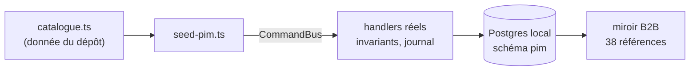

# Le seed du référentiel — un catalogue rejoué par le bus

`pnpm --filter lfd-api seed:pim` fabrique un catalogue de développement **en
passant par les commandes de l'application**. Aucune écriture directe, aucune
lecture d'une base d'exploitation.

```bash
pnpm dev:infra                                     # Postgres local (5433)
pnpm --filter lfd-api db:migrate                   # le schéma
SEED_PIM_SYNTHETIC_SHEETS=1 SEED_PIM_PUBLISH_ALL=1 \
  pnpm --filter lfd-api seed:pim
```

## Ce qu'il produit

Sur une base vide, à partir du catalogue figé dans
`apps/lfd-api/prisma/seed-pim/catalogue.ts` :

| Ce qui est posé                        | Combien                             |
| -------------------------------------- | ----------------------------------- |
| taux de TVA                            | 3                                   |
| points de vente                        | 2 (+ `pos_b2b`, posé par migration) |
| familles                               | 5                                   |
| fiches produit                         | 95                                  |
| fiches mises en vente                  | 95                                  |
| fiches vendues aux pros (matrice)      | 41                                  |
| **références acceptées au miroir B2B** | **38**                              |

Les 3 manquantes sont écartées pour `variant_sans_prix` : le catalogue de départ
ne les tarife pas. Le seed ne comble pas ce trou — il le **rapporte**.

## Pourquoi pas en SQL

`prisma/pim-seed.ts`, son prédécesseur, écrivait par `upsert`. Les `upsert` ne
connaissent pas les invariants : c'est pour ça que la base de développement
portait 95 déclinaisons actives dont **une seule** avec fiche réglementaire,
c'est-à-dire un catalogue que `Product.publish()` refuse. Tout ce qu'on
développait dessus reposait sur un état que la production ne verra jamais.

Ici, chaque étape est la commande que l'écran envoie — ouvrir, tarifer, décrire,
déclarer les allergènes, placer sur la matrice, régler les taux, signer, mettre
en vente. Ce qui entre est, par construction, un état atteignable.



## Les deux drapeaux, tous deux éteints par défaut

- **`SEED_PIM_SYNTHETIC_SHEETS=1`** — pose des allergènes et des valeurs
  nutritionnelles **INVENTÉS** sur les fiches qui n'en déclarent pas. Sans lui,
  94 fiches sur 95 restent brouillon (invariant 7) et le miroir B2B est vide.
  La donnée inventée porte sa marque : `glycemic_index = 0`, impossible pour un
  aliment réel et distinct de `NULL`.
- **`SEED_PIM_PUBLISH_ALL=1`** — met en vente tout ce qui est publiable, au lieu
  de recopier le statut du catalogue de départ (tout y est brouillon).

Ni l'un ni l'autre ne contourne un refus : `publish()` juge dans les deux cas.

## Trois refus délibérés

**Le seed refuse toute cible qui n'est pas un Postgres local.** Une URL
Accelerate, ou un hôte qui n'est ni `localhost` ni `127.0.0.1`, arrête le script
avant la première écriture. Il pose des allergènes inventés : une donnée
réglementaire fausse en production n'est pas une gêne de développement.

**Aucun outil ne lit une base pour fabriquer la donnée.** Le catalogue est du
**code** — relu en revue, modifié à la main. Un extracteur qui irait le chercher
dans une base d'exploitation ouvrirait une porte vers la production à chaque
`pnpm seed`.

**Le seed ne double ni le domaine, ni la persistance, ni le journal.** Une seule
doublure, `DocumentStore` : R2 n'est pas configuré en développement.

## Le canal B2B, et pourquoi cette phase existe

« Vendu aux pros » est écrit à deux endroits — la matrice des contextes de vente,
et `pim.b2b_channel_binding`. La projection consulte **les deux**. Sans
alignement, un catalogue rejoué donne un PIM juste et un miroir vide, ce qui
ressemble à une panne du canal alors que c'est un désaccord entre deux tables.

`seed-pim/b2b-channel.ts` aligne la copie sur l'original : la matrice fait foi.
Le jour où la table disparaît (cf.
[`ecrans-du-cycle-catalogue.md`](ecrans-du-cycle-catalogue.md)), ce fichier
disparaît avec elle.

## Pourquoi une compilation

`seed:pim` fait `tsc -p tsconfig.seed.json` avant de lancer le JS. Le seed boote
l'`AppModule`, donc la DI Nest **par type**, donc `design:paramtypes` :

- esbuild (`tsx`) ne supporte pas `emitDecoratorMetadata` — la DI échoue sur
  `CreateCategoryHandler (?, PimIdGenerator)` ;
- `ts-node` 10.9 ne tourne plus sur le TypeScript 6.x épinglé ici.

⚠️ C'est la seconde raison qui a cassé **`pnpm seed:growth`**, aujourd'hui
inutilisable pour deux motifs indépendants : son runner, et un import de
`platform/auth/customer-user.resolver.js`, supprimé depuis. Non traité ici.

`tsconfig.seed.json` sert aussi de garde de types : `tsconfig.json` n'inclut que
`src`, donc **rien dans `prisma/` n'était typé** jusqu'à ce chantier. ESLint ne
le couvre toujours pas (`pnpm lint` ne vise que `{src,apps,libs,test}`).

## Modifier le catalogue

À la main, dans `catalogue.ts`. Tout s'y désigne par **clé portable** — nom de
famille, libellé de point de vente, clé de contexte, nom de taux, SKU — jamais
par identifiant : le rejeu passe par les commandes, qui frappent leurs propres
ULID. Le SKU fait exception, et c'est lui qui rend le rejeu idempotent : une
fiche déjà présente est retrouvée, pas dupliquée.
