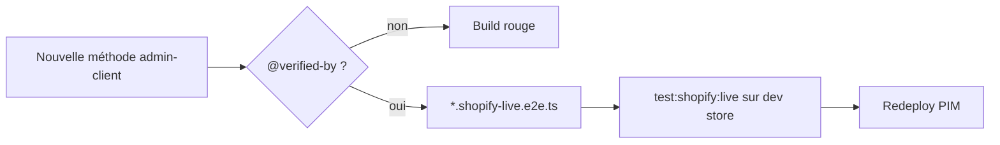

# Tests e2e Shopify en conditions réelles — stratégie

> **But.** Avant de redéployer le PIM, valider **chaque fonction de l'API Admin
> Shopify réellement utilisée** par un test e2e en conditions réelles (vrai réseau,
> vraie boutique). Ce doc fixe : sur quelle boutique, comment est fait le harness, et
> ce que le lint peut — ou ne peut pas — **garantir** de cette pratique.
>
> Statut : **décision / design.** Le harness et le gate ne sont **pas encore codés**.
> Date : 2026-08-04.
> Voisins : [`shopify-connexion-setup.md`](shopify-connexion-setup.md) (la connexion),
> [`projection-shopify.md`](projection-shopify.md) (ce qu'on projette).

---

## 1. Boutique réelle ou dev store ?

**Dev store dédiée. Jamais la prod pour les tests qui écrivent.** Le critère qui
tranche est la **direction** de chaque appel :

| Fonction API                                   | Direction    | Sur prod ?                                                                                                          |
| ---------------------------------------------- | ------------ | ------------------------------------------------------------------------------------------------------------------- |
| `verify`, `listProducts`, `listTvaCollections` | **lecture**  | tolérable ponctuellement (aucun effet de bord)                                                                      |
| `createCollection`, push produit (à venir)     | **écriture** | **jamais** — crée de vrais objets visibles clients, pollue le catalogue ; un bug de boucle peut spammer la boutique |

Décisions :

- La suite e2e tourne sur une **development store dédiée** (gratuite, jetable, dans
  l'org du Dev Dashboard). Aujourd'hui : `1kkhae-8q.myshopify.com`.
- On ne fait **jamais** tourner la suite d'écriture sur la boutique de production.
- Un smoke **lecture seule** (`verify`, `listProducts`) sur la prod reste acceptable
  ponctuellement, mais **pas** en CI et **pas** avec les tests d'écriture.

## 2. Forme du harness (invariants non négociables)

Ces tests **ne sont pas** des tests unitaires : ils tapent le vrai réseau Shopify,
avec de vrais identifiants, soumis aux quotas d'API.

- **Isolés** du run unitaire — glob séparé, ex. `*.shopify-live.e2e.ts` sous `test/`,
  lancés par un script dédié `test:shopify:live`. Jamais dans le `jest` par défaut.
- **Gated** sur la présence de `SHOPIFY_CLIENT_ID` / `SHOPIFY_CLIENT_SECRET` **et** un
  flag explicite `SHOPIFY_LIVE_E2E=1`. **Skip, pas fail**, quand ils manquent → la CI
  normale reste verte sans identifiants.
- **Un test par fonction API réellement utilisée** : `verify`, `listProducts`,
  `listTvaCollections`, `createCollection`, … (et chaque nouvelle au fil de l'eau).
- **Les tests d'écriture nettoient derrière eux** (créent → vérifient → suppriment),
  dans un `afterAll`, pour garder la dev store réutilisable. Sans ça, la 10ᵉ
  exécution laisse 10 collections `tva-test` orphelines.

## 3. Ce que le lint garantit — et ce qu'il ne garantit pas

La question clé, avec une **frontière honnête** (philosophie maison : self-guarding
par invariants falsifiables).

### Le lint NE PEUT PAS

Garantir que « l'appel marche vraiment contre Shopify ». C'est du **runtime**, prouvé
seulement par une **exécution réelle**. Aucun gate statique ne le remplace — ne pas
prétendre le contraire.

### Le lint PEUT (invariants falsifiables)

1. **Couverture** — _chaque méthode publique « live » de l'`admin-client` a un e2e
   réel associé._ Un gate repo (comme `lint:feature-access`) parse les méthodes de
   [`admin-client.ts`](../../packages/shopify-admin/src/index.ts)
   et vérifie que chacune est référencée par un `*.shopify-live.e2e.ts`, via
   l'annotation `@verified-by`. Une méthode sans e2e ⇒ **build rouge**.
2. **Isolation** — _aucun e2e live n'est dans le glob unitaire_ (sinon la CI taperait
   Shopify). Un fichier `*.shopify-live.e2e` importé par le run unitaire ⇒ **rouge**.
3. **Cleanup** (plus mou) — exiger qu'un `create*` dans un e2e ait un `delete`
   correspondant dans un `afterAll`. Heuristique faillible : à traiter comme
   **signal**, pas comme preuve.

### La formule

> Le lint garantit **« toute fonction live est couverte par un e2e réel, et ces e2e
> sont isolés du run unitaire »** — pas **« le e2e passe »**. La **couverture** est
> falsifiable ; le **succès** ne l'est que par le run réel.

## 4. Le workflow cible

1. Avant chaque redeploy du PIM : `test:shopify:live` à la main, sur la dev store,
   avec `SHOPIFY_LIVE_E2E=1` + identifiants en env.
2. Le gate `@verified-by` empêche d'ajouter une méthode `admin-client` sans e2e.
3. La CI normale (sans identifiants) **skip** la suite live → reste verte, rapide,
   déterministe.

## 5. État

**Harness livré** (2026-08-05) :

- Fichiers `*.shopify-live.ts` sous `test/shopify/`, **jamais** matchés par le `testMatch`
  unitaire (`spec|test|e2e-spec`) → invisibles pour `pnpm test` et la CI.
- Config isolée `jest.shopify-live.config.cjs` + script **`test:shopify:live`** (charge
  `.env`). Gated : `test/shopify/live-context.ts` (seul fichier env-allowlisté) expose
  `liveE2eEnabled()` — `describe.skip` sans `SHOPIFY_LIVE_E2E=1` + identifiants +
  `SHOPIFY_E2E_SHOP`. Vérifié : **skip → 0 échec**, run unitaire **n'attrape pas** le live.
- 1er e2e : `product-push.shopify-live.ts` — create → update-in-place → **cleanup** (delete
  en `afterAll`). Bâtit le **vrai** `LiveShopifyDriver` (donc le vrai `ShopifyTokenProvider`).

**Reste à faire** :

- Un e2e par fonction d'écriture restante : multi-variantes, collections
  (`collectionCreate` / `collectionAddProductsV2`), publications — spikes déjà validés
  (cf. [`shopify-productset-findings.md`](shopify-productset-findings.md) F10/F11).
- Le gate repo **`@verified-by`** (couverture : toute méthode d'écriture `admin-client` a
  son e2e) + le gate d'isolation.
- Décider si une **dev store d'e2e dédiée** distincte de `1kkhae-8q` est créée.
