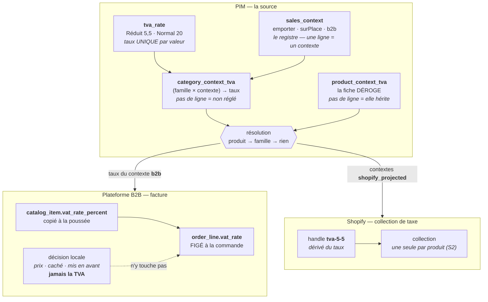

# La TVA, d'un bout à l'autre

> **Le doc unique de la TVA.** Où un taux est saisi, comment il descend jusqu'à une
> ligne de facture, ce que chaque étage a le droit de redéfinir, et ce qui se passe
> quand il manque.
>
> État : ✅ décrit du code qui tourne, au 2026-08-24. Ce qui reste est en §7, et
> le seul 📐 qui subsiste est l'override de **disponibilité** — la TVA, elle, est
> construite de bout en bout.

---

## 1. La chaîne, en un coup d'œil



## 2. Les étages, et ce que chacun décide

| Étage                  | Décide                                     | Ne décide pas                            |
| ---------------------- | ------------------------------------------ | ---------------------------------------- |
| `tva_rate`             | qu'un taux **existe** (5,5 · 10 · 20)      | qui l'utilise                            |
| `sales_context`        | quels **contextes de vente** existent      | quel taux ils portent                    |
| `category_context_tva` | le taux d'une **famille** pour un contexte | ce qu'un produit particulier facture     |
| `product_context_tva`  | le taux d'**une fiche**, par contexte      | ce que sa famille décide pour les autres |
| projection B2B         | recopier le taux résolu du contexte `b2b`  | inventer un taux                         |
| décision locale B2B    | prix, visibilité, mise en avant            | **la TVA** — elle ne s'y redéfinit pas   |
| `order_line.vat_rate`  | ce qui est **facturé**, figé à la commande | rien d'autre : c'est une photo           |
| projection Shopify     | la **collection** `tva-*` du produit       | le taux lui-même                         |

**Le taux d'un produit n'est jamais recalculé après coup.** `OrderLine.vatRate` est
une **photo prise à la commande** : changer un taux demain ne réécrit aucune facture
d'hier. C'est l'invariant qui rend tout le reste sûr à modifier.

## 3. Les règles que le code tient

**Un taux ne se règle que pour un contexte qu'on vend.** L'agrégat `Category` le
refuse (`CategoryTvaWithoutChannelError`), et **fermer un canal efface** le taux des
contextes qu'il portait. Sans cet effacement, une famille qui ne vend plus en B2B
continuerait de pointer son taux B2B : le compte d'usages le compterait, et la
suppression du taux resterait bloquée pour rien.

**Un taux visé ne se supprime pas.** `RESTRICT` sur la jointure. L'écran le dit
**avant** — il affiche le nombre de familles qui visent le taux, tous contextes
sommés, et masque le geste. (Il n'en sommait que deux : un taux visé seulement par
le B2B paraissait libre, et la base refusait après le clic. Corrigé le 2026-08-24.)

**Une fiche ne déroge que là où sa FAMILLE vend.** Déroger sur un contexte fermé,
c'est décider d'un prix pour une vente qui n'a pas lieu — et bloquer la
suppression d'un taux que plus rien ne facture. Même règle que sur la famille,
elle change juste de porteur (`catalogue.product.tva_without_channel`).

**Revenir à l'héritage est un geste, pas un oubli.** Il s'écrit en retirant la
ligne — jamais en posant un état « pas de dérogation », qui se compterait comme
un usage du taux et bloquerait sa suppression.

**Un contexte inconnu est refusé.** Régler « traiteur » sans ligne de registre en
face échoue (`catalogue.category.unknown_sales_context`) : la clé serait persistée
sans que personne puisse dire, six mois plus tard, ce qu'elle facturait.

**On ne remplit jamais un trou de TVA.** Une famille non réglée rend une carte sans
la clé — jamais un zéro, jamais un défaut à 5,5 %. Le refus est **déplacé là où il
compte** : le catalogue laisse passer le produit sans taux (son prix canonique a de
la valeur), et **la boutique B2B l'écarte de sa vente**.

## 4. Ce que chaque consommateur en fait

### Plateforme B2B — elle facture

La projection lit le taux du contexte **`b2b`** et le pose **sur chaque article**
poussé (`catalog_item.vat_rate_percent`) : le récepteur n'a plus à rejoindre une
famille pour savoir facturer. Elle lisait le taux « à emporter » faute d'avoir le
sien — un emprunt que rien ne signalait et qu'aucun écran ne permettait de corriger.

Les prix sont **HT** ; la TVA s'ajoute au devis, ligne par ligne, et la **livraison**
a son propre taux (`DELIVERY_VAT_RATE = 20`). Stripe encaisse le TTC.

> ⚠️ **Repli de transition à retirer** : `billableRate` retombe sur le taux de la
> famille miroir quand l'article n'a pas encore le sien — sinon la boutique
> s'éteindrait entre le déploiement et le premier push. Un push suffit à le rendre
> inutile ; le garder ferait resurgir le défaut qu'on corrige, une ligne facturée qui
> dépend d'une jointure.

### Shopify — elle range

Shopify n'accepte **qu'un traitement de TVA par produit** : l'override se pose par
appartenance à **une** collection `tva-*` (invariant S2). Le PIM ne rend donc pas un
taux à Shopify, il en dérive un **handle** (`5.5 → tva-5-5`) et range le produit,
après le `productSet`, par `collectionAddProductsV2`.

Un produit qui déroge **change donc de collection** — et il **quitte l'ancienne**.
Rejoindre ne suffisait pas : un article dont le taux changeait restait membre de
sa collection précédente, la boutique le taxait encore selon elle, et rien ne le
signalait. Le rapport de poussée dit désormais ce qui a été quitté. Les
collections hors `tva-*` (« Noël », « Nouveautés ») appartiennent au marchand et
ne sont jamais touchées.

Seuls les contextes marqués **`shopify_projected`** sont projetés — aujourd'hui
`emporter` seul. `active` est une autre question : le B2B est **en service** (il
facture) sans que la boutique porte un second produit par article. Confondre les deux
créerait des handles `-b2b`, donc des URL indexées qu'on ne peut plus reprendre.

## 5. Ajouter un contexte de vente

Depuis C0, c'est **une ligne** dans `sales_context` :

```sql
INSERT INTO "pim"."sales_context"
  ("id","key","label","handle_suffix","channel_key","active","shopify_projected","position","updated_at")
VALUES ('ctx_traiteur','traiteur','Traiteur','-traiteur','emporter',true,false,4,CURRENT_TIMESTAMP);
```

Le panneau famille lui ouvre son réglage, l'encadré de la fiche produit lui donne sa
ligne, le compte d'usages le compte. **Aucun déploiement de front.** Un test le
vérifie (`category-panel.spec.ts` — « accueille un contexte de PLUS sans une ligne de
front »).

Deux réserves, et elles sont sérieuses :

1. **`channel_key` est une colonne de transition.** Tant que la matrice des canaux
   garde ses clés fixes, un contexte doit dire lequel l'autorise — donc un contexte
   vraiment neuf (un canal qui n'existe pas encore) demande d'abord la refonte de la
   matrice (C0-d).
2. **`shopify_projected = true` change des URL.** Le suffixe de handle est figé avant
   le premier push ; l'activer sur un contexte déjà poussé casse le référencement.

## 6. Où c'est écrit

| Sujet                                              | Fichier                                                                       |
| -------------------------------------------------- | ----------------------------------------------------------------------------- |
| Invariants de la famille (canal vendu, effacement) | `pim/catalogue/category/domain/entities/category.ts`                          |
| Registre + contexte vendu                          | `pim/catalogue/shared/domain/value-objects/sales-context.ts`                  |
| Résolution taux → pourcentage                      | `pim/catalogue/shared/infrastructure/prisma-catalogue-reader.ts`              |
| Projection B2B (contexte `b2b`)                    | `pim/channels/b2b-platform/products/projection.ts`                            |
| Appartenance Shopify (`tva-*`)                     | `pim/channels/shopify/products/push.service.ts` · `collections/tva-handle.ts` |
| Taux facturé côté boutique B2B                     | `b2b/catalog/infrastructure/prisma-catalog.reader.ts` (`billableRate`)        |
| TVA d'une commande, livraison comprise             | `b2b/orders/domain/services/vat.ts`                                           |

## 7. Ce qui reste

- **Déploiement en DEUX temps.** La bascule C0-b part d'abord ; le `DROP` des trois
  colonnes (C0-c) au déploiement suivant. Les livrer ensemble casse l'API pendant
  le `wrangler deploy`.
- **C0-d** — la matrice des canaux reste à clés fixes ; `channel_key` meurt avec elle.
- **Repli `billableRate`** — à retirer après le premier push complet ; il fait
  encore dépendre une ligne facturée d'une jointure de famille.
- **Override de DISPONIBILITÉ** — la moitié canaux de
  [`override-produit.md`](./override-produit.md) reste 📐 : seule la TVA est
  construite. `Product.channelsOverride` vaut toujours `null` côté front.

## 8. Ce qui a été fait (2026-08-24)

| Fait                                                                        | Où                      |
| --------------------------------------------------------------------------- | ----------------------- |
| Contextes de vente en DONNÉE (registre + jointure), les 3 colonnes tombent  | C0-a/b/c                |
| Une fiche peut déroger au taux de sa famille, contexte par contexte         | O0/O1/O2                |
| Shopify quitte la collection de l'ancien taux (S2)                          | O3                      |
| Le compte d'usages additionne familles **et** fiches                        | `usageByRegime`         |
| `DEFAULT_FOOD_VAT_RATE` retiré — il nommait un défaut que rien n'appliquait | `b2b/orders/.../vat.ts` |
