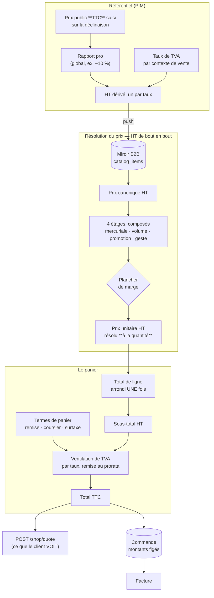

# Le prix — de l'étiquette à la facture

**Ouvert le 2026-09-06.** L'entrée du dossier. Treize documents décrivent la
chaîne du prix ; celui-ci dit **de quoi elle est faite** et **par quelle porte
entrer**. Il ne remplace aucun d'eux et n'en résume aucun en détail.

> **Pourquoi un dossier `pricing/` et pas trois.** La chaîne traverse le
> référentiel, la boutique et la caisse. Rangée par contexte — `pim/`, `b2b/` —
> elle se lisait en trois morceaux dont aucun ne disait le tout, et c'est
> exactement ce qui rendait le sujet illisible.

---

## 1. La chaîne, en un schéma

**Une phrase par étage, et c'est tout ce qu'il faut retenir :**

| Étage          | Ce qu'il décide                                                               | Où c'est écrit                                                             |
| -------------- | ----------------------------------------------------------------------------- | -------------------------------------------------------------------------- |
| **Ancrage**    | le prix est SAISI en TTC public ; chaque taux en dérive son HT                | [`architecture-prix-ancre-ttc.md`](architecture-prix-ancre-ttc.md)         |
| **Résolution** | quatre étages composent un prix unitaire HT **à la quantité demandée**        | [`architecture-resolution-de-prix.md`](architecture-resolution-de-prix.md) |
| **Panier**     | les lignes s'additionnent, les termes de panier s'ajoutent, la TVA se ventile | [`ajouter-un-terme-au-panier.md`](ajouter-un-terme-au-panier.md)           |
| **Devis**      | le serveur — jamais le navigateur — dit ce que ça coûtera                     | [`architecture-prix-boutique.md`](architecture-prix-boutique.md)           |

---

## 2. Le vocabulaire, en huit lignes

Ces mots reviennent partout et ne veulent pas dire ce qu'on croit.

| Mot                      | Ce qu'il désigne ici                                                                                 |
| ------------------------ | ---------------------------------------------------------------------------------------------------- |
| **Canonique**            | le prix HT du référentiel, avant toute règle. Le prix d'entrée.                                      |
| **Mercuriale**           | un prix négocié pour un client. Elle **scelle** : posée, elle rend les étages suivants transparents. |
| **Étage**                | un des quatre niveaux de règle. Ils se **composent**, ils ne s'additionnent pas.                     |
| **Plancher**             | la marge minimale. Une **post-condition** : il n'entre pas dans le calcul, il le refuse.             |
| **Millicentime**         | 10⁻⁵ €. L'unité d'un **prix unitaire**, qui se dérive. Un **montant** encaissé est en centimes.      |
| **Terme de panier**      | remise de retrait, frais de zone, surtaxe de retard. Par commande, jamais par ligne.                 |
| **Ventilation**          | la TVA calculée par **taux**, remise déduite au prorata, arrondie une fois par groupe.               |
| **Résolu à la quantité** | le prix d'une ligne dépend de sa quantité. C'est pourquoi le front **ne multiplie jamais**.          |

---

## 3. Par quelle porte entrer

**Je veux COMPRENDRE.**

| La question                                               | Le document                                                                |
| --------------------------------------------------------- | -------------------------------------------------------------------------- |
| Pourquoi un prix se saisit en TTC alors que tout est HT ? | [`architecture-prix-ancre-ttc.md`](architecture-prix-ancre-ttc.md) §A      |
| Comment quatre règles se composent en un seul prix ?      | [`architecture-resolution-de-prix.md`](architecture-resolution-de-prix.md) |
| Pourquoi la TVA se calcule par taux et pas sur le total ? | [`ajouter-un-terme-au-panier.md`](ajouter-un-terme-au-panier.md) §2        |
| Qu'est-ce que la boutique a le droit de montrer ?         | [`architecture-prix-boutique.md`](architecture-prix-boutique.md) §4        |
| Qu'est-ce qu'un commercial voit quand il pose une règle ? | [`ecrans-de-tarification.md`](ecrans-de-tarification.md)                   |
| Qui décide de poser une promotion, et où ?                | [`decision-qui-pose-une-promotion.md`](decision-qui-pose-une-promotion.md) |

**Je veux IMPLÉMENTER.**

| Ce que je m'apprête à faire                                | Le document                                                                                                                             |
| ---------------------------------------------------------- | --------------------------------------------------------------------------------------------------------------------------------------- |
| Ajouter une remise, un frais, une taxe au panier           | [`ajouter-un-terme-au-panier.md`](ajouter-un-terme-au-panier.md) — la liste à cocher est au §5                                          |
| Toucher au chargement des règles de prix                   | [`plan-materiaux-de-prix.md`](plan-materiaux-de-prix.md)                                                                                |
| Optimiser la résolution                                    | [`optimisation-resolution-de-prix.md`](optimisation-resolution-de-prix.md) — **avant de mesurer, lire pourquoi le temps ne compte pas** |
| Brancher les paliers de volume à la boutique               | [`architecture-prix-boutique.md`](architecture-prix-boutique.md) §7 — et son bandeau en tête                                            |
| Afficher un montant quelque part                           | [`plan-decompte-du-panier-ht.md`](plan-decompte-du-panier-ht.md)                                                                        |
| Toucher à la grille, la frise, le simulateur, les gabarits | [`ecrans-de-tarification.md`](ecrans-de-tarification.md)                                                                                |

**Je veux savoir CE QUI CLOCHE.**

|                                               |                                                                                                                                                                              |
| --------------------------------------------- | ---------------------------------------------------------------------------------------------------------------------------------------------------------------------------- |
| L'état des défauts connus et des lots ouverts | [`audit-calcul-du-panier-et-du-prix.md`](audit-calcul-du-panier-et-du-prix.md)                                                                                               |
| Le second regard, et la note                  | [`audit-fable.md`](audit-fable.md) — 7/10, le chemin vers 9, et **un défaut rouvert** (B1)                                                                                   |
| Ce qui n'est pas encore tranché               | [`architecture-prix-vivant-prix-bloque.md`](architecture-prix-vivant-prix-bloque.md), [`architecture-conditionnements-pricing.md`](architecture-conditionnements-pricing.md) |

---

## 4. Les cinq règles qui ne se négocient pas

Elles sont dispersées dans les documents ci-dessus. Les voici ensemble, parce
que chacune a déjà été enfreinte une fois et que chaque infraction a coûté.

1. **Le front ne multiplie jamais.** Il demande une route qui résout chaque
   ligne à sa quantité réelle. Une multiplication est exacte tant qu'aucun
   palier n'existe, et fausse **en silence** le jour où il en existe un.
2. **Un montant ne se calcule qu'à un seul endroit.** Le TTC vient de
   `ventilateVat`, jamais recomposé à côté. Deux définitions tombent juste
   jusqu'au jour où l'une gagne un terme que l'autre ignore.
3. **Un prix unitaire est en millicentimes, un montant encaissé en centimes.**
   Un nom en `*Cents` qui porte des millicentimes est un défaut, pas un
   raccourci — la porte `lint:money-units` le refuse.
4. **L'arrondi a lieu une fois par ligne, et une fois par taux.** Jamais deux
   fois sur le même nombre.
5. **Un taux de TVA ne s'invente pas.** Constante quand la loi ne laisse pas le
   choix, réglage quand personne ne sait, jamais un défaut : un taux inventé
   facture rétroactivement toutes les commandes concernées.

---

## 5. Ce que ce dossier ne couvre pas

- **La facturation** — l'émission des documents comptables :
  [`../b2b/architecture-facturation.md`](../b2b/architecture-facturation.md).
- **Le catalogue** — comment les articles arrivent du référentiel :
  [`../b2b/architecture-catalogue-synchronise.md`](../b2b/architecture-catalogue-synchronise.md).
- **Le paiement** — Stripe, mandats SEPA, termes négociés : `../b2b/`.
