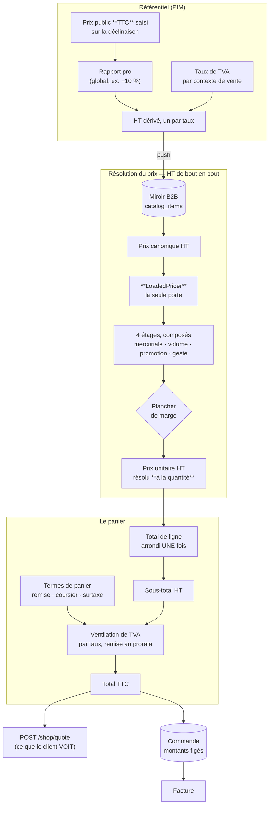

# Le prix — de l'étiquette à la facture

**Ouvert le 2026-09-06. Index refait le 2026-09-09.** L'entrée du dossier :
**vingt et un documents** décrivent la chaîne du prix. Celui-ci dit **de quoi
elle est faite**, **par quelle porte entrer**, et **dans quel état est chaque
document** — vérifié contre le code, pas relu.

> **Pourquoi un dossier `pricing/` et pas trois.** La chaîne traverse le
> référentiel, la boutique et la caisse. Rangée par contexte — `pim/`, `b2b/` —
> elle se lisait en trois morceaux dont aucun ne disait le tout, et c'est
> exactement ce qui rendait le sujet illisible.

> ## 🔴 Les deux documents à lire en premier
>
> |                            |                                                                                                                                            |
> | -------------------------- | ------------------------------------------------------------------------------------------------------------------------------------------ |
> | **Ce que le système fait** | [`comment-un-prix-se-fabrique.md`](comment-un-prix-se-fabrique.md) — la référence courte, en schémas, avec dix-neuf cas de figure chiffrés |
> | **Ce qui reste à faire**   | [`ce-qui-reste-a-faire.md`](ce-qui-reste-a-faire.md) — **le registre unique**. Aucun autre document ne tient de liste d'ouverts            |

---

## 1. La chaîne, en un schéma

| Étage          | Ce qu'il décide                                                               | Où c'est écrit                                                     |
| -------------- | ----------------------------------------------------------------------------- | ------------------------------------------------------------------ |
| **Ancrage**    | le prix est SAISI en TTC public ; chaque taux en dérive son HT                | [`architecture-prix-ancre-ttc.md`](architecture-prix-ancre-ttc.md) |
| **Résolution** | quatre étages composent un prix unitaire HT **à la quantité demandée**        | [`comment-un-prix-se-fabrique.md`](comment-un-prix-se-fabrique.md) |
| **Panier**     | les lignes s'additionnent, les termes de panier s'ajoutent, la TVA se ventile | [`ajouter-un-terme-au-panier.md`](ajouter-un-terme-au-panier.md)   |
| **Devis**      | le serveur — jamais le navigateur — dit ce que ça coûtera                     | [`architecture-prix-boutique.md`](architecture-prix-boutique.md)   |

---

## 2. Le vocabulaire, en neuf lignes

Ces mots reviennent partout et ne veulent pas dire ce qu'on croit.

| Mot                      | Ce qu'il désigne ici                                                                                         |
| ------------------------ | ------------------------------------------------------------------------------------------------------------ |
| **Canonique**            | le prix HT du référentiel, avant toute règle. Le prix d'entrée.                                              |
| **Mercuriale**           | un prix négocié pour un client. Elle **scelle** : posée, elle rend les étages suivants transparents.         |
| **Étage**                | un des quatre niveaux de règle. Ils se **composent**, ils ne s'additionnent pas.                             |
| **Plancher**             | la marge minimale. Une **post-condition** : il n'entre pas dans le calcul, il le refuse.                     |
| **Barème**               | une grille de paliers de volume, ouverte à tous. À ne pas confondre avec une mercuriale, qui vise UN client. |
| **Millicentime**         | 10⁻⁵ €. L'unité d'un **prix unitaire**, qui se dérive. Un **montant** encaissé est en centimes.              |
| **Terme de panier**      | remise de retrait, frais de zone, surtaxe de retard. Par commande, jamais par ligne.                         |
| **Ventilation**          | la TVA calculée par **taux**, remise déduite au prorata, arrondie une fois par groupe.                       |
| **Résolu à la quantité** | le prix d'une ligne dépend de sa quantité. C'est pourquoi le front **ne multiplie jamais**.                  |

---

## 3. Par quelle porte entrer

**Je veux COMPRENDRE.**

| La question                                                              | Le document                                                                                            |
| ------------------------------------------------------------------------ | ------------------------------------------------------------------------------------------------------ |
| **Comment un prix se fabrique, concrètement ?**                          | [`comment-un-prix-se-fabrique.md`](comment-un-prix-se-fabrique.md) — **commencer ici**                 |
| Pourquoi il n'y a qu'un seul objet qui fabrique un prix ?                | [`architecture-pricer.md`](architecture-pricer.md)                                                     |
| Pourquoi un prix se saisit en TTC alors que tout est HT ?                | [`architecture-prix-ancre-ttc.md`](architecture-prix-ancre-ttc.md) §A                                  |
| Que veulent dire exactement « étage », « spécificité », « scellement » ? | [`architecture-resolution-de-prix.md`](architecture-resolution-de-prix.md) — la sémantique             |
| Pourquoi la TVA se calcule par taux et pas sur le total ?                | [`ajouter-un-terme-au-panier.md`](ajouter-un-terme-au-panier.md) §2                                    |
| Qu'est-ce que la boutique a le droit de montrer ?                        | [`architecture-prix-boutique.md`](architecture-prix-boutique.md) §4                                    |
| Qu'est-ce qu'un commercial voit quand il pose une règle ?                | [`ecrans-de-tarification.md`](ecrans-de-tarification.md)                                               |
| **Qu'est-ce qu'une mercuriale, exactement ?**                            | [`mercuriales/comprendre-une-mercuriale.md`](mercuriales/comprendre-une-mercuriale.md) — la définition |
| Qui décide de poser une promotion, et où ?                               | [`decision-qui-pose-une-promotion.md`](decision-qui-pose-une-promotion.md)                             |

**Je veux IMPLÉMENTER.**

| Ce que je m'apprête à faire                                | Le document                                                                                                                             |
| ---------------------------------------------------------- | --------------------------------------------------------------------------------------------------------------------------------------- |
| **Obtenir un prix, où que je sois**                        | [`comment-un-prix-se-fabrique.md`](comment-un-prix-se-fabrique.md) §3 — une méthode par question, et rien à assembler soi-même          |
| Ajouter une remise, un frais, une taxe au panier           | [`ajouter-un-terme-au-panier.md`](ajouter-un-terme-au-panier.md) — la liste à cocher est au §5                                          |
| Toucher au chargement des règles de prix                   | [`plan-materiaux-de-prix.md`](plan-materiaux-de-prix.md)                                                                                |
| Mesurer ou optimiser la résolution                         | [`optimisation-resolution-de-prix.md`](optimisation-resolution-de-prix.md) — **avant de mesurer, lire pourquoi le temps ne compte pas** |
| Afficher un montant quelque part                           | [`plan-decompte-du-panier-ht.md`](plan-decompte-du-panier-ht.md)                                                                        |
| Toucher à la grille, la frise, le simulateur, les gabarits | [`ecrans-de-tarification.md`](ecrans-de-tarification.md)                                                                                |

**Je veux savoir CE QUI CLOCHE.**

Un seul document : [`ce-qui-reste-a-faire.md`](ce-qui-reste-a-faire.md).

---

## 4. L'état de chaque document

Vérifié contre le code le **2026-09-09**. Un document 🔴 ferait construire à
faux ; un document 🟡 dit vrai sur ce qu'il décrit mais a été dépassé sur un
point, écrit dans son bandeau.

### La référence — ce qui décrit l'état réel

| Document                                                                               | État | Ce qu'il porte                                                                                                |
| -------------------------------------------------------------------------------------- | ---- | ------------------------------------------------------------------------------------------------------------- |
| [`comment-un-prix-se-fabrique.md`](comment-un-prix-se-fabrique.md)                     | ✅   | La référence courte, en schémas. 19 cas de figure chiffrés.                                                   |
| [`architecture-pricer.md`](architecture-pricer.md)                                     | ✅   | Les trois objets, le nom, et pourquoi le pipeline n'a qu'**une** entrée.                                      |
| [`architecture-prix-ancre-ttc.md`](architecture-prix-ancre-ttc.md)                     | ✅   | Le prix se saisit en TTC ; le HT est un **résultat**.                                                         |
| [`ajouter-un-terme-au-panier.md`](ajouter-un-terme-au-panier.md)                       | ✅   | Les quatre questions, et la liste des ~20 fichiers.                                                           |
| [`ecrans-de-tarification.md`](ecrans-de-tarification.md)                               | ✅   | Ce qu'un commercial voit, et ce que ça l'empêche de faire.                                                    |
| [`mercuriales/comprendre-une-mercuriale.md`](mercuriales/comprendre-une-mercuriale.md) | ✅   | La définition, le scellement, et **cinq limites levées sur six** — la dernière est R11.                       |
| [`architecture-resolution-de-prix.md`](architecture-resolution-de-prix.md)             | 🟡   | La **sémantique** des étages — irremplaçable. Son en-tête annonçait S5 comme restant : corrigé le 2026-09-09. |
| [`architecture-prix-boutique.md`](architecture-prix-boutique.md)                       | 🟡   | Deux de ses décisions ont été **renversées** ; son bandeau dit lesquelles.                                    |
| [`decision-qui-pose-une-promotion.md`](decision-qui-pose-une-promotion.md)             | ✅   | Pourquoi la promotion n'est pas au référentiel.                                                               |

### Les plans livrés — on les lit pour le raisonnement

| Document                                                                                                   | État | Ce qu'il porte                                                                                                                                                                                                                                                                                                                                                                                                  |
| ---------------------------------------------------------------------------------------------------------- | ---- | --------------------------------------------------------------------------------------------------------------------------------------------------------------------------------------------------------------------------------------------------------------------------------------------------------------------------------------------------------------------------------------------------------------- |
| [`architecture-la-porte-du-prix.md`](architecture-la-porte-du-prix.md)                                     | ✅   | **LA porte du prix, telle qu'elle tourne.** Les quatre objets et lesquels sont internes, **qui l'emprunte** (trois appelants sur quatre) et pourquoi le quatrième n'y passe pas, ce que chaque décision rend impossible **avec le défaut qu'elle a réellement attrapé**, et à quel **cran** chaque garantie tient — un type, une porte CI, un refus à l'exécution. Plus un §6 qui nomme ce qui manque, chiffré. |
| [`plan-materiaux-de-prix.md`](plan-materiaux-de-prix.md)                                                   | ✅   | Charger une fois. **N'accélère rien** — et c'est le point.                                                                                                                                                                                                                                                                                                                                                      |
| [`plan-boutique-sur-api.md`](plan-boutique-sur-api.md)                                                     | ✅   | La boutique lit l'API ; l'argent cesse d'avoir deux sources.                                                                                                                                                                                                                                                                                                                                                    |
| [`plan-decompte-du-panier-ht.md`](plan-decompte-du-panier-ht.md)                                           | ✅   | Le panier compte en HT, comme la facture. **B5 compris** — la surtaxe de retard, que l'en-tête annonçait encore en attente.                                                                                                                                                                                                                                                                                     |
| [`mercuriales/plan-la-mercuriale-devient-un-objet.md`](mercuriales/plan-la-mercuriale-devient-un-objet.md) | ✅   | Livré. Porte les **deux versions contredites** avant la bonne.                                                                                                                                                                                                                                                                                                                                                  |
| [`optimisation-resolution-de-prix.md`](optimisation-resolution-de-prix.md)                                 | ✅   | Le coût réel, et pourquoi le chronomètre ment.                                                                                                                                                                                                                                                                                                                                                                  |

### Les registres — ce qui a été trouvé, et où en est le travail

| Document                                                                                             | État | Ce qu'il porte                                                                                                                                                                                                                                                                                                                                                                                                                                                                 |
| ---------------------------------------------------------------------------------------------------- | ---- | ------------------------------------------------------------------------------------------------------------------------------------------------------------------------------------------------------------------------------------------------------------------------------------------------------------------------------------------------------------------------------------------------------------------------------------------------------------------------------ |
| [`ce-qui-reste-a-faire.md`](ce-qui-reste-a-faire.md)                                                 | 🔴   | **Le registre unique.** Vingt-six entrées — cinq closes, une à moitié (R15), douze ajoutées par le troisième regard le 2026-09-08.                                                                                                                                                                                                                                                                                                                                             |
| [`journal-de-remediation.md`](journal-de-remediation.md)                                             | 🟢   | **Ce qu'on a décidé, et l'autre branche.** Une entrée par constat traité, en six temps : le constat, la **racine**, les branches ouvertes, celle qu'on prend et ce qu'elle coûte, ce qui a changé, ce qui le prouve. Ne se réécrit pas — **R15** y garde la branche qu'elle avait écartée à tort, **R16** l'analyse que la contradiction a renversée, **R20** la méthode pour une doc périmée.                                                                                 |
| [`audit-calcul-du-panier-et-du-prix.md`](audit-calcul-du-panier-et-du-prix.md)                       | ✅   | Registre **clos** : dix défauts, treize lots, tous refermés.                                                                                                                                                                                                                                                                                                                                                                                                                   |
| [`audit-fable.md`](audit-fable.md)                                                                   | ✅   | **Le second regard, et ce qu'il a produit.** Sept de ses huit lots sont faits ; chacun est réécrit au présent, avec ce qui l'a fermé. Le huitième n'est pas un commit : il attend une décision.                                                                                                                                                                                                                                                                                |
| [`durcir-le-calcul-des-prix.md`](durcir-le-calcul-des-prix.md)                                       | ✅   | **Quatre chantiers sur cinq, bâtis.** La note par axe en deux colonnes — la photo qui a motivé le travail, l'état vérifié. Et un §7 qui dit les deux fois où ce document s'est trompé.                                                                                                                                                                                                                                                                                         |
| [`audit-du-moteur-a-la-facade.md`](audit-du-moteur-a-la-facade.md)                                   | 🟡   | **Le troisième regard, du moteur à la façade (2026-09-08).** 7/10 : le moteur mérite 9, le système autour ne le suit pas. Onze constats — `Pricer` sans appelant, deux séquences de chargement, une lecture datée fausse dès qu'on a archivé, la projection qui ouvre la porte de marge sur un cumul, l'engagement de famille mesuré par SKU, treize commentaires « centimes » — tous au registre (R15–R26), une conception de façade unique en C.4, et la note projetée en F. |
| [`mercuriales/etat-des-lieux-mercuriale-client.md`](mercuriales/etat-des-lieux-mercuriale-client.md) | ✅   | **Comment un client reçoit un tarif négocié.** Les deux gestes qui convergent sur le même agrégat, les quatre couches, et ce que les cinq fermetures ont établi — en affirmations, plus en manques.                                                                                                                                                                                                                                                                            |

### Ce qui n'est pas tranché

| Document                                                                               | État | Ce qu'il porte                                                                                |
| -------------------------------------------------------------------------------------- | ---- | --------------------------------------------------------------------------------------------- |
| [`architecture-prix-vivant-prix-bloque.md`](architecture-prix-vivant-prix-bloque.md)   | 🔵   | « Qui porte le risque d'un prix qui bouge ? » **Zéro code.** Décision attendue (R13).         |
| [`architecture-conditionnements-pricing.md`](architecture-conditionnements-pricing.md) | 🔴   | **Périmé** : son point de départ est faux depuis le 2026-08-31. À réécrire ou archiver (R14). |

---

## 5. Les six règles qui ne se négocient pas

Chacune a déjà été enfreinte une fois, et chaque infraction a coûté.

1. **Il n'y a qu'un seul fabricant de prix.** `LoadedPricer` est le seul
   appelant de `resolvePrice`, et `lint:price-pipeline` le tient à **une**
   entrée. Une variante de la question est une **méthode** de plus, jamais un
   appel de plus.
2. **Le front ne multiplie jamais.** Il demande une route qui résout chaque
   ligne à sa quantité réelle. Une multiplication est exacte tant qu'aucun
   palier n'existe, et fausse **en silence** le jour où il en existe un.
3. **Un montant ne se calcule qu'à un seul endroit.** Le TTC vient de
   `ventilateVat`, jamais recomposé à côté. Deux définitions tombent juste
   jusqu'au jour où l'une gagne un terme que l'autre ignore.
4. **Un prix unitaire est en millicentimes, un montant encaissé en centimes.**
   Un nom en `*Cents` qui porte des millicentimes est un défaut, pas un
   raccourci — la porte `lint:money-units` le refuse.
5. **L'arrondi a lieu une fois par ligne, et une fois par taux.** Jamais deux
   fois sur le même nombre.
6. **Un taux de TVA ne s'invente pas.** Constante quand la loi ne laisse pas le
   choix, réglage quand personne ne sait, jamais un défaut : un taux inventé
   facture rétroactivement toutes les commandes concernées.

---

## 6. Ce que ce dossier ne couvre pas

- **La facturation** — l'émission des documents comptables :
  [`../b2b/architecture-facturation.md`](../b2b/architecture-facturation.md).
- **Le catalogue** — comment les articles arrivent du référentiel :
  [`../b2b/architecture-catalogue-synchronise.md`](../b2b/architecture-catalogue-synchronise.md).
- **Le paiement** — Stripe, mandats SEPA, termes négociés : `../b2b/`.
