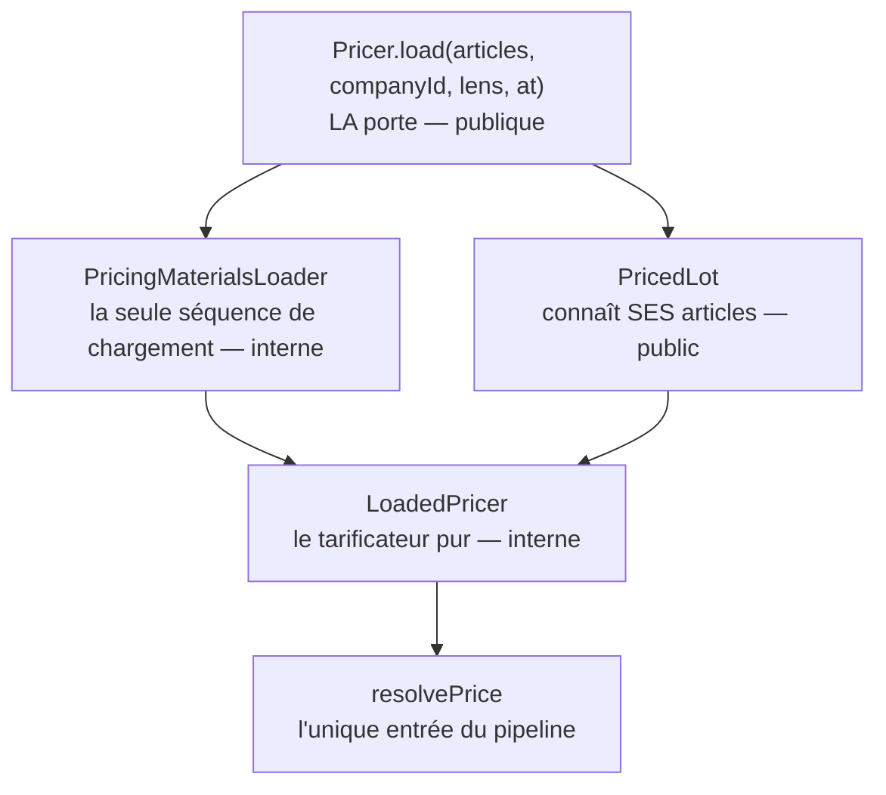

# La porte du prix

> **État réel au 2026-09-09.** Ce document décrit ce qui **tourne**. Ce qui reste
> ouvert est au §6, nommé — pas suggéré.
>
> Il a d'abord été un plan — même fichier, autre nom —, contredit par `vitruve`
> sur ses quatre décisions puis bâti en quatre lots. Le raisonnement, les
> versions démolies et ce que chaque lot a trouvé en chemin vivent au
> [journal de remédiation](journal-de-remediation.md), §R26. Ici, seulement
> l'état.

---

## 1. Demander un prix

```ts
const lot = await this.pricer.load({
  articles, // des CatalogArticle — scellés par le catalogue
  companyId, // `null` = un visiteur
  lens: "measured", // par défaut ; "unproven" pour qui ne prouve rien
  at, // optionnel — l'instant de résolution
});

lot.price("VIE-001", 12); // le prix, et toute sa trace
lot.all(lignes); // plusieurs, dans l'ordre demandé
lot.tiers("VIE-001", 12); // la grille des paliers
lot.projectAt("VIE-001", 10_000); // « si le cumul valait N »
```

**C'est la seule façon d'obtenir un prix hors de `b2b/pricing/`**, et
`lint:price-door` le tient.

## 2. Les quatre objets, et l'ordre qui compte



| Objet                    | Visibilité   | Ce qu'il fait                                                             |
| ------------------------ | ------------ | ------------------------------------------------------------------------- |
| `Pricer`                 | **publique** | prend des articles scellés, charge une fois, rend un lot                  |
| `PricedLot`              | **publique** | répond par SKU ; refuse un SKU qu'il n'a pas chargé                       |
| `PricingMaterialsLoader` | interne      | quatre lectures par lot, quelle qu'en soit la taille ; mesure les preuves |
| `LoadedPricer`           | interne      | compose les étages ; **seul appelant de `resolvePrice`**                  |

## 3. Ce que chaque décision rend impossible

Chacune a **attrapé un défaut réel**, la plupart le jour même. C'est ce qui les
distingue d'une préférence.

| Décision                                     | Ce qu'elle rend impossible                                       | Ce qu'elle a attrapé                                                              |
| -------------------------------------------- | ---------------------------------------------------------------- | --------------------------------------------------------------------------------- |
| **La porte prend des ARTICLES, pas des SKU** | qu'un appelant contourne pour éviter une relecture de catalogue  | la vitrine contournait, avec une permission écrite dans le JSDoc de la façade     |
| **L'article est SCELLÉ** (`CatalogArticle`)  | qu'un prix d'entrée vienne de l'appelant plutôt que du catalogue | six traductions dispersées ; et un sceau périmé sur la lecture datée du tableau   |
| **Le lot connaît ses articles**              | qu'on tarife un article que le lot n'a pas chargé                | un prix plausible : matériaux corrects par accident du cache, **preuves fausses** |
| **La lentille nomme les preuves recevables** | que « ce qu'on écarte » s'encode en trois endroits               | R15 — une porte de plancher ouverte sur une quantité inventée                     |
| **Une seule entrée de `resolvePrice`**       | une sixième recette de fabrication d'un prix                     | 1,83924 € à l'écran contre 1,65532 € à la caisse                                  |

### Les crans, et ce que chacun tient vraiment

Le dépôt ordonne ses garde-fous : _inexprimable > refusé en base > refusé par
l'agrégat > porte CI > relecture_. Chaque garantie ci-dessus vit à un cran
précis, et **prétendre qu'elle vit plus haut qu'elle ne vit est la faute que ce
dossier traque** :

| Garantie                           | Cran                            | Ce qui reste possible                                                       |
| ---------------------------------- | ------------------------------- | --------------------------------------------------------------------------- |
| l'article scellé                   | **inexprimable** + **porte CI** | `{ … } as CatalogArticle` **compile** — vérifié. D'où `catalogue-authority` |
| le lot connaît ses articles        | **refusé à l'exécution**        | rien : `ArticleNotInLotError` lève                                          |
| les rouages sont internes          | **porte CI**                    | rien ne l'empêche au compilateur ; `price-door` le voit en relecture        |
| une seule entrée de `resolvePrice` | **porte CI**                    | idem ; `price-pipeline` compte les entrées déclarées                        |

## 4. Qui l'emprunte

| Appelant                       | Lentille   | Quantité          | Ce qu'il demande                                        |
| ------------------------------ | ---------- | ----------------- | ------------------------------------------------------- |
| `OrderLinePricing`             | `measured` | celle du panier   | le prix **facturé** — devis, commande, vitrine reconnue |
| `ShopCataloguePricing`         | `measured` | **1**             | le rayon, public et reconnu                             |
| `PriceProjectionQuery`         | `unproven` | le niveau projeté | la courbe du banc d'essai                               |
| ~~le tableau de tarification~~ | —          | —                 | **n'y passe pas** — cf. §6                              |

**Trois sur quatre.** Le quatrième est nommé plutôt que tu.

## 5. Ce qui l'éprouve

| Niveau                                           | Cas     | Ce qu'il couvre                                                            |
| ------------------------------------------------ | ------- | -------------------------------------------------------------------------- |
| `pricing/domain/__tests__`                       | **205** | la composition, la spécificité, le plancher, les paliers, l'arrondi unique |
| `priced-lot.spec.ts`                             | 8       | le lot, et le refus d'un SKU hors lot                                      |
| `pricer.spec.ts`                                 | 14      | la porte : chargement unique, ordre, doublon, lot vide, lentille           |
| `board-item.spec.ts`                             | 8       | le tableau                                                                 |
| `pricer.e2e-spec.ts`                             | 11      | la porte contre un vrai Postgres                                           |
| `pricing-budget.e2e-spec.ts`                     | 9       | les **opérations ORM** — le coût, pas seulement le résultat                |
| `admin-pricing`, `price-rules`, `shop-catalogue` | 150     | le prix servi, la parité rayon ↔ devis, la lecture datée                   |

Et **cinq portes** la tiennent : `price-door`, `price-pipeline`,
`catalogue-authority`, `import-cycles`, `context-boundaries`.

## 6. Ce qui manque

Nommé, avec ce que ça coûte — une façade qu'on annonce complète alors qu'un
appelant passe à côté est pire qu'une façade assumée partielle.

### 🔴 Le tableau de tarification n'emprunte pas la porte

Il monte ses matériaux à la main (`board-item.ts`) et appelle `LoadedPricer.over`
en direct : c'est la **seconde séquence de chargement** du dépôt (**R21**).

**Et ce n'est pas un oubli.** Il lit ses matériaux **à une date**
(`unarchivedAt(at)`), là où le chargeur lit `archivedAt: null` en absolu. Le
faire passer par la porte demande que le chargeur sache lire une date — c'est
**R17**, non tranché.

Conséquence : `LoadedPricer.over` garde **deux** appelants.

⚠️ Et `price-door` **ne le voit pas** — `board-item.ts` vit dans `b2b/pricing/`,
donc dans le contexte que la porte autorise à connaître ses propres rouages. La
porte tient la frontière **externe** ; elle ne dit rien de la seconde séquence
interne, et c'est R21 qui la porte.

### 🟠 `at` est accepté, mais ne remonte pas le temps

`load({ at })` transmet l'instant, et les lecteurs de matériaux filtrent
`archivedAt: null` **en absolu**. Une lecture datée rend donc les décisions
d'**aujourd'hui**, présentées comme celles d'alors. C'est **R17**, et c'est le
défaut le plus dangereux de cette liste : il rend une réponse **plausible**.

### 🟡 Le gain de la lentille n'est pas mesuré

`unproven` évite une lecture d'engagements. Un doublé prouve que le port n'est
pas interrogé ; **aucun test ne compte les opérations ORM de la projection** —
`pricing-budget` couvre le devis et le tableau, pas elle. Le gain est lu dans le
code, pas mesuré, et le dire ainsi vaut mieux que de faire passer une lecture
pour un chiffre.

### 🟡 Ce que la porte n'a pas emporté

Relevés par l'audit et **toujours vrais** : la quantité n'est lue par rien du
chargement ; `mercurialeAlone` prend cinq paramètres dont un que son objet porte
déjà ; `PricedArticle.floorMillicents` duplique `floorDecision.floorMillicents` ;
`OrderLinePricing.resolve(…, at?)` a un paramètre qu'aucun appelant ne passe ; le
domaine importe `@lfd/contracts` ; la lecture n'est pas sur le bus.

Aucun ne produit un prix faux. Ils sont au registre, pas ici.

## 7. Ce que la porte ne fait pas, et ne fera pas

- **Elle ne compose pas un panier.** Acheminement, TVA, totaux appartiennent à
  `OrderLinePricing` : une somme de prix d'articles n'est pas une commande.
- **Elle n'écrit rien.** Le chemin qui facture ne doit pas pouvoir poser un
  tarif.
- **Elle ne résout pas de SKU.** Elle l'a fait, et c'est ce qui la rendait
  contournable — trois conséquences qui se tenaient la main : une lecture en
  trop, une permission de contourner écrite dans son propre JSDoc, et un cycle
  de modules refusé par la CI. Résoudre un SKU est le travail de qui a un SKU.
