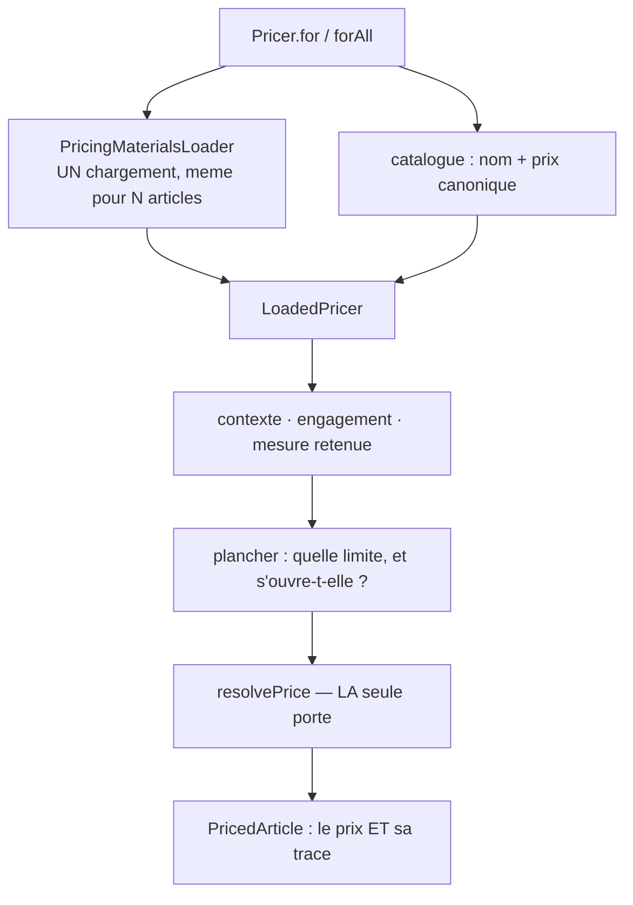

# Le `Pricer` — la porte d'entrée du prix

**Écrit le 2026-09-09, bâti le même jour.** ✅ Implémenté.

> Le pipeline est unique depuis le 2026-09-08 : `resolvePrice` assemble
> elle-même les étages. **Son mode d'emploi ne l'était pas** — cinq appelants
> écrivaient chacun la séquence qui y mène. Ce document décrit l'objet qui la
> porte désormais seul.

> ⚠️ **Ce document a d'abord décrit autre chose.** Sa première version annonçait
> une façade qui chargerait ses matériaux et appellerait `resolvePrice`
> elle-même — la **sixième** entrée du pipeline. Bâtir l'a démentie sur deux
> points, tous deux repris ci-dessous : une sixième séquence de chargement est
> une sixième occasion d'oublier un étage, et sa surface **oubliait les
> engagements de volume**, ce qui aurait fabriqué la troisième divergence le
> jour de sa naissance.

---

## 1. Le problème, mesuré

Pour obtenir **un** prix, un consommateur écrivait ceci :

```ts
const item = await this.catalog.resolve(sku);
if (item === null) throw new UnknownSkuError(sku);
const context = pricingContextFor(item.sku, item.category, quantity, { companyId }, at, null);
const [rules, floors, ladders, mercuriale] = await Promise.all([...]);
const scoped = resolveScopedFloor(floors, context);
const applied = scoped === null ? null : decideFloor(scoped.policy, {...}).applied;
resolvePrice(item.unitPriceMillicents, { rules, ladders, mercuriale }, context, applied);
```

**Cinq ports, trois fonctions de domaine, un ordre à connaître.** Une vingtaine
de lignes avant d'avoir un chiffre — et il en manquait encore une, la résolution
de l'engagement de volume, que seule la caisse écrivait.

Ce n'est pas une gêne esthétique : **c'est la cause des deux divergences
connues.** Chacun des cinq appelants avait réécrit cette séquence à la main, et
deux s'étaient trompés — l'écran de tarification avait oublié les barèmes
(1,83924 € contre 1,65532 € à la caisse), la projection avait oublié la
mercuriale (une courbe au tarif catalogue pour un client qui en avait un).

## 2. Les trois objets

| Objet                        | Où                                | Ce qu'il fait                                                                                 |
| ---------------------------- | --------------------------------- | --------------------------------------------------------------------------------------------- |
| **`LoadedPricer`**           | `pricing/domain/loaded-pricer.ts` | 🔴 **LE tarificateur.** Pur, matériaux en main. **Seul appelant de `resolvePrice` du dépôt.** |
| **`PricingMaterialsLoader`** | `pricing/application/`            | La **seule** séquence de chargement. Quatre lectures par lot, quelle qu'en soit la taille.    |
| **`Pricer`**                 | `pricing/application/pricer.ts`   | La porte pour qui n'a **rien** en main : un SKU, un client, une quantité.                     |

Un appelant qui charge déjà en lot — la caisse, l'écran de tarification —
s'adresse au `LoadedPricer` directement ; lui faire repasser par le `Pricer` lui
ferait relire le catalogue. **Ce qu'aucun ne peut plus faire, c'est écrire sa
propre recette.**

### Pourquoi ce nom

Une façade se juge **au point d'appel**. Le critère de choix était donc : quelle
phrase la plus courte reste vraie ?

```ts
const priced = await this.pricer.for({ sku, companyId, quantity });
```

**Ce qui a été écarté, et pourquoi** — un nom écarté sans raison revient :

| Nom                     | Pourquoi non                                                                                                                                               |
| ----------------------- | ---------------------------------------------------------------------------------------------------------------------------------------------------------- |
| `PriceResolver`         | `resolvePrice` **est** la résolution. Deux « resolvers » feraient croire à deux calculs.                                                                   |
| `PricingService`        | Ne dit rien. Le suffixe `Service` est le nom qu'on donne à ce qu'on n'a pas su nommer.                                                                     |
| `Quoter` / `PriceQuote` | `ShopQuote` existe déjà et désigne **un panier chiffré**. Réutiliser le mot ferait passer un prix d'article pour un devis.                                 |
| `PriceBook`             | Un livre de prix EST une mercuriale. Le mot est pris, et par un objet voisin.                                                                              |
| `Tarificateur`          | Le code reste en anglais (§8). `mercuriale` est l'exception écrite parce que le mot est **plus précis** que sa traduction ; « tarificateur » ne l'est pas. |

## 3. Ce que le tarificateur expose

Une question, une méthode. Ce sont des **variantes de la même question**, pas des
recettes de plus — chacune écarte délibérément quelque chose, et sa raison est
écrite au-dessus d'elle.

| La question                         | La méthode                          | Ce qu'elle écarte                                                                                                                                                                               |
| ----------------------------------- | ----------------------------------- | ----------------------------------------------------------------------------------------------------------------------------------------------------------------------------------------------- |
| « combien coûte cet article ? »     | `price(item, quantity)`             | —                                                                                                                                                                                               |
| « et pour ces dix-là ? »            | `priceAll(items)`                   | —                                                                                                                                                                                               |
| « à combien je lui fais les 100 ? » | `tiers(item, quantity)`             | —                                                                                                                                                                                               |
| « si le cumul valait N ? »          | `priceAtCumulative(item, n)`        | les **preuves** et les **engagements** : une projection ne prouve ni un volume observé, ni une commande — la porte d'un plancher dynamique y reste donc fermée des deux côtés (R15, 2026-09-09) |
| « ce que le marché paie »           | `mercurialeAlone(...)` _(statique)_ | **barème et plancher** : on mesure ce qu'une mercuriale accorde SEULE                                                                                                                           |

Et pour qui n'a qu'un SKU : `Pricer.for(request)` / `Pricer.forAll(request)`.

### `PriceRequest`

```ts
export interface PriceRequest {
  readonly sku: string;
  /** `null` = un visiteur sans société : le tarif public, et aucune mercuriale lue. */
  readonly companyId: string | null;
  /** 🔴 Obligatoire — voir ci-dessous. */
  readonly quantity: number;
  /** Absent = l'horloge injectée. Renseigné pour les lectures datées. */
  readonly at?: Date | undefined;
}
```

🔴 **La quantité est obligatoire.** « Le prix » n'existe pas sans elle dès qu'un
barème ou une mercuriale à paliers est posé. Un défaut à `1` fabriquerait un
chiffre plausible et faux — exactement la famille de défaut que ce dossier passe
son temps à traquer. Une vitrine écrit `quantity: 1`, et cette ligne **dit ce
qu'elle fait**.

🔴 **Rien ne rend jamais un nombre nu.** `PricedArticle` porte le prix **et sa
trace** — étages traversés, règle qui a scellé, celles qu'elle a évincées,
décision de plancher figée, mesure d'engagement. Un prix sans sa trace est un
prix qu'on ne peut pas défendre six mois plus tard, quand la règle qui l'a
produit a été retirée.



## 4. Ce que le `Pricer` ne fait pas

| La question                       | Qui répond                    | Pourquoi pas lui                                                                                                                                                                          |
| --------------------------------- | ----------------------------- | ----------------------------------------------------------------------------------------------------------------------------------------------------------------------------------------- |
| « Combien coûte ce **panier** ? » | `OrderLinePricing`            | Un panier porte un acheminement, des frais, des taux de TVA et des totaux. Ce n'est pas une somme de prix d'articles.                                                                     |
| « **Pose** ce prix. »             | les commandes de tarification | Lecture seule. Le chemin qui facture ne doit pas pouvoir écrire un tarif — c'est déjà la règle des ports, et le découpage `PricingModule` / `PricingAdminModule` la porte dans le graphe. |

La projection, le comparatif et la grille des paliers **ne sont plus des refus** :
la première version de ce document les écartait, et c'était l'erreur qui menait à
cinq recettes. Ce sont des **méthodes**, parce que ce sont des variantes de la
même question — et chacune a désormais son écart écrit plutôt que réinventé.

## 5. Où il se branche

🔴 **`lint:price-pipeline` est passé de cinq entrées à une.**

```
src/b2b/pricing/domain/loaded-pricer.ts   ← le tarificateur
src/b2b/pricing/domain/resolve-price.ts   ← la définition
```

La règle qui accompagne la porte :

> **La liste des entrées ne peut plus grandir.** Elle est à un.

Une sixième divergence demanderait de modifier une porte CI, ce qui se voit en
relecture. Et la question à se poser en la lisant : _le tarificateur ne peut-il
vraiment pas répondre ?_ Si c'est une **variante** de la question, c'est une
méthode de plus sur `LoadedPricer`, pas un appel de plus à `resolvePrice`.

C'est le même geste que le barème et la mercuriale : on ne supprime pas les
chemins existants, on ferme **la façon d'en ouvrir un nouveau**.

## 6. Ce qui est éprouvé

- **`loaded-pricer.spec.ts` — 22 cas, aucun doublé.** L'ordre des décisions, ce
  que chaque méthode lit, et surtout ce que chacune **écarte** : la projection
  qui n'ouvre pas la porte dynamique alors que la mesure est là, le comparatif
  qui n'applique ni barème ni plancher. Ces écarts ne se voient nulle part
  ailleurs — les méthodes reçoivent les mêmes matériaux.
- **`price-line.spec.ts` — les 8 cas de la caisse, inchangés.** La recette a
  changé de maison ; aucune assertion n'a bougé. C'est la preuve que la bascule
  n'a déplacé aucune décision.
- **`pricer.spec.ts` — 15 cas** sur la façade : ordre rendu, SKU inconnu qui fait
  échouer l'appel entier, doublon refusé, `at` réellement lu.
- **`pricer.e2e-spec.ts` — 12 cas sur la vraie base** : l'accord avec la caisse
  par HTTP sur quatre familles de divergence connues, le budget (dix articles =
  un seul), le mur (la mercuriale d'un autre client ne fuit pas), la lecture
  datée d'une mercuriale expirée.
- **`pricing-budget.e2e-spec.ts`** continue de compter les opérations ORM : le
  coût ne suit pas la taille du lot.

## 7. Ce qui a été tranché en bâtissant

- **L'instant par défaut** — résolu **explicitement dans le corps** de
  `Pricer.forAll` (`request.at ?? this.clock.now()`), jamais par une valeur par
  défaut dans une signature. Le dépôt a déjà payé
  `floorViewFromRow(now = new Date())`, dont le JSDoc dit « le pire des trois ».
  La valeur vient ici d'un port et non du mur ; la ressemblance de forme
  suffisait à écarter le défaut de paramètre. Même geste sur `boardMaterials`,
  dont l'`at` est devenu **obligatoire** au passage.
- **Le même article demandé deux fois est refusé** (`DuplicateArticleError`), et
  non fusionné : deux lignes de 5 sont-elles un panier de 10 — ce que la caisse
  en fait — ou deux demandes indépendantes ? Les deux lectures sont défendables
  et donnent des prix différents dès qu'un barème est posé.
- **La projection paie une lecture de plus** (les engagements, qu'elle ignore)
  parce qu'elle passe par le chargeur commun. Préféré à un drapeau
  `{ commitments: false }` qu'on finirait par mettre à l'envers.
- **`volumeTierPrices` reçoit sa résolution en paramètre** au lieu de l'importer.
  C'est de l'indirection, et elle existe autant pour la porte CI que pour la
  structure : la grille sonde des quantités, elle n'a pas à savoir comment un
  prix se fabrique.
