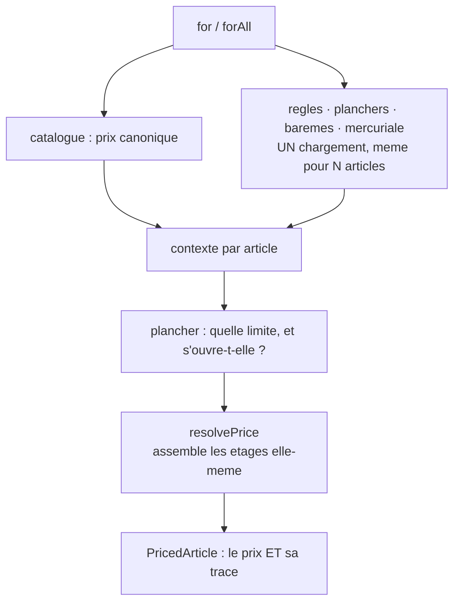

# Le `Pricer` — la porte d'entrée du prix

**Écrit le 2026-09-09.** 📐 Doc-first : décidé, rien n'est bâti.

> Le pipeline est unique depuis le 2026-09-08 : `resolvePrice` assemble
> elle-même les étages, et `lint:price-pipeline` en inventorie les cinq entrées.
> **Son mode d'emploi, lui, ne l'est pas.** Ce document décrit la façade qui le
> devient.

---

## 1. Le problème, mesuré

Pour obtenir **un** prix aujourd'hui, un consommateur écrit ceci :

```ts
constructor(catalog, priceRules, priceFloors, volumeLadders, mercuriales) {}

const item = await this.catalog.resolve(sku);
if (item === null) throw new UnknownSkuError(sku);

const context = pricingContextFor(item.sku, item.category, quantity, { companyId }, at, null);

const [rules, floors, ladders, mercuriale] = await Promise.all([
  this.priceRules.candidatesFor(context),
  this.priceFloors.candidatesFor(context),
  this.volumeLadders.candidatesFor(context),
  this.mercuriales.liveFor(companyId, at),
]);

const scoped = resolveScopedFloor(floors, context);
const applied =
  scoped === null ? null : decideFloor(scoped.policy, { quantity, observedVolumeRatioBp: null }).applied;

resolvePrice(item.unitPriceMillicents, { rules, ladders, mercuriale }, context, applied);
```

**Cinq ports, trois fonctions de domaine, un ordre à connaître, deux signatures
de chargement différentes.** Une vingtaine de lignes avant d'avoir un chiffre.

Ce n'est pas une gêne esthétique : **c'est la cause des deux divergences
connues**. Chacun des cinq appelants a réécrit cette séquence à la main, et deux
se sont trompés — l'écran de tarification a oublié les barèmes (1,83924 € contre
1,65532 € à la caisse), la projection a oublié la mercuriale (une courbe au tarif
catalogue pour un client qui en avait un). Les deux sont corrigés ; **la
séquence qui les a produits ne l'est pas.**

## 2. Le nom

**`Pricer`**, et ses méthodes `for` / `forAll`.

Une façade se juge **au point d'appel**, pas dans sa définition — c'est tout ce
qu'elle a à offrir. Le critère de choix était donc : quelle phrase la plus courte
reste vraie ?

```ts
const priced = await this.pricer.for({ sku, companyId, quantity });
```

« Le tarificateur, pour ceci. » On ne peut pas faire plus court sans mentir.

**Ce qui a été écarté, et pourquoi** — un nom écarté sans raison revient :

| Nom                     | Pourquoi non                                                                                                                                               |
| ----------------------- | ---------------------------------------------------------------------------------------------------------------------------------------------------------- |
| `PriceResolver`         | `resolvePrice` **est** la résolution. Deux « resolvers » feraient croire à deux calculs, alors que la façade ne calcule rien : elle assemble et demande.   |
| `PricingService`        | Ne dit rien. Le suffixe `Service` est le nom qu'on donne à ce qu'on n'a pas su nommer.                                                                     |
| `Quoter` / `PriceQuote` | `ShopQuote` existe déjà et désigne **un panier chiffré** — acheminement, TVA, totaux. Réutiliser le mot ferait passer un prix d'article pour un devis.     |
| `PriceBook`             | Un livre de prix EST une mercuriale. Le mot est pris, et par un objet voisin.                                                                              |
| `Tarificateur`          | Le code reste en anglais (§8). `mercuriale` est l'exception écrite parce que le mot est **plus précis** que sa traduction ; « tarificateur » ne l'est pas. |

## 3. La surface

```ts
export interface PriceRequest {
  readonly sku: string;
  /** `null` = un visiteur sans société : le tarif public. */
  readonly companyId: string | null;
  /**
   * 🔴 **Obligatoire.** « Le prix » n'existe pas sans quantité dès qu'un barème
   * ou une mercuriale à paliers est posé. Un défaut à 1 fabriquerait un chiffre
   * plausible et faux — exactement la famille de défaut que ce dossier passe
   * son temps à traquer. Une vitrine écrit `quantity: 1`, et cette ligne DIT ce
   * qu'elle fait.
   */
  readonly quantity: number;
  /**
   * L'instant de résolution. Absent, c'est **l'horloge injectée** — jamais le
   * mur (§3.2). Le renseigner sert les lectures datées : « que payait-il le
   * 3 mars ? ».
   */
  readonly at?: Date | undefined;
}

export interface PricedArticle {
  readonly sku: string;
  readonly name: string;
  readonly canonicalMillicents: number;
  readonly finalMillicents: number;
  /** Les étages traversés, la règle qui a scellé, celles qu'elle a évincées. */
  readonly steps: readonly PriceStep[];
  readonly sealedByRuleId: string | null;
  readonly sealedRuleIds: readonly string[];
  readonly floored: boolean;
  readonly clampedToZero: boolean;
}
```

🔴 **La façade ne rend jamais un nombre nu.** Un prix sans sa trace est un prix
qu'on ne peut pas défendre six mois plus tard, quand la règle qui l'a produit a
été retirée. Rendre `finalMillicents` seul aurait été plus commode et aurait
supprimé la propriété qui fait la valeur de toute la chaîne.

### `for(request): Promise<PricedArticle>`

Le prix d'**un** article, pour un client, à un instant.

Charge les cinq matériaux, résout le plancher, appelle le pipeline. C'est la
séquence du §1, en une ligne.

**@throws `UnknownSkuError`** — le catalogue ne connaît pas ce SKU. Un refus, et
non un `null` : un écran qui reçoit `null` affiche un vide, et un vide se lit
« gratuit » ou « indisponible » selon qui regarde.

### `forAll(request): Promise<readonly PricedArticle[]>`

Le prix de **plusieurs** articles, **en un seul chargement**.

🔴 **C'est la méthode qui empêche la façade de devenir le problème.** Appeler
`for` dans une boucle réintroduirait exactement le N+1 que `materialsOf` existe
pour empêcher : vingt articles, vingt chargements — le JSDoc de `materialsOf`
raconte les soixante requêtes que ça coûtait avant lui.

`forAll` charge une fois, range par portée, et résout N fois en mémoire. Le
budget d'opérations le vérifie déjà : dix articles doivent coûter les **mêmes
quatre lectures** qu'un seul.

**Ordre et complétude.** Le tableau rendu suit celui demandé, et un SKU inconnu
**fait échouer l'appel entier** plutôt que de raccourcir la liste. Une liste plus
courte que demandée est un écran qui ment par omission : personne ne compte les
lignes.



## 4. Ce que le `Pricer` ne fait pas

Une façade utile est une façade qui **refuse** des choses. Chacune de ces
questions a déjà sa réponse, et l'absorber ferait du `Pricer` l'objet qui sait
tout — donc celui qu'on ne peut plus changer.

| La question                                 | Qui répond                    | Pourquoi pas lui                                                                                                                |
| ------------------------------------------- | ----------------------------- | ------------------------------------------------------------------------------------------------------------------------------- |
| « Combien coûte ce **panier** ? »           | `OrderLinePricing`            | Un panier porte un acheminement, des frais, des taux de TVA et des totaux. Ce n'est pas une somme de prix d'articles.           |
| « Et si j'en prenais **mille** ? »          | la projection                 | Elle résout N quantités sur les **mêmes** candidats — un chargement, une courbe. `for` appelé mille fois chargerait mille fois. |
| « Ce prix est-il **bon** face au marché ? » | le comparatif                 | Il résout délibérément **sans plancher ni barème**, chez les autres clients. Ce n'est pas le même calcul.                       |
| « Quel prix à **chaque palier** ? »         | `volumeTierPrices`            | Une grille, pas un prix.                                                                                                        |
| « **Pose** ce prix. »                       | les commandes de tarification | La façade est en **lecture seule**. Le chemin qui facture ne doit pas pouvoir écrire un tarif — c'est déjà la règle des ports.  |

## 5. Où il se branche

Le `Pricer` devient la **sixième** entrée de `lint:price-pipeline`, déclarée
comme les autres. Et une règle s'ajoute avec lui :

> **La liste des entrées ne peut plus grandir.** Elle peut décroître.

Les cinq spécialistes gardent leur accès direct — chacun a une raison écrite de
résoudre autrement, et les y contraindre les déformerait. Mais la réponse à « je
veux un prix » devient toujours la même : **passe par la façade**. Une sixième
divergence demanderait désormais de modifier une porte CI, ce qui se voit en
relecture.

C'est le même geste que le barème et la mercuriale : on ne supprime pas les
chemins existants, on ferme **la façon d'en ouvrir un nouveau**.

## 6. Ce qu'il faut éprouver

- 🔴 **`forAll` sur dix articles coûte les mêmes lectures qu'un seul.** Le
  budget d'opérations sait déjà le mesurer ; sans ce cas, la façade devient le
  N+1 qu'elle prétend éviter.
- **`for` et la caisse tombent d'accord** sur le même article, le même client,
  la même quantité — comme l'écran et la caisse aujourd'hui.
- **Un SKU inconnu fait échouer `forAll`**, il ne le raccourcit pas.
- **La trace survit** : `steps` et `sealedByRuleId` traversent la façade
  intacts. Une façade qui les aplatirait rendrait la chaîne indéfendable.
- **Sans société**, le prix rendu est le tarif public — et aucune mercuriale
  n'est lue.

## 7. Ce qui reste ouvert

- **L'instant par défaut.** `at` absent lit l'horloge injectée. C'est le bon
  patron (§3.2), mais le dépôt a déjà payé un paramètre par défaut qui lisait le
  temps : `floorViewFromRow(now = new Date())`, dont le JSDoc dit « le pire des
  trois — un appelant qui l'oublie ne reçoit pas une erreur, il reçoit une
  réponse plausible ». Ici la valeur vient d'un port, pas du mur ; **à trancher
  quand même**, parce que la forme se ressemble.
- **Le `Pricer` a-t-il sa place dans `application/` ou dans un port de domaine ?**
  Il orchestre des ports et n'a pas d'invariant : `application/` est la réponse
  du dépôt. À confirmer si un jour le PIM veut le même service.
- **Ce document n'a pas été contredit.** Il ne touche ni migration ni frontière
  de sécurité, mais il touche **l'argent** : `vitruve` avant de bâtir, selon la
  règle du §9 bis.
