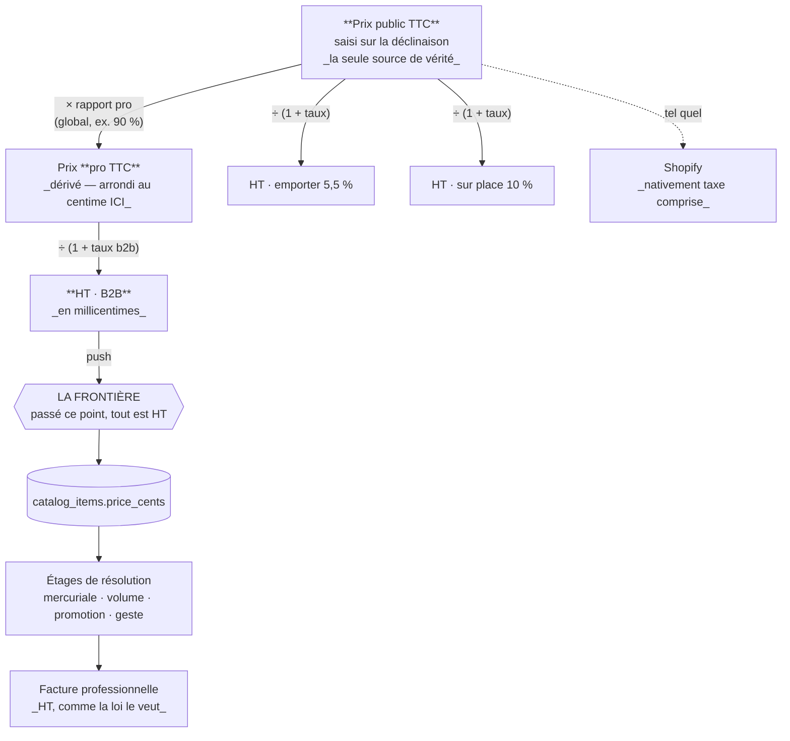

# Le prix ancré au TTC

**État : ✅ terminé** (2026-08-31). **Relu et découpé le 2026-09-06.**

> ## En trois phrases
>
> Un prix se **saisit une fois, en TTC public**, sur la déclinaison. Un
> **rapport global** (« le pro paie 10 % de moins ») en dérive le TTC
> professionnel. Chaque **taux de TVA** en dérive un hors taxe, un par contexte
> de vente — et c'est ce hors taxe, et lui seul, qui part vers le B2B.
>
> Le hors taxe n'est plus une saisie : c'est un **résultat**.

> ## Comment lire ce document
>
> | Partie                         | Pour qui                                     | Ce qu'elle contient                                                       |
> | ------------------------------ | -------------------------------------------- | ------------------------------------------------------------------------- |
> | **A · Comprendre**             | qui veut savoir comment un prix est fabriqué | le modèle **tel qu'il est aujourd'hui**, en un schéma. Rien d'historique. |
> | **B · Implémenter**            | qui va toucher au code                       | où ça vit, les invariants, et ce qui casse en exploitation                |
> | **C · L'histoire du chantier** | qui veut savoir **pourquoi**                 | les cinq tranches, les décisions renversées, ce qui a été retiré          |
>
> 🔴 **La partie C contient des affirmations qui ont été SUPERSÉDÉES en cours de
> route** — c'est la nature d'un journal. Elles sont conservées et marquées.
> **Ne jamais implémenter depuis la partie C** : A et B disent l'état.
>
> Voisins : [`../pim/contextes-et-points-de-vente.md`](../pim/contextes-et-points-de-vente.md)
> — où vit le taux, et pourquoi une carte naît d'une règle fiscale ;
> [`architecture-resolution-de-prix.md`](architecture-resolution-de-prix.md) — la
> chaîne d'étages, qui reste **HT de bout en bout** et que ce chantier ne touche
> pas ; [`README.md`](README.md) — la chaîne complète, du référentiel à la facture.

---

# A · Comprendre

## A.1 Le problème que ça règle

Toute la chaîne était ancrée **HT** : `product_variant.price_cents` portait un
prix canonique hors taxe, la TVA se résolvait par contexte, et le TTC se
calculait.

Ça décrit correctement une facture professionnelle. **Ça décrit mal une
vitrine.** Le même croissant est à 1,20 € sur l'étiquette qu'on l'emporte
(5,5 %) ou qu'on le mange en salle (10 %) : le prix affiché est le même, et
c'est le **hors taxe** qui diffère. Le prix de vitrine n'est pas une
conséquence, c'est la décision.

Le point rassurant était structurel : le référentiel portait déjà **un prix, et
N taux par contexte**. C'est exactement la forme qu'un ancrage TTC demande — il
n'y avait pas de table « prix par contexte » à créer, seulement le même modèle
lu à l'envers.

## A.2 Le modèle, en un schéma



**Trois choses à retenir, et rien d'autre.**

1. **Un seul prix est saisi.** Tout le reste est dérivé. Aucun couple de prix à
   tenir d'accord à la main.
2. **Le rapport est un RAPPORT, pas une remise.** On saisit « −10 % », on stocke
   `9 000` points de base, et c'est ce nombre qui multiplie. La traduction vit à
   un seul endroit.
3. **Le B2B ne voit jamais un prix TTC.** La conversion a lieu **une fois**, au
   push. Passé cette frontière — mercuriale, volume, promotion, planchers,
   historique, ventilation de TVA — tout est hors taxe, parce qu'une facture
   professionnelle est hors taxe.

## A.3 Pourquoi le TTC fait foi, et pas l'inverse

L'aller-retour `TTC → HT → TTC` peut perdre un centime. **Le sens de la perte
est choisi** : l'étiquette est ce qu'un client lit et ce que la caisse encaisse,
le hors taxe en est la conséquence. On ne recalcule donc **jamais** une
étiquette depuis sa propre déduction, et un test le documente plutôt que de
prétendre l'inverse.

C'est la même raison qui a fait retirer l'assiette configurable : un prix a un
sens, pas deux. Cf. **C.5**.

---

# B · Implémenter

## B.1 Où ça vit

| Quoi                           | Où                                                                                           |
| ------------------------------ | -------------------------------------------------------------------------------------------- |
| Le rapport pro                 | `pim.accounting_rules` — **singleton** (`id = "accounting"`), colonne `pro_price_ratio_bp`   |
| Le VO et ses bornes            | `ProPriceRatio`, plus la contrainte `accounting_rules_pro_ratio_bounds` en base              |
| La traduction remise ↔ rapport | `pro-discount.ts` — un seul endroit, et il refuse plutôt que de corriger en silence          |
| Le calcul partagé              | `proPriceFromPublic`, `htFromTtc`, `htMillicentsOf` dans `packages/pim-contracts/src/tax.ts` |
| La conversion vers le B2B      | `B2bCatalogFeedProjection` — le dernier endroit qui connaît encore un TTC                    |
| L'écran                        | `/pim/regles-comptables`, mur `tax:read` / `tax:write`                                       |

## B.2 Les invariants, et ce que leur violation coûte

**L'ordre des opérations n'est pas négociable :**

```
prix public TTC (stocké)
  × rapport             → prix pro TTC, ARRONDI AU CENTIME ICI
  ÷ (1 + taux du canal) → hors taxe en millicentimes, poussé
```

L'arrondi du prix pro **avant** la division n'est pas un détail : c'est un
**prix**, pas un intermédiaire de calcul. Garder le rationnel exact jusqu'au
bout ferait diverger d'un centime le hors taxe poussé et celui que la fiche
montre sous le prix pro — deux nombres qu'un client peut recompter. Sur 1,99 € à
−10 % et 5,5 % : **169 668** millicentimes par le prix pro arrondi, **169 763**
par le rationnel. Un test tient l'écart.

| Invariant                                                                       | Ce que sa violation coûte                                                                                                                                                |
| ------------------------------------------------------------------------------- | ------------------------------------------------------------------------------------------------------------------------------------------------------------------------ |
| Le taux passe par des **points de base entiers** avant toute division           | `5.5 * 100` vaut `550.0000000000001` en binaire, et `4.85 * 100` vaut `484.99999999999994`. Le référentiel a déjà payé ce piège dans `VatPercent`.                       |
| **Aucune ligne de réglage** ⇒ `read()` rend `null`, et l'écran dit « à régler » | Un défaut à 100 % affirmerait « le pro paie le prix public », que personne n'a décidé — le travers déjà retiré avec `DEFAULT_FOOD_VAT_RATE`.                             |
| Le rapport est une **précondition** du push, sans repli ni branche `null`       | Une branche jamais prise n'est jamais éprouvée, et facturerait le plein tarif le jour où elle le serait.                                                                 |
| Un article **sans taux** est ÉCARTÉ, jamais converti au jugé                    | Inventer un taux ferait facturer un montant que personne n'a décidé. Motif : `variant_sans_taux`.                                                                        |
| Le refus porte sur le **push entier**, pas sur chaque article                   | Un snapshot dont tous les articles seraient écartés est un snapshot VALIDE : la plateforme le lirait en retirant de sa boutique tout ce qu'elle vendait (`removedSkus`). |

## B.3 Les rangements refusés, et pourquoi

Trois endroits où le rapport pro n'est **pas** rangé. Les rouvrir est le
contresens le plus coûteux de ce modèle.

- **Pas en colonne sur `Category`** — c'est exactement ce que la famille vient
  de perdre avec `emporter_tva_id` / `sur_place_tva_id` / `b2b_tva_id`.
- **Pas dans `PriceRule`** — la mécanique y est (`scopeType`, `mode: percent`,
  points de base, fenêtres datées), mais c'est le mauvais contexte borné.
  `PriceRule` **altère** un prix canonique reçu, côté B2B ; le rapport
  **fabrique** le prix canonique, côté PIM. L'y ranger rendrait le push
  incapable de tarifer le professionnel.
- **Pas sur `CategoryChannel`** — ça mélangerait « ce que cette famille vend »
  et « à quel prix ».

Un rapport par famille ou par client s'ajoutera **sous** ce réglage le jour où
le besoin existera. Il ne le remplacera pas.

## B.4 Ce qui casse en exploitation

⚠️ **Tant que « Règles comptables » est vide, le push B2B répond en erreur au
lieu de partir.** C'est voulu, et c'est la première chose à régler sur un
environnement neuf.

⚠️ **Le contrôle de parité tombe avec.** `CheckCatalogParityService` consomme la
même `preview()` pour construire sa référence : sans rapport réglé, l'écran de
parité échoue lui aussi, sur un message qui parle de règles comptables. C'est
cohérent — il ne peut pas comparer à une référence qu'il ne sait pas calculer —
mais le lien n'est pas évident depuis cet écran-là.

⚠️ **Shopify est supposé paramétré taxe comprise.** Sa projection envoie
`price_cents` tel quel, sans jamais voir de taux. Le prix stocké étant désormais
un prix public TTC, elle envoie la bonne chose **sans avoir changé une ligne** —
sous une hypothèse qui n'est **pas vérifiable depuis ce dépôt** : que la
boutique soit bien réglée « prices include tax ». À confirmer dans son
paramétrage avant le premier push réel.

## B.5 Couverture

Le garde du rapport est tenu par `feed-projection.service.spec.ts` (unitaire).
**Aucun e2e ne le traverse** — `catalog-parity.e2e-spec.ts` double `FeedPreview`,
donc la chaîne réelle n'est exercée nulle part au niveau e2e. C'est un trou
connu, écrit ici plutôt que découvert.

---

# C · L'histoire du chantier

> ⚠️ **Ce qui suit est un JOURNAL, pas une spécification.** Il est conservé
> parce que le raisonnement vaut — et parce que le chantier ne s'est pas terminé
> comme il avait commencé : il visait un SECOND ancrage à côté du premier, une
> décision de réunion en a fait le **seul**. `price_basis` a donc été livrée puis
> retirée le même jour.
>
> Les affirmations barrées ou marquées « faux » l'étaient déjà à l'écriture des
> tranches suivantes. **L'état est en A et B.**

## C.1 Les cinq tranches

| #     | Tranche           | Contenu                                                                                                                                              | État |
| ----- | ----------------- | ---------------------------------------------------------------------------------------------------------------------------------------------------- | ---- |
| **1** | Le rapport, socle | `pim.accounting_rules` (singleton), VO `ProPriceRatio`, agrégat, dépôt, `GET` / `PUT`, journal, tests. **Aucune lecture de prix ne change.**         | ✅   |
| **2** | Le rapport, écran | La case dans « Règles comptables ». On saisit, on voit ; ça ne décide encore rien.                                                                   | ⬜   |
| **3** | L'ancrage         | `price_basis: ht \| ttc` (défaut `ht`), conversion TTC↔HT dans le contrat, conversion au push B2B. Parité : rien à faire, elle rejoue la projection. | ✅   |
| **4** | Le raccordement   | Le prix pro se dérive, fiche qui affiche public TTC · HT par contexte · pro.                                                                         | ✅   |
| **5** | L'assiette unique | Décision de réunion : le hors taxe ne se saisit plus. `price_basis` retirée, `ttcFromHt` / `htPriceOf` supprimées. Voir C.6.                         | ✅   |

Les tranches 1 à 3 n'ont changé aucun prix facturé : le défaut `ht` conservait
le comportement d'alors tant que personne ne basculait un article. La tranche 5,
elle, en change le SENS — voir C.6.

## C.2 Ce que la tranche 1 a posé

- `pim.accounting_rules` — singleton (`id = "accounting"`), une colonne
  `pro_price_ratio_bp`. **L'absence de ligne est la donnée** : rien réglé ⇒
  `read()` rend `null`, et l'écran doit dire « à régler ». Un défaut à 100 %
  affirmerait « le pro paie le prix public », que personne n'a décidé — c'est le
  travers déjà retiré avec `DEFAULT_FOOD_VAT_RATE`.
- Le rapport en **points de base entiers** (9 000 = 90 %). Pas de flottant sur de
  l'argent ; c'est déjà l'unité de `PriceRule.value`. Et c'est le **rapport**,
  pas la remise : c'est ce qui multiplie.
- Deux murs plutôt qu'un : le VO `ProPriceRatio` **et** la contrainte
  `accounting_rules_pro_ratio_bounds` en base. Un rapport hors bornes
  surfacturerait tout le catalogue d'un coup, et ce genre d'écriture arrive par
  un script de reprise, jamais par l'écran.
- `applyTo()` **multiplie d'abord, divise ensuite, arrondit une seule fois** —
  la règle déjà tenue par la chaîne de résolution de prix.
- Le journal part **dès maintenant** (`accounting_rules.pro_ratio_changed`),
  alors que rien ne lit encore le rapport : une lacune de trace ne se rattrape
  pas, et le jour du raccordement on voudra savoir depuis quand le rapport vaut
  ce qu'il vaut. Reposer la même valeur ne trace rien.

## C.3 Ce que la tranche 2 a posé

- **Un écran à part**, `/pim/regles-comptables`, et pas un bloc de plus sur
  « Taux de TVA » : un taux est imposé de l'extérieur, une remise est décidée
  par la maison. Les ranger ensemble parce qu'ils tiennent dans la même phrase
  (« ce qu'on facture ») mélangerait la loi et la politique commerciale. Même
  mur (`tax:read` / `tax:write`) — la décision est comptable.
- **On saisit une remise, on stocke un rapport.** « Le pro paie 10 % de moins »
  est le mot qu'on emploie ; `9 000` est ce qui multiplie un prix. La traduction
  vit en un seul endroit (`pro-discount.ts`), et refuse plutôt que de corriger
  en silence — 100 % de remise donnerait un prix nul, que la base rejette.
- **Le calcul a déménagé dans le contrat.** L'écran montre ce que le réglage
  produit sur un article à 10,00 € TTC ; il appelle `proPriceFromPublic`, la
  même fonction que le VO du serveur. C'était le risque nommé au C.5 de la
  tranche 1 : il se refermait au moment précis où on allait l'ouvrir.
- **Trois blancs, trois phrases différentes.** « Jamais réglé » (à saisir),
  « réglage illisible » (à réessayer, et surtout : aucun formulaire, sinon on
  écraserait ce qu'on n'a pas su lire), « droit manquant » (nommé). Les
  confondre en un seul écran vide était le raccourci évident.
- **L'écran dit qu'il n'est pas branché.** Un bandeau annonce que la remise est
  enregistrée et tracée mais qu'aucun prix ne s'en sert encore. L'honnêteté
  coûte une phrase ; la découvrir soi-même coûte une facture.

## C.4 Ce que la tranche 3 a posé

- **`product_variant.price_basis`**, `ht` par défaut. Le défaut est le point :
  la colonne portait un prix hors taxe depuis toujours, et tout autre défaut
  changerait le SENS des lignes existantes sans les toucher — une reprise de
  données déguisée en migration, et la pire espèce, puisque rien ne la
  signalerait. Non-nullable : une déclinaison sans assiette n'existe pas, alors
  qu'une déclinaison sans PRIX, si.
- **`htFromTtc` / `ttcFromHt` / `htPriceOf` dans `@lfd/pim-contracts`**, à côté
  de `proPriceFromPublic`. Le taux repasse par les points de base entiers avant
  la division : `5.5 * 100` vaut `550.0000000000001` en binaire, et `4.85 * 100`
  vaut `484.99999999999994`. Le référentiel a déjà payé ce piège dans
  `VatPercent`.
- **Le TTC fait foi.** L'aller-retour `ttcFromHt(htFromTtc(x))` peut perdre un
  centime, et c'est le bon sens de la perte : l'étiquette est ce qu'un client
  lit et ce que la caisse encaisse ; le hors taxe en est la conséquence. On ne
  recalcule jamais une étiquette depuis sa propre déduction — un test le
  documente plutôt que de prétendre l'inverse.
- **La conversion vit dans la projection B2B**, dernier endroit qui connaît
  encore l'assiette. Passé ce point, tout est HT, y compris pour la parité.
- **Un motif d'exclusion de plus** : `variant_ttc_sans_taux`. Distinct de
  « pas de tarif » — ici le prix EXISTE, c'est le taux qui manque, et c'est un
  autre écran qu'il faut ouvrir. Écarté plutôt que converti au jugé : inventer
  un taux ferait facturer un montant que personne n'a décidé.
- **`htPriceOf` teste `ttc`, pas `ht`.** Une valeur inattendue — fixture
  incomplète, ligne écrite par un script — retombe alors sur le hors taxe, ce
  que la colonne a toujours voulu dire. La forme inverse faisait CONVERTIR tout
  ce qui n'était pas exactement `"ht"`, donc baisser un prix sur une assiette
  absente ; un test l'a montré avant la production.

### Une dérive attrapée au passage

`B2bExclusionReason` (contrat) et `Exclusion.reason` (domaine) étaient deux
déclarations **indépendantes** du même ensemble, et elles avaient divergé : le
domaine produisait déjà `canal_ferme`, absent du contrat. Une fiche écartée
parce qu'on ne la vend pas aux professionnels s'affichait donc avec un motif
**vide** dans l'écran de publication, et le compilateur ne pouvait rien en dire
— deux synonymes ne se contredisent jamais, ils divergent.

Le domaine importe désormais l'union du contrat. C'est un **alias**, donc le
compilateur tient les deux bouts : un motif ajouté ne compile pas tant qu'il
n'est pas traduit à l'écran.

## C.5 Ce qui restait à trancher, et ce qui a été tranché

- ~~**La conversion TTC → HT divisera.**~~ Réglé en tranche 3 : la division
  passe par les points de base entiers et n'arrondit qu'une fois. Pas besoin de
  rationnel exact — un seul quotient, pas une chaîne.
- 🔴 **Shopify est nativement TTC** (« prices include tax »), et sa projection
  envoie `price_cents` **tel quel**, sans jamais voir de taux. C'est le
  **bloquant de la tranche 4**, et la raison pour laquelle la tranche 3 ne
  livre AUCUN moyen de poser `ttc` : tant que personne ne peut basculer un
  article, la question reste théorique et aucun prix ne part de travers. La
  trancher demande de savoir si la boutique encaisse taxe comprise — ce qui se
  lit dans son paramétrage, pas dans ce dépôt.
- ~~**Le calcul ne doit exister qu'une fois.**~~ Réglé en tranche 2 :
  `proPriceFromPublic` vit dans `@lfd/pim-contracts`, et le VO du serveur y
  délègue. La conversion TTC → HT de la tranche 3 devra y entrer aussi.

## C.6 L'assiette unique — la décision qui a clos le chantier

**Décision de réunion, 2026-08-31 : le calcul par le HT n'a pas d'utilité.** Un
seul système est valide — prix public TTC, rapport vers le TTC pro, taux vers le
hors taxe de chaque canal. Le hors taxe cesse d'être une saisie ; il devient un
résultat.

### Pourquoi ne pas garder l'assiette « au cas où »

C'était la vraie question, et la réponse n'est pas « YAGNI ».

**L'extensibilité qui compte est ailleurs, et elle est pilotée par la donnée.**
Le rapport est une LIGNE (`accounting_rules.ratio_bp`) ; les taux sont des
LIGNES par (contexte × produit|famille). Un second rapport, un rapport par
famille, un rapport par client, un canal de plus — tout ça s'absorbe en ajoutant
des lignes. **Aucun de ces cas de figure ne rouvre `price_basis`.**

`price_basis` n'était pas un axe extensible, c'était un interrupteur à deux
positions, et le garder inerte se payait à chaque lecture. Deux exemples, tous
deux livrés en tranche 3 :

- `htMillicentsOf` devait rendre `null` sur une branche qui n'aurait jamais été
  prise ;
- la projection B2B avait dû inventer une exclusion `variant_ttc_sans_taux`
  **uniquement** parce que les deux assiettes coexistaient.

Une branche jamais prise est une branche jamais testée pour de vrai. Et une
colonne à deux valeurs dont une n'est plus jamais écrite est pire qu'absente :
le jour où un import y remet `ht`, personne ne le voit, et on ne sait plus si
c'est un cas légitime ou une ligne oubliée.

### Ce qui a été retiré

| Retiré                               | Remplacé par                                                         |
| ------------------------------------ | -------------------------------------------------------------------- |
| `pim.price_basis` (enum + colonne)   | rien : `price_cents` EST un prix public TTC                          |
| `PRICE_BASES`, `priceBasisSchema`    | rien                                                                 |
| `ttcFromHt`, `htPriceOf`             | rien — le sens inverse n'existe plus                                 |
| price-basis.ts (supprimé)            | `packages/pim-contracts/src/tax.ts` : `htFromTtc` + `htMillicentsOf` |
| `variant_ttc_sans_taux`              | `variant_sans_taux` — il n'y a plus d'ancrage à préciser             |
| le sélecteur d'assiette sur la fiche | l'étiquette fixe « Prix public TTC »                                 |

**Aucune conversion de données.** Les 92 déclinaisons `ht` étaient du seed, rien
en production — la question a été posée avant d'écrire la migration, parce qu'une
conversion aurait demandé de choisir UN taux par déclinaison alors qu'un prix
public en a un par contexte de vente. C'est tout l'objet de ce modèle : il n'y
avait pas de réponse mécanique.

### Ce que ça règle chez Shopify, et sous quelle hypothèse

Le C.5 annonçait Shopify comme le bloquant : sa projection envoie `price_cents`
**tel quel**, sans jamais voir de taux. C'était vrai — et c'était déjà un défaut
AVANT ce chantier : elle poussait un montant hors taxe dans un champ que Shopify
lit comme taxe comprise (« prices include tax », le réglage français par défaut).

Le prix stocké étant désormais un prix public TTC, la projection envoie la bonne
chose **sans avoir changé une ligne**. ⚠️ Sous une hypothèse qui n'est pas
vérifiable depuis ce dépôt : que la boutique soit bien paramétrée taxe comprise.
À confirmer dans son paramétrage avant le premier push réel.

## C.7 Le raccordement du rapport au push

La tranche 4 n'avait été livrée qu'à moitié, et la moitié manquante ne se voyait
pas : **l'écran appliquait le rapport, le fil non.**

```
fiche Tarif  →  basePriceEurFor('b2b')  →  × rapport  →  9,00 € HT affiché
projection   →  htMillicentsOf(prix public, taux)     → 10,00 € HT poussé
```

Les deux nombres ne se lisent pas sur le même écran, donc personne ne pouvait
voir l'écart. Un rapport saisi, tracé, affiché — et jamais facturé.

### La chaîne, désormais complète

```
prix public TTC (stocké)
  × rapport            → prix pro TTC, ARRONDI AU CENTIME ici
  ÷ (1 + taux du canal) → hors taxe en millicentimes, poussé
```

L'arrondi du prix pro **avant** la division n'est pas un détail : c'est un prix,
pas un intermédiaire de calcul. Garder le rationnel exact jusqu'au bout ferait
diverger d'un centime le hors taxe poussé et celui que la fiche montre sous le
prix pro — deux nombres qu'un client peut recompter. Sur 1,99 € à −10 % et
5,5 % : 169 668 millicentimes par le prix pro arrondi, 169 763 par le rationnel.
Un test tient l'écart.

### Le rapport est une PRÉCONDITION du push

`projectCatalog` le reçoit **obligatoire**, sans valeur de repli et sans branche
`null`. Un défaut à 10 000 affirmerait « le pro paie le prix public », que
personne n'a décidé ; une branche `null` ne serait jamais prise sur une maison
correctement réglée, donc jamais éprouvée, et facturerait le plein tarif le jour
où elle le serait.

Le refus vit dans `B2bCatalogFeedProjection`, et il porte sur le **push entier**
plutôt que sur chaque article. C'est la seule forme sûre : un snapshot dont tous
les articles seraient écartés est un snapshot VALIDE, que la plateforme
ingérerait en retirant de sa boutique tout ce qu'elle vendait (`removedSkus`).
Un catalogue vidé par un réglage manquant est exactement ce que ce refus empêche.

Un canal où **rien n'est publié** passe avant le garde : il n'a aucun prix à
montrer, et lui réclamer un réglage comptable refuserait un aperçu qui ne tarife
rien.

⚠️ **Conséquence d'exploitation** : tant que « Règles comptables » est vide, le
push B2B répond en erreur au lieu de partir. C'est voulu, et c'est la première
chose à régler sur un environnement neuf.

⚠️ **Et le contrôle de parité avec.** `CheckCatalogParityService` consomme la
même `preview()` pour construire sa référence : sans rapport réglé, l'écran de
parité tombe lui aussi, sur un message qui parle de règles comptables. C'est
cohérent — il ne peut pas comparer à une référence qu'il ne sait pas calculer —
mais le lien n'est pas évident depuis cet écran-là.

**Couverture** : le garde est tenu par `feed-projection.service.spec.ts`
(unitaire). Aucun e2e ne le traverse — `catalog-parity.e2e-spec.ts` double
`FeedPreview`, donc la chaîne réelle n'est exercée nulle part au niveau e2e.
