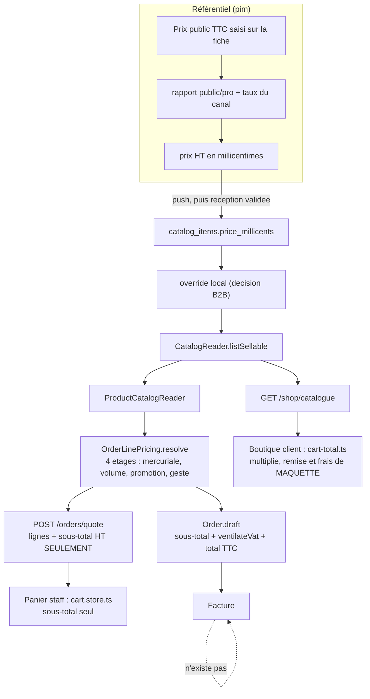

# Le calcul du panier et du prix — audit de l'existant

**Ouvert le 2026-09-05. Relu et découpé le 2026-09-06.**

> ## Où en est-on
>
> Dix défauts trouvés, **sept refermés**. Treize lots proposés, **neuf livrés**.
> Il reste **trois défauts** — tous 🟡, aucun ne fausse une facture — et
> **quatre lots**, dont un qui demande une mesure en production.
>
> 🔴 **Ce document n'est plus une photo, c'est un registre.** Il a été écrit
> comme un audit et il est devenu le journal d'une semaine de corrections. Sa
> partie utile aujourd'hui est la **A**, qui tient sur un écran : ce qui reste
> ouvert, et les trois requêtes de production qui ne peuvent pas être lancées
> d'ici.

> ## Comment lire ce document
>
> | Partie                          | Pour qui                            | Ce qu'elle contient                                                                      |
> | ------------------------------- | ----------------------------------- | ---------------------------------------------------------------------------------------- |
> | **A · Ce qui reste ouvert**     | qui cherche quoi faire ensuite      | trois défauts, quatre lots, trois requêtes de production. **Commencer ici.**             |
> | **B · Ce que l'audit a établi** | qui veut comprendre le terrain      | la carte de l'argent, la règle d'unité, le verdict sur le moteur, et un benchmark mesuré |
> | **C · Ce qui a été refermé**    | qui veut savoir ce qui a été appris | les sept défauts fermés et les neuf lots livrés, chacun avec ce qu'il a démenti          |
>
> ⚠️ **La partie C contient des constats qui étaient vrais le jour où ils ont
> été écrits, et faux le lendemain.** C'est la nature d'un registre tenu pendant
> qu'on corrige. Chaque section porte sa date. **L'état est en A.**

**Ce qu'il couvre.** Tout ce qui transforme un catalogue en un montant : le
moteur d'étages et le jugement porté sur son motif (partie B), la ventilation de
TVA, les deux paniers, le devis, l'agrégat `Order`, et les documents de prix du
dossier.

**Ce qu'il ne couvre pas.** La facturation (aucune facture n'est émise), le
paiement, et le référentiel en amont du miroir.

> Voir [`README.md`](README.md) pour la chaîne complète et le vocabulaire.

---

# A · Ce qui reste ouvert

## A.0 Le tableau, en un écran

**Aucun défaut ouvert.** Les dix sont refermés — les trois derniers le
2026-09-06. **Treize lots proposés, treize livrés.** Ce qui reste tient en
**trois requêtes de production** que personne n'a lancées, et en **une garde** :
le cache de `P12` suppose une seule instance de l'API — ce qui est le cas
aujourd'hui par décision de routage, et qui cesserait de l'être au premier
passage à deux.

Les trois lignes ci-dessous sont conservées le temps que les requêtes du **A.1**
soient passées : elles disent ce que le déploiement des correctifs va produire.

| Défaut        | Ce que c'est                                                                                                                     | Le lot  |
| ------------- | -------------------------------------------------------------------------------------------------------------------------------- | ------- |
| ~~**D7**~~ ✅ | **Refermé le 2026-09-06, par suppression.** L'espace pro hérité n'était plus routé depuis le 2026-08-27 ; 4 958 lignes en moins. | ✅ `P8` |
| ~~**D8**~~ ✅ | **Refermé le 2026-09-06.** Le repli de TVA par famille est retiré des DEUX lecteurs — celui qui facture, et celui qui affiche.   | ✅ `P6` |
| ~~**D9**~~ ✅ | **Refermé le 2026-09-06.** La mesure du seuil est nommée à côté du seuil, dans les deux écrans qui en saisissent un.             | ✅ `P9` |

**Aucun lot ne reste** — les quatre derniers sont tombés le même jour.

| Lot        | Ce qu'il fait                                                                                                                                                                                                                  | Ce qui le bloque |
| ---------- | ------------------------------------------------------------------------------------------------------------------------------------------------------------------------------------------------------------------------------ | ---------------- |
| ✅ **P6**  | **Livré le 2026-09-06.** Retiré des deux lecteurs, et le semis e2e pose enfin le taux sur l'article. La mesure de production reste utile — non plus pour décider, mais pour savoir **combien d'articles quittent la vitrine**. | —                |
| ✅ **P8**  | **Livré le 2026-09-06 — en supprimant, pas en convertissant.** Le panier, la boutique et le catalogue hérités, plus le tunnel de commande.                                                                                     | —                |
| ✅ **P9**  | **Livré le 2026-09-06.** Le barème et la grille de gabarit disent sur quoi leurs paliers se comptent — et disent le repli, qui est la moitié qui surprend.                                                                     | —                |
| ✅ **P12** | **Livré le 2026-09-06.** Les trois tables sont gardées en mémoire, vidées par `PricingActWriter` après le commit. Un devis de boutique passe de **3 lectures à 0**.                                                            | —                |

## A.1 🔴 Les trois requêtes qui ne peuvent pas être lancées d'ici

Elles sont **en lecture seule** et ne détruisent rien. Le `.env` local pointe
`localhost` ; aucune ne peut être exécutée depuis ce dépôt.

**1. `D10` — l'hypothèse sous laquelle `P11` a été livré.** Un prix de mercuriale
était enregistré au millième de ce qui est tapé, depuis un renommage du
2026-08-31. Le correctif suppose que la production ne porte **aucun gabarit posé
depuis cette date**. Tant que ce compte n'est pas fait, l'hypothèse est écrite,
pas vérifiée.

```bash
psql "$DATABASE_LFD_URL_PROD" -c "SELECT count(*) FILTER (WHERE (tier ->> 'unitPriceMillicents')::int < 1000) AS sous_le_centime, count(*) AS paliers_au_total FROM price_templates t, LATERAL jsonb_array_elements(t.lines::jsonb) AS line, LATERAL jsonb_array_elements(line -> 'tiers') AS tier;"
```

**2. `D8` — combien d'articles quittent la vitrine.** ⚠️ **Le repli est retiré
depuis le 2026-09-06** : cette requête ne décide plus s'il faut le faire, elle
dit **ce que le déploiement va coûter**. Zéro ⇒ rien ne change pour personne.
Autre chose ⇒ ces articles sortent de la boutique, et ce sont ceux qu'on ne
savait de toute façon pas facturer. Remplacer `count(*)` par `i.sku, i.name`
pour les nommer.

```bash
psql "$DATABASE_LFD_URL_PROD" -c "SELECT count(*) FROM catalog_items i JOIN catalog_categories c ON c.id = i.category_id WHERE i.vat_rate_percent IS NULL AND c.vat_rate_percent IS NOT NULL;"
```

**3. `P4` — les commandes dont la remise dépasse le panier.** La borne est posée
depuis le 2026-09-06 ; les lignes déjà écrites ne sont pas touchées.

```bash
psql "$DATABASE_LFD_URL_PROD" -c "SELECT count(*) FROM orders WHERE discount_cents > subtotal_cents;"
```

## A.2 Les trois défauts refermés le 2026-09-06

### D7 ✅ Le panier hérité comptait en euros flottants — refermé le 2026-09-06

> **Refermé par SUPPRESSION, pas par conversion**, et c'est la bonne réponse
> pour une raison que cette section avait ratée : `FEATURE_PRO_SPACE = false`
> depuis le 2026-08-27. Ce panier ne tournait pas — il compilait.
>
> Convertir aurait coûté huit fichiers, 93 rangées de semis et une décision sur
> un modèle partagé (`FoldProduct.priceValue`), sur du code qu'aucune adresse
> n'atteignait. Le supprimer a coûté **4 958 lignes en moins**.
>
> Sont partis avec : le panier, la boutique et le catalogue hérités, le tunnel
> de commande, `priceEurOf` et `vatRateOf` — ce dernier inventait 5,5 % pour
> tout SKU depuis une table de surcharges vide, le même repli que `D8` refusait
> le même jour, sans même une famille derrière.
>
> ⚠️ **Une fonctionnalité disparaît du produit** : « Mes paniers », le panier
> enregistré et réutilisable. Aucun équivalent dans l'app cliente.

### D7 — l'état d'origine, pour mémoire

legacy/data/cart.service.ts : `lineTotalEur`, `subtotalHtEur`, `vatTotalEur`,
`totalTtcEur` — des sommes de flottants. La TVA, elle, a été rendue à
`@lfd/money` le 2026-09-05 ; le sous-total et le total ne l'ont pas été.

Contredit frontalement `CLAUDE.md` : « **Argent en centimes**, entiers. Jamais de
flottant. » Dans `legacy/`, donc à faible portée — mais c'est du code qui tourne,
pas un dossier mort.

> ⚠️ **La dernière phrase était fausse à l'écriture** (2026-09-05) : le drapeau
> était coupé depuis neuf jours. C'est la faute que `P5` a nommée — décrire
> l'existant de mémoire.

### D8 ✅ Le repli de TVA par famille — refermé le 2026-09-06

> **Corrigé par `P6`, et il était plus profond que cette section ne le disait.**
> Le repli vivait dans **deux** lecteurs — celui qui facture (`billableRate`) et
> celui qui affiche. Les retirer séparément aurait rouvert la divergence que le
> second commentait déjà : un écran qui montre un taux que la caisse ignore, ou
> l'inverse.
>
> 🔴 **Et il était PORTEUR dans le harnais de test.** Le semis e2e posait le taux
> sur la famille et jamais sur l'article : **140 tests passaient grâce au
> repli**, et aucun n'éprouvait la règle que le schéma affirme. Un repli porteur
> dans une fixture est le pire endroit où en trouver un — il rend vertes
> précisément les suites qui auraient dû le contredire.
>
> Ce que le retrait rend au passage : le compteur « des articles ne sont pas
> vendables » de l'écran catalogue cesse d'être aveugle. Il restait à zéro
> pendant que la boutique facturait un taux emprunté.

### D8 — l'état d'origine, pour mémoire

`prisma-catalog.reader.ts:142`, `billableRate` — et son propre commentaire
dit quoi en faire :

> ⚠️ Ce repli est à retirer une fois que tous les articles ont reçu leur taux (un
> push suffit). Le garder indéfiniment ferait resurgir le défaut qu'on corrige :
> une ligne facturée qui dépend d'une jointure de famille.

Le push existe désormais et le seed le rejoue (2026-09-05). Tant que le repli
vit, un article sans taux propre est **facturé** au taux de sa famille — ce que
`plan-decompte-du-panier-ht.md` a précisément retiré du front, au motif que
« chaque ligne du catalogue doit avoir son taux ».

La sortie est une mesure, pas un geste : compter en production les
`catalog_items` à `vat_rate_percent IS NULL` dont la famille en a un. Zéro ⇒ le
repli tombe. Autre chose ⇒ le repli tient, et on sait enfin ce qu'il tient.

### D9 ✅ `minQuantity` voulait dire deux choses — refermé le 2026-09-06

> **Corrigé par `P9`, et le remède retenu n'est pas celui que cette section
> proposait en premier.** Renommer les deux mesures (`minOrderQuantity` /
> `minCommittedQuantity`) aurait été honnête et n'aurait rien réglé : c'est le
> **même champ** à l'écran, et un nom ne change que dans le code.
>
> Ce qui est livré : **la mesure est dite à côté du seuil**, sur les deux écrans
> qui en saisissent un — le barème de volume et la grille de gabarit.
>
> 🔴 **Et une ouverture du dossier a rétréci le défaut.** Depuis le passage du
> volume en barème, le panneau de règle pose `minQuantity: null` en dur : aucun
> écran ne saisit plus de seuil sur une **promotion** ou un **geste**. Les deux
> seuls points de saisie sont donc `mercuriale` et `volume` — tous deux des
> étages de contrat. Ce qu'un commercial tape veut donc toujours dire la même
> chose, et la vraie surprise n'était pas l'ambiguïté entre étages : c'est le
> repli `?? quantity` de `volumeQuantityOf`. **Sans engagement, une grille
> annuelle se lit sur la commande** — « 10 000+ » ne s'ouvre qu'à qui commande
> 10 000 pièces d'un coup. C'est cette phrase-là que les deux écrans portent.
>
> ⚠️ La phrase du barème est tenue par un test ; celle de la grille de gabarit
> ne l'est pas — cette page n'a aucun spec, et en monter un pour un paragraphe
> statique aurait coûté plus que ce qu'il garde.

### D9 — l'état d'origine, pour mémoire

`specificity.ts`, `CONTRACT_STAGES` : `mercuriale` et `volume` lisent le seuil
sur `volumeQuantityOf(context)` — le cumul de l'engagement s'il y en a un —
tandis que `promotion` et `geste` le lisent sur `context.quantity`, la commande
en cours.

Le raisonnement est juste, et il est écrit : « à partir de 50 pièces » sur une
promotion est une incitation au panier, et la lire sur la saison l'accorderait
dès la première livraison d'un client annuel.

Ce qui n'est écrit nulle part, c'est la conséquence à la saisie : **la même
colonne, le même champ de formulaire, deux sémantiques**, et rien dans le nom ne
dit laquelle. Qui tape « 50 » sur l'écran de tarification obtient « 50 dans
cette commande » ou « 50 sur la saison » selon une liste déroulante placée
ailleurs dans le même formulaire. Le prix qui en sortira sera juste, et
inexplicable.

Ce n'est pas un défaut de motif, c'est un défaut de **nom**. Deux concepts
nommés, ou l'écran qui affiche la mesure à côté du seuil.

## A.3 Les trous — ce qui n'existe pas encore

| Trou                                                  | Conséquence aujourd'hui                                                                                                                                                                      | Doc                                           |
| ----------------------------------------------------- | -------------------------------------------------------------------------------------------------------------------------------------------------------------------------------------------- | --------------------------------------------- |
| **Aucune facture n'est émise**                        | la chaîne s'arrête au total de la commande ; le mandat SEPA n'est jamais débité                                                                                                              | `architecture-facturation.md` 📐              |
| **La mercuriale par client (S5)**                     | un compte négocié paie le tarif public sur la boutique                                                                                                                                       | `architecture-resolution-de-prix.md` 🟡       |
| **La surtaxe de retard au panier (B5)**               | facturée par `Order.draft`, jamais annoncée au client                                                                                                                                        | `plan-decompte-du-panier-ht.md` §7.2          |
| **La boutique ne passe aucune commande**              | numéro fabriqué dans le navigateur                                                                                                                                                           | `client/shop/mock-order.ts`                   |
| **Les paliers de volume à la boutique**               | reportés — et `D2` est ce que le report a laissé                                                                                                                                             | `architecture-prix-boutique.md` §6            |
| **Prix vivant / prix bloqué**                         | non tranché, zéro code                                                                                                                                                                       | `architecture-prix-vivant-prix-bloque.md` 🔵  |
| **Conditionnements**                                  | le toggle unité/pack reste provisoire                                                                                                                                                        | `architecture-conditionnements-pricing.md` 📐 |
| ~~**Aucune porte CI sur les unités d'argent**~~       | **Comblé le 2026-09-06** — `lint:money-units`, 24ᵉ porte.                                                                                                                                    | ✅                                            |
| ~~**Les règles de prix ne sont pas mises en cache**~~ | ✅ **Comblé le 2026-09-06** — les tables entières en mémoire, vidées à l'écriture. ⚠️ Suppose **une seule instance** de l'API.                                                               | ✅ `P12`                                      |
| ~~**Le panier n'existe pas côté serveur**~~           | **Comblé le 2026-09-06** — `shop_carts`, un panier par personne, `GET`/`PUT /shop/cart`. Reste local pour qui n'est **pas** reconnu : c'est une décision, la boutique se visite sans compte. | ✅ `P13`                                      |

Le dernier mérite d'être dit en propre, parce qu'il a été comblé **et** parce
que ce qu'il a rapporté dépasse ce que cette ligne annonçait.

Le dépôt avait 23 portes, dont une qui lit les schémas Postgres dans le
`datasource` plutôt que de les recopier, et une qui interdit `new Date()` hors de
l'adaptateur d'horloge. Il n'en avait **aucune** sur l'unité de l'argent — le
seul endroit où se tromper coûte de l'argent.

`lint:money-units` est la 24ᵉ. Elle refuse qu'un nom en `*Cents` reçoive une
expression qui mentionne `Millicents` hors des conversions déclarées, **et
l'inverse**. Elle suit chaque liaison jusqu'à la fin de son expression,
parenthèses équilibrées : `D1` avait son nom et son `Millicents` fautif sur deux
lignes différentes, donc une porte ligne à ligne n'aurait pas attrapé le défaut
qui l'a fait écrire.

**Elle a trouvé quatorze sites que cet audit n'avait pas vus, dont `D10`** — et
`D10` est dans le sens que sa première version excluait, avec une raison écrite
qui s'est révélée fausse au premier passage. C'est l'argument le plus net pour
les portes de ce dépôt : elle a rapporté, dès son premier tour, plus que la
lecture attentive qui l'avait commandée.

C'est la hiérarchie déjà retenue ailleurs ici : rendre inexprimable plutôt que
vérifier. L'inexprimable serait un type nominal (`Millicents` et `Cents`
distincts au compilateur) ; la porte CI est le cran d'en dessous, et elle était
disponible tout de suite.

---

---

# B · Ce que l'audit a établi

> Ce qui suit ne périme pas au même rythme que le reste : une carte de l'endroit
> où l'argent se calcule, la règle d'unité, le verdict porté sur le moteur de
> résolution, et une mesure. Les quatre ont servi à décider, et serviront encore.

## B.1 La carte — où l'argent se calcule

Sept endroits, et **un seul** compose le décompte complet.



| #   | Où                                                  | Ce qu'il calcule                                                                                          | Autorité            |
| --- | --------------------------------------------------- | --------------------------------------------------------------------------------------------------------- | ------------------- |
| 1   | `pim/channels/b2b-platform/products/projection.ts`  | TTC public → TTC pro → **HT en millicentimes**                                                            | le référentiel      |
| 2   | `pricing/domain/resolve-price.ts`                   | les **quatre étages** (`mercuriale`, `volume`, `promotion`, `geste`), en composition, **un seul arrondi** | le serveur          |
| 3   | `packages/money/src/vat.ts` — `ventilateVat`        | la **ventilation par taux**, remise au prorata, un arrondi par groupe                                     | partagé, 3 lecteurs |
| 4   | `orders/domain/entities/order.ts` — `Order.draft`   | **le seul décompte complet** : sous-total, TVA, TTC                                                       | l'agrégat           |
| 5   | `orders/application/queries/quote-order.handler.ts` | lignes résolues + **sous-total HT, rien d'autre**                                                         | le serveur          |
| 6   | `client/cart/cart-total.ts` (boutique)              | sous-total, remise, coursier, TVA, TTC — **en local**                                                     | le navigateur       |
| 7   | `commandes/nouvelle-commande/cart.store.ts` (staff) | sous-total HT — **en local**                                                                              | le navigateur       |

**Le fait structurant : 4 est le seul complet, et il n'existe qu'APRÈS la
commande.** Aucune route ne rend un décompte HT → TVA → TTC avant la passation.
C'est pour ça que 6 et 7 recalculent, et c'est la racine de la moitié de ce qui
suit.

---

## B.2 L'unité, et les trois endroits qui la trahissent

La règle est écrite, et elle est bonne (`packages/money/src/millicents.ts`) :

- un **prix unitaire dérivé** est en **millicentimes** (10⁻⁵ €) ;
- un **montant** — total de ligne, sous-total, facture — est en **centimes
  entiers** ;
- la traversée se fait par `lineTotalCents(unitMillicents, quantity)`, qui
  arrondit **une fois**.

Le dépôt porte deux formateurs, et c'est là que ça se joue :

| Fonction                            | Diviseur   | Attend                |
| ----------------------------------- | ---------- | --------------------- |
| `formatCents` (`@lfd/b2b-ui/order`) | `/100`     | des **centimes**      |
| `formatMillicents` (idem)           | `/100_000` | des **millicentimes** |
| `formatEuros` (`@lfd/catalog-ui`)   | `/100_000` | des **millicentimes** |

**Trois sites écrivaient `unitPriceMillicents × quantity` et nommaient le
résultat `*Cents`.** Deux tombaient sur un formateur en millicentimes — la
valeur juste, le nom faux. Le troisième tombait sur `formatCents`, et c'est
`D1`.

C'était le mécanisme, pas la malchance : le même idiome fautif, écrit trois
fois, n'attendait qu'un site pour atterrir du mauvais côté.

> **Rouvert le 2026-09-06.** `lint:money-units` a montré que ces trois-là étaient
> la partie émergée : **dix-huit** identifiants `*Cents` portaient des
> millicentimes dans la famille `tarification`. Tous renommés (`P3`, cf. `D6`).
> Le désaccord d'unité qui reste est d'une autre nature — il ne porte plus sur
> des noms mais sur `price-field.ts`, le dernier fichier qui parle centimes
> quand tous ses appelants parlent millicentimes (`D10`).

---

## B.3 Le moteur de résolution — le motif est bon, la couture manque

Un audit qui ne relève que des défauts laisse croire que tout est à refaire.
Ce n'est pas le cas ici, et le dire est utile : le moteur d'étages est la
pièce la mieux conçue de toute la chaîne d'argent. Cette section dit **pourquoi
il ne faut pas y toucher**, et **le seul endroit où il faut**.

### Ce qui le rend fiable, et qui n'est pas courant

Ce n'est pas « des règles empilées » : c'est un **pipeline ordonné à arbitrage
par étage**, plus un scellement, plus une contrainte finale. Quatre propriétés
portent sa fiabilité :

1. **`resolvePrice` est pure** — `(canonique, matériaux, contexte, plancher) →
(prix, trace)`. Ni base, ni horloge, ni réseau : l'instant est **dans** le
   contexte. Elle s'éprouve en énumérant des cas, pas en montant un environnement.
2. **Un seul arrondi**, en fin de chaîne, le calcul restant rationnel.
   `PriceStep.resultMillicents` est explicitement marqué « pour l'affichage
   seulement » — reprendre cette valeur rétablirait l'arrondi par étage.
3. **La trace est produite par la passe qui calcule.** L'explication ne peut pas
   diverger du prix parce qu'il n'y a pas deux passes.
4. **`compareSpecificity` et `winnerOf` sont exportés et réutilisés par l'écran.**
   C'est le geste anti-divergence qui compte le plus : la frise des recouvrements
   désigne le gagnant avec l'arbitrage qui **facture**, au lieu d'en
   réimplémenter un second.

`ladderAsRule` est un **Adapter** exemplaire : le barème est présenté comme la
règle d'étage volume qu'il est à cette quantité, donc ni la résolution ni la
spécificité n'apprennent un cas de plus.

### Ce qu'il faut refuser si on le propose

| Proposition                                                   | Pourquoi c'est pire                                                                                                                                                                                                                    |
| ------------------------------------------------------------- | -------------------------------------------------------------------------------------------------------------------------------------------------------------------------------------------------------------------------------------- |
| Des **handlers injectés** à la place de `PRICE_STAGES`        | **L'ordre EST la sémantique.** Un tableau le rend lisible en un endroit ; des handlers l'éparpillent dans un module de composition. Et ce n'est pas un `switch` : ajouter un étage coûte une ligne de donnée, la boucle ne change pas. |
| Faire du **plancher un étage**                                | Il gagnerait une fenêtre de validité et une audience qu'il n'a **délibérément pas** — c'est le sujet du **B.4** d'`optimisation-resolution-de-prix.md`. Un plancher est une **post-condition**, pas une transformation.                |
| Un **moteur de règles** configurable (DSL, table de décision) | Perte du compilateur et d'une trace nommée dans le métier, contre une configurabilité que personne n'a demandée. Et une table de décision n'exprime pas la **composition** — chaque étage s'applique à la sortie du précédent.         |
| **Séparer** le calcul de la trace                             | C'est la propriété n°3. La casser est le moyen le plus sûr de faire mentir un écran.                                                                                                                                                   |
| **Formaliser un pattern Specification** sur `applies`         | Il l'est déjà en substance (`matchesScope`, `matchesAudience`, `isInForce`, composés). Le formaliser ajoute de la cérémonie sans rien fermer.                                                                                          |

### 🔴 La seule vraie faille : `resolvePrice` est pure, mais trop petite

Les décisions qui comptent ne sont pas dedans. Elles sont dans
`OrderLinePricing.resolveOne` — **quatre-vingt-dix lignes `async`** qui
tranchent : quel engagement couvre l'article, quelle mesure est retenue, quel
plancher le vise, quel étage du plancher s'ouvre, et comment le barème devient
une règle. Cette **recette** n'existe qu'à cet endroit, et elle ne se teste
qu'avec sept doubles.

Ce n'est pas une inquiétude théorique : `optimisation-resolution-de-prix.md`
compte **3 lectures par article** dans cette méthode, et
`plan-materiaux-de-prix.md` existe entièrement pour les hisser. Le design fait
déjà mal, et le dépôt le sait.

Ce qui manque n'est pas un motif exotique — c'est **une couture entre
« rassembler les matériaux » et « les appliquer »**, celle que `inForceFor`
esquisse déjà pour la fenêtre et l'audience.

**Et elle coûte moins cher qu'elle n'en a l'air.** L'objection évidente est que
les deux lectures de `resolveOne` sont **paresseuses** par conception — aucune
requête si le plancher n'a pas de porte, aucune si aucun engagement ne couvre
l'article — et qu'un hissage la perdrait. Vérifié : les deux gardes sont des
**prédicats purs sur des matériaux déjà chargés** —
`scoped.policy.dynamic?.unlock.minVolumeRatioBp == null` pour le ratio,
`commitmentFor(live, …)` pour l'engagement. La collecte se hisse donc **sans
perdre la paresse**, et sans protocole en deux phases.

```
priceLine(materials, evidence, context): ResolvedOrderLine   // pure
```

`resolveOne` se réduit alors à : construire le contexte → demander les preuves
que les prédicats purs réclament → appeler `priceLine`. La recette redevient
énumérable en test, sans doublé.

### ✅ Livré le 2026-09-06 — et une vérification a décidé du dessin

`priceLine(input, materials, evidence)` est pure. `OrderLinePricing` ne décide
plus rien : il charge les matériaux **une fois pour le panier**, mesure ce qu'il
faut mesurer **par lot**, et appelle la fonction pure une fois par ligne.

**Ce qui a rendu le dessin simple** : `resolveScopedFloor` ne filtre que par la
**portée** — ni quantité, ni temps, ni audience. Le plancher d'un article se
connaît donc avant tout ce qui dépend de l'historique, et les preuves peuvent
être rassemblées en amont sans protocole en deux phases. C'est une vérification
d'une ligne qui a économisé une machinerie.

La paresse est conservée : les mêmes prédicats purs décident s'il faut mesurer,
ils décident simplement avant, sur des matériaux déjà chargés. Un panier
ordinaire — aucun engagement, aucun plancher à porte de volume — ne coûte
toujours **aucune** lecture de mesure.

Le lot ne change **aucun prix**, et c'est vérifié plutôt qu'affirmé : les 3 237
tests existants passent sans qu'un seul ait été retouché. Les huit cas neufs de
`price-line.spec.ts` éprouvent la recette entière **sans un doublé** — ce qui
était tout l'objet.

### La mesure — 2026-09-06, sonde jetable sur Postgres local

Le compte des lectures **réellement émises** par `POST /shop/quote`, relevé en
instrumentant les délégués Prisma, avant et après le hissage :

| Références au panier | avant | après |
| -------------------- | ----- | ----- |
| 1                    | 4     | **4** |
| 5                    | 16    | **4** |
| 20                   | 61    | **4** |

`61 = 1 + 3 × 20`, exactement l'arithmétique annoncée. **Le résultat n'est pas le
facteur, c'est la platitude** : le coût d'un devis ne dépend plus de la taille du
panier.

Les quatre : catalogue, règles, planchers, barèmes. Un panier avec retrait en
fait 5, un client sous engagement 6, un plancher à porte de volume 8 — tous
plats en N.

⚠️ **Ce que cette mesure n'est pas.** Les temps relevés (51 / 13 / 9 ms) ne
disent rien : Postgres local, cache chaud, ordre d'exécution. Le coût qui compte
ici est un **nombre d'opérations facturées**, pas une durée — les lectures
partaient déjà en parallèle, et ce lot n'a jamais promis du temps mural.

### ✅ Le piège du plan en cours — désamorcé

Ce hissage est déjà écrit — mais dans `plan-materiaux-de-prix.md`, **comme un
lot de coût, pas de conception**. La différence n'est pas rhétorique : un plan
de performance s'arrête quand la facture cesse de faire mal, et laisse la
couture à moitié posée.

C'est déjà visible. Le lot 2 est livré, `pricing/domain/scope-index.ts` existe
avec ses six exports et son spec — et **son seul appelant est son propre spec**.
Une pièce de machinerie dont le seul consommateur est son test n'est pas une
optimisation livrée, c'est une couture ouverte.

Requalifier le lot 3 en lot de **conception** lui donne ce qui lui manque : un
consommateur, et une raison de finir.

> C'est ce qui a été fait. `scope-index.ts` est appelé par `pricing-materials.ts`,
> lui-même appelé par le seul chemin qui tarife. La pièce n'est plus une couture
> ouverte.

---

## B.4 Ce que la documentation promet et que le code ne fait pas

> **Relue le 2026-09-06 (`P5`).** Quatre des six lignes se sont refermées en
> trois jours, et deux tiennent toujours. Chacune a été rouverte dans le dépôt,
> pas rappelée de mémoire.

| Le doc dit                                      | Où en est le code                                                                                      | Où                                 |
| ----------------------------------------------- | ------------------------------------------------------------------------------------------------------ | ---------------------------------- |
| ~~« le front **ne multiplie jamais** »~~        | ✅ **tenu** — `cart-total.ts` ne porte plus que `{ produit, quantité }` ; le décompte vient du serveur | `architecture-prix-boutique.md` §6 |
| ~~« il demande `POST /orders/quote` »~~         | ✅ **tenu, par une autre route** — `POST /shop/quote`, publique. Celle du **B.5** est murée            | idem                               |
| ~~le canonique **barré** quand il diffère~~     | ⤳ **décision renversée** — la vitrine est publique, donc sans client : aucun écart à barrer            | idem, §4                           |
| ~~« la validation vit dans le domaine »~~       | ✅ **tenu** — remise et frais viennent de `CartAdjustments`, partagé avec la caisse                    | `CLAUDE.md` §3                     |
| ~~« argent en centimes, entiers »~~             | ✅ **tenu** — le panier hérité qui comptait en `…Eur` flottants est supprimé (`D7` → `P8`)             | `CLAUDE.md` §3                     |
| ~~le repli de TVA par famille est transitoire~~ | ✅ **retiré le 2026-09-06** — `billableRate` ne lit plus que le taux de l'article (`D8` → `P6`)        | `prisma-catalog.reader.ts`         |

⚠️ **Un renversement n'est pas une dette.** La troisième ligne n'est pas un
retard à combler : c'est une décision qui en a annulé une autre. La traiter
comme un écart ferait ajouter un prix barré à une vitrine qui n'a aucun client
à qui le comparer.

Aucun de ces écarts n'est un mensonge d'auteur : chacun est une phrase écrite
**avant** que la tranche suivante ne parte dans une autre direction. C'est le
mode de panne habituel du dépôt, et le seul remède connu est celui-ci — les
rouvrir périodiquement et les dater.

---

## B.5 L'état réel des documents de prix

| Doc                                        | État affiché | Ce que ce relevé constate                                                                                                                                                                              |
| ------------------------------------------ | ------------ | ------------------------------------------------------------------------------------------------------------------------------------------------------------------------------------------------------ |
| `plan-decompte-du-panier-ht.md`            | 🟢 sauf B5   | **exact.** Les trois copies délèguent bien à `@lfd/money`.                                                                                                                                             |
| `architecture-resolution-de-prix.md`       | 🟡           | **exact.** S1→S4 livrés, S5 (mercuriale) absente.                                                                                                                                                      |
| `architecture-prix-boutique.md`            | 🟡           | ✅ **daté le 2026-09-06 (`P5`)** — et ce verdict était à moitié faux : la règle centrale (§6) est **tenue** depuis `P7b`. Ce qui est renversé, c'est son §2 (route murée) et son §4 (canonique barré). |
| `plan-boutique-sur-api.md`                 | 🟢           | exact (daté le 2026-09-05).                                                                                                                                                                            |
| `optimisation-resolution-de-prix.md`       | 📐           | exact — un constat de coût, rien à implémenter.                                                                                                                                                        |
| `plan-materiaux-de-prix.md`                | ✅           | ✅ **corrigé le 2026-09-06 (`P5`)** — et il était plus avancé encore : le lot 3 est tombé avec `P10`, donc **les cinq lots sont livrés**, pas quatre.                                                  |
| `decision-qui-pose-une-promotion.md`       | 📐           | exact — une décision, pas un chantier.                                                                                                                                                                 |
| `architecture-prix-vivant-prix-bloque.md`  | 🔵           | exact — zéro code, assumé.                                                                                                                                                                             |
| `architecture-conditionnements-pricing.md` | 📐           | exact.                                                                                                                                                                                                 |
| `architecture-facturation.md`              | 📐           | exact — et c'est le plus gros trou du **A.3**.                                                                                                                                                         |
| `architecture-prix-ancre-ttc.md`           | ✅           | exact — l'assiette unique est livrée.                                                                                                                                                                  |

~~**Deux lignes d'index à corriger**~~ — **faites le 2026-09-06 (`P5`)** :
`architecture-prix-boutique.md` passe 📐 → **🟡** avec un bandeau en tête, et
`plan-materiaux-de-prix.md` 📐 → **✅** — et non 🟡, parce que le lot 3 est tombé
avec `P10` entre l'écriture de ce relevé et sa correction.

🔴 **Le danger annoncé s'était inversé entre-temps.** Ce paragraphe disait :
« quelqu'un qui l'ouvre aujourd'hui pour brancher les paliers croira que le
front ne multiplie pas ». C'était vrai le 2026-09-05 ; `P7b` l'a refermé le
lendemain. Le gel réel est ailleurs, et c'est ce que le bandeau dit : quelqu'un
qui ouvre ce document pour servir un prix négocié à la boutique y trouve une
route **murée** et un **canonique barré** — deux décisions qu'une vitrine
publique a annulées.

C'est la leçon du lot, et elle vaut plus que les deux lignes corrigées : **un
relevé de péremption périme aussi**. Celui-ci avait un jour et se trompait déjà
de danger.

---

---

# C · Ce qui a été refermé

> ⚠️ **Registre, pas spécification.** Chaque section porte la date de son
> constat, et plusieurs ont été démenties par la correction qui a suivi — un
> défaut trois fois plus large qu'annoncé, un danger qui s'était inversé en un
> jour, une phrase d'audit incomplète découverte en l'ouvrant. C'est ce qui rend
> ce registre utile, et ce qui interdit d'en tirer l'état du dépôt.
>
> **L'état est en A.**

## C.1 Les défauts refermés

### D1 🔴 Le sous-total du panier staff est mille fois trop grand

```
apps/lfc-B2B-admin-frontend/src/app/commandes/nouvelle-commande/cart.store.ts:99
  readonly subtotalCents = computed(() =>
    this.pricedLines().reduce((total, line) => total + line.unitPriceMillicents * line.quantity, 0),
  );
```

Affiché **deux fois**, par `formatCents` (donc `/100`) :
`barre-panier/barre-panier.ts:37` et `panier-commande/panier-commande.ts:169`.

**La chaîne est en millicentimes de bout en bout**, vérifiée fichier par
fichier : `catalog_items.price_millicents` (`schema.prisma:2143`) →
`ResolvedCatalogItem.unitPriceMillicents` (`prisma-catalog.reader.ts:165`) →
`CatalogItemView.unitPriceMillicents` (`list-catalog.handler.ts:23`) →
`CartLine.unitPriceMillicents`. Dix croissants à 2,00 € HT s'affichent donc
**20 000,00 €** au lieu de 20,00 €.

**Pourquoi personne ne l'a vu en test.** La fixture met une valeur en centimes
dans un champ de millicentimes :

```
__tests__/cart.store.spec.ts:5
  const CROISSANT = { sku: 'VIE-001', name: 'Croissant', unitPriceMillicents: 200 };
  …
  expect(cart.subtotalCents()).toBe(2_720);
```

Le test est vert **et** faux, ensemble. C'est exactement ce que la consigne du
dépôt dit d'un `as unknown as` dans un test : ce qui laisse un doublé dériver du
port qu'il prétend jouer sans que rien ne rougisse. Ici il n'y a même pas de
cast — juste un nombre dans le mauvais système.

**Ce que ça ne casse pas, et c'est important.** Rien n'est facturé faux : le
payload ne porte **aucun prix** (`toPayloadLines`, et un test le verrouille), et
`OrderDrafting` re-résout tout côté serveur. C'est un **nombre lu à voix haute**,
pas un montant encaissé.

**Second défaut sur la même ligne**, plus discret : la somme ne passe pas par
`lineTotalCents`. Même l'unité corrigée, `round(Σ)` n'est pas `Σ round()`, et la
règle du dépôt est un arrondi **par ligne**.

### D2 ✅ Le panier de la boutique multipliait — ce que son propre document interdisait

`architecture-prix-boutique.md` §6, mot pour mot :

> **la règle de ce lot, et c'est la seule qui compte :** le front **ne multiplie
> jamais**. Il demande `POST /orders/quote`, qui résout chaque ligne à sa
> quantité réelle.

`cart-total.ts` multiplie (`lineHtCents` → `lineTotalCents(unitaire, quantité)`),
et **aucun fichier de `client/` n'appelle `/orders/quote`** — la route existe
pourtant, murée, dans `orders.controller.ts:87`.

Le prix montré vient de `GET /shop/catalogue`, qui rend le prix **du catalogue**
(référentiel, ou décision locale s'il y en a une) : `read-shop-catalogue.ts`
n'appelle pas `resolvePrice`. Donc, aujourd'hui, **aucun étage n'atteint la
boutique** — ni mercuriale, ni promotion, ni palier.

Ce n'était pas encore faux : sans palier posé, `unitaire × quantité` est exact.
Ça devenait faux **le jour même** où un barème existe, et faux **en silence**,
parce que la multiplication continue de rendre un nombre plausible. Le document
l'avait prévu ; l'implémentation avait fait l'inverse.

> ✅ **Refermé le 2026-09-06 (`P7b`).** Le panier appelle `POST /shop/quote` et
> n'écrit plus une seule ligne d'arithmétique d'argent : `cart-total.ts` ne
> contient plus que le type d'une ligne. Le total de CHAQUE ligne vient du
> serveur, arrondi une fois — et vaut « — » tant qu'il n'est pas revenu, ce qui
> est la contrepartie honnête de ne plus calculer : on ne sait pas encore.

### D3 ✅ La remise et les frais de la boutique étaient une maquette

La maquette de station du front (client/mock-station.ts, **supprimée le
2026-09-06**) : remise de retrait **10 %** en dur, frais de zone **20 €** et
**50 €** en dur. `ClientCart.totals` les lit par `ServiceChoice`, qui
les porte depuis les dialogues de choix.

Côté serveur, les deux sont de la **donnée** : `pickup_addresses.discount` et
`delivery_zones.fee`, tous deux des `CartAdjustment` — c'est-à-dire
`{ mode: 'bp' }` **ou** `{ mode: 'amount' }` (`contracts/src/cart-adjustment.ts`).

Trois écarts, du plus grave au plus léger :

1. **La boutique ne sait pas représenter une remise en MONTANT.** `ServiceChoice.discount`
   est un pourcentage. Un point de retrait dont la remise serait `amount` s'afficherait
   à 0 % — puis la commande en déduirait le montant. L'écran et la facture
   diraient deux choses.
2. **Ni des frais en POURCENTAGE.** `ServiceChoice.fee` est un montant en euros.
3. **Les frais sont un flottant en euros**, converti par `Math.round(fee * 100)`
   au dernier moment (`client-cart.service.ts:86`). La règle du dépôt est
   « centimes, entiers », et la conversion tardive est précisément ce qui la
   contourne sans en avoir l'air.

> ✅ **Refermé le 2026-09-06 (`P7b`), et par la suppression plutôt que par la
> correction.** `ServiceChoice` ne porte plus ni `discount` ni `fee` : il porte
> une **identité** — quel point de retrait, quel code postal. Le front n'a donc
> plus de montant à se tromper, et les trois écarts disparaissent ensemble
> plutôt que d'être corrigés un par un.
>
> Les points et les zones viennent de `GET /pickup-addresses` et
> `GET /delivery-zones`, déjà publiques. Ce que la maquette portait et que le
> serveur ne dit pas — la distance d'un point, l'heure de première fournée, la
> phrase « coursier vélo, 20 min » — a été **retiré, pas reporté** : à côté d'une
> adresse réelle, un décor devient une affirmation fausse.

### D4 🟡 Le devis ne rendait ni TVA ni total — une moitié fermée le 2026-09-06

`OrderQuoteView` porte `lines` et `subtotalCents`, point. `OrderDrafting.quote`
l'explique, et l'argument tient :

> Elle s'arrête au sous-total HT, parce que remise de retrait, frais de zone et
> TVA dépendent d'un acheminement qu'une estimation ne connaît pas — les
> inventer donnerait un total que la validation contredirait.

**Mais la conséquence n'est écrite nulle part** : c'est ce trou qui oblige les
deux paniers à refaire de l'arithmétique d'argent dans le navigateur, donc c'est
lui qui a produit `D1`, `D2` et `D3`. Le panier staff l'assume à l'écran :

> Remise de retrait, frais de livraison, TVA et total TTC sont calculés à la
> validation.

C'est honnête, et c'est aussi un client qui ne voit jamais son total avant de
valider.

**La sortie n'est pas de deviner l'acheminement**, c'est de le **passer** : un
devis qui reçoit le mode, le point ou la zone, et rend le décompte complet en
appelant `ventilateVat` — la même fonction que `Order.draft`. Le devis reste une
lecture, il ne crée rien.

#### ✅ Le serveur le fait depuis le 2026-09-06 — `POST /shop/quote`

**Une route de plus, et pas un élargissement de `POST /orders/quote`.** Le devis
client rend un prix **négocié** : il se mure comme la commande qui l'appliquerait.
La boutique est publique **par décision** — un prospect sans compte doit voir sa
vitrine et son total —, et l'ouvrir aux anonymes aurait mêlé deux publics sur une
surface murée. C'est le « second chemin » que `shop-catalogue.controller.ts`
annonçait, écrit un an avant d'être utile.

Trois règles y vivent, et aucune n'est réécrite :

1. le prix se résout **à la quantité**, par le service qui facture — donc le jour
   où un barème de volume ouvert à tous existe, le décompte est déjà juste ;
2. la remise et les frais viennent de **la base**, par un service désormais
   partagé avec la caisse (`CartAdjustments`) — extrait du privé d'`OrderDrafting`
   pour que le devis n'en écrive pas une seconde version ;
3. la TVA se ventile par **`ventilateVat`**, la fonction même qu'`Order.draft`
   appelle.

Onze e2e la tiennent sur du vrai Postgres, dont un qui **énumère les clés** de la
réponse : elle est servie sans jeton, et un champ ajouté par mégarde — un libellé
de règle, un plancher, donc une marge — serait public le jour du déploiement.

⚠️ **`companyId` y est `null`, et ce n'est pas une approximation** : seules les
règles ouvertes à tous s'appliquent, ce qui EST ce qu'un visiteur paie. Un compte
négocié paiera moins, et cette route ne peut pas le savoir — elle n'a pas de
client.

**Il reste la moitié front.** Tant que la boutique n'appelle pas cette route,
`D2` et `D3` restent ouverts : le navigateur continue de multiplier et de lire
sa remise dans la maquette de station — celle-ci a depuis disparu (2026-09-06),
remplacée par `GET /pickup-addresses` et `POST /shop/quote`.

### D5 ✅ Le total était calculé deux fois — refermé le 2026-09-06

> **Corrigé par `P4`.** `computeVatCents` est devenu `computeOrderTotals` et rend
> `{ vatCents, totalCents }` ; `Order.draft` prend les deux et ne recompose plus
> rien. La règle que son commentaire portait — la surtaxe s'ajoute après la
> remise, comme les frais de zone — est passée de commentaire à **code exécuté** :
> elle est appliquée dans `ventilateVat`, où les extras sont proratisés sur le
> brut quand les lignes le sont sur le net.
>
> 🔴 **Et en l'ouvrant, un second défaut, réel celui-là.** `cartAdjustmentCents`
> ne bornait pas une remise en **montant fixe** au sous-total. Un point remisant
> 50 € sur un panier de 10 € donnait deux réponses différentes à la même
> question : la boutique affichait −10 € (`ventilateVat` bornait), la commande
> enregistrait −50 € à côté d'un sous-total de 10 € et d'un total plancher. La
> ligne ne s'additionnait pas, et elle contredisait le devis que le client avait
> vu. `discountCentsOf` pose la borne à la source, et l'agrégat la redemande.
>
> Le pourcentage n'était pas concerné : `bp` est plafonné à 10 000 par le schéma.

### D5 — l'état d'origine, pour mémoire

`ventilateVat` rend un `totalCents` complet. `Order.draft` **le jette** et le
recompose :

```
order.ts:204
  const totalCents =
    Math.max(0, subtotalCents - input.discountCents) +
    input.deliveryFeeCents + input.lateFeeCents + vatCents;
```

Les deux tombent juste aujourd'hui, y compris sur le bornage de la remise
(`ventilateVat` la plafonne au sous-total, `Math.max(0, …)` fait la même borne au
même endroit). Rien ne garantit qu'ils continueront : la définition du TTC vit à
deux endroits, et un terme ajouté à l'un ne l'est pas à l'autre. C'est le
synonyme d'arithmétique d'argent que `@lfd/money` existe pour supprimer,
reconstitué juste au-dessus de lui.

> ⚠️ **Une phrase de ce paragraphe était incomplète, et l'ouvrir l'a montré**
> (2026-09-06). « Les deux tombent juste, y compris sur le bornage » est vrai du
> **total** et faux de la **remise enregistrée** : `ventilateVat` bornait la
> sienne, `Order.draft` persistait celle qu'on lui donnait. Le total était donc
> juste des deux côtés pendant que le champ `discountCents` divergeait. Un audit
> qui compare deux calculs ne voit pas ce qui n'est pas calculé.

### D6 ✅ Des `*Cents` qui portaient des millicentimes — refermé le 2026-09-06

> **Corrigé par `P3`, et il était trois fois plus large que cette section ne le
> disait.** Elle nommait trois sites du simulateur ; `lint:money-units` en a
> montré **dix-huit identifiants** sur toute la famille `tarification`.

Le mécanisme de `D1`, partout où il n'a pas mordu : un nom en `*Cents` sur une
valeur en millicentimes, affichée par `formatEuros` — qui attend des
millicentimes. La valeur était juste, le nom mentait.

**Ce qui a tranché l'ampleur** : il n'y a **aucun `formatCents`** dans
`commercial/tarification` ni dans `b2b/tarification/simulateur`. Tout y est
affiché en millicentimes. Donc tout identifiant `*Cents` de cette famille
mentait, sans exception à chercher — dix-huit noms, plus trois fonctions qui
portaient le mensonge à la source (`floorCentsOf`, `unitPriceCentsAt`,
`revenueCentsAt`). 214 occurrences, 25 fichiers, un seul geste.

Deux dommages, moindres mais réels, et tous deux fermés : le nom mentait à la
relecture, et un **total** s'affichait avec jusqu'à cinq décimales quand le
paquet de monnaie dit qu'un montant s'arrête au centime parce qu'il est encaissé.

Les deux JSDoc menteurs — `contracts/src/catalog.ts` et `cart.store.ts`, tous
deux « en centimes » au-dessus d'un champ `…Millicents` — sont partis avec `P1`.

#### 🔴 Ce que le renommage a fait apparaître

`referenceMillicents` (l'ancien `referenceCents` du simulateur d'article)
compare un prix **tapé à la main** — rendu par `centsOf`, donc en centimes — à
des ancres en millicentimes. Sous son ancien nom, la porte n'avait rien à
redire ; nommé juste, il avoue.

C'est un **troisième symptôme de `D10`**, et la leçon dépasse le lot : un nom
honnête est ce qui rend une porte capable de voir. Les deux se tiennent, et
aucun des deux ne suffit seul.

### D10 ✅ Un prix de mercuriale était enregistré au **millième** de ce qui est tapé

> Trouvé le 2026-09-06 par `lint:money-units`, au premier passage de la porte —
> pas par la lecture qui l'avait commandée. **Corrigé le jour même** (`P11`).
>
> 🔴 **Sous une hypothèse, et elle est écrite plutôt que tue : la production ne
> porte AUCUN gabarit posé depuis le 2026-08-31.** Elle n'a pas été vérifiée —
> `apps/lfd-api/.env` pointe sur `localhost`. Ce qui l'appuie : la base locale
> n'en porte aucun, et l'écran était inutilisable (cf. les symptômes
> ci-dessous), donc peu susceptible d'avoir servi. Ce qui la fragilise : c'est
> un faisceau, pas un comptage.
>
> **Si elle est fausse**, le correctif ne casse rien de plus — il rend seulement
> visible ce qui était déjà faux : un gabarit posté entre le 2026-08-31 et
> aujourd'hui s'affichera à `0,003 €` au lieu de paraître juste. La reprise est
> alors un geste de production, et il reste entier. La requête qui tranche est
> au bas de cette section.

Le commercial tape **2,10 €** dans la grille de mercuriale
(`commercial/tarification/grille`). Ce qui arrive en base est **0,0021 €**.

La chaîne, vérifiée fichier par fichier :

| Étape       | Ce qui se passe                                                                      | Où                                                                                                                                                                                                                                                                        |
| ----------- | ------------------------------------------------------------------------------------ | ------------------------------------------------------------------------------------------------------------------------------------------------------------------------------------------------------------------------------------------------------------------------- |
| saisie      | `centsOf('2,10')` → `210`, en **centimes** (`Math.round(parsed * 100)`)              | `price-field.ts:11`                                                                                                                                                                                                                                                       |
| payload     | `210` est posé dans `unitPriceMillicents`                                            | `draft-grid.ts:101`                                                                                                                                                                                                                                                       |
| contrat     | `templateTierSchema.unitPriceMillicents`, entier ≥ 0 — rien à redire à `210`         | `contracts/src/pricing.ts:1156`                                                                                                                                                                                                                                           |
| application | le palier devient une règle `replace` : `amountMillicents: tier.unitPriceMillicents` | ⚠️ **plus vrai depuis le 2026-09-08** — un gabarit posé chez un client écrit **une** `CompanyMercuriale` portant ses paliers, et la fonction qui dépliait les paliers en règles a été supprimée. Cet audit est une photo datée : la ligne reste pour ce qu'elle décrivait |
| facturation | `resolvePrice` pose ce montant tel quel — **0,0021 € l'unité**                       | `resolve-price.ts`                                                                                                                                                                                                                                                        |

**Un prix FRAÎCHEMENT tapé se relit juste**, et c'est ce qui rend l'écriture
silencieuse : `draftFromLines` réaffiche `eurosField(210)` = « 2,10 ». Le
aller-retour est cohérent avec lui-même ; c'est la base qui porte un millième.

⚠️ **Mais sur les données MIGRÉES, l'écran est visiblement cassé — et cette
section disait le contraire.** Un gabarit antérieur au 2026-08-31 a été converti
en millicentimes par la migration ; `eurosField(300000)` en fait **« 3000,00 »**.
Ouvrir une mercuriale existante affiche donc des prix mille fois trop grands.

Les deux comportements coexistent et se distinguent à l'œil : un gabarit ancien
paraît absurde, un gabarit neuf paraît juste et ne l'est pas.

**L'origine est datée.** Le commit `0e2e2dd2` (2026-08-31, « afficher les prix
unitaires avec leurs décimales ») a renommé `unitPriceCents` en
`unitPriceMillicents` dans ce fichier — **sans convertir la valeur**. Le diff
tient en quatre lignes et ne change que des noms. C'est le mode de panne exact
que `lint:money-units` existe pour attraper, et c'est pourquoi elle regarde
désormais **les deux sens** : celui qui écrit était celui que sa première version
excluait.

🔴 **Et la migration du même jour prouve l'unité voulue.**
`20260831190000_prix_unitaire_en_millicentimes` a converti les données
existantes, JSON compris et correctement :

```sql
-- migration.sql:113-126
UPDATE "public"."price_templates" SET "lines" = ( …
  tier - 'unitPriceCents'
  || jsonb_build_object('unitPriceMillicents', ((tier->>'unitPriceCents')::bigint) * 1000)
… ) WHERE "lines"::text LIKE '%unitPriceCents%';
```

Elle a fait la même chose sur `price_rules.amount_cents` (`×1000`) et sur
`floor_value` — mais **seulement quand `floor_mode = 'amount'`**, ce qui est
exactement juste, puisque cette colonne porte des points de base dans l'autre
mode. La base et le serveur ont été migrés avec soin ; **c'est l'écran de saisie
qui n'a pas suivi.** Le désaccord n'est donc pas une ambiguïté sur l'unité : il
est tranché, écrit en SQL, et un seul fichier l'ignore.

**Trois autres symptômes du même désaccord**, découverts avec lui ou par le
renommage de `P3` :

- 🔴 **toute la colonne de comparaison de la grille est fausse dès la première
  frappe.** `entryOf` rend des centimes et alimente
  `mercurialeRow(item, mercurialeMillicents)`, qui les compare au canonique et au
  plancher, en millicentimes. Conséquence : `floored` est **toujours vrai** dès
  qu'un plancher existe — chaque ligne s'annonce « au plancher » —, le prix final
  affiché est celui du plancher et non celui qu'on vient de taper, et l'écart au
  catalogue vaut −99,9 % quand il n'y a pas de plancher ;
- le bouton « + » de la grille préremplit le champ par
  `eurosField(row.catalogMillicents)` — il propose **2 000,00 €** pour un
  croissant à 2,00 € ;
- le simulateur d'article compare un prix tapé (`centsOf`, en centimes) à des
  ancres en millicentimes (`referenceMillicents`).

**Ce que ça change au diagnostic** : l'écran de mercuriale n'est pas
subtilement faux, il est **inutilisable**. Les indicateurs qui servent à décider
d'un prix — écart au catalogue, marge au plancher, position vs marché — sont
absurdes dès qu'on tape un chiffre. C'est un argument sérieux, quoique indirect,
pour penser que personne ne s'en est servi depuis le 2026-08-31 : la requête de
production le dira.

**La cause est unique et tient en une phrase** : `price-field.ts` est le dernier
fichier de la famille `tarification` qui parle **centimes** — `centsOf` et
`eurosField` — et ses trois appelants lui donnent ou lui reprennent des
**millicentimes**. Le remède est donc unique aussi : faire parler ce fichier en
millicentimes. C'est ce qui rend `P11` petit en code, et lourd en décision.

#### Le remède, appliqué le 2026-09-06

**Une cause unique, donc un remède unique** : `price-field.ts` parle désormais
millicentimes. Ses six appelants sont justes d'un coup, sans conversion posée à
chaque site — ce qui aurait été six occasions de se tromper.

`centsOf` et `eurosField` n'existent plus. `millicentsOf` et `millicentsField`
les remplacent, avec deux exigences que les anciennes n'avaient pas :

1. **Cinq décimales à la saisie.** « 2,13456 € HT » est un prix normal, pas un
   cas limite — et un prix pro se lit en euros par un humain, pas en unités
   internes. Le champ les accepte et les rouvre telles quelles ; un prix rond
   reste « 2,00 », sans zéros de remplissage qui le feraient passer pour calculé.
2. **La conversion est EXACTE.** La chaîne est lue chiffre à chiffre, sans
   flottant : `Number.parseFloat('19,99') * 100_000` vaut `1998999.9999999998`
   en binaire. Un arrondi le rattrapait, mais par chance — et c'est précisément
   ce que `@lfd/money` existe pour supprimer. Un test le verrouille, et il tient
   même si quelqu'un retire l'arrondi.

Une garde s'y est ajoutée, que l'ancien code n'avait pas : la colonne qui reçoit
ce prix est un `Int` Postgres, donc **21 474,83647 € est le dernier prix
représentable**. Au-delà, la saisie refuse — là où quelqu'un peut corriger,
plutôt qu'au `POST` d'une grille entière qui ne dirait pas quelle ligne fâche.

#### 🔴 Le contrôle qui reste à faire, en production

**Il n'a PAS été fait, et c'est l'hypothèse du bandeau de cette section.** Il ne
modifie rien, et il tranche en un chiffre : y a-t-il, en production, un palier de
gabarit sous le centime ?

- **Zéro** ⇒ l'hypothèse tient, `D10` est clos, rien d'autre à faire.
- **Autre chose** ⇒ ces gabarits portent un millième de leur prix. Les
  multiplier par mille est une **opération de production**, donc une décision qui
  n'appartient pas à cette page.

#### Le contrôle en local — lancé le 2026-09-06, et ce qu'il dit

⚠️ **Ce paragraphe annonçait de compter une table `price_template_line`. Elle
n'existe pas.** Les paliers vivent en **JSON** dans `price_templates.lines`, et
le schéma dit pourquoi : « une grille s'écrit ENTIÈRE ou pas du tout ». La faute
est celle que ce dépôt paie le plus souvent — décrire l'existant de mémoire. La
requête juste, en lecture seule :

```sql
SELECT count(*) FILTER (WHERE (tier ->> 'unitPriceMillicents')::int < 1000) AS sous_le_centime,
       count(*)                                                            AS paliers_au_total
FROM price_templates t,
     LATERAL jsonb_array_elements(t.lines::jsonb)  AS line,
     LATERAL jsonb_array_elements(line -> 'tiers') AS tier;
```

**Sur la base locale : 0 sur 3.** Les trois paliers valent 300 000, 200 000 et
90 000 millicentimes — 3,00 €, 2,00 € et 0,90 €, donc exactement mille fois les
centimes que la migration a convertis.

**Ce que ce résultat ne dit PAS.** Le seul gabarit local date du 2026-08-18 et
n'a pas été retouché depuis : la base ne contient donc **rien qui ait été écrit
par le code fautif**. Elle ne peut ni confirmer ni infirmer — elle confirme
seulement l'ordre de grandeur, et il est net : le plus petit prix réel est
**quatre-vingt-dix fois** au-dessus du seuil de 1 000. Un faux positif est
impossible.

**La question reste ouverte, et elle est en production** : un gabarit y a-t-il
été posé ou révisé depuis le 2026-08-31 ? La requête ci-dessus y répond sans
rien modifier ; `apps/lfd-api/.env` pointe sur `localhost`, donc elle demande une
connexion que ce poste n'a pas.

---

## C.2 Les lots

Ordonnés par **ce que se tromper coûte**, pas par difficulté.

| Lot        | Ce qu'il fait                                                                                                                                                                                                                                                         | Pourquoi maintenant                                                                             |
| ---------- | --------------------------------------------------------------------------------------------------------------------------------------------------------------------------------------------------------------------------------------------------------------------- | ----------------------------------------------------------------------------------------------- |
| ✅ **P1**  | `D1` : `subtotalCents` passe par `lineTotalCents`, la fixture prend de vrais millicentimes, un test de non-régression nommé d'après le symptôme.                                                                                                                      | Un nombre faux est lu à voix haute par un commercial, aujourd'hui.                              |
| ✅ **P2**  | La porte `lint:money-units` — refuse `*Cents` affecté depuis une expression `*Millicents`. Inventaire chiffré des sites existants, comme `lint:code-language`.                                                                                                        | Sans elle, P1 et P3 se réécrivent tout seuls dans six mois.                                     |
| ✅ **P3**  | `D6` : renommer les `*Cents` de la famille `tarification`. **Dix-huit identifiants et trois fonctions**, pas trois sites — la porte a montré l'ampleur. Les deux JSDoc sont partis avec `P1`.                                                                         | Ce sont les modèles qu'on recopie — et un nom honnête est ce qui rend la porte capable de voir. |
| ✅ **P4**  | `D5` : `computeOrderTotals` rend `{ vatCents, totalCents }`, `Order.draft` prend les deux. **Plus une borne** : une remise en montant fixe ne dépasse plus le panier (`discountCentsOf`), là où la boutique et la caisse répondaient différemment.                    | Une définition du TTC, pas deux — et une remise qui ne contredit plus le devis.                 |
| ✅ **P5**  | Bandeau daté sur `architecture-prix-boutique.md` (ce qui est renversé, ce qui tient), deux lignes d'index corrigées, et le **B.4** **relu ligne à ligne** : quatre écarts sur six s'étaient refermés en trois jours.                                                  | Une doc périmée gèle un chantier ; un bandeau daté coûte cinq minutes.                          |
| ✅ **P6**  | `D8` : retirer le repli de TVA par famille des DEUX lecteurs — celui qui facture et celui qui affiche. Le semis e2e posait le taux sur la famille : 140 tests passaient grâce au repli.                                                                               | Une ligne facturée ne doit pas dépendre d'une jointure de famille.                              |
| ✅ **P7a** | ✅ `D4` : `POST /shop/quote`, public, rend le décompte complet — prix résolu à la quantité, remise et frais de la base par un service partagé avec la caisse, TVA par `ventilateVat`. 11 e2e.                                                                         | Le serveur sait enfin répondre « combien » avant la commande.                                   |
| ✅ **P7b** | La boutique appelle la route et ne calcule plus rien. `ServiceChoice` porte une identité, plus un montant. Points et zones hydratés des routes publiques. Ferme `D2` et `D3`.                                                                                         | Le client voyait un montant et en aurait payé un autre.                                         |
| ✅ **P8**  | `D7` : supprimer le panier hérité plutôt que le convertir — il n'était plus routé.                                                                                                                                                                                    | À faire quand on y touche, pas avant.                                                           |
| ✅ **P9**  | `D9` : afficher la mesure à côté du seuil, sur les deux écrans qui en saisissent un. Le renommage n'aurait pas aidé — c'est le même champ, et le nom ne change que dans le code.                                                                                      | Un prix juste et inexplicable coûte un litige, pas un correctif.                                |
| ✅ **P11** | `D10` : `price-field.ts` parle millicentimes — `millicentsOf` / `millicentsField`, cinq décimales et conversion exacte. **Sous l'hypothèse que la production ne porte aucun gabarit récent** ; la requête qui la vérifie est en **C.1**, `D10`.                       | Un prix négocié entrait en base au millième.                                                    |
| ✅ **P10** | La **couture pure** du **B.3** : `priceLine(materials, evidence, context)`. Requalifier le lot 3 de `plan-materiaux-de-prix.md` en lot de **conception**, et lui donner le consommateur que `scope-index.ts` attend.                                                  | La recette qui fabrique un prix n'est aujourd'hui éprouvable qu'avec sept doubles.              |
| ✅ **P7c** | Le devis de la boutique **amortit les salves** : `debounceTime` de 300 ms, `distinctUntilChanged` sur la clé, `switchMap` qui annule la requête en vol. Six clics sur « + » faisaient six appels.                                                                     | Un facteur d'écran ne se rattrape pas en divisant une constante de serveur.                     |
| ✅ **P12** | **Garder les règles de prix en mémoire**, invalidées à l'écriture. Ce qui est gardé est la **table**, pas la réponse : une réponse dépend de l'instant et du client, donc une clé neuve à chaque appel. Le tri par fenêtre et audience reste par requête, en mémoire. | C'était le facteur restant le plus net, une fois `P7c` posé.                                    |
| ✅ **P13** | **Le panier vit côté serveur** pour qui est reconnu : table `shop_carts`, `GET`/`PUT /shop/cart`, reprise et écriture amortie côté front. La fusion est un **dernier-écrit-gagne daté**, pas une union — voir ci-dessous. 10 e2e, 12 tests front.                     | Ce n'était pas une question de performance : c'est du produit qu'on ne pouvait pas faire.       |

### Ce que `P13` a tranché, et qu'il fallait trancher

**Deux décisions ont fait le lot**, et aucune des deux n'était dans son
intitulé.

**1. Le navigateur ne disparaît pas.** La boutique se visite **sans compte** —
`GET /shop/catalogue` et `POST /shop/quote` sont publics par décision, et les
routes de la boutique n'ont pas de garde d'authentification. Un panier serveur
pour un anonyme demanderait de lui poser un identifiant durable avant qu'il
n'ait rien demandé : c'est un sujet de consentement, pas de persistance. Le
`localStorage` reste donc la mémoire de qui n'est pas reconnu, et sa copie
remonte à la première visite reconnue. Ce n'est pas un provisoire — c'est ce qui
permet à la boutique de rester visitable.

**2. La fusion est un dernier-écrit-gagne DATÉ, pas une union.** La tentation
était de fusionner ligne à ligne, la quantité locale l'emportant. C'est plus
doux, et c'est faux : **une union ne sait pas représenter un retrait**. Un panier
vidé sur le téléphone se serait rempli à nouveau depuis l'ordinateur. On compare
donc deux dates et on garde une copie entière — d'où `CartStore.savedAt`, et
d'où l'absence de `DELETE` sur la route : un panier vidé est une ligne **à zéro
ligne**, pas une ressource absente, sans quoi « j'ai tout retiré » ne se
distinguerait pas de « je n'ai jamais rien composé ».

Ce que ça coûte est réel et assumé : composer sur deux appareils **en même
temps**, et le dernier geste efface l'autre panier. Le `localStorage` le faisait
déjà entre deux onglets ; il le faisait simplement sans qu'on puisse le nommer.

⚠️ **La relance de panier abandonné n'est PAS livrée**, et ne l'était pas dans le
périmètre : ce lot rend le panier _visible et daté_, ce qui est la condition
qu'aucune campagne ne pouvait remplir seule. Écrire la campagne — qui, quand,
sous quelle forme, avec quel désabonnement — est un sujet de croissance, pas de
panier.

⚠️ **Le mode de service reste dans le navigateur.** Il porte des libellés
d'affichage (« Le Labo », « 7 h – 8 h ») qui rancissent : figés en base, ils
contrediraient le carnet d'adresses le jour où un point change d'horaire. Le
rendre reprenable demande d'y stocker une **identité** puis de réhydrater ses
libellés depuis les points de retrait. C'est un lot à part, et il ne bloque
rien : le panier, ce sont les lignes.

**Deux lots demandent une conception, et les deux touchent à l'argent** : `P7`
et `P10`. La convention du dépôt impose alors un contradicteur **avant** de les
soumettre. `P1` à `P6` et `P9` sont des corrections dont chacune tient dans un
commit.

⚠️ **`P10` ne se justifie pas par la performance, et c'est tout l'objet du **B.3**.**
Le présenter comme une optimisation, c'est reproduire ce qui a laissé le lot 2
sans appelant.

⚠️ **P1 n'est pas urgent au sens de la production** : rien n'est facturé faux, et
le geste ne détruit rien. Il est urgent au sens de l'usage — c'est un écran en
service.

---

## C.3 Ce que ce document a ouvert

Chaque affirmation sur l'existant vient d'un fichier ouvert le 2026-09-05 :

- `packages/money/src/{vat,millicents,exact,index}.ts`
- `packages/contracts/src/{cart-adjustment,catalog,shop-catalogue}.ts`
- `packages/b2b-ui/src/order/{order-format,order-pricing}.ts`,
  `packages/catalog-ui/src/price-origin/format-euros.ts`
- `apps/lfd-api/src/b2b/orders/domain/{entities/order.ts,services/vat.ts}`
- `apps/lfd-api/src/b2b/orders/application/{services/order-drafting.service.ts,
services/order-line-pricing.service.ts, queries/quote-order.handler.ts,
queries/list-catalog.handler.ts}`
- `apps/lfd-api/src/b2b/pricing/domain/{resolve-price.ts,price-rule.ts,
specificity.ts, floor-policy.ts, volume-ladder.ts, scope-index.ts}`,
  `pricing/domain/pricing-context.ts`
- `apps/lfd-api/src/b2b/catalog/{application/queries/read-shop-catalogue.ts,
infrastructure/prisma-catalog.reader.ts, domain/ports/catalog.reader.ts}`
- `apps/lfd-api/prisma/schema.prisma` (colonnes `price_millicents`)
- `apps/lfc-B2B-platform-frontend/src/app/client/{cart/cart-total.ts,
cart/client-cart.service.ts, order-context.store.ts, mock-station.ts,
shop/mock-order.ts}`, `legacy/data/{vat.ts,cart.service.ts}`
- `apps/lfc-B2B-admin-frontend/src/app/commandes/nouvelle-commande/{cart.store.ts,
barre-panier/…, panier-commande/…, source-produits/…, __tests__/cart.store.spec.ts}`
- `apps/lfc-B2B-admin-frontend/src/app/b2b/tarification/simulateur/{quote-bench.ts,
commitment-bench.ts, simulateur-page.{ts,html}}`
- les onze documents du **B.5**, plus `documentation/README.md`

**Ce qu'il n'affirme pas :**

- que `D1` a produit une erreur commerciale réelle — il dit qu'il l'a **rendue
  possible**, et le dépôt ne sait pas ce qui a été dit au téléphone ;
- combien d'articles portent aujourd'hui un taux propre en production (`D8`) —
  c'est une mesure à faire, pas un chiffre connu ;
- que les valeurs de la maquette (10 %, 20 €, 50 €) soient celles de la
  production — `plan-decompte-du-panier-ht.md` §9 le disait déjà ;
- qu'il n'existe pas d'autre site de calcul : la recherche a porté sur
  `vatRate`, `Millicents`, `* quantity` et `formatCents`. Un calcul qui
  n'emploierait aucun des quatre lui échapperait.

Le **B.3**, en plus, n'affirme pas :

- que les **3 lectures par article** soient un chiffre mesuré ici — il vient
  d'`optimisation-resolution-de-prix.md`, et il n'a pas été recompté ;
- que la couture proposée soit la seule forme possible. Ce qui est **vérifié**,
  c'est que les deux gardes de paresse de `resolveOne` sont des prédicats purs
  sur des matériaux déjà chargés — donc qu'un hissage ne coûte pas la paresse.
  La forme exacte de `priceLine` reste à concevoir, et c'est le sens de `P10` ;
- qu'un jugement de motif soit un fait. « Le motif est bon » est un avis, appuyé
  sur quatre propriétés vérifiables une par une — c'est celles-là qu'il faut
  contredire, pas la conclusion.

**Ce qui n'a pas été fait :** le contradicteur. Ce document touche à l'argent, et
la convention du dépôt le rend obligatoire — il n'a pas été lancé, sur consigne
de session. C'est un **audit**, pas un plan : il ne propose aucune bascule que P7
ne devrait pas soumettre séparément. Mais `D1` et `D8` mériteraient d'être relus
par quelqu'un d'autre avant qu'on agisse dessus.
