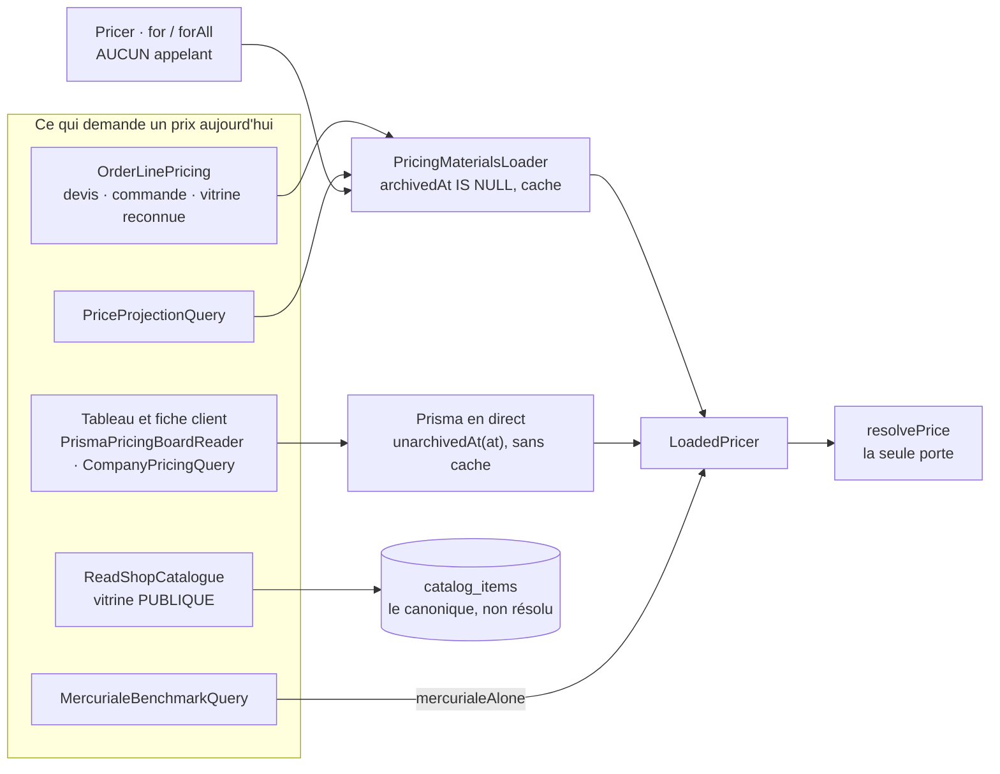
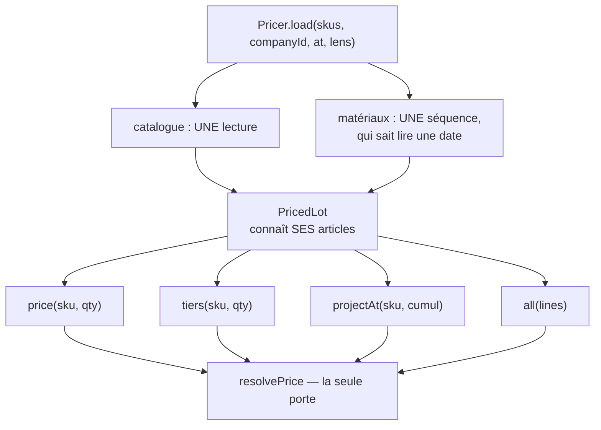

# Le prix, du moteur à la façade — troisième regard

**Ouvert le 2026-09-08.** Après
[`audit-calcul-du-panier-et-du-prix.md`](audit-calcul-du-panier-et-du-prix.md)
(2026-09-05, dix défauts, tous refermés) et [`audit-fable.md`](audit-fable.md)
(2026-09-06, sept lots sur huit faits). Celui-ci ne les prolonge pas : il relit
**tout le dossier `pricing/`** — vingt-deux documents, 8 735 lignes — puis
**tout le code qu'ils prétendent décrire** — `b2b/pricing/` en entier (12 833
lignes hors tests), la caisse dans `b2b/orders/`, `@lfd/money`, les contrats, le
schéma Prisma, les vingt-neuf portes, les tests, et les deux fronts.

La question posée était : _quelle note, quels points forts et faibles, quels
trous dans la logique à tous les niveaux, et surtout : est-ce facile à étendre
et à utiliser ?_ La réponse est en cinq parties, et **elle est dure parce qu'on
me l'a demandé ainsi**.

> ## Le verdict — 7/10
>
> | Axe                                                          | Note  | En une phrase                                                                                                |
> | ------------------------------------------------------------ | :---: | ------------------------------------------------------------------------------------------------------------ |
> | Le moteur pur — `resolvePrice`, spécificité, plancher, trace | **9** | Exact, composé, consigné, éprouvé par mutation. Rien à toucher.                                              |
> | L'argent — `@lfd/money`, unités, ventilation                 | **8** | Le paquet est irréprochable ; les _commentaires_ d'unité recréent le vecteur exact de D10 (B.5).             |
> | Les garde-fous structurels — GiST, agrégats, portes          | **8** | « Inexprimable avant refusé » est appliqué — sauf à deux endroits que le graphe de modules cache (B.7, C.3). |
> | La façade et l'application — `Pricer`, `Loader`, queries     | **6** | Une porte que personne n'emprunte, deux séquences de chargement, six copies du même mapping (C).             |
> | La lecture datée et l'historique                             | **4** | `at` est exposé, documenté, testé pour la moitié facile — et faux pour l'autre (B.3).                        |
> | Les écrans                                                   | **5** | Le front recalcule un plancher avec la formule que le domaine interdit nommément (B.9).                      |
> | La documentation                                             | **6** | Le document de référence sémantique se contredit sur la règle la plus lourde du moteur (B.6).                |
>
> **Pourquoi 7 et pas 8.** Le dossier le dit lui-même : « le moteur est à 9, ce
> qui reste est autour ». C'est exact, et c'est précisément le problème. Un
> moteur à 9 derrière une façade que **zéro** consommateur appelle, une lecture
> datée qui ment, une projection qui ouvre une porte de marge sur une quantité
> fictive, et un document de référence qui affirme l'inverse du code sur
> _promis contre livré_. **Le moteur est meilleur que le système.**
>
> La note est un **jugement**, pas un fait. Ce qu'il faut contredire, ce sont
> les onze constats de la partie B — chacun pointe le fichier et la ligne.

> ## Comment lire ce document
>
> | Partie                               | Pour qui                            | Ce qu'elle contient                                                                                                  |
> | ------------------------------------ | ----------------------------------- | -------------------------------------------------------------------------------------------------------------------- |
> | **A · Ce qui est bon**               | qui veut savoir quoi ne PAS toucher | les huit choses qui portent le système, et pourquoi elles tiennent                                                   |
> | **B · Les trous et incohérences**    | qui cherche quoi corriger           | onze constats, par gravité, chacun avec le fait, ce qu'il coûte, ce qui ne le tient pas, et son numéro au registre   |
> | **C · La façade, vue de l'appelant** | qui va étendre ou consommer le prix | ce qui rend l'API piégeuse aujourd'hui, et **C.4 : la façade proposée** — une CONCEPTION, zéro code, `vitruve` avant |
> | **D · L'ordre**                      | qui décide par quoi commencer       | six lots, dans l'ordre où ils se paient                                                                              |
> | **E · Ce qui a été ouvert**          | qui veut contredire                 | la liste, ce qui a été exécuté, et ce que ce document n'affirme pas                                                  |
> | **F · Et après**                     | qui veut savoir où l'on va          | la note une fois R15–R26 fermés, et où le système se situe face au marché — un **jugement**, dit comme tel           |
>
> 🔴 **Ce document tient son raisonnement ; il ne tient aucune liste.** Ses
> ouverts vivent au registre unique, [`ce-qui-reste-a-faire.md`](ce-qui-reste-a-faire.md),
> sous les numéros **R15 à R26**. Chaque constat de la partie B cite le sien.
>
> ⚠️ **Sur les dates.** Le registre et les documents refaits le même jour se
> datent du **2026-09-09** ; les commits qui les portent sont du **2026-09-08**
> (`git log`). Ce document garde la date de git, et nomme l'écart plutôt que de
> l'hériter.

---

# A · Ce qui est bon — et qu'il ne faut pas toucher

Un audit qui ne liste que des défauts laisse croire que tout est à refaire. Ce
n'est pas le cas. Ce qui suit est ce qui porte le système, et la raison pour
laquelle chaque pièce tient.

- **`resolvePrice` est une vraie fonction pure de domaine**
  (`apps/lfd-api/src/b2b/pricing/domain/resolve-price.ts`). Rationnels en
  `bigint`, **un** arrondi en fin de chaîne, composition (−20 % puis −10 % font
  −28 %), le gagnant d'un étage désigné _avant_ que le scellement ne décide, et
  **quatre décisions consignées plutôt qu'avalées** : les perdants d'un étage
  (`supersedes`), le scellement (`sealedRuleIds`), le plancher (`floored`), le
  zéro (`clampedToZero`). La trace est un **résultat** de la passe qui calcule,
  pas un journal tenu à côté — donc elle ne peut pas mentir sur le prix.
- **`@lfd/money` est une feuille du graphe** (`packages/money/src/exact.ts`,
  `packages/money/src/vat.ts`), partagée par le référentiel, la plateforme et
  les fronts. `ventilateVat` est **la** définition du TTC ; `Order.draft` ne le
  recompose plus. Et `packages/money/src/__tests__/exemple-doc.spec.ts` rend
  exécutables les nombres écrits dans la documentation.
- **Les recouvrements sont inexprimables**, pas surveillés : quatre contraintes
  d'exclusion GiST — règles, barèmes, engagements, mercuriales — partielles sur
  `archived_at IS NULL`, ce qui traduit en SQL « la pause réserve, l'archivage
  rend ».
- **Les agrégats portent des invariants réels** : un barème progressif à unité
  unique (`apps/lfd-api/src/b2b/pricing/domain/entities/volume-ladder.ts`), une
  grille non-décroissante dont les trois refus sont écrits une fois et parlent
  dans le vocabulaire de chaque agrégat
  (`apps/lfd-api/src/b2b/pricing/domain/pricing-grid.ts`), une mercuriale en
  **une ligne** donc atomique par construction.
- **La trace figée sur la ligne de commande** porte la décision de plancher
  _et_ la mesure d'engagement ; `assertConsistent`
  (`apps/lfd-api/src/b2b/orders/domain/value-objects/order-line.ts`) refuse une
  trace qui n'aboutit pas au prix et devient **plus stricte** sur le ramené à
  zéro. `Order.draft` vérifie ses trois termes de panier contre l'ajustement
  figé qui les prétend.
- **Le cache est correct à N instances** — estampille ULID lue avant service
  (`apps/lfd-api/src/b2b/pricing/infrastructure/pricing-materials.cache.ts`) —
  et `PricingActWriter` est le seul chemin d'écriture, journal dans la même
  transaction.
- **La discipline de test** : mutation systématique sur chaque suite neuve,
  budget compté en **opérations ORM** et non en millisecondes
  (`apps/lfd-api/test/pricing-budget.e2e-spec.ts`), parité devis ↔ **colonnes**
  de la commande montant par montant
  (`apps/lfd-api/test/quote-order-parity.e2e-spec.ts`).
- **La documentation dit quand elle s'est trompée**, date ses justifications, et
  tient un registre unique. C'est rare, et c'est ce qui rend ce troisième regard
  possible : on peut contredire ce qui est écrit.

Et ce qu'il faut **refuser** si on le propose reste ce que `audit-calcul-du-panier-et-du-prix.md`
§B.3 a écrit : des handlers injectés dans le moteur, un plancher devenu étage,
un moteur de règles, une trace séparée du calcul. Rien ici ne le contredit.

---

# B · Les trous et incohérences — par gravité

Chaque constat vient d'un fichier **ouvert**. Le format est le même partout : le
fait, ce qu'il coûte, ce qui ne le tient pas, le numéro au registre.

## B.1 🔴 La projection ouvre le plancher dynamique sur une quantité qui n'est pas une commande — R15

> 🟠 **À moitié corrigé le 2026-09-09**, et la racine n'était pas ici :
> `UnlockEvidence` ne savait pas dire « il n'y a pas de commande ». Le prix
> **sous le mur dur** est parti ; la fidélité du banc reste ouverte, parce que
> la charge de projection ne dit pas quelle commande amène à chaque niveau. Ce
> constat est conservé tel qu'il a été écrit ; le raisonnement, la branche
> écartée à tort et la contradiction sont au
> [journal de remédiation](journal-de-remediation.md).

**Le fait.** `priceAtCumulative(item, N)`
(`apps/lfd-api/src/b2b/pricing/domain/loaded-pricer.ts:196`) construit un
contexte où `quantity` **et** `cumulativeQuantity` valent `N`, puis `resolve()`
(`loaded-pricer.ts:388`) appelle
`decideFloor(policy, { quantity: context.quantity, observedVolumeRatioBp: null })`.

Dans `decideFloor` (`apps/lfd-api/src/b2b/pricing/domain/floor-policy.ts:75`),
une condition absente est réputée remplie. Avec une porte
`{ minQuantity: 50, minVolumeRatioBp: null }` — une politique **légale**, le
schéma et `dynamicOf` n'en refusent que les deux nulles — on obtient
`volumeMet = true`, `quantityMet = N >= 50`, donc à `N = 10 000` **le plancher
dynamique s'applique**, et la projection annonce un prix **sous le mur dur**
qu'une commande de 500 pièces ne verra jamais.

**Ce que ça contredit.** Le JSDoc de `LoadedPricer.over` et le commentaire de
`priceAtCumulative` affirment que « la porte d'un plancher dynamique reste
FERMÉE » pour la projection. C'est vrai pour la condition de _volume_, faux pour
celle de _quantité_. Et c'est exactement la confusion que
`apps/lfd-api/src/b2b/pricing/domain/volume-tier-prices.ts:48` nomme et évite
avec `orderQuantityAt` (« la porte se rejoue sur la COMMANDE, pas sur le
seuil »). **Deux méthodes du même objet appliquent deux règles opposées à la
même question.**

**Ce qui ne le tient pas.** Le seul cas de `loaded-pricer.spec.ts` sur la porte
fermée (`apps/lfd-api/src/b2b/pricing/domain/__tests__/loaded-pricer.spec.ts:377`)
utilise une politique à condition de volume seule (`:119`). Une mutation qui
ouvrirait la porte sur la quantité ne rougit pas.

**Ce que ça coûte.** Le banc d'essai temporel est un écran de **décision** —
« et s'il n'en prend que 70 % ? ». Il montrerait une marge que la caisse ne
lâchera pas.

**Le remède.** Un test qui échoue aujourd'hui, puis `priceAtCumulative` juge la
porte sur la quantité de commande comme `volumeTierPrices` le fait déjà — ou
n'ouvre jamais la porte, ce que sa doc promet. La forme structurelle est en C.4.

## B.2 🔴 Un engagement de portée famille est mesuré par SKU — R16

**Le fait.** `commitmentOf` (`loaded-pricer.ts:346`) calcule
`cumulativeQuantity = orderedBySku.get(item.sku) + quantity`. Le chargeur
(`apps/lfd-api/src/b2b/pricing/application/pricing-materials.loader.ts:143`)
lit `customerVolumes.volumesFor(companyId, skus, window)`, qui rend une `Map`
**par SKU**.

Un engagement de portée `category:viennoiserie`, 10 000 promis : le cumul d'une
ligne de croissants ne compte que les croissants — ni les autres viennoiseries
de l'historique, ni les autres lignes du même panier. `max(promis, livré)` ne
bascule donc sur le livré qu'à **10 000 croissants**, et `commitment.cumulativeQuantity`
figé sur la ligne de commande est **faux** pour toute portée plus large qu'un
article.

**Ce qui ne le tient pas.** `apps/lfd-api/src/b2b/pricing/domain/__tests__/volume-commitment.spec.ts:66`
teste que `commitmentFor` _choisit_ un engagement de famille ; rien ne teste la
_mesure_ à cette portée. Le modèle accepte `category` et `global`
(`VolumeCommitmentAggregate.sign` ne refuse que l'incohérence type/id).

**Ce que ça coûte.** Le client qui dépasse sa promesse sur une famille reste au
palier de la promesse — l'inverse exact de « le livré reprend la main dès qu'il
dépasse ». Et la trace ment.

**Le remède, à trancher.** Soit la mesure devient une mesure de **portée** — ce
qui demande de joindre le catalogue, `order_lines` ne portant que le SKU —, soit
la portée d'un engagement se restreint à `product` / `variant` et une famille
devient **inexprimable**. Tous les exemples du dossier (« 10 000 baguettes »)
sont par article ; la seconde voie est la moins chère et la plus sûre.

## ~~B.3~~ ✅ La lecture datée était fausse dès qu'une décision avait été archivée depuis — R17

> **Close le 2026-09-09.** La branche prise est **`at` vrai partout** : les cinq
> lectures ont leur variante datée, le cache est **contourné** pour une question
> passée, et les deux sémantiques d'archivage n'en font plus qu'une. La décision
> se prend une seule fois, dans `Pricer`, sous le nom de `PriceEpoch`.
>
> **Ce que ce constat n'avait pas vu** — et c'est la moitié du travail : le
> plancher était la seule décision tarifaire **sans fenêtre**, et re-poser le
> **réécrivait**. Datées les quatre autres familles sans lui, une relecture
> aurait appliqué le plancher d'aujourd'hui aux prix d'alors — et un plancher
> **relève**, donc le mode de défaillance était un prix historique **gonflé**,
> silencieux. Conception, contradictions et fenêtres :
> [`architecture-clore-nest-pas-ranger.md`](architecture-clore-nest-pas-ranger.md) ;
> état de la ligne : [`ce-qui-reste-a-faire.md`](ce-qui-reste-a-faire.md).
>
> Le constat d'origine suit.

**Le fait.** Tous les lecteurs du chargeur excluent l'archivage **en absolu**,
quel que soit `at` :

| Lecteur                                                                              | Clause                                                 |
| ------------------------------------------------------------------------------------ | ------------------------------------------------------ |
| `apps/lfd-api/src/b2b/pricing/infrastructure/prisma-price-rule.reader.ts:54`         | `archivedAt: null` (la table entière, gardée en cache) |
| `apps/lfd-api/src/b2b/pricing/infrastructure/prisma-price-floor.reader.ts:40`        | `archivedAt: null`                                     |
| `apps/lfd-api/src/b2b/pricing/infrastructure/prisma-company-mercuriale.reader.ts:35` | `archivedAt: null`                                     |
| `apps/lfd-api/src/b2b/pricing/infrastructure/prisma-volume-commitment.reader.ts:25`  | `archivedAt: null` — et le port ne prend pas d'`at`    |

Or trois endroits promettent l'inverse :
`apps/lfd-api/src/b2b/pricing/domain/entities/company-mercuriale.ts:184`
(« une lecture datée d'avant la clôture la retrouve »),
[`mercuriales/comprendre-une-mercuriale.md`](mercuriales/comprendre-une-mercuriale.md)
ligne 152, et `apps/lfd-api/src/b2b/pricing/application/pricer.ts:36`, qui vend
`at` comme « que payait-il le 3 mars ? ».

Le cas normal d'une mercuriale est « on clôt, on repose ». La question du 3 mars
a donc **la mauvaise réponse dès qu'on a clos depuis** — c'est-à-dire dans le
cas où on la pose.

**Ce qui le rend plausible.** Le seul e2e (`apps/lfd-api/test/pricer.e2e-spec.ts:351`)
couvre l'_expiration_ (`validTo` passé), pas la clôture. Et
[`optimisation-resolution-de-prix.md`](optimisation-resolution-de-prix.md) §4
avait nommé cette divergence latente — « dette que ce plan ne doit pas bénir » —
avant que la façade n'expose `at` par-dessus.

**Ce que ça ne casse pas aujourd'hui, et il faut le dire** : aucun chemin de
production ne passe une date passée par le chargeur. `Pricer` n'a pas
d'appelant (C.1), les quatre appelants d'`OrderLinePricing.resolve` ne passent
pas son `at?`, et la projection reçoit `clock.now()`. **La porte est ouverte,
documentée, testée pour la moitié facile, et fausse pour l'autre — le premier
consommateur de `Pricer.for({ at })` la franchira.**

**Et deux sémantiques coexistent.** Le tableau de bord lit avec
`unarchivedAt(at)`
(`apps/lfd-api/src/b2b/pricing/infrastructure/prisma-pricing-board.reader.ts:115`),
le chargeur avec `archivedAt: null`. C'est mot pour mot ce que
`apps/lfd-api/src/b2b/pricing/infrastructure/archived-at.ts` interdit : « deux
vérités sur depuis quand cette décision a-t-elle disparu ».

**Le remède, à trancher.** Soit `at` devient **vrai** — les lecteurs prennent
`at`, lisent `unarchivedAt(at)`, et le cache est contourné ou complété pour une
lecture passée —, soit `at` **disparaît** de la surface publique (`PriceRequest`,
`OrderLinePricing.resolve`) et la lecture datée reste au tableau de bord, seul
endroit où elle est juste. Une porte qui ment est pire qu'une porte absente.

## B.4 🟠 Les catégories d'erreur sont incohérentes — donc les statuts HTTP — R18

Dans `apps/lfd-api/src/b2b/pricing/domain/pricing-errors.ts`, le même refus ne
porte pas la même catégorie selon l'agrégat :

| Refus           | Règle · Barème · Mercuriale                        | Engagement · Gabarit                     |
| --------------- | -------------------------------------------------- | ---------------------------------------- |
| introuvable     | `ResourceNotFoundError` → **404** (`:305`, `:589`) | `DomainError` → **400** (`:631`, `:683`) |
| archivé, scellé | `BusinessError` → **409** (`:385`, `:562`, `:817`) | `DomainError` → **400** (`:611`, `:673`) |
| recouvrement    | `BusinessError` → **409** (`:285`, `:530`)         | `DomainError` → **400** (`:621`)         |

`architecture-resolution-de-prix.md` écrit « C'est un `409`, pas un `404` : la
règle existe, elle est scellée » — et deux agrégats sur cinq répondent 400. Un
front qui traite 409 comme « conflit, rafraîchir » et 400 comme « saisie
invalide » se trompe sur **l'engagement**, l'objet du moteur qui décide le plus.

**Le remède.** Une règle, trois familles : `*NotFoundError` étend
`ResourceNotFoundError`, `Archived*IsSealedError` et `Overlapping*Error` étendent
`BusinessError`. Et le fichier de 869 lignes se découpe par agrégat en le faisant.

## B.5 🟠 Les commentaires d'unité recréent le vecteur de D10 — R19

Le post-mortem de D10, dans `audit-calcul-du-panier-et-du-prix.md` : « le
commentaire disait _centimes_ ; trois panneaux de saisie l'ont cru ». Le même
vecteur est vivant, sur des champs `*Millicents` :

| Où                                                                                        | Ce qui est écrit                                        | Ce que le champ porte       |
| ----------------------------------------------------------------------------------------- | ------------------------------------------------------- | --------------------------- |
| `apps/lfd-api/prisma/schema.prisma:2601`                                                  | `amountMillicents` — « le prix posé, HT en centimes »   | millicentimes               |
| `apps/lfd-api/prisma/schema.prisma:2608`                                                  | `value` — « cents si amount »                           | millicentimes               |
| `apps/lfd-api/prisma/schema.prisma:2612`                                                  | `floorValue` — « ou cents »                             | colonne morte (B.10)        |
| `apps/lfd-api/prisma/schema.prisma:2690`                                                  | `PriceFloor.value` — « une limite absolue en centimes » | millicentimes               |
| `apps/lfd-api/prisma/schema.prisma:2934`                                                  | `PriceTemplate.lines` — `unitPriceCents`                | `unitPriceMillicents`       |
| `packages/contracts/src/pricing.ts:140` et `:1202`                                        | « Le prix posé, HT en centimes »                        | `amountMillicents`          |
| `packages/contracts/src/pricing.ts:467`                                                   | « ramené en centimes sur cet article »                  | `floorMillicents`           |
| `packages/contracts/src/pricing.ts:670` et `:672`                                         | `NegotiationRoom` — « en centimes »                     | `*Millicents`               |
| `packages/contracts/src/pricing.ts:1033`                                                  | « HT, en centimes »                                     | millicentimes               |
| `apps/lfd-api/src/b2b/pricing/domain/resolve-floor.ts:65`                                 | « Un plancher, **en centimes** »                        | rend des millicentimes      |
| `apps/lfd-api/src/b2b/orders/domain/value-objects/order-line.ts:83`                       | « prix unitaire en centimes ≥ 0 attendu »               | **message lu par le staff** |
| `apps/lfd-api/src/b2b/orders/domain/value-objects/order-line.ts:172`                      | « la trace aboutit à … centimes »                       | **message lu par le staff** |
| `apps/lfc-B2B-admin-frontend/src/app/commercial/tarification/grille/mercuriale-row.ts:49` | « La limite d'un article, en centimes »                 | millicentimes               |

`lint:money-units` lit les **noms**, pas les commentaires — et le dit dans son
en-tête. Le type nominal `Millicents` / `Cents` que `audit-fable.md` nomme comme
« le seul cran qui fermerait ça » est le seul remède qui ne dépende pas d'une
relecture. En attendant : les treize phrases se corrigent en une heure.

## B.6 🟠 La documentation contredit le code — R20

> ✅ **Corrigé le 2026-09-09.** Les seize items ont été rouverts dans le code
> avant correction, et deux s'y sont ajoutés que ce constat n'avait pas vus :
> une **septième** ligne périmée dans l'index global, et un document qui se
> comptait mal lui-même. Ce constat est conservé tel qu'il a été écrit ; la
> méthode est au [journal de remédiation](journal-de-remediation.md) §R20.

### Le document de référence sémantique se contredit lui-même

[`architecture-resolution-de-prix.md`](architecture-resolution-de-prix.md), dont
l'en-tête dit « **A et B disent l'état** » :

| Ligne                         | Il dit                                                                                                                                         | Le code dit                                                                                                                                                                         |
| ----------------------------- | ---------------------------------------------------------------------------------------------------------------------------------------------- | ----------------------------------------------------------------------------------------------------------------------------------------------------------------------------------- |
| `:713`                        | « **la promesse ne calcule rien.** `promisedQuantity` sert au suivi ; un prix qui en dépendrait serait une remise accordée sur une intention » | `retainedQuantity = max(promis, livré)` — la promesse **fait** le prix. Le même document le dit à la ligne `:1096`. Le schéma Prisma répète la phrase fausse (`schema.prisma:2981`) |
| `:482`, `:519`                | `amount_cents`, `basePriceCents`, `resultCents`, `finalCents`                                                                                  | tout est en millicentimes                                                                                                                                                           |
| `:727`                        | `pricing_commitment` porte `{ commitmentId, promisedQuantity, cumulativeQuantity }`                                                            | il porte aussi `retainedQuantity`, le seul des quatre qui explique un palier ouvert par la promesse                                                                                 |
| « Le chemin du prix, déplié » | « `board-item.ts` refaisait cet arbitrage… ce qui a disparu est la nécessité de refaire le calcul »                                            | `supersededIn` (`apps/lfd-api/src/b2b/pricing/application/board-item.ts:186`) **rejoue `winnerOf` par étage**, à chaque article                                                     |

Le [`README.md`](README.md) le marque 🟡 pour une seule ligne d'en-tête.

### `ecrans-de-tarification.md` — marqué ✅ — quatre fois

| Ligne  | Il dit                                                                                                  | Le code dit                                                                                                                      |
| ------ | ------------------------------------------------------------------------------------------------------- | -------------------------------------------------------------------------------------------------------------------------------- |
| `:446` | le comparatif prend « une observation par **CLIENT** … le prix du plus petit seuil »                    | `apps/lfd-api/src/b2b/pricing/application/queries/mercuriale-benchmark.query.ts:60` : **une observation par palier**, et l'écrit |
| `:456` | « Une mercuriale peut être posée en `replace` comme en `alter` »                                        | c'est la justification fausse corrigée dans le JSDoc le 2026-09-08 — et laissée dans la doc                                      |
| `:357` | « Où le calcul vit, et pourquoi il n'est pas au serveur… La simulation est pure et vit côté écran »     | l'en-tête du **même document** condamne cette simulation (R2)                                                                    |
| `:96`  | le port a quitté `domain/` parce que « c'était le seul fichier de domaine à importer `@lfd/contracts` » | quatre fichiers de `pricing/domain` l'importent, dix-huit dans `orders/domain` (C.3)                                             |

Plus, dans la même section : « il fabrique des règles de l'étage `mercuriale` »
pour le gabarit — faux depuis qu'il écrit une `CompanyMercuriale`.

### Les autres

- [`README.md`](README.md) `:132` — « six limites mesurées » pour un §7 qui en
  lève quatre le même jour.
- [`architecture-prix-boutique.md`](architecture-prix-boutique.md) `:24` — le
  bandeau affirme que « §3 tient toujours — la liste résout à 1 » ; la vitrine
  publique ne résout **pas** (B.8).
- [`optimisation-resolution-de-prix.md`](optimisation-resolution-de-prix.md)
  `:26` — « Le fait » décrit `resolveOne` et ses trois lectures par article, qui
  n'existent plus ; l'index global le présente comme « le coût réel ».
- [`../README.md`](../README.md), l'index **global** — refait pour `pricing/README.md`,
  pas pour lui : `:126` annonce « Restent S4c et S5 », `:131` un défaut
  1,83924 € « ouvert », `:137` « Reste B5 », `:141` « sept refermés, neuf
  livrés », `:142` « le chemin vers 9 en huit lots », `:160` un todo 🔴 fermé
  depuis. Six lignes périmées sur vingt-deux.
- Les dates : le registre, le `README.md` du dossier et les documents refaits le
  même jour portent **2026-09-09** ; leurs commits sont du **2026-09-08**.

Aucune de ces phrases ne fausse un prix. Mais celle de la ligne 713 fait
_garder un mécanisme pour une raison qui n'existe pas_ — la définition même du
commentaire dangereux dans `CLAUDE.md` §8.

## B.7 🟠 « La seule séquence de chargement » est double — R21

**Le fait.** `PricingMaterialsLoader` sert la caisse, le `Pricer` et la
projection. Mais le tableau de tarification et la fiche client chargent
**eux-mêmes** : `apps/lfd-api/src/b2b/pricing/application/queries/company-pricing.query.ts:86`
fait `prisma.priceRule.findMany`, `prisma.priceFloor.findMany`,
`ladders.listAll(at)`, puis `boardMaterials(...)` (`:116`) qui construit
`LoadedPricer.over(materialsOf(...), NO_EVIDENCE, ...)` avec `commitments: []`.
Même chose dans `prisma-pricing-board.reader.ts:114` et `:162`.

**Ce que ça contredit.** [`comment-un-prix-se-fabrique.md`](comment-un-prix-se-fabrique.md)
`:42`, [`architecture-pricer.md`](architecture-pricer.md) `:49`,
`apps/lfd-api/src/b2b/pricing/pricing.module.ts:31`,
`pricing-materials.loader.ts:44` et `pricer.ts:73` : cinq endroits écrivent
« la **seule** séquence ».

**Ce que ça coûte.** C'est cette seconde séquence qui produit la double
sémantique d'archivage de B.3. Et une **query d'application injecte
`PrismaService`** (`company-pricing.query.ts:69`, `:93`, `:190`) — `CLAUDE.md`
§4 : « le handler dépend de ports, jamais de `PrismaService` ».

## B.8 🟠 La vitrine publique ne passe pas par le fabricant — R22

> ✅ **Corrigé le 2026-09-09.** Les deux vitrines partagent une seule logique de
> prix. Ce constat visait juste ; ce qu'il ne disait pas, c'est que la route
> RECONNUE ratait la même promotion, par le même raisonnement. Détail :
> [journal de remédiation](journal-de-remediation.md) §R22.

**Le fait.** `apps/lfd-api/src/b2b/catalog/application/queries/read-shop-catalogue.ts`
sert `item.unitPriceMillicents` du miroir — le **canonique**, jamais résolu. Une
promotion publique (`audience: all`, −10 % sur les viennoiseries) est donc
**invisible au rayon** et n'apparaît qu'au panier, où `/shop/quote` la résout.

Seule la route reconnue résout
(`apps/lfd-api/src/b2b/orders/application/queries/read-my-shop-catalogue.ts:73`),
et seulement si `companyId !== null` : le visiteur reçoit le canonique.

**Ce que ça contredit.** La règle n° 1 du [`README.md`](README.md) — « il n'y a
qu'un seul fabricant de prix » — n'est pas tenue pour le visiteur ; et le
bandeau d'`architecture-prix-boutique.md` décrit une résolution « à 1 » qui n'a
pas lieu.

**Ce que ça coûte.** L'écart est dans le sens agréable — le client voit 2,00 €
au rayon et 1,80 € au panier. Mais **une promotion qu'on ne voit pas ne fait pas
vendre** : c'est un trou commercial, pas seulement une divergence d'écran.

## B.9 🟠 Le front recalcule un plancher avec la formule que le domaine interdit nommément — R23

> ✅ **Corrigé le 2026-09-09**, et ce constat se trompait deux fois. La formule
> interdite n'était pas le défaut principal : l'écran lisait le **mur dur** là
> où la caisse applique la **porte**. Et l'écart au catalogue ne réimplémente
> pas `discountBp` mais `gapBp` — les substituer aurait effacé le cas « plus
> cher ». Détail : [journal de remédiation](journal-de-remediation.md) §R23.

**Le fait.** `apps/lfd-api/src/b2b/pricing/domain/resolve-floor.ts:67` :
« pas par un `Math.round(canonical * bp / 10000)` qui aurait l'air identique.
Les deux divergeraient d'un centime sur certaines valeurs ».
`apps/lfc-B2B-admin-frontend/src/app/commercial/tarification/grille/mercuriale-row.ts:50` :
`Math.round((canonicalMillicents * floor.value) / 10_000)`.

Et `mercuriale-row.ts:61` réimplémente l'écart au catalogue en points de base,
alors que [`durcir-le-calcul-des-prix.md`](durcir-le-calcul-des-prix.md) `:111`
affirme que `discountBp` est descendu dans `@lfd/money` et que « les deux côtés
l'importent ».

**Ce que ça coûte.** C'est l'écran où un commercial tape un prix négocié et lit
la **marge de négoce** — le nombre qui décide de signer. Le « cinq occurrences »
du motif « un écran qui recalcule » est sous-compté : celle-ci fait **six**.

## B.10 🟡 États inatteignables et colonnes mortes — R24

- `company_mercuriales.paused_at` est écrit et relu
  (`apps/lfd-api/src/b2b/pricing/infrastructure/mercuriale-rows.ts:44`,
  `apps/lfd-api/src/b2b/pricing/infrastructure/prisma-company-mercuriale.repository.ts:84`),
  filtré par `liveEverywhere` (`prisma-company-mercuriale.reader.ts:59`),
  raisonné dans le JSDoc du port
  (`apps/lfd-api/src/b2b/pricing/domain/ports/company-mercuriale.reader.ts:26`)
  — et `CompanyMercuriale` n'a **aucun `pause()`**, aucun handler, aucune route.
  Un état qu'on ne peut atteindre qu'en SQL, et sur lequel deux lecteurs
  prennent des décisions différentes.
- `price_rules.floor_mode` / `floor_value` : **jamais lus** par le code ; le
  schéma (`schema.prisma:2610`) promet « Plancher propre à la règle ».
- `PricingEvent` (`schema.prisma:3022`, `:3028`) : « `rule` | `floor` », six
  actes. Le contrat en a quatre sujets et sept actes.
- `AuthoredPriceStage` du domaine (`apps/lfd-api/src/b2b/pricing/domain/price-rule.ts:36`)
  vaut `Exclude<PriceStage, "volume">` — la mercuriale y est encore
  **saisissable** —, quand le contrat (`packages/contracts/src/pricing.ts:76`)
  l'a sortie. `PricingRule.create`
  (`apps/lfd-api/src/b2b/pricing/domain/entities/pricing-rule.ts:103`) porte
  trois refus pour un étage qu'aucune route n'envoie plus.
- Et R10, déjà connu : `PriceTemplate.archive()`, `MercurialeNameTakenError`.

## B.11 🟡 La trace figée ne répond pas à la question qu'elle existe pour poser — R25

> 🟠 **Un tiers fait le 2026-09-09.** `scope` est persisté — il ne l'avait
> **jamais** été, le schéma de relecture l'accueillant depuis le 09-03 derrière
> un défaut qui couvrait le fil débranché. Le scellement, lui, est à
> **reconcevoir** : `sealedRuleIds` ne porte que le gagnant de l'étage scellé,
> en identifiants nus, et les causes d'une règle sans effet sont cinq et non
> trois. Et `supersedes` attend **R27** — une trace qui part au client sans
> rétrécissement, trouvée en bâtissant celle-ci. Détail :
> [journal de remédiation](journal-de-remediation.md) §R25.

`sealedByRuleId`, `sealedRuleIds` et `steps[].supersedes` **ne sont pas
persistés** — `packages/contracts/src/pricing.ts:523` : « Vide **aussi** sur une
trace persistée, tant que `jsonSteps` ne l'écrit pas » ; `OrderLinePricingTrace`
(`:615`) n'a pas de champ de scellement ; `architecture-resolution-de-prix.md:178`
le sait (« il faudra l'y figer aussi »).

Six mois plus tard, « pourquoi ma promotion ne s'est pas appliquée ? » a trois
réponses — expirée, évincée, scellée — et la ligne n'en garde **aucune**. C'est
un trou dans la promesse centrale du système (« un prix qu'on peut défendre six
mois plus tard »), pas un détail de contrat.

---

# C · La façade, vue de qui l'appelle

## ~~C.1~~ ✅ Personne n'appelait `Pricer`

> **Clos le 2026-09-09.** Trois appelants passent par la porte — la caisse, la
> vitrine, la projection. Elle ne prend plus de SKU mais des **articles
> scellés**, ce qui a supprimé d'un coup la lecture en trop, la permission de
> contourner qu'elle s'accordait par écrit, et un cycle de modules. Le quatrième,
> le tableau, ne peut pas y passer tant que le chargeur ne sait pas lire une date
> (R17). État réel :
> [`architecture-la-porte-du-prix.md`](architecture-la-porte-du-prix.md).

~~`PricerModule` est importé dans `apps/lfd-api/src/appBootstrap/app.module.ts:110`.
**Aucune classe de production n'injecte `Pricer`** (vérifié par `grep` le
2026-09-08). La façade a quinze tests unitaires, douze e2e, son module et son
document — et n'est sur aucun chemin.~~



Les trois consommateurs réels refont chacun la **chorégraphie d'entrée** :
résoudre le catalogue → construire un `PricedItem` → `pricerFor` → traiter le
`null` → appeler la bonne méthode. Le mapping `{ sku, name, category, canonicalMillicents }`
est copié **six fois** :

| Où                                                                               | Ligne  |
| -------------------------------------------------------------------------------- | ------ |
| `apps/lfd-api/src/b2b/pricing/application/pricer.ts`                             | `:160` |
| `apps/lfd-api/src/b2b/pricing/application/queries/price-projection.query.ts`     | `:53`  |
| `apps/lfd-api/src/b2b/orders/application/services/order-line-pricing.service.ts` | `:143` |
| `apps/lfd-api/src/b2b/orders/domain/services/price-line.ts`                      | `:134` |
| `apps/lfd-api/src/b2b/pricing/application/board-item.ts`                         | `:126` |
| `apps/lfd-api/src/b2b/pricing/application/queries/company-pricing.query.ts`      | `:123` |

Le chantier `Pricer` a ramené la **résolution** de cinq recettes à une. Il a
laissé la **chorégraphie** en quatre exemplaires, plus une façade vide.

## C.2 Les pièges de l'API

> **2026-09-09 — trois sont fermés, un l'est à moitié, cinq restent.** Chaque
> ligne ci-dessous est revérifiée contre le code ; ce qui n'est pas barré est
> encore vrai. Rayer la section entière aurait laissé croire que la façade a tout
> emporté.

- 🟠 **À MOITIÉ.** ~~Trois appelants, trois traitements d'une branche
  inatteignable~~ — il n'y en a plus qu'un : `Pricer.load` refuse un lot vide
  (`EmptyLotError`), et les appelants qui peuvent en avoir un le testent avant de
  charger. **Le `null` reste** dans la signature interne de `pricerFor`, où il
  n'a toujours pas de sens : un tarificateur sur des matériaux vides est
  parfaitement valide.
- **`pricerFor(items: { item, quantity }[])`** — la quantité n'est lue par
  **rien** du chargement : portée, engagement, ratio n'en dépendent pas. La
  projection écrit `quantity: 1` avec un commentaire pour s'excuser
  (`price-projection.query.ts:62`). Et `scopesOfAll`
  (`apps/lfd-api/src/b2b/pricing/domain/pricing-scopes.ts:66`) calcule trois
  tableaux de portées qu'**aucun lecteur ne lit plus** depuis que le cache garde
  les tables entières — il ne sert qu'à détecter le lot vide.
- ✅ **CLOS.** ~~Le contrat de lot n'est pas tenu.~~ `PricedLot` connaît ses
  articles et refuse un SKU qu'il n'a pas chargé (`ArticleNotInLotError`, dont le
  message dit lequel manque et combien le lot en porte). Le constat reste juste
  sur le **pourquoi** : le prix rendu était plausible — matériaux corrects par
  accident du cache, preuves fausses —, et c'est précisément ce que le refus
  empêche. Éprouvé par `priced-lot.spec.ts`, huit cas.
- 🟠 **À MOITIÉ.** `PriceLens` nomme la décision une fois, dans un type que le
  chargeur lit — et sous `unproven` il n'interroge même plus les engagements.
  **Il reste deux formes**, et elles ne disent pas la même chose : le booléen de
  `LoadedPricer` gouverne la **question** posée (une projection ne prouve pas de
  commande), la lentille gouverne les **matériaux**. Et `board-item.ts` monte
  encore `NO_EVIDENCE` + `commitments: []` à la main, faute de pouvoir passer par
  la porte (R17). Le constat garde sa leçon : **c'est là que B.1 s'est glissé.**
- **`mercurialeAlone(mercuriale, companyId, item, minQuantity, at)`**
  (`loaded-pricer.ts:252`) : cinq paramètres dont `companyId`, que
  `mercuriale.companyId` porte déjà — l'appelant fait
  `mercuriale.toPersistence().companyId`
  (`mercuriale-benchmark.query.ts:78`) pour lire un getter public ; un
  `PricingContext` fabriqué à la main avec `categoryId: ""`, en contournant
  `pricingContextFor` **dans le fichier même** dont `contextFor` dit « les
  recopier ici en ferait une quatrième copie » ; et pour une règle `replace`,
  `resolvePrice` rend `tier.unitPriceMillicents` — le détour n'achète que des
  vérifications que `liveEverywhere(at)` a déjà faites.
- ✅ **CLOS.** ~~Deux portes, deux politiques.~~ `forAll` n'existe plus : il
  n'y a qu'une porte, `load`, qui refuse un doublon — et la caisse fusionne les
  quantités **avant** de la franchir. Même panier, même réponse.
- **Redondances.** `PricedArticle.floorMillicents` (`loaded-pricer.ts:397`) vaut
  toujours `floorDecision?.floorMillicents ?? null` (`:417`) ;
  `ResolvedOrderLine` (`price-line.ts:24`) duplique quatre champs de son propre
  `priced`.
- **`OrderLinePricing.resolve(…, at?)`** (`order-line-pricing.service.ts:63`) :
  quatre appelants, **aucun** ne le passe. Un paramètre optionnel qui n'existe
  que pour être inutilisé, sur le chemin qui facture, avec le danger de B.3
  attaché.
- **Le domaine importe `@lfd/contracts`** : `loaded-pricer.ts`,
  `volume-tier-prices.ts`, `entities/price-template.ts`,
  `services/mercuriale-benchmark.ts` — et dix-huit fichiers de `orders/domain`.
  `CLAUDE.md` §3 : « ne dépend de RIEN (ni Zod) ». Conséquence concrète :
  `PricedArticle.commitment` est un `CommitmentDecisionView` dont
  `retainedQuantity: number | null` porte la nullabilité des **traces
  anciennes** dans un résultat qu'on vient de calculer et qui ne peut pas être
  nul.

## C.3 Les frontières qui rendent l'extension coûteuse

> **2026-09-09 — une est fermée, trois restent.**

- ✅ **CLOS.** ~~`pricing → orders` pour le catalogue.~~ Le port descend dans
  `catalog/` avec son adaptateur — qui ne faisait que traduire `CatalogReader` —,
  et `pricing` n'importe **plus rien** d'`orders` : zéro import, contre neuf
  fichiers et deux modules. Les deux JSDoc qui parlaient de « fermer le cycle »
  sont réécrits ; l'un d'eux disait vrai pour une raison qui n'existait plus.

  ⚠️ Le constat visait juste **et** se trompait de mot : ce n'était pas un cycle,
  c'étaient **deux ports empilés** dont l'autoritaire vivait dans le contexte qui
  n'en est pas la source. Le vrai cycle est apparu plus tard, quand la vitrine a
  voulu passer par la porte — et il a été refusé par `lint:import-cycles`.

- **La lecture n'est pas sur le bus.** `PriceProjectionQuery`,
  `MercurialeBenchmarkQuery`, `CompanyPricingQuery`, `PriceTemplatesQuery`,
  `VolumeCommitmentsQuery` sont des `@Injectable`
  (`pricing-admin.module.ts:111`) ;
  `apps/lfd-api/src/b2b/pricing/http/admin-pricing.controller.ts:75` injecte
  `PricingBoardReader`, `BoardComparisonService`, `PriceProjectionQuery` et
  `Clock` à côté du `CommandBus`. L'écriture est CQRS, la lecture ne l'est pas —
  un demi-contexte, quand `orders` tient les deux (`QuoteShopCartQuery`).
- **Les tailles.** `pricing-errors.ts` 869 lignes et 55 classes,
  `loaded-pricer.ts` 425, `admin-pricing.controller.ts` 370,
  `packages/contracts/src/pricing.ts` 1 609. La règle « ≲ 300 lignes » est
  dépassée là où on cherche le plus souvent.
- **Deux dimensions du modèle sont mortes** : l'audience `segment` est
  inatteignable (`apps/lfd-api/src/b2b/pricing/domain/pricing-context.ts`, écart
  n° 3), et `variant` égale `product` tant que le catalogue n'a qu'un niveau
  (écart n° 1). La spécificité arbitre sur des axes sans donnée — ce n'est pas
  faux, c'est du poids à porter à chaque lecture.

## ~~C.4~~ ✅ La façade à laquelle on ne peut pas se tromper — **bâtie** — R26

> **Bâtie le 2026-09-09, en quatre lots.** Ce qui suit est la conception
> d'origine, conservée telle qu'elle a été écrite. Elle a été **contredite sur
> ses quatre décisions** avant qu'une ligne soit posée, puis corrigée : la porte
> prend des articles **scellés** et non des SKU, la lentille a **deux** valeurs
> et non trois, `at` n'a pas été retiré (une route le sert), et le mapping vit
> dans le **port** plutôt que dans la façade.
>
> - l'état réel :
>   [`architecture-la-porte-du-prix.md`](architecture-la-porte-du-prix.md) ;
> - le raisonnement, les versions démolies et ce que chaque lot a trouvé :
>   [journal de remédiation](journal-de-remediation.md) §R26.
>
> ⚠️ **Ce qu'elle n'a pas emporté** : le tableau n'emprunte pas la porte (R21),
> parce qu'il lit ses matériaux à une **date** que le chargeur ne sait pas lire
> (R17).

> **Ce paragraphe décrit ce qui n'existe pas.** Il touche l'argent : `vitruve`
> avant de bâtir, comme `CLAUDE.md` §9 bis l'exige. Les noms sont proposés, pas
> décidés.

**Une porte.** `LoadedPricer` et `PricingMaterialsLoader` deviennent internes au
module ; ce qui sort est un **lot** qui connaît ses articles.

```ts
// Le catalogue est résolu ICI, une fois. Le lot connaît SES articles.
const lot = await this.pricer.load({
  skus: ["CRO-001", "BAG-002"],
  companyId,
  at, // optionnel — et VRAI (B.3), ou absent
  lens: "checkout", // "checkout" | "screen" | "projection"
});

lot.price("CRO-001", 12); // PricedArticle — un SKU hors lot est REFUSÉ
lot.tiers("CRO-001", 12); // la grille des paliers
lot.projectAt("CRO-001", 10_000); // la projection, porte jugée sur la COMMANDE
lot.all([{ sku, quantity }]); // la caisse
```



Ce que chaque décision ferme :

| Décision                                                                                                                                                                                                      | Ce qu'elle rend inexprimable                                                                                                                     |
| ------------------------------------------------------------------------------------------------------------------------------------------------------------------------------------------------------------- | ------------------------------------------------------------------------------------------------------------------------------------------------ |
| **Le lot connaît ses articles**                                                                                                                                                                               | les six copies du mapping, le `null` du lot vide, la `quantity` fantôme au chargement, et le prix plausible d'un article hors lot (refusé)       |
| **`lens` nomme ce qu'on écarte**, une fois, dans un type                                                                                                                                                      | les trois encodages de « quelles preuves sont recevables » ; `projection` juge la porte sur la quantité de commande — B.1 ne peut plus s'écrire  |
| **`at` est vrai ou n'existe pas**                                                                                                                                                                             | la réponse plausible à « que payait-il le 3 mars ? » (B.3) ; les lecteurs prennent `at`, le cache est contourné ou complété pour une date passée |
| **Une seule séquence de chargement**, `lens: "screen"` pour le tableau                                                                                                                                        | B.7, et `PrismaService` sort de `CompanyPricingQuery`                                                                                            |
| **`pricing → catalog`**, plus `orders`                                                                                                                                                                        | le cycle de contextes, les deux ports catalogue                                                                                                  |
| **Les types du domaine dans le domaine** ; le contrat mappé en `http/`                                                                                                                                        | la nullabilité des traces anciennes dans un résultat neuf ; les 22 imports de `@lfd/contracts` depuis un `domain/`                               |
| **`Millicents` / `Cents` nominaux dans `@lfd/money`**                                                                                                                                                         | B.5 sans relecture — le cran que deux audits nomment sans le franchir                                                                            |
| **Un fichier d'erreurs par agrégat**, trois familles de catégorie                                                                                                                                             | B.4                                                                                                                                              |
| **La lecture sur le `QueryBus`**, les contrôleurs n'injectent que des bus                                                                                                                                     | le demi-contexte de C.3                                                                                                                          |
| **Supprimer la cérémonie** : `mercurialeAlone` devient une méthode de l'agrégat, `floorMillicents` redondant part, les quatre doublons de `ResolvedOrderLine` aussi, et le `at?` d'`OrderLinePricing.resolve` | six lignes de moins à comprendre pour qui arrive                                                                                                 |

**Ce que cette façade ne change pas** : `resolvePrice`, `specificity.ts`,
`floor-policy.ts`, `resolve-floor.ts`, `volume-tier-prices.ts`. Le moteur est
bon. C'est sa **porte** qu'on redessine — et c'est la seconde fois, ce qui
devrait inquiéter : la première (`architecture-pricer.md`) a ramené cinq entrées
à une sans regarder **qui allait l'emprunter**. Celle-ci commence par là.

---

# D · L'ordre, et pourquoi

1. **R15 et R16** (B.1, B.2) — deux tests qui échouent aujourd'hui, puis le
   correctif. Ce sont les deux seuls constats qui produisent un **prix faux** :
   l'un en défaveur de la maison, l'autre du client.
2. ~~**R17**~~ (B.3) — ✅ **fait le 2026-09-09** : `at` vrai partout. Elle a été
   fermée pendant qu'elle n'avait aucun consommateur, ce qui était bien le
   moment le moins cher — mais elle a coûté une migration et un changement de
   modèle d'identité que ce classement ne prévoyait pas, le plancher n'ayant
   pas de fenêtre.
3. **R18 et R19** (B.4, B.5) — une heure, zéro risque, et ça ferme le vecteur
   exact de D10.
4. ~~**R26**~~ (C.4) — ✅ **fait le 2026-09-09**, en quatre lots, `vitruve`
   d'abord. La façade avec `lens`, et `lint:price-door` qui rend le
   contournement **inexprimable**.
5. **R20** (B.6) — réécrire la partie B d'`architecture-resolution-de-prix.md`,
   les quatre phrases d'`ecrans-de-tarification.md`, les six lignes de l'index
   global, et les dates. Tant que le document de référence dit « la promesse ne
   calcule rien », quelqu'un le croira.
6. **R22 et R23** (B.8, B.9) — la vitrine publique par le fabricant, et
   `mercuriale-row.ts` sur `@lfd/money`. R23 rejoint R2 : c'est le même lot
   front, et il est le sixième du motif.

⚠️ **Cette phrase disait « R21, R24 et R25 tombent avec R26 ou se font en
passant ». R26 est close, et aucune des trois n'est tombée.** R21 avait un
blocage que le quatrième lot a nommé — le tableau ne pouvait pas passer par la
porte tant que le chargeur ne savait pas lire une date, c'est-à-dire tant que
R17 restait ouverte. R17 l'est depuis, donc R21 est **faisable**, mais c'est un
lot à part entière. R24 et R25 n'ont jamais dépendu de la façade. Elles sont au
registre pour que personne ne les redécouvre — et pour que personne ne les
croie faites.

---

# E · Ce qui a été ouvert, exécuté, et ce que ce document n'affirme pas

**Ouvert le 2026-09-08 :**

- les vingt-deux documents de `documentation/pricing/`, en entier ;
- `apps/lfd-api/src/b2b/pricing/` — le domaine (`loaded-pricer.ts`,
  `resolve-price.ts`, `price-rule.ts`, `specificity.ts`, `floor-policy.ts`,
  `resolve-floor.ts`, `volume-tier-prices.ts`, `volume-commitment.ts`,
  `volume-ladder.ts`, `pricing-materials.ts`, `pricing-context.ts`,
  `pricing-scopes.ts`, `scope-index.ts`, `rule-lifecycle.ts`,
  `pricing-grid.ts`, `pricing-errors.ts`, les entités `company-mercuriale.ts`,
  `pricing-rule.ts`, `volume-ladder.ts`, `volume-commitment.ts`, les ports),
  l'application (`pricer.ts`, `pricing-materials.loader.ts`, `board-item.ts`,
  les queries `company-pricing`, `price-projection`, `mercuriale-benchmark`,
  `pricing.commands.ts`, `pricing.handlers.ts`, `mercuriale-drafts.store.ts`),
  l'infrastructure (le cache, `pricing-act.writer.ts`, `price-rows.ts`,
  `archived-at.ts`, les lecteurs Prisma des règles, planchers, mercuriales,
  engagements, volumes), les trois modules, `admin-pricing.controller.ts` ;
- `apps/lfd-api/src/b2b/orders/` — `price-line.ts`, `order-line.ts`,
  `order.ts`, `order-line-pricing.service.ts`, `cart-adjustments.service.ts`,
  `quote-shop-cart.handler.ts`, `read-my-shop-catalogue.ts` ;
- `apps/lfd-api/src/b2b/catalog/application/queries/read-shop-catalogue.ts` ;
- `packages/money/src/` en entier ; `packages/contracts/src/pricing.ts` ;
  `apps/lfd-api/prisma/schema.prisma` (les huit modèles de tarification) et les
  cinq migrations qui posent une contrainte d'exclusion ;
- `dev-toolbox/gates/price-pipeline.mjs`, `money-units.mjs`, `business-day.mjs`,
  `controller-buses.mjs`, `doc-references.mjs` ;
- les suites : `loaded-pricer.spec.ts`, `pricer.spec.ts`, `price-line.spec.ts`,
  `resolve-price.spec.ts`, `volume-commitment.spec.ts`, et les trois e2e du
  tarificateur (noms des cas) ;
- côté front : `commercial/tarification/simulation/` (`pricing-regime.ts`,
  `revenue-model.ts`), `grille/mercuriale-row.ts`, et un `grep` de tous les
  arrondis des deux applications.

**Exécuté :** des `grep` et des lectures. **Rien d'autre** — aucune suite
lancée, aucune mutation posée, aucune requête de production, et `vitruve` n'a
pas été appelé sur C.4 (il le sera avant de bâtir).

**Ce que ce document n'affirme pas :**

- que B.1 ou B.2 aient déjà frappé une projection ou une commande réelle. Il
  affirme que le code le fait **si** une porte à condition de quantité seule,
  ou un engagement de portée famille, existe en base — et que rien ne l'interdit
  à la saisie. Les deux tests du lot 1 le prouveront ou le démentiront ;
- que B.3 casse quoi que ce soit aujourd'hui : la porte n'a pas d'appelant.
  C'est la raison de la fermer maintenant ;
- que les treize phrases de B.5 aient produit un défaut : elles reproduisent le
  **vecteur** de D10, pas D10 ;
- que la note soit autre chose qu'un jugement — onze constats, chacun avec son
  fichier. **C'est eux qu'il faut contredire, pas le chiffre.**

---

# F · Et après — la note projetée, et où ça se situe

> **Un jugement, pas une mesure.** Cette partie répond à une question posée en
> cours de route : « une fois tout ça corrigé, quelle note, et où en est-on par
> rapport aux autres B2B ? ». Rien ici n'a été mesuré contre un autre système.
> C'est ce que je sais des **catégories** d'outils, confronté à ce que ce dépôt
> fait — et c'est dit pour pouvoir être contredit.

## F.1 La note, une fois R15 à R26 fermés

| Axe              | Aujourd'hui |   Après    | Ce qui reste entre « après » et 10                                                                                                                                                        |
| ---------------- | :---------: | :--------: | ----------------------------------------------------------------------------------------------------------------------------------------------------------------------------------------- |
| Le moteur pur    |      9      |   **9**    | rien de ce registre. Le 10 viendrait d'un test **par propriétés** — des règles générées au hasard, et les invariants vérifiés dessus : composition, arrondi unique, jamais sous zéro      |
| L'argent         |      8      |   **9**    | le type nominal fait le 9 ; le 10 demande la **facture**, qui est un contexte à ouvrir, pas un lot                                                                                        |
| Les garde-fous   |      8      |   **9**    | la frontière `b2b → pim` reste une discipline — une base, une URL, un client                                                                                                              |
| La façade        |      6      |   **9**    | le 10 est celui d'une façade qui a **vécu** : un second consommateur venu demander un prix sans avoir rien eu à apprendre                                                                 |
| La lecture datée |      4      | **8 ou —** | 8 si `at` devient vrai ; **pas de note** si on le retire — on ne note pas une promesse qu'on ne fait plus, et le tableau de bord garde la sienne                                          |
| Les écrans       |      5      |   **7**    | R23 se ferme avec R2 ; mais **R2 reste un chantier de conception**, et tant que la simulation calcule dans le navigateur, la contrainte « un écran ne calcule rien » n'est tenue par rien |
| La documentation |      6      |   **8**    | une doc ne dépasse pas 8 tant qu'elle n'est vérifiée que par relecture : `doc-references` tient les **chemins**, rien ne tient les **phrases**                                            |

**Autour de 8,5 — et 9 si R2 est bâti.** Ce qui sépare 9 de 10 n'est pas dans
ce registre, et il faut le dire pour ne pas le chercher au mauvais endroit :

- la **facture** — le contexte n'existe pas, et un système de prix ne vaut 10
  que quand il facture ce qu'il a résolu ;
- la décision **prix vivant / prix bloqué** (R13) — qui porte le risque d'un
  prix qui bouge est une question commerciale que le moteur ne peut pas trancher
  à sa place ;
- le **multicanal** — aucun canal n'est modélisé, et
  [`decision-qui-pose-une-promotion.md`](decision-qui-pose-une-promotion.md) §5
  écrit que seule l'autorité au référentiel y répondrait ;
- la **sortie anticipée d'un engagement** — l'en-tête de
  `apps/lfd-api/src/b2b/pricing/domain/volume-commitment.ts` dit que la charge
  est « entièrement portée par nous », et qu'aucune réponse commerciale n'est
  prise.

## F.2 Où ça se situe — par catégorie d'outil, pas par nom

| Face à…                                                                                                                                                         | Ce que ce dépôt fait **mieux**                                                                                                                                                                                                                                                                                                                                                                                    | Ce qu'il **n'a pas**                                                                                                                                                             |
| --------------------------------------------------------------------------------------------------------------------------------------------------------------- | ----------------------------------------------------------------------------------------------------------------------------------------------------------------------------------------------------------------------------------------------------------------------------------------------------------------------------------------------------------------------------------------------------------------- | -------------------------------------------------------------------------------------------------------------------------------------------------------------------------------- |
| **Une plateforme B2B sur étagère** — listes de prix par groupe de clients, paliers, promotions ordonnées par priorité avec un drapeau « ignorer les suivantes » | l'arithmétique **exacte** à un seul arrondi (elles arrondissent par étape ou par ligne, en décimal, parfois en flottant) ; la **trace figée avec ses décisions** (elles gardent le prix final, au mieux des identifiants de règles) ; le recouvrement **impossible en base** (elles arbitrent par un numéro de priorité, qui se contourne en insérant) ; le scellement **nommé**, avec une seule sortie explicite | les groupes de clients (l'audience `segment` est morte), les devises, les canaux                                                                                                 |
| **Un CPQ ou une suite de pricing d'entreprise** — cascade de prix, marge sur coût de revient, approbation des remises, contrats à durée, simulation à l'échelle | la même rigueur — et une **honnêteté** que ces suites n'ont pas : aucune marge inventée sur un coût qu'on n'a pas, un plancher qui est une **intention datée** avec son signal de dérive plutôt qu'un calcul qui a l'air d'une mesure                                                                                                                                                                             | la **largeur** : coût de revient, approbation sous plancher (ici `negotiationRoom` s'affiche, il n'arrête rien), cycle de vie d'un contrat (R13), analytique, multi-entité       |
| **Ce qu'une entreprise de cette taille a d'ordinaire** — un tableur, un prix par client dans un champ libre                                                     | tout                                                                                                                                                                                                                                                                                                                                                                                                              | rien — et c'est le point : ce moteur est **plus rigoureux que quelques dizaines d'articles ne l'exigent**, ce qui n'est un défaut que si on oublie qu'il est écrit pour la suite |

**En une phrase.** Sur la **rigueur** — exactitude, explicabilité, invariants
tenus en base — ce dépôt est au-dessus de ce que la plupart des plateformes B2B
du marché font, y compris des grandes. Sur la **largeur** — contrats,
approbations, canaux, facture — il est en dessous de tout CPQ, et c'est normal :
ce sont des contextes qu'il n'a pas encore ouverts, pas des trous dans ceux
qu'il a.

**Ce qui ferait la différence** ne s'achète pas dans une suite du marché. C'est
qu'un second consommateur — la facture, un canal, un import — vienne demander un
prix et n'ait **rien à apprendre**. C'est exactement ce que C.4 essaie
d'acheter, et c'est pour ça qu'il vient avant la facture dans l'ordre de la
partie D.
