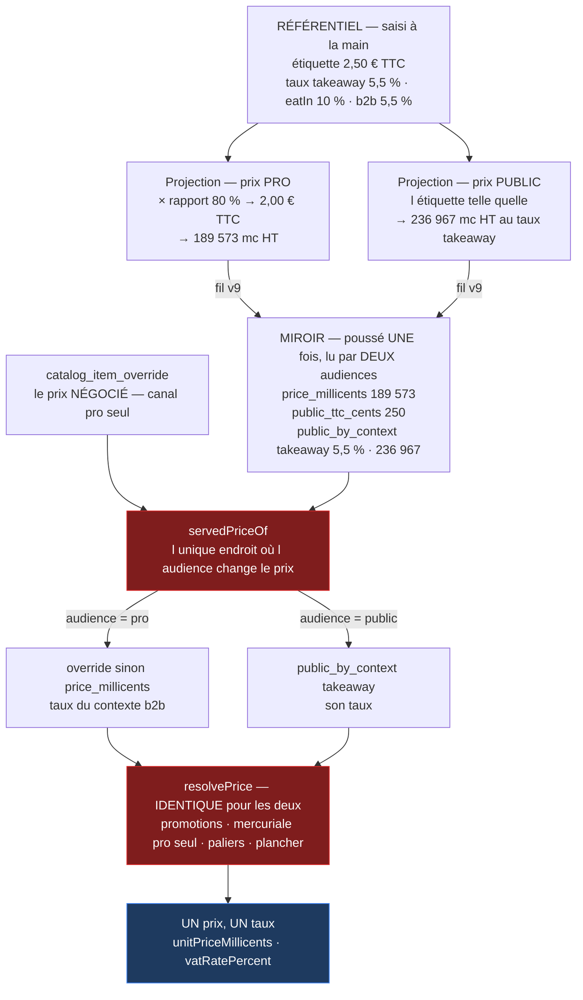
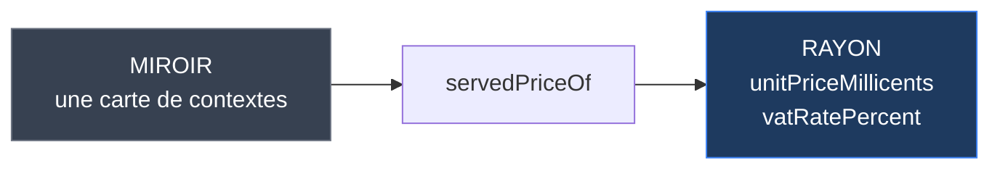

# Le chemin du prix — du référentiel au rayon, et au panier

> **2026-09-21.** Décrit le code des lots **A1** et **A2** de
> [`plan-un-seul-canal-deux-prix.md`](../pim/plan-un-seul-canal-deux-prix.md).
>
> ✅ **À jour au 2026-09-21, fin de journée.** La chaîne est complète : le
> référentiel pose une étiquette, la plateforme peut en poser une autre, le
> rayon d'un particulier l'affiche en TTC et la caisse encaisse ce qu'il a lu.
>
> Le § 6 garde ce qui reste ouvert — au premier rang, ce que la ligne de
> commande fige et que **plus rien ne rafraîchit ensuite**.

## 1. La question à laquelle ce document répond

> « Je ne comprends plus qui donne le prix public au rayon, au panier. »

Trois choses à ne pas confondre, et c'est toute la difficulté :

|                      | Quoi                                              | Où            |
| -------------------- | ------------------------------------------------- | ------------- |
| **Ce qu'on saisit**  | UNE étiquette TTC, et des taux par contexte       | référentiel   |
| **Ce qu'on stocke**  | DEUX prix reçus, et DEUX décisions possibles      | miroir        |
| **Ce qu'on sert**    | UN prix hors taxe, UN taux, et le TTC d'une pièce | rayon, panier |
| **Ce qu'on affiche** | le hors taxe à un pro, le TTC à un particulier    | boutique      |

Le passage de deux à un se fait **à la lecture**, en un seul endroit. Le choix
de l'unité affichée se fait **au front**, sur le même critère — et sans jamais
recalculer un montant.

## 2. La chaîne entière



🔴 **Le récepteur CHOISIT, il ne calcule pas.** Les deux hors taxe sont dérivés
à l'émission — `projection.ts` : « la conversion se fait ICI plutôt qu'en aval,
c'est le dernier endroit qui connaît encore l'assiette ».

## 3. Qui décide de l'audience

**Un seul critère**, et il était déjà là — il pilotait la mercuriale bien avant
ce chantier :

```
companyId === null  →  "public"     visiteur anonyme OU compte personnel
companyId !== null  →  "pro"
```

**Deux endroits le lisent**, parce que ce sont deux entrées distinctes du
système :

| Endroit                                  | Sert          | Route                                 |
| ---------------------------------------- | ------------- | ------------------------------------- |
| `ShopCataloguePricing.priced(companyId)` | **le rayon**  | `GET /shop/catalogue` · `/mine`       |
| `OrderLinePricing.priceAll(…, parties)`  | **le panier** | `POST /shop/quote`, puis la passation |

⚠️ **Les deux DOIVENT s'accorder**, et ce n'est pas une intention : un e2e le
tient — « annonce au rayon le prix que le devis chiffre ». C'est lui qui a
révélé que les lots A2 et A3 n'étaient pas séparables.

## 4. Ce qui arrive au rayon



**La carte ne sort jamais du miroir.** Ce qui franchit est un prix hors taxe,
un taux, et le **TTC d'une pièce** — jamais la carte des contextes.

⚠️ **`unitPriceTtcCents` a élargi cette vue le 2026-09-21** (D13), et le
contrat dit que l'élargir est une décision de sécurité. Elle a été prise
plutôt que subie : ce qui franchit n'est pas un secret — c'est le prix de
l'étiquette — et le calculer au front l'aurait fait diverger du panier d'un
centime. C'est l'e2e qui énumère les clés qui a rendu la décision visible.

La carte existe pour **une seule raison** : le miroir est poussé une fois et lu
par deux audiences. Il doit donc détenir de quoi répondre aux deux — sinon il
faut deux poussées, c'est-à-dire deux canaux, c'est-à-dire ce qu'on vient de
retirer.

## 5. Les chemins qui restent en `"pro"`, écrits en dur

Cinq, inchangés depuis A2, et chacun porte l'argument dans le code plutôt qu'un
défaut de signature —
**un défaut est un oubli en devenir, et sur un prix un oubli se facture** :

| Chemin                                 | Pourquoi                                                                     |
| -------------------------------------- | ---------------------------------------------------------------------------- |
| `order-drafting`                       | la saisie par le staff **exige une société**                                 |
| `mercuriale-benchmark`                 | une mercuriale est un tarif négocié — elle n'existe pas au public            |
| `price-projection` · `price-templates` | les écrans de tarification professionnelle                                   |
| `catalog-workshop-shelves`             | l'atelier, qui produit pour le canal pro                                     |
| `findSku`                              | le SKU d'une **déclinaison** ; aucun chemin public ne l'atteint (2026-09-21) |

## 6. Ce qui n'est pas fini

- 🔴 **La ligne de commande RÉSOUT, puis SCELLE.** `OrderLine.vatRate` porte la
  note qui compte : « snapshots au moment de la commande — le prix/nom/TVA du
  PIM peut changer, la commande garde ce qu'elle a facturé ». Le serveur
  reconstruit donc bien les lignes à la passation ; mais une fois écrit, **rien
  ne rafraîchit ce taux**. A3 doit servir le bon à cet instant-là, parce
  qu'après, plus personne ne recalcule.

  ⚠️ Et `quote-order-parity` ne suffira pas à le prouver : **il compare deux
  chemins, il ne prouve pas qu'un montant est juste.** Deux chemins
  s'accorderaient tout aussi bien sur un taux faux.

  ⚠️ Ce paragraphe a cité `orders.prisma:473` jusqu'au 2026-09-21 — c'est
  `order_late_fee`, la surtaxe de retard, pas la ligne de commande. Un numéro de
  ligne recopié d'un rapport sans ouvrir le fichier, sur de l'argent.

- ✅ **Les e2e sont à jour** (2026-09-21). Ils étaient **quarante-deux**, pas
  dix : la racine n'était pas dans les attentes mais dans le **semis** —
  `catalog-fixture.ts` ne posait aucun prix public, donc tout chemin public
  écartait tous les articles. Corrigé là, il n'en restait que dix-sept à relire,
  et le tri entre les deux familles est le seul travail qui comptait :

  |                                                    | Ce qui a changé                               |
  | -------------------------------------------------- | --------------------------------------------- |
  | Le cas décrivait un chemin **pro** sans le dire    | on lui donne la société que son sujet suppose |
  | Le cas décrit vraiment l'acheteur **sans société** | l'attente passe à l'étiquette publique        |

  🔴 **Deux cas disaient l'inverse de la règle**, et aucun ne se voyait tant
  qu'un seul prix circulait : « la vitrine sert le prix décidé ici » — c'est le
  tarif **négocié** du canal pro — et la parité écran/caisse de
  `pricing-budget`, qui comparait le tableau professionnel à un devis anonyme.

  ⚠️ Et le semis pose désormais **deux prix distincts**. Une fixture où le
  public et le pro coïncident passe au vert que le lecteur serve l'un ou
  l'autre : elle rendrait muettes exactement les suites qui tiennent la
  distinction.

- ⚠️ **Un article sans taux de TVA PRO ne se vend à personne**, y compris au
  public. `listSellable` exige `vatRatePercent NOT NULL` sur l'article — le taux
  du canal professionnel — avant même de regarder l'audience. Un article qui
  n'aurait qu'un prix public disparaîtrait donc de la boutique publique sans
  qu'on sache pourquoi. Le cas n'existe pas aujourd'hui (le référentiel pousse
  les deux ou aucun), mais la condition dit une chose qu'elle ne veut pas dire
  (constaté le 2026-09-21).
- ✅ **La base de dev est garnie** (2026-09-21, mesuré après rejeu) : **93
  articles**, 93 étiquettes publiques, 93 cartes portant `takeaway`, 93 taux
  pro. Ce paragraphe disait « aucun article n'a de prix public » et « 94 lignes
  à `NULL` » — c'était vrai le matin.

  ⚠️ **Et la cause n'était pas le code.** Trois familles du corpus de semis
  n'étaient ouvertes qu'au canal pro ; sans taux pour « à emporter », la
  projection n'écrit aucun prix public. La vitrine n'en montrait que 37 sur 92,
  et l'échec était **silencieux des deux côtés** — comme l'ouverture aux pros de
  2026-09-13 l'avait été avant lui.

- ⏳ **L'export CSV ignore le prix public.** `catalog-csv.ts` promet « les
  trois prix, côte à côte » dans son JSDoc et porte huit colonnes, toutes pro.
  Le fichier qu'on ouvre « pour relire une grille de prix » tait donc celui que
  la vitrine applique (constaté le 2026-09-21).

## 7. Une question de conception restée ouverte — et ce qui l'a déplacée

> « Le serveur connaît le prix juste en fonction du contexte — du coup ce qui
> arrive en rayon, c'est un prix et un taux, non ? » — Hugo, 2026-09-21.

Oui pour le rayon (§ 4). Mais la question porte plus loin : **le fil doit-il
porter le hors taxe, ou seulement le taux ?**

|            | Carte avec le HT _(actuel)_ | Carte de taux seuls        |
| ---------- | --------------------------- | -------------------------- |
| Le fil     | 2 nombres par contexte      | 1 nombre par contexte      |
| L'arrondi  | **une fois**, à l'émission  | **une fois**, à la lecture |
| Qui dérive | le référentiel              | la plateforme              |

⚠️ **Un seul arrondi dans les deux cas.** L'argument « c'est le dernier endroit
qui connaît l'assiette » a été écrit pour le prix PRO, où un rapport s'applique ;
pour le public il n'y a qu'une division, et le récepteur a les deux bouts.

### 🔴 Ce que le 2026-09-21 a retiré de la balance

Ce tableau portait une quatrième ligne — « ce qu'il faudrait déplacer :
`htMillicentsOf`, aujourd'hui dans `pim-contracts`, et **la plateforme n'a pas
à lire le vocabulaire du PIM** ». Elle a disparu, parce qu'elle était fausse
deux fois :

- **la frontière n'existait pas.** `lint:context-boundaries` exclut
  explicitement les imports `@lfd/…` — « la frontière qu'on tient ici est
  interne à l'application » — et `src/b2b/catalog` importait déjà
  `@lfd/catalog-sync`. Rien n'a jamais interdit cet appel ;
- **le déplacement a eu lieu**, pour une tout autre raison : D12 a donné à la
  déduction un **second site** — la plateforme, qui convertit en hors taxe un
  prix public posé à la main. Deux sites qui arrondissent de l'argent ne sont
  tolérables que s'ils appellent la même fonction, donc `tax.ts` a rejoint
  `@lfd/money`.

**La plateforme DÉRIVE déjà**, depuis D12. Ce qui distinguait les deux colonnes
n'est donc plus « qui a le droit », mais « qui fait autorité ».

Ce qui reste en faveur de l'actuel : le référentiel est **l'autorité du prix**,
et lui faire rendre un montant plutôt qu'une recette évite que deux récepteurs
dérivent un jour différemment. Il n'y a qu'un récepteur aujourd'hui — l'argument
est réel, pas décisif.

**Non tranché.** Mais la question a changé de nature : elle ne coûte plus un
déplacement de code, seulement un choix d'autorité.

## 8. Ce qu'un prix POSÉ ici devient, et ce qu'il ne redevient pas

Depuis D12, la plateforme peut poser sa propre étiquette publique, en centimes
TTC. Elle n'est pas servie telle quelle :

```
étiquette posée (TTC, centimes)
   → hors taxe au taux du contexte, à la LECTURE
   → resolvePrice — promotions et paliers ouverts à tous
   → TTC d'une pièce, par la chaîne de la caisse
```

🔴 **Le TTC qui ressort n'est pas toujours celui qu'on a posé.** L'aller-retour
hors taxe ne revient pas toujours sur lui-même : un centime, jamais plus, mais
**systématiquement vers le haut** à 10 % et à 20 % — 182 et 333 prix sur 2 000
(mesuré, [`ancrage-du-ttc-pose.mjs`](../../dev-toolbox/analyses/ancrage-du-ttc-pose.mjs)).

La décision (Hugo, 2026-09-21) est d'**assumer** l'écart plutôt que de
construire une TVA par soustraction. Sa contrepartie est qu'on le **dit** : la
colonne d'administration affiche « encaissé 1,06 € » à côté d'un prix posé à
1,05 €, et le rayon public montre le même nombre que la caisse prendra.

⚠️ **Poser l'étiquette telle quelle au rayon aurait été exact pour le client et
faux pour la maison** : le panier, lui, part du hors taxe. Les deux auraient
divergé d'un centime, et c'est l'e2e « annonce au rayon le prix que le devis
chiffre » qui serait tombé.
