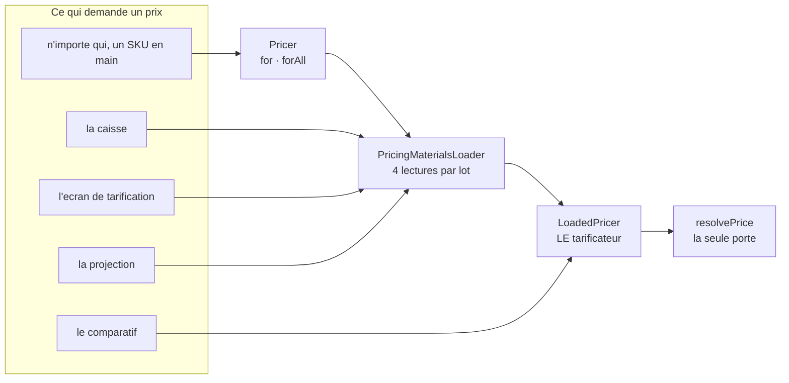
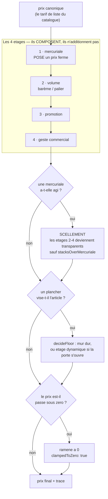
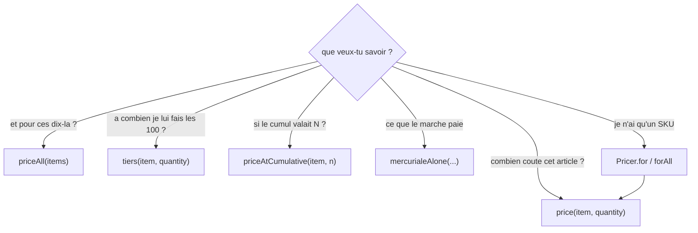
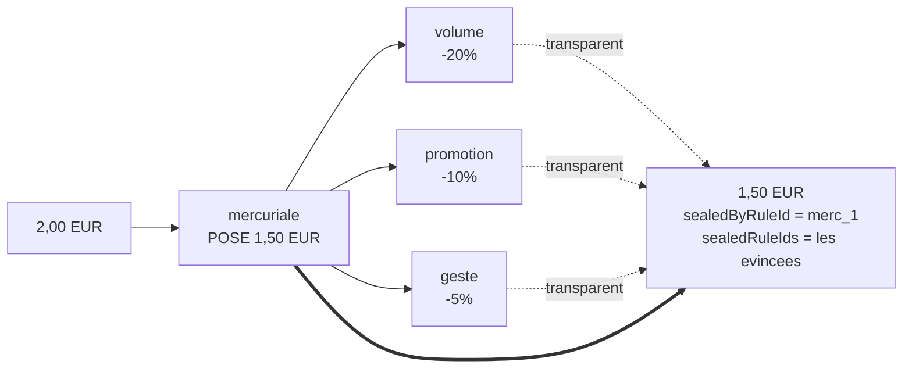
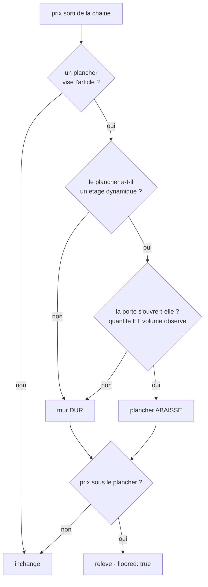

# Comment un prix se fabrique

**Écrit le 2026-09-09.** ✅ Décrit l'état réel du code.

> La référence courte. Elle répond à trois questions : **qui** fabrique un prix,
> **quoi** entre dedans, et **que se passe-t-il** dans chaque cas de figure.
>
> Pour la conception de la façade → [`architecture-pricer.md`](architecture-pricer.md).
> Pour ce qu'est une mercuriale → [`mercuriales/comprendre-une-mercuriale.md`](mercuriales/comprendre-une-mercuriale.md).

---

## 1. Un seul fabricant

**Un seul fichier appelle `resolvePrice`** — `pricing/domain/loaded-pricer.ts` —
et `lint:price-pipeline` le tient. Il y en avait cinq jusqu'au 2026-09-09, et
deux s'étaient trompées.

| Objet                    | Nature                       | Rôle                                                                                    |
| ------------------------ | ---------------------------- | --------------------------------------------------------------------------------------- |
| `Pricer`                 | Nest, `pricing/application/` | La porte pour qui n'a **qu'un SKU**. Résout le catalogue, demande le reste.             |
| `PricingMaterialsLoader` | Nest, `pricing/application/` | La **seule** séquence de lecture. Quatre requêtes par lot, quelle qu'en soit la taille. |
| `LoadedPricer`           | **pur**, `pricing/domain/`   | Matériaux en main. Porte les six gestes qu'un prix demande. Ne lit rien.                |

## 2. Ce qui entre dans un prix

Trois règles portent toute la chaîne :

- **composition, pas addition** — −20 % puis −10 % font **−28 %**, pas −30 % ;
- **un seul arrondi**, en fin de chaîne, la chaîne travaillant en rationnel ;
- **dans un étage, le plus spécifique REMPLACE** — une règle d'article évince
  celle de sa famille, elle ne s'y ajoute pas. Deux règles **également**
  spécifiques lèvent `AmbiguousPriceRulesError` : le résultat dépendrait de
  l'ordre de tri, donc du hasard.

## 3. Les cinq questions

Une question, une méthode. Ce sont des **variantes de la même question**, et
chacune écarte quelque chose **délibérément**.

| Méthode             | Ce qu'elle lit en plus                           | Ce qu'elle écarte, et pourquoi                                                                                                                                       |
| ------------------- | ------------------------------------------------ | -------------------------------------------------------------------------------------------------------------------------------------------------------------------- |
| `price`             | l'engagement du client, les mesures d'historique | —                                                                                                                                                                    |
| `priceAll`          | idem, **un seul chargement** pour N articles     | —                                                                                                                                                                    |
| `tiers`             | rejoue la résolution **à chaque seuil**          | —                                                                                                                                                                    |
| `priceAtCumulative` | rien                                             | **les preuves et les engagements** : une projection ne peut pas prouver un volume observé, et l'ouvrir sur une hypothèse accorderait une remise que rien n'a établie |
| `mercurialeAlone`   | rien (statique, sans matériaux)                  | **barème et plancher** : on mesure ce qu'une mercuriale accorde SEULE, pour la comparer à celle d'un autre client qui n'a pas les mêmes                              |

## 4. Tous les cas de figure

Sur un croissant à **2,00 €** canonique, client `cmp_1`, sauf mention contraire.

| #   | Le cas                                                      | Ce qui se passe                                                            | Prix               |
| --- | ----------------------------------------------------------- | -------------------------------------------------------------------------- | ------------------ |
| 1   | Rien ne vise l'article                                      | `steps: []`                                                                | **2,00 €**         |
| 2   | Promotion −10 %                                             | un étage, une étape dans la trace                                          | **1,80 €**         |
| 3   | Promotion −20 % **puis** geste −10 %                        | composition                                                                | **1,44 €**         |
| 4   | Deux promotions, famille et article                         | la plus spécifique gagne, l'autre part dans `supersededRuleIds`            | celle de l'article |
| 5   | Deux promotions **également** spécifiques                   | `AmbiguousPriceRulesError` (400)                                           | _refus_            |
| 6   | Barème « −20 % dès 10 » — commande de 1                     | le palier ne s'ouvre pas                                                   | **2,00 €**         |
| 7   | Le même — commande de 12                                    | le palier s'ouvre                                                          | **1,60 €**         |
| 8   | Mercuriale à 1,50 € **+** promotion −10 %                   | la mercuriale **scelle** : `sealedByRuleId`, la promo dans `sealedRuleIds` | **1,50 €**         |
| 9   | Mercuriale **+** règle `stacksOverMercuriale`               | l'exception composée par-dessus le prix ferme                              | < 1,50 €           |
| 10  | Mercuriale d'un **autre** client                            | la clause SQL ne la rend pas                                               | **2,00 €**         |
| 11  | Visiteur sans société                                       | **aucune** mercuriale n'est lue, ni engagement                             | tarif public       |
| 12  | Engagement 10 000 promis, commande de 10, palier « 5 000+ » | la **promesse** ouvre le palier dès la 1ʳᵉ commande                        | prix du palier     |
| 13  | Promotion −50 % + mur dur à 90 %                            | le plancher **relève** : `floored: true`                                   | **1,80 €**         |
| 14  | Idem + plancher dynamique, mesure absente                   | porte **fermée** — le défaut penche du côté de la maison                   | **1,80 €**         |
| 15  | Idem + mesure relevée au-dessus du seuil                    | porte **ouverte**, décision figée avec le prix                             | **1,00 €**         |
| 16  | Remise « −5 € » sur un article à 2 €                        | ramené à zéro, `clampedToZero: true`                                       | **0,00 €**         |
| 17  | SKU inconnu du catalogue                                    | `UnknownSkuError` — jamais un `null`                                       | _refus_            |
| 18  | Le même SKU demandé deux fois à `forAll`                    | `DuplicateArticleError` : 5+5 font-ils 10, ou deux demandes ?              | _refus_            |
| 19  | Lecture datée `at` sur une mercuriale expirée               | on relit le prix **de ce jour-là**                                         | prix négocié       |

### Le scellement, en une image

**Pourquoi.** Sans scellement, un compte au tarif négocié empochait AUSSI la
promotion publique — un cumul que personne n'avait décidé, qui ne se lisait nulle
part, et qui ne se découvrait qu'en comparant deux factures.

### Le plancher, en une image

⚠️ **La mesure de volume n'est lue que si un plancher la réclame.** Aucune
lecture d'historique sur un panier ordinaire — c'est la seule façon d'admettre
un plancher dynamique sur le chemin qui facture sans le ralentir pour tout le
monde.

## 5. Ce qui n'est PAS un prix d'article

| La question                                                   | Qui répond                                                                                                         |
| ------------------------------------------------------------- | ------------------------------------------------------------------------------------------------------------------ |
| « combien coûte ce **panier** ? » (acheminement, TVA, totaux) | `OrderLinePricing`                                                                                                 |
| « **pose** ce prix »                                          | les commandes de `PricingAdminModule` — le tarificateur est en **lecture seule**, et le graphe de modules le porte |

## 6. Le budget

**Quatre lectures par lot**, quelle que soit sa taille — règles, planchers,
barèmes, engagements, plus la mercuriale. Un panier de vingt lignes en faisait
soixante avant `materialsOf`.

`pricing-budget.e2e-spec.ts` et `pricer.e2e-spec.ts` comptent les **opérations
ORM**, pas les millisecondes : un chronomètre en CI mesure la machine autant que
le code, et une suite qui rougit sans raison finit désactivée.

## 7. Où ça vit

| Fichier                                               | Ce qu'il porte                                             |
| ----------------------------------------------------- | ---------------------------------------------------------- |
| `pricing/domain/loaded-pricer.ts`                     | le tarificateur — **la seule porte**                       |
| `pricing/domain/resolve-price.ts`                     | la composition des étages, le scellement, l'arrondi unique |
| `pricing/domain/resolve-floor.ts` · `floor-policy.ts` | quel plancher vise, et s'il s'ouvre                        |
| `pricing/domain/specificity.ts`                       | qui gagne un étage                                         |
| `pricing/domain/volume-tier-prices.ts`                | la grille des paliers                                      |
| `pricing/domain/volume-commitment.ts`                 | la quantité **retenue** sous engagement                    |
| `pricing/domain/entities/company-mercuriale.ts`       | la mercuriale, et sa règle dérivée par article             |
| `pricing/application/pricing-materials.loader.ts`     | la seule séquence de lecture                               |
| `pricing/application/pricer.ts`                       | la façade `for` / `forAll`                                 |
