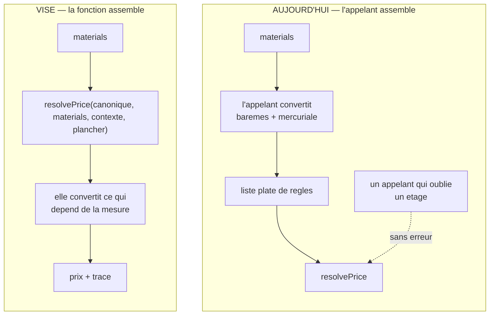

# Durcir le calcul des prix

**Écrit le 2026-09-08.** ✅ **Quatre chantiers sur cinq sont bâtis.**

> 🔴 **Relu le 2026-09-09. La note par axe ci-dessous est PÉRIMÉE**, et elle est
> conservée telle quelle : c'est la photo qui a motivé le chantier, pas l'état
> du code. Ce qui a bougé depuis :
>
> | Chantier                           | État                                                                                                                                            |
> | ---------------------------------- | ----------------------------------------------------------------------------------------------------------------------------------------------- |
> | **1** — l'assemblage               | ✅ 2026-09-09. Cinq appelants de `resolvePrice` → **un**, `lint:price-pipeline` à 1 entrée. L'axe passe de 5 à 9.                               |
> | **2** — le temps de Paris          | ✅ `lint:business-day` sur les fenêtres tarifaires. L'axe passe de 5 à 8 — 19 sites hors tarification restent (R9).                             |
> | **3** — la discipline              | ❌ Ouvert. C'est **R8** du registre.                                                                                                            |
> | **4** — les écrans qui recalculent | 🟡 **À moitié.** L'écart au tarif est dans `@lfd/money` ; la simulation du back-office rejoue toujours les paliers dans le navigateur — **R2**. |
> | **5** — la charge                  | ✅ `pricing-budget.e2e-spec.ts` compte les opérations ORM.                                                                                      |
>
> Le travail restant est dans [`ce-qui-reste-a-faire.md`](ce-qui-reste-a-faire.md).

> Ce document répond à une question posée telle quelle : **« que faudrait-il pour
> passer de 7,5 à 9 ? »**
>
> Il ne note pas la plateforme, il note **la chaîne qui fabrique un prix** — du
> tarif du référentiel jusqu'au montant écrit sur la ligne de commande, mercuriale
> comprise. Chaque manque cité a été **ouvert et vérifié** le jour où ce document
> a été écrit ; ceux qui ne l'ont pas été sont marqués comme tels.

---

## 1. La note, par axe

| Axe                  | Note | Pourquoi                                                                                                                                                                                                                                                                                        |
| -------------------- | ---- | ----------------------------------------------------------------------------------------------------------------------------------------------------------------------------------------------------------------------------------------------------------------------------------------------- |
| **La résolution**    | 9    | Pure, composée, un seul arrondi en rationnel exact, et une **trace figée** sur la commande : les étages traversés, la règle qui a scellé, celles qu'elle a évincées, la décision de plancher avec sa mesure. « Pourquoi ce prix » a une réponse six mois après, même si la règle a été retirée. |
| **Les garde-fous**   | 8    | Trois contraintes d'exclusion GiST rendent le chevauchement **impossible**, pas vérifié. Les agrégats refusent ce qu'aucune règle isolée ne voyait.                                                                                                                                             |
| **Les unités**       | 9    | Millicentimes pour un prix unitaire, centimes pour un montant, jamais de flottant, une porte CI.                                                                                                                                                                                                |
| **L'assemblage**     | 5    | 🔴 **Cinq appelants** de `resolvePrice` assemblent chacun leur matériau. Un défaut **ouvert et mesuré** en découle.                                                                                                                                                                             |
| **Le temps**         | 5    | Les fenêtres tarifaires se construisent à **minuit UTC**.                                                                                                                                                                                                                                       |
| **La documentation** | 8    | Elle dit ce qui est faux et le date — mais elle a périmé plusieurs fois, et une justification fausse a été trouvée le jour même.                                                                                                                                                                |

**7,5 de moyenne**, et la moyenne ment un peu : deux axes tirent tout le reste
vers le bas, et ce sont les deux qui décident si un écran peut contredire une
facture.

## 2. Ce que « 9 » veut dire

Pas « zéro défaut ». **Trois propriétés, dont deux manquent aujourd'hui.**

1. **Aucun écran ne peut annoncer un prix que la caisse ne facturerait pas.** Pas
   « ne le fait plus » : **ne le peut plus**. Aujourd'hui, un écran le fait.
2. **Une fenêtre tarifaire s'ouvre à l'heure qu'un commercial a en tête.**
3. **Ce qui est tenu par de la discipline est tenu par autre chose**, partout où
   la conversion est possible.

Le reste — la charge, la trace, la documentation — se mesure et s'entretient ; ça
ne fait pas passer de 7,5 à 9, ça empêche de redescendre.

---

## 3. 🔴 Chantier 1 — l'assemblage, et le défaut qu'il produit

**Le fait.** `resolvePrice` prend une **liste plate de règles**, et **cinq
appelants** la construisent chacun de leur côté (vérifié : cinq sites hors
tests). Le patron `*AsRule` — celui du barème de volume, puis de la mercuriale —
évite de toucher le pipeline, mais il **déplace la charge sur chaque appelant**.

**Ce que ça coûte, mesuré.** Sur un article dont un barème s'ouvre dès la
première pièce :

| Chemin                                         | Abricotin, quantité 1 |
| ---------------------------------------------- | --------------------- |
| `GET /admin/pricing` — l'écran de tarification | **1,83924 €**         |
| `POST /shop/quote` — ce que la caisse facture  | **1,65532 €**         |

Exactement −10 % d'écart, et il porte un nom : `board-item.ts` reçoit les barèmes
en paramètre et ne les passe pas à `resolvePrice`. Le défaut est
[consigné](../todos/todo-ecran-tarification-ignore-les-baremes.md) et **ouvert**.
Il se lit sur le seul écran qu'un commercial regarde avant d'accorder un prix.

**Pourquoi une « fonction d'assemblage unique » ne suffit pas.** Elle a été
proposée, et contredite : deux appelants ont besoin de la liste **non
assemblée**. `price-line` passe à `volumeTierPrices` les règles **sans** les
barèmes, parce que celui-ci les reconvertit à chaque palier qu'il sonde — deux
règles de même identifiant à un étage rendaient la résolution ambiguë, et
c'était **un 400 sur une commande de 20**.

**Ce qui le ferme.** Déplacer l'assemblage **dans** la fonction pure.

L'omission n'existe que **parce que la conversion est dehors**. Dedans, elle
devient inexprimable — et le cas particulier de `volumeTierPrices` disparaît
avec : sondant un palier, il rappellerait la fonction avec le même matériau et un
contexte à cette quantité-là, chaque conversion se faisant à la bonne mesure.

**Comment on sait que c'est fermé.** Un test qui résout **le même article, le
même client, la même quantité** par les deux chemins et exige l'égalité. Il
échoue aujourd'hui.

**Ce que ça ne ferme pas.** Le benchmark, qui résout **une règle seule et sans
plancher** — c'est délibéré, il mesure un prix de marché. Il restera un appelant
à part, et il faut l'écrire plutôt que de le découvrir.

⚠️ Ce chantier touche l'argent : plan écrit et `vitruve` avant toute ligne. Les
deux versions précédentes du plan de la mercuriale sont mortes exactement là.

## 4. Chantier 2 — le temps de Paris

**Le fait.** Les fenêtres de validité se construisent à **minuit UTC** dans les
écrans de tarification. « À partir du 1er janvier » ouvre donc à 01 h 00 ou
02 h 00 selon la saison.

**Correction utile :** `contracts/src/paris-time.ts` **n'est pas inutilisé** —
`growth` et les heures limites de commande s'en servent. Il n'est pas utilisé
**par la tarification**. La brique existe, elle a des appelants, elle a été
éprouvée ailleurs.

**Ce que ça coûte.** Une à deux heures pendant lesquelles un client paie le prix
d'avant. Silencieux : rien ne rougit, et la trace figée dira la vérité — le prix
appliqué était bien celui de la règle en vigueur à cet instant-là.

**Ce qui le ferme.** Construire les bornes par `localToInstant` des deux côtés —
la pose depuis une fiche et la barre de pose d'un gabarit.

⚠️ **Les fenêtres déjà posées ne se corrigent pas en silence.** Décaler une borne
d'une tarification en cours change ce qu'un client paie à un instant donné.
C'est une **migration de données**, à traiter comme telle — ou à ne pas faire, et
à dire pourquoi.

**Comment on sait que c'est fermé.** Un e2e qui pose « à partir du 1er janvier »
et « à partir du 1er juillet », et vérifie les deux instants. Un seul des deux
suffit à passer aujourd'hui — c'est ce qui rend le défaut invisible.

## 5. Chantier 3 — ce qui n'est tenu que par de la discipline

**Le fait.** `lint:cross-schema-join` lit les schémas dans le `datasource` et
attrape le SQL **écrit à la main**. `lint:context-boundaries` lit le **graphe
d'imports**. Aucun des deux ne voit une classe de `platform/` qui interroge les
tables d'un domaine en Prisma direct — et le dépôt écrit que **c'est arrivé deux
fois**.

**Ce que ça coûte.** Rien tant que personne ne le fait. Tout le jour où
quelqu'un le fait, parce que rien ne le signale.

**Ce qui le ferme.** Une porte de plus : `prisma.<modèle>` interdit hors du
contexte propriétaire du modèle, avec une table modèle → contexte tenue à jour
par le schéma lui-même plutôt qu'à la main. C'est le geste de
`lint:cross-schema-join`, qui a cessé de recopier la liste des schémas le jour
où elle s'est révélée fausse.

**Ce que ça ne ferme pas.** La frontière reste une discipline **de découpe** :
une seule base, une seule URL, un seul client. Une jointure `b2b → pim`
marcherait. La porte la rend visible, pas impossible.

## 6. Chantier 4 — les écrans qui recalculent

**Le fait.** `ecrans-de-tarification.md` nomme ce motif et en raconte trois
occurrences ; le défaut du chantier 1 est la quatrième.

**Ce qui le ferme.** Ce qui a déjà marché deux fois aujourd'hui : sortir le
calcul dans un paquet pur que les deux côtés importent. `@lfd/money` a accueilli
l'élasticité ce matin, et l'écart au tarif se calcule déjà là où il doit.

**Comment on sait que c'est fermé.** Aucun `Math.round` sur un prix dans un
composant Angular.

## 7. Chantier 5 — la charge, jamais mesurée

**Le fait.** Aucune mesure. La pose n'est plus un risque — elle est passée de
quatre-vingt-douze écritures à une —, mais **les lectures n'ont jamais été
éprouvées** : l'écran de tarification résout quatre-vingt-quatorze articles
contre toutes les règles vivantes, et le coût suit le **produit** articles ×
règles.

**Ce qui le ferme.** Un budget chiffré sur `GET /admin/pricing` et
`POST /shop/quote`, sur un jeu de données réaliste, et une porte qui échoue si
le budget est dépassé. Pas un graphique : un seuil.

**Non vérifié**, et à mesurer avant de décider quoi que ce soit : le comportement
d'Accelerate en production sur ces deux lectures.

## 8. Ce qui périme — les affirmations datées

**Le fait.** Le 2026-09-08, un JSDoc affirmait qu'une mercuriale « peut être
posée en `alter` », et s'en servait pour **justifier** le passage du benchmark
par `resolvePrice`. C'était faux depuis le premier commit qui a permis d'écrire
une règle. Une justification fausse ne vieillit pas comme une phrase fausse :
elle fait **garder un mécanisme pour une raison qui n'existe pas**, et défendre
l'inverse le jour où quelqu'un propose de le simplifier.

**✅ Fait le 2026-09-08.** La convention est écrite au §8 de `CLAUDE.md`, dans
la section qui fait autorité sur le JSDoc : _une justification qui parle
d'ailleurs porte sa date_. Elle est réservée aux affirmations **porteuses** —
celles qui justifient de garder, d'écarter ou de dupliquer quelque chose. Dater
une description rendrait le signal illisible, ce qui est la façon habituelle de
tuer une convention.

Appliquée aux six affirmations de la chaîne des prix qui décident d'un
mécanisme : « `ladderAsRule` n'est appelé par aucun lecteur » (deux fois, aux
deux endroits qu'elle justifie), « trois appelants font varier la quantité »,
« les trois refus étaient écrits deux fois », « `paris-time` sert déjà les
créneaux », et le tableau des cinq écarts divergents.

**Ce qui n'est pas fait, et ne le sera pas par une porte.** Aucun garde-fou
mécanique ne peut vérifier qu'une phrase est vraie. Ce que la date change est
plus modeste et suffit : elle dit **jusqu'où on a regardé**, et donne au lecteur
suivant le droit de ne pas croire.

`auditeur-de-justifications` reste l'outil qui les rouvre, et il ne tourne qu'à
la demande.

## 9. Ce que je ne ferais pas

- **Fusionner l'écran de tarification et la caisse.** Ils répondent à deux
  questions — « qu'a-t-on décidé » et « que facture-t-on ». Les fondre supprimerait
  la divergence en supprimant un écran utile.
- **Remplacer les contraintes d'exclusion par des vérifications applicatives**
  parce qu'elles rendent des messages illisibles. Le pré-contrôle qui **nomme**
  ce qu'il faut clore existe déjà à côté d'elles ; c'est le bon couple.
- **Rendre `resolvePrice` asynchrone** pour qu'elle lise elle-même ses
  matériaux. Elle cesserait d'être éprouvable sans base, et c'est la seule pièce
  de la chaîne dont la valeur ne dépend pas du transport.
- **Découper les prix en microservice.** Le problème n'est pas la distance entre
  les modules, c'est le nombre d'endroits qui assemblent.

## 10. L'ordre, et pourquoi

1. **Chantier 1** — c'est le seul qui referme un défaut **ouvert**, et il pèse
   deux points à lui seul.
2. **Chantier 2** — petit, borné, et il touche ce qu'un client paie.
3. **Chantier 5** — mesurer avant que la charge décide à notre place.
4. **Chantier 3** puis **4** — ils protègent l'avenir plutôt que le présent.

Le 8 rapproche des trois premiers ; le 9 demande que le premier soit vraiment
**fermé**, pas contourné.
