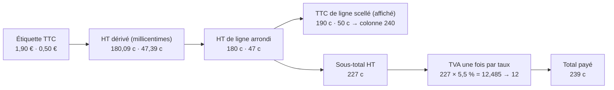

# L'écart du centime — un particulier paie 2,39 € pour 1,90 € + 0,50 €

> ❓ **Problématique ouverte, rien n'est bâti** (2026-10-09). Recherches faites
> le jour du constat ; la décision attend le cabinet comptable (§ 6). Ce
> document remplace un premier plan « TTC d'abord » écrit le même jour et
> retiré après sa relecture par `vitruve` (§ 5).

## 1. Le constat (production, 2026-10-09)

> « j'ai que deux items dans ma boutique, un croissant à 1,90 TTC et un à
> 0,50 TTC ; je paye 2,39 — je sais que c'est à cause des arrondis mais je
> peux pas montrer ça au client » — Hugo.

Le panier affiche deux lignes à 1,90 € et 0,50 € ; le total affiché, la page de
règlement et le montant encaissé par Stripe disent **2,39 €**.

## 2. D'où vient le centime (relu le 2026-10-09)

Le référentiel fait saisir une **étiquette TTC** ; le système en dérive un
**HT en millicentimes** à la lecture, au taux du contexte
([`chemin-du-prix-public.md`](chemin-du-prix-public.md)), puis applique les
promotions et paliers en HT (`resolvePrice`). Une ligne de commande ne reçoit
que ce HT (`apps/lfd-api/src/b2b/orders/domain/value-objects/order-line.ts`).

| Étape                        | Fichier                                                                                |
| ---------------------------- | -------------------------------------------------------------------------------------- |
| HT de ligne, un arrondi      | `packages/money/src/millicents.ts` (`lineTotalCents`)                                  |
| TTC de ligne scellé (public) | `order-line.ts` → `ttcCentsOf` (`packages/money/src/vat.ts`)                           |
| TVA par taux sur l'assiette  | `ventilateVat` (`vat.ts`) ← `computeOrderTotals` (`b2b/orders/domain/services/vat.ts`) |
| Devis du panier              | `b2b/orders/application/services/shop-cart-quoting.service.ts`                         |
| Montant Stripe               | `place-shop-order.handler.ts` (`order.totalCents`)                                     |
| Ce que le front affiche      | `cart-summary.ts` : les lignes TTC, puis le **total serveur** — il n'additionne rien   |

La TVA ligne à ligne vaut 10 + 3 = 13 c ; sur l'assiette, 12 c. Les lignes
disent 2,40, la commande 2,39.

⚠️ Deuxième symptôme probable : le bon de commande public additionne les
lignes TTC (`order-sheet-pdf-totals.ts`) et peut dire 2,40 quand la commande
dit 2,39 — à vérifier.

## 3. Ce n'est pas un bug, c'est une décision de 2026-09-21

[`chemin-du-prix-public.md`](chemin-du-prix-public.md) (§ « les lignes TTC ne
font pas le total ») assume cet écart : la TVA se calcule sur l'assiette par
taux, comme une facture, plutôt que par soustraction. Un test le fige
(`packages/money/src/__tests__/vat.spec.ts`). Le changer, c'est **retourner
cette décision** — la doc, le test et le JSDoc de `ttcCentsOf` avec.

## 4. Ce que dit le validateur EN 16931 (sonde du 2026-10-09)

Une facture d'exemple 1,80 + 0,47 HT, TVA 0,13, total 2,40 a été passée au
Schematron EN 16931 CII officiel du dépôt : **aucune règle de plus**. Témoin :
une TVA fausse de 8 centimes (0,20, total 2,47) passe aussi. Le validateur ne
contrôle donc pas « TVA = base × taux » : le format ne bloque pas, **ce n'est
pas une preuve fiscale**. (Sonde jetable, supprimée après usage.)

## 5. La piste « TTC d'abord », et pourquoi elle n'est pas prête

La piste : pour un particulier, total = Σ des montants TTC affichés ; TVA
extraite « en dedans » par taux (`TVA = TTC × taux / (100 + taux)`, HT = TTC −
TVA). Sur l'exemple : TTC 240 → TVA 13, HT 227, total **2,40**.

Relue par `vitruve` le 2026-10-09 — objections bloquantes :

1. **Le « TTC exact » n'existe pas toujours.** Dès qu'une promotion ou un
   palier agit, le prix passe en HT : il n'y a plus d'étiquette TTC à
   multiplier. Il faut choisir : TTC d'une pièce arrondi × quantité (l'erreur
   × q que redoute `order-line.ts`), ou TTC de la ligne entière.
2. **Les gardes de la commande** (remise, surtaxe, livraison :
   `order.ts`, `order-amount-guards.ts`) se calculent sur Σ HT des lignes ; en
   dedans, HT(taux) ≠ Σ HT des lignes en général.
3. **Les remises en pourcentage** : sur le TTC ou sur le HT ? C'est une règle
   commerciale qui change de montant, pas une conversion.

Et sérieuses : une douzaine d'appelants (`cart-adjustments.service.ts`,
`cycle-statement.ts`, `voucher-total-effect.ts`, contrats `shop-quote.ts`,
`cart-adjustment.ts`, `order.ts`, `shop-catalogue.ts`, deux écrans du
back-office) ; la livraison « suit la marchandise » proratisée sur le HT ; un
discriminant de clientèle à faire circuler jusqu'à `place-order` (et le pro
qui commande en perso) ; **aucun marqueur de méthode** sur la commande — les
mêmes colonnes porteraient un HT exact (pro) ou résiduel (particulier), sans
retour possible pour les commandes passées.

## 6. La question au cabinet

> Pour une vente à un **particulier** affichée **TTC**, peut-on calculer la TVA
> **« en dedans »**, par taux, sur le total TTC de la commande
> (`TVA = TTC × taux / (100 + taux)`, HT = TTC − TVA) — de sorte que le client
> paie exactement la somme des prix affichés ? Et une facture émise à sa
> demande peut-elle présenter des lignes TTC et un récapitulatif par taux
> (HT, TVA, TTC) où `HT × taux` diffère d'un centime de la TVA ?

## 7. En attendant

- **Rien ne change dans le calcul.**
- **Des prix qui tombent juste** : l'écart naît des étiquettes dont le HT ne
  tombe pas rond. Une liste des prix du catalogue qui produisent un écart en
  combinaison peut être sortie pour les ajuster de quelques centimes.

## 8. Ce qu'il faudra trancher avant de bâtir (si le cabinet dit oui)

1. Retourner la décision du 2026-09-21 (§ 3).
2. Quel TTC pour une ligne quand une promotion ou un palier agit (§ 5.1).
3. L'assiette des remises en pourcentage pour un particulier (§ 5.3).
4. Le sort du pro qui commande en perso.
5. Un marqueur de méthode de calcul sur la commande.
