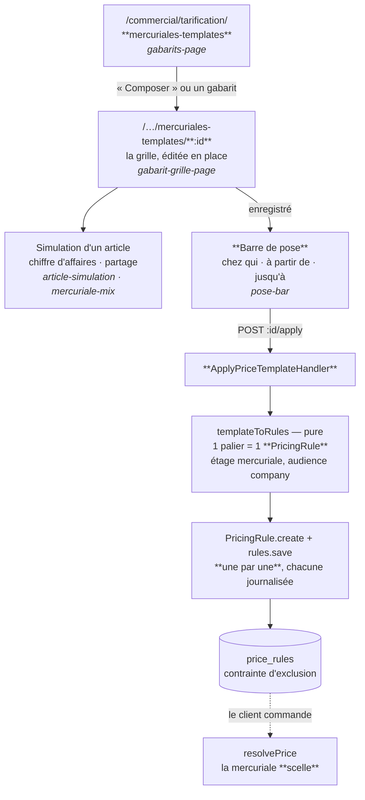

# Établir une mercuriale pour un compte client — état des lieux

**Ouvert le 2026-09-08.** 🟡 Décrit du code qui tourne, et nomme ce qui manque.

> ## ✅ 2026-09-08 (même jour) — T1 est fermé, et T3 l'est à moitié
>
> L'onglet **Tarifs** existe sur la fiche d'un compte
> (`comptes-clients/:id/tarifs`), et il ne fait pas que lire : c'est là qu'on
> **établit** la mercuriale du client. Ce que ça change au §4 :
>
> | Trou   | État                                                                                                                                                                                                      |
> | ------ | --------------------------------------------------------------------------------------------------------------------------------------------------------------------------------------------------------- |
> | **T1** | ✅ fermé. `GET /admin/pricing/companies/:id` lit le tableau **à l'audience du client**, filtre posé dans la requête. Une règle d'un tiers ne peut ni gagner un étage, ni apparaître.                      |
> | **T3** | 🟡 fermé **sur ce chemin**. Poser depuis la fiche pré-contrôle le chevauchement puis écrit en **une transaction** : rien, ou tout. La pose d'un **gabarit** écrit toujours une par une, hors transaction. |
> | **T2** | ✗ inchangé, et c'est délibéré. La mercuriale reste **reconstituée** à la lecture par `(libellé, fenêtre)` — `posed-mercuriales.ts` porte la limite, et un test l'éprouve.                                 |
> | **T6** | ✅ sans objet ici : la fiche EST le client, il n'y a plus de liste à présélectionner.                                                                                                                     |
> | **T7** | ✗ inchangé — cet écran fabrique lui aussi ses bornes en minuit **UTC**.                                                                                                                                   |
>
> Deux décisions prises avec Hugo, qui expliquent la forme :
>
> - **on ne borne pas l'ancienne mercuriale automatiquement.** Un chevauchement
>   est refusé, en **nommant** celle qui tourne ; la sortie est de la clore, et
>   clore **archive** ses règles (ce qui rend leur place dans la contrainte
>   d'exclusion — la condition pour reposer sur la même période) ;
> - **prix fixe uniquement, séparé à la racine.** Le contrat de cet écran ne
>   porte pas de paliers. Les mercuriales à paliers arriveront comme une forme
>   de plus, pas comme un mode caché de celle-ci.
>
> La fenêtre y est **datée aux deux bouts**, et la fin est obligatoire — alors
> qu'un gabarit posé peut rester ouvert. Un tarif négocié sans terme est un
> tarif que personne ne rouvre.

> **Ce document ne conçoit rien.** Il répond à une seule question — _« aujourd'hui,
> qu'est-ce qui existe pour donner un tarif négocié à un client, et où ça
> s'arrête ? »_ — en n'affirmant que ce qui a été ouvert. Chaque manque du §4
> nomme le fichier où il se constate.
>
> Le moteur qui résout un prix est à côté :
> [`architecture-resolution-de-prix.md`](architecture-resolution-de-prix.md).
> Les écrans de la tarification **générale** — grille, frise, banc d'essai —
> sont dans [`ecrans-de-tarification.md`](ecrans-de-tarification.md). Ce
> document-ci ne parle que du chemin qui va d'une grille à **un client nommé**.

---

## 1. Le geste, aujourd'hui, de bout en bout

Il en existe **un seul**, et il part du gabarit, jamais du client.

**En mots, et c'est court :** on compose une grille sans client, on l'enregistre,
puis une barre en haut de l'écran demande **chez qui** et **sur quelle fenêtre**.
Le serveur la déplie en autant de règles que de paliers, toutes visant cette
société. Il n'y a pas d'autre chemin — ni depuis la fiche du client, ni depuis un
devis accepté, ni depuis un rendez-vous.

---

## 2. Ce qui existe, couche par couche

### 2.1 Le front — `commercial/tarification/`, 3 112 lignes

| Fichier                        | Ce qu'il tient                                                                                                 |
| ------------------------------ | -------------------------------------------------------------------------------------------------------------- |
| `gabarits/gabarits-page`       | la liste des gabarits d'une nature ; écart moyen au catalogue, nombre de règles que la grille posera           |
| `gabarits/template-grid.ts`    | les dérivations pures : « prix fixe » = un palier à partir de 1, écart en points de base, prix d'**entrée**    |
| `grille/gabarit-grille-page`   | **l'écran de travail** : le layout de la tarification générale, édité en place, 301 + 327 lignes               |
| `grille/draft-grid.ts`         | la grille saisie (`Map<sku, paliers>`), ce qui tombe et ce qui s'oublie au moment de partir                    |
| `grille/price-field.ts`        | un champ de prix en millicentimes — l'unité, tenue au bord                                                     |
| `grille/mercuriale-row.ts`     | une ligne dérivée : limite, marge de négoce, impact, prix final. **Les mêmes colonnes que la grille générale** |
| `pose-bar/`                    | chez qui, à partir de quand, jusqu'à quand. Elle ne pose pas : elle **demande**                                |
| `simulation/pricing-regime.ts` | les **trois régimes** sous lesquels une grille se lit : par commande, engagement signé, cumul livré            |
| `simulation/revenue-model.ts`  | le chiffre d'affaires en fonction du volume, et pourquoi « même prix » ≠ « même chiffre »                      |
| `simulation/piercing-rules.ts` | les promotions cochées « par-dessus mercuriale » — le seul mensonge que la courbe puisse dire, donc annoncé    |
| `simulation/mercuriale-mix.ts` | le partage du chiffre entre articles, sur les volumes prévus                                                   |
| `templates.service.ts`         | les cinq appels : `list`, `byId`, `benchmark`, `compose`/`revise`, `apply`                                     |

Deux natures partagent tout cet écran — `mercuriale` et `devis` —, et la nature
vient de la **route**, jamais d'un état interne. Seul `mercuriale` se pose.

### 2.2 Le back — `b2b/pricing/`

| Élément                                             | Ce qu'il garantit                                                                                                                                                    |
| --------------------------------------------------- | -------------------------------------------------------------------------------------------------------------------------------------------------------------------- |
| `domain/entities/price-template.ts`                 | l'agrégat. Il refuse **une grille qui monte**, **deux lignes sur un même SKU**, **une grille vide**. Il trie les paliers plutôt que de refuser un désordre de saisie |
| `domain/services/template-to-rules.ts`              | pure : `lines × companyId × fenêtre → PricingRuleDraft[]`. Elle n'écrit rien, et n'apprend rien au moteur                                                            |
| `application/commands/price-template.handlers.ts`   | composer/réviser, et **poser**. Chaque règle traverse `PricingRule.create` et le dépôt, une par une                                                                  |
| `application/queries/price-templates.query.ts`      | la grille **avec le tarif catalogue en regard**, lu à l'affichage et jamais figé, résolu en un lot                                                                   |
| `application/queries/mercuriale-benchmark.query.ts` | **ce que le marché paie déjà** : médiane, bornes, nombre de clients. La médiane et non la moyenne                                                                    |
| `http/admin-price-templates.controller.ts`          | `GET /` · `GET /benchmark` · `GET /:id` · `POST /` · `PUT /:id` · `POST /:id/apply`. Surface `b2b_pricing`                                                           |

### 2.3 Le contrat — `packages/contracts/src/pricing.ts`

Une grille est une **liste de paliers**, et rien d'autre : douze paliers par
ligne au plus, trois cents lignes par gabarit. Le « prix fixe » n'est pas une
seconde forme — c'est le palier unique à partir de 1. `plannedVolume` accompagne
la ligne comme hypothèse de négociation et **ne change aucun prix**.

Poser demande exactement trois choses : `companyId`, `validFrom`, `validTo`
(nullable — une mercuriale ouverte est le cas courant). **Le contenu ne se
re-choisit pas au moment de poser** : sinon la question « qu'est-ce qu'on lui a
mis, au juste ? » perdrait sa réponse unique.

### 2.4 La base

`price_templates` — les lignes en **JSON**, parce qu'une grille s'écrit entière
ou pas du tout ; une table fille aurait permis d'en poser la moitié.

`price_rules` — la mercuriale n'y est pas un objet : c'est **N lignes**, chacune
`stage='mercuriale'`, `audience_type='company'`, `min_quantity` au seuil du
palier. Leur unicité est **structurelle**, tenue par une contrainte d'exclusion
GiST sur `(stage, portée, audience, min_quantity, [valid_from, valid_to))`,
partielle `WHERE archived_at IS NULL`. Deux mercuriales concurrentes sur le même
article au même seuil pour la même période sont donc **inexprimables**, pas
surveillées.

---

## 3. Ce que le moteur en fait

Une fois posée, la mercuriale **scelle** : les étages `volume`, `promotion` et
`geste` deviennent transparents. Le prix négocié est le prix — relevé par la
limite de marge s'il passe dessous, et rien d'autre. L'unique porte de sortie est
explicite, `stacksOverMercuriale`, et l'écran de simulation la **nomme** au lieu
de faire semblant de la compter.

Les seuils, eux, se lisent sur la **quantité de la commande** — pas sur un cumul
annuel. C'est la réserve la plus lourde de tout le sujet, et elle est déjà écrite
dans `revenue-model.ts` : un client qui étale sa saison n'atteint jamais que le
palier de sa commande type. Sauf si un **engagement de volume** couvre l'article,
auquel cas le volume annoncé ouvre tous les paliers dès la première commande.

---

## 4. Ce qui manque — huit trous, du plus structurant au plus petit

### T1 — ✅ fermé le 2026-09-08 · _Aucun écran ne répondait à « que paie ce client ? »_

La fiche d'un compte porte huit onglets — tableau de bord, informations,
commandes, paniers récurrents, facturation, alertes, stats, données
(`fiche-client-shell.ts:102`). **Aucun tarif.**

Et le tableau de tarification ne saurait pas le rendre : il est lu à audience
`"all"`, en dur (`prisma-pricing-board.reader.ts:189`). Il n'existe donc, nulle
part, de vue « les prix de la société X ». La seule façon de savoir ce qu'on a
accordé à un client est de retrouver le gabarit qu'on croit lui avoir posé.

C'est le trou qui explique tous les autres : **on pose sans jamais relire.**

### T2 — 🔴 La pose est irréversible en un geste, et n'existe pas comme unité

`templateToRules` produit N règles **indépendantes**. `price_rules` ne porte
aucune colonne `template_id`. Le seul lien qui subsiste est textuel : le libellé
du gabarit recopié sur chaque règle, et la phrase `Posé par le gabarit {id}` dans
le motif du journal.

Conséquences, toutes réelles :

- **retirer** une mercuriale = archiver soixante règles une par une ;
- **renouveler** au 1ᵉʳ janvier = reposer soixante règles, après en avoir borné
  soixante ;
- **corriger** un prix accordé par erreur = trouver laquelle des soixante ;
- réviser le gabarit **ne touche pas** ce qui est posé — c'est correct et
  délibéré, mais rien à l'écran ne dit lesquels de ses clients portent l'ancienne
  version.

**Ce que le renommage a ajouté à ce trou (2026-09-08).** Renommer une mercuriale
depuis la fiche d'un compte est possible, et c'est un geste banal : corriger une
faute, poser un millésime. Il ne touche aucun prix — le libellé n'entre dans
aucune résolution. Mais comme la mercuriale n'existe **que** par le couple
(libellé, fenêtre), le nom n'est pas une étiquette à côté de l'objet : il en est
la moitié. D'où deux garde-fous qui n'auraient aucune raison d'être si la pose
portait son identifiant :

- le renommage est **transactionnel** — une mercuriale à moitié renommée se
  couperait en deux lignes à la lecture suivante ;
- un nom **déjà pris sur la même fenêtre** est refusé (`MercurialeNameTakenError`)
  — les deux mercuriales fusionneraient irréversiblement, puisque ce qui les
  distinguait était le nom.

Le second est une **perte de fonctionnalité mesurable** : rien, métier, n'interdit
à un client d'avoir deux grilles homonymes sur la même période. C'est notre
modèle de lecture qui l'interdit.

### T3 — 🟡 à moitié fermé le 2026-09-08 · _Une pose refusée à mi-parcours laisse le client à moitié tarifé_

`ApplyPriceTemplateHandler.execute` boucle `for (const draft of drafts)` et
`await rules.save(...)` — **sans transaction**. Le recouvrement, lui, est refusé
par la base.

Si le client a déjà une mercuriale sur le quarante-troisième article, les
quarante-deux premières règles sont **posées et le restent**, l'écran affiche une
erreur, et la société se retrouve avec un tarif négocié partiel que personne n'a
décidé. Le JSDoc annonce que le refus « arrêtera l'application » ; il ne dit pas
ce qu'il laisse derrière lui.

### T4 — 🟠 L'engagement de volume n'a aucun écran

`admin/pricing/commitments` expose `GET` (par société), `POST` et
`POST /:id/close`. **Zéro appelant côté front** — vérifié sur les deux Angular.

Or `pricing-regime.ts` fait de l'engagement _la_ question qui décide comment les
seuils se lisent, et le banc d'essai propose de simuler sous ce régime. Un
commercial peut donc chiffrer une offre « engagement signé », la présenter, et
n'avoir aucun moyen de la signer.

### T5 — 🟠 `PriceTemplate.archive()` est du code mort

L'agrégat sait archiver ; aucune commande, aucune route, aucun bouton ne
l'appelle. Pendant ce temps `PriceTemplatesQuery.list` filtre `archivedAt: null`.

Le filtre garde donc contre un état que rien ne peut produire, et **la liste des
gabarits ne peut que grandir** — y compris des essais et des grilles d'une saison
révolue, mêlés à celles qu'on repose.

### T6 — ✅ sans objet sur la fiche · _La barre de pose (des gabarits) présélectionne un client_

`pose-bar.ts` charge **toutes** les sociétés (`companiesService.list()`, sans
pagination ni recherche) et fait `this.companyId.set(companies[0]?.id ?? '')`.

Le premier compte de la liste est donc armé par défaut sur un geste qui accorde
un tarif. `canPose` vérifie que le champ n'est pas vide — il l'est déjà. Il n'y a
ni confirmation, ni rappel du nom du client dans le message de succès, qui dit
seulement « 60 règle(s) de mercuriale posée(s) ».

### T7 — 🟡 Les dates de fenêtre sont prises pour du temps UTC

`pose-bar.ts` fabrique `new Date(\`${validFrom}T00:00:00.000Z\`)`. Un commercial
qui saisit « à partir du 15 septembre » ouvre une mercuriale au 15 septembre
**02 h 00 heure de Paris** l'été, 01 h 00 l'hiver.

Sans effet pratique sur une fenêtre ouverte ; nuisible sur une borne haute — une
mercuriale « jusqu'au 31 décembre » cesse d'agir le 31 à 01 h 00, pas au soir du 31. Le dépôt a déjà un contrat pour ça (`contracts/src/paris-time.ts`), que cet
écran n'utilise pas.

### T8 — 🟡 Le volume prévu appartient au gabarit, pas au client

`plannedVolume` est stocké dans la grille. Un gabarit posé chez trois clients
porte **une seule** hypothèse de saison, et toute la simulation — chiffre
d'affaires, partage entre articles — décrit donc le gabarit, jamais le client
qu'on a en face.

C'est cohérent tant qu'un gabarit est un modèle. Ça cesse de l'être dès qu'on
veut chiffrer une négociation avec les volumes réels de _ce_ client — que la base
connaît pourtant (`prisma-customer-volume.reader.ts`).

---

## 5. Ce qui n'est PAS un trou

Trois choses ressemblent à des manques et sont des décisions. Les « corriger »
coûterait.

| Ce qu'on croit manquer                          | Pourquoi ça n'en est pas un                                                                                                                                 |
| ----------------------------------------------- | ----------------------------------------------------------------------------------------------------------------------------------------------------------- |
| **Amender la grille au moment de poser**        | Deux sources pour un même prix, et « qu'est-ce qu'on lui a mis ? » perdrait sa réponse unique. Le gabarit porte le contenu, la pose ne porte que la fenêtre |
| **Un mode « prix fixe »**                       | C'est le palier unique à partir de 1. Un second mode ferait deux chemins de saisie pour une seule chose stockée                                             |
| **Recopier le tarif catalogue dans le gabarit** | Il vieillirait en silence, et l'écart affiché — la seule colonne qui donne un sens aux autres — serait faux sans que rien ne le signale                     |

Et une quatrième, plus lourde : **réviser un gabarit ne touche pas les
mercuriales qu'il a produites.** C'est ce qui rend la révision sans danger — un
gabarit n'a jamais facturé, une mercuriale posée est une décision close. Le
manque n'est pas la propagation ; c'est de ne pas savoir **qui porte quoi** (T2).

---

## 6. Par quel bout prendre la suite

Rien n'est tranché ici. Mais les huit trous ne sont pas indépendants, et deux
ordres se défendent :

- **Par la lecture** — T1 d'abord. Un onglet « Tarifs » sur la fiche d'un compte
  ne demande aucune décision de modèle : le tableau existe, il lui manque une
  audience. Et il rend T2, T3 et T6 **visibles** — aujourd'hui, une pose partielle
  ou un client armé par erreur ne se constatent nulle part.
- **Par l'objet** — donner une identité à la mercuriale posée (T2), dont T3
  découle : une pose qui est un objet est une pose qui s'écrit en une
  transaction, se borne, se renouvelle et se retire d'un geste.

Le premier est petit et découvre ; le second est la vraie dette. Les faire dans
l'ordre inverse revient à concevoir l'objet sans avoir jamais regardé ce que la
pose produit.
