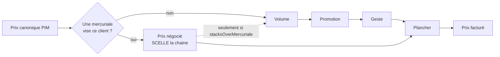

# Comprendre une mercuriale

**Écrit le 2026-09-08.** ✅ Décrit le code qui tourne.

> Le document de **définition**. Ce qu'une mercuriale est, ce qu'elle n'est pas,
> ce qu'elle refuse, et ce qu'elle ne sait pas encore faire.
>
> Pour le geste (poser, clore, renommer), voir l'onglet Tarifs d'une fiche
> client. Pour l'état du chantier, voir
> [`../etat-des-lieux-mercuriale-client.md`](../etat-des-lieux-mercuriale-client.md).
> Pour ce qui va changer, voir
> [`../plan-la-mercuriale-devient-un-objet.md`](../plan-la-mercuriale-devient-un-objet.md).

---

## 1. La définition, en une phrase

**Une mercuriale est le tarif négocié d'UN client : un prix ferme, en euros, par
article, sur une période datée, qui remplace le tarif catalogue et ferme la
chaîne des remises.**

Le mot reste en français, et c'est écrit dans les conventions du dépôt : ce n'est
ni un `priceList`, ni un `catalog`, ni un `quote`. Le traduire par approximation
ferait perdre ce qu'il dit.

## 2. Ce qui la définit techniquement — un triplet

Une mercuriale n'est pas un type de donnée. C'est la **rencontre de trois
choses**, et il faut les trois :

|              | valeur       | ce que ça décide                                              |
| ------------ | ------------ | ------------------------------------------------------------- |
| **étage**    | `mercuriale` | elle **scelle** : les étages suivants deviennent transparents |
| **audience** | `company`    | elle vise **ce client-là**                                    |
| **effet**    | `replace`    | elle **pose un prix**, elle ne modifie pas l'entrant          |

Retirer l'un des trois donne autre chose :

- même étage, audience `all` → **refusé** (§4) ;
- même audience, étage `promotion` → une remise réservée à un client, qui se
  **compose** au lieu de remplacer, et que la mercuriale du client écraserait ;
- même étage, effet `alter` → **refusé** (§4).

## 3. Les quatre étages, et pourquoi la mercuriale est le premier

Un prix se construit en quatre étages qui **se composent** — chacun s'applique au
prix sortant du précédent, donc −20 % puis −10 % font −28 %, pas −30 % :

```
prix canonique (PIM)
  → mercuriale   le tarif négocié de ce client
  → volume       le barème de quantité
  → promotion    l'opération datée, publique
  → geste        le cas particulier
  → plancher     la limite en dessous de laquelle on ne descend pas
```



**La mercuriale scelle.** Dès qu'elle pose un prix, les trois étages suivants
sont ignorés. Ce n'est pas une optimisation, c'est une décision commerciale :

> Un client au tarif négocié qui empocherait AUSSI la promotion publique
> obtiendrait deux fois une remise qu'on n'a accordée qu'une fois. Avant le
> 2026-08-18, la chaîne composait jusqu'au bout — le cumul ne se lisait nulle
> part, et ne se découvrait qu'en comparant deux factures.

### La seule porte de sortie : `stacksOverMercuriale`

Une règle des étages suivants peut porter `stacksOverMercuriale: true` : elle
agit **malgré** le scellement. C'est l'override, et le défaut est `false` —
délibérément :

> Le cumul non voulu coûte de la marge en silence ; le cumul manquant se remarque
> au premier appel.

Une mercuriale, elle, ne peut pas porter ce drapeau : c'est elle qui scelle, il
ne désignerait rien. Refusé plutôt qu'ignoré — un drapeau accepté puis sans
effet finit par être coché en croyant obtenir quelque chose.

## 4. Ce qu'une mercuriale REFUSE, et pourquoi

Trois refus, tous portés par l'agrégat `PricingRule` — donc valables pour la
pose depuis une fiche, la pose par gabarit, une saisie à la main et le seed.

### Jamais un pourcentage

`MercurialeMustPoseAPriceError`. **Le piège central du modèle.**

Une mercuriale saisie en « −13 % » **suit le tarif de liste** : le jour où le PIM
augmente, le prix négocié augmente avec lui. Ce n'est pas ce qu'on a promis au
client. Un tarif négocié est un engagement **en euros**, il se stocke en euros.

⚠️ Le symétrique est tout aussi faux, et il n'a pas besoin d'un refus parce que
personne ne peut l'écrire : **recopier le tarif catalogue** dans une mercuriale
pour « la rendre complète » le **gèlerait** pour ce client. Le jour où le
catalogue monte, il paierait encore l'ancien prix — une remise que personne n'a
accordée, et que rien n'affiche.

**Une mercuriale ne dit que ce qui a été négocié. Le silence est une
information :** les articles qu'elle ne cite pas retombent sur le tarif catalogue
et **suivent ses évolutions**.

### Jamais tout le monde

`MercurialeTargetsOneCompanyError` (2026-09-08).

Un tarif négocié se négocie avec **quelqu'un**. C'est l'audience qui en fait le
prix de ce client-là ; l'étage, lui, ne dit que le scellement.

Ce refus n'est pas une précaution théorique : c'est le croisement de deux
mécanismes justes. L'audience `all` est la plus large, et le scellement se
déclenche sur **l'étage**, jamais sur l'audience. Une mercuriale d'audience `all`
s'appliquerait donc à tout le monde **et** éteindrait toutes les promotions sur
l'article — pour tout le monde, sans qu'aucun écran ne le signale. Le prix qui
change se voit ; la promotion neutralisée, non.

`segment` est refusé pour la même raison : le scellement ne dépend pas de la
largeur de l'audience.

### Jamais cumulable par-dessus elle-même

`MercurialeCannotStackOverItselfError`. Cf. §3.

## 5. Ce que la base rend impossible

**Deux tarifs qui se chevauchent n'existent pas.** Une contrainte d'exclusion
GiST (`price_rules_no_overlap`) porte sur `(étage, portée, audience, seuil,
fenêtre)`. Ce n'est pas une vérification applicative qu'on pourrait contourner :
c'est Postgres qui refuse l'écriture.

Deux conséquences pratiques :

- **on clôt d'abord, on repose ensuite.** Clore **archive** les règles, ce qui
  rend leur place dans la contrainte — c'est la seule façon de reposer sur la
  même période ;
- **les bornes sont basse incluse, haute exclue.** Deux fenêtres qui se succèdent
  à la même date ne se chevauchent donc pas : reposer au 1er janvier ce qui
  remplace une mercuriale close au 1er janvier passe sans rien clore.

## 6. Ce qu'elle n'efface jamais

**Clore n'est pas supprimer.** Les règles sont **archivées** :

- une lecture **datée** d'avant la clôture les retrouve ;
- ce qu'elles ont facturé est **figé sur les commandes** — chaque ligne porte sa
  trace de prix (les étages traversés, la règle qui a scellé, la décision de
  plancher). Six mois plus tard, « pourquoi ce prix ? » a une réponse même si la
  règle a été retirée ;
- le journal garde le résumé de chaque acte **tel qu'il était au moment de
  l'acte**, jamais recalculé.

C'est aussi pourquoi une mercuriale posée est **en lecture seule** à l'écran :
modifier passe par clore + reposer, ce qui laisse les deux décisions visibles
côte à côte au lieu de réécrire l'explication d'une facture déjà payée.

**La seule exception est le libellé** : il ne participe à aucun calcul, il n'a
qu'un rôle, être lu. Corriger une faute de frappe ne devrait pas coûter une
décision close.

## 7. Ce qu'elle ne sait PAS faire aujourd'hui

Ces limites sont réelles et mesurées. Elles ne sont pas des bugs à corriger au
passage — chacune a sa raison ou son chantier.

### Elle n'existe pas comme objet

🔴 **La limite qui explique presque toutes les autres.** Poser une mercuriale
écrit N règles **indépendantes** dans `price_rules` — une par article et par
palier — et aucune ne sait qu'elle appartient à une mercuriale.

Ce que l'écran appelle « Mercuriale 2027 » est **reconstitué** à la lecture, en
regroupant les règles qui partagent `(libellé, fenêtre)`. C'est la seule chose
qu'elles ont en commun.

Ce que la déduction ne sait pas faire, et qu'il faut lire en le sachant :

- deux mercuriales de **même libellé sur la même fenêtre** chez le même client se
  confondent en une seule ligne ;
- une règle saisie à la main qui reprendrait par hasard le libellé et la fenêtre
  s'y rangerait aussi ;
- clore, c'est archiver N règles ; renommer, c'est en réécrire N — d'où un refus
  d'homonymie au renommage, qui n'existe que pour compenser cette absence.

C'est le trou **T2**, et le
[plan](../plan-la-mercuriale-devient-un-objet.md) le referme.

### Deux mercuriales disjointes peuvent coexister

Puisque le chevauchement est refusé **par article et par seuil**, deux
mercuriales portant sur des articles différents peuvent courir en même temps chez
le même client. C'est possible aujourd'hui ; le plan y met fin (une par client).

### Les prix ne suivent pas le fuseau de Paris

Les fenêtres sont construites à **minuit UTC**. À Paris, « à partir du 1er
janvier » ouvre donc à 01 h 00 ou 02 h 00 selon la saison. Le dépôt a un contrat
pour ça (`contracts/src/paris-time.ts`) qu'aucun écran de tarification n'utilise.
C'est le trou **T7**.

### L'écran de tarification et la caisse peuvent se contredire

🔴 Sur un article dont un **barème de volume s'ouvre dès la première pièce**,
l'écran de tarification annonce un prix et la caisse en facture un autre — l'écran
n'injecte pas les barèmes dans sa résolution. La mercuriale n'y est pour rien,
mais l'écart se lit **sur** l'onglet Tarifs d'un client. Défaut ouvert :
[`../../todos/todo-ecran-tarification-ignore-les-baremes.md`](../../todos/todo-ecran-tarification-ignore-les-baremes.md).

### Une pose par gabarit n'est pas atomique

Poser un gabarit chez un client écrit ses règles **une par une, hors
transaction** : un refus à mi-parcours laisse le client à moitié tarifé. La pose
depuis la fiche d'un compte, elle, est transactionnelle. C'est le trou **T3**, à
moitié fermé.

## 8. Les mots voisins, pour ne pas les confondre

|                               | ce que c'est                                                    | s'en distingue par                                                   |
| ----------------------------- | --------------------------------------------------------------- | -------------------------------------------------------------------- |
| **mercuriale**                | le tarif négocié d'un client                                    | scelle ; audience société ; prix ferme                               |
| **gabarit** (`PriceTemplate`) | une grille **préparée**, pour la reposer chez plusieurs clients | ne tarife personne tant qu'elle n'est pas posée                      |
| **brouillon**                 | une négociation en cours, un par société                        | **ne tarife rien** : c'est ce qui autorise à l'enregistrer incomplet |
| **barème de volume**          | un prix qui baisse avec la quantité                             | son propre objet, son propre étage ; ne scelle pas                   |
| **promotion**                 | une opération datée, publique                                   | se compose ; transparente sous une mercuriale, sauf override         |
| **plancher**                  | la limite basse d'un prix                                       | n'est pas une remise : il **relève** un prix trop bas                |

## 9. Les unités, parce que s'y tromper coûte cher

- **un prix unitaire vit en millicentimes** (10⁻⁵ €) : `173270` = 1,73270 € ;
- **un montant de panier vit en centimes** : une remise de retrait, des frais de
  zone ;
- **jamais de flottant.** `19.99 * 100_000` vaut `1998999.9999999998`.

Un export CSV de mercuriale sort donc les prix à **cinq décimales** : arrondir au
centime ferait d'un fichier envoyé au client un document qui ne correspond plus
au tarif appliqué.
