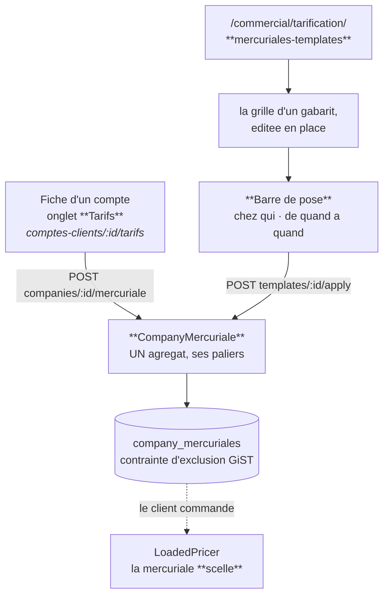

# Établir une mercuriale pour un compte client

**Ouvert le 2026-09-08, réécrit le 2026-09-09.** ✅ Décrit le code qui tourne.

> ## Ce que cette réécriture a retiré
>
> Ce document était un **état des lieux** : huit trous, du plus structurant au
> plus petit. Cinq ont été fermés en deux jours, et les garder sous forme de
> manques faisait lire comme absent ce qui existe — le pire service qu'une doc
> puisse rendre.
>
> Ce qui a été fait est donc réécrit en **affirmations**, au présent. Ce qui reste
> ouvert n'est plus décrit ici : il vit dans
> [`../ce-qui-reste-a-faire.md`](../ce-qui-reste-a-faire.md), le registre unique
> du dossier, et ce document y renvoie plutôt que de tenir une seconde liste —
> deux listes divergent, c'est ce qui a motivé le registre.
>
> Pour la **définition** — ce qu'une mercuriale est, ce qu'elle refuse :
> [`comprendre-une-mercuriale.md`](comprendre-une-mercuriale.md).

---

## 1. Deux gestes, et ils convergent

Il y en avait **un**, qui partait du gabarit et jamais du client. Il y en a
**deux**, et c'est le second qui compte : on part désormais de la fiche du compte,
là où la question se pose.

**Les deux écrivent le même objet**, et c'est le point : tant qu'ils
divergeaient, une grille refusée d'un côté passait de l'autre. Ils convergent
maintenant sur le même agrégat, donc sur le même jeu d'invariants.

La différence entre eux est ce qu'ils apportent. La fiche part d'un **client** et
compose sa grille sur place ; le gabarit part d'un **modèle** qu'on repose chez
plusieurs. Le gabarit garde ses paliers — une mercuriale à prix fixe n'est que la
grille à un seul palier, rien à convertir.

---

## 2. Ce qui existe, couche par couche

### 2.1 Le front — `commercial/tarification/` et l'onglet Tarifs

| Fichier                        | Ce qu'il tient                                                                                                 |
| ------------------------------ | -------------------------------------------------------------------------------------------------------------- |
| `comptes-clients/:id/tarifs`   | **l'écran qui répond à « que paie ce client ? »** — le tableau lu à l'audience du compte, et la pose sur place |
| `gabarits/gabarits-page`       | la liste des gabarits d'une nature ; écart moyen au catalogue                                                  |
| `gabarits/template-grid.ts`    | les dérivations pures : « prix fixe » = un palier à partir de 1, écart en points de base, prix d'**entrée**    |
| `grille/gabarit-grille-page`   | **l'écran de travail** : le layout de la tarification générale, édité en place                                 |
| `grille/draft-grid.ts`         | la grille saisie (`Map<sku, paliers>`), ce qui tombe et ce qui s'oublie au moment de partir                    |
| `grille/price-field.ts`        | un champ de prix en millicentimes — l'unité, tenue au bord                                                     |
| `grille/mercuriale-row.ts`     | une ligne dérivée : limite, marge de négoce, impact, prix final. **Les mêmes colonnes que la grille générale** |
| `pose-bar/`                    | chez qui, de quand à quand. Elle ne pose pas : elle **demande**                                                |
| `simulation/pricing-regime.ts` | les **trois régimes** sous lesquels une grille se lit : par commande, engagement signé, cumul livré            |
| `simulation/revenue-model.ts`  | le chiffre d'affaires en fonction du volume, et pourquoi « même prix » ≠ « même chiffre »                      |
| `simulation/piercing-rules.ts` | les promotions cochées « par-dessus mercuriale » — le seul mensonge que la courbe puisse dire, donc annoncé    |
| `templates.service.ts`         | `list`, `byId`, `benchmark`, `compose`/`revise`, `apply`                                                       |

Deux natures partagent cet écran — `mercuriale` et `devis` —, et la nature vient
de la **route**, jamais d'un état interne. Seul `mercuriale` se pose.

⚠️ Le dossier `simulation/` **résout un prix dans le navigateur**. C'est la
cinquième occurrence du motif que
[`../ecrans-de-tarification.md`](../ecrans-de-tarification.md) nomme, et le seul
défaut ouvert de cet écran — suivi comme **R2** au registre.

### 2.2 Le back — `b2b/pricing/`

| Élément                                               | Ce qu'il garantit                                                                                                                          |
| ----------------------------------------------------- | ------------------------------------------------------------------------------------------------------------------------------------------ |
| `domain/entities/company-mercuriale.ts`               | **l'agrégat**. `pose()`, `rename()`, `close()`, et `asRuleFor` qui dérive la règle d'un article à la mesure du contexte                    |
| `domain/entities/price-template.ts`                   | le **modèle**. Il refuse une grille qui monte, deux lignes sur un même SKU, une grille vide. Il trie les paliers plutôt que de les refuser |
| `domain/pricing-grid.ts`                              | les invariants de grille **partagés** par les deux, avec des fabriques d'erreurs injectées : chacun refuse dans son propre vocabulaire     |
| `application/commands/company-mercuriale.handlers.ts` | poser, renommer, clore — depuis la fiche                                                                                                   |
| `application/commands/price-template.handlers.ts`     | composer, réviser, et **poser un gabarit** — qui écrit le même agrégat                                                                     |
| `application/queries/mercuriale-benchmark.query.ts`   | **ce que le marché paie déjà** : médiane, bornes, nombre de clients. La médiane et non la moyenne                                          |
| `domain/ports/company-mercuriale.reader.ts`           | **trois questions distinctes** : ce qui facture, ce qui a été décidé, ce que le marché paie                                                |

### 2.3 Le contrat — `packages/contracts/src/pricing.ts`

Une grille est une **liste de paliers**, et rien d'autre : douze paliers par
ligne au plus, trois cents lignes par gabarit. Le « prix fixe » n'est pas une
seconde forme — c'est le palier unique à partir de 1. `plannedVolume` accompagne
la ligne comme hypothèse de négociation et **ne change aucun prix**.

Poser un gabarit demande exactement trois choses : `companyId`, `validFrom`,
`validTo` (nullable — une mercuriale ouverte est le cas courant). **Le contenu ne
se re-choisit pas au moment de poser** : sinon la question « qu'est-ce qu'on lui
a mis, au juste ? » perdrait sa réponse unique.

### 2.4 La base

`company_mercuriales` — **une ligne par mercuriale**, ses paliers en `jsonb`.
Elle porte son identifiant, son client en référence **opaque** (aucune clé
étrangère ne traverse), sa fenêtre et son cycle de vie complet.

Deux mercuriales ne peuvent pas se recouvrir chez un même client : une
**contrainte d'exclusion GiST** sur `(company_id, [valid_from, valid_to))`,
partielle `WHERE archived_at IS NULL`, le rend **inexprimable** — pas surveillé.

`price_templates` — les lignes en **JSON**, parce qu'une grille s'écrit entière
ou pas du tout ; une table fille aurait permis d'en poser la moitié.

---

## 3. Ce que le moteur en fait

Une fois posée, la mercuriale **scelle** : les étages `volume`, `promotion` et
`geste` deviennent transparents. Le prix négocié est le prix — relevé par la
limite de marge s'il passe dessous, et rien d'autre. L'unique porte de sortie est
explicite, `stacksOverMercuriale`, et l'écran de simulation la **nomme** au lieu
de faire semblant de la compter.

Elle entre dans le prix **en objet, jamais en règle dérivée** : c'est
`LoadedPricer` qui la présente à la mesure de chaque article, et lui seul appelle
`resolvePrice` — cf. [`../comment-un-prix-se-fabrique.md`](../comment-un-prix-se-fabrique.md).

Les seuils se lisent sur la **quantité de la commande**, pas sur un cumul annuel.
C'est la réserve la plus lourde du sujet, et elle est écrite dans
`revenue-model.ts` : un client qui étale sa saison n'atteint que le palier de sa
commande type. Sauf si un **engagement de volume** couvre l'article, auquel cas
le volume annoncé ouvre les paliers dès la première commande.

---

## 4. Ce que les cinq fermetures ont établi

Chacune est ici sous la forme qui compte : **ce qui est vrai maintenant**.

| Ce qui manquait                                     | Ce qui est vrai depuis                                                                                                                                                                            |
| --------------------------------------------------- | ------------------------------------------------------------------------------------------------------------------------------------------------------------------------------------------------- |
| Aucun écran ne disait ce qu'un client paie          | **2026-09-08.** `GET /admin/pricing/companies/:id` lit le tableau **à l'audience du client**, filtre posé dans la requête. Une règle d'un tiers ne peut ni gagner un étage, ni apparaître.        |
| La pose n'existait pas comme unité                  | **2026-09-08.** Une mercuriale est **un agrégat et une ligne**. Elle se clôt, se renomme et se relit d'un geste, par son identifiant — plus par le couple (libellé, fenêtre).                     |
| Une pose refusée laissait le client à moitié tarifé | **2026-09-08**, et **sans transaction** : une mercuriale est une ligne, donc **atomique par construction**. C'est la bonne façon de fermer ce trou — la transaction n'aurait été qu'un pansement. |
| La barre de pose armait un client par défaut        | **Sans objet.** Sur la fiche, le client EST la page ; il n'y a plus de présélection à se tromper.                                                                                                 |
| Les fenêtres s'ouvraient à minuit UTC               | **2026-09-08.** Elles passent par `businessDayStart`, et `lint:business-day` tient la ligne sur les quatre dossiers de tarification.                                                              |

### Deux traces que ces fermetures ont laissées

Ni l'une ni l'autre ne fausse quoi que ce soit ; les nommer évite qu'on les prenne
pour des mécanismes vivants.

- **`MercurialeNameTakenError` n'est levée nulle part.** Elle refusait un nom déjà
  pris sur la même fenêtre, parce qu'une mercuriale se recollait par
  (libellé, fenêtre) et que deux homonymes auraient fusionné. Son propre JSDoc
  annonçait sa fin : « le jour où la pose portera son propre identifiant, ce refus
  n'aura plus de raison d'être ». Ce jour est passé. **Rien, métier, n'interdit
  plus à un client d'avoir deux grilles homonymes** — c'était notre modèle de
  lecture qui l'interdisait.
- **`templateToRules` n'existe plus** ; seuls des commentaires la citent encore
  comme référence historique.

---

## 5. Ce qui reste ouvert

Trois choses, et elles sont suivies au registre — pas ici.

| Le fait                                                                                | Au registre |
| -------------------------------------------------------------------------------------- | ----------- |
| L'engagement de volume a ses routes et **aucun écran**                                 | **R6**      |
| `PriceTemplate.archive()` est du code mort ; la liste des gabarits ne peut que grandir | **R10**     |
| Le volume prévu appartient au **gabarit**, pas au client                               | **R11**     |
| La simulation résout un prix **dans le navigateur**                                    | **R2**      |

---

## 6. Ce qui n'est PAS un trou

Quatre choses ressemblent à des manques et sont des décisions. Les « corriger »
coûterait.

| Ce qu'on croit manquer                          | Pourquoi ça n'en est pas un                                                                                                                                 |
| ----------------------------------------------- | ----------------------------------------------------------------------------------------------------------------------------------------------------------- |
| **Amender la grille au moment de poser**        | Deux sources pour un même prix, et « qu'est-ce qu'on lui a mis ? » perdrait sa réponse unique. Le gabarit porte le contenu, la pose ne porte que la fenêtre |
| **Un mode « prix fixe »**                       | C'est le palier unique à partir de 1. Un second mode ferait deux chemins de saisie pour une seule chose stockée                                             |
| **Recopier le tarif catalogue dans le gabarit** | Il vieillirait en silence, et l'écart affiché — la seule colonne qui donne un sens aux autres — serait faux sans que rien ne le signale                     |
| **Propager une révision de gabarit**            | C'est ce qui rend la révision sans danger : un gabarit n'a jamais facturé, une mercuriale posée est une **décision close**                                  |

La quatrième portait autrefois une réserve — « le manque n'est pas la
propagation, c'est de ne pas savoir qui porte quoi ». Elle est levée : la
mercuriale porte son identifiant, et l'onglet Tarifs dit ce que chaque client
porte.
