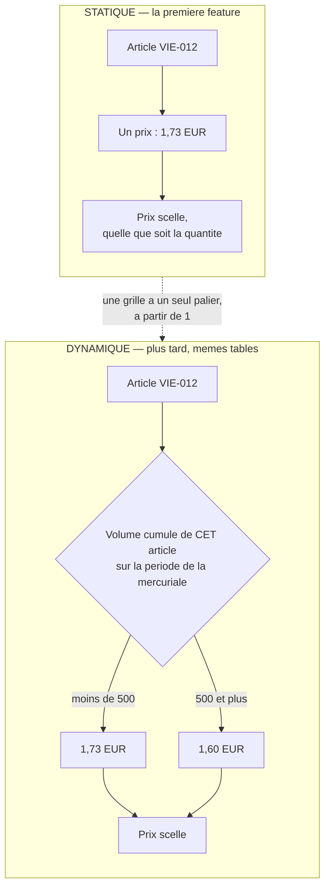

# La mercuriale devient un objet

**Plan v3, réécrit le 2026-09-08.** 🟢 **Livré le 2026-09-08.**

> 🔴 **Cet en-tête disait « rien n'est bâti sauf le lot 1 » jusqu'au 2026-09-09.**
> Les cinq lots sont dans le code : l'agrégat, la migration avec sa reprise, les
> lecteurs, l'écran, et la bascule du prix. Le corps du plan est conservé tel
> qu'il a été écrit — c'est le raisonnement qui vaut, et notamment les **deux
> versions contredites** avant celle-ci.
>
> Pour l'état réel : [`comprendre-une-mercuriale.md`](comprendre-une-mercuriale.md).

> **Décision de Hugo, 2026-09-08 :** une mercuriale se prend **en bloc**. On la
> pose entière, on la clôt entière ; si un prix est faux, on assume et on
> repose. Une ligne n'a pas de cycle de vie propre.
>
> **Deux versions ont été contredites avant celle-ci.** Ce qui est mort, et
> pourquoi, parce que c'est la seule façon que ça ne revienne pas :
>
> - **v1** — modélisait une ligne comme UN PRIX. C'est une liste de paliers, et
>   le contrat sert déjà `minQuantity`. Promettait aussi « une fonction
>   d'assemblage unique » que deux appelants ne peuvent pas prendre.
> - **v2** — plaçait la conversion dans les **lecteurs**. Impossible : un
>   lecteur ne connaît pas la quantité, donc ne peut pas choisir un palier
>   (§3). Le précédent qu'elle invoquait — `ladderAsRule` — dit **l'inverse** de
>   sa thèse : il n'est jamais appelé par un lecteur.
>
> La v3 ne cherche plus de couture unique. Elle copie ce que le barème fait
> déjà, et traite les quatre chemins que les deux premières ignoraient.

---

## 1. Le fait

Poser une mercuriale écrit **N lignes indépendantes** dans `price_rules`, et
aucune ne sait qu'elle appartient à une mercuriale. N vaut le nombre d'articles
**fois le nombre de paliers** : la pose depuis la fiche force un palier unique
(`company-mercuriale.handlers.ts`, JSDoc de `execute`), la pose par gabarit non
— _« un gabarit de trente lignes à deux paliers en pose soixante »_.

Ce que l'écran appelait « 2027 » n'existait pas : le regroupement le
**reconstitue** en regroupant les règles qui partagent `(validFrom, validTo,
label)`.

|                   | aujourd'hui                                                    |
| ----------------- | -------------------------------------------------------------- |
| poser (fiche)     | N sauvegardes + N actes, dans **une** transaction              |
| poser (gabarit)   | N sauvegardes + N actes, **sans transaction** — c'est T3       |
| poser (à la main) | une règle isolée, cf. §2                                       |
| clore             | archiver N lignes                                              |
| renommer          | réécrire N lignes, sous transaction, + un refus d'homonymie    |
| lire              | déduire, avec deux cas que la déduction ne sait pas distinguer |

## 2. Statique et dynamique — la distinction qui commande tout le reste

**Décision de Hugo, 2026-09-08 : le statique est la première feature.** Le
dynamique est décrit ici pour que le modèle l'accueille sans migration, pas
pour être bâti maintenant.



### Ce que la distinction change, et c'est tout le §4

|                                | statique     | dynamique                             |
| ------------------------------ | ------------ | ------------------------------------- |
| la ligne                       | un prix      | des paliers                           |
| il faut connaître…             | rien d'autre | **une mesure de volume**              |
| un lecteur peut-il convertir ? | **oui**      | **non** — il ne connaît pas la mesure |

C'est la seule raison pour laquelle la v2 est morte. En statique, sa couture par
les lecteurs **fonctionnait**.

🔴 **Et c'est pourquoi on ne la reprend pas quand même.** Le jour où le
dynamique arrive, une conversion faite dans le lecteur ne casse pas : elle
**ment**. Elle rend le palier de la quantité 1 pour toute la courbe, et une
courbe plate se lit comme une réponse. Payer la conversion chez les appelants
maintenant coûte quelques lignes ; la payer plus tard coûte un prix faux chez
les clients qui ont négocié — et personne ne le verrait.

### Le statique n'est pas un sous-ensemble bricolé

Une mercuriale statique **est** la grille à un seul palier, à partir de 1. Rien
dans l'agrégat ne l'en distingue, et c'est ce qu'on veut : deux chemins de
saisie, une seule chose stockée. C'est déjà le choix de `PriceTemplate`, et
c'est déjà ce que la pose depuis une fiche fait aujourd'hui.

**Le statique est donc une décision d'ÉCRAN et de CONTRAT, pas de modèle.**
L'onglet Tarifs d'une fiche pose un prix par article, point ; le gabarit, lui,
continue de porter ses paliers. Le dynamique n'arrivera pas par une migration,
il arrivera par une forme de plus dans le contrat.

### La mesure du dynamique, quand il viendra

Le palier ne se lit **pas** sur la quantité de la commande, mais sur le
**volume cumulé de l'article sur la période de la mercuriale** — sans quoi un
client qui commande 500 pièces en dix fois n'atteindrait jamais son propre
palier.

La machinerie existe : `applies` mesure les `CONTRACT_STAGES` — `mercuriale` et
`volume` — sur `volumeQuantityOf(context)`, c'est-à-dire
`cumulativeQuantity ?? quantity`. Et `price-rule.ts` porte déjà l'avertissement
qui va avec : _« sans engagement, les paliers d'une mercuriale se lisent sur la
commande »_. C'est exactement le trou que cette mesure comble.

🔴 **Le piège du premier palier, trouvé par Hugo avant d'être bâti.**

Le premier palier d'une mercuriale est à **1**, jamais à 0 — et ce n'est pas un
choix esthétique : `minQuantity` est un seuil sur une mesure, et un seuil à 0 ne
dit rien, tout étant supérieur ou égal à 0. Le contrat l'interdit d'ailleurs
(`z.number().int().positive()`), comme `VolumeTier`.

**En statique, ça marche partout, et c'est vérifié** : les quatre chemins qui
affichent un prix résolvent à la quantité **1** — le tableau général
(`board-category.ts:77`), la projection, l'onglet Tarifs
(`company-pricing.query.ts:120`) et la vitrine au prix du client
(`read-my-shop-catalogue.ts:83`). `applies` teste `measured >= minQuantity`, donc
`1 >= 1` passe.

**En dynamique, la même construction se retourne.** Si la mesure devient le
volume cumulé sur la période, un client **qui n'a encore rien commandé** est à
**0** — et `0 >= 1` est faux. Il perdrait son tarif négocié **sur sa première
commande**, c'est-à-dire exactement au moment où on vient de le lui accorder.

Aujourd'hui le cas ne peut pas se produire : sans engagement, la mesure vaut
`null` et `volumeQuantityOf` retombe sur la quantité de la commande. Le piège
naît le jour où l'on remplace ce `null` par un vrai zéro.

**La règle à tenir quand le dynamique arrivera :** la mesure d'un cumul absent
est `null`, jamais `0`. Un client sans historique se lit alors sur sa commande,
et son premier palier s'applique. Écrit ici parce que c'est le genre de
décision qu'on prend par défaut en écrivant un `?? 0` — et qu'on ne retrouve
plus ensuite.

⚠️ Ce qui reste à établir le jour venu, et qui n'est pas acquis : la fenêtre du
cumul. Aujourd'hui elle vient d'un `VolumeCommitment`, qui a **sa propre**
période. Le dynamique demande qu'elle soit celle de la mercuriale. Les deux
peuvent coïncider ; rien ne le garantit.

## 3. 🔴 Lot 0 — fermer le troisième chemin de pose, AVANT tout le reste

`authoredPriceStageSchema` (`packages/contracts/src/pricing.ts:58`) inclut
`mercuriale` : `POST /admin/pricing/rules` accepte donc une mercuriale saisie à
la main, et `admin-pricing.e2e-spec.ts` l'exerce.

**Après la bascule, ce chemin fabrique un 400 sur une commande.** Une règle
mercuriale saisie à la main vivrait dans `price_rules` pendant que la grille du
même client vivrait dans `company_mercuriales` — et **aucune contrainte ne voit
les deux**. À portée, audience et seuil égaux, `winnerOf` lève
`AmbiguousPriceRulesError` (`specificity.ts`), c'est-à-dire un refus au
paiement.

C'est le mode de panne exact que le **barème** a fermé, et son geste est écrit
dans `pricing-rule.ts` : l'étage `volume` n'est pas refusé, il est
**inexprimable** — le brouillon ne l'accepte pas dans son type, et le fil est
fermé par le schéma. La v2 invoquait ce précédent sans en reprendre le geste.

**Donc : retirer `mercuriale` de la saisie de règle à la main.**

⚠️ Nuance à ne pas rater : `AuthoredPriceStage` sert **deux** choses — le
schéma de fil ET le type du brouillon (`PricingRuleDraft.stage`), que
`templateToRules` remplit avec `"mercuriale"`. Rétrécir l'enum casserait la
pose par gabarit. Il faut donc un enum **plus étroit pour la route HTTP** que
pour le brouillon, tant que le gabarit écrit encore des règles.

Ce lot est **indépendant et immédiat** : il ferme un 400 futur, il rétrécit le
chantier, et il ne dépend d'aucune décision de modèle. Un e2e existant devra
passer de 201 à 400 — c'est la preuve, pas un dommage.

## 4. Le modèle

```prisma
model CompanyMercuriale {
  id String @id                       // ULID — deux mercuriales successives coexistent
  companyId String @map("company_id") // identifiant OPAQUE, aucune clé étrangère

  label String

  /// La grille : `[{ sku, tiers: [{ minQuantity, unitPriceMillicents }] }]`.
  /// Des PALIERS, pas un prix : une ligne de gabarit en est une liste, et le
  /// contrat sert déjà `PosedMercurialeLineView.minQuantity`, jusqu'au CSV.
  /// En JSON pour la raison écrite sur `VolumeLadder.tiers` : une grille
  /// s'écrit entière ou pas du tout.
  lines Json

  validFrom DateTime  @map("valid_from") @db.Timestamptz(3)
  validTo   DateTime? @map("valid_to")   @db.Timestamptz(3)

  createdBy String   @map("created_by")

  /// Le cycle de vie, copié sur la TABLE `volume_ladders` — et il porte bien
  /// `archived_at`, dont la contrainte ci-dessous dépend.
  pausedAt      DateTime? @map("paused_at")   @db.Timestamptz(3)
  pausedBy      String?   @map("paused_by")
  archivedAt    DateTime? @map("archived_at") @db.Timestamptz(3)
  archivedBy    String?   @map("archived_by")
  archiveReason String?   @map("archive_reason")
}
```

L'agrégat correspondant est **déjà bâti** (`cb088368`) : `CompanyMercuriale`,
ses trois refus de grille, `pose` / `rename` / `close`. Il survit à la
réécriture de la §4 — la forme de la grille est fixée par le contrat, pas par
la couture.

`Timestamptz` obligatoire : sans fuseau, `tstzrange()` n'est pas `IMMUTABLE`,
donc ne peut pas entrer dans une contrainte d'exclusion.

### La contrainte, et le seul engagement irréversible

```sql
ALTER TABLE "company_mercuriales"
  ADD CONSTRAINT "company_mercuriales_no_overlap"
  EXCLUDE USING gist (
    "company_id" WITH =,
    tstzrange("valid_from", "valid_to", '[)') WITH &&
  )
  WHERE ("archived_at" IS NULL);
```

🔴 Aujourd'hui le chevauchement est refusé **par article et par seuil**, et le
pré-contrôle de la pose ne regarde que les SKU de la nouvelle grille. Deux
mercuriales peuvent donc coexister sur la même fenêtre chez un client si elles
portent sur des articles disjoints — un e2e le construit et attend deux `201`.

Sous ce modèle : **une mercuriale en cours par client, point.** Validé par Hugo.

⚠️ **Le pré-contrôle applicatif RESTE.** La contrainte ne produit qu'un `23P01`,
et aucun mapping de ce code n'existe dans le dépôt. Le refus qui nomme la
mercuriale en cours (`RunningMercurialeError`) est ce qui rend praticable « on
clôt d'abord » ; le remplacer par une erreur technique violerait le §0 du
`CLAUDE.md` — un refus doit nommer le cas réel et le geste de sortie. La
contrainte couvre la **course** entre deux commerciaux, pas le message.

## 5. Le branchement — la conversion vit chez les APPELANTS

### Pourquoi pas dans le lecteur (l'erreur de la v2)

**Un prix dépend de la quantité, et le lecteur ne la connaît pas.**

`PriceRuleReader` n'a qu'une méthode abstraite, `inScopes(scopes:
PricingScopes)`, et `PricingScopes` ne porte **ni `quantity` ni
`cumulativeQuantity`** — délibérément : _« ce que le WHERE sélectionne ne dépend
que de la fenêtre et de l'audience »_, une requête pour tout le panier au lieu
d'une par article. Un adaptateur ne peut donc pas choisir un palier.

Et même en lui donnant un contexte, la conversion à la lecture **figerait** le
palier pour trois appelants qui font varier la quantité sur les **mêmes**
candidats :

- `price-projection.query.ts:64-69` charge une fois à la quantité 1, puis résout
  à N quantités en reconvertissant les barèmes à chaque point. Une mercuriale
  figée rendrait la courbe d'un client à paliers **plate** ;
- `volume-tier-prices.ts` sonde chaque palier avec `atQuantity` ;
- `board-item.ts` résout à une quantité de référence.

**Le barème a tranché ça dans l'autre sens**, et c'est vérifiable : `ladderAsRule`
n'est appelé par **aucun** lecteur. Le port rend l'objet `VolumeLadder` ; les
quatre appelants convertissent chacun, au moment où ils connaissent la quantité.

### Ce qu'on copie

**Les matériaux portent l'objet.** `PricingMaterials` gagne la mercuriale, à
côté des règles, planchers, barèmes et engagements :

```ts
export interface PricingMaterials {
  readonly rules: ScopeIndex<PriceRule>;
  readonly floors: ScopeIndex<ScopedPriceFloor>;
  readonly ladders: ScopeIndex<VolumeLadder>;
  readonly commitments: readonly VolumeCommitment[];
  /** La mercuriale en cours de ce client, ou `null`. Au plus une — cf. §3. */
  readonly mercuriale: CompanyMercuriale | null;
}
```

**Et un convertisseur, à côté de `rulesFor` / `laddersFor` :**

```ts
/**
 * La mercuriale vue comme la règle de son étage POUR CET ARTICLE À CETTE
 * MESURE. `null` si elle ne porte pas l'article, ou si la mesure n'atteint
 * aucun palier — l'étage est alors transparent.
 */
export function mercurialeFor(
  materials: PricingMaterials,
  context: PricingContext,
): PriceRule | null;
```

**Ce que ça rend impossible, et ce que ça ne rend pas impossible** — la
distinction compte, la v2 mentait dessus :

- **oublier de CHARGER** la mercuriale devient une erreur de compilation :
  `materialsOf` prend un champ de plus, donc tous ses sites de construction
  doivent le fournir ;
- **oublier de CONVERTIR** reste possible. Aucune couture ne l'empêche — c'est
  vrai du barème aussi, et c'est exactement le défaut ouvert de `board-item.ts`.
  Ce qui le referme n'est pas une astuce de structure, c'est le **lot 0** : plus
  aucun autre chemin ne produit de mercuriale, donc il n'y a plus qu'un endroit
  où l'oubli est possible, et un test par appelant.

🔴 **`rulesFor` n'injecte PAS la mercuriale automatiquement**, et c'est
délibéré : `price-line.ts` passe à `volumeTierPrices` les règles **sans** les
barèmes, précisément parce que celui-ci reconvertit à chaque palier — _« deux
règles de même identifiant rendaient la résolution ambiguë, 400 sur une commande
de 20 »_. Une mercuriale pré-convertie y reproduirait le même défaut.

### Sur quelle mesure le palier se choisit

**`volumeQuantityOf(context)` = `cumulativeQuantity ?? quantity`**, pas
`quantity`. C'est ce que `applies` mesure pour les `CONTRACT_STAGES`, dont
`mercuriale` fait partie. Écrire « à cette quantité » ferait perdre à un client
**sous engagement** le palier qu'il a négocié — il l'obtient dès la première
commande, c'est tout l'objet de l'engagement.

### Les cinq appelants, et ce que chacun demande

| appelant                        | ce qu'il faut y faire                                                                                                                                      |
| ------------------------------- | ---------------------------------------------------------------------------------------------------------------------------------------------------------- |
| `price-line.ts`                 | convertir et joindre aux règles ; **ne pas** le passer à `volumeTierPrices`                                                                                |
| `volume-tier-prices.ts`         | recevoir **l'objet**, et reconvertir à chaque palier sondé — sinon la colonne des paliers reperd les seuils négociés, ce qui annule un correctif marqué 🔴 |
| `price-projection.query.ts`     | reconvertir à chaque point de la courbe                                                                                                                    |
| `board-item.ts`                 | convertir, **et** produire une forme « vue » (cf. ci-dessous)                                                                                              |
| `mercuriale-benchmark.query.ts` | **réécriture** : il interroge `price_rules` en direct pour comparer les clients entre eux                                                                  |

### Trois sites de CHARGEMENT, pas deux

La v2 en comptait deux et se trompait :

1. `order-line-pricing.service.ts` — la caisse, la vitrine au prix du client, le devis ;
2. `prisma-pricing-board.reader.ts` — le tableau de tarification général ;
3. 🔴 `company-pricing.query.ts` — **l'onglet Tarifs d'une fiche**, qui fait son
   **propre** `priceRule.findMany` avec son filtre d'audience. C'est le seul
   écran qui affiche réellement une mercuriale posée, et les deux versions
   précédentes l'ignoraient.

⚠️ Corollaire à noter, parce que la v2 s'en vantait à tort : le tableau général
résout à `companyId: null`, donc `matchesAudience` écarte déjà toute mercuriale.
Ce n'est **pas** un effet de bord du plan que « l'écran cesse d'afficher les prix
négociés en vrac » — c'est déjà le cas pour les PRIX. Ça ne l'est pas pour la
**liste des règles** affichée, qui vient de `loaded.rules` sans filtre d'étage.

### Quel identifiant porte la vue

Toutes les règles issues d'une mercuriale portent `id = mercuriale.id`. Ça
n'ambiguïse pas la résolution — au plus une par article et par mesure — mais
plusieurs **lignes affichées** partageraient la clé. Les gabarits tracent par
identifiant (`shelf-table.html`, `tarification-page.html`, `archives-panel.html`,
et `pricing-format.ts` en fabrique une pour un step).

**À trancher dans le lot correspondant :** la vue porte une clé
`${mercuriale.id}:${sku}` et la règle garde `mercuriale.id`. Deux besoins, deux
identifiants — les confondre est ce qui fait disparaître un badge sans erreur.

## 6. Les deux chemins de pose convergent

`ApplyPriceTemplateHandler` est le second chemin : poser un gabarit chez un
client. Sans traitement, la bascule le tue **en silence** — la route répond
`201` avec un nombre de règles posées, et plus rien ne les lit.

Il écrit donc, lui aussi, **une** `CompanyMercuriale`. Deux bénéfices non
cherchés : les deux poses convergent sur un seul écrivain donc un seul jeu
d'invariants, et **T3 se ferme pour le gabarit** — sa boucle sans transaction
devient une écriture unique, atomique par construction.

## 7. Les contrats qui changent de clé

Aujourd'hui, clore et renommer désignent la mercuriale par `(label, validFrom,
validTo)`, faute d'identité. Demain, par son `id`.

⚠️ **Un onglet ouvert sur l'ancien bundle ne peut pas envoyer un `id` qu'il n'a
jamais reçu.** Les deux payloads acceptent donc les **deux** formes pendant un
déploiement — l'`id` s'il est là, la clé sinon — avant que l'ancienne se
déprécie. Idem pour `ruleCount`, que la v2 était seule à traiter.

## 8. Le brouillon

`mercuriale_drafts` porte aujourd'hui `[{ sku, unitPriceMillicents }]` — sans
paliers, le front les fabriquant à la pose. Il doit gagner les paliers pour
rester la même grille que ce qu'il produit.

⚠️ **C'est une migration du JSONB existant**, pas un simple changement de type,
et la table est **en service depuis le 2026-09-08**. La v2 écrivait « ne change
pas de forme » puis « gagne les paliers » dans le même paragraphe.

## 9. La migration

**Aucune mercuriale en production** (Hugo, 2026-09-08). Rien à convertir, donc
aucun compromis de forme imposé par les données. La reprise s'écrit quand même :
« zéro » est un fait daté et non une propriété du plan, et la base de **dev**,
elle, n'est pas vide.

### Ce que la reprise fait

`INSERT … SELECT` depuis `price_rules` où `stage='mercuriale' AND
audience_type='company' AND archived_at IS NULL`, groupé par
`(audience_id, label, valid_from, valid_to)`, les règles d'un même SKU devenant
les paliers d'une ligne — **puis `UPDATE price_rules SET archived_at = now()`
sur ce qu'elle vient de reprendre.**

🔴 **Cet archivage n'est pas un détail de rangement.** Sans lui, chaque client
repris porte sa grille **deux fois** dès que la lecture bascule — une fois en
règles, une fois en objet — et on retombe sur l'ambiguïté du §2, c'est-à-dire un
400 au paiement. C'est ce que la migration du barème de volume fait, et que la
v2 avait omis en la citant.

### Ce qu'elle refuse bruyamment

- **chevauchement** — deux libellés sur la même fenêtre chez un client donnent
  deux lignes que la contrainte rejette : la migration échoue, le déploiement
  s'arrête, on nettoie à la main ;
- **grille invalide** — SKU en double, paliers incohérents : un `HAVING`
  explicite, comme la migration du barème en porte un.

### Le nombre de déploiements

⚠️ La v2 citait `20260817220000_bareme_de_volume` comme précédent de **trois**
déploiements. Faux : elle crée la table, insère la reprise **et** archive les
règles dans **un seul** fichier, et groupe par **cible**, pas par `(label,
fenêtre)`.

Côté **données**, un déploiement suffit. Côté **contrat**, non — cf. §6.

⚠️ **La migration joue avant que le nouveau code tourne.** Entre l'archivage et
le démarrage du nouveau processus, l'ancien lit des `price_rules` vidées de
leurs mercuriales : les clients y seraient facturés au tarif catalogue. Sans
conséquence sur une prod vide — mais c'est un fait daté, et le plan ne doit pas
faire porter sa justesse à un fait qui n'est pas dans le fichier. **Sur une prod
non vide, la séquence redevient étendre / basculer / resserrer.**

## 10. Les lots, réordonnés

La v2 mettait la contrainte irréversible dans le premier lot. C'est l'ordre
inverse de celui que le risque commande : **on ne pose pas l'indéfaisable avant
d'avoir prouvé la couture.**

| lot   | contenu                                                                                                               | réversible ? |
| ----- | --------------------------------------------------------------------------------------------------------------------- | ------------ |
| **0** | fermer la saisie à la main d'une mercuriale (§2)                                                                      | oui          |
| **1** | l'agrégat, ses refus, ses tests — **fait** (`cb088368`)                                                               | oui          |
| **2** | `mercurialeFor`, `PricingMaterials`, les cinq appelants, la forme « vue », **contre des matériaux fabriqués en test** | oui          |
| **3** | le modèle Prisma, la migration, **la contrainte**                                                                     | 🔴 **non**   |
| **4** | les trois chargements, les deux poses, clore/renommer, le brouillon                                                   | oui          |
| **5** | benchmark réécrit, contrats dépréciés, frise et badges, code mort                                                     | oui          |

Le lot 2 se bâtit et s'éprouve **sans base** : la conversion est une fonction
pure, et c'est précisément ce qui permet de prouver la couture avant d'écrire le
SQL.

Les lots 3 à 5 partent **ensemble** en un déploiement : si la reprise archive
sans que la lecture soit là, il n'y a plus de prix négocié.

## 11. Le harnais e2e, qui n'est pas du « code mort »

Trois suites décrivent des comportements que ce plan **supprime**, et aucun lot
de la v2 ne les prenait en charge :

- `company-pricing.e2e-spec.ts` — deux mercuriales chevauchantes sur articles
  disjoints attendant deux `201` : impossible sous la nouvelle contrainte ;
- les cas de renommage à N règles, dont le refus d'homonymie ;
- `admin-pricing.e2e-spec.ts` — « accepte une mercuriale qui pose un prix »,
  qui doit passer à un refus (lot 0).

Ces tests ne sont pas à supprimer : ils sont à **retourner**. Chacun devient la
preuve du nouveau comportement, et le diff dit alors ce qui a changé.

## 12. Ce qui reste hors lot, volontairement

- **Le TODO des barèmes** — trois appelants sur cinq les injectent déjà ; il ne
  manque qu'à `board-item.ts`. Correctif d'une ligne, qui n'attend pas ce
  chantier.
- **T7** — fenêtres à minuit UTC alors que `contracts/src/paris-time.ts`
  existe. Le toucher ici déplacerait les bornes de tarifs posés.

**Conséquence acceptée, pas un trou.** `steps[].supersedes` porte les perdants
de l'étage. Aujourd'hui, à l'étage mercuriale, ce sont les autres paliers de la
même grille ; demain l'étage ne présente plus qu'une règle, donc `supersedes` y
devient vide. Les traces d'avant et d'après ne diront plus la même chose pour la
même grille, sans qu'aucun prix ne change.
