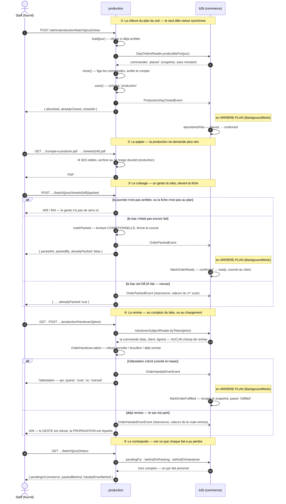

# La production tient sa propre écriture — le contexte, ses tables, ses pièces

**Décidé le 2026-09-07 · ⛔ non implémenté.** Ce document dit ce que la
production **possède** : un contexte à part entière dans `lfd-api`, ses propres
tables (schéma Postgres `production`), et les deux pièces qu'elle produit — la
feuille d'atelier d'une commande, le compte à produire d'une journée.

⚠️ **Rien de tout cela n'existe encore.** `src/` ne porte pas de dossier
`production`, et `prisma/schema/datasource.prisma` déclare quatre schémas (`public`, `growth`,
`ops`, `pim`), pas un cinquième. Ce qui suit est la cible ; l'état du jour est
décrit dès la première section, et il n'est pas flatteur.

Le cycle de vie d'une commande — l'énuméré, les transitions, qui les écrit — vit
à côté : [`../order/architecture-cycle-de-vie-commande.md`](../order/architecture-cycle-de-vie-commande.md).

---

## Ce que c'est aujourd'hui

La production **n'a rien à elle**. Elle vit dans `b2b/orders` et lit les tables
de commerce en direct : `OrderReader.listForProduction(date)` et
`findForPacking(reference)`, dont l'adaptateur compose la feuille d'atelier en
joignant `orders`, `order_lines` et `companies`.

Ça marche, et ça a une conséquence qu'on paie déjà : **le fournil dépend de la
forme des tables du commerce**. Un renommage côté commande casse un écran
d'atelier, et rien ne le dit avant l'exécution — c'est une frontière qui n'existe
que dans les noms de dossiers.

## Comment les deux contextes se parlent, et QUAND

Cinq échanges, et un seul est synchrone. Le sens compte plus que le nombre : le
fournil **demande** ce dont il a besoin et **annonce** ce qu'il a fait ; le
commerce répond et écoute. Jamais l'inverse.

### Ce que le trait pointillé veut dire, et ce qu'il coûte

`P--)B` est **asynchrone** : le bus vit en processus, l'événement n'est ni
persisté ni rejoué. La réponse part **avant** que le commerce ait écrit.

C'est le couplage minimal, choisi en connaissance de cause : chaque contexte
n'écrit que ses tables, et la production ne saurait pas dire si l'abonné a
réussi. Ce que ça coûte est réel — un container qui tombe entre ① et l'écriture
laisse des commandes `placed` sur une journée close.

Trois choses le rendent **rattrapable** plutôt que perdu :

|                                |                                                |
| ------------------------------ | ---------------------------------------------- |
| L'écriture est idempotente     | `status` contraint dans le `where`             |
| **Les trois sont rejouables**  | reclore, rescanner la feuille, rescanner le QR |
| **Les trois écarts se voient** | ⑤, un compteur par fait                        |

⚠️ **Deux des trois ne l'étaient pas jusqu'au 2026-09-08**, et c'est le défaut le
plus sérieux qu'a porté ce chantier. Le colisage et la remise refusaient le
second scan (`409`) : le refus fermait le seul geste qui répare, et aucun
compteur ne montrait l'écart. Une commande pouvait rester `confirmed` **pour
toujours**, sans que personne puisse l'apprendre autrement qu'en comparant deux
tables à la main.

Le motif de la clôture — « presser à nouveau le bouton est le rattrapage » —
existait pourtant depuis le premier jour du contexte. Il a été copié sans son
rattrapage, ce qui est la façon la plus discrète de perdre une garantie.

**La remise garde son refus**, et c'est délibéré : le sac est parti, la personne
en face doit le savoir. Ce qui a changé est qu'elle republie **avant** de
refuser. Le geste et la propagation sont deux questions ; une seule réponse les
confondait.

⚠️ Ce qu'on n'a **pas** : une file, un outbox, un rejeu automatique. Ce serait la
vraie réponse à « l'événement ne doit jamais se perdre », et c'est un chantier en
soi. L'écrire ici évite qu'on croie l'avoir.

### Le sens de chaque flèche, et pourquoi il ne s'inverse pas

- **P → B** passe toujours par un **port que la production déclare**
  (`channels/commerce/`), implémenté par le commerce, relié dans `appBootstrap`.
- **B → P** n'existe pas comme appel : le commerce **s'abonne** — aux trois
  faits : la clôture, le colisage, la remise —, il n'est jamais appelé par le
  fournil pour écrire chez lui. Le fournil ne sait donc pas qu'une commande devient `ready` ; il sait
  qu'un bac est fait, et c'est le commerce qui en tire un statut.
- `lint:context-boundaries` tient les deux : `production → b2b` est interdit, et
  `b2b → production` n'est permis que par le canal.

### Pourquoi la remise a sa propre table, et pas deux colonnes de plus

La règle de remise laisse passer une commande encore `placed` — refuser
renverrait un client physiquement présent, colis prêt, parce qu'un écran
d'atelier n'a pas été cliqué. Une commande passée **après** la clôture de sa
journée n'est donc dans aucun plan, et reste remettable.

L'accrocher à `production_order` aurait obligé à créer sa ligne de plan à la
volée, ce qui fausserait le compte à produire — un instantané qui ne se
recalcule pas. `order_handover` est indépendante de la journée, et ses deux
uniques (`order_id`, `reference`) rendent la seconde remise **inexprimable**
plutôt que refusée par un `WHERE` : c'est le seul endroit du dossier où le
déménagement a rendu une garantie plus forte qu'elle ne l'était.

⚠️ Un événement qu'un autre bloc consomme fait **partie de la surface publiée**,
au même titre qu'un port — il vit donc dans `channels/commerce/`, pas dans
`domain/events/`. La porte l'a refusé avant qu'on n'y pense.

## Ce que la cible change

|                          | Aujourd'hui                          | Cible                             |
| ------------------------ | ------------------------------------ | --------------------------------- |
| Où vit la production     | `b2b/orders`                         | `src/production/`                 |
| Ses tables               | aucune — elle lit celles du commerce | schéma `production`               |
| La feuille d'atelier     | composée à la volée depuis `orders`  | **possédée**, produite par elle   |
| Le compte à produire     | n'existe pas                         | **possédé**, arrêté à la clôture  |
| Le lien vers la commande | jointure SQL                         | **identifiant opaque + snapshot** |
| Le colisage              | acté chez le commerce                | **acté au fournil**, puis annoncé |
| La remise                | attestée sur la ligne de commande    | **table à elle**, unicité en base |

Le dernier point est le cœur, et ce n'est pas une nouveauté : c'est **exactement
la règle que le dépôt applique déjà entre `b2b` et `pim`**. Une `OrderLine`
porte le SKU du référentiel en `string`, avec copie du nom et du prix au moment
de la commande — jamais une jointure. La production suit la même discipline vis-
à-vis du commerce.

## Quand la commande s'inscrit — et pourquoi ce moment

**À la clôture du plan du soir**, c'est-à-dire à la transition `confirmed`.

C'est le seul instant qui a un sens : avant, la commande peut encore changer et
le fournil n'a rien à en faire ; après, la journée est arrêtée et ce qu'on
fabrique ne bouge plus. C'est déjà le moment où `absorbIntoPlan` fait basculer
une journée entière, et où le compte à produire est **arrêté** — la seule pièce
de tout ce dossier qui ne se refabrique pas, parce qu'elle est un instantané.

⚠️ **À confirmer avant de bâtir.** Un fournil qui voudrait voir arriver les
commandes au fil de l'eau, avant la clôture, demanderait une inscription à la
passation et une mise à jour jusqu'à la clôture — un modèle différent, avec des
avenants à propager. Le choix ci-dessus est le plus simple qui tienne, pas le
seul possible.

## Les trois questions qu'un snapshot ouvre, et qu'il faut trancher

**Qui fait autorité en cas d'écart ?** Le commerce, toujours : c'est lui qui a
encaissé. La copie de production documente ce qu'on a **fabriqué**, pas ce qu'on
a vendu. Un écart entre les deux est un fait à lire, jamais à réconcilier en
écrasant l'un par l'autre.

**Que devient une commande annulée après la clôture ?** La production doit
l'apprendre — sans quoi le fournil produit pour rien. C'est un second fait à
propager, et il ne peut pas être une suppression : le compte à produire du jour a
déjà été arrêté, et il doit rester ce qu'il était.

**Un avenant après la clôture ?** Il n'existe pas aujourd'hui. Le jour où il
existera, il ajoutera une révision à la feuille d'atelier — comme il en ajoute
une au bon de commande — et le compte du jour, lui, ne bougera pas.

## Ce que ça implique ailleurs

- **La matrice des frontières** du `CLAUDE.md` gagne une ligne : `production`
  peut atteindre `staff` (autorisation) et `platform`, et le commerce **par
  port** — jamais l'inverse. `lint:context-boundaries` la transcrira.
- **Le schéma `production`** entre dans le `datasource`, donc
  `lint:cross-schema-join` le surveillera automatiquement — il lit les schémas
  déclarés plutôt qu'une liste écrite en dur.
- **Le bucket `production`** existe déjà en configuration, en dev et en test, et
  attend précisément ces deux pièces :
  [`../order/architecture-pieces-en-r2.md`](../order/architecture-pieces-en-r2.md). Il n'a aucun
  écrivain — ce chantier est son premier.
