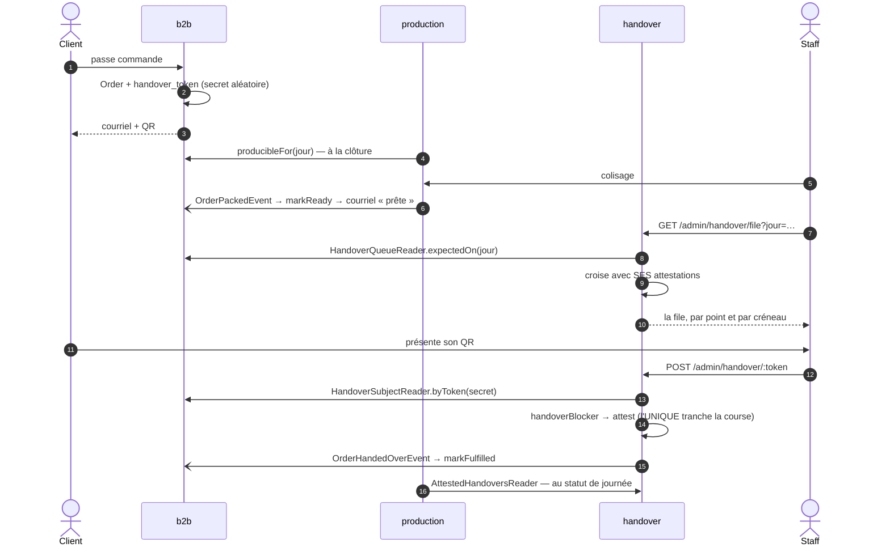

# La remise — le contexte, ce qu'il possède, et ce qu'il demande

> **État : 🟡 partiellement implémenté.** Le bloc, ses ports, sa file et son écran
> existent et tournent. **La table vit encore dans le schéma `production`** — la
> migration est la dernière tranche, et elle est bloquée (§6).
>
> Ce document décrit **ce qui est**. Le chemin qui y mène et les décisions prises
> sont dans [`plan-contexte-remise.md`](plan-contexte-remise.md) ; ce qu'on a
> trouvé en le parcourant est dans [`journal-du-contexte-remise.md`](journal-du-contexte-remise.md).
>
> ⚠️ **Ces trois documents vivent dans `documentation/production/`** alors que la
> remise n'est plus la production. C'est une incohérence assumée le temps du
> chantier : les déplacer casserait les références croisées pour un gain de
> rangement. À trancher quand la migration sera passée.

## 1. Ce que la remise est

**Le transfert de garde** — le moment où un sac change de mains, au comptoir ou
sur le pas d'une porte. Elle grave qui a remis, quand, et **comment**.

Elle est sortie du fournil le 2026-09-10, et le critère est la **clé
d'identité** : la production est en forme de **journée** (`ProductionDay`, clé
`service_day`, un événement de clôture, des instantanés figés) ; la remise est en
forme de **commande**, sans jour ni clôture.

🔴 Ce n'est pas une vue de l'esprit : c'est la migration du 2026-09-07 qui l'a
établi, en refusant d'accrocher `order_handover` à `production_order` — une
commande passée après la clôture n'est dans aucun plan et **reste remettable**.

## 2. La carte

```
src/handover/
├── domain/
│   ├── entities/order-handover.ts        l'attestation, et ses trois refus
│   ├── services/handover.ts              `handoverBlocker` — pur, sans dépendance
│   ├── ports/
│   │   ├── order-handover.repository.ts  ÉCRITURE : `findByOrderId`, `attest`
│   │   └── handover-attestations.reader.ts  LECTURE par lot
│   └── errors/handover-errors.ts
├── application/
│   ├── commands/   confirm-handover · confirm-manual-handover
│   ├── queries/    get-handover · get-handover-queue
│   └── services/handover-attestation.service.ts   le geste commun aux deux portes
├── channels/commerce/                    CE QU'ELLE PUBLIE
│   ├── handover-subject.reader.ts        une commande, par jeton ou par numéro
│   ├── handover-queue.reader.ts          la file d'un jour
│   └── order-handed-over.event.ts        le fait qu'elle annonce
├── infrastructure/                       deux adaptateurs Prisma + celui du fournil
└── http/handover.controller.ts           `/admin/handover` (+ l'ancien, déprécié)
```

## 3. Ce qu'elle possède, et ce qu'elle demande

La règle du dossier, et elle vaut au-delà de ce contexte :

> **On ne copie pas pour aller plus vite. On instantané quand la copie devient un
> fait distinct** — c'est-à-dire quand elle peut diverger de la source, et que
> cet écart veut dire quelque chose.

| Donnée                                      | Diverge ?                  | Où elle vit  |
| ------------------------------------------- | -------------------------- | ------------ |
| l'attestation — qui, quand, comment         | oui, survit à l'annulation | **sa table** |
| le contenu du sac, les créneaux, les points | non — gelé par le four     | lecture vive |
| « attendue à 7 h au Labo »                  | non — donnée du commerce   | lecture vive |
| _à venir_ : « au frais », « client appelé » | oui, ça naît au comptoir   | **sa table** |

🔴 **Pourquoi la lecture vive est sans risque, et c'est du métier** : c'est de
l'alimentaire, donc ce qui est cuit est facturé, donc le contenu d'une commande
**gèle au démarrage du four**. La remise a lieu après. Une copie et une lecture
vive donneraient la même réponse — et la copie coûterait de suivre annulations
et avenants sur un bus **ni persisté ni rejoué**.

## 4. Les trois flux, dans le temps



⚠️ **Les traits pleins sont synchrones, les `-)` sont des faits publiés** sur un
bus en processus. Les seconds ne sont ni persistés ni rejoués : l'abonné doit
être idempotent, et c'est pourquoi le service d'attestation **republie** sur ses
chemins de refus.

**Le fournil n'est nulle part dans la remise.** Entre le colisage et le scan, il
n'y a qu'un courriel au client.

## 5. Les invariants, et où ils sont tenus

| Invariant                                               | Tenu par                                             |
| ------------------------------------------------------- | ---------------------------------------------------- |
| une commande ne se remet **qu'une fois**                | 🔴 **la base** — `order_id` et `reference` `@unique` |
| une remise a toujours un **auteur**                     | l'agrégat, `OrderHandover.attest`                    |
| annulée ou brouillon ⇒ refus, **avec la phrase à lire** | `handoverBlocker`, pur                               |
| `scan` ne se confond jamais avec `manual`               | `HandoverVia`, et le fait publié le porte            |
| une remise **survit** à l'annulation de la commande     | `rehydrate` ne repasse pas la règle                  |
| la file dit `handed_over` même sur une annulée          | `stateOf`, et l'ordre de ses tests **est** la règle  |

🔴 **L'unicité est en base, pas dans une condition.** Deux postes qui scannent le
même QR à la seconde près produisent exactement une remise ; le perdant l'apprend
par `P2002`, relit l'attestation du gagnant et la **republie** — parce que le
perdant est justement celui qui peut réparer une propagation manquée.

## 6. Ce qui n'est pas fait

**La table est encore dans le schéma `production`.** Le code la vise par Prisma,
donc rien ne casse ; mais l'arborescence ment tant que la migration n'est pas
passée.

🔴 **Elle est bloquée par une vérification qui n'est pas la mienne** :
`prisma migrate deploy` génère un `DROP TABLE` (Prisma ne connaît pas
`SET SCHEMA`), et la parade — une vue de transition — n'a été éprouvée que sur
l'adapter `pg`, le transport des **tests**. La production tourne sur Accelerate.

⚠️ Et ce n'est pas qu'une affaire de données : pendant une à deux minutes après
`migrate deploy`, l'ancienne image répond encore et viserait une table absente —
un **500 au comptoir**, que la table ait été vide ou non.

**L'ancien chemin d'URL est encore servi**, déprécié. Son retrait est un
déploiement à part, et un e2e l'atteste pour qu'on ne le retire pas trop tôt.

**Les états de comptoir** — « au frais », « client appelé », « passera à 9 h » —
n'existent pas encore. Ce sont les premiers **faits propres** que la remise
devrait porter, et le §3 dit pourquoi ils lui reviennent.

## 7. Le jour où la remise devient un worker

C'est **le port** qui rend ce découpage bon marché, pas une copie de données.

| Ce qui changera                                         | Ce qui ne bougera pas                       |
| ------------------------------------------------------- | ------------------------------------------- |
| l'adaptateur : appel réseau au lieu d'un appel direct   | le port, son contrat, ses appelants         |
| la lecture vive devient chère → instantané à la clôture | la table des faits, qui voyage telle quelle |

La règle du §3 gagnera alors un second déclencheur — **on instantané aussi quand
la source devient distante** — et ce jour-là seulement, l'instantané aura la
raison qu'il n'a pas aujourd'hui. Le payer maintenant serait prendre le coût tout
de suite pour un bénéfice peut-être jamais.
